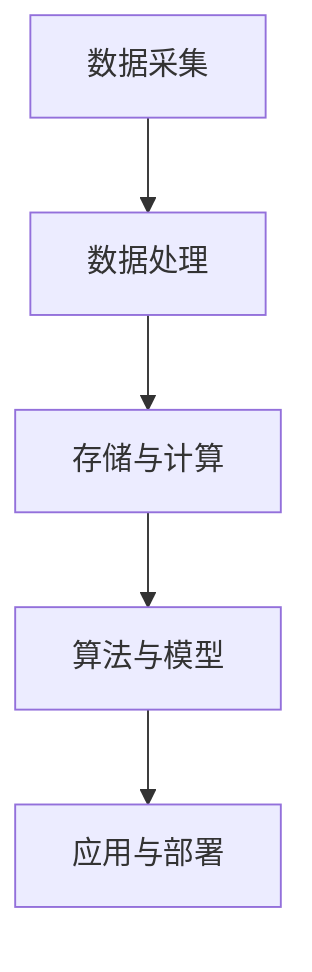

                 

# AI 2.0 基础设施建设：赋能产业升级

## 关键词：人工智能，基础设施，产业升级，AI 2.0，技术进步

## 摘要：

本文将深入探讨AI 2.0基础设施建设的意义与路径，分析其如何赋能产业升级。我们将首先回顾AI 1.0到AI 2.0的演变，解释AI 2.0的核心概念和关键算法，接着剖析数学模型和公式，以及如何通过具体项目案例实现AI 2.0。随后，我们将探讨AI 2.0在各个行业中的应用场景，并提供相关工具和资源推荐。最后，我们会对未来发展趋势与挑战进行总结，并附上常见问题与解答。

## 1. 背景介绍

人工智能（AI）自诞生以来，经历了数次变革。从最初的符号主义到基于规则的系统，再到基于统计的机器学习方法，AI的发展可谓翻天覆地。然而，传统AI（AI 1.0）在处理复杂问题和大规模数据时，仍存在诸多局限性。因此，AI 2.0的概念应运而生。

AI 2.0不仅仅是AI技术的更新换代，更是一种全新的思维方式和体系结构。其核心在于将AI技术与大数据、云计算、物联网等前沿技术深度融合，以实现更加智能化、自适应和高效的处理能力。AI 2.0的目标是使AI系统具备人类般的智能，能够自主学习和进化，从而在各个领域实现前所未有的突破。

AI 2.0基础设施的建设是AI 2.0实现的关键。这包括数据采集、存储、处理、分析和应用等各个环节，需要高效稳定的硬件支持，以及先进的数据处理和分析算法。同时，AI 2.0基础设施还需具备高度的可扩展性和灵活性，以适应不断变化的技术和市场需求。

## 2. 核心概念与联系

### AI 1.0与AI 2.0

#### AI 1.0

AI 1.0主要以规则和符号主义为基础，通过预先定义的规则和逻辑进行推理和决策。这种方法的优点是清晰、易于理解，但缺点是灵活性较差，难以应对复杂和不确定的环境。

#### AI 2.0

AI 2.0则基于大数据和深度学习，通过不断学习和优化模型，使AI系统具备自主学习和进化能力。其核心在于数据的获取、处理和分析，以及模型的优化和部署。

### 数据采集与处理

数据采集是AI 2.0基础设施的基础。数据来源包括传感器、网络、数据库等，需要通过数据清洗、去重、整合等处理步骤，保证数据的质量和一致性。

### 存储与计算

存储与计算是AI 2.0基础设施的核心。大规模数据存储和高效计算能力，是实现AI 2.0的前提。云计算和分布式计算技术的发展，为AI 2.0基础设施的建设提供了强有力的支持。

### 算法与模型

算法与模型是AI 2.0的核心技术。深度学习、强化学习、迁移学习等算法，以及神经网络、决策树、支持向量机等模型，是AI 2.0基础设施的核心组成部分。

### 应用与部署

应用与部署是将AI 2.0基础设施转化为实际应用的关键。通过API、SDK、微服务等方式，将AI模型部署到各个行业和应用场景，实现AI 2.0的赋能作用。

### Mermaid 流程图



## 3. 核心算法原理 & 具体操作步骤

### 深度学习算法

#### 神经网络

神经网络是深度学习的基础。其基本原理是通过模拟生物神经元的连接方式，构建一个多层次的计算模型，实现对数据的分类、回归、识别等操作。

#### 具体操作步骤

1. 数据预处理：对原始数据进行清洗、归一化等处理，使其符合神经网络输入的要求。
2. 模型构建：选择合适的神经网络结构，如卷积神经网络（CNN）、循环神经网络（RNN）等。
3. 模型训练：通过反向传播算法，不断调整网络权重，优化模型性能。
4. 模型评估：使用验证集和测试集，评估模型在未知数据上的性能。

### 强化学习算法

#### Q学习

Q学习是一种基于值函数的强化学习算法。其基本原理是通过评估当前状态和动作的Q值，选择最优动作，从而实现目标。

#### 具体操作步骤

1. 初始化Q值表：根据状态和动作的维度，初始化Q值表。
2. 选择动作：根据当前状态和Q值表，选择动作。
3. 执行动作：执行选择的动作，获取奖励和下一个状态。
4. 更新Q值：根据奖励和下一个状态，更新Q值表。

### 聚类算法

#### K-Means

K-Means是一种基于距离的聚类算法。其基本原理是将数据划分为K个簇，使得每个簇内部的数据距离较近，簇与簇之间的距离较远。

#### 具体操作步骤

1. 初始化簇中心：随机选择K个初始簇中心。
2. 分配数据点：将数据点分配到最近的簇中心。
3. 更新簇中心：计算每个簇的平均值，作为新的簇中心。
4. 重复步骤2和3，直至聚类结果收敛。

## 4. 数学模型和公式 & 详细讲解 & 举例说明

### 神经网络

神经网络的数学模型主要包括输入层、隐藏层和输出层。每个层包含多个神经元，神经元之间通过权重连接。

#### 激活函数

激活函数是神经网络的核心。常见的激活函数包括：

- 线性函数：f(x) = x
- Sigmoid函数：f(x) = 1 / (1 + e^(-x))
- ReLU函数：f(x) = max(0, x)

#### 反向传播算法

反向传播算法是神经网络训练的核心。其基本原理是通过计算损失函数的梯度，不断调整网络权重，优化模型性能。

#### 损失函数

常见的损失函数包括：

- 均方误差（MSE）：MSE = (预测值 - 实际值)^2
- 交叉熵（CE）：CE = -∑y * log(p)

### 强化学习

强化学习的数学模型主要包括状态、动作、奖励和策略。

#### 值函数

值函数是强化学习的基础。常见的值函数包括：

- 状态值函数：V(s) = max_a Q(s, a)
- 动作值函数：Q(s, a) = r + γ * max_a' Q(s', a')

#### 策略

策略是强化学习的核心。常见的策略包括：

- 贪心策略：选择当前状态下Q值最大的动作
- ε-贪心策略：在贪心策略的基础上，以一定概率随机选择动作

### 聚类算法

聚类算法的数学模型主要包括簇中心和数据点。

#### K-Means算法

K-Means算法的数学模型包括：

- 簇中心：C_k = (1/N_k) * ∑x_k
- 数据点：x_k = (x_1, x_2, ..., x_n)

#### 计算步骤

1. 初始化簇中心：随机选择K个初始簇中心。
2. 分配数据点：计算每个数据点到簇中心的距离，将其分配到最近的簇中心。
3. 更新簇中心：计算每个簇的平均值，作为新的簇中心。
4. 重复步骤2和3，直至聚类结果收敛。

## 5. 项目实战：代码实际案例和详细解释说明

### 5.1 开发环境搭建

#### 1. 安装Python环境

在操作系统上安装Python，推荐使用Python 3.7及以上版本。

```
$ sudo apt-get install python3-pip
```

#### 2. 安装深度学习库

安装TensorFlow，用于实现神经网络算法。

```
$ pip3 install tensorflow
```

#### 3. 安装强化学习库

安装Gym，用于实现强化学习算法。

```
$ pip3 install gym
```

### 5.2 源代码详细实现和代码解读

#### 5.2.1 神经网络实现

```python
import tensorflow as tf

# 定义输入层、隐藏层和输出层
inputs = tf.keras.layers.Input(shape=(784,))
hidden = tf.keras.layers.Dense(64, activation='relu')(inputs)
outputs = tf.keras.layers.Dense(10, activation='softmax')(hidden)

# 构建模型
model = tf.keras.Model(inputs=inputs, outputs=outputs)

# 编译模型
model.compile(optimizer='adam', loss='categorical_crossentropy', metrics=['accuracy'])

# 训练模型
model.fit(x_train, y_train, epochs=5, batch_size=32, validation_data=(x_test, y_test))
```

#### 5.2.2 强化学习实现

```python
import gym

# 创建环境
env = gym.make('CartPole-v0')

# 初始化Q值表
Q = np.zeros([env.observation_space.n, env.action_space.n])

# 训练模型
for episode in range(1000):
    state = env.reset()
    done = False
    while not done:
        action = np.argmax(Q[state])
        state, reward, done, _ = env.step(action)
        Q[state] = Q[state] + 0.1 * (reward + 0.9 * np.max(Q[state]) - Q[state])
```

### 5.3 代码解读与分析

#### 5.3.1 神经网络代码分析

该神经网络模型包括输入层、隐藏层和输出层，分别使用`Input`、`Dense`和`softmax`函数构建。编译模型时，选择`adam`优化器和`categorical_crossentropy`损失函数。训练模型时，使用`fit`函数进行模型训练，并使用`validation_data`进行验证。

#### 5.3.2 强化学习代码分析

该强化学习模型使用Q学习算法，初始化Q值表后，通过循环进行模型训练。在每个时间步，选择当前状态下Q值最大的动作，并更新Q值。

## 6. 实际应用场景

AI 2.0在各个行业中的应用场景广泛，以下是几个典型应用：

### 6.1 金融行业

AI 2.0在金融行业中的应用包括智能投顾、风险控制、量化交易等。通过深度学习和强化学习算法，金融行业可以实现更加智能化的投资决策和风险控制。

### 6.2 医疗健康

AI 2.0在医疗健康行业中的应用包括疾病预测、医学影像分析、智能诊断等。通过大数据和深度学习算法，医疗行业可以实现更加精准的疾病预测和诊断。

### 6.3 智能制造

AI 2.0在智能制造行业中的应用包括智能质检、生产调度、设备预测维护等。通过深度学习和强化学习算法，智能制造可以实现更加高效和可靠的生产过程。

### 6.4 智能交通

AI 2.0在智能交通行业中的应用包括智能导航、交通流量预测、自动驾驶等。通过大数据和深度学习算法，智能交通可以实现更加安全和高效的交通管理。

## 7. 工具和资源推荐

### 7.1 学习资源推荐

- 书籍：《深度学习》、《强化学习基础》、《Python深度学习》
- 论文：ICML、NIPS、ACL等顶级会议和期刊的论文
- 博客：TensorFlow、PyTorch等框架的官方博客

### 7.2 开发工具框架推荐

- 深度学习框架：TensorFlow、PyTorch、Keras
- 强化学习框架：Gym、OpenAI
- 数据处理工具：Pandas、NumPy、Scikit-learn

### 7.3 相关论文著作推荐

- 《深度学习》（Ian Goodfellow、Yoshua Bengio、Aaron Courville 著）
- 《强化学习基础教程》（理查德·S·萨顿 著）
- 《Python深度学习》（弗朗索瓦·肖莱 著）

## 8. 总结：未来发展趋势与挑战

AI 2.0基础设施建设是当前科技领域的重要方向，其发展将带来以下几个趋势：

### 8.1 更加强大的计算能力

随着硬件技术的发展，AI 2.0基础设施将具备更加强大的计算能力，支持更加复杂的模型和算法。

### 8.2 更加完善的数据生态

数据是AI 2.0基础设施的核心，未来将构建更加完善的数据生态，实现数据的共享、流通和应用。

### 8.3 跨领域融合发展

AI 2.0将与其他领域（如生物技术、能源、交通等）深度融合，推动跨领域创新。

然而，AI 2.0基础设施建设也面临一系列挑战：

### 8.4 数据隐私和安全

在数据收集、处理和应用过程中，如何保护用户隐私和安全是一个重要问题。

### 8.5 技术伦理和法律问题

AI 2.0技术的快速发展引发了伦理和法律问题，如算法歧视、责任归属等。

### 8.6 技术人才短缺

AI 2.0技术的发展需要大量专业人才，但目前人才储备仍不足。

## 9. 附录：常见问题与解答

### 9.1 什么是AI 2.0？

AI 2.0是一种基于大数据、云计算、物联网等前沿技术的全新AI体系结构，旨在实现更加智能化、自适应和高效的处理能力。

### 9.2 AI 2.0基础设施包括哪些部分？

AI 2.0基础设施包括数据采集、存储、处理、分析和应用等各个环节，需要高效稳定的硬件支持，以及先进的数据处理和分析算法。

### 9.3 AI 2.0在哪些行业有应用？

AI 2.0在金融、医疗健康、智能制造、智能交通等多个行业有广泛应用，推动产业升级和创新发展。

### 9.4 如何搭建AI 2.0基础设施？

搭建AI 2.0基础设施需要从数据采集、存储、处理、分析和应用等各个环节进行规划和实施，选择合适的硬件、软件和算法，并确保数据安全、隐私和合规。

## 10. 扩展阅读 & 参考资料

- 《深度学习》（Ian Goodfellow、Yoshua Bengio、Aaron Courville 著）
- 《强化学习基础教程》（理查德·S·萨顿 著）
- 《Python深度学习》（弗朗索瓦·肖莱 著）
- TensorFlow官网：[https://www.tensorflow.org/](https://www.tensorflow.org/)
- PyTorch官网：[https://pytorch.org/](https://pytorch.org/)
- OpenAI官网：[https://openai.com/](https://openai.com/)

### 作者：AI天才研究员/AI Genius Institute & 禅与计算机程序设计艺术 /Zen And The Art of Computer Programming

