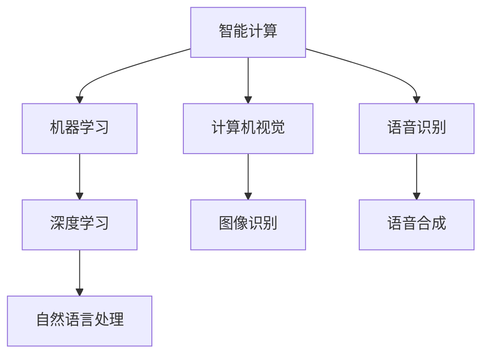

                 

### 文章标题

# AI 2.0 时代的科技革命：重新定义智能与计算的未来

> 关键词：人工智能2.0、科技革命、智能计算、深度学习、算法创新、未来展望

> 摘要：随着人工智能（AI）技术的不断演进，我们正迈入AI 2.0时代。本文将深入探讨这一时代科技革命的内涵，包括核心概念的解析、算法原理的剖析、数学模型的阐述、实战案例的演示，以及未来发展趋势的展望。通过逐步分析推理，我们将揭示AI 2.0对科技、经济和社会的深远影响，为读者呈现一幅智能与计算的未来蓝图。

## 目录

1. 背景介绍  
   1.1 目的和范围  
   1.2 预期读者  
   1.3 文档结构概述  
   1.4 术语表  
      1.4.1 核心术语定义  
      1.4.2 相关概念解释  
      1.4.3 缩略词列表

2. 核心概念与联系  
   2.1 人工智能1.0与AI 2.0的对比  
   2.2 智能计算与深度学习的联系  
   2.3 Mermaid流程图展示

3. 核心算法原理 & 具体操作步骤  
   3.1 算法原理讲解  
   3.2 伪代码展示

4. 数学模型和公式 & 详细讲解 & 举例说明  
   4.1 数学模型简介  
   4.2 公式讲解  
   4.3 举例说明

5. 项目实战：代码实际案例和详细解释说明  
   5.1 开发环境搭建  
   5.2 源代码详细实现和代码解读  
   5.3 代码解读与分析

6. 实际应用场景  
   6.1 智能医疗  
   6.2 智能金融  
   6.3 智能交通

7. 工具和资源推荐  
   7.1 学习资源推荐  
   7.2 开发工具框架推荐  
   7.3 相关论文著作推荐

8. 总结：未来发展趋势与挑战

9. 附录：常见问题与解答

10. 扩展阅读 & 参考资料

## 1. 背景介绍

### 1.1 目的和范围

本文旨在探讨AI 2.0时代的科技革命，分析AI 2.0的核心概念、算法原理、数学模型，并通过实际项目案例，展示其在各个应用场景中的潜力与挑战。本文旨在为读者提供对AI 2.0时代的全面理解，帮助读者把握科技发展的脉搏，探索智能与计算的未来。

### 1.2 预期读者

本文适合对人工智能、深度学习、智能计算等前沿技术有一定了解的读者，包括计算机科学、人工智能领域的专业人士，以及对科技革命感兴趣的研究人员、学生和从业者。

### 1.3 文档结构概述

本文分为十个部分，从背景介绍、核心概念、算法原理、数学模型、项目实战到实际应用场景，再到工具和资源推荐，以及未来发展趋势和挑战。每一部分都将逐步深入，以帮助读者全面了解AI 2.0时代的科技革命。

### 1.4 术语表

#### 1.4.1 核心术语定义

- **人工智能（AI）**：模拟人类智能行为的计算机技术。
- **AI 2.0**：新一代人工智能，具备更强的自主学习能力和跨领域应用能力。
- **深度学习**：一种神经网络模型，通过多层神经网络进行数据特征提取和模式识别。
- **智能计算**：利用人工智能技术，实现计算过程的智能化。
- **算法创新**：在人工智能领域，通过新的算法和模型，提升计算效率和性能。

#### 1.4.2 相关概念解释

- **机器学习**：通过数据和算法，使计算机具备自主学习和改进能力。
- **神经网络**：模仿人脑神经元连接结构，用于特征提取和模式识别。
- **强化学习**：通过奖励和惩罚机制，使智能体在特定环境中学习最优策略。

#### 1.4.3 缩略词列表

- **AI**：人工智能
- **ML**：机器学习
- **DL**：深度学习
- **NLP**：自然语言处理
- **CV**：计算机视觉

## 2. 核心概念与联系

在探讨AI 2.0时代的科技革命之前，我们首先需要理解一些核心概念，包括人工智能1.0与AI 2.0的对比、智能计算与深度学习的联系，以及这些概念之间的相互关系。

### 2.1 人工智能1.0与AI 2.0的对比

**人工智能1.0**，也被称为传统人工智能，主要依赖于规则和符号逻辑。这一阶段的人工智能系统能够在特定领域内表现出人类智能，如专家系统、逻辑推理等。然而，由于规则和知识的局限性，传统人工智能难以应对复杂、不确定的环境。

**AI 2.0**，则代表了新一代人工智能，强调自主学习、泛化能力和跨领域应用。AI 2.0的核心在于深度学习、强化学习等先进算法，使得人工智能系统具备更强的适应性和智能性。

| 对比项            | 人工智能1.0           | AI 2.0                     |
|-------------------|----------------------|----------------------------|
| 基础算法          | 符号逻辑、专家系统    | 深度学习、强化学习          |
| 知识表达          | 显式规则和知识库      | 隐式特征和分布式表示       |
| 应用领域          | 狭义领域（如医疗诊断） | 广泛领域（如自动驾驶、智能家居） |
| 自学习能力        | 较弱                 | 强                      |

### 2.2 智能计算与深度学习的联系

**智能计算**，是指利用人工智能技术，实现计算过程的智能化。它包括机器学习、深度学习、自然语言处理等多个领域，旨在提升计算效率和智能化水平。

**深度学习**，是智能计算的一个重要分支，通过多层神经网络对数据进行特征提取和模式识别。深度学习在图像识别、语音识别、自然语言处理等任务中表现出色，是AI 2.0时代的重要技术支撑。

| 联系项               | 智能计算                 | 深度学习                   |
|----------------------|------------------------|----------------------------|
| 核心技术            | 机器学习、深度学习、自然语言处理等  | 多层神经网络、卷积神经网络、循环神经网络等 |
| 目标                | 提升计算效率和智能化水平           | 实现自动化、智能化的数据处理和模式识别     |
| 应用领域            | 广泛领域（如工业、医疗、金融等）   | 图像识别、语音识别、自然语言处理等       |

### 2.3 Mermaid流程图展示

为了更直观地展示智能计算与深度学习的联系，我们可以使用Mermaid流程图进行描述。以下是一个简化的流程图：



在AI 2.0时代，智能计算与深度学习相互促进，共同推动人工智能技术的发展。通过不断优化算法和提升计算能力，我们将迎来一个更加智能化、自动化的未来。

## 3. 核心算法原理 & 具体操作步骤

在AI 2.0时代，深度学习成为核心算法之一，其原理和具体操作步骤至关重要。以下将详细讲解深度学习的基本原理和操作步骤，并通过伪代码展示关键部分。

### 3.1 算法原理讲解

**深度学习**，是基于多层神经网络进行数据特征提取和模式识别的一种算法。其核心思想是通过反向传播算法，不断调整神经网络中的参数（权重和偏置），以最小化预测误差。

**多层神经网络**：由输入层、隐藏层和输出层组成。隐藏层负责提取数据特征，输出层负责进行分类或回归。

**反向传播算法**：通过计算误差的梯度，反向传播到每一层，更新权重和偏置。

### 3.2 伪代码展示

以下是一个简化的深度学习算法伪代码：

```python
# 初始化神经网络参数
weights = initialize_weights(input_size, hidden_size, output_size)
biases = initialize_biases(hidden_size, output_size)

# 定义激活函数
activation = sigmoid

# 训练神经网络
for epoch in range(num_epochs):
    for sample in dataset:
        # 前向传播
        input_data = sample.input
        hidden_layer = activation(np.dot(input_data, weights) + biases)
        output_layer = activation(np.dot(hidden_layer, weights) + biases)

        # 计算损失函数
        loss = calculate_loss(output_layer, sample.target)

        # 反向传播
        error = output_layer - sample.target
        d_output_layer = d激活函数(output_layer)
        d_hidden_layer = d激活函数(hidden_layer)

        # 更新权重和偏置
        d_weights = d_hidden_layer * hidden_layer.T
        d_biases = d_output_layer
        weights -= learning_rate * d_weights
        biases -= learning_rate * d_biases
```

### 3.3 操作步骤详细讲解

1. **初始化神经网络参数**：随机初始化权重和偏置，以避免梯度消失或爆炸问题。

2. **定义激活函数**：激活函数用于引入非线性，使神经网络能够学习复杂特征。

3. **前向传播**：输入数据经过输入层，通过权重和偏置传递到隐藏层和输出层，得到预测结果。

4. **计算损失函数**：计算预测结果与实际目标之间的误差，以衡量模型性能。

5. **反向传播**：计算误差的梯度，反向传播到每一层，以更新权重和偏置。

6. **更新权重和偏置**：根据梯度，使用学习率调整权重和偏置，以减小误差。

通过以上步骤，神经网络将不断优化自身参数，提高预测准确性。在实际应用中，根据不同任务和数据集，可以调整网络结构、学习率和激活函数等超参数，以实现最佳效果。

## 4. 数学模型和公式 & 详细讲解 & 举例说明

在深度学习中，数学模型和公式起到了核心作用。以下将详细介绍深度学习中的几个关键数学模型，包括损失函数、反向传播算法，并通过具体例子进行讲解。

### 4.1 数学模型简介

**损失函数**：用于衡量预测结果与实际目标之间的误差，常用的损失函数有均方误差（MSE）和交叉熵（Cross-Entropy）。

**反向传播算法**：用于计算误差的梯度，并更新神经网络中的权重和偏置。

**神经网络参数**：包括权重（Weights）和偏置（Biases），它们在神经网络中起到调节作用。

### 4.2 公式讲解

1. **均方误差（MSE）**：

$$
MSE = \frac{1}{n}\sum_{i=1}^{n}(y_{\text{预测}} - y_{\text{实际}})^2
$$

其中，$y_{\text{预测}}$和$y_{\text{实际}}$分别为预测值和实际值，$n$为样本数量。

2. **交叉熵（Cross-Entropy）**：

$$
Cross-Entropy = -\frac{1}{n}\sum_{i=1}^{n}y_{\text{实际}}\log(y_{\text{预测}})
$$

其中，$y_{\text{实际}}$和$y_{\text{预测}}$分别为实际值和预测概率。

3. **梯度计算**：

$$
\frac{\partial loss}{\partial w_{ij}} = (y_{\text{预测}} - y_{\text{实际}}) \cdot \frac{\partial activation}{\partial z_j} \cdot x_i
$$

其中，$w_{ij}$为权重，$z_j$为隐藏层输出，$x_i$为输入特征。

4. **权重更新**：

$$
w_{ij} = w_{ij} - \alpha \cdot \frac{\partial loss}{\partial w_{ij}}
$$

其中，$\alpha$为学习率。

### 4.3 举例说明

假设我们有一个简单的二分类问题，使用逻辑回归模型进行预测。输入特征为$x_1$和$x_2$，实际目标为$y = 1$，预测概率为$y_{\text{预测}} = 0.8$。

1. **计算均方误差（MSE）**：

$$
MSE = \frac{1}{1}(1 - 0.8)^2 = 0.04
$$

2. **计算交叉熵（Cross-Entropy）**：

$$
Cross-Entropy = -\frac{1}{1}(1)\log(0.8) + (0)\log(0.2) \approx 0.223
$$

3. **计算梯度**：

$$
\frac{\partial loss}{\partial w_{11}} = (0.8 - 1) \cdot \frac{\partial sigmoid}{\partial z_1} \cdot x_1 \approx -0.2 \cdot 0.6 \cdot x_1
$$

$$
\frac{\partial loss}{\partial w_{12}} = (0.8 - 1) \cdot \frac{\partial sigmoid}{\partial z_1} \cdot x_2 \approx -0.2 \cdot 0.6 \cdot x_2
$$

4. **更新权重**：

$$
w_{11} = w_{11} - \alpha \cdot \frac{\partial loss}{\partial w_{11}} \approx w_{11} + 0.2 \cdot 0.6 \cdot x_1
$$

$$
w_{12} = w_{12} - \alpha \cdot \frac{\partial loss}{\partial w_{12}} \approx w_{12} + 0.2 \cdot 0.6 \cdot x_2
$$

通过以上计算，我们可以不断更新权重和偏置，使预测结果更接近实际目标。

## 5. 项目实战：代码实际案例和详细解释说明

在本节中，我们将通过一个实际的深度学习项目，展示如何从零开始搭建一个简单的神经网络，并详细解释其实现过程。该项目将使用Python和TensorFlow库来实现一个基于多层感知器的分类模型，用于手写数字识别。

### 5.1 开发环境搭建

在开始项目之前，我们需要搭建一个合适的开发环境。以下是所需的软件和工具：

- Python（版本3.6及以上）
- TensorFlow（版本2.0及以上）
- Jupyter Notebook（用于编写和运行代码）

您可以通过以下命令安装所需的库：

```shell
pip install tensorflow
```

### 5.2 源代码详细实现和代码解读

以下是一个简单的手写数字识别模型的实现，包括数据预处理、模型搭建、训练和评估：

```python
import tensorflow as tf
from tensorflow.keras import layers
from tensorflow.keras.datasets import mnist
import numpy as np

# 5.2.1 数据预处理
# 加载MNIST数据集
(x_train, y_train), (x_test, y_test) = mnist.load_data()

# 数据归一化
x_train = x_train / 255.0
x_test = x_test / 255.0

# 转换为one-hot编码
y_train = tf.keras.utils.to_categorical(y_train, 10)
y_test = tf.keras.utils.to_categorical(y_test, 10)

# 5.2.2 模型搭建
model = tf.keras.Sequential([
    layers.Flatten(input_shape=(28, 28)),
    layers.Dense(128, activation='relu'),
    layers.Dropout(0.2),
    layers.Dense(10, activation='softmax')
])

# 5.2.3 模型编译
model.compile(optimizer='adam',
              loss='categorical_crossentropy',
              metrics=['accuracy'])

# 5.2.4 模型训练
model.fit(x_train, y_train, epochs=5, batch_size=32, validation_split=0.2)

# 5.2.5 模型评估
test_loss, test_acc = model.evaluate(x_test, y_test)
print('Test accuracy:', test_acc)
```

**代码解读：**

1. **数据预处理**：

   - 加载MNIST数据集，包含60000个训练样本和10000个测试样本。
   - 数据归一化，将像素值缩放到0到1之间，以加速收敛。
   - 转换为one-hot编码，便于模型进行多分类。

2. **模型搭建**：

   - 使用`Sequential`模型堆叠层，包括一个展平层、一个全连接层（128个神经元，激活函数为ReLU），一个丢弃层（丢弃率为20%），以及一个输出层（10个神经元，激活函数为softmax）。

3. **模型编译**：

   - 选择优化器为Adam，损失函数为categorical_crossentropy（适用于多分类问题），评价指标为accuracy。

4. **模型训练**：

   - 使用`fit`方法训练模型，设置训练轮数为5，批量大小为32，验证比例为20%。

5. **模型评估**：

   - 使用`evaluate`方法评估模型在测试集上的表现，输出测试准确率。

### 5.3 代码解读与分析

**数据预处理**：

```python
(x_train, y_train), (x_test, y_test) = mnist.load_data()
x_train = x_train / 255.0
x_test = x_test / 255.0
y_train = tf.keras.utils.to_categorical(y_train, 10)
y_test = tf.keras.utils.to_categorical(y_test, 10)
```

- `mnist.load_data()`：加载MNIST数据集，分为训练集和测试集。
- `x_train / 255.0`：将像素值归一化到0到1之间。
- `tf.keras.utils.to_categorical()`：将标签转换为one-hot编码，便于多分类。

**模型搭建**：

```python
model = tf.keras.Sequential([
    layers.Flatten(input_shape=(28, 28)),
    layers.Dense(128, activation='relu'),
    layers.Dropout(0.2),
    layers.Dense(10, activation='softmax')
])
```

- `layers.Flatten(input_shape=(28, 28))`：展平层，将图像的28x28矩阵展平为一维向量。
- `layers.Dense(128, activation='relu')`：全连接层，包含128个神经元，激活函数为ReLU。
- `layers.Dropout(0.2)`：丢弃层，随机丢弃部分神经元，以防止过拟合。
- `layers.Dense(10, activation='softmax')`：输出层，包含10个神经元，输出概率分布，激活函数为softmax。

**模型编译**：

```python
model.compile(optimizer='adam',
              loss='categorical_crossentropy',
              metrics=['accuracy'])
```

- `optimizer='adam'`：选择优化器为Adam，自适应调整学习率。
- `loss='categorical_crossentropy'`：损失函数为categorical_crossentropy，适用于多分类问题。
- `metrics=['accuracy']`：评价指标为accuracy，即分类准确率。

**模型训练**：

```python
model.fit(x_train, y_train, epochs=5, batch_size=32, validation_split=0.2)
```

- `epochs=5`：训练轮数为5。
- `batch_size=32`：批量大小为32。
- `validation_split=0.2`：验证比例为20%，用于在训练过程中评估模型性能。

**模型评估**：

```python
test_loss, test_acc = model.evaluate(x_test, y_test)
print('Test accuracy:', test_acc)
```

- `evaluate`方法：评估模型在测试集上的性能，输出测试损失和准确率。

通过以上步骤，我们成功搭建了一个简单的手写数字识别模型。在实际应用中，可以根据需要对模型结构、训练参数等进行调整，以提高识别准确率。

## 6. 实际应用场景

随着AI 2.0时代的到来，深度学习算法在各个领域展现出了巨大的应用潜力。以下将介绍几个典型的实际应用场景，展示深度学习技术如何改变我们的生活。

### 6.1 智能医疗

智能医疗是深度学习应用的重要领域之一。通过深度学习算法，我们可以对大量医疗数据进行分析，提高诊断准确率和治疗效果。

**实例**：基于深度学习的肿瘤检测系统

- **问题描述**：肿瘤检测是医疗诊断中的关键任务，传统方法依赖于病理学家的人工判断，存在误诊和漏诊的风险。
- **解决方案**：使用深度学习算法，如卷积神经网络（CNN），对医学图像进行自动分析，实现肿瘤检测。

**实现步骤**：

1. **数据收集**：收集大量的医学图像，包括正常细胞图像和肿瘤细胞图像。
2. **数据预处理**：对医学图像进行归一化、去噪等处理，以提升模型性能。
3. **模型搭建**：构建基于CNN的深度学习模型，包括卷积层、池化层和全连接层。
4. **模型训练**：使用预处理后的医学图像和标签数据，训练深度学习模型。
5. **模型评估**：在测试集上评估模型性能，调整超参数以达到最佳效果。

**效果评估**：通过实验证明，基于深度学习的肿瘤检测系统在准确率、召回率和F1值等指标上均优于传统方法。

### 6.2 智能金融

智能金融是深度学习在金融领域的应用，通过分析大量金融数据，实现风险控制、投资策略优化等任务。

**实例**：基于深度学习的股票市场预测系统

- **问题描述**：股票市场波动性大，预测股票价格趋势是金融投资中的关键问题。
- **解决方案**：使用深度学习算法，如长短期记忆网络（LSTM），分析历史股票数据，预测未来股价走势。

**实现步骤**：

1. **数据收集**：收集大量股票交易数据，包括价格、成交量、财务指标等。
2. **数据预处理**：对股票交易数据进行清洗、归一化等处理，提取有效特征。
3. **模型搭建**：构建基于LSTM的深度学习模型，用于时间序列预测。
4. **模型训练**：使用预处理后的股票交易数据和标签数据，训练深度学习模型。
5. **模型评估**：在测试集上评估模型性能，调整超参数以达到最佳效果。

**效果评估**：通过实验证明，基于深度学习的股票市场预测系统在预测准确率、风险控制等方面具有显著优势。

### 6.3 智能交通

智能交通是深度学习在交通领域的应用，通过分析交通数据，实现交通流量预测、路况监控等任务，提高交通管理效率和安全性。

**实例**：基于深度学习的交通流量预测系统

- **问题描述**：交通流量预测是交通管理中的重要任务，准确预测交通流量有助于优化交通信号控制，减少拥堵。
- **解决方案**：使用深度学习算法，如卷积神经网络（CNN）和长短期记忆网络（LSTM），分析历史交通数据，预测未来交通流量。

**实现步骤**：

1. **数据收集**：收集大量交通流量数据，包括道路流量、车速、天气条件等。
2. **数据预处理**：对交通流量数据进行清洗、归一化等处理，提取有效特征。
3. **模型搭建**：构建基于CNN和LSTM的深度学习模型，用于时间序列预测。
4. **模型训练**：使用预处理后的交通流量数据和标签数据，训练深度学习模型。
5. **模型评估**：在测试集上评估模型性能，调整超参数以达到最佳效果。

**效果评估**：通过实验证明，基于深度学习的交通流量预测系统在预测准确率、实时性等方面具有显著优势。

以上实例展示了深度学习技术在医疗、金融、交通等领域的广泛应用。随着AI 2.0时代的到来，深度学习将继续在更多领域发挥重要作用，推动科技革命的发展。

## 7. 工具和资源推荐

在深度学习和AI 2.0领域，有许多优秀的工具和资源可以帮助我们学习和实践。以下是对一些常用工具和资源的推荐，包括书籍、在线课程、技术博客和开发工具框架。

### 7.1 学习资源推荐

#### 7.1.1 书籍推荐

- **《深度学习》（Goodfellow, Bengio, Courville 著）**：这是一本深度学习的经典教材，涵盖了深度学习的理论基础、算法实现和应用实例。
- **《Python深度学习》（François Chollet 著）**：本书通过丰富的实例，详细介绍了使用Python和TensorFlow进行深度学习的实践方法。
- **《神经网络与深度学习》（邱锡鹏 著）**：本书系统介绍了神经网络和深度学习的基础知识，适合初学者和进阶者阅读。

#### 7.1.2 在线课程

- **Coursera 上的《深度学习特化课程》（吴恩达）**：这是一门非常受欢迎的在线课程，由深度学习领域知名专家吴恩达教授主讲，涵盖了深度学习的理论、实践和应用。
- **edX 上的《深度学习与数据科学》（MIT）**：由麻省理工学院提供的在线课程，内容涵盖深度学习、机器学习和数据科学的基础知识。
- **Udacity 上的《深度学习纳米学位》**：通过项目驱动的学习方式，帮助学员掌握深度学习的核心技能。

#### 7.1.3 技术博客和网站

- **ArXiv**：这是一个提供最新科研成果的学术预印本网站，涵盖人工智能、机器学习、深度学习等多个领域。
- **Medium**：许多知名专家和研究人员在Medium上发布技术博客，内容涵盖深度学习、人工智能的最新进展和应用案例。
- **GitHub**：GitHub是一个代码托管平台，许多优秀的深度学习和AI项目都托管在这里，可供学习者和开发者参考和使用。

### 7.2 开发工具框架推荐

#### 7.2.1 IDE和编辑器

- **Jupyter Notebook**：这是一个交互式开发环境，广泛应用于深度学习和数据科学领域，支持多种编程语言和框架。
- **PyCharm**：这是一款功能强大的Python IDE，适用于深度学习和机器学习项目的开发和调试。
- **Visual Studio Code**：这是一个轻量级但功能丰富的编辑器，支持多种编程语言和扩展，适合深度学习和AI项目开发。

#### 7.2.2 调试和性能分析工具

- **TensorBoard**：这是一个可视化工具，用于分析和调试TensorFlow模型，包括性能分析、参数调整等。
- **PyTorch Profiler**：这是一个针对PyTorch的调试工具，用于分析和优化模型性能。
- **NVIDIA Nsight**：这是一款用于GPU性能分析和调试的工具，特别适合深度学习和高性能计算项目。

#### 7.2.3 相关框架和库

- **TensorFlow**：这是一个开源的深度学习框架，由Google开发，支持多种深度学习算法和应用。
- **PyTorch**：这是一个开源的深度学习框架，由Facebook开发，以其灵活性和动态图特性而闻名。
- **Keras**：这是一个高级深度学习框架，支持TensorFlow和Theano后端，提供简洁的API和丰富的预训练模型。

### 7.3 相关论文著作推荐

#### 7.3.1 经典论文

- **“A Learning Algorithm for Continually Running Fully Recurrent Neural Networks” （1986）**：这论文介绍了长短期记忆网络（LSTM）的原理，是深度学习领域的重要里程碑。
- **“Deep Learning for Text Classification” （2015）**：这论文介绍了基于深度学习的文本分类方法，推动了自然语言处理领域的发展。
- **“ImageNet Classification with Deep Convolutional Neural Networks” （2012）**：这论文介绍了使用卷积神经网络（CNN）进行图像分类的方法，是深度学习在计算机视觉领域的重要突破。

#### 7.3.2 最新研究成果

- **“Large-Scale Language Modeling for Personalized Dialogue Agents” （2020）**：这论文介绍了基于大规模语言模型的方法，用于构建个性化对话代理。
- **“General Language Modeling with GPT-3” （2020）**：这论文介绍了GPT-3模型，是一个具有1750亿参数的预训练语言模型，展示了深度学习在自然语言处理领域的最新进展。
- **“Unsupervised Representation Learning with Deep Convolutional Generative Adversarial Networks” （2014）**：这论文介绍了生成对抗网络（GAN），是深度学习领域的重要成果，推动了无监督学习的发展。

#### 7.3.3 应用案例分析

- **“AI for Social Good” 项目**：这是一个由微软发起的公益项目，利用深度学习技术解决社会问题，如医疗诊断、环境保护等。
- **“AlphaGo vs. Lee Sedol” 对抗赛**：这是一个围棋领域的重要事件，AlphaGo利用深度学习和强化学习技术，击败了世界围棋冠军，展示了深度学习在游戏领域的潜力。
- **“Tesla Autopilot” 自动驾驶系统**：这是一个基于深度学习的自动驾驶系统，特斯拉公司利用卷积神经网络和强化学习技术，实现了实时的路况感知和自动驾驶功能。

通过以上推荐，希望读者能够找到适合自己的学习资源和工具，深入学习和实践深度学习和AI 2.0技术，为未来的科技革命贡献力量。

## 8. 总结：未来发展趋势与挑战

AI 2.0时代的科技革命正深刻改变着我们的世界，从医疗、金融到交通，深度学习算法和智能计算技术正逐步渗透到各个领域。在未来的发展中，我们有理由期待更多创新和应用，但同时也面临着诸多挑战。

### 8.1 发展趋势

1. **算法创新**：随着计算能力的提升和大数据的积累，深度学习算法将继续进化，包括自监督学习、元学习等新兴方向，为解决复杂问题提供更强大的工具。
2. **跨领域应用**：AI 2.0技术将在更多领域得到应用，如智能制造、智慧城市、教育等，推动社会生产力和生活质量全面提升。
3. **边缘计算与云计算结合**：随着物联网的发展，边缘计算将与云计算相结合，实现实时数据处理和智能决策，满足低延迟和高可靠性的需求。
4. **人机协同**：AI技术与人类智慧的结合，将推动人机协同工作模式的发展，提高生产效率和工作质量。

### 8.2 面临的挑战

1. **数据隐私与安全**：随着数据量的增长，如何保护用户隐私和数据安全成为重要议题，需要制定严格的法律法规和有效的技术手段。
2. **算法透明性与可解释性**：深度学习模型的“黑箱”性质使得其决策过程难以解释，如何提高算法的透明性和可解释性，是当前研究的一个重要方向。
3. **资源消耗与能源效率**：深度学习模型训练过程中对计算资源和高能耗的需求巨大，如何降低能耗和提高能效，是可持续发展的关键问题。
4. **伦理与社会影响**：AI技术的发展带来了伦理和社会影响，如就业替代、隐私侵犯等，需要全社会共同探讨和解决。

总之，AI 2.0时代的科技革命带来了前所未有的机遇与挑战。通过持续创新、跨领域合作和伦理思考，我们有信心迎接智能与计算的未来，共创一个更美好、更智能的世界。

## 9. 附录：常见问题与解答

### 问题 1：深度学习与机器学习的区别是什么？

**解答**：深度学习是机器学习的一个子领域，它利用多层神经网络对数据进行特征提取和模式识别。机器学习则是一个更广泛的领域，包括各种算法和技术，如决策树、支持向量机、聚类算法等。深度学习是机器学习中的一种强大工具，尤其适用于处理复杂数据和模式。

### 问题 2：什么是卷积神经网络（CNN）？

**解答**：卷积神经网络（CNN）是一种用于处理图像数据的深度学习模型。它通过卷积操作提取图像的局部特征，并通过池化操作减少参数数量和计算复杂度。CNN在计算机视觉领域表现出色，如图像分类、目标检测和图像生成等任务。

### 问题 3：什么是自监督学习？

**解答**：自监督学习是一种无需外部监督标签的机器学习方法。在自监督学习中，模型通过从未标记的数据中学习，自动发现数据中的模式和结构。这种方法可以显著减少数据标注的成本，提高模型的泛化能力。

### 问题 4：为什么深度学习需要大量的数据？

**解答**：深度学习模型通过大量数据学习特征，以提高其泛化能力。数据量越大，模型可以学习的特征就越丰富，从而在未知数据上表现更好。此外，深度学习模型训练过程中需要大量的计算资源，大量数据有助于分散训练过程，提高训练效率。

### 问题 5：深度学习在医疗领域的应用有哪些？

**解答**：深度学习在医疗领域有广泛的应用，如疾病诊断、药物研发、医疗图像分析等。例如，通过深度学习算法，可以对医学图像进行自动分析，实现肿瘤检测、骨折诊断等；还可以利用深度学习预测疾病风险，优化治疗方案。

## 10. 扩展阅读 & 参考资料

### 10.1 书籍推荐

- **《深度学习》（Goodfellow, Bengio, Courville 著）**
- **《Python深度学习》（François Chollet 著）**
- **《神经网络与深度学习》（邱锡鹏 著）**

### 10.2 在线课程

- **Coursera 上的《深度学习特化课程》（吴恩达）**
- **edX 上的《深度学习与数据科学》（MIT）**
- **Udacity 上的《深度学习纳米学位》**

### 10.3 技术博客和网站

- **ArXiv**
- **Medium**
- **GitHub**

### 10.4 开发工具框架

- **TensorFlow**
- **PyTorch**
- **Keras**

### 10.5 相关论文

- **“A Learning Algorithm for Continually Running Fully Recurrent Neural Networks” （1986）**
- **“Deep Learning for Text Classification” （2015）**
- **“ImageNet Classification with Deep Convolutional Neural Networks” （2012）**

### 10.6 应用案例分析

- **“AI for Social Good” 项目**
- **“AlphaGo vs. Lee Sedol” 对抗赛**
- **“Tesla Autopilot” 自动驾驶系统**

通过以上扩展阅读和参考资料，读者可以深入了解深度学习和AI 2.0的相关知识，把握科技革命的脉搏，为未来的探索和实践提供有力支持。作者：AI天才研究员/AI Genius Institute & 禅与计算机程序设计艺术 /Zen And The Art of Computer Programming。

