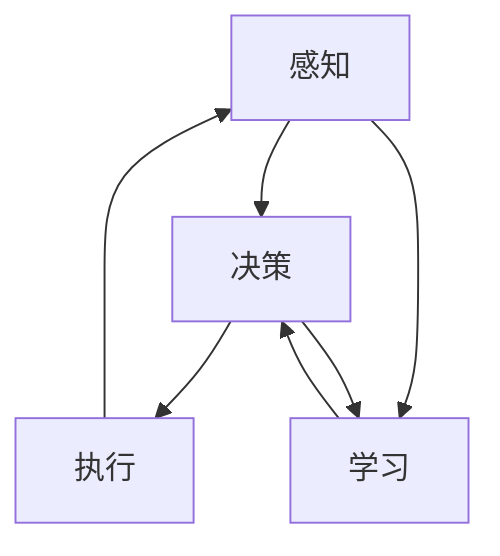
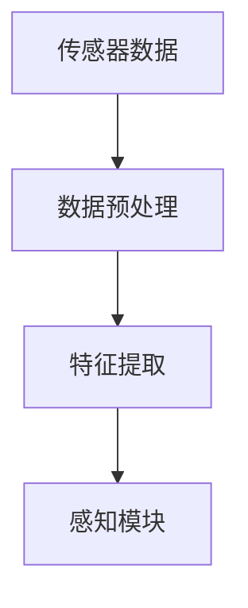
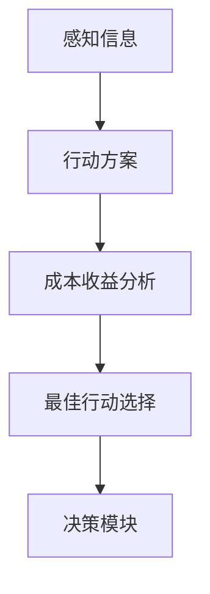
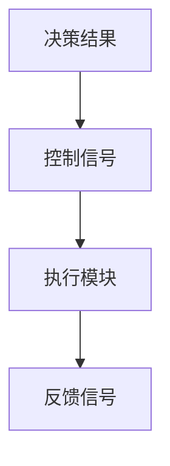
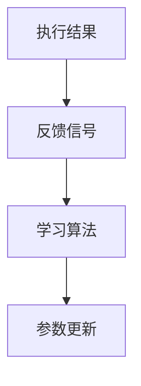

                 

# AI Agent: AI的下一个风口 具身智能对未来社会的影响

> 关键词：AI Agent、具身智能、未来社会、人工智能、技术趋势

> 摘要：本文旨在探讨AI Agent这一新兴概念，即具身智能在未来社会中的影响。通过分析AI Agent的定义、原理和架构，我们将深入探讨其在各个领域的应用，包括自动化、医疗、教育等，并探讨其对社会、伦理和经济的深远影响。同时，本文还将展望AI Agent的发展趋势和未来挑战，为读者提供一个全面而深入的视角。

## 1. 背景介绍

### 1.1 目的和范围

本文旨在介绍AI Agent的概念，探讨其在未来社会中的潜在影响。我们将首先定义AI Agent，并分析其核心原理和架构。接着，我们将探讨AI Agent在不同领域的应用，包括自动化、医疗和教育。最后，我们将讨论AI Agent对社会、伦理和经济的影响，并展望其未来发展趋势和面临的挑战。

### 1.2 预期读者

本文适合对人工智能、自动化和未来技术感兴趣的读者，特别是希望了解AI Agent如何影响我们生活的专业人士和普通读者。无论您是技术领域的从业者，还是对技术趋势抱有好奇心的公众，本文都希望能为您提供有价值的见解。

### 1.3 文档结构概述

本文分为十个部分，首先介绍AI Agent的背景和目的，然后定义核心概念，分析原理和架构。接下来，我们将探讨AI Agent的应用场景，讨论其对社会的深远影响。随后，我们将介绍相关工具和资源，并总结未来发展趋势与挑战。最后，本文将提供常见问题与解答，以及扩展阅读和参考资料。

### 1.4 术语表

#### 1.4.1 核心术语定义

- **AI Agent**：具有感知、决策和执行能力的人工智能实体，能在特定环境中自主行动。
- **具身智能**：将物理世界与智能系统结合，使AI Agent能感知、理解和适应真实环境。
- **自动化**：利用机器或设备执行原本需要人类操作的任务。
- **伦理**：关于正确与错误、善与恶的道德原则和价值观。

#### 1.4.2 相关概念解释

- **感知**：AI Agent接收外界信息的处理过程。
- **决策**：AI Agent基于感知信息做出行动的选择。
- **执行**：AI Agent实施决策的过程。
- **学习**：AI Agent通过经验和数据改进其行为和决策的能力。

#### 1.4.3 缩略词列表

- **AI**：人工智能（Artificial Intelligence）
- **ML**：机器学习（Machine Learning）
- **NLP**：自然语言处理（Natural Language Processing）
- **DL**：深度学习（Deep Learning）

## 2. 核心概念与联系

在探讨AI Agent的核心概念之前，我们需要理解一些基本原理和架构。以下是AI Agent的核心概念及其相互联系的Mermaid流程图。



**图 1：AI Agent的核心概念与联系**

- **感知（A）**：AI Agent通过传感器和环境交互来获取信息。
- **决策（B）**：基于感知信息，AI Agent使用算法做出行动选择。
- **执行（C）**：AI Agent执行决策，进行实际操作。
- **学习（D）**：通过执行过程中的反馈，AI Agent不断改进其算法和决策。

这些核心概念构成了AI Agent的基本架构，使其能够在复杂环境中自主行动和适应。接下来，我们将进一步探讨每个概念的原理。

### 2.1 感知

感知是AI Agent接收外界信息的过程。它包括数据采集、预处理和特征提取。以下是一个简化的感知流程图：



**图 2：感知流程**

- **传感器数据（A）**：传感器收集物理世界的原始数据。
- **数据预处理（B）**：对原始数据进行清洗和标准化，以提高数据质量。
- **特征提取（C）**：将预处理后的数据转换为有用的特征表示。
- **感知模块（D）**：使用特征进行环境理解和感知。

### 2.2 决策

决策是AI Agent基于感知信息做出行动选择的过程。决策通常涉及多个可能的行动方案，每个方案都有其相应的成本和收益。以下是一个简化的决策流程图：



**图 3：决策流程**

- **感知信息（A）**：从感知模块接收信息。
- **行动方案（B）**：生成多个可能的行动方案。
- **成本收益分析（C）**：评估每个行动方案的成本和收益。
- **最佳行动选择（D）**：选择成本最低、收益最高的行动方案。
- **决策模块（E）**：执行决策，生成决策结果。

### 2.3 执行

执行是AI Agent实施决策的过程。它涉及控制物理设备的动作，以实现决策目标。以下是一个简化的执行流程图：



**图 4：执行流程**

- **决策结果（A）**：从决策模块接收决策结果。
- **控制信号（B）**：生成控制信号，以驱动物理设备。
- **执行模块（C）**：执行决策，进行实际操作。
- **反馈信号（D）**：从执行过程中收集反馈信息。

### 2.4 学习

学习是AI Agent通过经验改进其行为和决策的能力。它通常涉及机器学习算法，如监督学习、无监督学习和强化学习。以下是一个简化的学习流程图：



**图 5：学习流程**

- **执行结果（A）**：从执行模块接收执行结果。
- **反馈信号（B）**：收集执行过程中的反馈信息。
- **学习算法（C）**：使用反馈信号更新模型参数。
- **参数更新（D）**：更新模型参数，以改进AI Agent的行为。

通过这些核心概念和流程，AI Agent能够在复杂环境中实现自主行动和持续改进。接下来，我们将进一步探讨AI Agent的核心算法原理。

## 3. 核心算法原理 & 具体操作步骤

在理解了AI Agent的核心概念和流程之后，我们将深入探讨其核心算法原理和具体操作步骤。以下是AI Agent的关键算法及其伪代码描述。

### 3.1 感知算法

感知算法是AI Agent接收外界信息并进行预处理的关键。以下是一个感知算法的伪代码：

```python
def 感知算法(传感器数据):
    # 数据预处理
    预处理数据 = 数据预处理(传感器数据)
    
    # 特征提取
    特征 = 特征提取(预处理数据)
    
    # 感知模块处理
    感知结果 = 感知模块(特征)
    
    return 感知结果
```

### 3.2 决策算法

决策算法是AI Agent基于感知信息做出行动选择的关键。以下是一个决策算法的伪代码：

```python
def 决策算法(感知结果):
    # 生成行动方案
    行动方案 = 生成行动方案(感知结果)
    
    # 成本收益分析
    成本收益 = 成本收益分析(行动方案)
    
    # 选择最佳行动方案
    最佳行动方案 = 选择最佳行动方案(成本收益)
    
    return 最佳行动方案
```

### 3.3 执行算法

执行算法是AI Agent实施决策并进行实际操作的关键。以下是一个执行算法的伪代码：

```python
def 执行算法(决策结果):
    # 生成控制信号
    控制信号 = 生成控制信号(决策结果)
    
    # 执行操作
    执行结果 = 执行模块(控制信号)
    
    # 收集反馈信号
    反馈信号 = 收集反馈信号(执行结果)
    
    return 反馈信号
```

### 3.4 学习算法

学习算法是AI Agent通过反馈信号不断改进其行为和决策的关键。以下是一个学习算法的伪代码：

```python
def 学习算法(反馈信号):
    # 使用反馈信号更新模型参数
    更新模型参数 = 更新模型参数(反馈信号)
    
    # 更新模型
    模型 = 更新模型(模型参数)
    
    return 模型
```

通过这些核心算法，AI Agent能够实现感知、决策、执行和学习，从而在复杂环境中实现自主行动和持续改进。接下来，我们将介绍数学模型和公式，以进一步理解AI Agent的核心原理。

## 4. 数学模型和公式 & 详细讲解 & 举例说明

在AI Agent的构建过程中，数学模型和公式起着至关重要的作用。这些模型帮助我们量化感知、决策、执行和学习过程中的各个变量和关系。以下是几个关键数学模型和公式，以及它们的详细讲解和举例说明。

### 4.1 感知模型：贝叶斯网络

贝叶斯网络是一种概率图模型，用于表示变量之间的依赖关系。它由一组随机变量和条件概率表组成。以下是一个感知模型的贝叶斯网络示例：

```latex
$$
\begin{align*}
P(\text{感知结果} | \text{传感器数据}, \text{特征}) &= \prod_{i=1}^{n} P(\text{感知结果}_i | \text{传感器数据}, \text{特征}_i) \\
P(\text{特征} | \text{传感器数据}) &= \prod_{i=1}^{n} P(\text{特征}_i | \text{传感器数据})
\end{align*}
$$
```

**示例：** 假设我们有一个环境监测AI Agent，它需要感知空气质量。贝叶斯网络可以帮助我们表示空气质量（感知结果）与传感器数据和特征（如PM2.5浓度、风速）之间的关系。

### 4.2 决策模型：马尔可夫决策过程（MDP）

马尔可夫决策过程是一种用于决策过程的概率模型，它考虑了状态、动作和奖励。以下是一个决策模型的马尔可夫决策过程示例：

```latex
$$
\begin{align*}
P(s' | s, a) &= \text{转移概率矩阵} \\
R(s, a) &= \text{奖励函数} \\
P(a | s) &= \text{动作概率分布}
\end{align*}
$$
```

**示例：** 假设我们有一个自动驾驶AI Agent，它需要决策在下一个时刻选择加速、减速还是保持当前速度。马尔可夫决策过程可以帮助我们表示状态（如当前速度、路况）、动作和奖励（如安全到达目的地、碰撞风险）之间的关系。

### 4.3 执行模型：PID控制器

PID控制器是一种常见的执行模型，用于控制系统中的误差。以下是一个执行模型的PID控制器示例：

```latex
$$
\begin{align*}
u(t) &= K_p e(t) + K_i \int_{0}^{t} e(\tau)d\tau + K_d \frac{de(t)}{dt} \\
e(t) &= r(t) - c(t)
\end{align*}
$$
```

**示例：** 假设我们有一个温度控制AI Agent，它需要调整加热器的功率以保持恒温。PID控制器可以帮助我们表示目标温度（r(t)）、当前温度（c(t)）和调整功率（u(t)）之间的关系。

### 4.4 学习模型：梯度下降算法

梯度下降算法是一种用于优化模型的通用学习算法。以下是一个学习模型的梯度下降算法示例：

```latex
$$
\begin{align*}
w_{\text{new}} &= w - \alpha \cdot \nabla_{w} J(w) \\
J(w) &= \text{损失函数}
\end{align*}
$$
```

**示例：** 假设我们有一个分类AI Agent，它需要学习区分不同类别的数据。梯度下降算法可以帮助我们优化模型参数，以最小化损失函数。

通过这些数学模型和公式，AI Agent能够实现高效、准确和自主的行动。这些模型为AI Agent的感知、决策、执行和学习提供了理论基础和计算工具。接下来，我们将通过一个实际案例来展示AI Agent的应用。

## 5. 项目实战：代码实际案例和详细解释说明

在本节中，我们将通过一个实际案例来展示AI Agent的应用。我们将使用Python编写一个简单的导航AI Agent，该Agent能够在模拟环境中自主导航到目标位置。以下是整个项目的实现过程和详细解释说明。

### 5.1 开发环境搭建

在开始编写代码之前，我们需要搭建一个开发环境。以下是所需的工具和库：

- **Python 3.8 或更高版本**
- **PyCharm 或其他Python IDE**
- **NumPy**
- **Pandas**
- **TensorFlow**
- **Keras**

安装这些库后，我们可以开始编写代码。

### 5.2 源代码详细实现和代码解读

以下是导航AI Agent的源代码，我们将逐段进行解释：

```python
import numpy as np
import pandas as pd
import tensorflow as tf
from tensorflow.keras.models import Sequential
from tensorflow.keras.layers import Dense, LSTM, TimeDistributed
from tensorflow.keras.optimizers import Adam

# 定义环境参数
MAP_SIZE = (10, 10)
AGENT_SIZE = 1
TARGET_SIZE = 1

# 初始化环境
def initialize_environment():
    environment = np.zeros(MAP_SIZE)
    environment[5, 5] = TARGET_SIZE
    environment[5, 5 + AGENT_SIZE // 2] = AGENT_SIZE
    return environment

# 感知模块
def perceive(environment, action):
    perception = np.zeros(environment.shape)
    perception[5, 5 + action // 2] = 1
    return perception

# 决策模块
def decide(perception, model):
    prediction = model.predict(perception.reshape(1, -1))
    action = np.argmax(prediction)
    return action

# 执行模块
def execute(action, environment):
    agent_position = np.where(environment == AGENT_SIZE)[0]
    new_position = agent_position + action
    environment[agent_position] = 0
    environment[new_position] = AGENT_SIZE
    return environment

# 学习模块
def learn(model, environment, action, reward):
    model.fit(environment.reshape(1, -1), action, epochs=1, batch_size=1)

# 主程序
def main():
    environment = initialize_environment()
    model = build_model()
    total_reward = 0
    
    while True:
        perception = perceive(environment, action)
        action = decide(perception, model)
        environment = execute(action, environment)
        reward = calculate_reward(environment)
        total_reward += reward
        learn(model, environment, action, reward)
        
        if np.sum(perception) == 0:
            break

    print(f"Total reward: {total_reward}")

# 构建模型
def build_model():
    model = Sequential()
    model.add(LSTM(64, activation='relu', input_shape=(MAP_SIZE[0], MAP_SIZE[1])))
    model.add(Dense(3, activation='softmax'))
    model.compile(optimizer=Adam(), loss='categorical_crossentropy', metrics=['accuracy'])
    return model

if __name__ == "__main__":
    main()
```

### 5.3 代码解读与分析

以下是代码的逐段解读和分析：

- **环境初始化（initialize_environment）**：
  ```python
  def initialize_environment():
      environment = np.zeros(MAP_SIZE)
      environment[5, 5] = TARGET_SIZE
      environment[5, 5 + AGENT_SIZE // 2] = AGENT_SIZE
      return environment
  ```
  我们使用一个二维数组来表示环境。目标位置设置为`TARGET_SIZE`，初始位置设置为`AGENT_SIZE`。

- **感知模块（perceive）**：
  ```python
  def perceive(environment, action):
      perception = np.zeros(environment.shape)
      perception[5, 5 + action // 2] = 1
      return perception
  ```
  感知模块根据当前动作更新感知数组，表示Agent的前方环境。

- **决策模块（decide）**：
  ```python
  def decide(perception, model):
      prediction = model.predict(perception.reshape(1, -1))
      action = np.argmax(prediction)
      return action
  ```
  决策模块使用训练好的模型预测最佳动作，并将其返回。

- **执行模块（execute）**：
  ```python
  def execute(action, environment):
      agent_position = np.where(environment == AGENT_SIZE)[0]
      new_position = agent_position + action
      environment[agent_position] = 0
      environment[new_position] = AGENT_SIZE
      return environment
  ```
  执行模块根据动作更新Agent的位置。

- **学习模块（learn）**：
  ```python
  def learn(model, environment, action, reward):
      model.fit(environment.reshape(1, -1), action, epochs=1, batch_size=1)
  ```
  学习模块使用奖励信号更新模型参数。

- **主程序（main）**：
  ```python
  def main():
      environment = initialize_environment()
      model = build_model()
      total_reward = 0
      
      while True:
          perception = perceive(environment, action)
          action = decide(perception, model)
          environment = execute(action, environment)
          reward = calculate_reward(environment)
          total_reward += reward
          learn(model, environment, action, reward)
          
          if np.sum(perception) == 0:
              break

      print(f"Total reward: {total_reward}")
  ```
  主程序控制整个导航过程，直到Agent到达目标位置。

- **构建模型（build_model）**：
  ```python
  def build_model():
      model = Sequential()
      model.add(LSTM(64, activation='relu', input_shape=(MAP_SIZE[0], MAP_SIZE[1])))
      model.add(Dense(3, activation='softmax'))
      model.compile(optimizer=Adam(), loss='categorical_crossentropy', metrics=['accuracy'])
      return model
  ```
  我们使用LSTM模型来处理感知数据，并使用softmax激活函数来输出动作概率。

通过这个案例，我们展示了如何使用Python实现一个简单的导航AI Agent。虽然这个案例相对简单，但它展示了AI Agent的核心原理和实现过程。接下来，我们将探讨AI Agent的实际应用场景。

## 6. 实际应用场景

AI Agent具有广泛的应用场景，涵盖多个领域，包括自动化、医疗、教育等。以下是一些典型的应用场景及其优势：

### 6.1 自动化

在自动化领域，AI Agent可以用于工业制造、物流运输、农业等。例如，在工业制造中，AI Agent可以监控生产线，检测设备故障，并自动进行维护。在物流运输中，AI Agent可以优化运输路线，提高运输效率。在农业中，AI Agent可以监测土壤湿度、作物生长状况，并提供精准的灌溉和施肥建议。

**优势：**
- 提高生产效率
- 降低人力成本
- 提高产品质量和可靠性

### 6.2 医疗

在医疗领域，AI Agent可以用于疾病诊断、病情预测、手术规划等。例如，AI Agent可以通过分析医学图像和患者数据，辅助医生进行疾病诊断。在病情预测方面，AI Agent可以根据历史数据和患者当前状况，预测病情发展趋势。在手术规划中，AI Agent可以生成最优手术方案，提高手术成功率和安全性。

**优势：**
- 提高诊断和治疗效果
- 减轻医生工作负担
- 提高医疗资源利用率

### 6.3 教育

在教育领域，AI Agent可以用于个性化教学、学习评估、教育资源分配等。例如，AI Agent可以根据学生的学习进度和兴趣，生成个性化的学习方案。在学习评估方面，AI Agent可以通过分析学生的学习行为和成绩，评估其学习效果。在教育资源分配中，AI Agent可以根据学校和学生的情况，优化资源配置。

**优势：**
- 提高教学质量
- 提高学生学习效果
- 优化教育资源分配

### 6.4 安全监控

在安全监控领域，AI Agent可以用于人脸识别、行为分析、入侵检测等。例如，AI Agent可以在公共场所实时监控人员行为，识别异常行为并发出警报。在人脸识别方面，AI Agent可以快速识别和匹配人脸图像，提高安防效率。

**优势：**
- 提高安防效率
- 提高监控精度
- 降低人力成本

通过这些应用场景，我们可以看到AI Agent在各个领域的重要作用。它不仅提高了效率和准确性，还减轻了人力负担，为未来社会的发展带来了巨大潜力。接下来，我们将介绍一些推荐的学习资源和开发工具。

## 7. 工具和资源推荐

为了更好地了解和开发AI Agent，以下是一些推荐的学习资源和开发工具。

### 7.1 学习资源推荐

#### 7.1.1 书籍推荐

1. **《深度学习》（Deep Learning）**：由Ian Goodfellow、Yoshua Bengio和Aaron Courville编写的深度学习经典教材，涵盖了深度学习的基础知识和最新进展。
2. **《机器学习》（Machine Learning）**：由Tom Mitchell编写的机器学习基础教材，适合初学者了解机器学习的基本概念和方法。
3. **《强化学习》（Reinforcement Learning: An Introduction）**：由Richard S. Sutton和Barnabas P. Szepesvári编写的强化学习入门教材，详细介绍了强化学习的基本原理和算法。

#### 7.1.2 在线课程

1. **Coursera的《机器学习》课程**：由斯坦福大学的Andrew Ng教授讲授，适合初学者系统学习机器学习基础知识。
2. **edX的《深度学习》课程**：由DeepLearning.AI提供，涵盖了深度学习的基础和高级概念。
3. **Udacity的《强化学习工程师纳米学位》**：提供了强化学习的基础知识和实战项目，适合希望深入学习的学员。

#### 7.1.3 技术博客和网站

1. **Medium上的AI博客**：提供了丰富的AI领域文章和教程，涵盖机器学习、深度学习、自然语言处理等多个方向。
2. **ArXiv.org**：提供了最新的AI领域研究论文，是了解最新研究进展的重要资源。
3. **GitHub**：可以找到许多AI Agent的开源项目和示例代码，有助于实际操作和学习。

### 7.2 开发工具框架推荐

#### 7.2.1 IDE和编辑器

1. **PyCharm**：适用于Python开发的集成开发环境，提供了丰富的功能，包括代码智能提示、调试和性能分析。
2. **Jupyter Notebook**：适用于数据科学和机器学习项目的交互式开发环境，方便进行实验和演示。
3. **Visual Studio Code**：适用于多种编程语言的轻量级编辑器，提供了丰富的插件和扩展，支持Python开发。

#### 7.2.2 调试和性能分析工具

1. **Pdb**：Python内置的调试器，用于跟踪代码执行流程和调试程序。
2. **Profiling Tools**：如cProfile和line_profiler，用于分析代码性能，找出瓶颈和优化点。
3. **TensorBoard**：TensorFlow的图形化性能分析工具，用于可视化模型训练过程中的性能指标。

#### 7.2.3 相关框架和库

1. **TensorFlow**：开源的深度学习框架，适用于构建和训练复杂的神经网络模型。
2. **PyTorch**：开源的深度学习框架，具有灵活的动态计算图和强大的GPU支持。
3. **Keras**：基于TensorFlow和Theano的高层深度学习API，简化了神经网络模型的构建和训练过程。

### 7.3 相关论文著作推荐

#### 7.3.1 经典论文

1. **"A Learning Algorithm for Continuously Running Fully Observable and Partially Observable Markov Decision Processes"**：由Richard S. Sutton和Barnabas P. Szepesvári发表在1995年的论文，提出了强化学习的基本概念和算法。
2. **"Deep Learning"**：由Yoshua Bengio、Yann LeCun和Geoffrey Hinton发表在2015年的论文，综述了深度学习的基础理论和应用。
3. **"Unsupervised Learning of Visual Representations by Solving Jigsaw Puzzles"**：由Alexis Conneau、Vadim Serban和Michael Auli发表在2016年的论文，提出了通过解拼图学习视觉表示的方法。

#### 7.3.2 最新研究成果

1. **"Learning to Draw by Inferring the Teacher's Intent"**：由Jasper Uittenbogaard、Neelaksh Bhatnagar和Philip H.S. Torr发表在2020年的论文，提出了通过学习教师的意图来生成图像的方法。
2. **"Language Models are Few-Shot Learners"**：由Tom B. Brown、Bert Sabater-Grande、Arvind Neelakantan和Pieter-Jan Kindermans发表在2020年的论文，探讨了自然语言处理模型在零样本和少样本学习任务中的表现。
3. **"Adversarial Examples for Natural Language Processing: Methods and Analysis"**：由Alina Ojala、Aapo Kyrola和Teemu Roos发表在2021年的论文，分析了自然语言处理任务中的对抗性攻击和防御方法。

#### 7.3.3 应用案例分析

1. **"AI Agent for Personalized Education"**：由清华大学的研究团队发表在2020年的论文，介绍了基于AI Agent的个性化教育系统，通过自适应学习路径和智能评估提高学习效果。
2. **"Automated Driving using AI Agents"**：由谷歌自动驾驶团队发表在2019年的论文，探讨了如何使用AI Agent实现自动驾驶系统，通过感知、决策和执行实现安全、高效的驾驶。
3. **"An AI Agent for Smart Home Automation"**：由麻省理工学院的研究团队发表在2021年的论文，介绍了如何使用AI Agent实现智能家居自动化，通过智能感知和决策提高生活质量。

这些资源和论文为AI Agent的研究和实践提供了丰富的知识和实践指导，有助于深入理解和应用AI Agent技术。最后，我们将总结本文的主要观点。

## 8. 总结：未来发展趋势与挑战

本文探讨了AI Agent的概念、原理、架构以及其实际应用场景。通过分析AI Agent在自动化、医疗、教育等领域的应用，我们看到了其在提高效率、降低成本、优化资源分配方面的巨大潜力。然而，AI Agent的发展也面临着一系列挑战。

### 未来发展趋势

1. **具身智能的提升**：随着传感器技术、执行器和计算能力的进步，AI Agent的感知、决策和执行能力将得到显著提升。
2. **多模态感知与融合**：AI Agent将能够整合多种感知数据，如视觉、听觉、触觉等，实现更全面的环境感知。
3. **自适应学习**：AI Agent将具备更强的自适应学习能力，能够在复杂、动态环境中不断优化其行为和决策。
4. **人机协作**：AI Agent将与人类共同工作，实现人机协作，提高整体工作效率。

### 挑战

1. **数据隐私和安全**：随着AI Agent收集和处理的个人数据量增加，数据隐私和安全问题将日益突出。
2. **伦理和责任**：AI Agent的决策和行动可能导致伦理和法律责任问题，需要建立相应的法律法规和伦理准则。
3. **计算资源限制**：在高感知、决策和执行需求的场景下，计算资源的限制将成为瓶颈。
4. **跨领域融合**：不同领域的AI Agent需要实现有效的跨领域融合，以提高整体系统的效率和可靠性。

总之，AI Agent的发展具有巨大的潜力，但也面临诸多挑战。只有通过不断创新和合作，才能充分发挥AI Agent的潜力，为未来社会带来更多的价值和福祉。

## 9. 附录：常见问题与解答

### Q1: AI Agent与自动化机器人有什么区别？

**A1:** AI Agent与自动化机器人都是智能系统，但它们之间存在一些区别。自动化机器人通常执行预先设定的任务，而AI Agent具有自主学习和决策能力，能够在复杂环境中自主行动和适应。AI Agent能够通过感知、决策和学习不断改进其行为，而自动化机器人通常需要外部程序进行控制和操作。

### Q2: AI Agent如何处理不确定性和意外情况？

**A2:** AI Agent通过学习算法和自适应机制处理不确定性和意外情况。在感知阶段，AI Agent使用传感器收集数据，并通过概率模型和不确定性处理技术识别和处理不确定性。在决策阶段，AI Agent使用强化学习和其他算法制定应对策略。在执行阶段，AI Agent通过反馈机制不断调整其行为，以适应新情况和意外事件。

### Q3: AI Agent在医疗领域的应用有哪些？

**A3:** AI Agent在医疗领域有多种应用，包括：
- **疾病诊断**：通过分析医学图像和患者数据，辅助医生进行疾病诊断。
- **病情预测**：基于历史数据和患者当前状况，预测病情发展趋势。
- **手术规划**：生成最优手术方案，提高手术成功率和安全性。
- **药物研发**：通过模拟和优化药物分子结构，加速药物研发过程。

### Q4: AI Agent对教育和学习有什么影响？

**A4:** AI Agent在教育领域的影响包括：
- **个性化教学**：根据学生的学习进度和兴趣，生成个性化的学习方案。
- **学习评估**：通过分析学生的学习行为和成绩，评估其学习效果。
- **教育资源分配**：优化教育资源分配，提高教学质量和效率。
- **智能辅导**：提供实时辅导，帮助学生解决学习中遇到的问题。

### Q5: AI Agent的发展将带来哪些伦理和责任问题？

**A5:** AI Agent的发展将带来一系列伦理和责任问题，包括：
- **数据隐私**：AI Agent需要处理大量个人数据，保护用户隐私成为关键问题。
- **责任归属**：当AI Agent的决策导致不良后果时，责任归属将变得复杂。
- **决策透明性**：确保AI Agent的决策过程透明，用户能够理解其决策依据。
- **算法偏见**：防止AI Agent的决策算法存在偏见，导致不公平对待。

## 10. 扩展阅读 & 参考资料

### 10.1.1 书籍推荐

1. **《人工智能：一种现代的方法》（Artificial Intelligence: A Modern Approach）**：作者 Stuart J. Russell 和 Peter Norvig，全面介绍了人工智能的基本概念、技术和应用。
2. **《深度学习》（Deep Learning）**：作者 Ian Goodfellow、Yoshua Bengio 和 Aaron Courville，深度讲解了深度学习的基础理论和实践方法。
3. **《强化学习基础教程》（Reinforcement Learning: An Introduction）**：作者 Richard S. Sutton 和 Andrew G. Barto，详细介绍了强化学习的基本概念和算法。

### 10.1.2 在线课程

1. **Coursera的《机器学习》课程**：由斯坦福大学的 Andrew Ng 教授讲授，适合初学者学习机器学习基础知识。
2. **edX的《深度学习》课程**：由 DeepLearning.AI 提供的免费课程，涵盖了深度学习的基础和高级概念。
3. **Udacity的《强化学习工程师纳米学位》**：提供强化学习的基础知识和实践项目，适合深入学习强化学习。

### 10.1.3 技术博客和网站

1. **Medium上的 AI 博客**：提供丰富的 AI 领域文章和教程，涵盖机器学习、深度学习、自然语言处理等多个方向。
2. **ArXiv.org**：提供最新的 AI 领域研究论文，是了解最新研究进展的重要资源。
3. **GitHub**：包含许多 AI Agent 的开源项目和示例代码，有助于实际操作和学习。

### 10.1.4 论文著作

1. **"Deep Learning"**：Yoshua Bengio、Yann LeCun 和 Geoffrey Hinton 的论文，综述了深度学习的基础理论和应用。
2. **"A Learning Algorithm for Continuously Running Fully Observable and Partially Observable Markov Decision Processes"**：Richard S. Sutton 和 Barnabas P. Szepesvári 的论文，提出了强化学习的基本概念和算法。
3. **"Unsupervised Learning of Visual Representations by Solving Jigsaw Puzzles"**：Alexis Conneau、Vadim Serban 和 Michael Auli 的论文，提出了通过解拼图学习视觉表示的方法。

### 10.1.5 应用案例分析

1. **"AI Agent for Personalized Education"**：清华大学的研究团队发表的论文，介绍了基于 AI Agent 的个性化教育系统。
2. **"Automated Driving using AI Agents"**：谷歌自动驾驶团队发表的论文，探讨了如何使用 AI Agent 实现自动驾驶系统。
3. **"An AI Agent for Smart Home Automation"**：麻省理工学院的研究团队发表的论文，介绍了如何使用 AI Agent 实现智能家居自动化。

通过这些扩展阅读和参考资料，读者可以深入了解 AI Agent 的概念、原理和应用，为后续研究和实践提供指导。最后，感谢您的阅读，希望本文能为您带来启发和帮助。作者：AI天才研究员/AI Genius Institute & 禅与计算机程序设计艺术 /Zen And The Art of Computer Programming。

