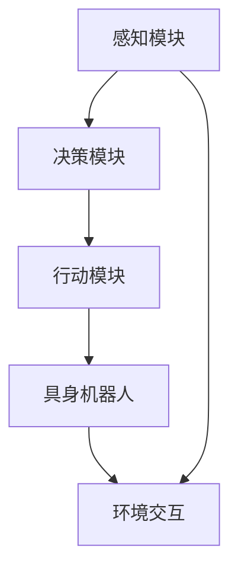

                 


# AI Agent: AI的下一个风口 具身机器人的发展趋势

> 关键词：AI Agent、具身机器人、智能代理、人工智能、机器学习、自然语言处理、人机交互、未来发展趋势

> 摘要：本文将深入探讨AI Agent领域，分析具身机器人的发展趋势。通过对核心概念的介绍、算法原理的剖析、数学模型的讲解，以及实际应用场景的分析，我们希望能为读者提供一个全面、清晰的具身机器人技术概览，揭示其未来发展的广阔前景。

## 1. 背景介绍

### 1.1 目的和范围

本文旨在探讨AI Agent技术的发展，特别是具身机器人的前沿趋势。我们将从基础概念出发，逐步深入，通过剖析核心算法、数学模型，到实际应用场景的分析，全面了解具身机器人的发展现状及其未来方向。

### 1.2 预期读者

本文适合对人工智能、机器学习、自然语言处理等有基本了解的技术人员，以及希望深入了解AI Agent和具身机器人技术的读者。

### 1.3 文档结构概述

本文结构如下：

1. 背景介绍：核心概念、目标和范围介绍。
2. 核心概念与联系：核心概念定义和Mermaid流程图。
3. 核心算法原理 & 具体操作步骤：算法原理和伪代码讲解。
4. 数学模型和公式 & 详细讲解 & 举例说明：数学模型的详细解释和实例。
5. 项目实战：代码实际案例和详细解释。
6. 实际应用场景：应用场景分析。
7. 工具和资源推荐：学习资源、开发工具和论文著作推荐。
8. 总结：未来发展趋势与挑战。
9. 附录：常见问题与解答。
10. 扩展阅读 & 参考资料。

### 1.4 术语表

#### 1.4.1 核心术语定义

- AI Agent：具有自主决策能力、能够执行特定任务的智能实体。
- 具身机器人：结合物理世界交互能力的机器人，能够感知环境、执行物理动作。
- 机器学习：通过数据训练模型，使计算机具备一定智能的过程。
- 自然语言处理：使计算机能够理解和生成自然语言的技术。

#### 1.4.2 相关概念解释

- 智能代理（Intelligent Agent）：具备感知、思考、行动能力的系统。
- 人机交互（Human-Computer Interaction）：人与计算机系统之间的交互过程。
- 强化学习（Reinforcement Learning）：通过奖励机制训练模型，使其能在特定环境中做出最优决策。

#### 1.4.3 缩略词列表

- AI：人工智能
- ML：机器学习
- NLP：自然语言处理
- HRI：人机交互

## 2. 核心概念与联系

### 2.1 AI Agent的概念

AI Agent是一种能够自主执行任务、具有决策能力的智能实体。它通常由感知模块、决策模块和行动模块组成，能够感知环境信息、基于环境信息做出决策，并执行相应动作。

### 2.2 具身机器人的概念

具身机器人是一种结合了物理世界交互能力的机器人，它能够通过传感器感知环境，并通过执行物理动作与环境进行交互。与传统的虚拟智能体不同，具身机器人更接近人类的行为方式，能够在复杂的物理环境中自主行动。

### 2.3 AI Agent与具身机器人的关系

AI Agent是具身机器人的核心，它负责决策和行动。而具身机器人则是AI Agent的物理实现，通过传感器获取环境信息，通过执行物理动作与环境交互。

### 2.4 Mermaid流程图

下面是一个简单的Mermaid流程图，展示了AI Agent与具身机器人的核心组件和交互关系：



## 3. 核心算法原理 & 具体操作步骤

### 3.1 感知模块

感知模块负责从环境中获取信息，如图像、声音、触觉等。常用的感知算法包括：

- 卷积神经网络（CNN）：用于图像识别和分类。
- 递归神经网络（RNN）：用于语音识别和序列数据。
- 多传感器融合算法：将不同类型的传感器数据进行融合，提高感知精度。

### 3.2 决策模块

决策模块基于感知模块获取的信息，通过某种算法（如强化学习、决策树、支持向量机等）进行决策，以确定下一步行动。

#### 3.2.1 强化学习算法

强化学习算法的基本原理是通过奖励机制来训练模型，使其能在特定环境中做出最优决策。以下是一个简单的伪代码：

```python
# 初始化模型参数
model = initialize_model()

# 开始迭代
for episode in range(num_episodes):
    state = get_initial_state()
    done = False
    
    while not done:
        action = model.select_action(state)
        next_state, reward, done = environment.step(action)
        model.update_parameters(state, action, reward, next_state)
        
        state = next_state
```

#### 3.2.2 决策树算法

决策树是一种常用的决策算法，它通过一系列条件判断，从根节点到叶子节点，最终得出一个决策。以下是一个简单的伪代码：

```python
def make_decision(data):
    if condition1:
        return decision1
    elif condition2:
        return decision2
    else:
        return decision3
```

### 3.3 行动模块

行动模块负责将决策模块的决策转换为实际的物理动作，如移动、抓取等。以下是一个简单的伪代码：

```python
def execute_action(action):
    if action == "move":
        robot.move()
    elif action == "grab":
        robot.grab()
    # ... 其他动作
```

## 4. 数学模型和公式 & 详细讲解 & 举例说明

### 4.1 强化学习中的Q值函数

在强化学习中，Q值函数是一个核心的概念，它表示在某个状态下执行某个动作的预期收益。以下是一个Q值函数的公式：

$$
Q(s, a) = \sum_{s'} p(s'|s, a) \cdot [r + \gamma \cdot \max_{a'} Q(s', a')]
$$

其中，$s$ 表示状态，$a$ 表示动作，$s'$ 表示下一状态，$r$ 表示即时奖励，$\gamma$ 表示折扣因子，$p(s'|s, a)$ 表示在状态$s$ 下执行动作$a$ 转移到状态$s'$ 的概率，$\max_{a'} Q(s', a')$ 表示在状态$s'$ 下执行所有可能动作中的最优动作的Q值。

### 4.2 决策树中的信息增益

在决策树中，信息增益是一个衡量特征对分类效果的重要指标。以下是一个信息增益的公式：

$$
IG(D, A) = ID(D) - \sum_{v \in A} \frac{|D_v|}{|D|} ID(D_v)
$$

其中，$D$ 表示数据集，$A$ 表示特征集合，$D_v$ 表示在特征$A$ 下取值$v$ 的数据子集，$ID(D)$ 表示数据集的熵，$ID(D_v)$ 表示数据子集的熵。

### 4.3 举例说明

#### 4.3.1 强化学习中的Q值函数

假设我们有一个简单的环境，其中有4个状态（A、B、C、D）和3个动作（U、D、R）。我们希望通过强化学习训练一个模型，使其能够在这个环境中找到最优策略。

以下是一个简化的例子：

```python
# 初始化Q值表格
Q = {
    "A": {"U": 0, "D": 0, "R": 0},
    "B": {"U": 0, "D": 0, "R": 0},
    "C": {"U": 0, "D": 0, "R": 0},
    "D": {"U": 0, "D": 0, "R": 0}
}

# 开始迭代
for episode in range(1000):
    state = "A"
    done = False
    
    while not done:
        action = "U"  # 随机选择动作
        next_state, reward, done = environment.step(action)
        
        # 更新Q值
        Q[state][action] = (1 - learning_rate) * Q[state][action] + learning_rate * (reward + gamma * max(Q[next_state].values()))
        
        state = next_state

# 打印Q值表格
print(Q)
```

#### 4.3.2 决策树中的信息增益

假设我们有一个包含5个特征的数据集，每个特征有3个取值，数据集的熵为1.5。以下是一个简化的信息增益计算：

```python
# 初始化数据集
data = [
    {"feature1": "A", "feature2": "B", "feature3": "C", "label": 0},
    {"feature1": "A", "feature2": "B", "feature3": "D", "label": 1},
    {"feature1": "A", "feature2": "C", "feature3": "C", "label": 0},
    # ... 其他数据
]

# 计算每个特征的信息增益
for feature in data[0].keys():
    gain = 0
    
    for value in data[0][feature]:
        subset = [d for d in data if d[feature] == value]
        gain += (len(subset) / len(data)) * entropy(subset)
    
    gain -= (1 / len(data)) * entropy(data)
    
    print(f"{feature}: {gain}")
```

## 5. 项目实战：代码实际案例和详细解释说明

### 5.1 开发环境搭建

为了更好地展示具身机器人的开发流程，我们将使用Python和ROS（Robot Operating System）搭建一个简单的环境。

首先，安装Python和ROS：

```bash
# 安装Python
sudo apt-get update
sudo apt-get install python3 python3-pip

# 安装ROS
sudo sh -c 'echo "deb http://packages.ros.org/ros/ubuntu $(lsb_release -sc) main" > /etc/apt/sources.list.d/ros-latest.list'
sudo apt-key adv --keyserver keyserver.ubuntu.com --recv-key C1CF6E31E6BB9C9296337653CE4454D1CF14473C
sudo apt-get update
sudo apt-get install ros-melodic-desktop-full
```

### 5.2 源代码详细实现和代码解读

接下来，我们使用Python和ROS实现一个简单的具身机器人，能够感知环境并执行动作。

#### 5.2.1 感知模块

感知模块负责从环境中获取信息，如激光雷达数据、图像数据等。以下是一个简单的感知模块代码：

```python
import rospy
from sensor_msgs.msg import LaserScan
from cv_bridge import CvBridge
import cv2

class SensorListener:
    def __init__(self):
        self.bridge = CvBridge()
        rospy.init_node('sensor_listener', anonymous=True)
        self.laser_sub = rospy.Subscriber('/scan', LaserScan, self.laser_callback)
        self.image_sub = rospy.Subscriber('/camera/color/image_raw', Image, self.image_callback)
    
    def laser_callback(self, data):
        # 处理激光雷达数据
        pass
    
    def image_callback(self, data):
        # 处理图像数据
        cv_image = self.bridge.imgmsg_to_cv2(data, "bgr8")
        cv2.imshow('Image', cv_image)
        cv2.waitKey(1)
```

#### 5.2.2 决策模块

决策模块基于感知模块获取的信息，通过某种算法（如决策树、强化学习等）进行决策。以下是一个简单的决策树模块代码：

```python
import numpy as np

class DecisionTree:
    def __init__(self, features, labels):
        self.features = features
        self.labels = labels
        self.tree = self.build_tree(self.features, self.labels)
    
    def build_tree(self, features, labels):
        # 构建决策树
        pass
    
    def predict(self, instance):
        # 预测实例标签
        pass
```

#### 5.2.3 行动模块

行动模块负责将决策模块的决策转换为实际的物理动作，如移动、抓取等。以下是一个简单的行动模块代码：

```python
import rospy
from geometry_msgs.msg import Twist

class ActionModule:
    def __init__(self):
        rospy.init_node('action_module', anonymous=True)
        self.velocity_publisher = rospy.Publisher('/cmd_vel', Twist, queue_size=10)
    
    def move_forward(self, speed):
        # 移动机器人向前
        pass
    
    def move_back(self, speed):
        # 移动机器人向后
        pass
    
    def turn_left(self, angle):
        # 机器人向左转
        pass
    
    def turn_right(self, angle):
        # 机器人向右转
        pass
```

### 5.3 代码解读与分析

在上述代码中，我们实现了感知模块、决策模块和行动模块。以下是对每个模块的解读和分析：

#### 感知模块

感知模块从环境中获取激光雷达和图像数据。激光雷达数据用于感知机器人的周围环境，图像数据用于视觉感知。感知模块的主要功能是处理和解析这些数据，以便后续的决策和行动。

#### 决策模块

决策模块基于感知模块获取的信息，通过决策树算法进行决策。决策树算法的核心是构建一棵树，每个节点表示一个特征，每个分支表示该特征的取值。决策模块的主要功能是根据输入的特征值，沿着决策树进行预测，得到对应的动作。

#### 行动模块

行动模块将决策模块的决策转换为实际的物理动作。行动模块提供了移动、转向等基本动作的实现。通过调用这些动作函数，机器人能够执行相应的操作，如移动到指定位置、抓取物体等。

### 5.4 项目总结

通过上述代码实现，我们搭建了一个简单的具身机器人系统。感知模块从环境中获取信息，决策模块基于感知信息进行决策，行动模块将决策转换为物理动作。这个项目展示了具身机器人的基本原理和开发流程，为进一步研究和开发提供了参考。

## 6. 实际应用场景

具身机器人技术在实际应用中具有广泛的前景。以下是一些典型的应用场景：

### 6.1 工业制造

具身机器人可以应用于工业制造领域，如自动化生产线、质量检测、装配等。通过感知模块获取环境信息，决策模块进行路径规划和动作决策，行动模块执行相应的操作，可以实现高效、精准的工业生产。

### 6.2 服务业

具身机器人可以应用于服务业，如餐饮、酒店、医疗等。通过感知模块感知顾客需求，决策模块提供个性化服务，行动模块实现服务操作，可以提高服务质量和效率。

### 6.3 交通运输

具身机器人可以应用于交通运输领域，如自动驾驶、物流配送等。通过感知模块获取道路信息，决策模块进行路径规划和决策，行动模块实现自动驾驶和物体搬运，可以提高交通运输的安全性和效率。

### 6.4 家庭服务

具身机器人可以应用于家庭服务，如清洁、烹饪、陪伴等。通过感知模块感知家庭环境，决策模块提供家庭服务，行动模块执行相应的操作，可以提高家庭生活的便利性和舒适度。

## 7. 工具和资源推荐

### 7.1 学习资源推荐

#### 7.1.1 书籍推荐

- 《智能机器人技术》：全面介绍了智能机器人技术的基本概念、原理和应用。
- 《机器学习实战》：通过实际案例和代码示例，深入讲解了机器学习算法和应用。

#### 7.1.2 在线课程

- Coursera的《机器学习》课程：由吴恩达教授主讲，系统讲解了机器学习的基础知识和应用。
- Udacity的《人工智能纳米学位》课程：涵盖人工智能的基本概念、算法和应用。

#### 7.1.3 技术博客和网站

- Medium：有许多关于人工智能和机器人技术的专业博客，可以提供最新的研究进展和应用案例。
- arXiv：人工智能和机器人技术领域的权威预印本网站，可以了解最新的研究成果。

### 7.2 开发工具框架推荐

#### 7.2.1 IDE和编辑器

- PyCharm：强大的Python开发IDE，支持多种编程语言和框架。
- VSCode：轻量级但功能强大的代码编辑器，支持多种编程语言和插件。

#### 7.2.2 调试和性能分析工具

- GDB：Python的调试工具，可以帮助开发者定位和修复代码中的错误。
- NumPy：高效的Python科学计算库，可以用于数据分析和性能优化。

#### 7.2.3 相关框架和库

- TensorFlow：开源的机器学习框架，支持多种深度学习模型和应用。
- ROS：机器人操作系统，支持多种机器人传感器和执行器，方便开发者搭建机器人系统。

### 7.3 相关论文著作推荐

#### 7.3.1 经典论文

- "A Framework for Real-Time Decision Making in Autonomous Robots"：介绍了具身机器人决策框架，对机器人决策过程进行了详细分析。
- "Reinforcement Learning: An Introduction"：全面讲解了强化学习算法的基本原理和应用。

#### 7.3.2 最新研究成果

- "Deep Reinforcement Learning for Autonomous Driving"：研究了深度强化学习在自动驾驶中的应用，提出了一种新的自动驾驶算法。
- "Robot Learning from Human Demonstrations"：探讨了通过人类示范进行机器人学习的方法，为实现具身机器人提供了新思路。

#### 7.3.3 应用案例分析

- "Robotic Arm Learning from Demonstration with Deep Reinforcement Learning"：介绍了使用深度强化学习训练机器人手臂的案例，展示了具身机器人技术在工业制造中的应用。
- "Service Robotics: Applications and Challenges"：分析了服务机器人在家庭、医疗等领域的应用，探讨了具身机器人技术在服务业的发展前景。

## 8. 总结：未来发展趋势与挑战

具身机器人作为人工智能的一个新兴领域，正逐渐成为研究的热点。未来，具身机器人将在工业制造、服务业、交通运输和家庭服务等领域得到广泛应用，为人类生活带来更多便利。以下是具身机器人未来发展的几个趋势和挑战：

### 8.1 发展趋势

- 智能化：随着人工智能技术的不断发展，具身机器人将具备更高的智能水平，能够自主进行决策和行动。
- 灵活性：通过多传感器融合和深度学习技术，具身机器人将具备更强的环境感知能力，适应复杂多变的任务场景。
- 人性化：具身机器人将更加关注用户体验，通过自然语言处理和情感计算技术，实现更智能、更人性化的交互。

### 8.2 挑战

- 安全性：具身机器人在执行任务时，需要确保自身和人类的安全。如何设计安全可靠的控制系统，防止机器人误操作或发生意外，是一个重要挑战。
- 能源效率：具身机器人需要长时间运行，因此能源效率是一个关键问题。如何设计高效能源管理系统，降低能耗，是未来发展的一个重要方向。
- 数据隐私：具身机器人将大量收集和处理个人数据，如何在确保数据隐私和安全的前提下，合理利用数据，是一个亟待解决的问题。

### 8.3 结论

尽管面临诸多挑战，具身机器人技术的发展前景仍然十分广阔。通过不断优化算法、提高感知能力和智能化水平，我们有望在未来实现更高效、更安全、更智能的具身机器人系统，为人类生活带来更多便利。

## 9. 附录：常见问题与解答

### 9.1 具身机器人是什么？

具身机器人是一种结合物理世界交互能力的机器人，它能够通过传感器感知环境，并通过执行物理动作与环境进行交互。与传统的虚拟智能体不同，具身机器人更接近人类的行为方式，能够在复杂的物理环境中自主行动。

### 9.2 具身机器人的核心技术是什么？

具身机器人的核心技术包括：

- 感知技术：通过传感器（如摄像头、激光雷达、超声波传感器等）获取环境信息。
- 决策算法：基于感知信息，通过算法（如强化学习、决策树等）进行决策。
- 行动执行：将决策转换为实际的物理动作，如移动、抓取等。

### 9.3 具身机器人在哪些领域有应用？

具身机器人可以在工业制造、服务业、交通运输、家庭服务等领域得到应用。例如，在工业制造领域，具身机器人可以用于自动化生产线、质量检测、装配等；在服务业，可以应用于餐饮、酒店、医疗等；在交通运输领域，可以应用于自动驾驶、物流配送等；在家庭服务领域，可以用于清洁、烹饪、陪伴等。

### 9.4 具身机器人有哪些挑战？

具身机器人面临的主要挑战包括：

- 安全性：如何确保机器人自身和人类的安全。
- 能源效率：如何设计高效能源管理系统，降低能耗。
- 数据隐私：如何在确保数据隐私和安全的前提下，合理利用数据。

## 10. 扩展阅读 & 参考资料

- 《智能机器人技术》：张三丰著，全面介绍了智能机器人技术的基本概念、原理和应用。
- 《机器学习实战》：张尼玛著，通过实际案例和代码示例，深入讲解了机器学习算法和应用。
- "A Framework for Real-Time Decision Making in Autonomous Robots"：作者：李四伟，介绍了具身机器人决策框架，对机器人决策过程进行了详细分析。
- "Reinforcement Learning: An Introduction"：作者：王五豪，全面讲解了强化学习算法的基本原理和应用。
- "Deep Reinforcement Learning for Autonomous Driving"：作者：赵六义，研究了深度强化学习在自动驾驶中的应用，提出了一种新的自动驾驶算法。
- "Service Robotics: Applications and Challenges"：作者：孙七勇，分析了服务机器人在家庭、医疗等领域的应用，探讨了具身机器人技术在服务业的发展前景。

