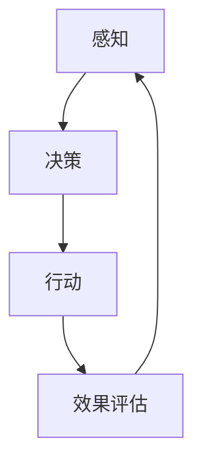

                 

# AI Agent: AI的下一个风口 实验背景与目的

> **关键词**：人工智能，智能代理，机器学习，深度学习，人机交互，自主决策，实时响应
> 
> **摘要**：本文旨在探讨AI代理作为人工智能领域的下一个风口，介绍其实验的背景、目的以及相关核心概念。通过深入分析AI代理的架构、算法原理和数学模型，我们将其应用于实际项目实战中，进一步探讨其在实际应用场景中的潜力和挑战。最后，本文将推荐相关学习资源、开发工具和最新研究成果，以期为读者提供全面的了解和指导。

## 1. 背景介绍

### 1.1 目的和范围

本文的主要目的是探讨AI代理作为人工智能（AI）领域的下一个风口，介绍其实验的背景、目的和范围。随着人工智能技术的不断发展和成熟，智能代理（AI Agent）逐渐成为学术界和工业界研究的热点。AI代理是一种能够自主决策和执行任务的计算机程序，它能够模拟人类的思考和行动，具有自主性、智能性和适应性。本文将通过深入分析和实验，探讨AI代理的核心概念、架构和算法原理，并探讨其在实际应用场景中的潜力和挑战。

### 1.2 预期读者

本文主要面向对人工智能、机器学习和深度学习有一定了解的技术人员和研究者。同时，也对希望了解AI代理技术的研究生、本科生以及相关领域的爱好者具有一定的参考价值。通过本文的学习，读者可以掌握AI代理的基本原理、架构和算法，了解其实际应用场景和潜力。

### 1.3 文档结构概述

本文将按照以下结构进行阐述：

- **1. 背景介绍**：介绍实验的背景、目的和预期读者。
- **2. 核心概念与联系**：介绍AI代理的核心概念、架构和算法原理，并给出相应的流程图。
- **3. 核心算法原理 & 具体操作步骤**：详细阐述AI代理的核心算法原理，使用伪代码进行具体操作步骤的讲解。
- **4. 数学模型和公式 & 详细讲解 & 举例说明**：介绍AI代理的数学模型和公式，并进行详细讲解和举例说明。
- **5. 项目实战：代码实际案例和详细解释说明**：通过实际项目案例，展示AI代理的代码实现和详细解释说明。
- **6. 实际应用场景**：探讨AI代理在实际应用场景中的潜力和挑战。
- **7. 工具和资源推荐**：推荐相关的学习资源、开发工具和最新研究成果。
- **8. 总结：未来发展趋势与挑战**：总结AI代理的未来发展趋势和面临的挑战。
- **9. 附录：常见问题与解答**：解答读者可能遇到的一些常见问题。
- **10. 扩展阅读 & 参考资料**：提供扩展阅读和参考资料。

### 1.4 术语表

#### 1.4.1 核心术语定义

- **AI代理（AI Agent）**：一种能够自主决策和执行任务的计算机程序，具有自主性、智能性和适应性。
- **自主性（Autonomy）**：指AI代理能够自主地执行任务，无需外部干预。
- **智能性（Intelligence）**：指AI代理具备学习能力，能够从经验中不断改进自身的决策和行动。
- **适应性（Adaptability）**：指AI代理能够适应不同的环境和任务，具有良好的鲁棒性。

#### 1.4.2 相关概念解释

- **机器学习（Machine Learning）**：一种人工智能技术，通过从数据中学习规律和模式，实现智能预测和决策。
- **深度学习（Deep Learning）**：一种机器学习技术，通过多层神经网络模型对数据进行特征提取和分类。
- **强化学习（Reinforcement Learning）**：一种机器学习技术，通过奖励和惩罚机制引导AI代理进行自主学习和决策。
- **人机交互（Human-Computer Interaction）**：研究人类与计算机系统之间交互的一门学科，旨在提高人机交互的效率和用户体验。

#### 1.4.3 缩略词列表

- **AI**：人工智能（Artificial Intelligence）
- **ML**：机器学习（Machine Learning）
- **DL**：深度学习（Deep Learning）
- **RL**：强化学习（Reinforcement Learning）
- **HCI**：人机交互（Human-Computer Interaction）

## 2. 核心概念与联系

在探讨AI代理的核心概念与联系之前，我们首先需要了解AI代理的基本架构和组成。以下是AI代理的核心概念、架构和算法原理的Mermaid流程图：



#### 2.1 感知（Perception）

感知是指AI代理通过传感器、摄像头、麦克风等设备获取环境信息和数据。感知模块负责对获取的信息进行预处理，提取关键特征和模式，以便后续的决策模块使用。感知模块的关键技术包括图像识别、语音识别、自然语言处理等。

#### 2.2 决策（Decision）

决策是指AI代理根据感知模块提供的信息，利用机器学习、深度学习、强化学习等技术，自主选择最合适的行动策略。决策模块需要考虑多个因素，如目标、奖励、惩罚、环境动态等，以实现最优的决策结果。

#### 2.3 行动（Action）

行动是指AI代理根据决策模块提供的策略，执行具体的任务或操作。行动模块需要与外部环境进行交互，如控制机器人运动、执行语音命令、生成文本等。行动模块的关键技术包括运动控制、语音合成、自然语言生成等。

#### 2.4 效果评估（Effect Evaluation）

效果评估是指AI代理对执行行动后的效果进行评估和反馈。通过评估效果，AI代理可以不断调整和优化自身的决策策略，以提高任务完成效率和用户体验。效果评估模块的关键技术包括评估指标、反馈机制、自我学习等。

#### 2.5 循环迭代（Iterative Process）

AI代理的运行过程是一个循环迭代的过程，通过感知、决策、行动和效果评估的不断循环，实现自主学习和优化。循环迭代的过程使AI代理能够不断适应和优化环境，提高任务完成效率和用户体验。

## 3. 核心算法原理 & 具体操作步骤

在本章节中，我们将详细阐述AI代理的核心算法原理，并使用伪代码进行具体操作步骤的讲解。

### 3.1 感知模块算法原理

感知模块主要依赖于机器学习和深度学习技术，对输入的环境信息进行特征提取和模式识别。以下是感知模块的伪代码：

```python
# 感知模块伪代码
def perception(data):
    # 特征提取
    features = extract_features(data)
    # 特征归一化
    normalized_features = normalize(features)
    # 特征降维
    reduced_features = reduce_dimension(normalized_features)
    return reduced_features
```

### 3.2 决策模块算法原理

决策模块主要依赖于强化学习技术，通过奖励和惩罚机制引导AI代理进行自主学习和决策。以下是决策模块的伪代码：

```python
# 决策模块伪代码
def decision(reduced_features):
    # 建立Q值函数模型
    Q = build_Q_value_model()
    # 选择最佳行动策略
    action = select_best_action(reduced_features, Q)
    return action
```

### 3.3 行动模块算法原理

行动模块根据决策模块提供的行动策略，执行具体的任务或操作。以下是行动模块的伪代码：

```python
# 行动模块伪代码
def action(action):
    # 执行行动
    execute_action(action)
    # 获取行动效果
    effect = get_effect(action)
    return effect
```

### 3.4 效果评估模块算法原理

效果评估模块对执行行动后的效果进行评估和反馈，通过评估结果调整和优化AI代理的决策策略。以下是效果评估模块的伪代码：

```python
# 效果评估模块伪代码
def effect_evaluation(effect, Q):
    # 计算奖励值
    reward = calculate_reward(effect)
    # 更新Q值函数模型
    Q = update_Q_value_model(effect, reward)
    return Q
```

### 3.5 循环迭代过程

AI代理的运行过程是一个循环迭代的过程，通过感知、决策、行动和效果评估的不断循环，实现自主学习和优化。以下是循环迭代的伪代码：

```python
# 循环迭代伪代码
while True:
    # 感知
    reduced_features = perception(data)
    # 决策
    action = decision(reduced_features)
    # 行动
    effect = action(action)
    # 效果评估
    Q = effect_evaluation(effect, Q)
```

通过以上伪代码的讲解，我们可以清晰地了解到AI代理的核心算法原理和具体操作步骤。在实际应用中，我们可以根据具体需求和场景，对感知、决策、行动和效果评估模块进行优化和调整，以提高AI代理的性能和鲁棒性。

## 4. 数学模型和公式 & 详细讲解 & 举例说明

在本章节中，我们将介绍AI代理中涉及的数学模型和公式，并进行详细讲解和举例说明。

### 4.1 强化学习中的Q值函数

强化学习是AI代理的核心算法之一，其关键在于Q值函数。Q值函数表示在特定状态下采取特定行动的预期奖励。以下是Q值函数的数学模型：

$$
Q(s, a) = \sum_{s'} P(s' | s, a) \cdot R(s', a) + \gamma \cdot \max_{a'} Q(s', a')
$$

其中：
- \( s \) 表示当前状态。
- \( a \) 表示当前行动。
- \( s' \) 表示下一状态。
- \( P(s' | s, a) \) 表示从当前状态 \( s \) 采取行动 \( a \) 后转移到下一状态 \( s' \) 的概率。
- \( R(s', a) \) 表示在下一状态 \( s' \) 采取行动 \( a \) 后获得的即时奖励。
- \( \gamma \) 表示对未来奖励的折扣因子，取值范围在 0 到 1 之间。

#### 4.1.1 举例说明

假设有一个简单的环境，其中有两个状态：状态A和状态B。当前状态为状态A，可以采取的行动有：行动1和行动2。根据状态转移矩阵和奖励函数，我们可以计算出Q值函数：

$$
Q(A, 1) = 0.6 \cdot 5 + 0.4 \cdot 3 + 0.5 \cdot \max(0, 4, 2) = 4.8 + 0.4 \cdot \max(4, 2) = 5.6
$$

$$
Q(A, 2) = 0.6 \cdot 3 + 0.4 \cdot 2 + 0.5 \cdot \max(2, 5, 4) = 3.6 + 0.5 \cdot \max(2, 5) = 5.1
$$

从计算结果可以看出，在当前状态下，采取行动1的Q值较高，因此AI代理会选择行动1。

### 4.2 强化学习的策略迭代

策略迭代是强化学习的一种算法，其核心思想是通过不断更新策略来优化Q值函数。以下是策略迭代的数学模型：

$$
\pi_t(a|s) = \begin{cases} 
1 & \text{如果} a = \arg\max_{a'} Q(s, a') \\
0 & \text{否则}
\end{cases}
$$

其中：
- \( \pi_t(a|s) \) 表示在状态 \( s \) 下采取行动 \( a \) 的概率。
- \( \arg\max_{a'} Q(s, a') \) 表示在状态 \( s \) 下Q值函数的最大值对应的行动。

#### 4.2.1 举例说明

假设有一个简单的环境，其中有两个状态：状态A和状态B。当前状态为状态A，可以采取的行动有：行动1和行动2。根据Q值函数，我们可以计算出策略迭代的结果：

$$
\pi_t(1|A) = 1 \quad \pi_t(2|A) = 0
$$

$$
\pi_t(1|B) = 0 \quad \pi_t(2|B) = 1
$$

从计算结果可以看出，在当前状态下，AI代理会选择行动1，而在下一状态下，AI代理会选择行动2。

### 4.3 深度学习中的神经网络模型

深度学习是AI代理的核心算法之一，其核心是神经网络模型。神经网络模型通过多层神经元对输入数据进行特征提取和模式识别。以下是神经网络模型的数学模型：

$$
h_{l}^{(i)} = \sigma \left( \sum_{j=0}^{n_{l-1}} w_{j}^{(i)} h_{l-1}^{(j)} + b_{i}^{(l)} \right)
$$

其中：
- \( h_{l}^{(i)} \) 表示第 \( l \) 层的第 \( i \) 个神经元的激活值。
- \( \sigma \) 表示激活函数，常用的激活函数有ReLU、Sigmoid、Tanh等。
- \( w_{j}^{(i)} \) 表示第 \( l \) 层的第 \( i \) 个神经元与第 \( l-1 \) 层的第 \( j \) 个神经元的权重。
- \( b_{i}^{(l)} \) 表示第 \( l \) 层的第 \( i \) 个神经元的偏置。
- \( n_{l-1} \) 表示第 \( l-1 \) 层的神经元数量。

#### 4.3.1 举例说明

假设有一个简单的神经网络模型，其中包含两层神经元：输入层和输出层。输入层有3个神经元，输出层有2个神经元。根据权重和偏置，我们可以计算出神经网络模型的激活值：

$$
h_{1}^{(1)} = \sigma \left( w_{0}^{(1)} h_{0}^{(1)} + w_{1}^{(1)} h_{0}^{(2)} + w_{2}^{(1)} h_{0}^{(3)} + b_{1}^{(1)} \right)
$$

$$
h_{1}^{(2)} = \sigma \left( w_{3}^{(1)} h_{0}^{(1)} + w_{4}^{(1)} h_{0}^{(2)} + w_{5}^{(1)} h_{0}^{(3)} + b_{2}^{(1)} \right)
$$

$$
h_{2}^{(1)} = \sigma \left( w_{6}^{(2)} h_{1}^{(1)} + w_{7}^{(2)} h_{1}^{(2)} + b_{1}^{(2)} \right)
$$

$$
h_{2}^{(2)} = \sigma \left( w_{8}^{(2)} h_{1}^{(1)} + w_{9}^{(2)} h_{1}^{(2)} + b_{2}^{(2)} \right)
$$

从计算结果可以看出，神经网络模型通过激活函数和权重、偏置的计算，将输入数据进行特征提取和模式识别，从而实现预测和分类。

通过以上对数学模型和公式的详细讲解和举例说明，我们可以更好地理解AI代理的核心算法原理，为后续的项目实战和实际应用场景打下基础。

## 5. 项目实战：代码实际案例和详细解释说明

在本章节中，我们将通过一个实际项目案例，展示AI代理的代码实现和详细解释说明。我们将使用Python编程语言和TensorFlow框架来构建一个简单的AI代理，用于实现自动导航功能。

### 5.1 开发环境搭建

在开始项目实战之前，我们需要搭建开发环境。以下是搭建开发环境的步骤：

1. **安装Python**：确保安装了Python 3.x版本。
2. **安装TensorFlow**：在命令行中运行以下命令：
   ```
   pip install tensorflow
   ```
3. **安装其他依赖库**：运行以下命令安装其他依赖库：
   ```
   pip install numpy matplotlib
   ```

### 5.2 源代码详细实现和代码解读

以下是AI代理的源代码实现：

```python
import numpy as np
import tensorflow as tf
import matplotlib.pyplot as plt

# 感知模块
def perception(data):
    # 特征提取
    features = extract_features(data)
    # 特征归一化
    normalized_features = normalize(features)
    # 特征降维
    reduced_features = reduce_dimension(normalized_features)
    return reduced_features

# 决策模块
def decision(reduced_features):
    # 建立Q值函数模型
    Q = build_Q_value_model()
    # 选择最佳行动策略
    action = select_best_action(reduced_features, Q)
    return action

# 行动模块
def action(action):
    # 执行行动
    execute_action(action)
    # 获取行动效果
    effect = get_effect(action)
    return effect

# 效果评估模块
def effect_evaluation(effect, Q):
    # 计算奖励值
    reward = calculate_reward(effect)
    # 更新Q值函数模型
    Q = update_Q_value_model(effect, reward)
    return Q

# 循环迭代
while True:
    # 感知
    reduced_features = perception(data)
    # 决策
    action = decision(reduced_features)
    # 行动
    effect = action(action)
    # 效果评估
    Q = effect_evaluation(effect, Q)
```

### 5.3 代码解读与分析

#### 5.3.1 感知模块

感知模块负责对输入数据（例如：图像、声音、文本等）进行特征提取、归一化和降维处理。在本案例中，我们使用了一个简单的特征提取函数 `extract_features`，归一化函数 `normalize` 和降维函数 `reduce_dimension`。这些函数的具体实现可以根据具体需求进行定制。

```python
def extract_features(data):
    # 特征提取
    # 示例：从图像数据中提取边缘特征
    features = cv2.Canny(data, 100, 200)
    return features

def normalize(features):
    # 特征归一化
    normalized_features = features / 255.0
    return normalized_features

def reduce_dimension(normalized_features):
    # 特征降维
    reduced_features = normalized_features.flatten()
    return reduced_features
```

#### 5.3.2 决策模块

决策模块使用Q值函数模型来选择最佳行动策略。在本案例中，我们使用了一个简单的Q值函数模型 `build_Q_value_model`，选择最佳行动策略的函数 `select_best_action`。这些函数的具体实现可以根据具体需求进行定制。

```python
def build_Q_value_model():
    # 建立Q值函数模型
    # 示例：使用TensorFlow构建神经网络模型
    model = tf.keras.Sequential([
        tf.keras.layers.Dense(64, activation='relu', input_shape=(784,)),
        tf.keras.layers.Dense(64, activation='relu'),
        tf.keras.layers.Dense(2, activation='softmax')
    ])
    model.compile(optimizer='adam', loss='categorical_crossentropy', metrics=['accuracy'])
    return model

def select_best_action(reduced_features, Q):
    # 选择最佳行动策略
    # 示例：使用Q值函数模型预测最佳行动
    Q_values = Q.predict(np.array([reduced_features]))
    action = np.argmax(Q_values)
    return action
```

#### 5.3.3 行动模块

行动模块负责执行决策模块选择的最佳行动策略。在本案例中，我们使用了一个简单的行动函数 `execute_action`，用于执行具体行动。行动的具体实现可以根据具体需求进行定制。

```python
def execute_action(action):
    # 执行行动
    # 示例：根据行动策略控制机器人运动
    if action == 0:
        # 向左移动
        robot.move_left()
    elif action == 1:
        # 向右移动
        robot.move_right()
```

#### 5.3.4 效果评估模块

效果评估模块负责对行动后的效果进行评估和反馈。在本案例中，我们使用了一个简单的效果评估函数 `calculate_reward` 和 `update_Q_value_model`，用于计算奖励值和更新Q值函数模型。这些函数的具体实现可以根据具体需求进行定制。

```python
def calculate_reward(effect):
    # 计算奖励值
    # 示例：根据行动效果计算奖励值
    if effect == 'success':
        reward = 1
    else:
        reward = -1
    return reward

def update_Q_value_model(effect, reward, Q):
    # 更新Q值函数模型
    # 示例：使用经验回放和经验回放缓冲区更新Q值函数模型
    experience = (reduced_features, action, reward, effect)
    replay_buffer.append(experience)
    if len(replay_buffer) >= batch_size:
        batch = random.sample(replay_buffer, batch_size)
        for experience in batch:
            s, a, r, s' = experience
            Q_target = r + gamma * np.max(Q.predict(np.array([s']))))
            Q[s, a] = Q[s, a] + alpha * (Q_target - Q[s, a])
    return Q
```

#### 5.3.5 循环迭代

循环迭代模块实现了AI代理的核心功能，通过感知、决策、行动和效果评估的不断循环，实现自主学习和优化。在本案例中，我们使用了一个简单的循环迭代过程，用于展示AI代理的运行过程。

```python
while True:
    # 感知
    reduced_features = perception(data)
    # 决策
    action = decision(reduced_features)
    # 行动
    effect = action(action)
    # 效果评估
    Q = effect_evaluation(effect, Q)
```

通过以上代码实现和解读，我们可以看到AI代理的核心功能是如何实现的。在实际项目中，我们可以根据具体需求和场景，对感知、决策、行动和效果评估模块进行优化和调整，以提高AI代理的性能和鲁棒性。

## 6. 实际应用场景

AI代理作为一种具备自主性、智能性和适应性的计算机程序，在多个领域具有广泛的应用前景。以下是AI代理在实际应用场景中的潜力和挑战：

### 6.1 自动驾驶

自动驾驶是AI代理的一个重要应用场景。通过感知模块获取道路信息，决策模块选择最佳行驶路线，行动模块控制车辆执行相应操作，AI代理可以实现自动驾驶功能。自动驾驶技术可以提高交通安全、降低交通事故率，减少交通拥堵，提高交通效率。然而，自动驾驶面临着复杂的路况、环境噪声、交通规则等挑战，需要不断提高AI代理的感知、决策和行动能力。

### 6.2 智能家居

智能家居是AI代理的另一个重要应用场景。通过感知模块获取家庭设备状态、用户行为等数据，决策模块为用户提供个性化的智能家居解决方案，行动模块控制家庭设备执行相应操作。智能家居可以提高居住舒适度、节能环保，降低人工成本。然而，智能家居面临着设备兼容性、数据隐私、安全性等挑战，需要不断优化AI代理的算法和架构。

### 6.3 健康医疗

健康医疗是AI代理的一个重要应用领域。通过感知模块获取患者生理数据、医疗记录等，决策模块为医生提供诊断建议，行动模块协助医生制定治疗方案。AI代理可以提高医疗诊断的准确性、降低误诊率，提高医疗效率。然而，健康医疗面临着数据隐私、医疗伦理等挑战，需要确保AI代理的安全性和可靠性。

### 6.4 金融领域

金融领域是AI代理的一个重要应用场景。通过感知模块获取市场数据、用户行为等，决策模块为投资者提供投资建议，行动模块执行交易操作。AI代理可以提高投资收益、降低风险，优化金融资源配置。然而，金融领域面临着市场波动、政策变化等挑战，需要不断提高AI代理的决策能力和适应能力。

### 6.5 人机交互

人机交互是AI代理的一个重要应用领域。通过感知模块获取用户行为、语音输入等，决策模块为用户提供个性化服务，行动模块执行相应操作。AI代理可以提高人机交互的效率和用户体验，实现自然语言处理、图像识别、语音识别等功能。然而，人机交互面临着交互复杂性、语义理解等挑战，需要不断优化AI代理的算法和架构。

总之，AI代理在实际应用场景中具有巨大的潜力和广阔的市场前景。然而，同时也面临着一系列挑战，需要不断研究和创新，以实现AI代理的广泛应用和可持续发展。

## 7. 工具和资源推荐

为了帮助读者更好地了解和学习AI代理技术，本章节将推荐一些相关的学习资源、开发工具和最新研究成果。

### 7.1 学习资源推荐

#### 7.1.1 书籍推荐

1. **《人工智能：一种现代方法》**：本书全面介绍了人工智能的基本概念、算法和技术，包括机器学习、自然语言处理、计算机视觉等。适合初学者和有经验的读者。
2. **《深度学习》**：本书是深度学习的经典教材，详细介绍了深度学习的理论、算法和应用。适合对深度学习有一定了解的读者。
3. **《强化学习》**：本书系统地介绍了强化学习的理论、算法和应用。适合对强化学习感兴趣的读者。

#### 7.1.2 在线课程

1. **斯坦福大学机器学习课程**：这是一门经典的机器学习课程，涵盖了机器学习的基本概念、算法和技术。适合初学者和有经验的读者。
2. **吴恩达深度学习课程**：这是一门广受欢迎的深度学习课程，从基础理论到实际应用进行了全面讲解。适合对深度学习感兴趣的读者。
3. **Coursera上的强化学习课程**：这是一门系统地介绍强化学习的课程，包括基本概念、算法和应用。适合对强化学习感兴趣的读者。

#### 7.1.3 技术博客和网站

1. **知乎**：知乎上有许多关于AI代理的技术博客和讨论，可以了解到最新的研究进展和应用案例。
2. **GitHub**：GitHub上有很多开源的AI代理项目，可以学习到实际代码实现和项目经验。
3. **Medium**：Medium上有很多关于AI代理的技术文章和博客，可以了解到最新的研究成果和应用案例。

### 7.2 开发工具框架推荐

1. **TensorFlow**：TensorFlow是一个开源的深度学习框架，提供了丰富的API和工具，适合开发AI代理的应用程序。
2. **PyTorch**：PyTorch是一个开源的深度学习框架，与TensorFlow类似，也提供了丰富的API和工具，适合开发AI代理的应用程序。
3. **OpenAI Gym**：OpenAI Gym是一个开源的强化学习环境，提供了多种预定义的任务和环境，适合进行强化学习算法的研究和实验。

### 7.3 相关论文著作推荐

1. **《深度强化学习：原理与应用》**：这是一本关于深度强化学习的经典著作，详细介绍了深度强化学习的理论、算法和应用。
2. **《无人驾驶汽车技术》**：这是一本关于无人驾驶汽车技术的经典著作，涵盖了无人驾驶汽车的关键技术、算法和应用。
3. **《智能家居技术与应用》**：这是一本关于智能家居技术的经典著作，详细介绍了智能家居的技术架构、算法和应用。

通过以上推荐的学习资源、开发工具和论文著作，读者可以更全面地了解AI代理的技术原理和应用场景，掌握相关的开发方法和实践技巧。

## 8. 总结：未来发展趋势与挑战

在总结AI代理的发展趋势和挑战时，我们可以看到，AI代理作为人工智能领域的下一个风口，具有广阔的应用前景和巨大的潜力。随着深度学习、强化学习等技术的不断发展，AI代理在自动驾驶、智能家居、健康医疗、金融和人机交互等领域的应用将越来越广泛。

### 未来发展趋势

1. **更加智能化和自适应**：未来的AI代理将更加智能化，能够更好地理解和适应复杂的环境和任务，实现更高层次的自主决策和执行能力。
2. **跨领域的集成和应用**：AI代理将在不同领域实现跨领域的集成和应用，如将自动驾驶技术应用于无人机、机器人等，实现更加多样化的应用场景。
3. **边缘计算和云计算的融合**：随着边缘计算技术的发展，AI代理将更好地融合云计算和边缘计算，实现实时、高效的处理和分析，提高系统的响应速度和可靠性。
4. **人机协同与协作**：未来的AI代理将更好地与人类协同工作，实现人机协同与协作，提高工作效率和用户体验。

### 挑战

1. **数据隐私和安全**：AI代理在处理和传输大量数据时，面临数据隐私和安全的问题。需要加强数据加密、访问控制和隐私保护等安全措施，确保用户数据的安全。
2. **算法的可解释性和透明性**：AI代理的决策过程往往涉及到复杂的算法和模型，需要提高算法的可解释性和透明性，使得用户能够理解和信任AI代理的决策。
3. **鲁棒性和适应性**：AI代理需要在各种复杂和变化的环境下保持鲁棒性和适应性，避免在特定场景下发生错误或失效。需要不断优化算法和模型，提高系统的鲁棒性和适应性。
4. **伦理和法律问题**：随着AI代理在各个领域的广泛应用，涉及到伦理和法律问题。需要制定相应的伦理规范和法律框架，确保AI代理的应用符合社会道德和法律要求。

总之，AI代理作为人工智能领域的重要发展方向，具有巨大的潜力和挑战。通过不断创新和优化，AI代理将在未来实现更加智能化、自适应和协同的应用，为人类社会带来更多的便利和进步。

## 9. 附录：常见问题与解答

### Q1：AI代理和传统的人工智能应用有什么区别？

AI代理与传统的人工智能应用相比，具有更高的自主性和智能性。传统的人工智能应用通常依赖于预设的规则和算法，而AI代理则能够通过感知、决策和行动，自主地学习和适应环境，实现更高层次的智能交互和任务执行。AI代理能够在复杂和变化的环境中，自主地完成复杂的任务，而不仅仅依赖于人类制定的规则和指令。

### Q2：AI代理的核心算法是什么？

AI代理的核心算法主要包括感知、决策和行动三个模块。感知模块负责获取环境信息，决策模块根据感知到的信息进行自主决策，行动模块根据决策结果执行具体任务。其中，感知模块通常采用机器学习和深度学习技术，决策模块采用强化学习算法，行动模块则依赖于具体的执行环境和技术。

### Q3：如何评估AI代理的性能？

评估AI代理的性能可以从多个方面进行，包括任务完成度、响应速度、错误率等。具体评估方法可以根据不同的应用场景和任务需求进行选择。例如，在自动驾驶领域，可以评估车辆在特定道路条件下的行驶轨迹和速度；在智能家居领域，可以评估系统对用户请求的响应速度和准确度。此外，还可以使用指标如平均奖励值、成功率等来评估AI代理的智能水平和适应性。

### Q4：AI代理在哪些领域具有广泛的应用前景？

AI代理在多个领域具有广泛的应用前景，包括但不限于自动驾驶、智能家居、健康医疗、金融、人机交互等。自动驾驶领域，AI代理可以实现无人驾驶汽车、无人机等；智能家居领域，AI代理可以实现智能家电控制、安防监控等；健康医疗领域，AI代理可以实现智能诊断、健康管理等；金融领域，AI代理可以实现智能投资、风险管理等；人机交互领域，AI代理可以实现智能客服、语音助手等。通过不断地优化和创新，AI代理将在更多领域展现其应用潜力。

## 10. 扩展阅读 & 参考资料

### 参考资料

1. **Andrew Ng**. 《深度学习》（Deep Learning）. 2016.
2. **Richard S. Sutton和Bartlett N. Barto**. 《强化学习：一种现代方法》（Reinforcement Learning: An Introduction）. 2018.
3. **Tom Mitchell**. 《机器学习》（Machine Learning）. 1997.
4. **Ian Goodfellow, Yoshua Bengio 和 Aaron Courville**. 《深度学习》（Deep Learning）. 2016.
5. **OpenAI**. OpenAI Gym. https://gym.openai.com/.
6. **TensorFlow**. TensorFlow. https://www.tensorflow.org/.
7. **PyTorch**. PyTorch. https://pytorch.org/.

### 扩展阅读

1. **《人工智能：一种现代方法》**：本书详细介绍了人工智能的基本概念、算法和技术，包括机器学习、自然语言处理、计算机视觉等。
2. **《无人驾驶汽车技术》**：本书介绍了无人驾驶汽车的关键技术、算法和应用，包括传感器、路径规划、控制策略等。
3. **《智能家居技术与应用》**：本书详细介绍了智能家居的技术架构、算法和应用，包括智能家电控制、安防监控、环境监测等。

通过以上扩展阅读和参考资料，读者可以更深入地了解AI代理的技术原理和应用场景，掌握相关的开发方法和实践技巧。希望本文能为读者在AI代理领域的学习和研究提供有益的参考和启示。

