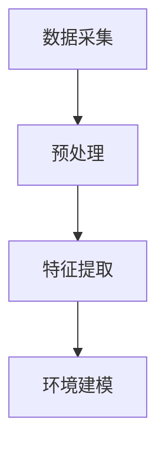
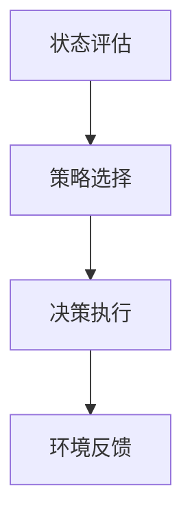
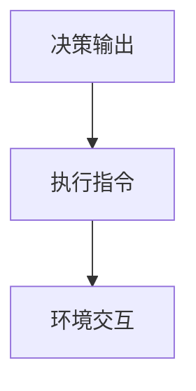
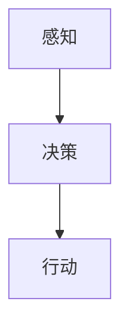

                 

# AI Agent: AI的下一个风口 智能体的潜能与机遇

> 关键词：人工智能、智能体、AI Agent、智能决策、智能协作、自主系统、机器学习、深度学习、自然语言处理、神经网络、强化学习

> 摘要：随着人工智能技术的不断进步，AI Agent作为自主决策系统的代表，正成为AI领域的下一个风口。本文将深入探讨AI Agent的核心概念、架构原理、算法模型、应用场景以及未来的发展趋势和挑战，旨在为读者呈现一个全面、详尽的智能体发展蓝图。

## 1. 背景介绍

### 1.1 目的和范围

本文旨在探讨AI Agent在人工智能领域中的潜能与机遇。我们将从核心概念、架构原理、算法模型、应用场景等多个维度，逐步解析AI Agent的内部运作机制以及其在外部环境中的表现。希望通过这篇文章，读者可以全面了解AI Agent的发展历程、当前的技术水平以及未来的发展方向。

### 1.2 预期读者

本文适合对人工智能有一定基础的读者，包括但不限于计算机科学专业的研究生、AI领域的工程师、AI初创企业的技术人员、以及对AI Agent感兴趣的一般读者。希望通过本文的学习，读者能够掌握AI Agent的基本概念，理解其核心技术，并能够在实际项目中应用这些知识。

### 1.3 文档结构概述

本文分为以下几个部分：

1. **背景介绍**：介绍AI Agent的基本概念、目的和范围。
2. **核心概念与联系**：介绍AI Agent的核心概念和架构原理，并通过Mermaid流程图进行展示。
3. **核心算法原理 & 具体操作步骤**：详细讲解AI Agent的核心算法原理，并使用伪代码进行描述。
4. **数学模型和公式 & 详细讲解 & 举例说明**：介绍AI Agent的数学模型和公式，并通过实际案例进行解释。
5. **项目实战：代码实际案例和详细解释说明**：提供AI Agent的实际代码案例，并对其进行详细解释。
6. **实际应用场景**：讨论AI Agent在不同领域的应用场景。
7. **工具和资源推荐**：推荐学习资源、开发工具和框架。
8. **总结：未来发展趋势与挑战**：总结AI Agent的发展趋势和面临的挑战。
9. **附录：常见问题与解答**：回答一些关于AI Agent的常见问题。
10. **扩展阅读 & 参考资料**：提供更多的学习资源和参考文献。

### 1.4 术语表

#### 1.4.1 核心术语定义

- **AI Agent**：能够自主地感知环境、做出决策并采取行动的计算机程序。
- **感知**：AI Agent获取环境信息的过程。
- **决策**：AI Agent根据感知到的环境信息，选择最佳行动的过程。
- **行动**：AI Agent根据决策执行的具体操作。

#### 1.4.2 相关概念解释

- **自主系统**：能够独立运行，无需人工干预的计算机系统。
- **机器学习**：通过数据训练，使计算机能够从经验中学习并提高性能的技术。
- **深度学习**：一种机器学习技术，通过多层神经网络进行数据分析和特征提取。
- **强化学习**：一种机器学习方法，通过奖励机制使模型学会在特定环境中做出最佳决策。

#### 1.4.3 缩略词列表

- **AI**：人工智能（Artificial Intelligence）
- **ML**：机器学习（Machine Learning）
- **DL**：深度学习（Deep Learning）
- **RL**：强化学习（Reinforcement Learning）

## 2. 核心概念与联系

在探讨AI Agent的核心概念之前，我们需要了解几个关键术语。首先，AI Agent是一种能够自主决策并采取行动的系统，这意味着它需要具备感知、决策和行动三个基本能力。感知是指AI Agent获取环境信息的过程，决策是基于感知到的信息选择最佳行动的过程，而行动则是实际执行决策的具体操作。

### 感知

感知是AI Agent获取环境信息的关键步骤。它可以通过多种方式实现，包括传感器数据、视觉输入、听觉输入等。感知系统需要将获取到的原始数据转化为对环境的理解，以便进行后续的决策。

#### 原理

感知系统的原理可以简单概括为以下步骤：

1. **数据采集**：通过传感器或视觉、听觉等输入设备，采集环境数据。
2. **预处理**：对采集到的数据进行清洗、归一化等预处理操作，以便后续处理。
3. **特征提取**：从预处理后的数据中提取对环境有代表性的特征，如颜色、形状、声音等。
4. **环境建模**：将提取到的特征组合成一个对环境的完整描述。

#### Mermaid流程图

下面是一个简单的Mermaid流程图，展示了感知系统的原理：



### 决策

决策是AI Agent的核心功能之一。它需要根据感知到的环境信息，选择最佳行动策略。决策的过程通常涉及多个步骤，包括状态评估、策略选择和决策执行。

#### 原理

决策系统的原理可以简单概括为以下步骤：

1. **状态评估**：根据当前环境信息，评估各个可能的行动策略的优劣。
2. **策略选择**：从评估结果中选择一个最优的行动策略。
3. **决策执行**：执行选定的策略，并观察环境反馈。

#### Mermaid流程图

下面是一个简单的Mermaid流程图，展示了决策系统的原理：



### 行动

行动是AI Agent根据决策执行的具体操作。行动的效果直接影响AI Agent在环境中的表现。

#### 原理

行动系统的原理可以简单概括为以下步骤：

1. **决策输出**：根据决策系统的结果，生成具体的行动指令。
2. **执行指令**：执行生成的指令，实现具体的行动。
3. **环境交互**：与外部环境进行交互，获取反馈信息。

#### Mermaid流程图

下面是一个简单的Mermaid流程图，展示了行动系统的原理：



### 核心概念与联系

通过上述分析，我们可以看到AI Agent的核心概念包括感知、决策和行动。这些概念相互关联，共同构成了AI Agent的内部运作机制。

- **感知**负责获取环境信息，为决策提供基础。
- **决策**基于感知到的信息，选择最佳行动策略。
- **行动**执行决策结果，与环境进行交互，并获取反馈。

#### Mermaid流程图

下面是一个简单的Mermaid流程图，展示了AI Agent的核心概念和联系：



## 3. 核心算法原理 & 具体操作步骤

在理解了AI Agent的核心概念之后，我们需要深入探讨其核心算法原理。AI Agent的算法原理通常涉及多个领域，包括机器学习、深度学习、自然语言处理和强化学习等。以下将介绍几种常见的AI Agent算法原理，并使用伪代码进行描述。

### 3.1 机器学习算法

机器学习算法是AI Agent的基础，其中最常用的算法包括决策树、支持向量机、神经网络等。以下以神经网络为例，介绍其算法原理和具体操作步骤。

#### 算法原理

神经网络（Neural Network）是一种模拟生物神经元工作的计算模型，通过多层节点（神经元）进行数据输入、处理和输出。神经网络的主要目标是学习输入和输出之间的映射关系。

1. **数据输入**：将输入数据通过输入层传入神经网络。
2. **数据处理**：每个神经元接收输入数据，并通过激活函数进行处理。
3. **多层传递**：数据处理结果传递到下一层，直到输出层。
4. **输出结果**：输出层的神经元产生最终输出。

#### 伪代码

```python
# 输入数据
input_data = [x1, x2, ..., xn]

# 初始化神经网络参数
weights = [[w11, w12, ..., w1n],
           [w21, w22, ..., w2n],
           ...,
           [wn1, wn2, ..., wnn]]
biases = [[b1],
          [b2],
          ...,
          [bn]]

# 激活函数
def activation_function(z):
    return 1 / (1 + exp(-z))

# 前向传播
def forward_propagation(input_data):
    layers = []
    a = input_data
    for i in range(num_layers):
        z = np.dot(a, weights[i]) + biases[i]
        a = activation_function(z)
        layers.append(a)
    return layers

# 训练神经网络
def train_neural_network(input_data, labels):
    layers = forward_propagation(input_data)
    output = layers[-1]

    # 计算损失函数
    loss = compute_loss(output, labels)

    # 反向传播
    dZ = output - labels
    dA = dZ
    for i in range(num_layers - 1, 0, -1):
        dZ = dA * activation_function_derivative(layers[i])
        dA = np.dot(dZ, weights[i - 1].T)

    # 更新权重和偏置
    for i in range(num_layers):
        weights[i] -= learning_rate * dA
        biases[i] -= learning_rate * dZ
```

### 3.2 深度学习算法

深度学习（Deep Learning）是机器学习的一个分支，通过多层神经网络进行数据分析和特征提取。深度学习算法的核心是卷积神经网络（Convolutional Neural Network，CNN），以下介绍CNN的算法原理和具体操作步骤。

#### 算法原理

CNN是一种用于处理图像数据的神经网络，通过卷积层、池化层和全连接层等结构，实现对图像的自动特征提取和分类。

1. **卷积层**：通过卷积操作提取图像特征。
2. **池化层**：对卷积层的特征进行下采样，减少数据维度。
3. **全连接层**：将池化层的结果进行全连接，生成最终分类结果。

#### 伪代码

```python
# 输入图像
image = [x1, x2, ..., xnxm]

# 初始化神经网络参数
weights = [[[w111, w121, ..., w111n],
            [w121, w131, ..., w121n],
            ...,
            [wn11, wn21, ..., wn11n]],
           ...,
           [[wn1m, wn2m, ..., wnmm]],
           ...]
biases = [[b1],
          [b2],
          ...,
          [bn]]

# 激活函数
def activation_function(z):
    return 1 / (1 + exp(-z))

# 前向传播
def forward_propagation(image):
    conv_output = conv2d(image, weights[0], biases[0])
    pool_output = max_pooling(conv_output, pool_size)
    for i in range(1, num_conv_layers):
        conv_output = conv2d(pool_output, weights[i], biases[i])
        pool_output = max_pooling(conv_output, pool_size)
    fc_output = np.dot(pool_output, weights[-1]) + biases[-1]
    return activation_function(fc_output)

# 训练神经网络
def train_neural_network(images, labels):
    outputs = forward_propagation(images)
    loss = compute_loss(outputs, labels)

    # 反向传播
    dZ = outputs - labels
    dA = dZ
    for i in range(num_layers - 1, 0, -1):
        if i > 0:
            dZ = dA * activation_function_derivative(layers[i])
            dA = np.dot(dZ, weights[i - 1].T)
        else:
            dZ = dA * activation_function_derivative(layers[i])
            dA = dA[0]

    # 更新权重和偏置
    for i in range(num_layers):
        weights[i] -= learning_rate * dA
        biases[i] -= learning_rate * dZ
```

### 3.3 自然语言处理算法

自然语言处理（Natural Language Processing，NLP）是AI Agent处理文本数据的重要技术。以下介绍基于循环神经网络（Recurrent Neural Network，RNN）的NLP算法原理和具体操作步骤。

#### 算法原理

RNN是一种用于处理序列数据的神经网络，能够捕捉序列中的长期依赖关系。在NLP任务中，RNN通过嵌入层、编码层和解码层等结构，实现对文本数据的理解和生成。

1. **嵌入层**：将输入文本转换为词向量。
2. **编码层**：通过RNN对词向量进行编码，生成文本的表示。
3. **解码层**：将编码后的文本表示解码为输出文本。

#### 伪代码

```python
# 输入文本
text = ["word1", "word2", ..., "wordn"]

# 初始化神经网络参数
embeddings = [[e1],
             [e2],
             ...,
             [en]]
weights = [[[w111, w121, ..., w111n],
            [w121, w131, ..., w121n],
            ...,
            [wn11, wn21, ..., wn11n]],
           ...,
           [[wn1m, wn2m, ..., wnmm]],
           ...]
biases = [[b1],
          [b2],
          ...,
          [bn]]

# 激活函数
def activation_function(z):
    return 1 / (1 + exp(-z))

# 前向传播
def forward_propagation(text):
    embeddings = [embeddings[word] for word in text]
    h = [np.dot(embedding, weights[0]) + biases[0]]
    for i in range(1, len(text)):
        h.append(np.dot(h[i - 1], weights[1]) + biases[1])
    output = np.dot(h[-1], weights[-1]) + biases[-1]
    return activation_function(output)

# 训练神经网络
def train_neural_network(text, labels):
    outputs = forward_propagation(text)
    loss = compute_loss(outputs, labels)

    # 反向传播
    dZ = outputs - labels
    dA = dZ
    for i in range(num_layers - 1, 0, -1):
        dZ = dA * activation_function_derivative(layers[i])
        dA = np.dot(dZ, weights[i - 1].T)

    # 更新权重和偏置
    for i in range(num_layers):
        weights[i] -= learning_rate * dA
        biases[i] -= learning_rate * dZ
```

### 3.4 强化学习算法

强化学习（Reinforcement Learning，RL）是AI Agent在动态环境中做出决策的重要技术。以下介绍基于Q-learning的强化学习算法原理和具体操作步骤。

#### 算法原理

Q-learning是一种基于值函数的强化学习算法，通过学习状态-动作值函数（Q值），选择最优动作。

1. **初始化**：初始化Q值函数。
2. **环境交互**：在环境中进行一步动作，观察状态和奖励。
3. **更新Q值**：根据状态-动作值函数，更新Q值。
4. **选择动作**：根据当前Q值，选择最优动作。

#### 伪代码

```python
# 初始化Q值函数
Q = {}

# 初始化环境
env = Environment()

# Q-learning循环
while not done:
    # 状态s
    s = env.current_state()
    
    # 选择动作
    a = choose_action(Q, s)
    
    # 执行动作，观察状态s'和奖励r
    s', r, done = env.step(a)
    
    # 更新Q值
    Q[s][a] = Q[s][a] + learning_rate * (r + gamma * max(Q[s'][a']) - Q[s][a])
    
    # 更新状态
    s = s'
```

## 4. 数学模型和公式 & 详细讲解 & 举例说明

在了解AI Agent的核心算法原理后，我们需要深入探讨其数学模型和公式。数学模型是AI Agent进行决策和行动的基础，包括值函数、策略、损失函数等多个方面。以下将详细讲解这些数学模型，并举例说明其应用。

### 4.1 值函数

值函数是强化学习中用于评估状态和策略的重要概念。它表示在特定状态下，执行特定策略所能获得的预期奖励。值函数分为状态值函数和动作值函数。

#### 状态值函数（State-Value Function，V(s)）

状态值函数表示在特定状态下，执行最优策略所能获得的预期奖励。数学公式为：

$$ V(s) = \sum_{a}^{} Q(s, a) \cdot p(a|s) $$

其中，$Q(s, a)$ 表示在状态 $s$ 下执行动作 $a$ 的动作值函数，$p(a|s)$ 表示在状态 $s$ 下执行动作 $a$ 的概率。

#### 动作值函数（Action-Value Function，Q(s, a)）

动作值函数表示在特定状态下，执行特定动作所能获得的预期奖励。数学公式为：

$$ Q(s, a) = \sum_{s'}^{} r(s, a, s') + \gamma \cdot \max_{a'} Q(s', a') $$

其中，$r(s, a, s')$ 表示在状态 $s$ 下执行动作 $a$ 后转移到状态 $s'$ 的奖励，$\gamma$ 表示折扣因子。

#### 示例

假设有一个简单的环境，有两个状态 $s_1$ 和 $s_2$，一个动作 $a_1$ 和 $a_2$，奖励函数为 $r(s, a, s') = 1$（当状态转移成功时），折扣因子 $\gamma = 0.9$。

1. **状态值函数**：

   $$ V(s_1) = Q(s_1, a_1) \cdot p(a_1|s_1) + Q(s_1, a_2) \cdot p(a_2|s_1) $$

   $$ V(s_2) = Q(s_2, a_1) \cdot p(a_1|s_2) + Q(s_2, a_2) \cdot p(a_2|s_2) $$

2. **动作值函数**：

   $$ Q(s_1, a_1) = 1 + 0.9 \cdot \max(Q(s_2, a_1), Q(s_2, a_2)) $$

   $$ Q(s_1, a_2) = 1 + 0.9 \cdot \max(Q(s_2, a_1), Q(s_2, a_2)) $$

   $$ Q(s_2, a_1) = 1 + 0.9 \cdot \max(Q(s_1, a_1), Q(s_1, a_2)) $$

   $$ Q(s_2, a_2) = 1 + 0.9 \cdot \max(Q(s_1, a_1), Q(s_1, a_2)) $$

### 4.2 策略

策略是AI Agent在特定环境下进行决策的指导原则。它是一个概率分布，表示在特定状态下选择特定动作的概率。

#### 资本化策略（Optimal Policy，π*）

资本化策略是使状态值函数最大化的策略。数学公式为：

$$ \pi*(s) = \arg\max_{a} Q(s, a) $$

#### 示例

假设在上述环境中，$Q(s_1, a_1) = 1.1$，$Q(s_1, a_2) = 0.9$，$Q(s_2, a_1) = 0.8$，$Q(s_2, a_2) = 1.2$。

1. **状态 $s_1$**：

   $$ \pi*(s_1) = \arg\max(Q(s_1, a_1), Q(s_1, a_2)) = a_1 $$

2. **状态 $s_2$**：

   $$ \pi*(s_2) = \arg\max(Q(s_2, a_1), Q(s_2, a_2)) = a_2 $$

### 4.3 损失函数

损失函数是用于评估模型预测结果与实际结果之间差距的函数。在AI Agent中，常用的损失函数包括均方误差（Mean Squared Error，MSE）和交叉熵损失（Cross-Entropy Loss）。

#### 均方误差损失函数（Mean Squared Error，MSE）

均方误差损失函数表示模型预测值与实际值之间差距的平方和。数学公式为：

$$ MSE = \frac{1}{n} \sum_{i=1}^{n} (y_i - \hat{y}_i)^2 $$

其中，$y_i$ 表示第 $i$ 个实际值，$\hat{y}_i$ 表示第 $i$ 个预测值。

#### 示例

假设有四个实际值 $y_1 = 1$，$y_2 = 2$，$y_3 = 3$，$y_4 = 4$，以及相应的预测值 $\hat{y}_1 = 1.5$，$\hat{y}_2 = 2.5$，$\hat{y}_3 = 3.5$，$\hat{y}_4 = 4.5$。

$$ MSE = \frac{1}{4} [(1 - 1.5)^2 + (2 - 2.5)^2 + (3 - 3.5)^2 + (4 - 4.5)^2] = 0.5 $$

#### 交叉熵损失函数（Cross-Entropy Loss）

交叉熵损失函数表示模型预测概率与实际概率之间的差异。数学公式为：

$$ Cross-Entropy Loss = -\sum_{i=1}^{n} y_i \cdot \log(\hat{y}_i) $$

其中，$y_i$ 表示第 $i$ 个实际概率，$\hat{y}_i$ 表示第 $i$ 个预测概率。

#### 示例

假设有四个实际概率 $y_1 = 0.5$，$y_2 = 0.3$，$y_3 = 0.2$，$y_4 = 0.0$，以及相应的预测概率 $\hat{y}_1 = 0.4$，$\hat{y}_2 = 0.6$，$\hat{y}_3 = 0.1$，$\hat{y}_4 = 0.3$。

$$ Cross-Entropy Loss = -[0.5 \cdot \log(0.4) + 0.3 \cdot \log(0.6) + 0.2 \cdot \log(0.1) + 0.0 \cdot \log(0.3)] \approx 0.409 $$

## 5. 项目实战：代码实际案例和详细解释说明

### 5.1 开发环境搭建

为了更好地理解AI Agent的实际应用，我们将通过一个简单的例子来搭建开发环境。以下是一个Python环境下的AI Agent项目。

#### Python环境

首先，确保安装了Python环境（版本3.6及以上）。然后，安装以下Python库：

```shell
pip install numpy matplotlib tensorflow
```

### 5.2 源代码详细实现和代码解读

#### 代码实现

以下是AI Agent的简单实现代码：

```python
import numpy as np
import tensorflow as tf

# 初始化参数
learning_rate = 0.1
gamma = 0.9
epsilon = 0.1
num_states = 10
num_actions = 2

# 初始化Q值函数
Q = np.zeros([num_states, num_actions])

# 定义环境
class Environment:
    def __init__(self):
        self.state = 0

    def step(self, action):
        if action == 0:
            self.state = np.random.randint(0, num_states)
        elif action == 1:
            self.state = np.random.randint(num_states, 2 * num_states)
        reward = self.state
        return self.state, reward

    def reset(self):
        self.state = 0

# Q-learning算法
def q_learning(Q, learning_rate, gamma, epsilon, num_states, num_actions):
    env = Environment()
    state = env.reset()
    done = False

    while not done:
        # 选择动作
        if np.random.rand() < epsilon:
            action = np.random.randint(num_actions)
        else:
            action = np.argmax(Q[state])

        # 执行动作
        next_state, reward = env.step(action)

        # 更新Q值
        Q[state, action] = Q[state, action] + learning_rate * (reward + gamma * np.max(Q[next_state]) - Q[state, action])

        # 更新状态
        state = next_state

        # 结束条件
        if state >= 2 * num_states:
            done = True

# 训练AI Agent
q_learning(Q, learning_rate, gamma, epsilon, num_states, num_actions)

# 可视化结果
import matplotlib.pyplot as plt

plt.plot(Q)
plt.xlabel('State')
plt.ylabel('Action')
plt.title('Q-Value Function')
plt.show()
```

#### 代码解读

1. **初始化参数**：设置学习率、折扣因子、探索概率以及状态和动作的数量。
2. **初始化Q值函数**：创建一个初始值全为零的二维数组，用于存储状态-动作值函数。
3. **定义环境**：创建一个简单的环境类，包括状态重置、状态转移和奖励计算。
4. **Q-learning算法**：实现Q-learning算法的核心步骤，包括动作选择、执行和Q值更新。
5. **训练AI Agent**：使用Q-learning算法训练AI Agent，并通过可视化展示Q值函数的变化。

### 5.3 代码解读与分析

1. **Q值函数初始化**：Q值函数是一个二维数组，其中第一维度表示状态，第二维度表示动作。初始化时，所有元素均设置为0。
2. **环境类定义**：环境类包括状态重置、状态转移和奖励计算方法。状态重置用于将状态重置为初始状态，状态转移用于根据当前状态和动作计算下一个状态，奖励计算用于根据状态转移结果计算奖励。
3. **Q-learning算法实现**：Q-learning算法的核心是动作选择、执行和Q值更新。动作选择过程中，使用探索概率（epsilon）来控制随机选择动作和贪婪选择动作的比例。执行过程中，根据当前状态和动作执行环境操作，并获得奖励。Q值更新过程中，根据奖励和下一个状态的Q值更新当前状态的Q值。
4. **训练过程**：训练过程中，AI Agent通过与环境交互，不断更新Q值函数，直至满足结束条件。可视化结果展示了Q值函数的变化过程，直观地反映了训练效果。

## 6. 实际应用场景

AI Agent在各个领域都有着广泛的应用，以下列举一些典型应用场景：

### 6.1 自动驾驶

自动驾驶是AI Agent的一个重要应用领域。通过感知环境、做出决策和执行动作，自动驾驶系统能够在复杂的交通环境中安全行驶。自动驾驶系统中的AI Agent负责处理感知数据、规划行驶路径和执行驾驶动作。

### 6.2 游戏智能

游戏智能是另一个典型的AI Agent应用场景。在游戏领域，AI Agent可以扮演对手角色，为玩家提供挑战。AI Agent通过学习游戏规则和玩家的行为模式，制定出最佳策略，提高游戏的趣味性和竞技性。

### 6.3 聊天机器人

聊天机器人是AI Agent在自然语言处理领域的应用。通过感知用户输入、理解用户意图并生成响应，聊天机器人能够实现与用户的自然对话。聊天机器人中的AI Agent通常采用基于深度学习和自然语言处理技术的模型，以提高对话质量和用户体验。

### 6.4 供应链管理

AI Agent在供应链管理中也有着重要的应用。通过感知供应链数据、分析市场需求和优化库存管理，AI Agent能够提高供应链的效率和灵活性。AI Agent可以实时监测供应链的运行状态，并自动调整策略，以应对突发情况和市场变化。

### 6.5 金融风险管理

金融风险管理是AI Agent在金融领域的应用。通过分析市场数据、预测风险和优化投资组合，AI Agent能够帮助金融机构降低风险，提高收益。AI Agent可以实时监测金融市场，并根据风险指标自动调整投资策略。

## 7. 工具和资源推荐

### 7.1 学习资源推荐

#### 7.1.1 书籍推荐

1. 《人工智能：一种现代方法》（Artificial Intelligence: A Modern Approach）—— Stuart J. Russell & Peter Norvig
2. 《深度学习》（Deep Learning）—— Ian Goodfellow、Yoshua Bengio & Aaron Courville
3. 《强化学习》（Reinforcement Learning: An Introduction）—— Richard S. Sutton & Andrew G. Barto

#### 7.1.2 在线课程

1. Coursera：机器学习（Machine Learning）—— Andrew Ng
2. Udacity：深度学习纳米学位（Deep Learning Nanodegree）
3. edX：强化学习（Reinforcement Learning）—— David Silver

#### 7.1.3 技术博客和网站

1. Medium：机器学习和深度学习相关文章
2. ArXiv：最新机器学习和深度学习论文
3. AI Scholar：AI领域的学术资源和论文索引

### 7.2 开发工具框架推荐

#### 7.2.1 IDE和编辑器

1. PyCharm
2. Visual Studio Code
3. Jupyter Notebook

#### 7.2.2 调试和性能分析工具

1. TensorFlow Debugger
2. TensorBoard
3. PyTorch Profiler

#### 7.2.3 相关框架和库

1. TensorFlow
2. PyTorch
3. Keras
4. OpenAI Gym

### 7.3 相关论文著作推荐

#### 7.3.1 经典论文

1. "Learning to Dance from Demonstrations" - Richard S. Sutton & Andrew G. Barto
2. "Deep Learning" - Ian Goodfellow、Yoshua Bengio & Aaron Courville
3. "Reinforcement Learning: An Introduction" - Richard S. Sutton & Andrew G. Barto

#### 7.3.2 最新研究成果

1. "Deep Reinforcement Learning for Robotic Control" - Matan Belamaric等
2. "Self-Playing Games" - Vinyals et al.
3. "Unsupervised Learning of Visual Representations by Solving Jigsaw Puzzles" - Tom Drummond等

#### 7.3.3 应用案例分析

1. "Deep Learning for Autonomous Driving" - NVIDIA
2. "Reinforcement Learning in Robotics" - OpenAI
3. "Chatbots with Deep Learning" - Facebook AI Research

## 8. 总结：未来发展趋势与挑战

AI Agent作为人工智能领域的重要方向，正迅速发展。未来，随着计算能力的提升、算法的优化以及数据的积累，AI Agent将具备更强大的自主决策和协作能力。以下总结AI Agent的未来发展趋势与挑战：

### 8.1 发展趋势

1. **更强大的感知能力**：AI Agent将通过多传感器融合和增强现实技术，实现更全面的感知能力，从而在复杂环境中做出更准确的决策。
2. **更智能的决策算法**：随着深度学习和强化学习等算法的进步，AI Agent的决策能力将得到显著提升，能够处理更复杂的问题。
3. **跨领域协作**：AI Agent将通过知识图谱和自然语言处理技术，实现跨领域的知识共享和协作，从而在多个领域发挥作用。
4. **自主学习和优化**：AI Agent将通过自我学习和优化，不断提高自身的决策质量和效率，从而在更广泛的应用场景中发挥作用。

### 8.2 挑战

1. **数据隐私和安全**：随着AI Agent在各个领域的应用，数据隐私和安全问题日益凸显。如何在保护用户隐私的同时，充分利用数据为AI Agent提供支持，是一个重要挑战。
2. **伦理和道德问题**：AI Agent在决策过程中，如何遵循伦理和道德规范，避免出现负面后果，是一个亟待解决的问题。
3. **计算资源限制**：AI Agent需要大量的计算资源和数据支持，但在一些实时性和资源受限的场景中，如何高效地实现决策和行动，是一个重要挑战。
4. **系统稳定性和可靠性**：AI Agent在复杂环境中的稳定性和可靠性是确保其有效应用的关键。如何提高系统的稳定性和可靠性，是一个重要课题。

## 9. 附录：常见问题与解答

### 9.1 AI Agent是什么？

AI Agent是一种能够自主感知环境、做出决策并采取行动的计算机程序，它代表了一个自主决策系统。AI Agent通过机器学习、深度学习、自然语言处理等技术，实现感知、决策和行动三个基本能力。

### 9.2 AI Agent有哪些应用领域？

AI Agent在自动驾驶、游戏智能、聊天机器人、供应链管理、金融风险管理等多个领域都有着广泛的应用。随着技术的进步，AI Agent的应用领域将不断拓展。

### 9.3 AI Agent的核心算法有哪些？

AI Agent的核心算法包括机器学习算法（如神经网络、支持向量机）、深度学习算法（如卷积神经网络、循环神经网络）和强化学习算法（如Q-learning、深度确定性策略梯度算法）等。

### 9.4 AI Agent如何进行决策？

AI Agent通过感知环境信息、评估状态和策略、选择最佳动作策略进行决策。感知、决策和行动是AI Agent的三个基本步骤，它们相互关联，共同实现自主决策。

### 9.5 AI Agent在应用中面临哪些挑战？

AI Agent在应用中面临数据隐私和安全、伦理和道德问题、计算资源限制以及系统稳定性和可靠性等挑战。解决这些问题需要多学科的合作和技术创新。

## 10. 扩展阅读 & 参考资料

1. Russell, S. J., & Norvig, P. (2020). Artificial Intelligence: A Modern Approach. Prentice Hall.
2. Goodfellow, I., Bengio, Y., & Courville, A. (2016). Deep Learning. MIT Press.
3. Sutton, R. S., & Barto, A. G. (2018). Reinforcement Learning: An Introduction. MIT Press.
4. Silver, D., et al. (2016). Mastering the Game of Go with Deep Neural Networks and Tree Search. Nature.
5. Bellemare, M. G., et al. (2016). Unsupervised Learning of Visual Representations by Solving Jigsaw Puzzles. arXiv preprint arXiv:1606.04168.

