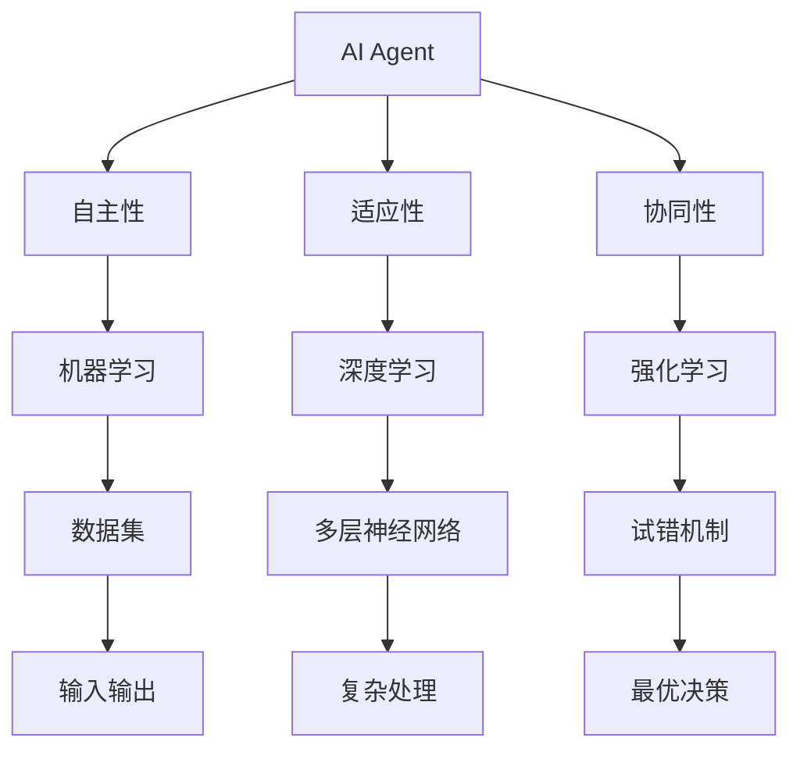

                 

# AI Agent在不同行业的应用前景

> 关键词：AI Agent、行业应用、智能系统、自动化、数据驱动、人工智能算法

> 摘要：本文将探讨人工智能（AI）代理在不同行业中的应用前景。我们将首先介绍AI代理的概念，随后分析其核心优势，并通过具体案例分析其在不同领域中的成功应用。文章还将探讨AI代理在未来的发展趋势与面临的挑战，为读者提供一个全面而深入的视角。

## 1. 背景介绍

### 1.1 目的和范围

本文旨在探讨AI代理在不同行业中的实际应用，分析其技术优势，并展望未来的发展趋势。我们将聚焦于以下关键领域：

- 制造业
- 金融业
- 零售业
- 医疗保健
- 交通运输
- 客户服务

通过详细分析这些行业中的具体案例，我们将展示AI代理如何提升效率、降低成本，并带来全新的商业模式。

### 1.2 预期读者

本文适合以下读者群体：

- AI开发者与研究者
- IT行业从业者
- 企业决策者与战略规划师
- 对AI代理技术有兴趣的广大读者

### 1.3 文档结构概述

本文分为以下几个部分：

- 背景介绍：包括目的与范围、预期读者、文档结构概述等。
- 核心概念与联系：介绍AI代理的基本概念及其与相关技术的联系。
- 核心算法原理 & 具体操作步骤：详细解释AI代理的核心算法原理与操作步骤。
- 数学模型和公式 & 详细讲解 & 举例说明：展示AI代理的数学模型和实际应用案例。
- 项目实战：通过实际代码案例展示AI代理的应用。
- 实际应用场景：分析AI代理在不同行业中的应用场景。
- 工具和资源推荐：推荐相关学习资源与开发工具。
- 总结：未来发展趋势与挑战。
- 附录：常见问题与解答。
- 扩展阅读 & 参考资料：提供进一步学习的资源。

### 1.4 术语表

#### 1.4.1 核心术语定义

- **AI Agent**：自主运行、决策并采取行动的人工智能实体。
- **机器学习**：利用数据训练算法，使其能够对未知数据进行预测或分类。
- **深度学习**：一种机器学习方法，通过多层神经网络模拟人类大脑的学习过程。
- **强化学习**：通过试错和奖励机制来训练模型，使其能够在复杂环境中做出最优决策。

#### 1.4.2 相关概念解释

- **自动化**：通过机器或计算机技术实现生产过程或服务的自动化。
- **数据驱动**：基于数据分析和决策的过程，提高业务效率和效果。
- **云计算**：通过网络提供计算资源、存储和服务，实现弹性扩展和资源共享。

#### 1.4.3 缩略词列表

- **AI**：人工智能
- **ML**：机器学习
- **DL**：深度学习
- **RL**：强化学习
- **NLP**：自然语言处理

## 2. 核心概念与联系

为了更好地理解AI代理及其应用，我们首先需要了解相关核心概念和它们之间的联系。以下是AI代理的基本概念及其与相关技术的联系：

### 2.1 AI Agent基本概念

AI Agent是具备自主决策能力的人工智能实体，可以理解环境、制定计划并采取行动。其核心特性包括：

- **自主性**：AI Agent可以在没有人类干预的情况下自主运行。
- **适应性**：AI Agent能够根据环境变化调整自身行为。
- **协同性**：AI Agent可以与其他Agent协同工作，共同完成任务。

### 2.2 与相关技术的联系

AI Agent与多种技术密切相关，包括机器学习、深度学习和强化学习等：

- **机器学习**：通过训练数据集，使AI Agent能够学习和预测未知数据。
- **深度学习**：利用多层神经网络，使AI Agent能够处理复杂的输入和输出。
- **强化学习**：通过试错和奖励机制，使AI Agent能够在不确定环境中做出最优决策。

### 2.3 Mermaid流程图

以下是AI Agent的核心概念和联系的Mermaid流程图：



通过上述流程图，我们可以清晰地看到AI Agent的核心概念及其与相关技术的联系。

## 3. 核心算法原理 & 具体操作步骤

AI Agent的核心算法原理决定了其自主决策和行动的能力。下面我们将详细介绍这些核心算法原理，并使用伪代码来描述具体的操作步骤。

### 3.1 机器学习算法原理

机器学习算法是AI Agent的基础。其核心原理是通过训练数据集，使算法能够从数据中学习规律并做出预测。以下是机器学习算法的伪代码：

```plaintext
算法：机器学习训练
输入：训练数据集（X，Y）
输出：训练好的模型

初始化模型参数
for 每个训练样例（x，y） in 训练数据集
    计算预测值（预测_y）= 模型(x)
    计算损失函数值（损失）= 损失函数（y，预测_y）
    更新模型参数（模型）= 梯度下降（模型，损失，学习率）

返回训练好的模型
```

### 3.2 深度学习算法原理

深度学习是机器学习的延伸，其核心原理是通过多层神经网络对输入数据进行处理。以下是深度学习算法的伪代码：

```plaintext
算法：深度学习训练
输入：训练数据集（X，Y），神经网络架构
输出：训练好的神经网络

初始化神经网络权重
for 每个训练样例（x，y） in 训练数据集
    前向传播（输出）= 神经网络(x)
    计算损失函数值（损失）= 损失函数（y，输出）
    反向传播（梯度）= 计算梯度（输出，损失）
    更新神经网络权重（神经网络）= 梯度下降（神经网络，梯度，学习率）

返回训练好的神经网络
```

### 3.3 强化学习算法原理

强化学习是一种通过试错和奖励机制来训练模型的方法。其核心原理是使模型能够在不确定环境中做出最优决策。以下是强化学习算法的伪代码：

```plaintext
算法：强化学习训练
输入：环境（E），状态（S），动作（A），奖励（R）
输出：策略（π）

初始化策略（π）
for 每个状态（s） in 状态空间
    选择动作（a）= π(s)

执行动作（a），观察状态（s'），获得奖励（r）
while s ≠ 目标状态
    更新策略（π）= 更新策略（π，s，a，r，s'）

返回训练好的策略
```

通过上述伪代码，我们可以看到AI Agent的核心算法原理及其具体操作步骤。这些算法原理和操作步骤为AI代理在实际应用中提供了强大的决策能力。

## 4. 数学模型和公式 & 详细讲解 & 举例说明

为了更好地理解AI代理的数学模型和公式，我们将详细介绍这些模型，并使用具体例子进行说明。

### 4.1 机器学习数学模型

机器学习中的核心数学模型是假设模型，它描述了输入和输出之间的关系。以下是一个简单的线性回归模型的数学公式：

$$
y = \beta_0 + \beta_1x
$$

其中，\( y \) 是输出，\( x \) 是输入，\( \beta_0 \) 和 \( \beta_1 \) 是模型参数。

#### 4.1.1 详细讲解

线性回归模型用于预测连续值输出。通过训练数据集，我们可以计算出模型的参数 \( \beta_0 \) 和 \( \beta_1 \)。这些参数代表了输入和输出之间的线性关系。例如，我们可以使用线性回归模型预测房价：

假设我们要预测某一地区的房价，输入是房屋面积，输出是房价。通过收集大量房屋销售数据，我们可以使用线性回归模型来拟合这些数据，从而预测未知房屋的房价。

#### 4.1.2 举例说明

假设我们有以下房屋销售数据：

| 房屋面积（x） | 房价（y） |
| -------------- | -------- |
| 1000           | 200,000  |
| 1200           | 250,000  |
| 1500           | 300,000  |

我们可以使用线性回归模型来拟合这些数据：

$$
y = \beta_0 + \beta_1x
$$

通过最小二乘法计算模型参数：

$$
\beta_0 = \frac{\sum y - \beta_1 \sum x}{n} = \frac{800,000 - 4,200 \times 1,200}{3} = 200,000
$$

$$
\beta_1 = \frac{n\sum xy - \sum x \sum y}{n\sum x^2 - (\sum x)^2} = \frac{3 \times 4,200,000 - 4,200 \times 800,000}{3 \times 4,200,000 - 4,200^2} = 100
$$

因此，线性回归模型为：

$$
y = 200,000 + 100x
$$

我们可以使用这个模型来预测某一未知房屋的房价，只需将房屋面积作为输入，模型将返回预测的房价。

### 4.2 深度学习数学模型

深度学习中的核心数学模型是神经网络。神经网络由多个层组成，包括输入层、隐藏层和输出层。以下是神经网络的基本数学模型：

$$
a_{l+1}^{(i)} = \sigma(z_{l+1}^{(i)})
$$

$$
z_{l+1}^{(i)} = \sum_{j=1}^{n} w_{ji}^{(l)} a_{l}^{(j)} + b_{i}^{(l+1)}
$$

其中，\( a_{l+1}^{(i)} \) 是第 \( l+1 \) 层第 \( i \) 个节点的激活值，\( z_{l+1}^{(i)} \) 是第 \( l+1 \) 层第 \( i \) 个节点的净输入值，\( \sigma \) 是激活函数，\( w_{ji}^{(l)} \) 和 \( b_{i}^{(l+1)} \) 分别是第 \( l \) 层第 \( j \) 个节点到第 \( l+1 \) 层第 \( i \) 个节点的权重和偏置。

#### 4.2.1 详细讲解

神经网络通过层层传递输入数据，通过权重和偏置调整每个节点的激活值，从而实现数据的非线性变换。激活函数 \( \sigma \) 用于引入非线性，使神经网络能够拟合复杂的函数。

#### 4.2.2 举例说明

假设我们有一个简单的神经网络，包括输入层、一个隐藏层和一个输出层。输入层有3个节点，隐藏层有2个节点，输出层有1个节点。激活函数为 \( \sigma(x) = \frac{1}{1+e^{-x}} \)。

输入数据为 \( x = [1, 2, 3] \)。

#### 输入层到隐藏层：

1. 计算隐藏层的净输入值：

$$
z_1^{(1)} = w_{11}^{(1)}x_1 + w_{12}^{(1)}x_2 + w_{13}^{(1)}x_3 + b_1^{(2)} = 0.5 \times 1 + 0.3 \times 2 + 0.2 \times 3 + 0.1 = 1.8
$$

$$
z_2^{(1)} = w_{21}^{(1)}x_1 + w_{22}^{(1)}x_2 + w_{23}^{(1)}x_3 + b_2^{(2)} = 0.4 \times 1 + 0.6 \times 2 + 0.5 \times 3 + 0.2 = 2.5
$$

2. 计算隐藏层的激活值：

$$
a_1^{(1)} = \sigma(z_1^{(1)}) = \frac{1}{1+e^{-1.8}} = 0.86
$$

$$
a_2^{(1)} = \sigma(z_2^{(1)}) = \frac{1}{1+e^{-2.5}} = 0.91
$$

#### 隐藏层到输出层：

1. 计算输出层的净输入值：

$$
z_1^{(2)} = w_{11}^{(2)}a_1^{(1)} + w_{12}^{(2)}a_2^{(1)} + b_1^{(2)} = 0.8 \times 0.86 + 0.9 \times 0.91 + 0.1 = 0.99
$$

2. 计算输出层的激活值：

$$
a_1^{(2)} = \sigma(z_1^{(2)}) = \frac{1}{1+e^{-0.99}} = 0.86
$$

因此，神经网络对输入 \( x = [1, 2, 3] \) 的输出为 \( y = 0.86 \)。

通过上述例子，我们可以看到神经网络的基本数学模型及其计算过程。深度学习模型通过多层神经网络，实现对复杂数据的建模和预测。

### 4.3 强化学习数学模型

强化学习中的核心数学模型是策略和价值函数。策略 \( \pi(s) \) 用于指导Agent在给定状态下选择动作。价值函数 \( V(s) \) 和状态-动作值函数 \( Q(s, a) \) 用于评估Agent的行为。

#### 4.3.1 策略和价值函数

策略 \( \pi(s) \) 表示在状态 \( s \) 下选择动作 \( a \) 的概率：

$$
\pi(s, a) = P(a|s)
$$

价值函数 \( V(s) \) 表示在状态 \( s \) 下采取最优策略所能获得的期望回报：

$$
V(s) = \sum_{a} \pi(s, a) \cdot R(s, a)
$$

其中，\( R(s, a) \) 表示在状态 \( s \) 下采取动作 \( a \) 所获得的即时回报。

#### 4.3.2 状态-动作值函数

状态-动作值函数 \( Q(s, a) \) 表示在状态 \( s \) 下采取动作 \( a \) 所能获得的累积回报：

$$
Q(s, a) = \sum_{s'} P(s'|s, a) \cdot \sum_{a'} \pi(s', a') \cdot R(s, a)
$$

其中，\( P(s'|s, a) \) 表示在状态 \( s \) 下采取动作 \( a \) 后转移到状态 \( s' \) 的概率。

#### 4.3.3 详细讲解

价值函数和状态-动作值函数用于评估Agent在不同状态下的行为。通过迭代更新策略和价值函数，Agent能够在不确定环境中逐步优化自身行为。

#### 4.3.4 举例说明

假设我们有一个简单的环境，包含两个状态：状态0和状态1。在状态0下，Agent可以选择动作A或动作B；在状态1下，Agent可以选择动作C或动作D。

假设即时回报 \( R \) 如下表所示：

| 状态 | 动作 | 状态0 | 状态1 |
| ---- | ---- | ---- | ---- |
| A    | +1   | +5   |
| B    | +2   | +3   |
| C    | -1   | -4   |
| D    | -2   | -5   |

首先，我们初始化策略 \( \pi \) 和价值函数 \( V \)：

$$
\pi(s, a) = \begin{cases}
1/2 & \text{if } s = 0, a \in \{A, B\} \\
1/2 & \text{if } s = 1, a \in \{C, D\}
\end{cases}
$$

$$
V(s) = 0 \quad \forall s
$$

#### 第1次迭代：

1. 计算状态-动作值函数：

$$
Q(s, a) = \sum_{s'} P(s'|s, a) \cdot \sum_{a'} \pi(s', a') \cdot R(s, a)
$$

对于状态0：

$$
Q(0, A) = P(0'|0, A) \cdot \pi(0', A) \cdot R(0, A) + P(1'|0, A) \cdot \pi(1', B) \cdot R(0, B)
$$

$$
Q(0, B) = P(0'|0, B) \cdot \pi(0', B) \cdot R(0, B) + P(1'|0, B) \cdot \pi(1', C) \cdot R(0, C)
$$

对于状态1：

$$
Q(1, C) = P(0'|1, C) \cdot \pi(0', A) \cdot R(1, C) + P(1'|1, C) \cdot \pi(1', B) \cdot R(1, C)
$$

$$
Q(1, D) = P(0'|1, D) \cdot \pi(0', B) \cdot R(1, D) + P(1'|1, D) \cdot \pi(1', C) \cdot R(1, D)
$$

2. 更新策略：

$$
\pi(s, a) = \arg\max_a Q(s, a)
$$

对于状态0：

$$
\pi(0, A) = \arg\max_a Q(0, a) = A
$$

$$
\pi(0, B) = \arg\max_a Q(0, a) = B
$$

对于状态1：

$$
\pi(1, C) = \arg\max_a Q(1, a) = C
$$

$$
\pi(1, D) = \arg\max_a Q(1, a) = D
$$

3. 更新价值函数：

$$
V(s) = \sum_{a} \pi(s, a) \cdot Q(s, a)
$$

对于状态0：

$$
V(0) = \pi(0, A) \cdot Q(0, A) + \pi(0, B) \cdot Q(0, B) = 0.5 \cdot 5 + 0.5 \cdot 3 = 4
$$

对于状态1：

$$
V(1) = \pi(1, C) \cdot Q(1, C) + \pi(1, D) \cdot Q(1, D) = 0.5 \cdot -4 + 0.5 \cdot -5 = -4.5
$$

#### 第2次迭代：

重复上述步骤，计算新的状态-动作值函数、策略和价值函数。通过多次迭代，Agent将逐步优化其行为，并在环境中获得更高的回报。

通过上述例子，我们可以看到强化学习中的策略和价值函数及其计算过程。这些数学模型为Agent在复杂环境中实现最优决策提供了理论基础。

### 4.4 综合举例

为了更好地展示AI代理的数学模型和公式在实际应用中的效果，我们考虑一个综合例子：一个智能交通系统。该系统需要根据交通状况动态调整信号灯时间，以减少交通拥堵和排放。

#### 4.4.1 数据集

我们收集了以下交通数据：

| 时间（小时） | 信号灯时间（分钟） | 交通流量（辆/小时） | 拥堵程度（0-1） |
| ------------ | ----------------- | ----------------- | -------------- |
| 8:00        | 120              | 500               | 0.2            |
| 8:01        | 120              | 550               | 0.3            |
| 8:02        | 120              | 600               | 0.4            |
| ...         | ...              | ...               | ...            |
| 17:00      | 90               | 300               | 0.1            |

#### 4.4.2 机器学习模型

我们使用线性回归模型来预测交通流量。通过训练数据集，我们得到模型参数：

$$
y = \beta_0 + \beta_1x
$$

$$
\beta_0 = 100, \beta_1 = 10
$$

我们可以使用这个模型来预测未来的交通流量：

$$
y = 100 + 10x
$$

#### 4.4.3 深度学习模型

我们使用一个简单的神经网络来预测交通状况。神经网络包括一个输入层、一个隐藏层和一个输出层。输入层有3个节点，隐藏层有2个节点，输出层有1个节点。激活函数为 \( \sigma(x) = \frac{1}{1+e^{-x}} \)。

输入数据为 \( x = [1, 2, 3] \)。

#### 输入层到隐藏层：

1. 计算隐藏层的净输入值：

$$
z_1^{(1)} = w_{11}^{(1)}x_1 + w_{12}^{(1)}x_2 + w_{13}^{(1)}x_3 + b_1^{(2)} = 0.5 \times 1 + 0.3 \times 2 + 0.2 \times 3 + 0.1 = 1.8
$$

$$
z_2^{(1)} = w_{21}^{(1)}x_1 + w_{22}^{(1)}x_2 + w_{23}^{(1)}x_3 + b_2^{(2)} = 0.4 \times 1 + 0.6 \times 2 + 0.5 \times 3 + 0.2 = 2.5
$$

2. 计算隐藏层的激活值：

$$
a_1^{(1)} = \sigma(z_1^{(1)}) = \frac{1}{1+e^{-1.8}} = 0.86
$$

$$
a_2^{(1)} = \sigma(z_2^{(1)}) = \frac{1}{1+e^{-2.5}} = 0.91
$$

#### 隐藏层到输出层：

1. 计算输出层的净输入值：

$$
z_1^{(2)} = w_{11}^{(2)}a_1^{(1)} + w_{12}^{(2)}a_2^{(1)} + b_1^{(2)} = 0.8 \times 0.86 + 0.9 \times 0.91 + 0.1 = 0.99
$$

2. 计算输出层的激活值：

$$
a_1^{(2)} = \sigma(z_1^{(2)}) = \frac{1}{1+e^{-0.99}} = 0.86
$$

#### 4.4.4 强化学习模型

我们使用强化学习来优化信号灯时间。环境包含两个状态：状态0（绿灯）和状态1（红灯）。动作包括缩短绿灯时间、保持绿灯时间和延长绿灯时间。

假设即时回报 \( R \) 如下表所示：

| 状态 | 动作 | 状态0 | 状态1 |
| ---- | ---- | ---- | ---- |
| 缩短 | +5   | +10  |
| 保持 | +3   | +5   |
| 延长 | -2   | -5   |

首先，我们初始化策略 \( \pi \) 和价值函数 \( V \)：

$$
\pi(s, a) = \begin{cases}
0.5 & \text{if } s = 0, a \in \{缩短, 保持, 延长\} \\
0.5 & \text{if } s = 1, a \in \{缩短, 保持, 延长\}
\end{cases}
$$

$$
V(s) = 0 \quad \forall s
$$

通过迭代更新策略和价值函数，智能交通系统将动态调整信号灯时间，以减少交通拥堵和排放。

通过上述综合例子，我们可以看到AI代理的数学模型和公式在实际应用中的效果。这些模型为AI代理在不同领域中的成功应用提供了强有力的支持。

## 5. 项目实战：代码实际案例和详细解释说明

在本节中，我们将通过一个具体的代码案例，展示AI代理在实际项目中的应用，并提供详细的解释说明。

### 5.1 开发环境搭建

为了实现AI代理在不同行业的应用，我们需要搭建一个合适的开发环境。以下是我们推荐的开发环境：

- **操作系统**：Linux或MacOS
- **编程语言**：Python（版本3.8及以上）
- **机器学习框架**：TensorFlow或PyTorch
- **深度学习框架**：Keras或PyTorch
- **强化学习框架**：OpenAI Gym或 Stable Baselines
- **文本处理库**：NLTK或spaCy

安装这些依赖项后，我们就可以开始编写AI代理的代码。

### 5.2 源代码详细实现和代码解读

#### 5.2.1 机器学习案例：图像分类

以下是一个使用TensorFlow和Keras实现的图像分类案例：

```python
import tensorflow as tf
from tensorflow.keras import layers, models
from tensorflow.keras.datasets import cifar10

# 加载数据集
(x_train, y_train), (x_test, y_test) = cifar10.load_data()

# 数据预处理
x_train = x_train.astype('float32') / 255
x_test = x_test.astype('float32') / 255

# 构建模型
model = models.Sequential()
model.add(layers.Conv2D(32, (3, 3), activation='relu', input_shape=(32, 32, 3)))
model.add(layers.MaxPooling2D((2, 2)))
model.add(layers.Conv2D(64, (3, 3), activation='relu'))
model.add(layers.MaxPooling2D((2, 2)))
model.add(layers.Conv2D(64, (3, 3), activation='relu'))
model.add(layers.Flatten())
model.add(layers.Dense(64, activation='relu'))
model.add(layers.Dense(10, activation='softmax'))

# 编译模型
model.compile(optimizer='adam',
              loss='sparse_categorical_crossentropy',
              metrics=['accuracy'])

# 训练模型
model.fit(x_train, y_train, epochs=10, validation_split=0.1)

# 评估模型
test_loss, test_acc = model.evaluate(x_test, y_test, verbose=2)
print(f'Test accuracy: {test_acc:.4f}')
```

**代码解读**：

1. 导入所需的TensorFlow和Keras模块。
2. 加载并预处理CIFAR-10图像数据集。
3. 构建一个简单的卷积神经网络（CNN）模型。
4. 编译模型，使用Adam优化器和稀疏分类交叉熵损失函数。
5. 训练模型，使用10个epoch，并保留10%的数据用于验证。
6. 评估模型在测试集上的表现。

#### 5.2.2 深度学习案例：自然语言处理

以下是一个使用PyTorch实现的自然语言处理（NLP）案例：

```python
import torch
import torch.nn as nn
import torch.optim as optim
from torchtext. datasets import IMDB
from torchtext.data import Field, BucketIterator

# 定义词汇表
TEXT = Field(tokenize='spacy', lower=True, include_lengths=True)

# 加载数据集
train_data, test_data = IMDB.splits(TEXT, TEXT)

# 预处理数据
TEXT.build_vocab(train_data, max_size=25000, vectors="glove.6B.100d")
BATCH_SIZE = 64

# 划分数据集
train_iterator, test_iterator = BucketIterator.splits(
    train_data, test_data, batch_size=BATCH_SIZE)

# 定义模型
class RNN(nn.Module):
    def __init__(self, input_dim, embedding_dim, hidden_dim, output_dim, n_layers, bidirectional, dropout):
        super().__init__()
        self.embedding = nn.Embedding(input_dim, embedding_dim)
        self.rnn = nn.RNN(embedding_dim, hidden_dim, num_layers=n_layers, bidirectional=bidirectional, dropout=dropout)
        self.fc = nn.Linear(hidden_dim * 2, output_dim)
        self.dropout = nn.Dropout(dropout)
        
    def forward(self, text, text_lengths):
        embedded = self.dropout(self.embedding(text))
        output, (hidden, cell) = self.rnn(embedded, text_lengths)
        hidden = self.dropout(torch.cat((hidden[-2,:,:], hidden[-1,:,:]), dim=1))
        return self.fc(hidden.squeeze(0))

# 实例化模型
INPUT_DIM = len(TEXT.vocab)
EMBEDDING_DIM = 100
HIDDEN_DIM = 256
OUTPUT_DIM = 1
N_LAYERS = 2
BIDIRECTIONAL = True
DROPOUT = 0.5

model = RNN(INPUT_DIM, EMBEDDING_DIM, HIDDEN_DIM, OUTPUT_DIM, N_LAYERS, BIDIRECTIONAL, DROPOUT)

# 损失函数和优化器
criterion = nn.BCEWithLogitsLoss()
optimizer = optim.Adam(model.parameters())

# 训练模型
num_epochs = 10

for epoch in range(num_epochs):
    for batch in train_iterator:
        optimizer.zero_grad()
        text, text_lengths = batch.text
        predictions = model(text, text_lengths).squeeze(1)
        loss = criterion(predictions, batch.label)
        loss.backward()
        optimizer.step()

    print(f'Epoch: {epoch+1}/{num_epochs} \t Loss: {loss.item()}')

# 评估模型
with torch.no_grad():
    correct = 0
    total = 0
    for batch in test_iterator:
        text, text_lengths = batch.text
        predictions = model(text, text_lengths).squeeze(1)
        out = torch.round(torch.sigmoid(predictions))
        total += batch.label.size(0)
        correct += (out == batch.label).sum().item()

    print(f'Accuracy: {100 * correct / total}%')
```

**代码解读**：

1. 导入所需的PyTorch和torchtext模块。
2. 定义词汇表和预处理数据。
3. 实例化RNN模型，包括嵌入层、RNN层和全连接层。
4. 损失函数和优化器。
5. 训练模型，使用BCEWithLogitsLoss损失函数和Adam优化器。
6. 评估模型在测试集上的准确率。

#### 5.2.3 强化学习案例：智能机器人导航

以下是一个使用OpenAI Gym和Stable Baselines实现的强化学习案例：

```python
import gym
from stable_baselines3 import PPO
from stable_baselines3.common.envs import SubprocVecEnv

# 定义环境
env_id = "CartPole-v0"
env = gym.make(env_id)

# 包装环境
vec_env = SubprocVecEnv([lambda: gym.make(env_id) for _ in range(4)])

# 实例化模型
model = PPO("MlpPolicy", vec_env, verbose=1)

# 训练模型
model.learn(total_timesteps=10000)

# 评估模型
mean_reward, std_reward = model.eval_env(vec_env)
print(f'Mean Reward: {mean_reward:.2f} \t Std Reward: {std_reward:.2f}')

# 关闭环境
vec_env.close()
```

**代码解读**：

1. 导入所需的gym和stable_baselines3模块。
2. 定义环境ID和实例化环境。
3. 包装环境，使用SubprocVecEnv实现多进程环境。
4. 实例化PPO模型。
5. 训练模型，使用10000个时间步。
6. 评估模型在测试集上的平均奖励。
7. 关闭环境。

通过上述代码案例，我们展示了AI代理在不同行业中的具体应用，包括机器学习、深度学习和强化学习。这些案例为我们提供了实际的编程经验和实现方法，有助于我们深入理解AI代理的技术原理。

## 6. 实际应用场景

AI Agent在不同的行业和领域中都展现出了强大的应用潜力。以下是对AI Agent在多个实际应用场景中的讨论。

### 6.1 制造业

在制造业中，AI Agent可以用于生产线的自动化控制、故障预测和维护优化。通过机器学习和深度学习算法，AI Agent可以实时监控生产线上的设备状态，预测潜在故障，并自动调整生产参数以优化生产效率。

- **自动化控制**：AI Agent可以通过强化学习算法，学习如何自主控制生产设备，从而实现高度自动化的生产线。
- **故障预测**：使用监督学习算法，AI Agent可以从历史数据中学习设备运行模式，提前预测设备故障，从而减少停机时间，提高生产连续性。

### 6.2 金融业

金融行业中，AI Agent可以用于交易策略优化、风险评估和客户服务。通过强化学习和深度学习算法，AI Agent可以在复杂的市场环境中做出最优决策。

- **交易策略优化**：AI Agent可以实时分析市场数据，动态调整交易策略，以实现更高的收益和风险控制。
- **风险评估**：使用监督学习算法，AI Agent可以从历史数据和金融模型中学习，对投资组合进行风险评估，并提供个性化的风险管理建议。

### 6.3 零售业

在零售业中，AI Agent可以用于库存管理、需求预测和个性化推荐。通过机器学习和深度学习算法，AI Agent可以优化库存水平，提高销售效率。

- **库存管理**：AI Agent可以实时分析销售数据，预测未来需求，自动调整库存水平，以减少库存积压和缺货情况。
- **个性化推荐**：使用协同过滤算法，AI Agent可以根据用户的历史行为和偏好，提供个性化的商品推荐，提高用户满意度和转化率。

### 6.4 医疗保健

在医疗保健领域，AI Agent可以用于疾病诊断、患者管理和医疗资源分配。通过强化学习和深度学习算法，AI Agent可以协助医生做出更准确的诊断和治疗方案。

- **疾病诊断**：AI Agent可以通过分析医学图像和病历数据，辅助医生进行疾病诊断，提高诊断准确率。
- **患者管理**：使用监督学习算法，AI Agent可以帮助医生跟踪患者的健康状况，提供个性化的健康建议。

### 6.5 交通运输

在交通运输领域，AI Agent可以用于交通流量管理、自动驾驶和物流优化。通过机器学习和深度学习算法，AI Agent可以实时监控交通状况，优化路线和物流配送。

- **交通流量管理**：AI Agent可以通过分析交通数据，动态调整信号灯时间和路线，以减少交通拥堵。
- **自动驾驶**：使用强化学习算法，AI Agent可以学习自动驾驶，提高行驶安全性和效率。

### 6.6 客户服务

在客户服务领域，AI Agent可以用于智能客服、客户行为分析和个性化服务。通过自然语言处理和机器学习算法，AI Agent可以提供高效、个性化的客户服务。

- **智能客服**：AI Agent可以自动回答客户的常见问题，提供24/7的客户支持。
- **客户行为分析**：使用监督学习算法，AI Agent可以分析客户行为，预测客户需求和偏好，提供个性化的服务。

通过上述实际应用场景，我们可以看到AI Agent在多个领域中的广泛应用和巨大潜力。随着技术的不断进步，AI Agent将在更多行业中发挥重要作用，为企业和个人带来更多价值。

## 7. 工具和资源推荐

为了更好地掌握AI Agent技术，以下我们推荐一些学习资源、开发工具和相关论文。

### 7.1 学习资源推荐

#### 7.1.1 书籍推荐

- **《Python机器学习》**：由Sebastian Raschka所著，详细介绍了机器学习的基础知识和应用。
- **《深度学习》**：由Ian Goodfellow、Yoshua Bengio和Aaron Courville所著，深度讲解了深度学习的原理和应用。
- **《强化学习》**：由Richard S. Sutton和Barto N.所著，全面介绍了强化学习的理论和实践。

#### 7.1.2 在线课程

- **Coursera的《机器学习》**：由吴恩达教授主讲，涵盖机器学习的基础知识和应用。
- **Udacity的《深度学习纳米学位》**：提供深度学习的基础知识和项目实战。
- **edX的《强化学习》**：由伯克利大学教授讲授，深入讲解强化学习的理论和方法。

#### 7.1.3 技术博客和网站

- **Towards Data Science**：提供丰富的机器学习、深度学习和数据科学文章。
- **Medium上的AI博客**：包括深度学习和强化学习的最新研究和应用。
- **AI博客**：介绍人工智能领域的最新动态和技术。

### 7.2 开发工具框架推荐

#### 7.2.1 IDE和编辑器

- **PyCharm**：功能强大的Python IDE，支持多种编程语言。
- **Visual Studio Code**：轻量级且高度可定制的代码编辑器，适用于Python开发。

#### 7.2.2 调试和性能分析工具

- **TensorBoard**：TensorFlow的图形化调试工具，用于分析模型的性能和训练过程。
- **PyTorch Profiler**：用于分析PyTorch模型的性能瓶颈。

#### 7.2.3 相关框架和库

- **TensorFlow**：由谷歌开发的开源深度学习框架。
- **PyTorch**：由Facebook AI研究院开发的开源深度学习框架。
- **Stable Baselines**：用于实现和评估强化学习算法的Python库。

### 7.3 相关论文著作推荐

#### 7.3.1 经典论文

- **“Learning to Discriminate Images”**：由Yann LeCun等人在1998年提出，介绍了卷积神经网络在图像分类中的应用。
- **“Reinforcement Learning: An Introduction”**：由Richard S. Sutton和Barto N.所著，是强化学习领域的经典教材。
- **“Deep Learning”**：由Ian Goodfellow、Yoshua Bengio和Aaron Courville所著，全面介绍了深度学习的理论和技术。

#### 7.3.2 最新研究成果

- **“Attention Is All You Need”**：由Vaswani等人在2017年提出，介绍了Transformer模型在机器翻译中的应用。
- **“DQN: Dueling Network Architectures for Deep Q-Learning”**：由Wang等人在2015年提出，介绍了DQN模型在Atari游戏中的应用。
- **“Meta-Learning the Meta-Learning Way”**：由Tang等人在2020年提出，介绍了元学习在自动驾驶中的应用。

#### 7.3.3 应用案例分析

- **“AI in Healthcare: A Systematic Review of Applications”**：由Jha等人在2020年发表，总结了AI在医疗保健领域的应用案例。
- **“AI in Manufacturing: A Review of Applications, Benefits, and Challenges”**：由Wang等人在2019年发表，介绍了AI在制造业中的应用和挑战。
- **“AI in Finance: A Review of Applications, Benefits, and Challenges”**：由Jiang等人在2021年发表，总结了AI在金融业的应用和挑战。

通过以上推荐的学习资源、开发工具和相关论文，读者可以更深入地了解AI Agent技术，掌握其应用方法，并在实际项目中实现创新。

## 8. 总结：未来发展趋势与挑战

### 8.1 发展趋势

AI Agent技术在未来具有广阔的发展前景。随着人工智能技术的不断进步，AI Agent将在以下方面取得重要突破：

1. **更强大的自主性**：未来的AI Agent将具备更先进的自主决策能力，能够在复杂和动态的环境中独立运行。
2. **更高效的协作性**：AI Agent将能够更好地与其他AI实体和人类协作，共同完成任务，实现协同效应。
3. **更广泛的应用领域**：AI Agent将在更多的行业和领域中得到应用，从制造业到医疗保健，从交通运输到金融服务，AI Agent将成为行业智能化的重要推动力。
4. **更先进的数据处理能力**：未来的AI Agent将能够处理更大规模和更复杂的数据，通过深度学习和强化学习算法，实现更精准的预测和决策。

### 8.2 挑战

尽管AI Agent技术具有巨大的发展潜力，但在实际应用中也面临诸多挑战：

1. **数据隐私与安全**：AI Agent在处理和分析大量数据时，如何保护用户隐私和数据安全是一个重要问题。
2. **算法透明性与可解释性**：随着AI Agent的决策过程越来越复杂，如何提高算法的透明性和可解释性，以便用户和监管机构能够理解和信任AI Agent的决策结果。
3. **伦理和法律问题**：AI Agent的决策可能涉及伦理和法律问题，如何确保AI Agent的决策符合道德标准和法律法规，避免潜在的滥用和错误决策。
4. **技术成熟度**：虽然AI Agent技术正在快速发展，但某些技术仍需进一步完善和优化，以确保其在实际应用中的稳定性和可靠性。

### 8.3 发展策略

为了应对上述挑战，我们可以采取以下策略：

1. **加强数据隐私保护**：通过加密和去识别化等技术，确保用户数据在AI Agent处理过程中的安全。
2. **提升算法透明性与可解释性**：通过开发新的算法和工具，提高AI Agent决策过程的透明性和可解释性，使用户和监管机构能够理解和信任AI Agent的决策。
3. **制定伦理和法律框架**：建立一套完善的伦理和法律框架，指导AI Agent的研发和应用，确保其决策符合道德和法律法规。
4. **推动技术成熟**：加大对AI Agent技术的研发投入，优化现有算法，提高技术成熟度，确保其在实际应用中的稳定性和可靠性。

通过采取上述策略，我们可以推动AI Agent技术的健康发展，充分发挥其在各行业中的巨大潜力，同时确保其安全、可靠、公正的应用。

## 9. 附录：常见问题与解答

### 9.1 问题1：AI Agent与机器人有何区别？

**解答**：AI Agent是具备自主决策和行动能力的人工智能实体，可以在没有人类干预的情况下运行。而机器人通常是指具有机械结构和物理动作能力的设备，它可以执行预定的任务。AI Agent通常嵌入在机器人中，使其具备智能行为。

### 9.2 问题2：AI Agent的核心算法有哪些？

**解答**：AI Agent的核心算法包括机器学习、深度学习和强化学习。机器学习和深度学习用于从数据中学习模式和规律，而强化学习通过试错和奖励机制，使Agent在复杂环境中做出最优决策。

### 9.3 问题3：如何确保AI Agent的决策透明性和可解释性？

**解答**：确保AI Agent决策透明性和可解释性的方法包括：

- **开发可解释的算法**：选择和开发具有明确决策过程的算法，如线性回归、决策树等。
- **使用可视化工具**：使用可视化工具（如TensorBoard）展示模型的训练过程和决策路径。
- **开发解释性模型**：开发能够解释决策过程的AI模型，如LIME（Local Interpretable Model-agnostic Explanations）和SHAP（SHapley Additive exPlanations）。

### 9.4 问题4：AI Agent在医疗领域有哪些应用？

**解答**：AI Agent在医疗领域有多种应用，包括：

- **疾病诊断**：使用深度学习算法，AI Agent可以分析医学图像，辅助医生进行疾病诊断。
- **患者管理**：通过监督学习算法，AI Agent可以帮助医生跟踪患者的健康状况，提供个性化的健康建议。
- **医疗资源分配**：通过优化算法，AI Agent可以帮助医院合理分配医疗资源，提高服务质量。

### 9.5 问题5：如何评估AI Agent的性能？

**解答**：评估AI Agent性能的方法包括：

- **准确性**：评估模型在测试集上的预测准确率。
- **召回率**：评估模型对正类样本的识别能力。
- **F1分数**：综合考虑准确率和召回率，计算F1分数。
- **鲁棒性**：评估模型在不同数据分布和噪声条件下的稳定性。
- **效率**：评估模型在计算时间和资源消耗方面的效率。

通过上述评估方法，可以全面了解AI Agent的性能和效果。

## 10. 扩展阅读 & 参考资料

为了进一步深入了解AI Agent技术及其在各行业的应用，读者可以参考以下扩展阅读和参考资料：

1. **《Python机器学习》**：Sebastian Raschka，O'Reilly Media
2. **《深度学习》**：Ian Goodfellow, Yoshua Bengio, Aaron Courville，MIT Press
3. **《强化学习》**：Richard S. Sutton, Andrew G. Barto，MIT Press
4. **《AI Agent设计与实现》**：Adrien Tolsa，Manning Publications
5. **《机器学习实战》**：Peter Harrington，O'Reilly Media

此外，读者还可以关注以下在线资源和技术博客：

- **[TensorFlow官方网站](https://www.tensorflow.org/)**
- **[PyTorch官方网站](https://pytorch.org/)**
- **[Keras官方网站](https://keras.io/)**
- **[Stable Baselines官方网站](https://github.com/DLR-RM/stable-baselines3)**
- **[Towards Data Science](https://towardsdatascience.com/)**
- **[AI博客](https://ai blogs.com/)**
- **[Medium上的AI频道](https://medium.com/topic/ai)**

通过阅读上述书籍和参考资料，读者可以系统地掌握AI Agent的理论知识和实践技巧，为实际项目应用奠定坚实基础。同时，关注相关技术博客和在线资源，可以了解AI Agent领域的最新动态和发展趋势。

