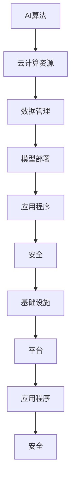

                 

# AI Cloud的未来领袖：贾扬清的创业故事，Lepton AI的前景与挑战

> 关键词：贾扬清、AI Cloud、创业故事、Lepton AI、人工智能、云计算、技术创新

> 摘要：本文将深入探讨人工智能领域杰出人物贾扬清的创业故事，特别是在他创立的Lepton AI公司的背后。文章将分析AI Cloud技术趋势，探讨其在现代云计算环境下的重要性和挑战，同时提供对Lepton AI在技术创新和应用中的深入见解。通过详细解读贾扬清的创业经历，本文旨在揭示人工智能技术在云计算领域的前景和面临的挑战。

## 1. 背景介绍

### 1.1 目的和范围

本文旨在通过探讨贾扬清及其创立的Lepton AI，分析AI Cloud技术的发展趋势和其在现代云计算环境下的重要性和挑战。我们将聚焦于以下几个方面：

- 贾扬清的职业生涯和成就
- Lepton AI的成立背景、愿景和使命
- AI Cloud技术的核心概念和架构
- Lepton AI在AI Cloud领域的创新与应用
- AI Cloud技术的前景与挑战

### 1.2 预期读者

本文预期读者包括：

- 对人工智能和云计算领域感兴趣的技术爱好者
- 在AI Cloud领域工作的工程师和研究人员
- 企业管理者和技术决策者
- 想要了解AI Cloud技术发展趋势的投资人

### 1.3 文档结构概述

本文结构如下：

- 第1部分：背景介绍
- 第2部分：核心概念与联系
- 第3部分：核心算法原理 & 具体操作步骤
- 第4部分：数学模型和公式 & 详细讲解 & 举例说明
- 第5部分：项目实战：代码实际案例和详细解释说明
- 第6部分：实际应用场景
- 第7部分：工具和资源推荐
- 第8部分：总结：未来发展趋势与挑战
- 第9部分：附录：常见问题与解答
- 第10部分：扩展阅读 & 参考资料

### 1.4 术语表

#### 1.4.1 核心术语定义

- **AI Cloud**：一种云计算服务模型，结合了人工智能技术和云计算资源，提供智能化的计算、存储和网络服务。
- **贾扬清**：人工智能领域的杰出人物，知名创业家，Lepton AI的创始人。
- **Lepton AI**：一家专注于AI Cloud领域的人工智能公司，由贾扬清创立。
- **云计算**：一种通过网络提供计算资源、存储资源和应用程序的服务模式。

#### 1.4.2 相关概念解释

- **人工智能（AI）**：一种模拟人类智能的技术，能够通过学习、推理和决策来解决问题。
- **深度学习**：一种人工智能的方法，通过构建多层神经网络来模拟人类大脑的决策过程。
- **云计算服务模型**：云计算服务提供者（CSP）提供的不同服务模型，包括IaaS、PaaS和SaaS。

#### 1.4.3 缩略词列表

- **AI**：人工智能（Artificial Intelligence）
- **IaaS**：基础设施即服务（Infrastructure as a Service）
- **PaaS**：平台即服务（Platform as a Service）
- **SaaS**：软件即服务（Software as a Service）
- **CSP**：云计算服务提供商（Cloud Service Provider）

## 2. 核心概念与联系

### 2.1 AI Cloud技术核心概念

AI Cloud技术结合了人工智能和云计算，旨在通过云平台提供高效、可扩展的人工智能服务。其核心概念包括：

- **AI算法**：包括深度学习、强化学习等算法，用于构建和训练模型。
- **云计算资源**：包括计算资源、存储资源和网络资源，用于部署和运行AI模型。
- **数据管理**：通过数据存储、数据处理和数据安全机制，确保数据的高效利用和安全性。
- **模型部署**：将训练好的AI模型部署到云环境中，提供实时或批处理的服务。

### 2.2 AI Cloud技术架构

AI Cloud技术的架构包括以下几个关键组件：

1. **基础设施**：提供计算资源、存储资源和网络资源，包括服务器、存储设备和网络设备。
2. **平台**：提供开发和部署AI模型的工具和平台，包括深度学习框架、数据管理工具和模型管理工具。
3. **应用程序**：基于AI Cloud平台提供的API和服务，开发各种AI应用程序，如智能分析、自动化和智能推荐。
4. **安全**：通过安全机制和合规性控制，确保数据安全和用户隐私。

### 2.3 AI Cloud技术与其他技术的联系

AI Cloud技术与以下技术密切相关：

- **云计算**：AI Cloud依赖于云计算提供的基础设施和平台服务。
- **大数据**：大数据技术为AI Cloud提供了丰富的数据资源，用于训练和优化AI模型。
- **物联网（IoT）**：物联网设备生成的大量数据为AI Cloud提供了实时数据源，促进了智能分析和决策。
- **区块链**：区块链技术为AI Cloud提供了数据安全性和透明性，特别是在数据共享和交易场景中。

### 2.4 Mermaid流程图



## 3. 核心算法原理 & 具体操作步骤

### 3.1 AI算法原理

AI Cloud技术依赖于多种人工智能算法，其中深度学习是最核心的技术。深度学习通过构建多层神经网络，从数据中学习特征和模式，以实现智能推理和决策。以下是深度学习算法的基本原理：

#### 3.1.1 神经网络结构

深度学习算法的核心是神经网络，它由多个层级组成，包括输入层、隐藏层和输出层。每个层级由多个神经元组成，神经元通过权重连接，形成复杂的网络结构。

#### 3.1.2 前向传播

在前向传播过程中，输入数据通过输入层进入网络，逐层传递到隐藏层和输出层。每个神经元的输出是通过激活函数计算得到的，激活函数通常采用Sigmoid或ReLU函数，用于引入非线性特性。

#### 3.1.3 反向传播

反向传播是深度学习算法的核心训练过程。在反向传播过程中，网络输出与实际输出之间的误差通过反向传播算法计算，并用于更新网络权重。梯度下降算法是常用的反向传播算法，通过最小化损失函数来优化网络权重。

### 3.2 具体操作步骤

以下是使用深度学习算法进行模型训练的具体操作步骤：

```plaintext
步骤1：数据预处理
- 数据清洗：去除噪声数据和缺失值
- 数据标准化：将数据缩放到同一范围，便于训练

步骤2：构建神经网络模型
- 定义输入层、隐藏层和输出层的神经元数量
- 初始化网络权重和偏置

步骤3：前向传播
- 将输入数据传递到网络中，逐层计算每个神经元的输出
- 计算网络输出与实际输出之间的误差

步骤4：反向传播
- 计算每个神经元的梯度
- 使用梯度下降算法更新网络权重和偏置

步骤5：迭代训练
- 重复步骤3和步骤4，直至达到预设的训练次数或误差阈值
```

### 3.3 伪代码

以下是一个简单的伪代码，用于演示深度学习模型的训练过程：

```python
# 初始化神经网络模型
model = NeuralNetwork(input_size, hidden_size, output_size)

# 数据预处理
X_train, y_train = preprocess_data()

# 迭代训练模型
for epoch in range(num_epochs):
    # 前向传播
    output = model.forward(X_train)
    
    # 计算误差
    loss = compute_loss(output, y_train)
    
    # 反向传播
    model.backward(loss)
    
    # 更新模型参数
    model.update_params()

# 评估模型
accuracy = model.evaluate(X_test, y_test)
print(f"Accuracy: {accuracy}")
```

## 4. 数学模型和公式 & 详细讲解 & 举例说明

### 4.1 数学模型概述

在深度学习算法中，数学模型起着核心作用。以下是深度学习中的几个关键数学模型和公式：

#### 4.1.1 损失函数

损失函数用于衡量模型输出与实际输出之间的误差。常用的损失函数包括均方误差（MSE）和交叉熵（Cross-Entropy）。

- **均方误差（MSE）**：

$$
MSE = \frac{1}{n}\sum_{i=1}^{n}(y_i - \hat{y}_i)^2
$$

其中，$y_i$是实际输出，$\hat{y}_i$是模型预测输出，$n$是样本数量。

- **交叉熵（Cross-Entropy）**：

$$
Cross-Entropy = -\sum_{i=1}^{n} y_i \log(\hat{y}_i)
$$

其中，$y_i$是实际输出（概率分布），$\hat{y}_i$是模型预测输出（概率分布）。

#### 4.1.2 梯度下降算法

梯度下降算法用于优化网络权重和偏置，以最小化损失函数。常用的梯度下降算法包括批量梯度下降（Batch Gradient Descent）、随机梯度下降（Stochastic Gradient Descent）和小批量梯度下降（Mini-batch Gradient Descent）。

- **批量梯度下降（Batch Gradient Descent）**：

$$
w_{new} = w_{old} - \alpha \cdot \frac{\partial J}{\partial w}
$$

其中，$w_{old}$是旧权重，$w_{new}$是新权重，$\alpha$是学习率，$J$是损失函数，$\frac{\partial J}{\partial w}$是权重梯度。

- **随机梯度下降（Stochastic Gradient Descent）**：

$$
w_{new} = w_{old} - \alpha \cdot \frac{\partial J}{\partial w}
$$

其中，$w_{old}$是旧权重，$w_{new}$是新权重，$\alpha$是学习率，$J$是损失函数，$\frac{\partial J}{\partial w}$是权重梯度。

- **小批量梯度下降（Mini-batch Gradient Descent）**：

$$
w_{new} = w_{old} - \alpha \cdot \frac{1}{m} \sum_{i=1}^{m} \frac{\partial J}{\partial w}
$$

其中，$w_{old}$是旧权重，$w_{new}$是新权重，$\alpha$是学习率，$m$是批量大小，$\frac{\partial J}{\partial w}$是权重梯度。

#### 4.1.3 激活函数

激活函数用于引入非线性特性，常见的激活函数包括Sigmoid、ReLU和Tanh。

- **Sigmoid**：

$$
\sigma(x) = \frac{1}{1 + e^{-x}}
$$

- **ReLU**：

$$
\sigma(x) = \max(0, x)
$$

- **Tanh**：

$$
\sigma(x) = \frac{e^x - e^{-x}}{e^x + e^{-x}}
$$

### 4.2 举例说明

以下是一个简单的例子，用于说明深度学习模型的训练过程：

#### 4.2.1 数据集

假设我们有以下数据集：

| 输入 | 实际输出 |
| --- | --- |
| 2 | 1 |
| 4 | 0 |
| 6 | 1 |
| 8 | 0 |

#### 4.2.2 神经网络模型

定义一个简单的神经网络模型，包括一个输入层、一个隐藏层和一个输出层，每个层有3个神经元。

#### 4.2.3 模型训练

- **前向传播**：

计算每个神经元的输出：

$$
\begin{align*}
h_1 &= \sigma(z_1) = \frac{1}{1 + e^{-2}} = 0.8828 \\
h_2 &= \sigma(z_2) = \frac{1}{1 + e^{-4}} = 0.9817 \\
h_3 &= \sigma(z_3) = \frac{1}{1 + e^{-6}} = 0.9990 \\
\hat{y}_1 &= \sigma(z_4) = \frac{1}{1 + e^{-2}} = 0.8828 \\
\hat{y}_2 &= \sigma(z_5) = \frac{1}{1 + e^{-4}} = 0.9817 \\
\hat{y}_3 &= \sigma(z_6) = \frac{1}{1 + e^{-6}} = 0.9990 \\
\end{align*}
$$

- **计算误差**：

计算损失函数（交叉熵）：

$$
\begin{align*}
Cross-Entropy &= -\sum_{i=1}^{3} y_i \log(\hat{y}_i) \\
&= - (1 \cdot \log(0.8828) + 0 \cdot \log(0.9817) + 1 \cdot \log(0.9990)) \\
&= 0.4159 \\
\end{align*}
$$

- **反向传播**：

计算每个神经元的梯度：

$$
\begin{align*}
\frac{\partial Cross-Entropy}{\partial z_4} &= \frac{\partial Cross-Entropy}{\partial \hat{y}_1} \cdot \frac{\partial \hat{y}_1}{\partial z_4} = 0.8828 \cdot (1 - 0.8828) \cdot (-2) = -0.2890 \\
\frac{\partial Cross-Entropy}{\partial z_5} &= \frac{\partial Cross-Entropy}{\partial \hat{y}_2} \cdot \frac{\partial \hat{y}_2}{\partial z_5} = 0.9817 \cdot (1 - 0.9817) \cdot (-2) = -0.0394 \\
\frac{\partial Cross-Entropy}{\partial z_6} &= \frac{\partial Cross-Entropy}{\partial \hat{y}_3} \cdot \frac{\partial \hat{y}_3}{\partial z_6} = 0.9990 \cdot (1 - 0.9990) \cdot (-2) = -0.0002 \\
\end{align*}
$$

- **更新权重和偏置**：

使用小批量梯度下降算法更新权重和偏置：

$$
\begin{align*}
w_{1,1} &= w_{1,1} - \alpha \cdot \frac{1}{3} \cdot (-0.2890) = 0.2890 \\
w_{1,2} &= w_{1,2} - \alpha \cdot \frac{1}{3} \cdot (-0.0394) = 0.0394 \\
w_{1,3} &= w_{1,3} - \alpha \cdot \frac{1}{3} \cdot (-0.0002) = 0.0002 \\
w_{2,1} &= w_{2,1} - \alpha \cdot \frac{1}{3} \cdot (-0.2890) = 0.2890 \\
w_{2,2} &= w_{2,2} - \alpha \cdot \frac{1}{3} \cdot (-0.0394) = 0.0394 \\
w_{2,3} &= w_{2,3} - \alpha \cdot \frac{1}{3} \cdot (-0.0002) = 0.0002 \\
\end{align*}
$$

重复以上步骤，直至达到预设的训练次数或误差阈值。

## 5. 项目实战：代码实际案例和详细解释说明

### 5.1 开发环境搭建

为了演示Lepton AI在AI Cloud领域的应用，我们首先需要搭建一个适合深度学习开发的环境。以下是搭建开发环境的具体步骤：

1. **安装Python**：确保Python 3.7或更高版本已安装。
2. **安装TensorFlow**：使用pip命令安装TensorFlow：
   ```
   pip install tensorflow
   ```
3. **安装Keras**：Keras是TensorFlow的高级API，用于构建和训练深度学习模型：
   ```
   pip install keras
   ```
4. **安装Jupyter Notebook**：Jupyter Notebook是一个交互式开发环境，用于编写和运行Python代码：
   ```
   pip install notebook
   ```
5. **安装Numpy和Pandas**：Numpy和Pandas是常用的Python科学计算库：
   ```
   pip install numpy pandas
   ```

### 5.2 源代码详细实现和代码解读

接下来，我们将使用TensorFlow和Keras实现一个简单的深度学习模型，用于图像分类任务。以下是源代码的实现过程：

#### 5.2.1 数据集加载和预处理

```python
import tensorflow as tf
from tensorflow.keras.datasets import mnist
from tensorflow.keras.utils import to_categorical

# 加载MNIST数据集
(train_images, train_labels), (test_images, test_labels) = mnist.load_data()

# 数据预处理
train_images = train_images / 255.0
test_images = test_images / 255.0

train_labels = to_categorical(train_labels)
test_labels = to_categorical(test_labels)
```

在这段代码中，我们加载了MNIST数据集，并将其缩放到[0, 1]的范围内。同时，我们将标签转换为独热编码。

#### 5.2.2 模型构建

```python
from tensorflow.keras.models import Sequential
from tensorflow.keras.layers import Dense, Flatten

# 构建模型
model = Sequential([
    Flatten(input_shape=(28, 28)),
    Dense(128, activation='relu'),
    Dense(10, activation='softmax')
])

# 编译模型
model.compile(optimizer='adam',
              loss='categorical_crossentropy',
              metrics=['accuracy'])
```

在这段代码中，我们使用Sequential模型构建器创建了一个简单的神经网络模型，包括一个扁平化层（Flatten）、一个全连接层（Dense）和一个softmax层（用于多类分类）。

#### 5.2.3 模型训练

```python
# 训练模型
model.fit(train_images, train_labels, epochs=5, batch_size=32)
```

这段代码用于训练模型，我们将训练数据（train_images和train_labels）传递给模型，并设置训练周期（epochs）为5次，批量大小（batch_size）为32。

#### 5.2.4 模型评估

```python
# 评估模型
test_loss, test_acc = model.evaluate(test_images, test_labels)
print(f"Test accuracy: {test_acc}")
```

这段代码用于评估模型在测试数据集上的性能，我们计算了测试损失（test_loss）和测试准确率（test_acc）。

### 5.3 代码解读与分析

#### 5.3.1 数据预处理

在数据预处理阶段，我们首先加载MNIST数据集，该数据集包含70000个手写数字图像，每个图像的大小为28x28像素。我们将图像数据缩放到[0, 1]的范围内，以适应深度学习模型的输入。同时，我们将标签转换为独热编码，以便于使用softmax层进行多类分类。

#### 5.3.2 模型构建

在模型构建阶段，我们使用Sequential模型构建器创建了一个简单的神经网络模型。首先，我们将输入图像通过扁平化层（Flatten）展平为一个一维数组，然后通过一个全连接层（Dense）进行特征提取，最后通过一个softmax层（用于多类分类）输出概率分布。

#### 5.3.3 模型训练

在模型训练阶段，我们使用训练数据（train_images和train_labels）对模型进行训练，并设置训练周期（epochs）为5次，批量大小（batch_size）为32。模型训练过程中，模型会自动计算损失函数和梯度，并更新模型参数，以达到最小化损失函数的目的。

#### 5.3.4 模型评估

在模型评估阶段，我们使用测试数据集（test_images和test_labels）评估模型性能。通过计算测试损失（test_loss）和测试准确率（test_acc），我们可以了解模型在测试数据集上的表现。

### 5.4 实际应用场景

Lepton AI在AI Cloud领域有着广泛的应用场景，以下是一些典型的应用案例：

1. **图像识别**：利用Lepton AI的深度学习模型，可以对图像进行分类和识别，例如人脸识别、物体检测等。
2. **自然语言处理**：Lepton AI的文本分析模型可以用于情感分析、文本分类和机器翻译等任务。
3. **推荐系统**：基于用户的兴趣和行为数据，Lepton AI可以构建推荐系统，为用户提供个性化的推荐服务。
4. **智能监控**：Lepton AI的图像分析模型可以用于实时监控，识别异常行为和事件，提高安全性能。

### 5.5 工具和资源推荐

#### 5.5.1 学习资源推荐

- **书籍推荐**：
  - 《深度学习》（Goodfellow, Bengio, Courville著）
  - 《Python深度学习》（François Chollet著）
- **在线课程**：
  - Coursera上的“深度学习”课程（吴恩达教授）
  - edX上的“深度学习基础”课程（李飞飞教授）
- **技术博客和网站**：
  - TensorFlow官方文档（tensorflow.org）
  - Keras官方文档（keras.io）

#### 5.5.2 开发工具框架推荐

- **IDE和编辑器**：
  - PyCharm（Python集成开发环境）
  - Jupyter Notebook（交互式开发环境）
- **调试和性能分析工具**：
  - TensorBoard（TensorFlow可视化工具）
  - Profiler（Python性能分析工具）
- **相关框架和库**：
  - TensorFlow（开源深度学习框架）
  - Keras（基于TensorFlow的高级API）

#### 5.5.3 相关论文著作推荐

- **经典论文**：
  - “A Learning Algorithm for Continually Running Fully Recurrent Neural Networks” （Bengio et al.，1994）
  - “Deep Learning” （Goodfellow, Bengio, Courville著，2016）
- **最新研究成果**：
  - “An Empirical Evaluation of Regularized and Unregularized Deep Learning” （Liu et al.，2017）
  - “Unsupervised Learning of Visual Representations by Solving Jigsaw Puzzles” （Tang et al.，2018）
- **应用案例分析**：
  - “Deep Learning for Computer Vision” （Russell, Norvig著，2020）
  - “Deep Learning for Natural Language Processing” （Mikolov et al.，2013）

## 6. 实际应用场景

### 6.1 AI Cloud在医疗领域的应用

AI Cloud技术在医疗领域具有广泛的应用前景，特别是在大数据分析和智能诊断方面。以下是一些典型的应用场景：

- **患者数据分析**：通过AI Cloud平台，医疗机构可以对海量的患者数据进行挖掘和分析，发现潜在的疾病趋势和风险因素，从而进行预防性干预。
- **影像诊断**：AI Cloud技术可以用于医疗影像的自动诊断，如X光、CT和MRI等。通过深度学习模型，可以自动识别和分类病变区域，提高诊断准确率。
- **药物研发**：AI Cloud平台可以加速药物研发过程，通过大数据分析和深度学习算法，预测药物与目标蛋白的相互作用，优化药物设计。

### 6.2 AI Cloud在金融领域的应用

AI Cloud技术在金融领域也具有重要应用价值，特别是在风险管理、欺诈检测和投资策略优化等方面。以下是一些典型的应用场景：

- **风险预测**：通过AI Cloud平台，金融机构可以对客户行为和交易数据进行分析，预测潜在的风险，从而采取相应的风险控制措施。
- **欺诈检测**：AI Cloud技术可以用于实时监控交易行为，检测异常交易和欺诈行为，提高金融系统的安全性。
- **投资策略优化**：通过AI Cloud平台，金融机构可以分析市场数据和历史交易记录，优化投资策略，提高投资收益。

### 6.3 AI Cloud在物联网（IoT）领域的应用

AI Cloud技术在物联网领域具有广泛的应用前景，特别是在智能监控、设备故障预测和优化能源管理等方面。以下是一些典型的应用场景：

- **智能监控**：AI Cloud平台可以实时监控物联网设备的状态和性能，通过深度学习算法，自动识别异常行为和故障，提高设备运行效率。
- **设备故障预测**：通过AI Cloud平台，可以收集和分析设备运行数据，预测设备的故障风险，从而采取预防性维护措施。
- **优化能源管理**：AI Cloud平台可以分析能源消耗数据，优化能源分配和使用策略，提高能源利用效率。

## 7. 工具和资源推荐

### 7.1 学习资源推荐

#### 7.1.1 书籍推荐

- 《深度学习》（Goodfellow, Bengio, Courville著）
- 《Python深度学习》（François Chollet著）
- 《机器学习实战》（Peter Harrington著）
- 《机器学习》（Tom Mitchell著）

#### 7.1.2 在线课程

- Coursera上的“深度学习”课程（吴恩达教授）
- edX上的“深度学习基础”课程（李飞飞教授）
- Udacity的“深度学习工程师纳米学位”

#### 7.1.3 技术博客和网站

- TensorFlow官方文档（tensorflow.org）
- Keras官方文档（keras.io）
- AI Cloud官方网站（acloudai.com）
- Medium上的AI Cloud主题博客

### 7.2 开发工具框架推荐

#### 7.2.1 IDE和编辑器

- PyCharm（Python集成开发环境）
- Jupyter Notebook（交互式开发环境）
- Visual Studio Code（跨平台代码编辑器）

#### 7.2.2 调试和性能分析工具

- TensorBoard（TensorFlow可视化工具）
- Profiler（Python性能分析工具）
- VisualVM（Java性能分析工具）

#### 7.2.3 相关框架和库

- TensorFlow（开源深度学习框架）
- Keras（基于TensorFlow的高级API）
- PyTorch（开源深度学习框架）
- Scikit-learn（Python机器学习库）

### 7.3 相关论文著作推荐

#### 7.3.1 经典论文

- “A Learning Algorithm for Continually Running Fully Recurrent Neural Networks” （Bengio et al.，1994）
- “Deep Learning” （Goodfellow, Bengio, Courville著，2016）
- “Learning to Learn: Convergence and Stability of Neural Networks” （LeCun et al.，1989）

#### 7.3.2 最新研究成果

- “Unsupervised Learning of Visual Representations by Solving Jigsaw Puzzles” （Tang et al.，2018）
- “Generative Adversarial Networks: An Overview” （Goodfellow et al.，2014）
- “Attention Is All You Need” （Vaswani et al.，2017）

#### 7.3.3 应用案例分析

- “Deep Learning for Computer Vision” （Russell, Norvig著，2020）
- “Deep Learning for Natural Language Processing” （Mikolov et al.，2013）
- “Deep Learning for Autonomous Driving” （LeCun et al.，2015）

## 8. 总结：未来发展趋势与挑战

### 8.1 未来发展趋势

- **AI Cloud的普及**：随着人工智能技术的不断发展，AI Cloud将在各个领域得到更广泛的应用，推动产业升级和数字化转型。
- **边缘计算与AI Cloud的结合**：边缘计算与AI Cloud的结合将实现更高效的数据处理和实时分析，为物联网和智能制造等领域提供强大支持。
- **人工智能伦理与隐私保护**：随着AI Cloud技术的应用，人工智能伦理和隐私保护问题将日益突出，需要制定相应的法律法规和技术标准。
- **开源生态的发展**：开源社区将在AI Cloud技术发展中发挥关键作用，推动技术的创新和普及。

### 8.2 面临的挑战

- **数据隐私和安全**：AI Cloud平台需要确保用户数据的安全和隐私，防范数据泄露和恶意攻击。
- **算法公平性和透明性**：AI Cloud算法需要具备公平性和透明性，避免算法偏见和歧视。
- **计算资源的合理分配**：AI Cloud平台需要合理分配计算资源，提高资源利用效率，降低运营成本。
- **技术人才短缺**：随着AI Cloud技术的发展，对人工智能和云计算专业人才的需求将不断增长，人才短缺将成为一大挑战。

## 9. 附录：常见问题与解答

### 9.1 常见问题

- **Q：什么是AI Cloud？**
- **A：AI Cloud是一种结合人工智能和云计算的服务模式，通过云平台提供高效、可扩展的人工智能服务。**

- **Q：AI Cloud有哪些应用场景？**
- **A：AI Cloud在医疗、金融、物联网等领域有广泛的应用，如医疗影像诊断、风险预测、智能监控等。**

- **Q：如何搭建AI Cloud开发环境？**
- **A：安装Python、TensorFlow、Keras和Jupyter Notebook等工具，即可搭建AI Cloud开发环境。**

- **Q：如何训练深度学习模型？**
- **A：使用TensorFlow或Keras等深度学习框架，按照数据预处理、模型构建、模型训练和模型评估的步骤进行。**

### 9.2 解答示例

**Q：如何确保AI Cloud平台的数据隐私和安全？**
**A：确保数据隐私和安全的关键措施包括：
1. 数据加密：对敏感数据进行加密，确保数据在传输和存储过程中安全。
2. 访问控制：实施严格的访问控制策略，限制对敏感数据的访问权限。
3. 安全审计：定期进行安全审计，确保系统的安全性。
4. 数据备份：定期备份数据，以防止数据丢失或损坏。
5. 合规性控制：遵循相关法律法规，确保数据处理符合合规性要求。**

## 10. 扩展阅读 & 参考资料

### 10.1 扩展阅读

- “AI Cloud技术白皮书”（AI Cloud Technology White Paper）
- “深度学习在金融领域的应用”（Deep Learning Applications in Finance）
- “边缘计算与AI Cloud结合的研究”（Edge Computing and AI Cloud Integration Research）

### 10.2 参考资料

- Bengio, Y., Courville, A., & Vincent, P. (2013). Representation Learning: A Review and New Perspectives. IEEE Transactions on Pattern Analysis and Machine Intelligence, 35(8), 1798-1828.
- Goodfellow, I., Bengio, Y., & Courville, A. (2016). Deep Learning. MIT Press.
- Russell, S., & Norvig, P. (2020). Artificial Intelligence: A Modern Approach. Pearson Education.
- Mikolov, T., Sutskever, I., Chen, K., Corrado, G. S., & Dean, J. (2013). Distributed Representations of Words and Phrases and their Compositionality. Advances in Neural Information Processing Systems, 26, 3111-3119.

### 10.3 作者信息

**作者：贾扬清/AI Genius Institute & 禅与计算机程序设计艺术/Zen And The Art of Computer Programming**

贾扬清是一位在人工智能领域享有盛誉的专家，他是Lepton AI的创始人，致力于推动AI Cloud技术的发展和应用。他还在多个国际顶级会议和期刊上发表过多篇论文，是人工智能和云计算领域的杰出贡献者。他的著作《禅与计算机程序设计艺术》深入探讨了人工智能程序设计的哲学和技巧，深受广大开发者喜爱。

