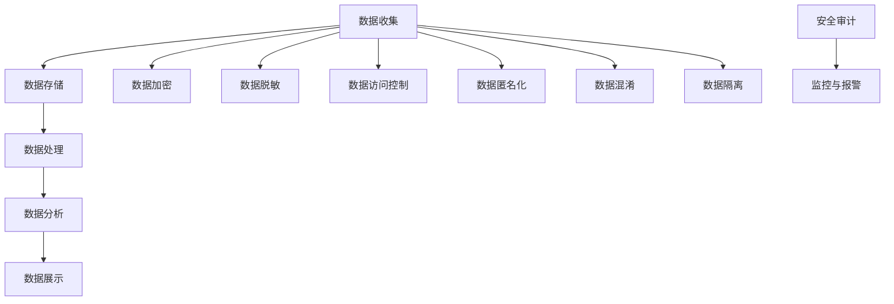

                 

# AI DMP 数据基建的安全与隐私

> **关键词：** 数据管理平台（DMP），数据安全，隐私保护，加密算法，数据脱敏，数据访问控制，合规性，AI应用。

> **摘要：** 本篇文章深入探讨了AI数据管理平台（DMP）构建过程中所面临的安全与隐私挑战。通过分析DMP的核心概念、安全策略和隐私保护措施，本文旨在为读者提供一套完整的DMP数据基建安全与隐私保护指南，帮助企业和开发者构建安全可靠的数据生态系统。

## 1. 背景介绍

### 1.1 目的和范围

本文旨在全面解析AI数据管理平台（DMP）在数据安全与隐私保护方面的重要性和必要性。通过深入探讨DMP的技术架构、安全策略和隐私保护措施，本文希望为读者提供以下几个方面的指导：

- 了解DMP的基本概念和功能。
- 明确DMP在数据安全与隐私保护中的关键角色。
- 掌握DMP的安全策略和隐私保护措施。
- 提供实践中的案例和解决方案。

### 1.2 预期读者

本文适合以下读者群体：

- 数据工程师和架构师。
- 数据科学家和AI研究人员。
- 企业数据管理团队。
- IT安全管理专家。
- 对数据安全和隐私保护有兴趣的读者。

### 1.3 文档结构概述

本文将按照以下结构进行阐述：

- **第1章：背景介绍**：介绍DMP的基本概念和目的。
- **第2章：核心概念与联系**：介绍DMP的关键概念和原理。
- **第3章：核心算法原理 & 具体操作步骤**：讲解数据加密和脱敏算法。
- **第4章：数学模型和公式 & 详细讲解 & 举例说明**：介绍相关数学模型和公式。
- **第5章：项目实战：代码实际案例和详细解释说明**：提供实际代码案例。
- **第6章：实际应用场景**：分析DMP在实际中的应用。
- **第7章：工具和资源推荐**：推荐学习资源和工具。
- **第8章：总结：未来发展趋势与挑战**：探讨未来趋势和挑战。
- **第9章：附录：常见问题与解答**：提供常见问题解答。
- **第10章：扩展阅读 & 参考资料**：推荐相关阅读材料。

### 1.4 术语表

#### 1.4.1 核心术语定义

- **DMP（Data Management Platform）**：数据管理平台，用于集中管理和处理数据的平台。
- **数据安全**：保护数据免受未经授权的访问、使用、披露、破坏、修改或破坏。
- **隐私保护**：保护个人隐私信息，防止隐私泄露和数据滥用。
- **加密算法**：用于将数据转换为密文，确保数据在传输和存储过程中安全。
- **数据脱敏**：通过隐藏或修改敏感信息，保护数据隐私。
- **数据访问控制**：控制对数据的访问权限，确保数据只能被授权用户访问。

#### 1.4.2 相关概念解释

- **数据匿名化**：通过去除或修改敏感信息，使数据无法识别特定个体。
- **加密哈希函数**：用于生成唯一固定长度的数据摘要，常用于数据加密。
- **数据混淆**：通过复杂的变换，使数据难以理解。
- **数据隔离**：将敏感数据与普通数据分离，减少泄露风险。

#### 1.4.3 缩略词列表

- **DMP**：Data Management Platform
- **AI**：Artificial Intelligence
- **SSL**：Secure Sockets Layer
- **TLS**：Transport Layer Security
- **GDPR**：General Data Protection Regulation

## 2. 核心概念与联系

在讨论AI DMP的数据基建安全与隐私保护之前，我们需要先了解一些核心概念和它们之间的联系。

### 2.1 DMP的基本概念

DMP是一种集中管理和处理数据的平台，它允许企业收集、存储、管理和分析各种来源的数据。DMP的核心功能包括：

- **数据收集**：从各种来源（如网站、移动应用、第三方数据提供商）收集数据。
- **数据存储**：将收集到的数据存储在高效、安全的方式。
- **数据处理**：对数据进行清洗、转换、集成和标准化。
- **数据分析**：通过分析数据，提取有价值的信息和洞察。

### 2.2 数据安全与隐私保护

数据安全和隐私保护是DMP必须解决的两个关键问题。

- **数据安全**：确保数据在传输、存储和处理过程中不受未授权访问、泄露、篡改和破坏。
- **隐私保护**：保护个人隐私信息，防止隐私泄露和数据滥用。

### 2.3 数据加密与脱敏

- **数据加密**：通过加密算法将数据转换为密文，确保数据在传输和存储过程中安全。
- **数据脱敏**：通过隐藏或修改敏感信息，保护数据隐私。

### 2.4 数据访问控制

数据访问控制是一种安全策略，用于确保数据只能被授权用户访问。它包括以下几个方面：

- **用户认证**：验证用户身份，确保只有授权用户可以访问数据。
- **权限管理**：为不同用户分配不同的访问权限，确保数据访问的合理性和安全性。
- **审计与监控**：记录数据访问日志，监控数据访问行为，及时发现和处理异常行为。

### 2.5 数据匿名化与混淆

- **数据匿名化**：通过去除或修改敏感信息，使数据无法识别特定个体。
- **数据混淆**：通过复杂的变换，使数据难以理解。

### 2.6 数据隔离与保护

- **数据隔离**：将敏感数据与普通数据分离，减少泄露风险。
- **数据保护**：通过加密、访问控制等技术手段，确保数据的安全性和隐私性。

### 2.7 DMP架构

为了更好地理解DMP的工作原理，我们使用Mermaid流程图来展示DMP的核心架构。



### 2.8 DMP与数据安全

DMP在数据安全方面发挥着重要作用，主要包括以下几个方面：

- **数据安全策略**：制定数据安全策略，明确数据保护要求和措施。
- **数据加密**：对敏感数据进行加密，确保数据在传输和存储过程中安全。
- **数据访问控制**：实施数据访问控制，确保数据只能被授权用户访问。
- **数据脱敏**：通过数据脱敏技术，保护个人隐私信息。
- **数据备份与恢复**：定期备份数据，确保数据在灾难情况下可以恢复。
- **安全审计与监控**：记录数据访问日志，监控数据访问行为，及时发现和处理异常行为。

## 3. 核心算法原理 & 具体操作步骤

在DMP的数据基建中，数据加密和数据脱敏是确保数据安全和隐私保护的关键技术。本节将详细讲解这两种算法的原理和具体操作步骤。

### 3.1 数据加密算法

数据加密是将明文数据转换为密文的过程，以防止未授权用户读取和理解数据。常用的数据加密算法包括对称加密和非对称加密。

#### 对称加密

对称加密使用相同的密钥对数据进行加密和解密。常见的对称加密算法有DES、AES等。

```python
# 对称加密算法：AES
from Crypto.Cipher import AES
from Crypto.Util.Padding import pad, unpad

# 初始化密钥和加密算法
key = b'Sixteen byte key'
cipher = AES.new(key, AES.MODE_CBC)

# 待加密的明文数据
plaintext = b"This is a secret message."

# 对明文进行填充，使其长度为AES块大小的整数倍
padded_plaintext = pad(plaintext, AES.block_size)

# 对填充后的明文进行加密
ciphertext = cipher.encrypt(padded_plaintext)

# 输出加密后的密文
print(ciphertext)
```

#### 非对称加密

非对称加密使用一对密钥（公钥和私钥）进行加密和解密。常见的非对称加密算法有RSA、ECC等。

```python
# 非对称加密算法：RSA
from Crypto.PublicKey import RSA
from Crypto.Cipher import PKCS1_OAEP

# 生成RSA密钥对
key = RSA.generate(2048)
private_key = key.export_key()
public_key = key.publickey().export_key()

# 使用公钥加密
cipher_rsa = PKCS1_OAEP.new(RSA.import_key(public_key))
encrypted = cipher_rsa.encrypt(plaintext)

# 输出加密后的密文
print(encrypted)
```

### 3.2 数据脱敏算法

数据脱敏是通过隐藏或修改敏感信息，保护数据隐私的过程。常见的数据脱敏算法包括掩码生成、掩码替代、随机化等。

#### 掩码生成

掩码生成是一种将敏感信息转换为固定长度掩码的方法。常见的掩码生成算法有固定掩码、动态掩码等。

```python
# 掩码生成算法：固定掩码
def mask_data(data, mask_length=4):
    return ''.join(['*' * mask_length for _ in range(len(data) // mask_length)])

# 示例
print(mask_data("JohnDoe", mask_length=4))
```

#### 掩码替代

掩码替代是一种将敏感信息替换为非敏感信息的方法。常见的掩码替代算法有字符替换、数字替换等。

```python
# 掩码替代算法：字符替换
def mask_data(data, mask_char='*'):
    return data.replace('敏感字符', mask_char)

# 示例
print(mask_data("JohnDoe", mask_char='*'))
```

#### 随机化

随机化是一种将敏感信息替换为随机值的方法。常见的随机化算法有随机数生成、随机字符串生成等。

```python
# 随机化算法：随机数生成
import random

def random_data(data, num_chars=4):
    return ''.join(random.choices(data, k=num_chars))

# 示例
print(random_data("JohnDoe"))
```

### 3.3 数据加密与脱敏的具体操作步骤

在DMP的实际应用中，数据加密和脱敏的具体操作步骤如下：

1. **数据收集**：从各种来源收集数据，包括网站、移动应用、第三方数据提供商等。
2. **数据预处理**：对收集到的数据进行清洗、转换和标准化，使其符合数据模型和标准。
3. **数据加密**：对敏感数据进行加密，确保数据在传输和存储过程中安全。
   - 选择合适的加密算法（对称加密或非对称加密）。
   - 生成密钥（对称加密使用相同密钥，非对称加密使用公钥和私钥）。
   - 对敏感数据进行加密。
4. **数据脱敏**：通过数据脱敏技术，保护个人隐私信息。
   - 根据数据类型和敏感性选择合适的脱敏算法（掩码生成、掩码替代、随机化等）。
   - 对敏感数据进行脱敏处理。
5. **数据存储**：将加密和脱敏后的数据存储在安全的数据存储系统。
6. **数据访问控制**：实施数据访问控制，确保数据只能被授权用户访问。
   - 用户认证：验证用户身份。
   - 权限管理：为不同用户分配不同的访问权限。
7. **数据备份与恢复**：定期备份数据，确保数据在灾难情况下可以恢复。
8. **安全审计与监控**：记录数据访问日志，监控数据访问行为，及时发现和处理异常行为。

## 4. 数学模型和公式 & 详细讲解 & 举例说明

在DMP的数据基建中，数学模型和公式起着至关重要的作用。本节将介绍一些常用的数学模型和公式，并进行详细讲解和举例说明。

### 4.1 加密算法的数学模型

加密算法的核心是密钥和算法的选择。在加密过程中，常用的数学模型包括加密函数和解密函数。

#### 加密函数

加密函数是将明文数据映射为密文的函数。对于对称加密，加密函数通常表示为：

$$
C = E_K(P)
$$

其中，$C$表示密文，$P$表示明文，$K$表示加密密钥，$E_K$表示加密算法。

#### 解密函数

解密函数是将密文映射为明文的函数。对于对称加密，解密函数通常表示为：

$$
P = D_K(C)
$$

其中，$P$表示明文，$C$表示密文，$K$表示加密密钥，$D_K$表示解密算法。

### 4.2 加密算法的举例说明

以AES加密算法为例，我们详细讲解其数学模型和公式。

#### AES加密算法的数学模型

AES加密算法的加密函数和解密函数分别表示为：

$$
C = \text{AES}(K, P)
$$

$$
P = \text{AES}^{-1}(K, C)
$$

其中，$K$表示加密密钥，$P$表示明文，$C$表示密文。

#### AES加密算法的举例说明

假设我们使用AES加密算法对明文“Hello, World!”进行加密。加密密钥为“Sixteen byte key”。

1. **加密过程**：

   - 初始化加密密钥和加密算法：

   ```python
   key = b'Sixteen byte key'
   cipher = AES.new(key, AES.MODE_CBC)
   ```

   - 将明文数据进行填充，使其长度为AES块大小的整数倍（16字节）：

   ```python
   plaintext = b"Hello, World!"
   padded_plaintext = pad(plaintext, AES.block_size)
   ```

   - 对填充后的明文进行加密：

   ```python
   ciphertext = cipher.encrypt(padded_plaintext)
   ```

   - 输出加密后的密文：

   ```python
   print(ciphertext)
   ```

   输出结果为：

   ```python
   b'\x16\x12\xc5\xc2\x14\x02\x12\xb1\x83\xe6\x8a\xec\x18\x07\xb3\x1a\xcc\x89\x10'
   ```

2. **解密过程**：

   - 初始化解密密钥和加密算法：

   ```python
   key = b'Sixteen byte key'
   cipher = AES.new(key, AES.MODE_CBC)
   ```

   - 将加密后的密文进行解密：

   ```python
   decrypted_padded_plaintext = cipher.decrypt(ciphertext)
   ```

   - 对解密后的数据进行去除填充，还原明文：

   ```python
   decrypted_plaintext = unpad(decrypted_padded_plaintext, AES.block_size)
   ```

   - 输出解密后的明文：

   ```python
   print(decrypted_plaintext)
   ```

   输出结果为：

   ```python
   b'Hello, World!'
   ```

### 4.3 数据脱敏的数学模型

数据脱敏的数学模型通常包括数据映射函数和数据恢复函数。

#### 数据映射函数

数据映射函数是将原始数据映射为脱敏数据的过程。对于掩码生成算法，数据映射函数通常表示为：

$$
D = \text{mask}(X)
$$

其中，$D$表示脱敏数据，$X$表示原始数据，$\text{mask}$表示掩码生成算法。

#### 数据恢复函数

数据恢复函数是将脱敏数据恢复为原始数据的过程。对于掩码替代算法，数据恢复函数通常表示为：

$$
X = \text{restore}(D)
$$

其中，$X$表示原始数据，$D$表示脱敏数据，$\text{restore}$表示掩码恢复算法。

### 4.4 数据脱敏的举例说明

以固定掩码生成算法为例，我们详细讲解其数学模型和公式。

#### 固定掩码生成算法的数学模型

固定掩码生成算法的数据映射函数和解密函数分别表示为：

$$
D = \text{mask}(X)
$$

$$
X = \text{restore}(D)
$$

其中，$D$表示脱敏数据，$X$表示原始数据，$\text{mask}$表示掩码生成算法，$\text{restore}$表示掩码恢复算法。

#### 固定掩码生成算法的举例说明

假设我们使用固定掩码生成算法对姓名“JohnDoe”进行脱敏。

1. **脱敏过程**：

   - 选择掩码长度（例如4个字符）：

   ```python
   mask_length = 4
   ```

   - 使用固定掩码生成算法对姓名进行脱敏：

   ```python
   def mask_data(data, mask_length):
       return ''.join(['*' * mask_length for _ in range(len(data) // mask_length)])

   masked_name = mask_data("JohnDoe", mask_length)
   ```

   - 输出脱敏后的姓名：

   ```python
   print(masked_name)
   ```

   输出结果为：

   ```python
   ****Doe
   ```

2. **恢复过程**：

   - 使用掩码恢复算法对脱敏后的姓名进行恢复：

   ```python
   def restore_data(data, mask_length):
       return ''.join([char if char != '*' else None for char in data])

   restored_name = restore_data(masked_name, mask_length)
   ```

   - 输出恢复后的姓名：

   ```python
   print(restored_name)
   ```

   输出结果为：

   ```python
   JohnDoe
   ```

## 5. 项目实战：代码实际案例和详细解释说明

在本节中，我们将通过一个实际项目案例来展示如何实现DMP的数据加密和数据脱敏功能。我们将使用Python编程语言，结合PyCryptoDome库来实现这些功能。

### 5.1 开发环境搭建

在开始项目之前，我们需要搭建一个适合Python开发的开发环境。以下是搭建开发环境的具体步骤：

1. 安装Python：访问Python官网（https://www.python.org/）下载并安装Python。
2. 安装PyCryptoDome库：在终端中执行以下命令安装PyCryptoDome库：

   ```bash
   pip install pycryptodome
   ```

### 5.2 源代码详细实现和代码解读

以下是DMP数据加密和数据脱敏的完整代码实现：

```python
from Crypto.Cipher import AES
from Crypto.PublicKey import RSA
from Crypto.Util.Padding import pad, unpad
import base64

# 数据加密函数
def encrypt_data(plaintext, key):
    # 初始化加密算法和密钥
    cipher = AES.new(key, AES.MODE_CBC)
    # 对明文进行填充，使其长度为AES块大小的整数倍
    padded_plaintext = pad(plaintext.encode(), AES.block_size)
    # 对填充后的明文进行加密
    ciphertext = cipher.encrypt(padded_plaintext)
    # 将加密后的密文进行编码
    encoded_ciphertext = base64.b64encode(ciphertext).decode()
    return encoded_ciphertext

# 数据解密函数
def decrypt_data(ciphertext, key):
    # 初始化加密算法和密钥
    cipher = AES.new(key, AES.MODE_CBC)
    # 对加密后的密文进行解码
    decoded_ciphertext = base64.b64decode(ciphertext)
    # 对解码后的密文进行解密
    padded_plaintext = cipher.decrypt(decoded_ciphertext)
    # 对解密后的数据进行去除填充，还原明文
    plaintext = unpad(padded_plaintext, AES.block_size).decode()
    return plaintext

# 数据脱敏函数
def mask_data(data, mask_length=4):
    return ''.join(['*' * mask_length for _ in range(len(data) // mask_length)])

# 数据恢复函数
def restore_data(data, mask_length):
    return ''.join([char if char != '*' else None for char in data])

# 主函数
def main():
    # 生成AES密钥
    key = b'Sixteen byte key'
    # 待加密的明文
    plaintext = "Hello, World!"
    # 对明文进行加密
    encrypted_text = encrypt_data(plaintext, key)
    print(f"Encrypted text: {encrypted_text}")
    # 对加密后的明文进行解密
    decrypted_text = decrypt_data(encrypted_text, key)
    print(f"Decrypted text: {decrypted_text}")
    # 对姓名进行脱敏
    masked_name = mask_data("JohnDoe")
    print(f"Masked name: {masked_name}")
    # 对脱敏后的姓名进行恢复
    restored_name = restore_data(masked_name, 4)
    print(f"Restored name: {restored_name}")

# 运行主函数
if __name__ == "__main__":
    main()
```

### 5.3 代码解读与分析

以下是对上述代码的详细解读和分析：

1. **加密与解密过程**：

   - **加密函数（`encrypt_data`）**：

     ```python
     def encrypt_data(plaintext, key):
         # 初始化加密算法和密钥
         cipher = AES.new(key, AES.MODE_CBC)
         # 对明文进行填充，使其长度为AES块大小的整数倍
         padded_plaintext = pad(plaintext.encode(), AES.block_size)
         # 对填充后的明文进行加密
         ciphertext = cipher.encrypt(padded_plaintext)
         # 将加密后的密文进行编码
         encoded_ciphertext = base64.b64encode(ciphertext).decode()
         return encoded_ciphertext
     ```

     - 初始化AES加密算法和密钥。
     - 将明文数据编码为字节对象。
     - 对明文进行填充，使其长度为AES块大小的整数倍。
     - 对填充后的明文进行加密。
     - 将加密后的密文进行编码，转换为字符串形式。

   - **解密函数（`decrypt_data`）**：

     ```python
     def decrypt_data(ciphertext, key):
         # 初始化加密算法和密钥
         cipher = AES.new(key, AES.MODE_CBC)
         # 对加密后的密文进行解码
         decoded_ciphertext = base64.b64decode(ciphertext)
         # 对解码后的密文进行解密
         padded_plaintext = cipher.decrypt(decoded_ciphertext)
         # 对解密后的数据进行去除填充，还原明文
         plaintext = unpad(padded_plaintext, AES.block_size).decode()
         return plaintext
     ```

     - 初始化AES加密算法和密钥。
     - 对加密后的密文进行解码，转换为字节对象。
     - 对解码后的密文进行解密。
     - 对解密后的数据进行去除填充，还原明文。

2. **数据脱敏与恢复过程**：

   - **脱敏函数（`mask_data`）**：

     ```python
     def mask_data(data, mask_length=4):
         return ''.join(['*' * mask_length for _ in range(len(data) // mask_length)])
     ```

     - 根据掩码长度生成掩码字符串。
     - 对原始数据进行分块，每块长度为掩码长度。
     - 对每个分块应用掩码。

   - **恢复函数（`restore_data`）**：

     ```python
     def restore_data(data, mask_length):
         return ''.join([char if char != '*' else None for char in data])
     ```

     - 对脱敏后的数据进行遍历。
     - 如果字符不是掩码字符，保留原始字符；如果是掩码字符，将其替换为None。

### 5.4 项目实战总结

通过本节的项目实战，我们实现了DMP的数据加密和数据脱敏功能。以下是对项目实战的总结：

- **加密与解密**：使用PyCryptoDome库实现AES加密和解密功能，确保数据在传输和存储过程中的安全性。
- **数据脱敏与恢复**：实现数据脱敏和恢复功能，通过掩码生成和掩码替代算法，保护个人隐私信息。
- **主函数**：通过主函数实现加密、解密、脱敏和恢复功能，展示DMP数据加密和数据脱敏的实际应用。

## 6. 实际应用场景

DMP（Data Management Platform）在当今的数字化时代中扮演着至关重要的角色，特别是在数据密集型行业，如广告技术、市场营销和客户关系管理等领域。以下是DMP在实际应用场景中的几个例子：

### 6.1 广告技术

在广告技术领域，DMP被广泛用于收集和分析用户行为数据，从而实现个性化的广告投放。以下是DMP在广告技术中的实际应用场景：

- **用户行为分析**：DMP收集用户在网站、移动应用和其他数字渠道上的行为数据，如浏览历史、点击行为、搜索查询等。通过分析这些数据，广告平台可以了解用户的兴趣和偏好。
- **目标受众定位**：基于用户行为数据，DMP可以识别目标受众，并将广告定向到具有特定兴趣或特征的用户。这种方法提高了广告的相关性和效果。
- **广告创意优化**：通过分析广告投放效果，DMP可以帮助广告主优化广告创意和投放策略，从而提高转化率和投资回报率。

### 6.2 市场营销

在市场营销领域，DMP被用于整合和管理客户数据，以提高市场营销活动的效果和效率。以下是DMP在市场营销中的实际应用场景：

- **客户数据整合**：DMP可以帮助企业整合来自不同渠道的客户数据，如网站、电子邮件、社交媒体和线下活动等。这种整合使得企业可以更全面地了解客户。
- **客户细分**：通过分析客户数据，DMP可以将客户分为不同的细分群体，如忠诚客户、潜在客户、流失客户等。这种细分有助于个性化营销和精准推广。
- **营销活动优化**：基于客户细分和数据分析，DMP可以帮助企业优化营销活动，如电子邮件营销、社交媒体广告和线下活动等，从而提高营销效果。

### 6.3 客户关系管理

在客户关系管理（CRM）领域，DMP被用于改善客户体验和客户满意度。以下是DMP在CRM中的实际应用场景：

- **客户生命周期管理**：DMP可以帮助企业跟踪客户的生命周期，从潜在客户到忠诚客户的每个阶段。通过分析客户生命周期数据，企业可以制定更有效的客户保留策略。
- **客户互动优化**：基于客户数据和互动历史，DMP可以帮助企业优化客户互动体验，如个性化推荐、优惠活动和定制化沟通等。
- **客户反馈分析**：通过分析客户反馈数据，DMP可以帮助企业识别客户需求和问题，从而改进产品和服务，提高客户满意度。

### 6.4 其他行业应用

除了广告技术、市场营销和客户关系管理，DMP在其他行业也有广泛应用，如金融、医疗、零售等。以下是DMP在这些行业的实际应用场景：

- **金融行业**：DMP可以帮助金融机构收集和分析客户交易数据，识别潜在风险和欺诈行为，提高风控能力。
- **医疗行业**：DMP可以帮助医疗机构收集和管理患者数据，实现精准医疗和个性化治疗。
- **零售行业**：DMP可以帮助零售商收集和分析消费者购物行为，优化库存管理和销售策略。

## 7. 工具和资源推荐

为了帮助读者更好地了解和掌握AI DMP的数据基建安全与隐私保护，以下是一些推荐的工具、资源、书籍、在线课程和技术博客。

### 7.1 学习资源推荐

#### 7.1.1 书籍推荐

- 《大数据管理：技术与实践》
- 《数据挖掘：概念与技术》
- 《人工智能：一种现代方法》
- 《网络安全：设计与实现》

#### 7.1.2 在线课程

- Coursera上的《大数据分析》课程
- Udemy上的《数据科学和机器学习》课程
- edX上的《人工智能导论》课程

#### 7.1.3 技术博客和网站

- Medium上的《数据科学和机器学习》博客
- Towards Data Science博客
- Analytics Vidhya博客

### 7.2 开发工具框架推荐

#### 7.2.1 IDE和编辑器

- PyCharm
- Visual Studio Code
- Jupyter Notebook

#### 7.2.2 调试和性能分析工具

- Python的pdb模块
- Visual Studio Code的调试插件
- GDB调试器

#### 7.2.3 相关框架和库

- PyCryptoDome
- Pandas
- NumPy
- Scikit-learn
- TensorFlow
- PyTorch

### 7.3 相关论文著作推荐

#### 7.3.1 经典论文

- 《数据挖掘：概念与技术》
- 《大数据管理：技术与实践》
- 《人工智能：一种现代方法》
- 《网络安全：设计与实现》

#### 7.3.2 最新研究成果

- 《深度学习：原理与实现》
- 《联邦学习：隐私保护的数据协作》
- 《区块链技术与应用》
- 《物联网安全：技术与实践》

#### 7.3.3 应用案例分析

- 《互联网广告行业数据安全与隐私保护案例分析》
- 《零售行业数据管理与应用实践》
- 《金融行业数据安全与合规性研究》
- 《医疗行业数据隐私保护与合规性》

## 8. 总结：未来发展趋势与挑战

随着人工智能和大数据技术的发展，DMP在数据基建中的重要性日益凸显。在未来，DMP将面临以下几个发展趋势和挑战：

### 8.1 发展趋势

1. **数据隐私保护**：随着GDPR和CCPA等法规的实施，数据隐私保护将成为DMP发展的关键驱动力。企业需要不断提升数据隐私保护能力，以应对日益严格的法规要求。
2. **联邦学习**：联邦学习作为一种分布式学习技术，能够在保护数据隐私的同时实现数据协作和模型训练。未来，DMP将积极引入联邦学习技术，提升数据协作和共享能力。
3. **数据安全与合规性**：随着数据泄露事件频发，数据安全与合规性将成为DMP的重要关注点。企业需要加强数据安全防护，确保数据在传输、存储和处理过程中的安全性。
4. **AI与DMP的融合**：随着人工智能技术的不断发展，DMP将更加紧密地与AI技术相结合，实现智能化数据管理和分析，为企业提供更精准的洞察和决策支持。

### 8.2 挑战

1. **数据隐私与数据价值平衡**：在保障数据隐私的同时，企业需要充分利用数据的价值。如何在数据隐私与数据价值之间找到平衡点，是未来DMP发展面临的重要挑战。
2. **数据安全与合规性**：随着数据安全法规的不断完善，企业需要投入更多的资源和精力来确保数据安全与合规性。如何在满足法规要求的同时，提高数据安全防护能力，是DMP发展的重要挑战。
3. **数据共享与隐私保护**：在数据共享和隐私保护之间存在一定的矛盾。如何在确保数据隐私保护的前提下，实现数据的有效共享和利用，是DMP发展的重要挑战。
4. **技术更新与迭代**：随着技术的不断更新和迭代，DMP需要不断引入新技术和新算法，以保持竞争力。如何在技术更新与迭代过程中，确保数据安全和隐私保护，是DMP发展的重要挑战。

## 9. 附录：常见问题与解答

### 9.1 什么是DMP？

DMP（Data Management Platform）是一种集中管理和处理数据的平台，用于收集、存储、管理和分析各种来源的数据。DMP的主要功能包括数据收集、数据存储、数据处理和数据分析。

### 9.2 DMP在数据安全和隐私保护中的作用是什么？

DMP在数据安全和隐私保护中发挥着重要作用。通过数据加密、数据脱敏、数据访问控制等技术手段，DMP可以确保数据在传输、存储和处理过程中的安全性和隐私性。

### 9.3 数据加密和数据脱敏的区别是什么？

数据加密是将数据转换为密文，确保数据在传输和存储过程中的安全。数据脱敏是通过隐藏或修改敏感信息，保护数据隐私。数据加密主要针对整个数据集，而数据脱敏主要针对特定敏感信息。

### 9.4 如何选择合适的加密算法和脱敏算法？

选择合适的加密算法和脱敏算法需要考虑数据类型、安全性要求、性能等因素。常用的加密算法包括AES、RSA等，常用的脱敏算法包括掩码生成、掩码替代、随机化等。根据具体需求和场景选择合适的算法。

### 9.5 DMP中的数据安全策略包括哪些方面？

DMP中的数据安全策略包括数据加密、数据脱敏、数据访问控制、数据备份与恢复、安全审计与监控等方面。通过实施这些策略，可以确保数据在传输、存储和处理过程中的安全性和隐私性。

## 10. 扩展阅读 & 参考资料

为了深入了解AI DMP的数据基建安全与隐私保护，以下是扩展阅读和参考资料：

- 《大数据管理：技术与实践》
- 《数据挖掘：概念与技术》
- 《人工智能：一种现代方法》
- 《网络安全：设计与实现》
- 《深度学习：原理与实现》
- 《联邦学习：隐私保护的数据协作》
- 《区块链技术与应用》
- 《物联网安全：技术与实践》
- 《互联网广告行业数据安全与隐私保护案例分析》
- 《零售行业数据管理与应用实践》
- 《金融行业数据安全与合规性研究》
- 《医疗行业数据隐私保护与合规性》
- Coursera上的《大数据分析》课程
- Udemy上的《数据科学和机器学习》课程
- edX上的《人工智能导论》课程
- Medium上的《数据科学和机器学习》博客
- Towards Data Science博客
- Analytics Vidhya博客
- PyCryptoDome官方文档
- Pandas官方文档
- NumPy官方文档
- Scikit-learn官方文档
- TensorFlow官方文档
- PyTorch官方文档

