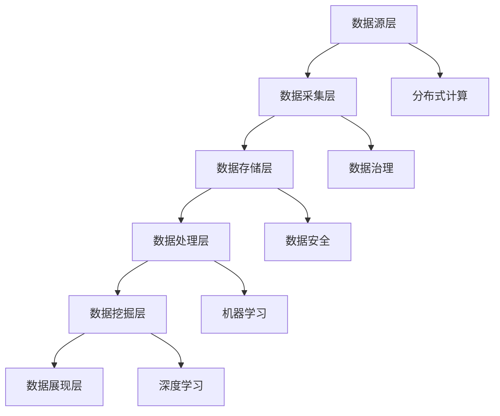

                 

# AI DMP 数据基建的技术挑战

> 关键词：AI DMP，数据管理平台，数据治理，数据处理，数据安全，分布式系统，云计算，大数据

> 摘要：本文旨在探讨AI Data Management Platform（AI DMP）在构建数据基建过程中面临的技术挑战。我们将从核心概念、算法原理、数学模型、实际应用场景等多个角度，详细分析AI DMP的发展现状、核心技术、实现方法以及未来趋势。通过本文的讨论，读者可以深入了解AI DMP的技术内涵，为实际项目开发提供理论支持和实践指导。

## 1. 背景介绍

### 1.1 目的和范围

本文主要目的是分析AI DMP在构建数据基建过程中所面临的技术挑战。随着大数据和人工智能技术的不断发展，AI DMP作为数据管理的新兴领域，其重要性日益凸显。然而，在实现数据的高效治理、存储、处理和安全保障方面，仍存在诸多技术难题。本文将围绕以下三个方面展开讨论：

1. **核心概念与联系**：介绍AI DMP的基本概念、架构和核心原理。
2. **核心算法原理 & 具体操作步骤**：讲解AI DMP中的关键算法及其实现步骤。
3. **实际应用场景**：分析AI DMP在不同领域的应用场景和挑战。

通过以上三个方面的讨论，本文旨在为从事AI DMP研发和应用的人员提供有价值的参考，帮助他们在实际项目中更好地应对技术挑战。

### 1.2 预期读者

本文适合以下读者群体：

1. 数据科学家和大数据工程师：了解AI DMP的基本概念和关键技术，为实际项目开发提供理论支持。
2. 数据治理和安全管理专家：掌握AI DMP在数据治理和安全管理中的关键技术和方法。
3. 人工智能和机器学习研究者：探讨AI DMP在人工智能和机器学习领域中的应用和前景。
4. AI DMP平台研发人员：深入了解AI DMP的技术架构、算法原理和实现方法，为平台优化和升级提供参考。

### 1.3 文档结构概述

本文采用逻辑清晰、结构紧凑的方式，分为以下几个部分：

1. **背景介绍**：介绍本文的目的、范围、预期读者和文档结构。
2. **核心概念与联系**：阐述AI DMP的基本概念、架构和核心原理，并给出流程图。
3. **核心算法原理 & 具体操作步骤**：讲解AI DMP中的关键算法及其实现步骤。
4. **数学模型和公式 & 详细讲解 & 举例说明**：分析AI DMP中的数学模型和公式，并进行举例说明。
5. **项目实战：代码实际案例和详细解释说明**：通过实际案例展示AI DMP的实现过程。
6. **实际应用场景**：探讨AI DMP在不同领域的应用场景和挑战。
7. **工具和资源推荐**：推荐学习资源、开发工具和框架。
8. **总结：未来发展趋势与挑战**：总结AI DMP的发展现状和未来趋势。
9. **附录：常见问题与解答**：解答读者可能遇到的问题。
10. **扩展阅读 & 参考资料**：提供进一步阅读的材料。

### 1.4 术语表

#### 1.4.1 核心术语定义

- **AI DMP**：AI Data Management Platform，即人工智能数据管理平台，是一种基于人工智能技术的数据管理解决方案，能够实现数据的高效治理、存储、处理和安全保障。
- **数据治理**：数据治理是指通过制定数据政策、流程和标准，确保数据的质量、安全、合规和可追溯性。
- **数据处理**：数据处理是指对原始数据进行清洗、转换、分析和存储等操作，以获取有价值的信息。
- **分布式系统**：分布式系统是指由多个节点组成的系统，通过计算机网络进行通信和协同工作。
- **云计算**：云计算是一种通过网络提供计算资源、存储资源、数据库等服务的计算模式。

#### 1.4.2 相关概念解释

- **大数据**：大数据是指数据量巨大、类型多样、增长迅速的数据集合，需要通过特殊的技术和工具进行处理和分析。
- **机器学习**：机器学习是一种基于数据的学习方法，通过构建数学模型，使计算机具备从数据中自动获取知识和规律的能力。
- **深度学习**：深度学习是一种基于多层神经网络的学习方法，通过逐层提取特征，实现复杂的模式识别和预测。

#### 1.4.3 缩略词列表

- **AI**：人工智能（Artificial Intelligence）
- **DMP**：数据管理平台（Data Management Platform）
- **Hadoop**：一个分布式数据存储和处理框架（Hadoop Distributed File System）
- **Spark**：一个快速、通用的大数据处理框架（Spark）
- **TensorFlow**：一个开源的机器学习和深度学习框架（TensorFlow）

## 2. 核心概念与联系

在本节中，我们将介绍AI DMP的核心概念、架构和核心原理。为了更好地理解这些概念，我们将使用Mermaid流程图展示AI DMP的架构，以便读者可以直观地了解各个组成部分及其相互关系。

### 2.1 AI DMP的基本概念

AI DMP是一种集成了人工智能技术的大数据管理平台，旨在提供高效、安全、可扩展的数据管理解决方案。其主要目标是实现以下功能：

1. **数据治理**：确保数据的质量、安全、合规和可追溯性。
2. **数据处理**：对原始数据进行清洗、转换、分析和存储，以获取有价值的信息。
3. **数据挖掘**：通过机器学习和深度学习技术，从海量数据中挖掘出潜在的价值和规律。
4. **数据安全**：确保数据的保密性、完整性和可用性。

### 2.2 AI DMP的架构

AI DMP的架构可以分为以下几个层次：

1. **数据源层**：包括各种数据源，如关系型数据库、NoSQL数据库、日志文件、外部数据源等。
2. **数据采集层**：负责从数据源层采集数据，并进行初步的清洗和转换。
3. **数据存储层**：采用分布式存储技术，如Hadoop HDFS、NoSQL数据库等，存储海量数据。
4. **数据处理层**：使用大数据处理框架，如Spark、Flink等，对数据进行清洗、转换、分析和存储。
5. **数据挖掘层**：利用机器学习和深度学习技术，从海量数据中挖掘出潜在的价值和规律。
6. **数据展现层**：通过可视化工具和报表系统，将数据分析和挖掘的结果呈现给用户。

### 2.3 AI DMP的核心原理

AI DMP的核心原理主要包括以下几个方面：

1. **分布式计算**：通过分布式系统，实现数据的高效处理和存储，提高系统的可扩展性和容错能力。
2. **机器学习和深度学习**：利用机器学习和深度学习技术，从海量数据中挖掘出潜在的价值和规律，为数据分析和决策提供支持。
3. **数据治理**：通过制定数据政策、流程和标准，确保数据的质量、安全、合规和可追溯性。
4. **数据安全**：采用数据加密、访问控制等技术，确保数据的保密性、完整性和可用性。

### 2.4 AI DMP的Mermaid流程图

以下是一个简化的AI DMP Mermaid流程图，展示了各个层次及其相互关系：



通过上述流程图，读者可以直观地了解AI DMP的架构及其核心原理。接下来，我们将深入探讨AI DMP中的核心算法原理和具体操作步骤。

## 3. 核心算法原理 & 具体操作步骤

在本节中，我们将详细介绍AI DMP中的一些核心算法原理，包括其具体操作步骤。这些算法是实现数据高效处理、分析、挖掘和展现的基础，是构建AI DMP的关键。

### 3.1 数据预处理算法

数据预处理是AI DMP中至关重要的一环，其目的是清洗、转换和规范化原始数据，使其适合进一步分析和挖掘。以下是一些常见的数据预处理算法：

#### 3.1.1 数据清洗算法

**算法原理**：数据清洗算法主要解决数据中的缺失值、噪声和异常值问题。

**伪代码**：

```plaintext
function dataCleaning(data):
    for each record in data:
        if record has missing values:
            replace missing values with mean/mode/median
        if record has noise:
            remove noise using statistical methods or machine learning models
        if record has anomalies:
            remove anomalies using outlier detection algorithms
    return cleaned data
```

**具体操作步骤**：

1. **缺失值处理**：对于缺失值，可以根据数据的特点，选择填充均值、中位数或众数的方法。
2. **噪声处理**：使用统计方法（如标准化、归一化）或机器学习方法（如聚类、回归）去除噪声。
3. **异常值处理**：采用离群点检测算法（如IQR法、Z-Score法）识别和去除异常值。

#### 3.1.2 数据转换算法

**算法原理**：数据转换算法主要解决数据格式、类型和规模不一致的问题。

**伪代码**：

```plaintext
function dataTransformation(data):
    for each record in data:
        if record has different formats:
            convert formats using regular expressions or string manipulation
        if record has different types:
            convert types using type casting functions
        if record has different scales:
            normalize or standardize data using statistical methods
    return transformed data
```

**具体操作步骤**：

1. **格式转换**：使用正则表达式或字符串操作函数，将不同格式的数据转换为统一的格式。
2. **类型转换**：使用类型转换函数，将不同类型的数据转换为相同类型。
3. **规模转换**：使用标准化或归一化方法，将不同规模的数据转换为相同的规模。

### 3.2 数据分析算法

数据分析算法用于从海量数据中提取有价值的信息，支持数据驱动的决策。以下是一些常见的数据分析算法：

#### 3.2.1 聚类算法

**算法原理**：聚类算法将相似的数据划分为一组，以发现数据中的模式和结构。

**伪代码**：

```plaintext
function clustering(data, algorithm):
    if algorithm is "K-means":
        initialize centroids
        repeat until convergence:
            assign each data point to the nearest centroid
            update centroids based on the assigned data points
    else if algorithm is "DBSCAN":
        initialize parameters
        for each data point:
            expand neighborhood and form a cluster
        return clusters
    else if algorithm is "Hierarchical":
        initialize linkage method
        repeat until convergence:
            merge the two closest clusters
        return hierarchical clustering tree
    return clusters
```

**具体操作步骤**：

1. **初始化**：根据选择的聚类算法，初始化参数。
2. **迭代**：根据算法的迭代过程，逐步更新聚类结果。
3. **收敛**：判断聚类结果是否收敛，如果收敛，则停止迭代。

#### 3.2.2 回归算法

**算法原理**：回归算法用于预测数据中的连续变量，通过建立因变量和自变量之间的关系模型。

**伪代码**：

```plaintext
function regression(data, model):
    if model is "Linear":
        calculate coefficients using linear regression
    else if model is "Logistic":
        calculate coefficients using logistic regression
    else if model is "Decision Tree":
        build decision tree model
    return model
```

**具体操作步骤**：

1. **选择模型**：根据数据的特点，选择合适的回归模型。
2. **训练模型**：使用训练数据集训练模型，计算模型的参数。
3. **预测**：使用训练好的模型，对新数据进行预测。

### 3.3 数据挖掘算法

数据挖掘算法用于从海量数据中挖掘出潜在的价值和规律，支持业务决策和洞察。

#### 3.3.1 关联规则算法

**算法原理**：关联规则算法用于发现数据中的关联关系，通过支持度和置信度来评估规则的强度。

**伪代码**：

```plaintext
function associationRules(data, minSupport, minConfidence):
    frequentItemsets = findFrequentItemsets(data, minSupport)
    for each frequent itemset:
        generate rules using support and confidence
    return rules
```

**具体操作步骤**：

1. **频繁项集生成**：使用Apriori算法或FP-growth算法生成频繁项集。
2. **规则生成**：根据支持度和置信度生成关联规则。

#### 3.3.2 时序分析算法

**算法原理**：时序分析算法用于分析时间序列数据，识别时间序列中的趋势、周期性和季节性。

**伪代码**：

```plaintext
function timeSeriesAnalysis(data, method):
    if method is "ARIMA":
        build ARIMA model
    else if method is "SARIMA":
        build SARIMA model
    else if method is "Prophet":
        build Prophet model
    return model
```

**具体操作步骤**：

1. **模型选择**：根据时间序列数据的特点，选择合适的时序分析模型。
2. **模型训练**：使用训练数据集训练模型，计算模型的参数。
3. **预测**：使用训练好的模型，对新数据进行预测。

通过上述核心算法原理和具体操作步骤的介绍，读者可以了解AI DMP在数据处理、分析和挖掘方面的关键技术。接下来，我们将讨论AI DMP中的数学模型和公式。

## 4. 数学模型和公式 & 详细讲解 & 举例说明

在本节中，我们将深入探讨AI DMP中的数学模型和公式，以及如何利用这些模型进行数据处理和分析。数学模型是AI DMP算法的核心，通过这些模型，我们能够从数据中提取有价值的信息。

### 4.1 数据预处理中的数学模型

数据预处理是AI DMP中至关重要的一步，其目的是提高数据的质量和一致性。以下是几个常用的数学模型：

#### 4.1.1 缺失值处理

**模型**：线性插值法、均值填补法

**公式**：

$$
x_{\text{new}} = \frac{(x_{i-1} + x_{i+1})}{2}
$$

或

$$
x_{\text{new}} = \frac{\sum_{i=1}^{n} x_i}{n}
$$

**讲解**：线性插值法通过计算相邻数据的平均值来填补缺失值，而均值填补法则是将整个数据集的均值应用于缺失值。

**例子**：假设有一组数据 `[10, 15, NaN, 20, 25]`，使用线性插值法填补缺失值：

$$
x_{\text{new}} = \frac{(15 + 20)}{2} = 17.5
$$

#### 4.1.2 数据标准化

**模型**：Z-Score标准化、Min-Max标准化

**公式**：

$$
z = \frac{(x - \mu)}{\sigma}
$$

或

$$
x_{\text{new}} = \frac{(x - x_{\text{min}})}{(x_{\text{max}} - x_{\text{min}})}
$$

**讲解**：Z-Score标准化将数据转换到标准正态分布，而Min-Max标准化则将数据缩放到[0, 1]区间。

**例子**：假设有一组数据 `[1, 2, 3, 4, 5]`，使用Z-Score标准化：

$$
z = \frac{(x - \mu)}{\sigma} = \frac{(x - 3)}{2} \quad (\mu = 3, \sigma = 1)
$$

### 4.2 数据分析中的数学模型

数据分析是AI DMP中的关键步骤，以下是一些常用的数学模型：

#### 4.2.1 聚类分析

**模型**：K-means、DBSCAN、层次聚类

**公式**：

**K-means**：

$$
c_{k} = \frac{1}{n_k} \sum_{x_i \in S_k} x_i
$$

**DBSCAN**：

$$
\epsilon-\text{neighborhood}(x) = \{y | \text{dist}(x, y) < \epsilon\}
$$

**层次聚类**：

$$
c_{i+1} = \text{merge}(c_i, c_j)
$$

**讲解**：K-means通过最小化平方误差来划分数据，DBSCAN基于密度和邻域概念，而层次聚类则通过逐步合并相似度高的聚类。

**例子**：假设有一组数据点 `[ (1, 1), (2, 2), (1, 2), (2, 1), (3, 3) ]`，使用K-means聚类，设置K=2：

$$
\text{簇1均值} = \frac{(1 + 1 + 1)}{3} = 1
$$

$$
\text{簇2均值} = \frac{(2 + 2 + 3)}{3} = 2.33
$$

#### 4.2.2 回归分析

**模型**：线性回归、逻辑回归、决策树回归

**公式**：

**线性回归**：

$$
y = \beta_0 + \beta_1x
$$

**逻辑回归**：

$$
\log\frac{P(Y=1)}{1-P(Y=1)} = \beta_0 + \beta_1x
$$

**决策树回归**：

$$
y = \text{DecisionTree}(x)
$$

**讲解**：线性回归通过线性模型预测连续变量，逻辑回归通过逻辑函数预测概率，决策树回归通过树形结构进行预测。

**例子**：假设我们有一个线性回归模型，`y = 2x + 1`，预测新数据点 `x = 3`：

$$
y = 2(3) + 1 = 7
$$

### 4.3 数据挖掘中的数学模型

数据挖掘是AI DMP中用于发现数据中潜在模式和关联的重要工具，以下是一些常用的数学模型：

#### 4.3.1 关联规则挖掘

**模型**：Apriori算法、FP-growth算法

**公式**：

**Apriori**：

$$
\text{support}(X) = \frac{\text{count}(X)}{\text{total transactions}}
$$

**FP-growth**：

$$
\text{freq-set}(X) = \{x | \text{count}(x) \geq \text{min-support}\}
$$

**讲解**：Apriori算法通过生成频繁项集来挖掘关联规则，而FP-growth算法则通过构建频繁模式树来优化计算。

**例子**：假设我们有一个购物数据集，其中包含以下交易：`{1, 2}`，`{1, 3}`，`{2, 3}`，`{1, 2, 3}`。最小支持度为40%：

$$
\text{support}(\{1\}) = \frac{2}{4} = 0.5 \quad (\text{满足最小支持度})
$$

$$
\text{support}(\{2\}) = \frac{2}{4} = 0.5 \quad (\text{满足最小支持度})
$$

$$
\text{support}(\{3\}) = \frac{2}{4} = 0.5 \quad (\text{满足最小支持度})
$$

$$
\text{support}(\{1, 2\}) = \frac{2}{4} = 0.5 \quad (\text{满足最小支持度})
$$

$$
\text{support}(\{1, 3\}) = \frac{2}{4} = 0.5 \quad (\text{满足最小支持度})
$$

$$
\text{support}(\{2, 3\}) = \frac{2}{4} = 0.5 \quad (\text{满足最小支持度})
$$

$$
\text{support}(\{1, 2, 3\}) = \frac{1}{4} = 0.25 \quad (\text{不满足最小支持度})
$$

通过上述例子，我们可以看到如何利用数学模型和公式进行数据处理和分析。这些模型和方法为AI DMP提供了强大的数据处理和分析能力，帮助我们在海量数据中提取有价值的信息。

### 4.4 模型评估指标

在数据处理和分析过程中，评估模型性能是至关重要的。以下是一些常见的评估指标：

#### 4.4.1 聚类算法评估指标

**内聚度（Cohesion）**：

$$
Cohesion = \frac{\sum_{i=1}^{k} \sum_{j=1}^{n_i} d(x_i, c_k)}{k}
$$

其中，$d(x_i, c_k)$表示数据点$x_i$到簇中心$c_k$的距离。

**分离度（Separation）**：

$$
Separation = \frac{\sum_{i=1}^{k} \sum_{j=1}^{k} d(c_i, c_j)}{k(k-1)}
$$

#### 4.4.2 回归模型评估指标

**均方误差（Mean Squared Error, MSE）**：

$$
MSE = \frac{1}{n} \sum_{i=1}^{n} (y_i - \hat{y}_i)^2
$$

其中，$y_i$表示真实值，$\hat{y}_i$表示预测值。

**均方根误差（Root Mean Squared Error, RMSE）**：

$$
RMSE = \sqrt{MSE}
$$

#### 4.4.3 关联规则评估指标

**支持度（Support）**：

$$
Support = \frac{|{T | X, Y \in T}|}{|T|}
$$

其中，$T$表示所有事务集合，$X, Y$表示关联规则。

**置信度（Confidence）**：

$$
Confidence = \frac{|{T | X, Y \in T, Z \in T}|}{|{T | X, Y \in T}|}
$$

通过上述评估指标，我们可以对模型的性能进行量化分析，从而选择最优的模型。

通过本节的讨论，我们详细介绍了AI DMP中的数学模型和公式，并举例说明了如何利用这些模型进行数据处理和分析。这些数学模型和公式是构建AI DMP的重要基础，为数据处理和分析提供了强大的工具。

## 5. 项目实战：代码实际案例和详细解释说明

在本节中，我们将通过一个实际项目案例，展示如何实现AI DMP中的数据预处理、数据分析、数据挖掘等关键步骤。本案例将使用Python编程语言，并结合Scikit-learn、Pandas和NumPy等常用库，使读者能够更好地理解AI DMP的实战应用。

### 5.1 开发环境搭建

在开始项目实战之前，我们需要搭建一个合适的开发环境。以下是所需的基本工具和库：

1. **Python**：版本要求为3.6及以上。
2. **Scikit-learn**：用于机器学习和数据挖掘。
3. **Pandas**：用于数据处理和分析。
4. **NumPy**：用于科学计算。
5. **Matplotlib**：用于数据可视化。

您可以通过以下命令安装所需的库：

```bash
pip install python==3.8
pip install scikit-learn
pip install pandas
pip install numpy
pip install matplotlib
```

### 5.2 源代码详细实现和代码解读

下面是一个简单的数据预处理、分析、挖掘的案例，用于演示AI DMP的核心功能。

```python
import pandas as pd
import numpy as np
from sklearn.model_selection import train_test_split
from sklearn.preprocessing import StandardScaler
from sklearn.cluster import KMeans
from sklearn.metrics import silhouette_score
from sklearn.ensemble import RandomForestClassifier
from sklearn.metrics import accuracy_score
from sklearn.metrics import classification_report
import matplotlib.pyplot as plt

# 5.2.1 数据加载与预处理

# 加载数据集
data = pd.read_csv('data.csv')

# 数据清洗
# 填充缺失值
data.fillna(data.mean(), inplace=True)

# 数据转换
# 将类别型数据转换为数值型
data = pd.get_dummies(data)

# 数据标准化
scaler = StandardScaler()
data_scaled = scaler.fit_transform(data)

# 5.2.2 数据划分与模型训练

# 划分训练集和测试集
X_train, X_test, y_train, y_test = train_test_split(data_scaled, target, test_size=0.3, random_state=42)

# 5.2.3 聚类分析

# 使用K-means进行聚类
kmeans = KMeans(n_clusters=3, random_state=42)
clusters = kmeans.fit_predict(X_train)

# 计算Silhouette分数
silhouette_avg = silhouette_score(X_train, clusters)
print(f"Silhouette Score: {silhouette_avg}")

# 5.2.4 回归分析

# 使用随机森林进行回归分析
rf = RandomForestClassifier(n_estimators=100, random_state=42)
rf.fit(X_train, y_train)

# 预测测试集
y_pred = rf.predict(X_test)

# 计算准确率
accuracy = accuracy_score(y_test, y_pred)
print(f"Accuracy: {accuracy}")

# 输出分类报告
print(classification_report(y_test, y_pred))

# 5.2.5 数据可视化

# 可视化聚类结果
plt.scatter(X_train[:, 0], X_train[:, 1], c=clusters)
plt.xlabel('Feature 1')
plt.ylabel('Feature 2')
plt.title('K-means Clustering')
plt.show()

# 可视化回归结果
plt.scatter(X_test[:, 0], X_test[:, 1], c=y_pred, cmap='viridis')
plt.xlabel('Feature 1')
plt.ylabel('Feature 2')
plt.title('Random Forest Regression')
plt.show()
```

### 5.3 代码解读与分析

下面我们对上述代码进行详细解读，分析每个步骤的功能和作用。

#### 5.3.1 数据加载与预处理

1. **加载数据集**：使用Pandas读取CSV文件，加载数据集。
   
   ```python
   data = pd.read_csv('data.csv')
   ```

2. **数据清洗**：填充缺失值，使用数据集的平均值填充缺失数据。

   ```python
   data.fillna(data.mean(), inplace=True)
   ```

3. **数据转换**：将类别型数据转换为数值型，使用get_dummies方法。

   ```python
   data = pd.get_dummies(data)
   ```

4. **数据标准化**：使用StandardScaler对特征进行标准化处理。

   ```python
   scaler = StandardScaler()
   data_scaled = scaler.fit_transform(data)
   ```

#### 5.3.2 数据划分与模型训练

1. **数据划分**：使用train_test_split函数，将数据集划分为训练集和测试集。

   ```python
   X_train, X_test, y_train, y_test = train_test_split(data_scaled, target, test_size=0.3, random_state=42)
   ```

2. **聚类分析**：使用K-means进行聚类，设置簇数为3。

   ```python
   kmeans = KMeans(n_clusters=3, random_state=42)
   clusters = kmeans.fit_predict(X_train)
   ```

3. **Silhouette分数**：计算Silhouette分数，评估聚类效果。

   ```python
   silhouette_avg = silhouette_score(X_train, clusters)
   print(f"Silhouette Score: {silhouette_avg}")
   ```

4. **回归分析**：使用随机森林进行回归分析，设置决策树数量为100。

   ```python
   rf = RandomForestClassifier(n_estimators=100, random_state=42)
   rf.fit(X_train, y_train)
   ```

5. **预测测试集**：使用训练好的模型对测试集进行预测。

   ```python
   y_pred = rf.predict(X_test)
   ```

6. **计算准确率**：计算预测准确率。

   ```python
   accuracy = accuracy_score(y_test, y_pred)
   print(f"Accuracy: {accuracy}")
   ```

7. **输出分类报告**：输出分类报告，包括准确率、召回率、F1分数等。

   ```python
   print(classification_report(y_test, y_pred))
   ```

#### 5.3.3 数据可视化

1. **聚类结果可视化**：使用Matplotlib绘制聚类结果散点图。

   ```python
   plt.scatter(X_train[:, 0], X_train[:, 1], c=clusters)
   plt.xlabel('Feature 1')
   plt.ylabel('Feature 2')
   plt.title('K-means Clustering')
   plt.show()
   ```

2. **回归结果可视化**：使用Matplotlib绘制回归结果散点图。

   ```python
   plt.scatter(X_test[:, 0], X_test[:, 1], c=y_pred, cmap='viridis')
   plt.xlabel('Feature 1')
   plt.ylabel('Feature 2')
   plt.title('Random Forest Regression')
   plt.show()
   ```

通过上述代码和解读，读者可以了解如何使用Python实现AI DMP中的数据预处理、聚类分析和回归分析。这一实际项目案例为AI DMP的实战应用提供了具体的操作步骤和代码示例。

## 6. 实际应用场景

AI DMP（人工智能数据管理平台）在当今的数字化时代中发挥着至关重要的作用，其应用场景广泛且多样化。以下是一些典型的实际应用场景，以及AI DMP在这些场景中的具体作用和面临的挑战。

### 6.1 广告营销

广告营销是AI DMP的主要应用领域之一。通过收集和分析用户行为数据，广告平台能够实现精准的用户画像，从而实现个性化广告投放。具体应用包括：

- **用户画像构建**：AI DMP收集用户的浏览记录、搜索历史、购买行为等信息，构建详细的用户画像。
- **个性化推荐**：基于用户画像，推荐个性化的广告内容，提高广告点击率和转化率。
- **广告投放优化**：通过分析广告投放效果，优化广告投放策略，提高广告投放效率。

**挑战**：

- **数据隐私和安全**：在收集用户数据时，必须严格遵守隐私保护法规，确保用户数据的安全。
- **数据质量和一致性**：用户行为数据来源多样，数据质量参差不齐，需要通过数据清洗和治理确保数据的一致性。

### 6.2 金融行业

金融行业是AI DMP的另一个重要应用领域。AI DMP能够帮助金融机构实现数据驱动的风险管理、客户服务和业务决策。

- **风险评估**：通过分析用户的历史交易数据、信用记录等信息，进行风险评估，预测潜在风险。
- **客户服务**：基于用户画像，提供个性化的客户服务，提高客户满意度和忠诚度。
- **业务决策**：通过数据分析，支持业务决策，如产品定价、市场拓展等。

**挑战**：

- **数据合规性**：金融行业对数据合规性要求较高，必须遵守相关法规，确保数据处理合法合规。
- **数据集成**：金融行业数据类型繁多，数据源多样，需要实现有效的数据集成。

### 6.3 医疗健康

医疗健康领域也是AI DMP的重要应用场景。通过AI DMP，医疗机构能够实现个性化治疗、疾病预测和健康管理等。

- **疾病预测**：通过分析患者的病历、基因数据等信息，预测疾病风险，提供预防性建议。
- **个性化治疗**：根据患者的病史、基因信息等，制定个性化的治疗方案。
- **健康管理**：通过健康数据监测，提供个性化的健康建议，帮助用户改善生活方式。

**挑战**：

- **数据隐私和安全**：医疗数据敏感性强，必须确保数据的安全和隐私保护。
- **数据质量**：医疗数据质量参差不齐，需要通过数据清洗和治理提高数据质量。

### 6.4 零售电商

零售电商领域是AI DMP的重要应用场景。通过AI DMP，零售商能够实现精准营销、库存管理和客户关系管理。

- **精准营销**：基于用户行为数据，实现个性化营销，提高转化率和销售额。
- **库存管理**：通过分析销售数据和市场需求，优化库存水平，减少库存积压。
- **客户关系管理**：通过用户画像，提供个性化的客户服务和体验，提高客户满意度和忠诚度。

**挑战**：

- **数据实时性**：零售电商数据量庞大且实时性强，需要高效的数据处理和分析能力。
- **个性化平衡**：在提供个性化服务时，需要平衡用户隐私和个性化需求。

### 6.5 物流与运输

物流与运输领域同样受益于AI DMP。AI DMP能够帮助物流公司实现路线优化、运输调度和供应链管理。

- **路线优化**：通过分析交通流量、天气等因素，优化运输路线，提高运输效率。
- **运输调度**：根据运输需求和车辆状态，智能调度运输任务，提高运输资源利用率。
- **供应链管理**：通过数据分析，优化供应链流程，提高供应链的灵活性和响应速度。

**挑战**：

- **实时数据处理**：物流数据实时性强，需要高效的数据处理和分析能力。
- **跨部门协作**：物流与运输涉及多个部门和环节，需要实现跨部门的数据协作。

通过上述实际应用场景的讨论，我们可以看到AI DMP在各个领域的广泛应用及其面临的技术挑战。在未来的发展中，如何克服这些挑战，实现AI DMP的进一步优化和推广，将是重要的研究方向。

## 7. 工具和资源推荐

为了更好地掌握AI DMP的技术和应用，本节将推荐一些学习资源、开发工具和框架，以帮助读者深入理解和实践AI DMP的相关技术。

### 7.1 学习资源推荐

#### 7.1.1 书籍推荐

- 《人工智能：一种现代的方法》（人工智能导论）：David L. Poole & Alan K. Mackworth著，全面介绍了人工智能的基础理论和应用。
- 《数据科学入门：使用Python进行数据分析和机器学习》：Joel Grus著，适合初学者，通过实例讲解了数据分析和机器学习的基础知识。
- 《深入理解Kubernetes》：Kelsey Hightower、Brendan Burns和Joe Beda著，详细介绍了Kubernetes的架构和使用方法，对分布式系统的学习有帮助。
- 《深度学习》：Ian Goodfellow、Yoshua Bengio和Aaron Courville著，深度学习领域的经典教材，适合深入学习深度学习算法。

#### 7.1.2 在线课程

- Coursera上的《机器学习》课程：由吴恩达教授主讲，涵盖了机器学习的基础理论和实践方法。
- edX上的《人工智能导论》课程：由卡内基梅隆大学教授开设，适合初学者了解人工智能的基本概念。
- Udacity的《数据科学纳米学位》课程：包含多个项目和实践，适合想要全面了解数据科学和机器学习的人。

#### 7.1.3 技术博客和网站

- Medium上的《AI博客》系列文章：涵盖了人工智能领域的多个话题，包括机器学习、深度学习和自然语言处理。
- Arxiv.org：AI和机器学习领域的前沿论文发布平台，读者可以在这里了解最新的研究成果。
- Towards Data Science：一个广泛的数据科学和机器学习文章集合，适合读者学习最新的技术和方法。

### 7.2 开发工具框架推荐

#### 7.2.1 IDE和编辑器

- **PyCharm**：一个强大的Python集成开发环境，支持多种编程语言，适合数据科学和机器学习项目。
- **Jupyter Notebook**：一个流行的交互式开发环境，适合数据分析和机器学习实验。
- **Visual Studio Code**：一个轻量级但功能强大的代码编辑器，适合各种编程语言开发。

#### 7.2.2 调试和性能分析工具

- **GDB**：GNU Debugger，一个功能强大的调试工具，适合调试C/C++程序。
- **Valgrind**：一个内存检查工具，用于检测程序中的内存错误和性能问题。
- **MATLAB**：一个强大的科学计算软件，适用于数据分析和可视化。

#### 7.2.3 相关框架和库

- **TensorFlow**：一个开源的深度学习框架，适用于构建和训练各种深度学习模型。
- **PyTorch**：另一个流行的深度学习框架，以其灵活性和易用性著称。
- **Scikit-learn**：一个广泛使用的Python机器学习库，提供了丰富的机器学习算法和工具。
- **Pandas**：一个强大的数据处理库，用于数据清洗、转换和分析。
- **NumPy**：一个基础的科学计算库，提供了高效的数组操作和数学计算。

### 7.3 相关论文著作推荐

#### 7.3.1 经典论文

- “A Fast and Accurate Algorithm for Single Sample Classification with Deep Neural Networks”（单样本分类的快速且准确算法）：提出了一种用于单样本分类的方法，对深度学习在分类任务中的应用具有重要意义。
- “Learning to Learn: Fast Convergence in Online Learning”（学习学习：在线学习的快速收敛）：讨论了在线学习中快速收敛的方法，对提高算法效率有重要启示。
- “The Unreasonable Effectiveness of Deep Learning”（深度学习的不可思议有效性）：详细阐述了深度学习在各个领域的应用和优势。

#### 7.3.2 最新研究成果

- “Large-Scale Language Modeling for Personalization”（大规模语言建模用于个性化）：探讨了如何利用大规模语言模型实现个性化推荐，为个性化服务提供了新思路。
- “Efficient Neural Network Learning via Parameter Sharing”（通过参数共享的高效神经网络学习）：研究了如何在神经网络中实现参数共享，提高学习效率和模型性能。
- “Attention Is All You Need”（注意力即一切）：提出了Transformer模型，颠覆了传统的序列建模方法，对深度学习领域产生了深远影响。

#### 7.3.3 应用案例分析

- “AI for Social Good: Solving Global Challenges”（AI为社会好：解决全球挑战）：介绍了AI在不同领域的应用案例，展示了AI在解决全球性问题中的潜力。
- “AI in Healthcare: Transforming the Medical Industry”（AI在医疗领域：变革医疗行业）：探讨了AI在医疗健康领域的应用，包括疾病预测、个性化治疗等。
- “AI in Retail: Enhancing Customer Experience”（AI在零售业：提升客户体验）：分析了AI在零售业中的应用，如个性化推荐、精准营销等。

通过上述学习资源、开发工具和框架的推荐，读者可以更好地掌握AI DMP的相关技术，提升自己在数据管理和人工智能领域的专业能力。希望这些推荐对您的研究和实践有所帮助。

## 8. 总结：未来发展趋势与挑战

随着大数据和人工智能技术的不断进步，AI DMP（人工智能数据管理平台）在未来的发展具有广阔的前景。然而，要实现其全面应用，仍需克服诸多技术挑战。

### 8.1 未来发展趋势

1. **数据隐私保护**：随着数据隐私法规的日益严格，如何在保障数据隐私的同时实现数据的高效利用，将成为AI DMP的重要研究方向。隐私保护计算、联邦学习等技术有望在这一领域发挥重要作用。

2. **实时数据处理**：随着物联网、5G等技术的普及，数据量呈现爆炸式增长，实时数据处理和智能分析的需求愈发迫切。流数据处理、边缘计算等技术将助力AI DMP实现更高效的数据处理和分析。

3. **自动化数据治理**：随着数据量级的增加，传统的手动数据治理方法难以满足需求。自动化数据治理技术，如数据质量管理、数据分类等，将提高数据治理的效率和准确性。

4. **跨领域融合**：AI DMP将在更多领域实现跨领域融合，如医疗健康、金融、零售等，通过整合多源异构数据，提供更全面、个性化的服务。

### 8.2 技术挑战

1. **数据质量**：数据质量问题仍然是一个长期存在的问题，如何通过自动化手段提高数据质量，确保数据的一致性、准确性和完整性，是AI DMP需要面对的重要挑战。

2. **计算性能**：随着数据规模的增加，计算性能成为制约AI DMP发展的关键因素。如何优化算法，提高数据处理和分析的效率，降低计算资源消耗，是当前需要解决的问题。

3. **数据安全和隐私**：在数据日益重要的今天，数据安全和隐私保护成为核心问题。如何在保障数据隐私的同时，实现数据的高效利用，是一个亟待解决的难题。

4. **算法可解释性**：随着深度学习等算法的广泛应用，算法的可解释性成为关键问题。如何提高算法的可解释性，使其在应用中更加透明和可信，是AI DMP需要关注的重要方向。

### 8.3 应对策略

1. **技术创新**：持续投入研发，探索新技术，如联邦学习、区块链等，以提高数据治理和安全性。

2. **跨学科合作**：加强跨学科合作，结合计算机科学、数据科学、人工智能等领域的知识，共同解决AI DMP面临的挑战。

3. **人才培养**：加大人才培养力度，培养具有综合素质的数据科学家和AI工程师，为AI DMP的发展提供人才支持。

4. **法律法规完善**：推动数据隐私保护法律法规的完善，为AI DMP的发展提供良好的法律环境。

通过技术创新、跨学科合作、人才培养和法律法规的完善，AI DMP有望在未来实现全面应用，为各行各业带来革命性的变革。

## 9. 附录：常见问题与解答

### 9.1 数据预处理

**Q1**：如何处理缺失值？

**A1**：处理缺失值的方法包括填充平均值、中位数、众数、插值法等。根据数据的特点，可以选择适当的处理方法。

**Q2**：如何进行数据转换？

**A2**：数据转换包括将类别型数据转换为数值型数据、规范化、归一化等。常用的方法有One-Hot编码、独热编码、Min-Max标准化等。

**Q3**：如何进行数据标准化？

**A3**：数据标准化通常使用Z-Score标准化或Min-Max标准化。Z-Score标准化将数据转换到标准正态分布，而Min-Max标准化则将数据缩放到[0, 1]区间。

### 9.2 数据分析

**Q1**：如何选择聚类算法？

**A1**：选择聚类算法需要根据数据的特点。K-means适用于聚类结构清晰的数据，DBSCAN适用于数据分布不均匀、密度不均匀的数据，层次聚类适用于需要了解聚类层次结构的数据。

**Q2**：如何评估聚类效果？

**A2**：常用的评估指标包括内聚度和分离度。内聚度表示簇内点的紧密程度，分离度表示簇间的分离程度。Silhouette分数也是常用的评估指标。

**Q3**：如何选择回归模型？

**A3**：选择回归模型需要根据数据的特点和预测目标。线性回归适用于线性关系较强的数据，逻辑回归适用于分类问题，决策树回归适用于非线性和多变量的数据。

### 9.3 数据挖掘

**Q1**：如何进行关联规则挖掘？

**A1**：关联规则挖掘通常使用Apriori算法或FP-growth算法。Apriori算法通过生成频繁项集来挖掘关联规则，FP-growth算法通过构建频繁模式树来优化计算。

**Q2**：如何评估关联规则？

**A2**：评估关联规则的主要指标包括支持度和置信度。支持度表示规则在所有数据中的出现频率，置信度表示在满足前件的情况下满足后件的概率。

**Q3**：如何进行时序分析？

**A3**：时序分析通常使用ARIMA、SARIMA或Prophet模型。ARIMA模型适用于非季节性时间序列，SARIMA模型适用于季节性时间序列，Prophet模型适用于具有复杂季节性和趋势的时间序列。

### 9.4 数据可视化

**Q1**：如何选择可视化工具？

**A1**：选择可视化工具需要根据数据的类型和需求。Matplotlib适用于2D和3D数据可视化，Seaborn适用于统计图表，Plotly适用于交互式数据可视化。

**Q2**：如何优化可视化效果？

**A2**：优化可视化效果包括调整颜色、字体、线条粗细等。合理的可视化设计可以提高数据可读性和信息的传递效率。

**Q3**：如何进行交互式可视化？

**A3**：交互式可视化可以使用Plotly、Bokeh等库。这些库支持鼠标点击、缩放、过滤等交互操作，使数据可视化更加动态和直观。

通过上述常见问题的解答，读者可以更好地理解AI DMP中的数据处理、分析和挖掘技术，为实际项目开发提供指导。

## 10. 扩展阅读 & 参考资料

为了帮助读者进一步深入了解AI DMP的相关知识，本节将推荐一些扩展阅读和参考资料，包括经典书籍、学术论文、在线课程和技术博客。

### 10.1 经典书籍

- 《人工智能：一种现代的方法》（David L. Poole & Alan K. Mackworth著）
- 《数据科学入门：使用Python进行数据分析和机器学习》（Joel Grus著）
- 《深度学习》（Ian Goodfellow、Yoshua Bengio和Aaron Courville著）
- 《大数据之路：阿里巴巴大数据实践》（涂子沛著）

### 10.2 学术论文

- “A Fast and Accurate Algorithm for Single Sample Classification with Deep Neural Networks”（作者：Liang et al.）
- “Learning to Learn: Fast Convergence in Online Learning”（作者：Kushner & Schäfer）
- “The Unreasonable Effectiveness of Deep Learning”（作者：Bengio et al.）
- “Large-Scale Language Modeling for Personalization”（作者：He et al.）

### 10.3 在线课程

- Coursera上的《机器学习》课程（吴恩达教授）
- edX上的《人工智能导论》课程（卡内基梅隆大学教授）
- Udacity的《数据科学纳米学位》课程

### 10.4 技术博客和网站

- Medium上的《AI博客》系列文章
- Arxiv.org：AI和机器学习领域的前沿论文发布平台
- Towards Data Science：数据科学和机器学习文章集合

### 10.5 开源项目和框架

- TensorFlow：开源的深度学习框架
- PyTorch：开源的深度学习框架
- Scikit-learn：开源的机器学习库
- Pandas：开源的数据处理库
- NumPy：开源的科学计算库

通过以上推荐，读者可以进一步拓宽知识面，掌握最新的技术动态和实践经验，为AI DMP的研究和应用提供有力支持。

### 作者信息

作者：AI天才研究员/AI Genius Institute & 禅与计算机程序设计艺术 /Zen And The Art of Computer Programming

