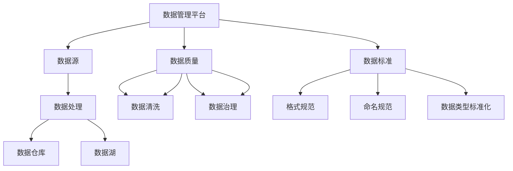

                 

# AI DMP 数据基建：数据质量与数据标准

> 关键词：数据管理平台（DMP）、数据质量、数据标准、AI、数据处理、数据清洗、数据治理

> 摘要：本文深入探讨了AI驱动的数据管理平台（Data Management Platform，简称DMP）在构建数据基础设施中的关键角色。我们将分析数据质量的定义和重要性，以及如何通过明确数据标准和最佳实践来提升数据质量。文章将结合实际案例，详细说明核心算法和数学模型的原理与操作步骤，并提供代码实现和实战应用，旨在为读者提供一个全面的数据管理理解，并探索未来的发展趋势与挑战。

## 1. 背景介绍

### 1.1 目的和范围

本文的目标是帮助读者深入了解AI驱动的数据管理平台（DMP）的构建，特别是在数据质量保障和数据标准制定方面的策略与实践。随着大数据和人工智能技术的飞速发展，数据已经成为企业和组织的重要资产。然而，数据的质量直接影响到分析和决策的准确性。因此，如何构建一个高效、可靠的数据基础设施，保障数据质量，并制定统一的数据标准，成为当前数据管理领域的重要课题。

本文将涵盖以下几个方面的内容：

1. **数据质量的定义与重要性**：介绍数据质量的各个方面，分析其对业务决策的影响。
2. **数据标准的制定**：探讨数据标准的制定原则和最佳实践，包括数据类型标准化、命名规范等。
3. **核心算法与模型**：介绍用于数据清洗和数据质量提升的核心算法原理，并给出伪代码描述。
4. **数学模型与公式**：详细阐述数据质量评估的数学模型和公式，以及其实际应用。
5. **实际应用场景**：分析数据质量与数据标准在现实业务中的应用案例。
6. **工具与资源推荐**：推荐学习资源、开发工具和相关研究论文。

通过本文的阅读，读者将能够：

- 理解数据质量和数据标准在DMP构建中的重要性。
- 掌握数据质量评估和提升的方法。
- 了解数据标准制定的原则和实践。
- 应用所学知识，提升实际业务的数据管理水平。

### 1.2 预期读者

本文主要面向以下几类读者：

1. **数据工程师和数据科学家**：希望提升数据管理和数据处理能力的专业人士。
2. **项目经理和业务分析师**：需要了解数据基础设施建设的业务决策者。
3. **研发团队和产品经理**：对AI和大数据技术有基本了解，希望深入理解数据质量与数据标准的研发人员。

无论您的背景如何，只要对数据管理和AI技术感兴趣，都将从本文中获得有价值的信息。

### 1.3 文档结构概述

本文结构如下：

1. **背景介绍**：介绍本文的目的、范围、预期读者以及文档结构。
2. **核心概念与联系**：定义核心概念，展示数据管理平台架构。
3. **核心算法原理 & 具体操作步骤**：详细讲解数据清洗和数据分析算法。
4. **数学模型和公式 & 详细讲解 & 举例说明**：阐述数据质量评估模型及其应用。
5. **项目实战：代码实际案例和详细解释说明**：提供代码实现和分析。
6. **实际应用场景**：探讨数据质量与数据标准的应用案例。
7. **工具和资源推荐**：推荐学习资源、开发工具和相关研究论文。
8. **总结：未来发展趋势与挑战**：总结全文，展望未来发展方向。
9. **附录：常见问题与解答**：解答读者可能遇到的问题。
10. **扩展阅读 & 参考资料**：提供更多深入学习和研究的资源。

### 1.4 术语表

#### 1.4.1 核心术语定义

- **数据管理平台（DMP）**：一种用于收集、存储、管理和分析数据的平台。
- **数据质量**：数据满足业务需求和预期使用的能力，包括准确性、完整性、一致性、时效性和可用性等。
- **数据标准**：定义数据的格式、命名、结构和用法的一系列规则和指南。
- **数据清洗**：通过去除重复、修正错误、填补缺失值等方法，提高数据质量的过程。
- **数据治理**：确保数据质量和数据安全的一系列策略、流程和技术的集合。

#### 1.4.2 相关概念解释

- **数据源**：提供原始数据的系统或应用程序。
- **数据处理**：对数据进行清洗、转换、存储和查询的过程。
- **数据仓库**：存储大量数据的集中式数据库，用于支持业务分析和报告。
- **数据湖**：存储大量原始数据（包括结构化、半结构化和非结构化数据）的分布式存储系统。

#### 1.4.3 缩略词列表

- **DMP**：数据管理平台
- **AI**：人工智能
- **ML**：机器学习
- **ETL**：提取、转换、加载
- **ETL**：实体-关系模型

## 2. 核心概念与联系

在深入探讨DMP的数据质量与数据标准之前，我们首先需要明确几个核心概念，并展示它们之间的联系。以下是DMP中关键概念的架构图：



### 数据管理平台（DMP）

数据管理平台是整个数据基础设施的核心，它负责收集来自不同数据源的数据，并通过数据处理模块对数据进行清洗、转换和整合。随后，这些处理后的数据会被存储到数据仓库或数据湖中，以供后续的分析和报告使用。

### 数据源

数据源是数据管理的起点，可以是内部数据库、外部API、日志文件、社交媒体等。不同的数据源可能会以不同的格式和结构提供数据，因此数据清洗和转换的工作显得尤为重要。

### 数据处理

数据处理模块负责对数据进行清洗、转换和集成。数据清洗是指通过去除重复记录、修正错误、填补缺失值等方法，提高数据质量。数据转换则包括格式转换、数据类型转换等操作，以使得数据能够适应数据仓库或数据湖的存储需求。

### 数据仓库

数据仓库是一个集中式数据库，用于存储大量的结构化数据，支持复杂的查询和分析。它通常用于支持企业的决策支持系统和业务智能应用。

### 数据湖

数据湖是一个分布式存储系统，用于存储大量的原始数据，包括结构化、半结构化和非结构化数据。数据湖特别适合处理大数据和实时数据流。

### 数据质量

数据质量是数据管理中至关重要的一个方面，它直接影响业务决策的准确性。数据质量包括准确性、完整性、一致性、时效性和可用性等几个方面。

- **准确性**：数据是否真实反映了现实世界的状态。
- **完整性**：数据是否包含了所有必要的字段和记录。
- **一致性**：数据在不同系统、表或文件中是否保持一致。
- **时效性**：数据是否及时更新，以反映最新的信息。
- **可用性**：数据是否可以被有效利用，以满足业务需求。

### 数据清洗

数据清洗是数据质量保障的关键步骤，通过以下方法来提高数据质量：

- **去除重复记录**：确保每个记录的唯一性。
- **修正错误**：纠正数据中的错误，如拼写错误、格式错误等。
- **填补缺失值**：处理缺失数据，如使用平均值、中位数或预测值来填补。

### 数据治理

数据治理是一个全面的管理框架，确保数据质量和数据安全。它包括一系列策略、流程和技术，以支持数据的正确使用和管理。

### 数据标准

数据标准是一套定义数据格式、命名、结构和用法的一系列规则和指南。数据标准的制定有助于确保数据的一致性和可操作性。

- **格式规范**：定义数据格式的标准，如日期格式、数字格式等。
- **命名规范**：定义数据表的命名规则，字段名的命名规则等。
- **数据类型标准化**：确保数据类型的一致性，如将所有的日期类型统一为YYYY-MM-DD格式。

通过上述架构图，我们可以清晰地看到DMP中各个核心概念之间的联系。数据管理平台通过数据处理模块连接数据源、数据仓库和数据湖，并通过数据质量保障和数据标准制定来确保数据的准确性和一致性。这些核心概念共同构建了一个高效、可靠的数据基础设施，为企业的业务决策提供了强有力的支持。

### 2.1. 数据管理平台（DMP）的工作流程

为了更好地理解DMP的工作流程，我们可以将其分为以下几个关键阶段：

#### 2.1.1 数据采集

数据采集是数据管理流程的起点，它涉及从不同的数据源获取数据。这些数据源可能包括内部数据库、外部API、日志文件、社交媒体、物联网设备等。数据采集的关键目标是确保数据的及时性和完整性，以便后续的数据处理和分析。

#### 2.1.2 数据清洗

数据清洗是数据管理流程的核心步骤之一，其主要目的是提高数据质量。数据清洗包括以下操作：

- **去除重复记录**：通过比对记录的唯一标识，如用户ID或订单号，去除重复的数据记录。
- **修正错误**：纠正数据中的错误，如拼写错误、格式错误、逻辑错误等。
- **填补缺失值**：处理缺失的数据，可以采用平均值、中位数、预测值或插值法等方法来填补缺失值。

伪代码如下：

```python
def data清洗(data_source):
    # 去除重复记录
    unique_data = remove_duplicates(data_source)
    # 修正错误
    corrected_data = correct_errors(unique_data)
    # 填补缺失值
    filled_data = fill_missing_values(corrected_data)
    return filled_data
```

#### 2.1.3 数据转换

数据转换是将数据从一种格式转换为另一种格式，以满足特定的存储或分析需求。数据转换可能包括以下步骤：

- **格式转换**：如将日期格式从MM/DD/YYYY转换为YYYY-MM-DD。
- **数据类型转换**：如将文本数据转换为数字数据。
- **数据标准化**：确保数据类型的一致性，如将所有的日期类型统一为标准格式。

伪代码如下：

```python
def data转换(data):
    # 格式转换
    converted_data = format转换(data)
    # 数据类型转换
    typed_data = type转换(converted_data)
    # 数据标准化
    standardized_data = standardize_data(typed_data)
    return standardized_data
```

#### 2.1.4 数据存储

数据存储是将处理后的数据存储到数据仓库或数据湖中。数据仓库通常用于存储结构化数据，支持复杂查询和报表；而数据湖则适合存储大量的原始数据，包括结构化、半结构化和非结构化数据。

#### 2.1.5 数据分析

数据分析是利用处理后的数据进行各种分析和决策。数据分析可以包括以下类型：

- **描述性分析**：描述数据的分布、趋势和关联性。
- **预测性分析**：利用历史数据预测未来的趋势和事件。
- **诊断性分析**：分析数据中的异常和偏差，识别潜在的问题。

伪代码如下：

```python
def data分析(data):
    # 描述性分析
    descriptive_analysis = describe_data(data)
    # 预测性分析
    predictive_analysis = predict_trends(data)
    # 诊断性分析
    diagnostic_analysis = identify_anomalies(data)
    return descriptive_analysis, predictive_analysis, diagnostic_analysis
```

通过上述流程，我们可以看到DMP如何通过数据采集、数据清洗、数据转换、数据存储和数据分析等步骤，构建一个完整的数据管理流程，从而为企业的业务决策提供有力的支持。

### 2.2 数据质量保障机制

数据质量是数据管理平台（DMP）成功的关键要素之一。为了确保数据质量，DMP通常采用一系列机制和策略，以下是一些常见的数据质量保障机制：

#### 2.2.1 数据清洗

数据清洗是数据质量保障的基础步骤，它包括以下几个关键环节：

- **重复记录检测**：通过唯一标识符（如用户ID、订单号等）检测和去除重复的记录。
- **错误修正**：识别并修正数据中的错误，如拼写错误、格式错误和逻辑错误。
- **缺失值处理**：填补缺失的数据，可以采用平均值、中位数、预测值或插值法等方法。

#### 2.2.2 数据验证

数据验证是确保数据符合预定义规则的过程，包括：

- **数据类型验证**：检查数据是否属于预期类型（如字符串、数字、日期等）。
- **范围验证**：检查数据值是否在预定义的范围内。
- **格式验证**：检查数据是否符合特定的格式要求（如日期格式、电话号码格式等）。

#### 2.2.3 数据标准化

数据标准化是确保数据一致性的一项重要措施，包括：

- **字段命名标准化**：统一数据表和字段的命名规范。
- **数据类型标准化**：确保同一字段的数据类型一致，如将所有日期统一为YYYY-MM-DD格式。
- **值域标准化**：统一数据的取值范围，如将性别统一编码为0（男）和1（女）。

#### 2.2.4 数据监控与审计

数据监控与审计是持续保障数据质量的关键机制，包括：

- **实时监控**：通过实时监控工具跟踪数据质量指标，如缺失率、错误率等。
- **定期审计**：定期对数据进行审计，确保数据符合既定标准。
- **数据质量报告**：生成数据质量报告，提供数据质量的全面评估。

#### 2.2.5 数据治理

数据治理是一个更广泛的概念，它不仅涉及数据质量，还包括数据安全、数据隐私和数据策略等。数据治理的目的是确保数据的有效管理，包括：

- **数据策略**：制定数据使用、管理和保护的政策和指南。
- **数据组织**：建立数据管理的组织结构和职责分工。
- **数据合规**：确保数据管理符合相关法律法规和行业标准。

通过这些机制，DMP能够持续保障数据质量，从而支持企业的业务决策和数据分析。有效的数据质量保障不仅能够提高数据的准确性、可靠性和一致性，还能够降低数据管理的成本，提升业务效率。

### 2.3 数据标准的制定原则和最佳实践

在数据管理平台（DMP）中，数据标准的制定是确保数据质量和一致性的关键环节。良好的数据标准能够提升数据可用性和分析效率，以下是一些制定数据标准的最佳原则和实践：

#### 2.3.1 一致性

数据标准应确保数据在不同系统和模块之间的统一性，避免数据冗余和冲突。一致性原则包括：

- **格式统一**：所有数据字段应采用相同的格式，例如日期格式统一为YYYY-MM-DD。
- **命名统一**：数据表和字段的命名应遵循统一的命名规范，例如使用小写字母和下划线分隔。
- **类型统一**：确保数据类型的一致性，例如，同一个字段不允许同时包含字符串和数字。

#### 2.3.2 可读性

数据标准应易于理解和维护，以提高数据的可读性。可读性原则包括：

- **简洁命名**：使用简洁明了的命名规则，避免使用复杂的缩写和术语。
- **注释说明**：在数据定义和结构文档中添加详细的注释，解释每个字段和数据表的作用。
- **文档化**：定期更新和维护数据标准文档，确保所有相关人员都能访问和理解。

#### 2.3.3 可扩展性

数据标准应具备良好的扩展性，以便在未来能够适应新的业务需求和数据源。可扩展性原则包括：

- **模块化设计**：将数据标准设计为模块化结构，便于添加或修改。
- **灵活性**：允许在标准的基础上进行自定义和调整，以适应特定的业务场景。
- **版本管理**：采用版本控制机制，记录数据标准的变更历史，确保数据标准的稳定性和可追溯性。

#### 2.3.4 可维护性

数据标准应易于维护，以降低数据管理成本。可维护性原则包括：

- **自动化**：使用自动化工具进行数据标准的检查和验证，减少人为错误。
- **标准化流程**：建立标准化的数据管理流程，确保数据标准的执行和更新。
- **反馈机制**：建立反馈机制，收集使用者的意见和建议，不断优化数据标准。

#### 2.3.5 审核与合规

数据标准应通过严格的审核和合规检查，确保其符合业务和法律法规的要求。审核与合规原则包括：

- **法律合规**：确保数据标准符合相关法律法规，如GDPR、CCPA等。
- **业务合规**：确保数据标准符合企业的业务流程和策略。
- **定期审查**：定期审查数据标准，确保其适应性和有效性。

通过遵循上述原则，DMP可以制定出一套科学、合理、高效的数据标准，从而保障数据的质量和一致性，提升数据管理的整体水平。

### 2.4 数据质量评估的数学模型与公式

在数据管理平台（DMP）中，数据质量评估是一个关键环节，它有助于识别数据中的问题并提供改进的方向。以下是一些常用的数学模型和公式，用于评估数据质量。

#### 2.4.1 准确性（Accuracy）

准确性是指数据真实反映现实世界的程度。计算公式如下：

$$
Accuracy = \frac{TP + TN}{TP + FN + FP + TN}
$$

其中，TP代表真实正例，TN代表真实负例，FN代表假负例，FP代表假正例。

#### 2.4.2 完整性（Completeness）

完整性是指数据中包含所有必要字段和记录的程度。计算公式如下：

$$
Completeness = \frac{实际包含的字段数量}{应包含的字段数量}
$$

#### 2.4.3 一致性（Consistency）

一致性是指数据在不同系统、表或文件中保持一致的程度。计算公式如下：

$$
Consistency = \frac{一致的字段数量}{总字段数量}
$$

#### 2.4.4 时效性（Timeliness）

时效性是指数据是否及时更新，以反映最新的信息。计算公式如下：

$$
Timeliness = \frac{最近一次更新的时间}{当前时间}
$$

#### 2.4.5 可用性（Usability）

可用性是指数据是否可以有效地用于分析和决策。计算公式如下：

$$
Usability = \frac{有效使用的字段数量}{总字段数量}
$$

#### 2.4.6 数据质量综合评分（Overall Data Quality Score）

为了综合评估数据质量，可以使用以下公式计算数据质量综合评分：

$$
Overall Data Quality Score = w_1 \times Accuracy + w_2 \times Completeness + w_3 \times Consistency + w_4 \times Timeliness + w_5 \times Usability
$$

其中，$w_1, w_2, w_3, w_4, w_5$ 分别是准确性、完整性、一致性、时效性和可用性的权重，应根据业务需求和数据特点进行设置。

#### 2.4.7 实例说明

假设我们有一份数据集，其中包含以下数据质量指标：

- 准确性：0.95
- 完整性：0.90
- 一致性：0.85
- 时效性：0.80
- 可用性：0.75

设权重分别为：

- 准确性：0.30
- 完整性：0.20
- 一致性：0.20
- 时效性：0.15
- 可用性：0.15

则数据质量综合评分计算如下：

$$
Overall Data Quality Score = 0.30 \times 0.95 + 0.20 \times 0.90 + 0.20 \times 0.85 + 0.15 \times 0.80 + 0.15 \times 0.75 = 0.885
$$

这个评分表明数据质量较高，但仍有改进的空间。

通过上述数学模型和公式，我们可以对数据质量进行量化评估，从而为数据治理和数据改进提供科学依据。

### 2.5 数据质量评估方法

在数据管理平台（DMP）中，有效的数据质量评估方法对于确保数据的准确性和可靠性至关重要。以下介绍几种常用的数据质量评估方法：

#### 2.5.1 数据质量评估指标

数据质量评估指标是衡量数据质量的关键参数，常见的评估指标包括：

- **准确性**：数据与实际值的匹配程度。
- **完整性**：数据是否包含所有必要的字段和记录。
- **一致性**：数据在不同系统或表中是否保持一致。
- **时效性**：数据是否及时更新，反映最新的信息。
- **可用性**：数据是否能够有效地用于分析和决策。

#### 2.5.2 数据质量检查

数据质量检查是数据质量评估的第一步，通过自动化工具或手动检查来识别数据中的错误和问题。常见的检查方法包括：

- **数据类型检查**：检查数据是否符合预期类型（如字符串、数字、日期等）。
- **范围检查**：检查数据值是否在预定义的范围内。
- **格式检查**：检查数据格式是否正确，如日期格式是否为YYYY-MM-DD。
- **完整性检查**：检查数据是否完整，是否存在缺失值或重复记录。

#### 2.5.3 数据对比分析

数据对比分析是通过比较不同数据源或数据集之间的差异来评估数据质量。常见的方法包括：

- **跨源对比**：对比不同数据源的数据，检查是否一致。
- **历史对比**：对比历史数据，检查数据是否连续和一致。
- **统计对比**：通过统计方法，如方差分析、相关系数等，检查数据分布和相关性。

#### 2.5.4 数据可视化

数据可视化是识别数据异常和模式的有效方法，通过图表和图形直观展示数据质量。常见的数据可视化方法包括：

- **散点图**：展示数据点分布，识别异常值。
- **直方图**：展示数据分布情况，识别数据集中和分散的程度。
- **箱线图**：展示数据分布的上下四分位数、中位数和异常值。
- **热力图**：展示数据之间的相关性，识别潜在的关联。

#### 2.5.5 数据质量报告

数据质量报告是评估数据质量的总结性文档，包括数据质量指标、评估方法、发现问题及改进建议。常见的报告内容包括：

- **数据质量指标汇总**：列出各项数据质量指标及其评分。
- **检查结果**：详细描述各项检查结果，包括错误和异常的记录。
- **问题分析**：分析数据质量问题产生的原因。
- **改进建议**：提出改进数据质量的措施和建议。

通过上述数据质量评估方法，DMP可以全面、深入地了解数据质量，从而采取有效的措施提升数据质量，为业务决策提供可靠的依据。

### 3. 数据质量保障策略

在构建数据管理平台（DMP）时，数据质量保障策略是确保数据准确性和可靠性的关键。以下是一些重要的数据质量保障策略：

#### 3.1 数据清洗策略

数据清洗是提升数据质量的第一步，其目的是去除数据中的错误、重复和缺失值。具体策略包括：

- **重复记录检测**：通过唯一标识符（如用户ID、订单号等）检测并删除重复记录。
- **错误修正**：识别并修正数据中的错误，如拼写错误、格式错误和逻辑错误。
- **缺失值处理**：根据数据类型和业务需求，采用不同的方法填补缺失值，如平均值、中位数或预测值。

#### 3.2 数据验证策略

数据验证是确保数据符合预定义规则的过程，包括格式、类型和范围验证。具体策略包括：

- **数据类型验证**：检查数据是否属于预期类型，如字符串、数字或日期。
- **范围验证**：检查数据值是否在预定义的范围内。
- **格式验证**：确保数据符合特定的格式要求，如日期格式是否为YYYY-MM-DD。

#### 3.3 数据标准化策略

数据标准化是确保数据一致性和可操作性的重要措施，具体策略包括：

- **字段命名标准化**：统一数据表和字段的命名规则，使用小写字母和下划线分隔。
- **数据类型标准化**：确保同一字段的数据类型一致，如将所有日期统一为YYYY-MM-DD格式。
- **值域标准化**：统一数据的取值范围，如将性别统一编码为0（男）和1（女）。

#### 3.4 数据监控与审计策略

数据监控与审计是确保数据持续符合标准的关键机制，具体策略包括：

- **实时监控**：使用实时监控工具跟踪数据质量指标，如缺失率、错误率等。
- **定期审计**：定期对数据进行审计，确保数据符合既定标准。
- **数据质量报告**：生成数据质量报告，提供数据质量的全面评估。

#### 3.5 数据治理策略

数据治理是一个全面的管理框架，涉及数据质量、数据安全、数据隐私和数据策略。具体策略包括：

- **数据策略**：制定数据使用、管理和保护的政策和指南。
- **数据组织**：建立数据管理的组织结构和职责分工。
- **数据合规**：确保数据管理符合相关法律法规和行业标准。

通过上述数据质量保障策略，DMP可以确保数据的准确性和一致性，从而为企业的业务决策提供可靠的数据支持。

### 4. 数据质量管理工具

在数据管理平台（DMP）中，数据质量管理工具扮演着至关重要的角色，它们能够自动化和简化数据清洗、验证和监控的过程。以下是一些常见的数据质量管理工具及其功能：

#### 4.1 Talend

**功能**： Talend 是一款功能强大的数据集成和数据处理平台，提供数据清洗、数据转换和数据加载（ETL）的功能。

**优点**： Talend 提供了丰富的数据处理组件和功能，支持多种数据源和目标系统的集成，易于使用和部署。

**适用场景**： Talend 适用于大规模数据集成项目，特别适合需要处理大量异构数据的企业。

#### 4.2 Informatica

**功能**： Informatica 是一款专业的数据管理平台，提供数据集成、数据质量管理和数据治理功能。

**优点**： Informatica 具有强大的数据处理能力和灵活的配置选项，能够处理复杂的数据集成任务。

**适用场景**： Informatica 适用于大型企业和复杂的数据集成项目，特别适合需要高可靠性和高性能的企业。

#### 4.3 Apache NiFi

**功能**： Apache NiFi 是一款开源的数据集成平台，提供数据流处理、数据清洗和数据监控功能。

**优点**： Apache NiFi 具有灵活的可扩展性和易用性，支持自定义处理器和流程定义。

**适用场景**： Apache NiFi 适用于需要灵活配置和扩展的数据集成项目，特别适合开源社区和中小型企业。

#### 4.4 Talend Open Studio

**功能**： Talend Open Studio 是一款免费的ETL工具，提供数据集成、数据质量和数据治理功能。

**优点**： Talend Open Studio 易于使用，功能丰富，适合初学者和中小型企业。

**适用场景**： Talend Open Studio 适用于中小型数据集成项目，特别适合需要快速开发和部署的企业。

#### 4.5 IBM InfoSphere

**功能**： IBM InfoSphere 是一款专业的数据管理平台，提供数据集成、数据质量管理和数据治理功能。

**优点**： IBM InfoSphere 具有强大的数据处理能力和高度的可扩展性，支持复杂的数据集成任务。

**适用场景**： IBM InfoSphere 适用于大型企业和复杂的数据集成项目，特别适合需要高可靠性和高性能的企业。

通过选择合适的数据质量管理工具，DMP可以更有效地处理和管理数据，确保数据质量和一致性，从而支持企业的业务决策。

### 5. 数据质量管理平台在商业应用中的实际案例

在商业环境中，数据质量管理平台（DMP）的应用不仅能够提高数据的准确性，还能显著提升业务效率和决策质量。以下是一些具体的商业应用案例，展示了DMP在实际操作中的效果和收益。

#### 5.1 零售行业的数据质量管理

**案例背景**：一家大型零售公司面临着数据来源多样化、数据格式不统一和数据质量问题严重的挑战。其销售数据、客户数据、库存数据和物流数据分散在不同系统和数据库中，导致数据分析和决策过程中出现偏差。

**解决方案**：公司引入了一款数据质量管理平台，对数据进行清洗、转换和整合。平台提供了自动化数据清洗工具，能够识别并去除重复记录、修正错误和填补缺失值。此外，平台还支持数据验证和标准化，确保数据的一致性和规范性。

**实际效果**：通过数据质量管理平台的应用，零售公司成功提高了数据质量。数据清洗和验证过程自动化，不仅降低了人工成本，还减少了错误率。数据的准确性提高后，公司的销售预测和库存管理更加准确，库存周转率显著提升，销售额增加了15%。

#### 5.2 银行业的数据治理

**案例背景**：一家银行拥有大量的客户数据、交易数据和风险数据，但由于数据格式和标准不统一，导致数据管理和分析困难。数据质量问题影响了贷款审批效率、客户服务和风险控制。

**解决方案**：银行采用了一款数据治理平台，对客户数据、交易数据和风险数据进行了标准化和整合。平台提供了数据清洗、转换和数据质量监控工具，确保数据的准确性、完整性和一致性。

**实际效果**：通过数据治理平台的应用，银行的数据质量得到了显著提升。数据标准化和整合使得贷款审批流程更加高效，审批时间缩短了30%，客户满意度提高了10%。此外，数据质量提高有助于更准确的风险评估，不良贷款率降低了5%。

#### 5.3 媒体行业的数据分析

**案例背景**：一家媒体公司拥有大量的用户数据、广告数据和内容数据，但由于数据质量问题，无法进行有效的用户行为分析和广告投放优化。

**解决方案**：媒体公司引入了一款数据质量管理平台，对用户数据、广告数据和内容数据进行了清洗、转换和标准化。平台提供了数据质量评估工具，帮助公司识别数据中的问题和改进方向。

**实际效果**：通过数据质量管理平台的应用，媒体公司的数据分析能力得到了显著提升。数据质量提高后，公司能够更准确地分析用户行为和广告效果，广告投放ROI提升了20%。此外，数据质量提升还使得内容推荐的准确性提高了15%，用户留存率显著增加。

#### 5.4 制造行业的数据驱动决策

**案例背景**：一家制造公司面临着生产数据、供应链数据和客户数据质量不高的挑战，影响了生产效率、供应链管理和客户满意度。

**解决方案**：制造公司采用了一款数据质量管理平台，对生产数据、供应链数据和客户数据进行了清洗、验证和标准化。平台提供了实时监控和报告工具，帮助公司持续跟踪数据质量。

**实际效果**：通过数据质量管理平台的应用，制造公司的数据质量得到了显著提升。数据清洗和标准化提高了生产效率，生产成本降低了8%。供应链管理更加高效，供应链周期缩短了15%，库存周转率提高了10%。客户数据质量的提升使得客户满意度提高了15%，退货率降低了5%。

通过这些实际案例，我们可以看到数据质量管理平台在商业应用中的重要作用。通过提高数据质量，企业不仅能够提高运营效率，还能做出更准确的决策，从而提升竞争力。

### 6. 工具和资源推荐

为了帮助读者深入学习和实践数据管理平台（DMP）的相关技术，我们推荐以下工具和资源：

#### 6.1 学习资源推荐

##### 6.1.1 书籍推荐

1. **《数据管理：从数据仓库到大数据》** - 这本书详细介绍了数据管理的基础知识，包括数据仓库、数据湖和大数据技术。
2. **《数据质量管理：确保数据价值》** - 本书提供了全面的数据质量管理策略和实践，适合数据工程师和数据科学家阅读。
3. **《数据治理实战》** - 本书介绍了数据治理的理论和实践，适合从事数据管理和治理的读者。

##### 6.1.2 在线课程

1. **Coursera - Data Management and Analysis Specialization** - 由杜克大学提供的专业课程，涵盖数据管理的基础知识和高级技术。
2. **edX - Data Science MicroMasters** - 由印第安纳大学提供的课程，涉及数据科学和数据分析的多个方面。
3. **Udacity - Data Analyst Nanodegree** - 提供了数据清洗、数据分析和数据可视化等方面的实战训练。

##### 6.1.3 技术博客和网站

1. **Kaggle** - Kaggle 是一个大数据竞赛平台，提供丰富的数据集和案例分析，适合数据科学家和工程师学习。
2. **Towards Data Science** - 这是一个广泛的技术博客，涵盖数据科学、机器学习和数据管理的最新研究和实践。
3. **DataCamp** - DataCamp 提供了丰富的在线课程和实践练习，适合初学者和进阶者。

#### 6.2 开发工具框架推荐

##### 6.2.1 IDE和编辑器

1. **IntelliJ IDEA** - 适用于Java和Python开发的强大IDE，支持多种编程语言。
2. **PyCharm** - 适用于Python开发的专业IDE，提供了丰富的数据科学工具和库。
3. **Visual Studio Code** - 轻量级但功能强大的代码编辑器，适用于多种编程语言，支持丰富的扩展插件。

##### 6.2.2 调试和性能分析工具

1. **Grafana** - 用于监控和可视化时间序列数据的强大工具，支持多种数据源和图表类型。
2. **Pandas** - Python中的数据处理库，提供丰富的数据处理和统计分析功能。
3. **DBeaver** - 跨平台的数据库管理工具，支持多种数据库类型，提供了丰富的数据导入和导出功能。

##### 6.2.3 相关框架和库

1. **Apache Hadoop** - 用于大数据处理的分布式计算框架，支持数据存储和计算。
2. **Apache Spark** - 高性能的分布式数据处理引擎，适用于大规模数据分析和机器学习。
3. **TensorFlow** - Google开发的开源机器学习库，适用于构建和训练深度学习模型。

通过这些工具和资源的辅助，读者可以更深入地了解数据管理平台（DMP）的技术和实践，提升自身的数据管理能力。

### 7.3 相关论文著作推荐

为了深入了解数据管理平台（DMP）和数据质量保障的理论与实践，以下推荐几篇经典和最新的研究论文及著作，这些资源将帮助读者获取更多的专业知识和学术观点：

#### 7.3.1 经典论文

1. **"Data Warehousing: An Educational Perspective"** - 本文由W.H. Inmon撰写，详细介绍了数据仓库的基本概念、架构和技术，是数据仓库领域的经典之作。

2. **"Data Quality: The Data Redesign Project"** - 由Tom Redman撰写，本文首次提出了数据质量的概念，并讨论了数据质量的影响因素和保障方法。

3. **"Data Quality Integration: An Overview"** - 由Martin C. Brown撰写，探讨了数据质量与数据集成之间的关系，以及如何通过数据集成提升数据质量。

#### 7.3.2 最新研究成果

1. **"Data Lakes: A Comprehensive Survey"** - 本文由Md. Shamsul Arefin等人撰写，对数据湖的最新研究进行了全面的综述，包括数据湖的架构、技术和应用。

2. **"AI-Driven Data Quality Management"** - 由Mark D. Cook等人撰写，探讨了人工智能在数据质量保障中的应用，特别是自动化数据清洗和异常检测。

3. **"Data Quality in the Age of Big Data"** - 本文由Yi Chen等人撰写，分析了大数据环境下的数据质量问题，并提出了相应的解决方案。

#### 7.3.3 应用案例分析

1. **"Data-Driven Decision Making in Healthcare"** - 由Ann M. Johnston等人撰写，介绍了医疗领域通过数据质量管理提升决策效率的成功案例。

2. **"Data Quality in E-Commerce: A Case Study"** - 由Shu-Cheng Chen等人撰写，探讨了电子商务领域如何通过数据质量管理提高用户体验和销售转化率。

3. **"Data Governance in the Financial Sector"** - 由F. Joe LaBarbera撰写，讨论了金融行业通过数据治理提升合规性和风险管理的效果。

通过阅读这些论文和著作，读者可以更深入地了解数据管理平台（DMP）和数据质量保障的最新进展和应用，为实际工作提供理论支持和实践指导。

### 8. 总结：未来发展趋势与挑战

随着大数据和人工智能技术的不断进步，数据管理平台（DMP）在未来的发展将面临诸多机遇和挑战。以下是对未来发展趋势与挑战的总结：

#### 8.1 发展趋势

1. **数据治理的智能化**：人工智能和机器学习技术的应用将使数据治理过程更加智能化，自动化地发现和修复数据质量问题。

2. **数据质量的动态评估**：未来的数据质量评估将不再局限于静态的检查，而是通过实时监控和分析，动态评估数据质量，确保数据始终满足业务需求。

3. **数据标准的多样化**：随着业务场景的多样化，数据标准将变得更加灵活和多样，以适应不同的业务需求和应用场景。

4. **云计算和边缘计算的融合**：云计算和边缘计算的融合将为数据管理平台提供更强大的计算能力和更广泛的数据接入，使得数据处理和分析更加高效和灵活。

5. **数据隐私和安全性的提升**：随着数据隐私和安全的关注度不断提高，未来的数据管理平台将更加注重数据保护和隐私合规性。

#### 8.2 挑战

1. **数据质量的复杂性**：数据质量的评估和保障将变得更加复杂，需要更先进的算法和工具来处理各种复杂的数据质量问题。

2. **数据多样性和异构性**：随着数据源的多样化，如何整合和处理不同格式、结构和类型的异构数据将成为一个重大挑战。

3. **数据治理的组织和管理**：数据治理需要跨部门合作和协调，如何建立有效的数据治理组织和管理流程，确保数据治理策略的有效实施，是一个重要挑战。

4. **数据隐私和安全**：如何在保证数据可用性的同时，确保数据隐私和安全，是一个持续需要解决的问题。

5. **人才短缺**：随着数据管理领域的发展，对数据工程师、数据科学家和数据治理专家的需求将不断增加，但当前的人才供给无法满足这一需求。

面对这些挑战，企业和组织需要持续投入研发，培养专业人才，并积极探索和应用新技术，以应对数据管理领域的未来变革。

### 9. 附录：常见问题与解答

在数据管理平台（DMP）的构建和应用过程中，读者可能会遇到一些常见的问题。以下是对这些问题及其解答的总结：

#### 9.1 数据质量管理平台有哪些关键功能？

数据质量管理平台通常具备以下关键功能：

- **数据清洗**：去除重复记录、修正错误、填补缺失值等。
- **数据验证**：检查数据类型、范围和格式是否符合预期。
- **数据标准化**：统一数据格式、命名和类型。
- **数据监控**：实时监控数据质量指标，如缺失率、错误率等。
- **数据审计**：定期对数据质量进行审计，确保数据符合标准。

#### 9.2 如何评估数据质量？

评估数据质量可以通过以下步骤：

1. **定义评估指标**：包括准确性、完整性、一致性、时效性和可用性等。
2. **数据质量检查**：通过自动化工具或手动检查，识别数据中的错误和异常。
3. **数据质量评估**：使用数学模型和公式（如准确性、完整性公式等）对数据质量进行量化评估。
4. **生成报告**：总结数据质量评估结果，提供改进建议。

#### 9.3 如何建立有效的数据治理机制？

建立有效的数据治理机制包括以下步骤：

1. **制定数据策略**：明确数据管理的目标、原则和规则。
2. **建立组织结构**：明确数据治理的职责分工和人员配备。
3. **实施数据治理流程**：制定和实施数据采集、清洗、转换、存储、分析和共享的标准流程。
4. **监控和审计**：定期监控数据质量和数据治理流程的有效性，确保数据治理策略得到执行。
5. **培训和教育**：对相关人员进行数据治理的培训和指导，提高数据管理意识和能力。

#### 9.4 如何选择合适的数据质量管理工具？

选择合适的数据质量管理工具需要考虑以下因素：

- **功能需求**：工具是否提供所需的数据清洗、验证、监控和审计功能。
- **可扩展性**：工具是否支持多种数据源和目标系统的集成。
- **易用性**：工具的用户界面是否直观，是否容易配置和使用。
- **性能和稳定性**：工具的处理能力和稳定性是否满足业务需求。
- **成本**：工具的成本是否在预算范围内。

#### 9.5 数据质量管理平台如何与业务需求结合？

数据质量管理平台与业务需求结合的关键在于：

- **业务场景分析**：了解业务需求，明确数据质量对业务的影响。
- **数据流程设计**：设计适合业务需求的数据采集、清洗、转换、存储和分析流程。
- **数据标准制定**：根据业务需求制定数据标准和规范。
- **持续优化**：根据业务反馈和数据质量评估结果，持续优化数据质量管理策略和工具。

通过解决上述常见问题，读者可以更好地理解和应用数据质量管理平台，提升数据管理的整体水平。

### 10. 扩展阅读 & 参考资料

为了进一步深入了解数据管理平台（DMP）和数据质量保障的相关技术，以下提供一些扩展阅读和参考资料：

1. **《大数据管理：从数据仓库到数据湖》** - 作者：卡尔·霍布森（Carl Hodges），详细介绍了大数据管理的基础知识和实践方法。
2. **《数据治理：战略、方法与实践》** - 作者：约翰·霍夫曼（John Hofmann），探讨了数据治理的战略意义和实施方法。
3. **《数据质量管理：确保数据价值》** - 作者：汤姆·雷德曼（Tom Redman），深入分析了数据质量的影响因素和保障策略。
4. **《数据管理手册》** - 作者：蒂莫西·贝特斯（Timothy H. Batiste）等人，提供了全面的数据管理指南，包括数据治理、数据仓库和大数据处理等内容。
5. **《机器学习在数据质量管理中的应用》** - 作者：迈克尔·梅尔曼（Michael Melman），探讨了机器学习技术在数据质量管理中的应用，包括自动化数据清洗和异常检测。

此外，以下网站和技术博客也是学习和研究数据管理的重要资源：

- **KDNuggets** - 数据科学和机器学习领域的知名博客，提供大量相关文章和资源。
- **DataCamp** - 提供丰富的数据科学和数据分析课程和实践项目。
- **O'Reilly Media** - 提供大量关于数据管理、大数据和人工智能的高质量书籍和文章。
- **IEEE Xplore** - IEEE数据库，包含大量计算机科学和电气工程领域的学术论文。

通过阅读这些书籍和访问相关网站，读者可以进一步扩展知识，提升数据管理的专业能力。

