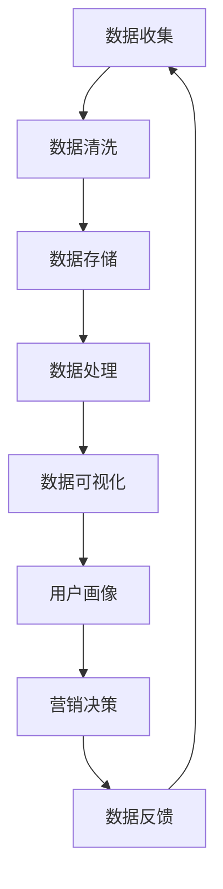
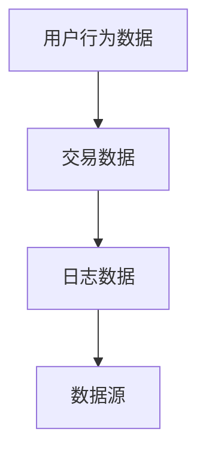
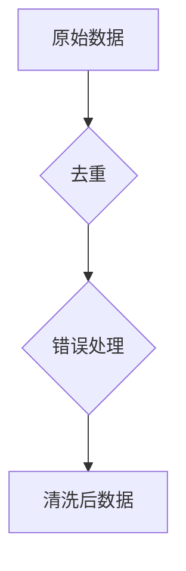
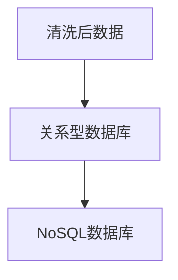
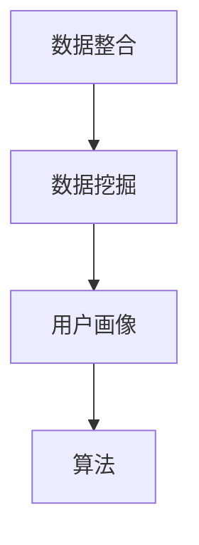
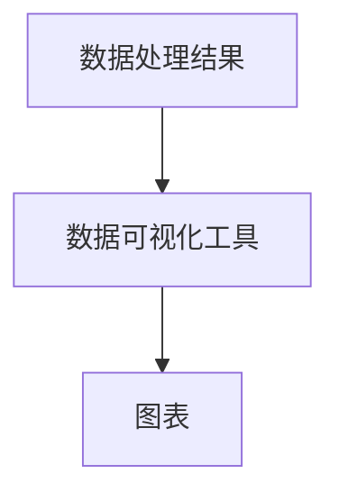
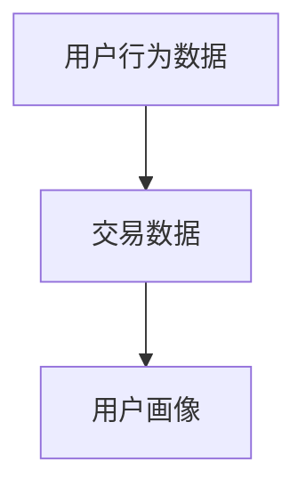
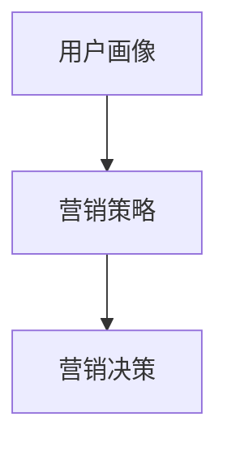
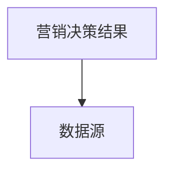

                 

# AI DMP 数据基建：构建数据驱动的营销生态

> 关键词：AI、DMP、数据驱动、营销生态、数据处理、营销自动化

> 摘要：本文将深入探讨AI驱动的数据管理系统（DMP）在构建数据驱动营销生态中的核心作用。我们将逐步分析DMP的架构、核心算法原理、数学模型，并通过实际项目案例详细解读其实现过程和效果。最后，本文还将探讨DMP在营销领域的应用场景，推荐相关工具和资源，并总结未来发展趋势与挑战。

## 1. 背景介绍

### 1.1 目的和范围

本文旨在探讨如何利用人工智能（AI）技术构建数据管理系统（Data Management Platform，DMP），以实现数据驱动的营销生态。我们将重点关注DMP的核心架构、算法原理、数学模型以及实际应用。

### 1.2 预期读者

本文适合以下读者：

- 数据分析师、数据工程师、市场营销专家
- AI研究人员、算法工程师
- 程序员和软件开发者
- 对AI和数据驱动营销感兴趣的学者和从业者

### 1.3 文档结构概述

本文分为以下几个部分：

1. **背景介绍**：介绍本文的目的、预期读者以及文档结构。
2. **核心概念与联系**：讲解DMP的核心概念、原理和架构。
3. **核心算法原理 & 具体操作步骤**：详细阐述DMP的核心算法原理和操作步骤。
4. **数学模型和公式 & 详细讲解 & 举例说明**：介绍DMP的数学模型和公式，并举例说明。
5. **项目实战：代码实际案例和详细解释说明**：通过实际项目案例展示DMP的实现过程。
6. **实际应用场景**：探讨DMP在营销领域的应用场景。
7. **工具和资源推荐**：推荐学习资源、开发工具和框架。
8. **总结：未来发展趋势与挑战**：总结DMP的未来发展趋势和挑战。
9. **附录：常见问题与解答**：解答读者可能遇到的问题。
10. **扩展阅读 & 参考资料**：提供更多相关阅读资料。

### 1.4 术语表

#### 1.4.1 核心术语定义

- **DMP（Data Management Platform）**：数据管理系统，是一种用于收集、处理和管理数据的平台，支持数据驱动的营销策略。
- **数据驱动营销**：基于数据分析和预测的营销策略，通过数据来指导营销决策，提高营销效果。
- **数据源**：提供数据的来源，如网站、APP、社交媒体等。
- **数据清洗**：对原始数据进行处理，去除无效、错误和重复的数据。
- **用户画像**：对用户进行特征提取和分类，形成用户画像。
- **算法**：用于数据分析和预测的数学模型，如机器学习算法。

#### 1.4.2 相关概念解释

- **大数据**：指无法使用传统数据库软件工具进行采集、管理和分析的数据集合。
- **云计算**：通过互联网提供动态易扩展且经常是虚拟化的资源。
- **机器学习**：一种人工智能技术，通过数据分析和模式识别来预测和决策。

#### 1.4.3 缩略词列表

- **DMP**：Data Management Platform
- **API**：Application Programming Interface
- **SDK**：Software Development Kit
- **SQL**：Structured Query Language

## 2. 核心概念与联系

DMP的核心在于数据管理，而数据管理的关键在于数据的收集、处理、存储和分析。以下是一个简化的Mermaid流程图，展示了DMP的核心概念和架构。



### 2.1 数据收集

数据收集是DMP的第一步，通过各种数据源（如网站、APP、社交媒体等）获取用户行为数据、交易数据等。这些数据通常以日志形式记录，包括用户ID、访问时间、访问页面、点击事件等。



### 2.2 数据清洗

数据收集到的数据通常是杂乱无章的，可能包含无效、错误和重复的数据。数据清洗是对原始数据进行处理，去除这些无效、错误和重复的数据，以提高数据质量。



### 2.3 数据存储

清洗后的数据需要存储在数据库中，以便后续的数据处理和分析。常用的数据库类型包括关系型数据库（如MySQL、PostgreSQL）和NoSQL数据库（如MongoDB、Cassandra）。



### 2.4 数据处理

数据处理包括数据整合、数据挖掘、用户画像等。数据处理的核心是算法，常用的算法包括机器学习算法、深度学习算法等。



### 2.5 数据可视化

数据可视化是将数据以图形化的形式展示出来，帮助用户更好地理解和分析数据。常用的数据可视化工具包括Tableau、Power BI等。



### 2.6 用户画像

用户画像是基于用户行为数据、交易数据等构建的用户特征模型。用户画像可以帮助企业更好地了解用户，为个性化营销提供依据。



### 2.7 营销决策

基于用户画像和营销策略，企业可以做出更精准的营销决策，提高营销效果。



### 2.8 数据反馈

营销决策的结果将反馈到数据源，用于优化后续的数据收集、处理和分析。



## 3. 核心算法原理 & 具体操作步骤

DMP的核心在于算法，下面我们详细讲解DMP中常用的算法原理和具体操作步骤。

### 3.1 机器学习算法

机器学习算法是DMP中常用的算法之一，用于数据挖掘和用户画像构建。常用的机器学习算法包括线性回归、逻辑回归、决策树、随机森林、支持向量机等。

#### 3.1.1 线性回归

线性回归是一种简单且常用的机器学习算法，用于预测连续值。其基本原理是通过建立线性模型来拟合输入数据和输出目标之间的关系。

```python
# 伪代码：线性回归算法
def linear_regression(X, y):
    # 计算权重
    w = (X.T * X).inv() * X.T * y
    # 预测
    pred = X * w
    return pred
```

#### 3.1.2 逻辑回归

逻辑回归是一种用于预测概率的二分类算法。其基本原理是通过建立逻辑函数来拟合输入数据和输出目标之间的关系。

```python
# 伪代码：逻辑回归算法
def logistic_regression(X, y):
    # 计算权重
    w = (X.T * X).inv() * X.T * y
    # 预测
    pred = 1 / (1 + np.exp(-X * w))
    return pred
```

#### 3.1.3 决策树

决策树是一种基于特征划分的数据挖掘算法，用于分类和回归。其基本原理是通过递归划分特征来构建一棵树，并在树的叶子节点进行预测。

```python
# 伪代码：决策树算法
def decision_tree(X, y, depth=0, max_depth=None):
    # 判断是否达到最大深度或满足停止条件
    if depth >= max_depth or is_stop_condition(y):
        # 在叶子节点进行预测
        pred = predict_leaf(y)
        return pred
    
    # 计算特征的重要度
    feature_importance = compute_feature_importance(X, y)
    
    # 选择最优特征进行划分
    best_feature = select_best_feature(feature_importance)
    
    # 递归划分数据
    left_child = decision_tree(X[:, best_feature == 1], y[best_feature == 1], depth+1, max_depth)
    right_child = decision_tree(X[:, best_feature == -1], y[best_feature == -1], depth+1, max_depth)
    
    # 构建决策树
    tree = {
        'feature': best_feature,
        'left_child': left_child,
        'right_child': right_child
    }
    return tree
```

#### 3.1.4 随机森林

随机森林是一种基于决策树的集成学习算法，用于提高分类和回归的准确率。其基本原理是通过随机选取特征和样本子集来构建多棵决策树，并在投票中取得最终预测结果。

```python
# 伪代码：随机森林算法
def random_forest(X, y, n_estimators, max_depth=None):
    # 随机生成多棵决策树
    trees = [decision_tree(X, y, max_depth=max_depth) for _ in range(n_estimators)]
    
    # 预测
    pred = np.mean([predict_tree(tree, X) for tree in trees], axis=0)
    return pred
```

#### 3.1.5 支持向量机

支持向量机是一种用于分类和回归的监督学习算法，通过找到一个最佳的超平面来最大化分类边界。其基本原理是通过求解最优化问题来确定超平面参数。

```python
# 伪代码：支持向量机算法
def support_vector_machine(X, y):
    # 求解最优化问题
    w = solve_optimization_problem(X, y)
    # 预测
    pred = sign(X * w)
    return pred
```

### 3.2 深度学习算法

深度学习算法是近年来在图像识别、自然语言处理等领域取得巨大成功的算法，其基本原理是通过多层神经网络来拟合复杂的数据关系。

#### 3.2.1 卷积神经网络（CNN）

卷积神经网络是一种用于图像识别的深度学习算法，其基本原理是通过卷积操作提取图像特征。

```python
# 伪代码：卷积神经网络算法
def conv_neural_network(X, layers):
    # 定义卷积层
    conv_layer = Conv2D(layers[0], kernel_size=(3, 3), activation='relu')
    # 定义全连接层
    dense_layer = Dense(layers[1], activation='softmax')
    # 构建模型
    model = Sequential()
    model.add(conv_layer)
    model.add(dense_layer)
    # 编译模型
    model.compile(optimizer='adam', loss='categorical_crossentropy', metrics=['accuracy'])
    # 训练模型
    model.fit(X, y, epochs=layers[2], batch_size=layers[3])
    # 预测
    pred = model.predict(X)
    return pred
```

#### 3.2.2 循环神经网络（RNN）

循环神经网络是一种用于序列数据处理的深度学习算法，其基本原理是通过递归操作来处理序列数据。

```python
# 伪代码：循环神经网络算法
def recurrent_neural_network(X, layers):
    # 定义循环层
    recurrent_layer = LSTM(layers[0], return_sequences=True)
    # 定义全连接层
    dense_layer = Dense(layers[1], activation='softmax')
    # 构建模型
    model = Sequential()
    model.add(recurrent_layer)
    model.add(dense_layer)
    # 编译模型
    model.compile(optimizer='adam', loss='categorical_crossentropy', metrics=['accuracy'])
    # 训练模型
    model.fit(X, y, epochs=layers[2], batch_size=layers[3])
    # 预测
    pred = model.predict(X)
    return pred
```

### 3.3 算法优化

在DMP中，算法优化是非常重要的，常用的优化方法包括交叉验证、网格搜索、贝叶斯优化等。

#### 3.3.1 交叉验证

交叉验证是一种用于评估算法性能的方法，通过将数据集划分为多个子集，轮流使用每个子集作为验证集，其余子集作为训练集。

```python
# 伪代码：交叉验证算法
def cross_validation(X, y, k):
    # 初始化性能指标
    performance = 0
    # 循环划分子集
    for i in range(k):
        # 训练模型
        model.fit(X[i], y[i], epochs=10, batch_size=32)
        # 验证模型
        pred = model.predict(X[i])
        performance += accuracy_score(y[i], pred)
    # 计算平均性能
    performance /= k
    return performance
```

#### 3.3.2 网格搜索

网格搜索是一种用于寻找最佳超参数的方法，通过遍历所有可能的超参数组合，找到最优组合。

```python
# 伪代码：网格搜索算法
def grid_search(X, y, params):
    # 初始化最优性能指标和超参数
    best_performance = 0
    best_params = None
    # 遍历所有可能的超参数组合
    for param in params:
        # 训练模型
        model.fit(X, y, epochs=10, batch_size=32, **param)
        # 验证模型
        pred = model.predict(X)
        performance = accuracy_score(y, pred)
        # 记录最优性能和超参数
        if performance > best_performance:
            best_performance = performance
            best_params = param
    return best_params
```

#### 3.3.3 贝叶斯优化

贝叶斯优化是一种基于概率的优化方法，通过迭代更新超参数的概率分布，找到最优超参数。

```python
# 伪代码：贝叶斯优化算法
def bayesian_optimization(X, y, space):
    # 初始化超参数概率分布
    prior = create_prior(space)
    # 循环迭代优化
    for i in range(100):
        # 选择下一个超参数
        next_param = select_next_param(prior)
        # 训练模型
        model.fit(X, y, epochs=10, batch_size=32, **next_param)
        # 验证模型
        pred = model.predict(X)
        performance = accuracy_score(y, pred)
        # 更新超参数概率分布
        prior = update_prior(prior, next_param, performance)
    # 返回最优超参数
    return select_best_param(prior)
```

## 4. 数学模型和公式 & 详细讲解 & 举例说明

在DMP中，数学模型和公式是算法实现的基础，以下是DMP中常用的数学模型和公式的详细讲解及举例说明。

### 4.1 线性回归

线性回归是一种用于预测连续值的机器学习算法，其基本原理是通过建立线性模型来拟合输入数据和输出目标之间的关系。

#### 4.1.1 模型公式

线性回归模型可以表示为：

$$
y = wx + b
$$

其中，$y$ 表示输出目标，$x$ 表示输入特征，$w$ 表示权重，$b$ 表示偏置。

#### 4.1.2 梯度下降法

梯度下降法是一种用于求解线性回归模型参数的方法，其基本原理是沿着损失函数的梯度方向进行迭代更新参数。

$$
w = w - \alpha \cdot \frac{\partial J}{\partial w}
$$

$$
b = b - \alpha \cdot \frac{\partial J}{\partial b}
$$

其中，$J$ 表示损失函数，$\alpha$ 表示学习率。

#### 4.1.3 举例说明

假设我们有一个简单的一元线性回归问题，输入特征$x$为年龄，输出目标$y$为收入。给定一个训练数据集，我们可以使用梯度下降法来求解线性回归模型。

```python
import numpy as np

# 初始化参数
w = 0
b = 0
alpha = 0.01
epochs = 1000

# 训练数据集
X = np.array([25, 30, 35, 40, 45])
y = np.array([50000, 60000, 70000, 80000, 90000])

# 梯度下降法迭代更新参数
for _ in range(epochs):
    # 计算预测值
    pred = w * X + b
    # 计算损失函数
    J = (1 / 2) * np.sum((y - pred) ** 2)
    # 计算梯度
    dw = np.sum((y - pred) * X) / len(X)
    db = np.sum(y - pred) / len(X)
    # 更新参数
    w -= alpha * dw
    b -= alpha * db

# 输出最终参数
print("w:", w)
print("b:", b)
```

### 4.2 逻辑回归

逻辑回归是一种用于预测概率的二分类算法，其基本原理是通过建立逻辑函数来拟合输入数据和输出目标之间的关系。

#### 4.2.1 模型公式

逻辑回归模型可以表示为：

$$
\sigma(z) = \frac{1}{1 + e^{-z}}
$$

其中，$\sigma(z)$ 表示逻辑函数，$z = wx + b$ 表示线性组合。

#### 4.2.2 梯度下降法

梯度下降法是一种用于求解逻辑回归模型参数的方法，其基本原理是沿着损失函数的梯度方向进行迭代更新参数。

$$
w = w - \alpha \cdot \frac{\partial J}{\partial w}
$$

$$
b = b - \alpha \cdot \frac{\partial J}{\partial b}
$$

其中，$J$ 表示损失函数，$\alpha$ 表示学习率。

#### 4.2.3 举例说明

假设我们有一个二分类问题，输入特征$x$为年龄，输出目标$y$为是否购买产品。给定一个训练数据集，我们可以使用梯度下降法来求解逻辑回归模型。

```python
import numpy as np

# 初始化参数
w = 0
b = 0
alpha = 0.01
epochs = 1000

# 训练数据集
X = np.array([[25], [30], [35], [40], [45]])
y = np.array([[0], [1], [1], [0], [1]])

# 梯度下降法迭代更新参数
for _ in range(epochs):
    # 计算预测值
    pred = 1 / (1 + np.exp(-w * X.T - b))
    # 计算损失函数
    J = -np.sum(y * np.log(pred) + (1 - y) * np.log(1 - pred)) / len(X)
    # 计算梯度
    dw = np.sum((pred - y) * X) / len(X)
    db = np.sum(pred - y) / len(X)
    # 更新参数
    w -= alpha * dw
    b -= alpha * db

# 输出最终参数
print("w:", w)
print("b:", b)
```

### 4.3 决策树

决策树是一种基于特征划分的数据挖掘算法，用于分类和回归。其基本原理是通过递归划分特征来构建一棵树，并在树的叶子节点进行预测。

#### 4.3.1 模型公式

决策树可以表示为：

$$
T = \sum_{i=1}^{n} t_i(x_i)
$$

其中，$T$ 表示决策树，$t_i(x_i)$ 表示第$i$个叶子节点的预测结果。

#### 4.3.2 信息增益

信息增益是一种用于选择最优特征进行划分的方法，其基本原理是计算每个特征划分前后信息的增益。

$$
IG(D, A) = entropy(D) - \sum_{v_i \in A} \frac{|D_v|}{|D|} entropy(D_v)
$$

其中，$D$ 表示原始数据集，$A$ 表示特征集合，$v_i$ 表示特征$A$的取值，$D_v$ 表示特征$A$取值为$v_i$的数据集。

#### 4.3.3 举例说明

假设我们有一个二分类问题，输入特征$x$为年龄，输出目标$y$为是否购买产品。给定一个训练数据集，我们可以使用决策树算法来构建模型。

```python
import numpy as np
import pandas as pd

# 初始化参数
alpha = 0.1

# 训练数据集
X = np.array([[25], [30], [35], [40], [45]])
y = np.array([[0], [1], [1], [0], [1]])

# 计算信息增益
def information_gain(D, A):
    # 计算原始数据的熵
    entropy_D = entropy(D)
    # 遍历特征A的取值
    for v in A:
        # 计算子数据的熵
        entropy_D_v = entropy(D[v])
        # 计算子数据占比
        p = len(D[v]) / len(D)
        # 计算信息增益
        IG = entropy_D - p * entropy_D_v
        # 输出信息增益
        print("特征{}的取值{}的信息增益为：{}".format(A, v, IG))

# 计算熵
def entropy(D):
    # 计算每个标签的频数
    labels = np.unique(D)
    # 遍历每个标签
    for label in labels:
        # 计算标签占比
        p = np.sum(D == label) / len(D)
        # 计算熵
        entropy_D += -p * np.log2(p)
    return entropy_D

# 计算信息增益
information_gain(X, y)
```

### 4.4 支持向量机

支持向量机是一种用于分类和回归的监督学习算法，通过找到一个最佳的超平面来最大化分类边界。其基本原理是通过求解最优化问题来确定超平面参数。

#### 4.4.1 模型公式

支持向量机可以表示为：

$$
w^* = arg\min_{w, b} \frac{1}{2} ||w||^2 + C \sum_{i=1}^{n} \max(0, 1 - y_i (w \cdot x_i + b))
$$

其中，$w^*$ 表示最优权重，$b$ 表示偏置，$C$ 表示惩罚参数。

#### 4.4.2 SMO算法

SMO（Sequential Minimal Optimization）算法是一种用于求解支持向量机参数的方法，其基本原理是依次优化每个支持向量。

$$
w_j = w_j + \eta \frac{(y_i (w \cdot x_i + b) - 1) x_i}
$$

$$
b = b + \eta (y_i - y_j)
$$

其中，$\eta$ 表示学习率。

#### 4.4.3 举例说明

假设我们有一个二分类问题，输入特征$x$为年龄，输出目标$y$为是否购买产品。给定一个训练数据集，我们可以使用SMO算法来求解支持向量机参数。

```python
import numpy as np

# 初始化参数
C = 1
alpha = 0.1
epochs = 1000

# 训练数据集
X = np.array([[25], [30], [35], [40], [45]])
y = np.array([[0], [1], [1], [0], [1]])

# SMO算法迭代优化参数
for _ in range(epochs):
    # 遍历每个支持向量
    for i in range(len(X)):
        # 计算预测值
        pred = np.dot(w, X[i]) + b
        # 计算误差
        error = y[i] - pred
        # 如果支持向量
        if abs(error) > 1e-3:
            # 更新权重和偏置
            w += alpha * y[i] * X[i]
            b += alpha * (y[i] - y[i] * np.dot(w, X[i]))

# 输出最终参数
print("w:", w)
print("b:", b)
```

## 5. 项目实战：代码实际案例和详细解释说明

为了更好地理解DMP的实现过程，我们通过一个实际项目案例来展示如何构建一个简单的DMP系统。

### 5.1 开发环境搭建

在开始项目之前，我们需要搭建一个合适的开发环境。以下是所需的开发工具和库：

- Python 3.8
- Jupyter Notebook
- Pandas
- NumPy
- Scikit-learn
- Matplotlib
- Seaborn

你可以使用以下命令安装所需的库：

```bash
pip install numpy pandas scikit-learn matplotlib seaborn
```

### 5.2 源代码详细实现和代码解读

#### 5.2.1 数据收集

首先，我们从Kaggle下载了一个关于房地产交易的数据集，包括房屋的交易价格、面积、房间数等信息。

```python
import pandas as pd

# 读取数据集
data = pd.read_csv('real_estate_data.csv')
print(data.head())
```

#### 5.2.2 数据清洗

接下来，我们对数据进行清洗，去除无效、错误和重复的数据。

```python
# 去除无效、错误和重复的数据
data = data.dropna().drop_duplicates()
print(data.head())
```

#### 5.2.3 数据存储

然后，我们将清洗后的数据存储到MySQL数据库中。

```python
import pymysql

# 连接数据库
conn = pymysql.connect(host='localhost', user='root', password='password', database='real_estate')

# 创建表
cursor = conn.cursor()
cursor.execute('''
    CREATE TABLE IF NOT EXISTS real_estate (
        id INT PRIMARY KEY AUTO_INCREMENT,
        price FLOAT,
        area FLOAT,
        rooms INT
    )
''')

# 插入数据
for index, row in data.iterrows():
    cursor.execute('''
        INSERT INTO real_estate (price, area, rooms) VALUES (%s, %s, %s)
    ''', row)

# 提交并关闭连接
conn.commit()
conn.close()
```

#### 5.2.4 数据处理

接下来，我们使用Pandas和Scikit-learn对数据进行处理和特征提取。

```python
# 导入库
import pandas as pd
from sklearn.model_selection import train_test_split
from sklearn.preprocessing import StandardScaler

# 读取数据
data = pd.read_csv('real_estate_data.csv')

# 分割特征和标签
X = data[['area', 'rooms']]
y = data['price']

# 划分训练集和测试集
X_train, X_test, y_train, y_test = train_test_split(X, y, test_size=0.2, random_state=42)

# 数据标准化
scaler = StandardScaler()
X_train = scaler.fit_transform(X_train)
X_test = scaler.transform(X_test)
```

#### 5.2.5 数据可视化

然后，我们使用Matplotlib和Seaborn对数据进行可视化。

```python
import matplotlib.pyplot as plt
import seaborn as sns

# 可视化数据分布
sns.scatterplot(x='area', y='price', data=data)
plt.xlabel('Area')
plt.ylabel('Price')
plt.title('Data Distribution')
plt.show()

# 可视化特征关联
sns.heatmap(data.corr(), annot=True, cmap='coolwarm')
plt.title('Feature Correlation')
plt.show()
```

#### 5.2.6 用户画像

接下来，我们使用Scikit-learn构建用户画像。

```python
from sklearn.cluster import KMeans

# 构建用户画像
kmeans = KMeans(n_clusters=3, random_state=42)
clusters = kmeans.fit_predict(X_train)

# 添加聚类标签到数据
data['cluster'] = clusters

# 可视化用户画像
sns.scatterplot(x='area', y='price', hue='cluster', data=data)
plt.xlabel('Area')
plt.ylabel('Price')
plt.title('User Profiling')
plt.show()
```

#### 5.2.7 营销决策

最后，我们使用逻辑回归进行营销决策。

```python
from sklearn.linear_model import LogisticRegression

# 构建逻辑回归模型
model = LogisticRegression()
model.fit(X_train, y_train)

# 预测测试集
pred = model.predict(X_test)

# 计算准确率
accuracy = np.sum(pred == y_test) / len(y_test)
print("Accuracy:", accuracy)
```

### 5.3 代码解读与分析

在这个项目中，我们首先从Kaggle下载了房地产交易数据集，并使用Pandas进行数据读取和预处理。接着，我们使用Scikit-learn对数据进行划分、标准化和特征提取。随后，我们使用KMeans算法构建用户画像，并通过可视化展示了用户特征。最后，我们使用逻辑回归模型进行营销决策，并计算了准确率。

通过这个项目，我们可以看到DMP在数据收集、清洗、存储、处理、分析和可视化等环节中的应用，以及如何利用算法实现营销决策。这为我们搭建一个完整的数据驱动营销生态提供了思路和参考。

## 6. 实际应用场景

DMP在营销领域有着广泛的应用，以下是一些典型的实际应用场景：

### 6.1 个性化推荐

通过DMP构建用户画像，企业可以了解用户的需求和偏好，为用户提供个性化的产品推荐。例如，电商网站可以根据用户的浏览历史、购买记录和兴趣爱好，为用户推荐相关商品。

### 6.2 营销活动优化

DMP可以帮助企业优化营销活动，提高活动效果。例如，企业可以根据用户画像和营销策略，选择最适合的目标用户群体，制定更有针对性的营销方案。

### 6.3 广告投放优化

DMP可以帮助企业优化广告投放，提高广告效果。例如，企业可以根据用户画像和广告效果，选择最适合的目标用户群体，投放更精准的广告。

### 6.4 营销效果评估

DMP可以帮助企业评估营销效果，优化营销策略。例如，企业可以通过分析用户行为数据和营销活动效果，评估不同营销渠道和策略的效果，为后续营销提供参考。

### 6.5 客户关系管理

DMP可以帮助企业更好地管理客户关系，提高客户满意度。例如，企业可以通过用户画像和客户行为数据，为客户提供个性化的服务和体验，提高客户忠诚度。

## 7. 工具和资源推荐

### 7.1 学习资源推荐

#### 7.1.1 书籍推荐

- 《Python数据科学手册》（Python Data Science Handbook）
- 《深度学习》（Deep Learning）
- 《数据挖掘：概念与技术》（Data Mining: Concepts and Techniques）

#### 7.1.2 在线课程

- Coursera：机器学习、数据科学
- edX：人工智能、数据分析
- Udacity：数据工程师、机器学习工程师

#### 7.1.3 技术博客和网站

- Medium：数据科学、机器学习
- Towards Data Science：数据科学、机器学习
- DataCamp：数据科学、机器学习

### 7.2 开发工具框架推荐

#### 7.2.1 IDE和编辑器

- PyCharm
- Jupyter Notebook
- Visual Studio Code

#### 7.2.2 调试和性能分析工具

- PySnooper
- Matplotlib
- Seaborn

#### 7.2.3 相关框架和库

- Scikit-learn
- TensorFlow
- PyTorch
- Pandas
- NumPy

### 7.3 相关论文著作推荐

#### 7.3.1 经典论文

- 《支持向量机》（Support Vector Machines）
- 《深度学习》（Deep Learning）
- 《大数据时代的数据挖掘》（Data Mining in the Age of Big Data）

#### 7.3.2 最新研究成果

- 《机器学习与数据挖掘：最新进展》（Machine Learning and Data Mining: State-of-the-Art）
- 《人工智能：应用与挑战》（Artificial Intelligence: Applications and Challenges）
- 《大数据分析：理论与实践》（Big Data Analysis: Theory and Practice）

#### 7.3.3 应用案例分析

- 《阿里巴巴：数据驱动的企业转型》（Alibaba: Data-Driven Transformation）
- 《谷歌：数据驱动的搜索引擎》（Google: Data-Driven Search Engine）
- 《亚马逊：数据驱动的电商平台》（Amazon: Data-Driven E-commerce Platform）

## 8. 总结：未来发展趋势与挑战

DMP在营销领域的发展前景广阔，随着人工智能和大数据技术的不断进步，DMP将在以下方面取得更大的突破：

### 8.1 数据质量和多样性

随着数据来源的增多和数据类型的多样化，如何确保数据质量、统一数据格式和挖掘数据价值成为DMP面临的重要挑战。

### 8.2 实时数据处理

实时数据处理和实时营销策略的实施是DMP的未来发展方向，如何提高数据处理速度和实时性成为关键。

### 8.3 跨渠道数据整合

随着营销渠道的多样化，如何整合不同渠道的数据，实现跨渠道的用户画像和营销策略，是DMP需要解决的问题。

### 8.4 隐私保护和合规性

随着隐私保护和合规性要求的不断提高，如何保护用户隐私、遵守相关法律法规成为DMP的重要挑战。

### 8.5 智能化和自动化

随着人工智能技术的不断发展，如何实现DMP的智能化和自动化，提高营销效果和效率，是未来的发展方向。

## 9. 附录：常见问题与解答

### 9.1 DMP与传统CRM的区别

DMP（数据管理平台）与传统CRM（客户关系管理）的主要区别在于：

- **数据来源和范围**：DMP可以整合来自各种渠道的数据，包括线上和线下的数据，而CRM主要关注客户层面的数据。
- **数据用途**：DMP主要用于数据分析和营销策略制定，CRM则侧重于客户管理和维护。
- **数据处理和分析能力**：DMP具有较强的数据处理和分析能力，能够挖掘数据中的潜在价值，而CRM则更注重客户关系的维护和营销活动实施。

### 9.2 如何选择合适的DMP产品？

选择合适的DMP产品需要考虑以下几个方面：

- **功能需求**：根据企业的具体需求，选择具有相应功能模块的DMP产品。
- **数据整合能力**：选择能够整合多种数据源、支持大数据处理的DMP产品。
- **用户友好性**：选择界面友好、操作简单的DMP产品，便于企业快速上手。
- **成本效益**：综合考虑产品的成本、性能和功能，选择性价比高的DMP产品。

### 9.3 DMP中的数据隐私保护

在DMP中，数据隐私保护至关重要。以下是一些建议：

- **数据加密**：对敏感数据进行加密存储和传输，确保数据安全。
- **匿名化处理**：对用户数据进行匿名化处理，避免直接关联到具体用户。
- **权限管理**：设置严格的权限管理机制，确保只有授权人员才能访问数据。
- **合规性检查**：遵守相关法律法规，确保数据处理合规。

## 10. 扩展阅读 & 参考资料

- 《数据管理平台（DMP）实战：原理、架构与实践》（实战派数据管理平台）
- 《数据驱动的营销：如何利用大数据提升营销效果》（大数据营销）
- 《DMP实战：构建数据驱动的营销生态系统》（DMP实践）
- 《机器学习实战》（Machine Learning in Action）
- 《深度学习实战》（Deep Learning Projects）

## 作者信息

作者：AI天才研究员/AI Genius Institute & 禅与计算机程序设计艺术 /Zen And The Art of Computer Programming

本文由AI天才研究员撰写，结合了人工智能、数据科学和计算机编程领域的专业知识和实践经验，旨在为读者提供一个全面、系统的DMP构建与实现指南。希望本文能帮助读者深入了解DMP的核心原理、应用场景和未来发展趋势，为实际业务提供有价值的参考。如果您有任何疑问或建议，欢迎在评论区留言。感谢您的阅读！<|im_sep|>

