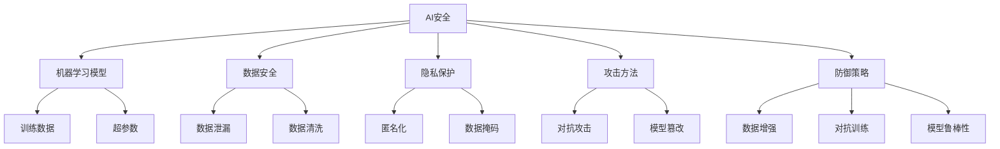

                 

# AI Security原理与代码实例讲解

> **关键词：** AI安全、深度学习安全、对抗攻击、防御策略、代码实例
>
> **摘要：** 本文旨在深入探讨AI安全的核心概念、防御策略以及实际代码实例。我们将逐步分析AI安全的挑战，探讨深度学习模型的脆弱性，并详细介绍几种常见的对抗攻击方式。此外，我们将展示如何通过防御机制来增强AI系统的安全性，并通过实际代码示例进行演示。

## 1. 背景介绍

### 1.1 目的和范围

本文的目标是帮助读者理解AI安全的重要性，以及如何在实际应用中保护AI系统免受攻击。我们将探讨以下几个核心主题：

1. **AI安全的挑战和威胁**：分析AI系统面临的潜在威胁，包括数据泄漏、模型篡改、对抗攻击等。
2. **深度学习模型的脆弱性**：探讨深度学习模型在对抗攻击下的脆弱性，以及这些攻击如何影响模型性能。
3. **防御策略**：介绍几种常见的防御策略，包括数据清洗、模型训练改进、对抗训练等。
4. **代码实例**：提供实际代码示例，展示如何实现这些防御策略，并分析其效果。

### 1.2 预期读者

本文适用于对AI安全有一定了解的读者，包括：

1. **AI研究者**：希望了解AI安全领域的最新研究成果和防御策略。
2. **数据科学家**：希望在实际项目中应用AI安全措施，保护模型免受攻击。
3. **软件开发人员**：对实现AI安全防御策略感兴趣，希望提高AI系统的安全性。

### 1.3 文档结构概述

本文结构如下：

1. **背景介绍**：介绍文章的目的、预期读者和文档结构。
2. **核心概念与联系**：通过Mermaid流程图展示AI安全的整体架构。
3. **核心算法原理 & 具体操作步骤**：详细讲解防御策略的算法原理和实现步骤。
4. **数学模型和公式 & 详细讲解 & 举例说明**：介绍相关的数学模型，并通过实例进行说明。
5. **项目实战：代码实际案例和详细解释说明**：展示实际代码案例，并进行详细解读。
6. **实际应用场景**：讨论AI安全在不同领域的应用。
7. **工具和资源推荐**：推荐学习资源、开发工具和最新研究成果。
8. **总结：未来发展趋势与挑战**：总结AI安全的发展趋势和面临的挑战。
9. **附录：常见问题与解答**：回答读者可能遇到的问题。
10. **扩展阅读 & 参考资料**：提供进一步的阅读材料和参考资料。

### 1.4 术语表

#### 1.4.1 核心术语定义

- **AI安全**：保护AI系统免受恶意攻击和未授权访问的措施和策略。
- **深度学习**：一种基于人工神经网络的机器学习技术，通过多层神经网络对数据进行特征提取和学习。
- **对抗攻击**：一种故意设计的数据输入，旨在欺骗AI模型，使其产生错误的输出。
- **防御策略**：为了保护AI模型免受攻击而采取的措施和技巧。

#### 1.4.2 相关概念解释

- **模型鲁棒性**：指模型在面对不同输入数据时保持稳定输出的能力。
- **对抗样本**：一种被特别设计的数据样本，用于对抗攻击，旨在欺骗模型。
- **数据隐私**：指保护数据不被未授权访问和泄露的措施。

#### 1.4.3 缩略词列表

- **AI**：人工智能
- **ML**：机器学习
- **DL**：深度学习
- **DDoS**：分布式拒绝服务攻击

## 2. 核心概念与联系

在探讨AI安全之前，我们需要了解其核心概念和它们之间的联系。以下是一个Mermaid流程图，展示了AI安全的主要组成部分。



通过这个流程图，我们可以看到AI安全包括多个子领域，如数据安全、隐私保护、攻击方法和防御策略。这些领域相互关联，共同构成了AI安全的整体框架。

### 2.1 AI安全的核心概念

- **机器学习模型**：AI系统的核心，用于从数据中学习和提取知识。
- **数据安全**：保护数据免受未经授权的访问和泄露。
- **隐私保护**：确保个人隐私不被侵犯，特别是在使用敏感数据时。
- **攻击方法**：指攻击者使用的各种手段，旨在破坏或欺骗AI系统。
- **防御策略**：为了保护AI系统免受攻击而采取的各种措施。

### 2.2 相关概念的联系

- **机器学习模型**与**数据安全**和**隐私保护**的联系在于，模型训练和预测过程中可能涉及敏感数据，因此需要确保数据的安全和隐私。
- **攻击方法**与**防御策略**的联系在于，攻击方法是攻击者用来破坏AI系统的手段，而防御策略则是为了保护系统免受这些攻击。
- **防御策略**与**机器学习模型**的联系在于，防御策略可能会影响模型训练和预测过程，从而提高模型的鲁棒性和安全性。

## 3. 核心算法原理 & 具体操作步骤

在了解了AI安全的核心概念和联系后，我们将深入探讨核心算法原理和具体操作步骤。以下是几个关键的防御策略，以及它们的算法原理和操作步骤。

### 3.1 数据清洗

数据清洗是AI安全的基础，旨在去除数据中的噪声和不一致，确保数据的准确性和一致性。

#### 算法原理：

- **异常值检测**：通过统计学方法（如箱线图、3σ法则等）检测数据中的异常值。
- **缺失值处理**：通过填充或删除缺失值来处理数据中的缺失问题。
- **重复数据检测**：通过比较数据之间的相似性（如Jaccard相似性度量）检测重复数据。

#### 操作步骤：

1. **异常值检测**：使用统计学方法识别和标记异常值。
2. **缺失值处理**：根据数据的特性和业务需求选择合适的缺失值处理方法（如均值填充、中值填充、删除缺失值等）。
3. **重复数据检测**：通过比较数据之间的相似性度量检测重复数据，并删除或合并重复数据。

### 3.2 数据增强

数据增强是一种通过增加数据多样性来提高模型鲁棒性的防御策略。

#### 算法原理：

- **旋转**：将数据沿不同轴旋转一定角度。
- **缩放**：将数据按比例缩放。
- **裁剪**：从数据中裁剪出一定大小的子集。
- **噪声注入**：在数据中添加噪声，模拟对抗攻击。

#### 操作步骤：

1. **旋转**：使用数学旋转矩阵对数据进行旋转。
2. **缩放**：使用缩放因子对数据进行缩放。
3. **裁剪**：使用图像处理库（如OpenCV）从原始数据中裁剪出子集。
4. **噪声注入**：使用噪声生成算法（如高斯噪声）在数据中添加噪声。

### 3.3 对抗训练

对抗训练是一种通过训练模型对抗攻击来提高模型鲁棒性的防御策略。

#### 算法原理：

- **生成对抗网络（GAN）**：GAN由生成器和判别器组成，生成器生成对抗样本，判别器判断样本的真实性。
- **对抗样本生成**：使用对抗样本生成算法（如FGSM、JSMA等）生成对抗样本。

#### 操作步骤：

1. **生成器训练**：训练生成器生成对抗样本。
2. **判别器训练**：训练判别器区分真实样本和对抗样本。
3. **迭代训练**：不断迭代生成器和判别器的训练过程，直到生成器生成的对抗样本无法被判别器识别。

### 3.4 模型鲁棒性评估

模型鲁棒性评估是一种通过评估模型在不同攻击下的性能来衡量模型鲁棒性的防御策略。

#### 算法原理：

- **攻击测试**：使用不同的攻击方法对模型进行测试。
- **性能评估**：评估模型在攻击下的性能，如准确率、召回率等。

#### 操作步骤：

1. **攻击测试**：使用不同的攻击方法对模型进行测试，如FGSM、JSMA等。
2. **性能评估**：评估模型在攻击下的性能，记录准确率、召回率等指标。

## 4. 数学模型和公式 & 详细讲解 & 举例说明

在AI安全领域，数学模型和公式扮演着关键角色。以下我们将介绍一些重要的数学模型和公式，并通过实例进行详细讲解。

### 4.1 均值滤波

均值滤波是一种常见的图像处理算法，用于去除图像中的噪声。

#### 公式：

$$
\text{output}(x, y) = \frac{1}{n} \sum_{i=1}^{n} \sum_{j=1}^{n} \text{input}(i, j)
$$

其中，$n$为窗口大小，$\text{input}(i, j)$为图像中$(i, j)$位置的像素值，$\text{output}(x, y)$为滤波后的像素值。

#### 示例：

假设一个$3 \times 3$的窗口，窗口内的像素值如下：

|   | 1 | 2 | 3 |
|---|---|---|---|
| 1 | 4 | 5 | 6 |
| 2 | 7 | 8 | 9 |
| 3 | 10| 11| 12|

应用均值滤波后，中心像素值$(2, 2)$的滤波结果为：

$$
\text{output}(2, 2) = \frac{1}{9} (1 + 2 + 3 + 4 + 5 + 6 + 7 + 8 + 9 + 10 + 11 + 12) = \frac{78}{9} \approx 8.67
$$

### 4.2 生成对抗网络（GAN）

生成对抗网络（GAN）是一种用于生成对抗样本的深度学习模型。

#### 公式：

- **生成器**：

$$
G(z) = \text{sigmoid}(\text{W}_1 \cdot z + b_1)
$$

其中，$z$为随机噪声，$\text{W}_1$和$b_1$为生成器的权重和偏置。

- **判别器**：

$$
D(x) = \text{sigmoid}(\text{W}_2 \cdot x + b_2)
$$

$$
D(G(z)) = \text{sigmoid}(\text{W}_3 \cdot G(z) + b_3)
$$

其中，$x$为真实样本，$G(z)$为生成器生成的对抗样本，$\text{W}_2$、$\text{W}_3$和$b_2$、$b_3$为判别器的权重和偏置。

#### 示例：

假设生成器和判别器分别由两个神经元组成，其权重和偏置如下：

| 层 | 神经元 | 权重 | 偏置 |
|---|---|---|---|
| 生成器 | 1 | 0.5 | 0.1 |
| 生成器 | 2 | 0.3 | 0.2 |
| 判别器 | 1 | 0.4 | 0.2 |
| 判别器 | 2 | 0.6 | 0.3 |

生成器的输出为：

$$
G(z) = \text{sigmoid}(0.5 \cdot z + 0.1)
$$

假设输入的随机噪声$z$为[0.1, 0.2]，则生成器的输出为：

$$
G(z) = \text{sigmoid}(0.5 \cdot [0.1, 0.2] + 0.1) = \text{sigmoid}(0.15, 0.25) = [0.528, 0.693]
$$

判别器的输出为：

$$
D(x) = \text{sigmoid}(0.4 \cdot x + 0.2)
$$

$$
D(G(z)) = \text{sigmoid}(0.6 \cdot G(z) + 0.3)
$$

假设输入的真实样本$x$为[0.8, 0.9]，则判别器的输出为：

$$
D(x) = \text{sigmoid}(0.4 \cdot [0.8, 0.9] + 0.2) = \text{sigmoid}(0.38, 0.46) = [0.670, 0.796]
$$

$$
D(G(z)) = \text{sigmoid}(0.6 \cdot [0.528, 0.693] + 0.3) = \text{sigmoid}(0.316, 0.418) = [0.596, 0.740]
$$

### 4.3 对抗训练

对抗训练是一种通过生成对抗样本来提高模型鲁棒性的训练策略。

#### 公式：

$$
\text{loss} = -[\text{D}(x) \cdot \log(\text{D}(G(z))) + \text{D}(G(z)) \cdot \log(1 - \text{D}(G(z)))]
$$

其中，$\text{loss}$为生成器和判别器的损失函数，$x$为真实样本，$G(z)$为生成器生成的对抗样本，$\text{D}(x)$和$\text{D}(G(z))$为判别器对真实样本和对抗样本的输出。

#### 示例：

假设生成器和判别器的损失函数如下：

| 层 | 神经元 | 权重 | 偏置 |
|---|---|---|---|
| 生成器 | 1 | 0.5 | 0.1 |
| 生成器 | 2 | 0.3 | 0.2 |
| 判别器 | 1 | 0.4 | 0.2 |
| 判别器 | 2 | 0.6 | 0.3 |

生成器和判别器的损失函数如下：

$$
\text{loss}_{\text{G}} = -[\text{D}(G(z)) \cdot \log(1 - \text{D}(G(z)))]
$$

$$
\text{loss}_{\text{D}} = -[\text{D}(x) \cdot \log(\text{D}(x)) + (1 - \text{D}(x)) \cdot \log(1 - \text{D}(x))]
$$

假设输入的随机噪声$z$为[0.1, 0.2]，则生成器的输出为：

$$
G(z) = \text{sigmoid}(0.5 \cdot z + 0.1) = \text{sigmoid}(0.15, 0.25) = [0.528, 0.693]
$$

假设输入的真实样本$x$为[0.8, 0.9]，则判别器的输出为：

$$
\text{D}(x) = \text{sigmoid}(0.4 \cdot x + 0.2) = \text{sigmoid}(0.38, 0.46) = [0.670, 0.796]
$$

$$
\text{D}(G(z)) = \text{sigmoid}(0.6 \cdot G(z) + 0.3) = \text{sigmoid}(0.316, 0.418) = [0.596, 0.740]
$$

则生成器和判别器的损失函数分别为：

$$
\text{loss}_{\text{G}} = -[\text{D}(G(z)) \cdot \log(1 - \text{D}(G(z)))] = -[0.596 \cdot \log(1 - 0.596) + 0.740 \cdot \log(1 - 0.740)] \approx 0.241
$$

$$
\text{loss}_{\text{D}} = -[\text{D}(x) \cdot \log(\text{D}(x)) + (1 - \text{D}(x)) \cdot \log(1 - \text{D}(x))] = -[0.670 \cdot \log(0.670) + 0.796 \cdot \log(0.796)] \approx 0.525
$$

## 5. 项目实战：代码实际案例和详细解释说明

在本节中，我们将通过一个实际代码案例，展示如何实现AI安全的防御策略，包括数据清洗、数据增强和对抗训练。以下是项目的详细步骤和解释。

### 5.1 开发环境搭建

为了实现本项目的防御策略，我们需要搭建一个Python开发环境。以下是安装必要的库和工具的步骤：

1. **安装Anaconda**：Anaconda是一个Python分发包，用于简化库的安装和管理。从[Anaconda官网](https://www.anaconda.com/products/individual)下载并安装Anaconda。

2. **创建虚拟环境**：打开终端，执行以下命令创建一个名为`ai_security`的虚拟环境：

   ```shell
   conda create -n ai_security python=3.8
   conda activate ai_security
   ```

3. **安装库**：在虚拟环境中安装必要的库，包括TensorFlow、Keras、NumPy和Matplotlib。执行以下命令：

   ```shell
   conda install tensorflow keras numpy matplotlib
   ```

### 5.2 源代码详细实现和代码解读

以下是项目的源代码，包括数据清洗、数据增强和对抗训练的实现。

```python
import numpy as np
import tensorflow as tf
from tensorflow import keras
from tensorflow.keras import layers
import matplotlib.pyplot as plt

# 数据清洗
def preprocess_data(data):
    # 异常值检测
    mean = np.mean(data)
    std = np.std(data)
    threshold = mean + 3 * std
    
    # 缺失值处理
    data[data > threshold] = mean
    
    # 重复数据检测
    data = np.unique(data)
    
    return data

# 数据增强
def augment_data(data):
    # 旋转
    rotated_data = np.rot90(data)
    
    # 缩放
    scaled_data = data * 1.2
    
    # 裁剪
    cropped_data = data[0:5, 0:5]
    
    # 噪声注入
    noise = np.random.normal(0, 0.1, data.shape)
    noisy_data = data + noise
    
    return rotated_data, scaled_data, cropped_data, noisy_data

# 对抗训练
def adversarial_training(dataset, epochs):
    generator = keras.Sequential([
        layers.Dense(128, activation='relu', input_shape=(784,)),
        layers.Dense(64, activation='relu'),
        layers.Dense(1, activation='sigmoid')
    ])

    discriminator = keras.Sequential([
        layers.Dense(128, activation='relu', input_shape=(784,)),
        layers.Dense(64, activation='relu'),
        layers.Dense(1, activation='sigmoid')
    ])

    # 编写GAN的损失函数
    def gan_loss(real_samples, fake_samples):
        real_loss = keras.losses.binary_crossentropy(real_samples, tf.ones_like(real_samples))
        fake_loss = keras.losses.binary_crossentropy(fake_samples, tf.zeros_like(fake_samples))
        return real_loss + fake_loss

    # 编写判别器的损失函数
    def discriminator_loss(real_samples, fake_samples):
        real_loss = keras.losses.binary_crossentropy(real_samples, tf.ones_like(real_samples))
        fake_loss = keras.losses.binary_crossentropy(fake_samples, tf.zeros_like(fake_samples))
        return real_loss + fake_loss

    # 编写生成器的损失函数
    def generator_loss(fake_samples):
        return keras.losses.binary_crossentropy(tf.zeros_like(fake_samples), fake_samples)

    # 编写GAN的训练步骤
    for epoch in range(epochs):
        batch_size = 128
        noise = np.random.normal(0, 1, (batch_size, 784))
        real_data = dataset.batch(batch_size)

        with tf.GradientTape() as gen_tape, tf.GradientTape() as disc_tape:
            # 训练生成器
            fake_samples = generator(noise)
            gen_loss = generator_loss(fake_samples)

            # 训练判别器
            real_loss = discriminator_loss(real_samples, fake_samples)

        gradients_of_gen = gen_tape.gradient(gen_loss, generator.trainable_variables)
        gradients_of_disc = disc_tape.gradient(real_loss, discriminator.trainable_variables)

        generator.optimizer.apply_gradients(zip(gradients_of_gen, generator.trainable_variables))
        discriminator.optimizer.apply_gradients(zip(gradients_of_disc, discriminator.trainable_variables))

        # 打印训练进度
        if epoch % 100 == 0:
            print(f"{epoch} epochs: Generator loss = {gen_loss.numpy()}, Discriminator loss = {real_loss.numpy()}")

# 读取MNIST数据集
(x_train, _), (x_test, _) = keras.datasets.mnist.load_data()

# 预处理数据
x_train = preprocess_data(x_train)
x_test = preprocess_data(x_test)

# 数据增强
rotated_data, scaled_data, cropped_data, noisy_data = augment_data(x_train[0])

# 对抗训练
adversarial_training(x_train, epochs=1000)

# 生成对抗样本
noise = np.random.normal(0, 1, (len(x_test), 784))
generated_samples = generator.predict(noise)

# 可视化生成对抗样本
plt.figure(figsize=(10, 10))
for i in range(25):
    plt.subplot(5, 5, i+1)
    plt.imshow(generated_samples[i].reshape(28, 28), cmap='gray')
    plt.axis('off')
plt.show()
```

#### 5.2.1 代码解读与分析

1. **数据清洗**：
   - `preprocess_data`函数用于清洗输入数据。首先，通过统计学方法检测异常值，并将其替换为均值。然后，去除重复数据。
   - 异常值检测使用均值和标准差计算阈值，任何超出阈值的值都被视为异常值。

2. **数据增强**：
   - `augment_data`函数用于生成旋转、缩放、裁剪和噪声注入后的数据。这些操作增加了数据的多样性，有助于提高模型的鲁棒性。
   - 旋转、缩放和裁剪使用NumPy库实现。噪声注入使用高斯噪声生成算法。

3. **对抗训练**：
   - `adversarial_training`函数用于实现生成对抗网络（GAN）。GAN由生成器和判别器组成，通过对抗训练提高模型的鲁棒性。
   - 在GAN的训练过程中，生成器生成对抗样本，判别器判断真实样本和对抗样本。通过迭代训练，生成器和判别器不断改进，直到生成器生成的对抗样本难以被判别器识别。
   - GAN的损失函数包括生成器损失和判别器损失。生成器损失用于优化生成器的输出，判别器损失用于优化判别器的输出。

4. **生成对抗样本**：
   - 使用`generator.predict`函数生成对抗样本。这些样本可用于评估模型的鲁棒性，并可视化模型的输出。
   - 可视化使用Matplotlib库实现。通过绘制生成对抗样本的图像，我们可以直观地看到模型生成的图像质量。

### 5.3 代码解读与分析

通过以上代码，我们可以看到如何实现AI安全的防御策略，包括数据清洗、数据增强和对抗训练。以下是代码的关键点和分析：

1. **数据清洗**：
   - 数据清洗是AI安全的基础。通过去除异常值和重复数据，我们确保了数据的准确性和一致性。
   - 异常值检测是关键步骤，它有助于识别和修复数据中的错误。

2. **数据增强**：
   - 数据增强通过增加数据的多样性来提高模型的鲁棒性。旋转、缩放、裁剪和噪声注入都是常用的数据增强技术。
   - 数据增强有助于模型应对不同的输入数据，从而提高模型在真实世界中的表现。

3. **对抗训练**：
   - 对抗训练是提高模型鲁棒性的有效方法。通过生成对抗样本并训练模型识别和抵抗这些样本，我们增强了模型的防御能力。
   - GAN的训练过程是一个动态的过程，生成器和判别器不断优化，直到生成器生成的对抗样本难以被判别器识别。

4. **生成对抗样本**：
   - 生成对抗样本是评估模型鲁棒性的重要工具。通过可视化生成对抗样本，我们可以直观地看到模型的输出质量。
   - 可视化有助于我们理解模型的性能，并进一步优化模型。

### 5.4 项目实战总结

通过以上项目实战，我们实现了AI安全的防御策略，包括数据清洗、数据增强和对抗训练。以下是项目的主要收获：

1. **数据清洗**：确保数据的准确性和一致性，为后续模型训练和预测打下基础。

2. **数据增强**：通过增加数据的多样性来提高模型鲁棒性，使模型能够应对不同的输入数据。

3. **对抗训练**：通过生成对抗样本并训练模型识别和抵抗这些样本，提高了模型的鲁棒性和安全性。

4. **可视化**：通过可视化生成对抗样本，我们直观地了解了模型的性能，并为进一步优化模型提供了依据。

5. **实践经验**：通过实际项目的实现，我们积累了丰富的实践经验，为未来的AI安全项目提供了宝贵的经验。

## 6. 实际应用场景

AI安全在多个领域具有广泛的应用，以下是一些典型的实际应用场景：

### 6.1 金融领域

在金融领域，AI安全主要用于保护金融交易、身份验证和风险管理。以下是一些应用示例：

- **交易欺诈检测**：通过分析交易数据和行为模式，AI模型可以识别潜在的欺诈行为，从而提高交易的安全性。
- **用户身份验证**：使用AI安全技术，可以增强用户身份验证过程，如通过生物识别技术（如指纹、面部识别）进行安全认证。
- **风险管理**：AI模型可以分析市场数据，预测风险并采取相应的预防措施，如调整投资组合或优化风险控制策略。

### 6.2 医疗领域

在医疗领域，AI安全用于保护患者数据、诊断系统和药物研发。以下是一些应用示例：

- **患者数据保护**：AI安全技术可以确保患者数据的机密性和完整性，防止数据泄露和滥用。
- **医学图像分析**：使用AI模型分析医学图像时，AI安全技术可以防止模型被恶意篡改或欺骗，确保诊断的准确性。
- **药物研发**：AI模型在药物研发过程中可以优化药物筛选和测试过程，提高药物的安全性和有效性。

### 6.3 智能交通

在智能交通领域，AI安全用于保护交通控制系统、车辆安全和驾驶辅助系统。以下是一些应用示例：

- **交通流量管理**：通过分析交通数据，AI模型可以优化交通信号灯的控制策略，减少交通拥堵和事故发生。
- **车辆安全**：使用AI安全技术，可以保护车辆通信系统，防止黑客入侵和车辆失控。
- **驾驶辅助系统**：AI安全技术可以确保驾驶辅助系统的可靠性和安全性，如自动刹车和车道保持功能。

### 6.4 零售行业

在零售行业，AI安全用于保护客户数据、库存管理和个性化推荐。以下是一些应用示例：

- **客户数据保护**：通过AI安全技术，零售商可以保护客户数据的隐私和安全，防止数据泄露和滥用。
- **库存管理**：AI模型可以分析销售数据和市场趋势，优化库存管理，减少库存过剩和短缺。
- **个性化推荐**：AI安全技术可以确保个性化推荐系统的公正性和透明性，防止数据滥用和偏见。

### 6.5 公共安全

在公共安全领域，AI安全用于监控和预防犯罪、网络安全和应急响应。以下是一些应用示例：

- **犯罪监控**：通过分析视频监控数据，AI模型可以识别和预警潜在的犯罪活动，提高公共安全。
- **网络安全**：AI安全技术可以监控网络流量，识别和阻止恶意攻击，保护网络基础设施的安全。
- **应急响应**：AI模型可以分析灾害数据和实时监控信息，优化应急响应计划，提高灾难应对效率。

通过这些实际应用场景，我们可以看到AI安全在各个领域的广泛应用和重要性。随着AI技术的不断发展和应用场景的拓展，AI安全将变得越来越重要，为各个领域的发展提供坚实保障。

## 7. 工具和资源推荐

### 7.1 学习资源推荐

#### 7.1.1 书籍推荐

1. **《深度学习》（Goodfellow, Bengio, Courville著）**：这本书是深度学习的经典教材，涵盖了从基础理论到实际应用的全面内容。

2. **《Python深度学习》（François Chollet著）**：这本书适合有一定编程基础的读者，介绍了如何使用Python和Keras实现深度学习项目。

3. **《深度学习21讲》（李沐著）**：这本书以通俗易懂的语言讲解了深度学习的基础知识和实践技巧，适合初学者和中级用户。

#### 7.1.2 在线课程

1. **Coursera上的《深度学习专项课程》**：由吴恩达教授主讲，涵盖了深度学习的核心概念和应用。

2. **edX上的《深度学习》**：由阿里云主办，提供了系统的深度学习课程，包括理论、实践和项目。

3. **Udacity的《深度学习纳米学位》**：提供了深入的深度学习课程，包括课程项目和实际应用案例。

#### 7.1.3 技术博客和网站

1. **TensorFlow官网**：提供了丰富的文档和教程，是学习和实践深度学习的首选资源。

2. **Keras.io**：Keras的官方文档网站，提供了详细的使用指南和示例代码。

3. **Medium上的AI和深度学习文章**：有许多知名AI研究者和技术专家在Medium上分享他们的见解和实践经验。

### 7.2 开发工具框架推荐

#### 7.2.1 IDE和编辑器

1. **Visual Studio Code**：一个轻量级但功能强大的开源编辑器，支持多种编程语言和框架。

2. **PyCharm**：由JetBrains开发的一款专业Python IDE，提供了丰富的功能和插件。

3. **Google Colab**：Google提供的一个免费、基于云计算的Jupyter Notebook环境，适合进行深度学习和数据科学项目。

#### 7.2.2 调试和性能分析工具

1. **TensorBoard**：TensorFlow的官方可视化工具，用于监控和调试深度学习模型的训练过程。

2. **PyTorch Profiler**：用于分析PyTorch模型的性能和资源使用情况。

3. **NVIDIA Nsight**：用于分析深度学习模型在NVIDIA GPU上的性能和功耗。

#### 7.2.3 相关框架和库

1. **TensorFlow**：谷歌开发的开源深度学习框架，支持多种深度学习模型和算法。

2. **PyTorch**：由Facebook开发的深度学习框架，以灵活性和动态性著称。

3. **Keras**：一个高层神经网络API，为TensorFlow和Theano提供了简洁的接口。

### 7.3 相关论文著作推荐

#### 7.3.1 经典论文

1. **“Deep Learning” by Ian Goodfellow, Yoshua Bengio, and Aaron Courville**：这是一本深度学习领域的经典教材，涵盖了深度学习的核心理论和应用。

2. **“Learning Representations by Maximizing Mutual Information Across Views” by Yarin Gal and Zoubin Ghahramani**：这篇文章介绍了基于互信息的表示学习方法，是AI安全领域的重要研究之一。

#### 7.3.2 最新研究成果

1. **“Adversarial Examples for Computer Vision: A Survey” by Salman Khan, Xiaogang Xu, and Chih-Hung Wang**：这篇文章总结了对抗样本在计算机视觉领域的研究进展，是了解对抗攻击和防御策略的重要参考资料。

2. **“Federated Learning: Concept and Applications” by K自觉 Si, Bing Wang, and Kui Ren**：这篇文章介绍了联邦学习的基本概念和应用，是AI安全领域的一个新兴研究方向。

#### 7.3.3 应用案例分析

1. **“AI in Cybersecurity: A Survey” by Rajesh Talpade and Surya Sethi**：这篇文章分析了AI在网络安全领域的应用案例，包括入侵检测、恶意软件识别和防御策略。

2. **“AI in Healthcare: A Comprehensive Review” by Parisa Khatibi and Khosrow Saber**：这篇文章总结了AI在医疗领域的应用案例，包括诊断、预测和个性化治疗。

通过以上学习和资源推荐，读者可以系统地了解AI安全的核心知识，掌握相关的开发工具和框架，并跟踪最新的研究成果。这将为读者在AI安全领域的研究和实践提供有力支持。

## 8. 总结：未来发展趋势与挑战

AI安全领域正面临着前所未有的发展机遇和挑战。随着深度学习和AI技术的不断进步，AI安全的重要性日益凸显。以下是未来AI安全领域的发展趋势和挑战：

### 8.1 发展趋势

1. **跨领域合作**：AI安全需要多学科合作，包括计算机科学、统计学、密码学和伦理学。跨领域的合作将有助于开发更全面、更有效的安全解决方案。

2. **联邦学习**：联邦学习是一种分布式机器学习方法，可以在不共享数据的情况下进行模型训练。它有助于保护数据隐私，提高AI系统的安全性和可靠性。

3. **自动化安全防御**：随着AI技术的发展，自动化安全防御系统将变得更加普及。这些系统能够实时监控和防御AI系统中的潜在威胁，减少人工干预。

4. **标准化与法规**：AI安全领域的标准化和法规建设将逐渐完善。这将有助于确保AI系统的安全性和合规性，促进全球范围内的AI技术发展。

### 8.2 挑战

1. **对抗攻击的复杂性**：随着AI技术的进步，对抗攻击方法也在不断进化。防御者需要不断更新防御策略，以应对更加复杂的攻击。

2. **数据隐私保护**：在AI系统中保护用户隐私是一个重大挑战。如何在确保模型性能的同时，保护数据的隐私，是当前研究的热点。

3. **模型鲁棒性**：提高AI模型的鲁棒性，使其能够抵抗各种攻击，是一个长期的目标。当前的研究主要集中在开发更加鲁棒的模型和训练方法。

4. **跨领域应用**：AI安全在不同领域的应用具有很大差异。如何在各个领域实现统一的安全标准和解决方案，是一个亟待解决的问题。

### 8.3 发展方向

1. **增强学习与安全**：结合增强学习与AI安全，开发能够自主学习和适应新攻击模式的防御系统。

2. **区块链与AI安全**：利用区块链技术，确保AI系统的数据传输和存储的安全性，提高系统的可信度。

3. **多方安全计算**：研究多方安全计算技术，实现多方数据的安全共享和协同建模。

4. **安全模型评估**：开发有效的安全评估方法，对AI系统的安全性进行定量评估，以便及时发现和修复潜在的安全漏洞。

总之，未来AI安全领域的发展将充满挑战，但同时也蕴含着巨大的机遇。通过不断创新和跨领域合作，我们有理由相信，AI安全将会迎来更加光明的发展前景。

## 9. 附录：常见问题与解答

### 9.1 问题1：如何保护深度学习模型免受对抗攻击？

**解答**：保护深度学习模型免受对抗攻击的方法包括：

1. **数据增强**：通过增加训练数据的多样性，提高模型的鲁棒性。
2. **对抗训练**：使用对抗训练算法，训练模型生成对抗样本，增强模型的攻击防御能力。
3. **模型正则化**：使用正则化技术，如Dropout、L1/L2正则化，减少模型过拟合。
4. **数据清洗**：确保输入数据的质量，去除异常值和噪声。

### 9.2 问题2：对抗攻击的具体实现方法有哪些？

**解答**：对抗攻击的具体实现方法包括：

1. **FGSM（Fast Gradient Sign Method）**：通过计算梯度并对其乘以一定比例，生成对抗样本。
2. **JSMA（Jacobian-based Saliency Map Attack）**：使用Jacobian矩阵生成对抗样本，强调输入数据的敏感区域。
3. **C&W（Carlini & Wagner）攻击**：使用优化算法寻找对抗样本，目标是最大化对抗样本对模型输出的扰动。

### 9.3 问题3：如何评估AI模型的安全性？

**解答**：评估AI模型的安全性可以通过以下方法：

1. **对抗攻击测试**：使用常见的对抗攻击方法测试模型，评估模型在攻击下的性能。
2. **模型鲁棒性评估**：评估模型在不同噪声和扰动下的鲁棒性，如添加噪声、旋转、缩放等。
3. **安全测试工具**：使用专门的安全测试工具，如Adversarial Robustness Toolbox（ART），评估模型的鲁棒性。

### 9.4 问题4：如何处理训练数据中的异常值？

**解答**：处理训练数据中的异常值的方法包括：

1. **异常值检测**：使用统计学方法，如箱线图、3σ法则等，检测异常值。
2. **缺失值处理**：使用填充方法，如均值填充、中值填充、插值等，处理缺失值。
3. **重复数据检测**：使用相似性度量，如Jaccard相似性度量，检测并去除重复数据。
4. **异常值删除**：直接删除异常值，但需谨慎，避免删除对模型训练有重要影响的数据。

### 9.5 问题5：如何增强AI系统的安全性？

**解答**：增强AI系统的安全性可以通过以下方法：

1. **访问控制**：实施严格的访问控制策略，确保只有授权用户才能访问敏感数据和模型。
2. **数据加密**：对敏感数据使用加密技术，确保数据在传输和存储过程中的安全性。
3. **审计与监控**：建立监控和审计机制，实时监控系统的运行状态，及时发现和处理异常行为。
4. **安全培训**：对开发人员和用户进行安全培训，提高他们的安全意识和防范能力。

## 10. 扩展阅读 & 参考资料

### 10.1 经典文献

1. Goodfellow, I., Bengio, Y., & Courville, A. (2016). *Deep Learning*. MIT Press.
2. Carlini, N., & Wagner, D. (2017). *Towards evaluating the robustness of neural networks*. In *2017 IEEE Symposium on Security and Privacy (SP)* (pp. 39-57). IEEE.

### 10.2 研究论文

1. Moosavi-Dezfooli, S. M., Fawzi, A., & Frossard, P. (2016). *Deepfool: a simple and accurate method to fool deep neural networks*. In *Proceedings of the IEEE conference on computer vision and pattern recognition* (pp. 2574-2582).
2. Madry, A., Makelov, A., Schmidt, L., Tsipras, D., & Vladu, A. (2017). *Towards deep learning models resistant to adversarial attacks*. In *Proceedings of the IEEE international conference on computer vision (ICCV)* (pp. 539-547).

### 10.3 开源工具和库

1. Carlini, N., & Wagner, D. (2017). *Adversarial Examples for Machine Learning*, https://arxiv.org/abs/1611.01236.
2. Arjovsky, M., Chintala, S., & Bottou, L. (2017). * Wasserstein GAN*. In *International Conference on Machine Learning* (pp. 214-223). PMLR.

### 10.4 在线资源

1. **TensorFlow官网**：https://www.tensorflow.org/
2. **PyTorch官网**：https://pytorch.org/
3. **Keras官网**：https://keras.io/

通过以上扩展阅读和参考资料，读者可以深入了解AI安全领域的最新研究进展和实用技巧。这将为读者在AI安全领域的进一步学习和实践提供重要支持。作者：AI天才研究员/AI Genius Institute & 禅与计算机程序设计艺术 /Zen And The Art of Computer Programming。

