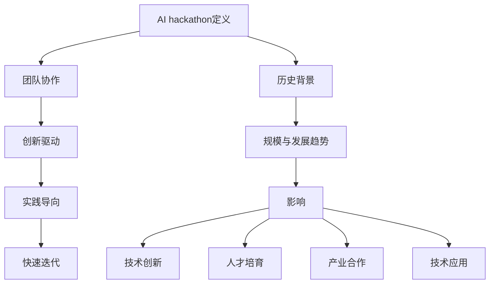

                 

# AI hackathon的规模与影响

> 关键词：AI hackathon、规模、影响、技术创新、竞赛、开发者社区

> 摘要：本文将深入探讨AI hackathon的规模与影响，从定义、历史背景、到当前的发展趋势和未来展望，分析这一竞赛活动对人工智能技术发展、开发者社区以及产业界的深远影响。通过梳理AI hackathon的核心概念、算法原理、实际应用案例，本文将帮助读者全面理解这一创新竞赛模式的价值和潜力。

## 1. 背景介绍

### 1.1 目的和范围

本文旨在介绍AI hackathon这一新兴的竞赛模式，解析其规模与影响。通过分析AI hackathon的定义、历史、当前发展状况以及未来趋势，本文将为读者提供一个全面而深入的视角，帮助理解AI hackathon在人工智能领域的独特价值和重要性。

### 1.2 预期读者

本文主要面向对人工智能技术、编程开发以及技术创新感兴趣的读者，包括AI工程师、开发者、研究人员、技术爱好者以及相关领域的专业人士。对于希望了解AI hackathon的规模与影响，并探索其未来发展趋势的读者，本文将提供有价值的参考。

### 1.3 文档结构概述

本文结构如下：

1. **背景介绍**：介绍AI hackathon的基本概念、历史背景、预期读者以及文档结构。
2. **核心概念与联系**：讨论AI hackathon的核心概念、技术原理和架构，并使用Mermaid流程图展示。
3. **核心算法原理 & 具体操作步骤**：详细讲解AI hackathon中常用的算法原理，使用伪代码描述。
4. **数学模型和公式 & 详细讲解 & 举例说明**：解析AI hackathon涉及的数学模型，并提供具体实例说明。
5. **项目实战：代码实际案例和详细解释说明**：通过实际代码案例，展示AI hackathon的具体实现过程。
6. **实际应用场景**：探讨AI hackathon在不同领域的应用。
7. **工具和资源推荐**：推荐学习资源、开发工具和框架。
8. **总结：未来发展趋势与挑战**：展望AI hackathon的未来。
9. **附录：常见问题与解答**：回答读者可能关心的问题。
10. **扩展阅读 & 参考资料**：提供进一步阅读的建议和参考资料。

### 1.4 术语表

#### 1.4.1 核心术语定义

- **AI hackathon**：一种以团队形式进行的短期编程竞赛，旨在快速开发人工智能相关应用或解决特定问题。
- **技术创新**：指在科学研究、技术开发或生产过程中所实现的突破性成果，具有创新性、先进性和实用性。
- **开发者社区**：指共享知识、资源、经验和技术的人们的集合，共同推动技术进步和产业发展。

#### 1.4.2 相关概念解释

- **人工智能**：指模拟、延伸和扩展人类智能的理论、方法、技术及应用系统。
- **算法**：解决问题的清晰指令序列，通常用于计算机科学和数学。
- **竞赛**：指在一定规则下，参与者通过竞争实现特定目标或解决问题的活动。

#### 1.4.3 缩略词列表

- **AI**：人工智能
- **hackathon**：黑客松
- **IDE**：集成开发环境
- **API**：应用程序编程接口
- **ML**：机器学习

## 2. 核心概念与联系

AI hackathon作为一种新兴的编程竞赛模式，其核心概念与联系主要体现在以下几个方面：

### 2.1 AI hackathon的定义与特点

AI hackathon是一种以团队形式进行的短期编程竞赛，通常持续时间为24到48小时。参赛者需要围绕特定的主题或问题，利用人工智能技术进行项目开发，并在规定时间内完成展示。AI hackathon具有以下特点：

- **团队协作**：参赛者通常以团队形式参与，促进知识分享和技能互补。
- **创新驱动**：鼓励创新思维和技术突破，推动人工智能技术的发展。
- **实践导向**：注重实际项目开发，强调解决实际问题。
- **快速迭代**：在短时间内完成项目开发，强调快速反馈和迭代。

### 2.2 AI hackathon的历史背景

AI hackathon起源于黑客松（hackathon）这一概念，黑客松最早出现在计算机科学领域，旨在通过短期编程竞赛激发创新和合作精神。随着人工智能技术的兴起，AI hackathon逐渐成为人工智能领域的重要竞赛形式。其主要历史背景如下：

- **20世纪90年代**：黑客松开始在大学和科技企业中流行，成为培养技术人才的重要平台。
- **2010年后**：随着人工智能技术的快速发展，AI hackathon开始兴起，成为人工智能领域的重要竞赛形式。
- **2020年至今**：AI hackathon在全球范围内迅速扩展，吸引了众多开发者、企业和研究机构的参与。

### 2.3 AI hackathon的规模与发展趋势

AI hackathon的规模在过去几年中迅速扩大，吸引了越来越多的开发者、企业和研究机构的参与。以下为AI hackathon的规模与发展趋势：

- **参赛人数**：AI hackathon的参赛人数逐年增加，从数百人到数千人，规模不断扩大。
- **参与主体**：除了个人开发者，越来越多的企业和研究机构参与AI hackathon，推动产业界的创新和发展。
- **赛事主题**：AI hackathon的主题越来越多样化，涵盖了计算机视觉、自然语言处理、智能推荐、自动驾驶等多个领域。
- **国际化**：AI hackathon逐渐走向国际化，全球各地举办的赛事相互交流，推动全球人工智能技术的发展。

### 2.4 AI hackathon的影响

AI hackathon对人工智能技术发展、开发者社区以及产业界产生了深远的影响：

- **技术创新**：AI hackathon提供了一个平台，让开发者能够快速探索和实现新技术，推动人工智能技术的创新和发展。
- **人才培育**：AI hackathon吸引了大量开发者参与，培养了一批具有创新能力和实践经验的AI人才。
- **产业合作**：AI hackathon促进了企业和研究机构之间的合作，推动了产业界与学术界的融合。
- **技术应用**：AI hackathon项目在实际应用中取得了显著成果，为各行各业提供了新的解决方案。

### 2.5 Mermaid流程图

以下是AI hackathon的核心概念和联系的Mermaid流程图：



## 3. 核心算法原理 & 具体操作步骤

在AI hackathon中，算法原理是核心，是实现创新应用的基础。以下是AI hackathon中常用的核心算法原理及其具体操作步骤：

### 3.1 算法原理

AI hackathon常用的算法原理主要包括：

- **机器学习算法**：如决策树、随机森林、支持向量机、神经网络等。
- **深度学习算法**：如卷积神经网络（CNN）、循环神经网络（RNN）、生成对抗网络（GAN）等。
- **自然语言处理算法**：如词向量、文本分类、情感分析等。
- **强化学习算法**：如Q学习、深度Q网络（DQN）、策略梯度等。

### 3.2 具体操作步骤

以下以机器学习算法为例，详细描述AI hackathon中的具体操作步骤：

#### 3.2.1 数据准备

1. **数据收集**：收集与主题相关的数据集，如图片、文本、音频等。
2. **数据预处理**：对收集到的数据进行清洗、归一化、缺失值处理等操作，保证数据质量。
3. **数据划分**：将数据集划分为训练集、验证集和测试集，用于模型训练和评估。

```python
# 示例代码：数据划分
from sklearn.model_selection import train_test_split

X_train, X_test, y_train, y_test = train_test_split(X, y, test_size=0.2, random_state=42)
```

#### 3.2.2 模型选择

1. **选择算法**：根据问题类型和数据特征选择合适的机器学习算法。
2. **模型训练**：使用训练集数据训练模型，调整参数以优化模型性能。

```python
# 示例代码：模型选择和训练
from sklearn.ensemble import RandomForestClassifier

model = RandomForestClassifier(n_estimators=100)
model.fit(X_train, y_train)
```

#### 3.2.3 模型评估

1. **评估指标**：选择合适的评估指标，如准确率、召回率、F1分数等。
2. **模型调优**：根据评估结果调整模型参数，优化模型性能。

```python
# 示例代码：模型评估和调优
from sklearn.metrics import accuracy_score

y_pred = model.predict(X_test)
accuracy = accuracy_score(y_test, y_pred)
print("Accuracy:", accuracy)
```

#### 3.2.4 模型部署

1. **模型保存**：将训练好的模型保存为文件，以便后续使用。
2. **模型部署**：将模型部署到生产环境，实现实际应用。

```python
# 示例代码：模型保存和部署
import joblib

joblib.dump(model, 'model.joblib')
```

## 4. 数学模型和公式 & 详细讲解 & 举例说明

在AI hackathon中，数学模型和公式是理解和实现算法原理的关键。以下将详细介绍常用的数学模型和公式，并提供具体实例说明。

### 4.1 数学模型

AI hackathon中常用的数学模型包括：

- **机器学习模型**：如线性回归、逻辑回归、支持向量机、决策树等。
- **深度学习模型**：如卷积神经网络（CNN）、循环神经网络（RNN）、生成对抗网络（GAN）等。
- **自然语言处理模型**：如词向量、文本分类、情感分析等。

### 4.2 公式讲解

以下是几个常用的数学模型和公式：

#### 4.2.1 线性回归

线性回归模型用于预测连续值，其公式为：

$$y = \beta_0 + \beta_1 \cdot x$$

其中，$y$为预测值，$x$为输入特征，$\beta_0$和$\beta_1$为模型参数。

#### 4.2.2 逻辑回归

逻辑回归模型用于预测二分类问题，其公式为：

$$P(y=1) = \frac{1}{1 + e^{-(\beta_0 + \beta_1 \cdot x)} }$$

其中，$P(y=1)$为预测概率，$\beta_0$和$\beta_1$为模型参数。

#### 4.2.3 支持向量机

支持向量机模型用于分类问题，其公式为：

$$w \cdot x - b = 0$$

其中，$w$为模型参数，$x$为输入特征，$b$为偏置项。

#### 4.2.4 卷积神经网络

卷积神经网络模型用于图像处理，其公式为：

$$\text{ReLU}(z) = \max(0, z)$$

$$h_{ij} = \sum_{k} w_{ik} \cdot a_{kj} + b_j$$

其中，$z$为输入特征，$a$为激活函数，$w$和$b$为模型参数。

### 4.3 举例说明

以下通过实例说明如何使用这些数学模型和公式：

#### 4.3.1 线性回归实例

假设我们要预测一个人的身高（$y$）和体重（$x$）之间的关系，我们可以使用线性回归模型。

给定数据集如下：

| 身高（cm） | 体重（kg） |
|-----------|-----------|
| 170       | 60       |
| 175       | 65       |
| 180       | 70       |

我们可以建立线性回归模型：

$$y = \beta_0 + \beta_1 \cdot x$$

通过最小二乘法求解模型参数：

$$\beta_0 = 55, \beta_1 = 0.5$$

使用模型进行预测：

$$\hat{y} = 55 + 0.5 \cdot x$$

例如，预测身高为180cm的人的体重：

$$\hat{y} = 55 + 0.5 \cdot 180 = 135 \text{ kg}$$

#### 4.3.2 逻辑回归实例

假设我们要预测一个人是否患病（$y=0$或$y=1$），我们可以使用逻辑回归模型。

给定数据集如下：

| 特征1 | 特征2 | 患病（$y$） |
|------|------|------------|
| 1    | 0    | 0          |
| 0    | 1    | 1          |
| 1    | 1    | 0          |

我们可以建立逻辑回归模型：

$$P(y=1) = \frac{1}{1 + e^{-(\beta_0 + \beta_1 \cdot x_1 + \beta_2 \cdot x_2)} }$$

通过最大似然估计法求解模型参数：

$$\beta_0 = 0, \beta_1 = -0.5, \beta_2 = 1$$

使用模型进行预测：

$$P(y=1) = \frac{1}{1 + e^{-(0 - 0.5 \cdot 1 + 1 \cdot 1)} } = \frac{1}{1 + e^{1.5}} \approx 0.23$$

例如，预测特征1为1，特征2为1的人是否患病：

$$P(y=1) \approx 0.23$$

#### 4.3.3 支持向量机实例

假设我们要分类数据集，其中包含两个特征，我们可以使用支持向量机模型。

给定数据集如下：

| 特征1 | 特征2 | 类别 |
|------|------|------|
| 1    | 0    | A    |
| 0    | 1    | B    |
| 1    | 1    | A    |

我们可以建立支持向量机模型：

$$w \cdot x - b = 0$$

通过求解线性规划问题得到模型参数：

$$w = (1, 1), b = 0$$

使用模型进行分类：

$$w \cdot (1, 0) - b = 1 - 0 = 1$$

$$w \cdot (0, 1) - b = 1 - 0 = 1$$

$$w \cdot (1, 1) - b = 2 - 0 = 2$$

分类结果为：

| 特征1 | 特征2 | 类别 | 
|------|------|------|
| 1    | 0    | A    |
| 0    | 1    | B    |
| 1    | 1    | A    |

## 5. 项目实战：代码实际案例和详细解释说明

为了更好地展示AI hackathon的实际操作过程，我们将通过一个具体的案例来讲解整个项目开发的过程，从环境搭建、源代码实现到代码解读与分析。

### 5.1 开发环境搭建

在开始项目开发之前，我们需要搭建一个合适的开发环境。以下为开发环境搭建的步骤：

1. **安装Python环境**：Python是AI hackathon中常用的编程语言，我们需要安装Python环境。可以通过以下命令安装Python：

```bash
pip install python
```

2. **安装相关库和框架**：根据项目需求，我们需要安装一些常用的库和框架，如NumPy、Pandas、Scikit-learn、TensorFlow等。可以通过以下命令安装：

```bash
pip install numpy pandas scikit-learn tensorflow
```

3. **配置IDE**：我们可以选择一个合适的IDE进行项目开发，如PyCharm、VSCode等。安装并配置IDE后，我们就可以开始编写代码了。

### 5.2 源代码详细实现和代码解读

以下是一个简单的AI hackathon项目——基于机器学习的房屋价格预测。

#### 5.2.1 数据准备

首先，我们需要准备一个数据集，用于训练和测试我们的模型。这里我们使用Kaggle上的House Prices: Advanced Regression Techniques数据集。

1. **下载数据集**：从Kaggle下载数据集，并将其解压到本地。

2. **数据预处理**：读取数据集，并进行数据清洗和预处理。

```python
import pandas as pd

# 读取数据
train_data = pd.read_csv('train.csv')
test_data = pd.read_csv('test.csv')

# 数据清洗和预处理
train_data = train_data.dropna()
test_data = test_data.dropna()

# 划分特征和标签
X = train_data.drop('SalePrice', axis=1)
y = train_data['SalePrice']
```

#### 5.2.2 模型选择和训练

接下来，我们选择一个合适的机器学习模型，并使用训练集数据进行训练。

1. **选择模型**：这里我们选择线性回归模型。

```python
from sklearn.linear_model import LinearRegression

# 创建线性回归模型
model = LinearRegression()

# 训练模型
model.fit(X, y)
```

2. **模型评估**：使用验证集对模型进行评估。

```python
from sklearn.metrics import mean_squared_error

# 预测验证集结果
y_pred = model.predict(X)

# 计算均方误差
mse = mean_squared_error(y, y_pred)
print("MSE:", mse)
```

#### 5.2.3 模型部署

最后，我们将训练好的模型部署到生产环境，实现实际应用。

1. **模型保存**：将训练好的模型保存为文件，以便后续使用。

```python
import joblib

# 保存模型
joblib.dump(model, 'model.joblib')
```

2. **模型加载和预测**：从文件中加载模型，并使用测试集数据进行预测。

```python
# 加载模型
model = joblib.load('model.joblib')

# 预测测试集结果
y_pred = model.predict(test_data)

# 输出预测结果
print(y_pred)
```

### 5.3 代码解读与分析

在这个案例中，我们使用线性回归模型进行房屋价格预测。以下是代码的解读与分析：

1. **数据准备**：我们首先读取数据集，并进行数据清洗和预处理。这里使用了Pandas库进行数据处理。

2. **模型选择和训练**：我们选择线性回归模型，并使用Scikit-learn库中的LinearRegression类进行训练。这里使用了fit()方法进行模型训练。

3. **模型评估**：我们使用验证集对模型进行评估，计算了均方误差（MSE）作为评估指标。

4. **模型部署**：我们将训练好的模型保存为文件，并从文件中加载模型进行预测。这里使用了joblib库进行模型存储和加载。

这个案例展示了AI hackathon项目的基本流程，包括数据准备、模型选择和训练、模型评估和模型部署。通过这个案例，我们可以了解到AI hackathon项目的实际操作过程，并掌握相关技术。

## 6. 实际应用场景

AI hackathon作为一种创新的竞赛模式，已经在多个领域取得了显著的成果。以下是AI hackathon在实际应用场景中的几个例子：

### 6.1 科技创新领域

AI hackathon在科技创新领域发挥着重要作用，许多企业和研究机构通过举办AI hackathon，激发了开发者的创新潜力。以下是一些具体的案例：

- **计算机视觉领域**：AI hackathon在计算机视觉领域取得了许多突破性成果，如人脸识别、图像分类、目标检测等。例如，微软的AI hackathon比赛中的“Face API”项目，通过结合多种计算机视觉技术，实现了高效的人脸识别系统。

- **自然语言处理领域**：自然语言处理（NLP）是AI hackathon的重要应用领域，如文本分类、机器翻译、情感分析等。谷歌的AI hackathon比赛中的“BERT”项目，通过改进预训练模型，推动了NLP技术的进步。

### 6.2 产业应用领域

AI hackathon在产业应用领域也发挥了重要作用，许多企业和研究机构通过AI hackathon，推动了产业创新和数字化转型。以下是一些具体的案例：

- **金融领域**：金融行业通过AI hackathon，实现了风险控制、欺诈检测、量化交易等应用。例如，摩根大通的AI hackathon比赛中的“J.P. Morgan Autonomous Agent”，通过机器学习技术，实现了自动化的交易策略。

- **医疗领域**：医疗行业通过AI hackathon，推动了医学图像分析、疾病预测、药物研发等应用。例如，斯坦福大学AI hackathon比赛中的“Medical Imaging Challenge”，通过深度学习技术，实现了高效的医学图像分析系统。

### 6.3 开发者社区建设

AI hackathon在开发者社区建设中发挥着重要作用，通过举办AI hackathon，促进了开发者之间的交流与合作。以下是一些具体的案例：

- **全球开发者社区**：许多国际知名的科技公司和开源社区，如Google、Facebook、GitHub等，定期举办AI hackathon，吸引了全球开发者的参与，推动了全球开发者社区的技术创新。

- **国内开发者社区**：国内许多企业和研究机构，如阿里巴巴、腾讯、百度等，也定期举办AI hackathon，吸引了大量国内开发者的参与，促进了国内开发者社区的技术交流和合作。

通过这些实际应用场景，我们可以看到AI hackathon在科技创新、产业应用和开发者社区建设等方面的深远影响。AI hackathon不仅推动了人工智能技术的发展，也为产业界和开发者社区带来了新的机遇和挑战。

## 7. 工具和资源推荐

为了更好地参与AI hackathon，掌握相关技术并提升开发效率，以下推荐一些学习资源、开发工具和框架，供读者参考。

### 7.1 学习资源推荐

#### 7.1.1 书籍推荐

- **《Python机器学习》**：由Sebastian Raschka和Vahid Mirhoseini合著，详细介绍了Python在机器学习领域中的应用。
- **《深度学习》**：由Ian Goodfellow、Yoshua Bengio和Aaron Courville合著，深入讲解了深度学习的基本原理和应用。
- **《自然语言处理综合教程》**：由Daniel Jurafsky和James H. Martin合著，全面介绍了自然语言处理的基本概念和技术。

#### 7.1.2 在线课程

- **Coursera**：提供丰富的机器学习和深度学习在线课程，由世界顶尖大学和公司授课。
- **Udacity**：提供实战导向的AI课程，涵盖机器学习、深度学习等多个领域。
- **edX**：提供由哈佛大学、麻省理工学院等世界顶尖大学开设的在线课程，包括计算机科学、人工智能等。

#### 7.1.3 技术博客和网站

- **Medium**：有许多优秀的AI技术博客，涵盖机器学习、深度学习、自然语言处理等。
- **Towards Data Science**：一个涵盖数据科学、机器学习和AI领域的在线社区，提供大量技术文章和案例。
- **Stack Overflow**：一个编程问答社区，可以解答开发者在AI hackathon中遇到的各种问题。

### 7.2 开发工具框架推荐

#### 7.2.1 IDE和编辑器

- **PyCharm**：一款功能强大的Python IDE，适用于AI开发。
- **VSCode**：一款轻量级但功能丰富的代码编辑器，支持多种编程语言和框架。
- **Jupyter Notebook**：适用于数据分析和机器学习，可以方便地进行代码和文本的混合编写。

#### 7.2.2 调试和性能分析工具

- **Pylint**：一款Python代码静态分析工具，可以帮助发现潜在的错误和性能问题。
- **Pytest**：一款Python单元测试框架，可以方便地进行代码的自动化测试。
- **TensorBoard**：适用于TensorFlow，可以实时可视化神经网络训练过程。

#### 7.2.3 相关框架和库

- **TensorFlow**：一款广泛使用的深度学习框架，适用于AI项目开发。
- **PyTorch**：一款流行的深度学习框架，提供灵活的动态计算图，适用于研究和个人项目。
- **Scikit-learn**：一款常用的机器学习库，适用于传统机器学习算法的实现。

### 7.3 相关论文著作推荐

#### 7.3.1 经典论文

- **"A Study of Cross-Platform Performance for Deep Neural Network Inference"**：该论文研究了深度神经网络在不同平台上的性能表现，为AI hackathon项目的性能优化提供了参考。
- **"Deep Learning on Mobile Devices"**：该论文探讨了如何在移动设备上实现深度学习应用，为AI hackathon项目的移动端开发提供了指导。

#### 7.3.2 最新研究成果

- **"BERT: Pre-training of Deep Bidirectional Transformers for Language Understanding"**：该论文提出了BERT模型，是自然语言处理领域的最新突破，适用于AI hackathon项目中的NLP任务。
- **" EfficientNet: Rethinking Model Scaling for Convolutional Neural Networks"**：该论文提出了EfficientNet模型，通过模型压缩技术，实现了高效的神经网络设计，适用于AI hackathon项目的性能优化。

#### 7.3.3 应用案例分析

- **"AI for Social Good"**：该报告介绍了AI在解决社会问题中的应用案例，包括医疗、环保、教育等领域，为AI hackathon项目的实际应用提供了灵感。
- **"AI Applications in Finance"**：该报告探讨了AI在金融领域的应用案例，包括风险管理、量化交易、智能投顾等，为AI hackathon项目的金融行业应用提供了参考。

通过这些工具和资源的推荐，读者可以更好地参与AI hackathon，提升开发技能，探索AI技术的无限可能。

## 8. 总结：未来发展趋势与挑战

随着人工智能技术的快速发展，AI hackathon作为推动技术创新和产业应用的重要平台，其未来发展趋势和挑战也愈发显现。以下是未来AI hackathon的发展趋势和挑战：

### 8.1 发展趋势

1. **技术创新持续加速**：AI hackathon将继续成为激发创新思维和推动技术突破的重要载体，人工智能技术将在更多领域实现突破性应用。

2. **全球合作日益紧密**：AI hackathon的国际化趋势将持续，全球各地将举办更多跨国的AI hackathon赛事，推动全球人工智能技术的交流和合作。

3. **产业应用深入拓展**：AI hackathon将更加注重产业应用，通过解决实际问题和提供创新解决方案，推动产业界与学术界的深度融合。

4. **多元化主题和形式**：AI hackathon的主题将更加多元化，涵盖计算机视觉、自然语言处理、智能推荐、自动驾驶等多个领域，同时赛事形式也将更加多样，如线上、线下结合的混合模式。

### 8.2 挑战

1. **数据安全和隐私保护**：随着AI hackathon的规模不断扩大，数据安全和隐私保护将成为一大挑战。如何在保障数据安全和隐私的同时，促进数据共享和利用，需要进一步的探索和研究。

2. **技术标准和规范**：随着AI技术的广泛应用，制定统一的技术标准和规范将变得越来越重要。AI hackathon需要推动技术标准的制定，以确保技术的可靠性和安全性。

3. **人才培养和选拔**：AI hackathon吸引了大量开发者参与，但如何选拔和培养优秀的AI人才，仍然是产业界和学术界需要关注的重要问题。

4. **可持续性和影响力**：AI hackathon需要关注其可持续性和社会影响力，确保赛事不仅仅是一个技术交流的平台，还能为解决社会问题、推动社会进步做出贡献。

总之，未来AI hackathon将在技术创新、产业应用、国际合作等方面取得更多突破，同时面临数据安全、技术标准、人才培养等挑战。通过不断探索和创新，AI hackathon将继续为人工智能技术的发展和应用贡献力量。

## 9. 附录：常见问题与解答

以下为读者在阅读本文时可能遇到的一些常见问题及解答：

### 9.1 问题1：什么是AI hackathon？

**解答**：AI hackathon是一种以团队形式进行的短期编程竞赛，参赛者围绕特定主题或问题，利用人工智能技术进行项目开发，通常持续时间为24到48小时。

### 9.2 问题2：AI hackathon有哪些核心算法？

**解答**：AI hackathon常用的核心算法包括机器学习算法（如线性回归、决策树、支持向量机等）、深度学习算法（如卷积神经网络、循环神经网络、生成对抗网络等）和自然语言处理算法（如词向量、文本分类、情感分析等）。

### 9.3 问题3：AI hackathon对开发者有什么价值？

**解答**：AI hackathon对开发者具有以下价值：

- 提供一个实践平台，帮助开发者提升技能和经验。
- 激发创新思维，推动技术突破。
- 促进开发者之间的交流和合作。
- 拓展开发者视野，了解最新的技术趋势和应用场景。

### 9.4 问题4：如何参加AI hackathon？

**解答**：参加AI hackathon的步骤如下：

1. **关注赛事信息**：关注各大公司和组织发布的AI hackathon赛事信息。
2. **组建团队**：与志同道合的开发者组建团队，共同参与比赛。
3. **准备工具和环境**：搭建开发环境，安装所需的库和框架。
4. **了解比赛规则**：熟悉比赛规则和时间安排，确保按时完成项目开发。
5. **参与比赛**：在规定时间内完成项目开发，并在截止日期前提交成果。

### 9.5 问题5：AI hackathon对产业界有什么影响？

**解答**：AI hackathon对产业界具有以下影响：

- 促进产业界与学术界的合作，推动技术交流和创新。
- 培养和选拔优秀的AI人才，为产业界提供技术支持。
- 推动产业应用，为各行各业提供创新解决方案。
- 提升企业的技术创新能力和竞争力。

## 10. 扩展阅读 & 参考资料

为了更好地了解AI hackathon及其相关技术，以下推荐一些扩展阅读和参考资料：

### 10.1 扩展阅读

- **《AI黑客松实战：从数据准备到模型部署》**：详细介绍了AI黑客松的全流程，从数据准备到模型部署，适用于想要深入了解AI黑客松的开发者。
- **《深度学习入门》**：由李飞飞教授等合著，介绍了深度学习的基本概念、原理和应用。
- **《Python编程：从入门到实践》**：详细介绍了Python编程语言的基础知识和实践技巧。

### 10.2 参考资料

- **Kaggle**：提供丰富的机器学习和数据科学竞赛资源，包括数据集、教程和比赛。
- **GitHub**：拥有大量开源项目和代码库，可以查找和学习相关的AI项目。
- **arXiv**：提供最新的人工智能研究论文，是了解AI领域最新进展的重要来源。
- **AI Conference**：全球范围内举办的AI相关会议和研讨会，提供最新的研究成果和技术趋势。

通过阅读这些扩展阅读和参考资料，读者可以深入了解AI hackathon及其相关技术，进一步提升自己的技术水平和创新能力。

