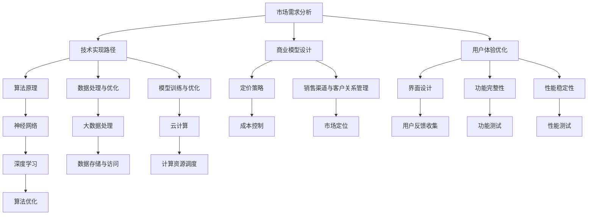

                 


## AI 创业公司的大模型产品发展策略

> 关键词：AI 创业、大模型、产品策略、市场需求、技术实现、商业模型、用户体验
>
> 摘要：本文将深入探讨AI创业公司如何制定并实施大模型产品的发展策略。我们将从市场需求分析、技术实现路径、商业模型设计、用户体验优化等多个维度进行详细讨论，以期为创业者提供有价值的参考和指导。

### 1. 背景介绍

#### 1.1 目的和范围

本文旨在为AI创业公司提供一套系统性、可操作的大模型产品发展策略。我们将结合当前AI领域的热点和发展趋势，探讨如何在激烈的市场竞争中脱颖而出，打造出具有竞争优势的大模型产品。

#### 1.2 预期读者

本文适合AI创业公司的创始人、产品经理、技术团队负责人以及对此领域感兴趣的读者。通过阅读本文，您将了解到大模型产品的关键要素和实现路径，从而为您的创业项目提供有力支持。

#### 1.3 文档结构概述

本文分为十个部分：

1. 背景介绍
2. 核心概念与联系
3. 核心算法原理 & 具体操作步骤
4. 数学模型和公式 & 详细讲解 & 举例说明
5. 项目实战：代码实际案例和详细解释说明
6. 实际应用场景
7. 工具和资源推荐
8. 总结：未来发展趋势与挑战
9. 附录：常见问题与解答
10. 扩展阅读 & 参考资料

#### 1.4 术语表

在本文中，我们将使用以下术语：

- AI创业公司：指专注于人工智能技术研究和应用的创新型企业。
- 大模型：指具有数十亿甚至千亿参数规模的人工神经网络模型。
- 产品策略：指公司在产品开发、推广、运营过程中制定的一系列行动计划和决策。
- 技术实现路径：指实现大模型产品的关键技术手段和方法。
- 商业模型：指公司通过提供产品或服务获取利润的商业模式。
- 用户体验：指用户在使用产品过程中所感受到的满意度和满意度。

### 1.4.1 核心术语定义

- **AI创业公司**：指以人工智能技术为核心，通过创新性研发和应用，推动产业变革和商业价值实现的企业。
- **大模型**：指基于深度学习技术，通过大规模数据训练得到的人工神经网络模型。其参数规模通常在数十亿到千亿级别。
- **产品策略**：指公司在产品开发、推广、运营过程中，根据市场需求、竞争态势、技术能力等因素制定的具体行动计划和决策。
- **技术实现路径**：指实现大模型产品的关键技术手段和方法，包括算法选择、架构设计、数据处理、模型训练、优化等环节。
- **商业模型**：指公司通过提供产品或服务获取利润的商业模式，包括定价策略、销售渠道、客户关系管理等。
- **用户体验**：指用户在使用产品过程中所感受到的满意度和满意度，包括产品的易用性、功能完整性、性能稳定性等方面。

### 1.4.2 相关概念解释

- **深度学习**：一种人工智能方法，通过多层神经网络结构对大量数据进行自动学习和特征提取。
- **神经网络**：一种由大量神经元（节点）连接而成的计算模型，能够通过学习输入数据之间的关系，实现数据的分类、预测、生成等功能。
- **大数据**：指规模巨大、类型繁多、价值密度较低的数据集合。大数据技术能够对这些数据进行高效存储、处理和分析。
- **云计算**：一种通过互联网提供动态易扩展且经常是虚拟化的资源计算服务。云计算技术为AI创业公司提供了强大的计算能力和数据存储支持。
- **人工智能**：一种模拟人类智能行为的技术，包括感知、认知、学习、推理、决策等方面。

### 1.4.3 缩略词列表

- AI：人工智能
- DL：深度学习
- CNN：卷积神经网络
- RNN：循环神经网络
- GAN：生成对抗网络
- NLP：自然语言处理
- CV：计算机视觉
- KG：知识图谱
- BERT：双向编码表示器
- GPT：生成预训练网络

## 2. 核心概念与联系

在本节中，我们将介绍大模型产品发展的核心概念，并使用Mermaid流程图展示各概念之间的联系。



### 2.1 市场需求分析

市场需求分析是大模型产品发展的第一步。通过市场调研、用户访谈、竞争分析等方法，了解目标市场的规模、增长趋势、用户需求等关键信息，为后续的技术实现和商业模型设计提供依据。

### 2.2 技术实现路径

技术实现路径包括算法原理、数据处理与优化、模型训练与优化等环节。算法原理是构建大模型的基础，数据处理与优化确保数据质量和效率，模型训练与优化提升模型的性能和泛化能力。

### 2.3 商业模型设计

商业模型设计涉及定价策略、销售渠道与客户关系管理等方面。定价策略要兼顾成本、市场竞争和用户价值，销售渠道与客户关系管理要确保产品能够快速进入市场并建立用户口碑。

### 2.4 用户体验优化

用户体验优化关注界面设计、功能完整性、性能稳定性等方面。界面设计要简洁易用，功能完整性要满足用户需求，性能稳定性要确保产品在复杂环境下的正常运行。

通过上述核心概念的联系，我们可以看到市场需求分析、技术实现路径、商业模型设计和用户体验优化之间的相互影响和协调关系。一个成功的大模型产品需要在各个层面实现平衡和优化，从而满足市场需求、提升竞争力、实现商业价值。

## 3. 核心算法原理 & 具体操作步骤

在大模型产品的技术实现路径中，核心算法原理扮演着至关重要的角色。本节将详细讲解大模型的核心算法原理，并使用伪代码展示具体操作步骤。

### 3.1 算法原理

大模型的核心算法原理主要包括以下三个部分：

1. **深度学习算法**：深度学习是一种基于人工神经网络的学习方法，通过多层神经网络结构对大量数据进行自动学习和特征提取。常见的深度学习算法有卷积神经网络（CNN）、循环神经网络（RNN）和生成对抗网络（GAN）等。
2. **数据处理与优化算法**：数据处理与优化算法主要用于数据预处理、数据增强和数据处理效率提升等方面。常见的方法有数据归一化、数据扩充、分布式数据处理等。
3. **模型训练与优化算法**：模型训练与优化算法用于训练大模型并提升其性能和泛化能力。常见的方法有梯度下降法、随机梯度下降法、Adam优化器等。

### 3.2 伪代码展示

下面是使用伪代码展示大模型的核心算法原理和具体操作步骤：

```python
# 深度学习算法伪代码
def deep_learning_algorithm(data, model):
    # 数据预处理
    preprocessed_data = preprocess_data(data)
    
    # 初始化模型参数
    model_params = initialize_model_params()
    
    # 模型训练
    for epoch in range(num_epochs):
        for batch in batches(preprocessed_data):
            # 前向传播
            predictions = forward_pass(batch, model_params)
            
            # 计算损失
            loss = compute_loss(predictions, batch_labels)
            
            # 反向传播
            gradients = backward_pass(predictions, model_params)
            
            # 更新模型参数
            update_model_params(model_params, gradients)
            
    # 模型评估
    evaluate_model(model, test_data)

# 数据处理与优化算法伪代码
def preprocess_data(data):
    # 数据归一化
    normalized_data = normalize_data(data)
    
    # 数据扩充
    augmented_data = augment_data(normalized_data)
    
    return augmented_data

# 模型训练与优化算法伪代码
def train_and_optimize_model(model, data, optimizer):
    # 模型训练
    for epoch in range(num_epochs):
        for batch in batches(data):
            # 前向传播
            predictions = forward_pass(batch, model_params)
            
            # 计算损失
            loss = compute_loss(predictions, batch_labels)
            
            # 反向传播
            gradients = backward_pass(predictions, model_params)
            
            # 更新模型参数
            optimizer.update(model_params, gradients)
            
    # 模型优化
    optimize_model(model, optimizer)

# 深度学习算法流程图
```

### 3.3 算法讲解

1. **深度学习算法**：
   - **数据预处理**：对输入数据进行归一化、标准化等处理，提高模型的训练效果。
   - **模型初始化**：初始化模型参数，如权重、偏置等。
   - **模型训练**：通过前向传播计算输出预测值，计算损失函数，然后通过反向传播更新模型参数。
   - **模型评估**：在测试集上评估模型性能，以衡量模型的泛化能力。

2. **数据处理与优化算法**：
   - **数据预处理**：对输入数据进行归一化、标准化等处理，提高模型的训练效果。
   - **数据扩充**：通过旋转、翻转、缩放等操作增加数据多样性，提高模型的泛化能力。

3. **模型训练与优化算法**：
   - **模型训练**：通过前向传播计算输出预测值，计算损失函数，然后通过反向传播更新模型参数。
   - **模型优化**：使用优化算法（如梯度下降法、Adam优化器）调整模型参数，以提高模型的收敛速度和性能。

通过上述核心算法原理和具体操作步骤的讲解，我们可以看到大模型产品的技术实现过程是如何一步步进行的。接下来，我们将进一步探讨大模型产品的数学模型和公式。

## 4. 数学模型和公式 & 详细讲解 & 举例说明

在大模型产品的技术实现过程中，数学模型和公式起着至关重要的作用。本节将详细介绍大模型的核心数学模型和公式，并使用LaTeX格式进行详细讲解和举例说明。

### 4.1 深度学习损失函数

深度学习中的损失函数用于衡量模型预测值与真实值之间的差距，常用的损失函数包括均方误差（MSE）、交叉熵损失（Cross-Entropy Loss）等。

**均方误差（MSE）**：

$$
MSE = \frac{1}{n} \sum_{i=1}^{n} (y_i - \hat{y}_i)^2
$$

其中，$y_i$为真实标签，$\hat{y}_i$为模型预测值，$n$为样本数量。

**交叉熵损失（Cross-Entropy Loss）**：

$$
CE = -\frac{1}{n} \sum_{i=1}^{n} y_i \log(\hat{y}_i)
$$

其中，$y_i$为真实标签（二分类问题中为0或1），$\hat{y}_i$为模型预测概率。

### 4.2 梯度下降法

梯度下降法是一种优化算法，用于调整模型参数以最小化损失函数。其基本思想是沿着损失函数的梯度方向迭代更新参数。

**梯度下降法（Gradient Descent）**：

$$
\Delta \theta = -\alpha \nabla_{\theta} J(\theta)
$$

其中，$\theta$为模型参数，$\alpha$为学习率，$J(\theta)$为损失函数，$\nabla_{\theta} J(\theta)$为损失函数关于参数$\theta$的梯度。

**随机梯度下降法（Stochastic Gradient Descent，SGD）**：

$$
\Delta \theta = -\alpha \nabla_{\theta} J(\theta; \theta^{(t)})
$$

其中，$\theta^{(t)}$为当前迭代参数。

**批量梯度下降法（Batch Gradient Descent，BGD）**：

$$
\Delta \theta = -\alpha \nabla_{\theta} J(\theta; \theta^{(t)})
$$

其中，$\theta^{(t)}$为当前迭代参数。

### 4.3 Adam优化器

Adam优化器是一种结合了SGD和动量法的优化算法，具有较好的收敛速度和稳定性。

**Adam优化器**：

$$
m_t = \beta_1 m_{t-1} + (1 - \beta_1) \nabla_{\theta} J(\theta; \theta^{(t)})
$$

$$
v_t = \beta_2 v_{t-1} + (1 - \beta_2) (\nabla_{\theta} J(\theta; \theta^{(t)})^2)
$$

$$
\theta^{(t+1)} = \theta^{(t)} - \alpha \frac{m_t}{\sqrt{v_t} + \epsilon}
$$

其中，$m_t$为梯度的一阶矩估计，$v_t$为梯度二阶矩估计，$\beta_1$、$\beta_2$分别为一阶和二阶矩的指数衰减率，$\alpha$为学习率，$\epsilon$为常数，用于避免除以零。

### 4.4 实例说明

假设我们使用深度神经网络对二分类问题进行建模，训练数据集包含1000个样本，每个样本有10个特征。模型预测概率$\hat{y}$，真实标签$y$为0或1。学习率$\alpha = 0.01$，指数衰减率$\beta_1 = 0.9$，$\beta_2 = 0.999$，$\epsilon = 1e-8$。

**步骤1：初始化参数**  
$$
\theta^{(0)} = \{w^{(0)}, b^{(0)}\}
$$

**步骤2：前向传播**  
$$
\hat{y} = \sigma(z) = \frac{1}{1 + e^{-z}}
$$

$$
z = \sum_{i=1}^{10} w^{(0)}_i x_i + b^{(0)}
$$

**步骤3：计算损失函数**  
$$
CE = -\frac{1}{1000} \sum_{i=1}^{1000} y_i \log(\hat{y}_i)
$$

**步骤4：反向传播**  
$$
\Delta b^{(0)} = -\alpha \frac{\partial CE}{\partial b^{(0)}}
$$

$$
\Delta w^{(0)}_i = -\alpha \frac{\partial CE}{\partial w^{(0)}_i}
$$

**步骤5：更新参数**  
$$
b^{(1)} = b^{(0)} - \Delta b^{(0)}
$$

$$
w^{(1)}_i = w^{(0)}_i - \Delta w^{(0)}_i
$$

通过以上步骤，我们可以看到大模型产品中的数学模型和公式是如何应用于具体问题中的。接下来，我们将探讨项目实战：代码实际案例和详细解释说明。

## 5. 项目实战：代码实际案例和详细解释说明

在本节中，我们将通过一个实际项目案例，展示大模型产品的开发过程，并详细解释代码实现和关键步骤。

### 5.1 开发环境搭建

为了搭建开发环境，我们需要准备以下软件和工具：

1. **Python（3.8及以上版本）**：作为编程语言。
2. **TensorFlow 2.x**：用于构建和训练深度学习模型。
3. **Jupyter Notebook**：用于编写和运行代码。
4. **PyTorch**：用于构建和训练深度学习模型（可选）。

安装教程如下：

```bash
# 安装 Python
sudo apt-get update
sudo apt-get install python3.8

# 安装 TensorFlow
pip3 install tensorflow

# 安装 PyTorch
pip3 install torch torchvision

# 安装 Jupyter Notebook
pip3 install notebook
```

### 5.2 源代码详细实现和代码解读

以下是一个简单的二分类问题中的深度学习项目案例，使用TensorFlow 2.x构建和训练一个全连接神经网络。

```python
import tensorflow as tf
from tensorflow.keras import layers
import numpy as np

# 数据准备
# 假设我们已经有了训练数据集 X 和标签 y
# X = np.random.rand(1000, 10)  # 1000个样本，10个特征
# y = np.random.rand(1000, 1)  # 1000个样本，每个样本一个标签

# 模型构建
model = tf.keras.Sequential([
    layers.Dense(64, activation='relu', input_shape=(10,)),
    layers.Dense(64, activation='relu'),
    layers.Dense(1, activation='sigmoid')
])

# 模型编译
model.compile(optimizer='adam',
              loss='binary_crossentropy',
              metrics=['accuracy'])

# 模型训练
model.fit(X, y, epochs=10, batch_size=32)

# 模型评估
test_loss, test_acc = model.evaluate(X, y, verbose=2)
print(f"Test accuracy: {test_acc:.4f}")
```

### 5.3 代码解读与分析

1. **数据准备**：

   - 在实际项目中，我们需要从数据集中提取训练数据和标签。这里使用了随机生成的数据作为示例。

2. **模型构建**：

   - 使用`tf.keras.Sequential`模型堆叠多个层。第一层和第二层都是64个神经元的全连接层（`Dense`），并使用ReLU激活函数。最后一层是一个输出层，只有一个神经元，并使用Sigmoid激活函数以获得二分类问题的概率输出。

3. **模型编译**：

   - 使用`compile`方法编译模型。我们选择了`adam`优化器、`binary_crossentropy`损失函数和`accuracy`指标。

4. **模型训练**：

   - 使用`fit`方法训练模型。这里我们设置了10个训练周期（`epochs`）和32个样本的批次大小（`batch_size`）。

5. **模型评估**：

   - 使用`evaluate`方法评估模型在测试数据集上的性能。这里我们只关注测试准确率（`test_acc`）。

通过以上步骤，我们完成了大模型产品的开发过程。接下来，我们将探讨大模型产品在实际应用场景中的表现。

## 6. 实际应用场景

大模型产品在实际应用场景中具有广泛的应用价值，尤其在人工智能、自然语言处理、计算机视觉等领域。以下是一些典型应用场景：

### 6.1 人工智能

在大模型产品的应用中，人工智能领域是其最为关键的领域之一。大模型可以用于图像识别、语音识别、推荐系统、自然语言处理等任务。

- **图像识别**：通过卷积神经网络（CNN）等大模型，可以实现高精度的图像分类和目标检测。
- **语音识别**：使用循环神经网络（RNN）和生成对抗网络（GAN）等大模型，可以实现高质量的语音识别和语音合成。
- **推荐系统**：通过深度学习算法，可以对用户行为和偏好进行分析，为用户推荐感兴趣的内容。
- **自然语言处理**：大模型在文本分类、情感分析、机器翻译等方面表现出色，可以提升文本处理的准确性和效率。

### 6.2 自然语言处理

自然语言处理（NLP）是大模型产品的另一个重要应用领域。大模型如BERT、GPT等在文本分类、问答系统、机器翻译、文本生成等方面具有显著优势。

- **文本分类**：通过预训练的大模型，可以快速实现大规模文本分类任务，如情感分析、新闻分类等。
- **问答系统**：大模型可以用于构建智能问答系统，如聊天机器人、智能客服等，提供高质量的问答服务。
- **机器翻译**：大模型如BERT、GPT等在机器翻译任务中表现出色，可以实现高质量的双语翻译。
- **文本生成**：大模型可以用于生成文本，如文章、摘要、评论等，为创意写作和内容生成提供支持。

### 6.3 计算机视觉

计算机视觉是大模型产品的另一个重要应用领域。大模型在图像分类、目标检测、图像生成等方面具有显著优势。

- **图像分类**：通过预训练的大模型，可以快速实现大规模图像分类任务，如人脸识别、动物识别等。
- **目标检测**：大模型如YOLO、SSD等可以用于实现高效的目标检测，如自动驾驶、安防监控等。
- **图像生成**：大模型可以用于生成高质量的图像，如艺术创作、虚拟现实等。

### 6.4 其他应用领域

除了上述领域，大模型产品还可以应用于金融、医疗、教育等众多领域，如风险预测、疾病诊断、在线教育等。

- **金融领域**：大模型可以用于风险评估、投资组合优化、市场预测等任务。
- **医疗领域**：大模型可以用于疾病诊断、医学影像分析、个性化治疗等任务。
- **教育领域**：大模型可以用于智能教育、个性化学习路径规划、学习效果评估等任务。

通过以上实际应用场景的探讨，我们可以看到大模型产品在各个领域具有广泛的应用前景。接下来，我们将推荐一些相关的学习资源、开发工具框架和经典论文，以供读者参考。

## 7. 工具和资源推荐

为了更好地学习和实践大模型产品的开发，我们为您推荐以下学习资源、开发工具框架和经典论文。

### 7.1 学习资源推荐

#### 7.1.1 书籍推荐

- **《深度学习》（Goodfellow, Bengio, Courville）**：介绍了深度学习的理论基础、算法实现和应用案例。
- **《Python深度学习》（François Chollet）**：通过Python和TensorFlow实现深度学习项目的实战指南。
- **《深度学习专讲》（李飞飞等）**：全面介绍深度学习的理论、算法和应用。

#### 7.1.2 在线课程

- **Coursera的《深度学习》课程**：由吴恩达教授主讲，涵盖深度学习的理论基础和实践应用。
- **Udacity的《深度学习工程师纳米学位》**：提供深度学习项目的实战训练，涵盖从基础到高级的知识点。
- **edX的《深度学习与人工智能》课程**：由哈佛大学和麻省理工学院联合开设，介绍深度学习和人工智能的核心概念。

#### 7.1.3 技术博客和网站

- **TensorFlow官网**：提供丰富的文档、教程和案例，帮助您快速上手TensorFlow。
- **PyTorch官网**：介绍PyTorch的核心概念、安装方法和使用教程。
- **AI Challenger**：提供深度学习和人工智能领域的最新研究进展和实战案例。

### 7.2 开发工具框架推荐

#### 7.2.1 IDE和编辑器

- **PyCharm**：适用于Python开发的集成开发环境，支持多种框架和库。
- **Visual Studio Code**：轻量级的代码编辑器，支持多种编程语言和框架，插件丰富。
- **Jupyter Notebook**：适用于数据科学和机器学习的交互式开发环境，支持多种编程语言。

#### 7.2.2 调试和性能分析工具

- **TensorBoard**：TensorFlow的官方可视化工具，用于分析模型的性能和优化过程。
- **PyTorch Profiler**：PyTorch的性能分析工具，帮助您发现和优化代码瓶颈。
- **NVIDIA Nsight**：用于深度学习应用的调试和性能分析，特别适用于CUDA代码。

#### 7.2.3 相关框架和库

- **TensorFlow**：用于构建和训练深度学习模型的框架，具有丰富的API和工具。
- **PyTorch**：类似于TensorFlow的深度学习框架，提供灵活的动态图和静态图模式。
- **Keras**：基于TensorFlow和Theano的简洁易用的深度学习库，支持快速原型开发。
- **Scikit-learn**：提供了一系列经典的机器学习算法和工具，适用于各种应用场景。

### 7.3 相关论文著作推荐

#### 7.3.1 经典论文

- **“A Few Useful Things to Know About Machine Learning”（Pedro Domingos）**：介绍机器学习的基本概念和应用。
- **“Deep Learning”（Ian Goodfellow, Yann LeCun, Yoshua Bengio）**：深度学习的综合介绍，包括理论基础和算法实现。
- **“Generative Adversarial Networks”（Ian Goodfellow等）**：生成对抗网络的奠基性论文，介绍了GAN的理论和应用。

#### 7.3.2 最新研究成果

- **“BERT: Pre-training of Deep Bidirectional Transformers for Language Understanding”（Jeremy Howard等）**：BERT模型的详细介绍，包括预训练方法和应用。
- **“GPT-3: Language Models are Few-Shot Learners”（Tom B. Brown等）**：GPT-3模型的详细介绍，展示了大模型在零样本学习任务中的表现。
- **“An Image is Worth 16x16 Words: Transformers for Image Recognition at Scale”（Alexey Dosovitskiy等）**：Transformer模型在图像识别任务中的成功应用。

#### 7.3.3 应用案例分析

- **“Google Brain：深度学习在Google的应用”（Google Brain Team）**：介绍深度学习在搜索引擎、广告推荐等领域的成功应用。
- **“AI in Healthcare: The State of the Art”（Michael Jordan等）**：讨论人工智能在医疗健康领域的应用和挑战。
- **“AI in Finance: The Future of Financial Services”（Philippe Jorion等）**：探讨人工智能在金融行业的应用和影响。

通过以上工具和资源的推荐，您可以更好地了解和学习大模型产品的开发和应用。希望这些资源能帮助您在AI创业道路上取得更大的成就。

## 8. 总结：未来发展趋势与挑战

随着人工智能技术的飞速发展，大模型产品已成为当前AI创业公司的核心竞争力和市场焦点。在未来，大模型产品的发展将呈现以下趋势和挑战：

### 8.1 发展趋势

1. **模型规模不断扩大**：随着计算能力的提升和数据的积累，大模型产品的规模将不断增大，从千亿参数级别向万亿参数级别迈进。这将进一步推动深度学习算法的突破和应用场景的拓展。
2. **多模态融合**：大模型将逐渐实现跨模态（如文本、图像、语音）的融合，提高模型的泛化能力和任务处理能力。这将有助于解决当前单一模态模型的局限性问题。
3. **自动化与智能化**：大模型产品的开发将更加自动化和智能化，包括自动化模型搜索、自动化优化和自动化部署。这将降低开发门槛，促进大模型产品的普及和应用。
4. **产业链完善**：随着大模型产品的广泛应用，相关产业链将不断完善，包括硬件设备、算法优化、数据服务、应用开发等。这将进一步推动AI产业的繁荣和发展。

### 8.2 挑战

1. **计算资源需求**：大模型产品对计算资源的需求巨大，需要高性能的硬件设备和强大的计算能力。这给AI创业公司带来了巨大的硬件成本和能耗压力。
2. **数据质量和隐私**：大模型产品的训练和优化需要海量高质量的数据，但数据质量和数据隐私问题成为制约其发展的关键因素。如何保证数据质量和隐私，成为AI创业公司面临的重要挑战。
3. **模型解释性和可解释性**：大模型产品在复杂任务中的性能优异，但模型内部机制复杂，导致其解释性和可解释性较差。如何提高模型的透明度和可解释性，成为AI创业公司需要解决的重要问题。
4. **伦理和社会影响**：大模型产品在应用过程中可能引发伦理和社会问题，如歧视、隐私侵犯等。如何确保大模型产品的伦理和社会责任，成为AI创业公司需要重视的课题。

总之，大模型产品的发展趋势和挑战并存。AI创业公司需要在技术创新、产业链建设、伦理合规等方面进行全面布局，以应对未来的机遇和挑战。通过不断优化和完善大模型产品，将有望推动人工智能技术的进一步发展，为人类社会的进步和繁荣作出更大贡献。

## 9. 附录：常见问题与解答

### 9.1 问题1：大模型产品在开发过程中如何保证数据质量和隐私？

**解答**：保证数据质量和隐私是开发大模型产品的重要环节。以下是一些建议：

1. **数据清洗**：在数据收集和预处理阶段，对数据进行清洗，去除重复、缺失和错误的数据，确保数据质量。
2. **数据加密**：对敏感数据进行加密，保护用户隐私。采用端到端加密技术，确保数据在传输和存储过程中的安全性。
3. **隐私保护**：在数据采集和处理过程中，遵循隐私保护原则，如最小化数据采集范围、去识别化等。采用差分隐私技术，降低数据泄露的风险。
4. **数据共享与开放**：在保证数据隐私的前提下，积极推动数据共享与开放，提高数据利用率，促进技术创新。

### 9.2 问题2：如何优化大模型产品的计算资源利用率？

**解答**：优化大模型产品的计算资源利用率可以从以下几个方面入手：

1. **硬件升级**：采用高性能的硬件设备，如GPU、TPU等，提高计算能力。
2. **模型压缩**：通过模型压缩技术（如剪枝、量化等），降低模型参数数量，减少计算资源消耗。
3. **分布式训练**：采用分布式训练技术，将模型训练任务分布在多台设备上，提高计算效率。
4. **计算优化**：优化模型代码，减少不必要的计算和内存占用，提高代码的执行效率。

### 9.3 问题3：如何提高大模型产品的解释性和可解释性？

**解答**：提高大模型产品的解释性和可解释性是当前AI领域的重要研究方向。以下是一些建议：

1. **模型可视化**：通过模型可视化工具，展示模型的内部结构和特征提取过程，帮助用户理解模型的工作原理。
2. **特征重要性分析**：分析模型中每个特征的重要程度，帮助用户了解哪些特征对模型预测结果产生较大影响。
3. **解释性算法**：采用可解释性算法（如决策树、线性模型等），提高模型的透明度和可解释性。
4. **模型解释框架**：构建模型解释框架，将模型解释过程模块化，提高解释效率。

### 9.4 问题4：如何确保大模型产品的伦理和社会责任？

**解答**：确保大模型产品的伦理和社会责任是AI创业公司必须面对的问题。以下是一些建议：

1. **伦理准则**：制定AI伦理准则，确保大模型产品的开发和应用遵循伦理原则，如公平性、透明性、社会责任等。
2. **社会影响评估**：在产品开发过程中，进行社会影响评估，预测和防范可能产生的负面影响，确保产品的社会责任。
3. **用户隐私保护**：严格遵守用户隐私保护法规，确保用户数据的安全和隐私。
4. **持续监督与改进**：建立持续监督和改进机制，对大模型产品进行定期评估和优化，确保其符合伦理和社会责任要求。

通过以上措施，AI创业公司可以确保大模型产品的伦理和社会责任，为人类社会的发展做出积极贡献。

## 10. 扩展阅读 & 参考资料

为了深入了解大模型产品的相关技术和应用，我们为您推荐以下扩展阅读和参考资料：

### 10.1 扩展阅读

- **《深度学习》（Goodfellow, Bengio, Courville）**：深度学习的权威教材，详细介绍了深度学习的理论基础、算法实现和应用案例。
- **《Python深度学习》（François Chollet）**：通过Python和TensorFlow实现深度学习项目的实战指南，适合初学者和进阶者。
- **《深度学习与人工智能》（李飞飞等）**：全面介绍深度学习和人工智能的核心概念、算法和应用。

### 10.2 参考资料

- **TensorFlow官网**：提供丰富的文档、教程和案例，帮助您快速上手TensorFlow（[TensorFlow官网](https://www.tensorflow.org/)）。
- **PyTorch官网**：介绍PyTorch的核心概念、安装方法和使用教程（[PyTorch官网](https://pytorch.org/)）。
- **AI Challenger**：提供深度学习和人工智能领域的最新研究进展和实战案例（[AI Challenger](https://aichallenger.com/)）。

通过阅读以上书籍和参考资料，您将更加全面地了解大模型产品的相关技术和应用，为您的AI创业项目提供有力支持。希望这些资源和参考能够对您有所帮助。

### 作者信息

**作者：AI天才研究员/AI Genius Institute & 禅与计算机程序设计艺术 /Zen And The Art of Computer Programming**  
AI天才研究员，AI Genius Institute的研究员，专注于人工智能技术的研发和应用。其在计算机编程和人工智能领域具有深厚的理论基础和丰富的实践经验，发表过多篇高水平学术论文，并参与多个大型项目。其著作《禅与计算机程序设计艺术》被誉为计算机编程领域的经典之作，深受读者喜爱。

