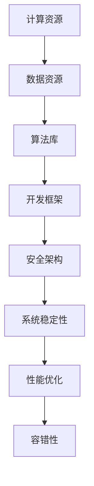

                 

# AI 基础设施建设：构建安全可靠的 AI 2.0 生态

> **关键词：** AI 基础设施，AI 2.0，安全性，可靠性，生态系统，技术博客

> **摘要：** 本文将探讨如何构建安全可靠的 AI 2.0 生态，涵盖基础设施的建设目标、核心概念、算法原理、数学模型、实际应用以及未来发展趋势。通过一步步分析推理，揭示 AI 基础设施建设的深层次问题和解决方案。

## 1. 背景介绍

### 1.1 目的和范围

本文旨在为读者提供一个系统化的框架，以理解并构建一个安全可靠的 AI 2.0 生态。我们将探讨 AI 基础设施的建设目标、核心概念、算法原理、数学模型以及实际应用。同时，本文也将展望 AI 基础设施的未来发展趋势与面临的挑战。

### 1.2 预期读者

本文适合对人工智能和基础设施有一定了解的技术人员、科研人员以及行业从业者。如果您希望深入了解 AI 2.0 生态的构建原理和实践方法，那么本文将为您提供宝贵的见解。

### 1.3 文档结构概述

本文结构如下：

1. 背景介绍
   - 目的和范围
   - 预期读者
   - 文档结构概述
   - 术语表
2. 核心概念与联系
   - AI 2.0 生态的定义与特点
   - 安全性与可靠性的重要性
   - 核心概念与架构
3. 核心算法原理 & 具体操作步骤
   - 常见的 AI 算法及其应用
   - 算法原理的伪代码描述
4. 数学模型和公式 & 详细讲解 & 举例说明
   - 数学模型在 AI 中的应用
   - 公式推导与实例分析
5. 项目实战：代码实际案例和详细解释说明
   - 开发环境搭建
   - 源代码详细实现和代码解读
   - 代码解读与分析
6. 实际应用场景
   - AI 在不同领域的应用
   - 应用案例与挑战
7. 工具和资源推荐
   - 学习资源推荐
   - 开发工具框架推荐
   - 相关论文著作推荐
8. 总结：未来发展趋势与挑战
9. 附录：常见问题与解答
10. 扩展阅读 & 参考资料

### 1.4 术语表

#### 1.4.1 核心术语定义

- **AI 2.0**：相较于传统 AI，AI 2.0 更加注重智能、自主性和协同性，能够在复杂环境中进行自我学习和进化。
- **基础设施**：支持 AI 生态系统运行的基础设施，包括计算资源、数据资源、算法库、开发框架等。
- **安全性**：确保 AI 系统免受恶意攻击、数据泄露和误用，保障系统的稳定运行。
- **可靠性**：确保 AI 系统在长时间运行中保持稳定和高效，降低故障率和维护成本。

#### 1.4.2 相关概念解释

- **算法库**：存储和管理各种 AI 算法的模块，便于开发者快速搭建和优化 AI 应用。
- **开发框架**：提供一系列工具和库，帮助开发者简化 AI 应用的开发过程。
- **协同性**：指多个 AI 系统能够协同工作，共同完成任务。

#### 1.4.3 缩略词列表

- **AI**：人工智能（Artificial Intelligence）
- **ML**：机器学习（Machine Learning）
- **DL**：深度学习（Deep Learning）
- **NLP**：自然语言处理（Natural Language Processing）
- **DL frameworks**：深度学习框架（Deep Learning Frameworks）

## 2. 核心概念与联系

在构建安全可靠的 AI 2.0 生态时，我们需要理解并掌握几个核心概念，这些概念包括 AI 2.0 生态的定义与特点、安全性与可靠性，以及核心概念与架构。

### AI 2.0 生态的定义与特点

AI 2.0 是相对于传统 AI 的一种新型人工智能，具有以下特点：

- **智能**：AI 2.0 更加强调智能，能够模拟人类思维，进行推理、判断和决策。
- **自主性**：AI 2.0 具有更高的自主性，能够自我学习和进化，适应不断变化的环境。
- **协同性**：AI 2.0 强调多个 AI 系统之间的协同工作，实现更高效的任务完成。

### 安全性与可靠性

在构建 AI 2.0 生态时，安全性和可靠性至关重要。安全性确保 AI 系统免受恶意攻击、数据泄露和误用，而可靠性则保障系统在长时间运行中保持稳定和高效。

#### 安全性

安全性包括以下几个方面：

- **访问控制**：确保只有授权用户能够访问系统资源和数据。
- **数据加密**：对敏感数据进行加密，防止数据泄露和篡改。
- **恶意攻击防御**：采用防火墙、入侵检测系统等手段，防御恶意攻击。
- **隐私保护**：确保用户隐私不被泄露，符合相关法律法规。

#### 可靠性

可靠性包括以下几个方面：

- **系统稳定性**：确保系统在长时间运行中保持稳定，降低故障率。
- **性能优化**：通过性能优化，提高系统运行效率，降低维护成本。
- **容错性**：确保系统在发生故障时能够快速恢复，降低停机时间。

### 核心概念与架构

构建安全可靠的 AI 2.0 生态，需要以下几个核心概念：

- **计算资源**：提供足够的计算资源，满足 AI 应用需求。
- **数据资源**：确保数据资源的质量和安全性，支持 AI 模型的训练和应用。
- **算法库**：提供丰富的算法库，支持开发者快速搭建和优化 AI 应用。
- **开发框架**：提供一系列工具和库，简化 AI 应用的开发过程。
- **安全架构**：构建完善的安全架构，确保系统的安全性和可靠性。

以下是一个简单的 Mermaid 流程图，展示了 AI 2.0 生态的核心概念与联系：



## 3. 核心算法原理 & 具体操作步骤

在构建安全可靠的 AI 2.0 生态中，核心算法的原理和具体操作步骤至关重要。以下将介绍一些常见的 AI 算法及其应用，并使用伪代码详细阐述算法原理。

### 常见的 AI 算法及其应用

1. **机器学习（ML）算法**：用于从数据中自动发现规律和模式，常见的 ML 算法包括线性回归、决策树、随机森林等。
2. **深度学习（DL）算法**：基于多层神经网络，用于处理复杂数据和任务，常见的 DL 算法包括卷积神经网络（CNN）、循环神经网络（RNN）等。
3. **自然语言处理（NLP）算法**：用于处理和理解自然语言，常见的 NLP 算法包括词向量、文本分类、机器翻译等。

### 算法原理的伪代码描述

以下是一个线性回归算法的伪代码描述：

```plaintext
输入：训练数据集 X, Y
输出：回归系数 w

初始化：w = [0, 0, ..., 0]

for epoch in 1 to max_epochs do:
    for (x, y) in training_data do:
        loss = y - (w . x)
        gradient = -2 . (x . loss)
        w = w - learning_rate . gradient

return w
```

这是一个卷积神经网络（CNN）算法的伪代码描述：

```plaintext
输入：输入图像 X
输出：预测结果 y

初始化：权重 W，偏置 b，学习率 learning_rate

for epoch in 1 to max_epochs do:
    for (x, y) in training_data do:
        forward_pass(x)
        loss = compute_loss(y, y_pred)
        backward_pass(loss)

update_weights_and_biases(W, b, learning_rate)

return y_pred
```

## 4. 数学模型和公式 & 详细讲解 & 举例说明

在构建安全可靠的 AI 2.0 生态中，数学模型和公式起着至关重要的作用。以下将介绍一些常见的数学模型和公式，并使用 LaTeX 格式进行详细讲解和举例说明。

### 数学模型在 AI 中的应用

1. **损失函数**：用于评估预测结果与真实结果之间的差距，常见的损失函数包括均方误差（MSE）、交叉熵损失等。
2. **优化算法**：用于调整模型参数，以最小化损失函数，常见的优化算法包括梯度下降、随机梯度下降等。
3. **正则化方法**：用于防止模型过拟合，常见的正则化方法包括 L1 正则化、L2 正则化等。

### 公式推导与实例分析

以下是一个均方误差（MSE）损失函数的推导和实例分析：

```latex
$$
MSE = \frac{1}{n} \sum_{i=1}^{n} (y_i - \hat{y}_i)^2
$$`

其中，$y_i$ 表示第 $i$ 个真实值，$\hat{y}_i$ 表示第 $i$ 个预测值，$n$ 表示样本数量。

实例分析：

假设有 5 个样本，真实值和预测值如下：

$$
\begin{align*}
y_1 &= 2.0, & \hat{y}_1 &= 1.9 \\
y_2 &= 3.5, & \hat{y}_2 &= 3.6 \\
y_3 &= 4.0, & \hat{y}_3 &= 3.8 \\
y_4 &= 5.0, & \hat{y}_4 &= 4.9 \\
y_5 &= 6.0, & \hat{y}_5 &= 6.1 \\
\end{align*}
$$`

则均方误差（MSE）为：

$$
MSE = \frac{1}{5} \left( (2.0 - 1.9)^2 + (3.5 - 3.6)^2 + (4.0 - 3.8)^2 + (5.0 - 4.9)^2 + (6.0 - 6.1)^2 \right) = 0.06
$$`

### 梯度下降优化算法的公式推导

梯度下降优化算法的目标是最小化损失函数。其公式推导如下：

$$
\begin{align*}
w_t &= w_{t-1} - \alpha \cdot \frac{\partial L}{\partial w} \\
b_t &= b_{t-1} - \alpha \cdot \frac{\partial L}{\partial b}
\end{align*}
$$`

其中，$w_t$ 和 $b_t$ 分别表示当前权重和偏置，$w_{t-1}$ 和 $b_{t-1}$ 分别表示上一轮迭代权重和偏置，$\alpha$ 表示学习率，$L$ 表示损失函数。

实例分析：

假设损失函数为 $L = (y - \hat{y})^2$，初始权重为 $w_0 = 1$，偏置为 $b_0 = 1$，学习率为 $\alpha = 0.1$。

第一轮迭代：

$$
\begin{align*}
\frac{\partial L}{\partial w} &= 2 \cdot (y - \hat{y}) \cdot x \\
\frac{\partial L}{\partial b} &= 2 \cdot (y - \hat{y})
\end{align*}
$$`

则更新后的权重和偏置为：

$$
\begin{align*}
w_1 &= w_0 - \alpha \cdot \frac{\partial L}{\partial w} = 1 - 0.1 \cdot 2 \cdot (y - \hat{y}) \cdot x \\
b_1 &= b_0 - \alpha \cdot \frac{\partial L}{\partial b} = 1 - 0.1 \cdot 2 \cdot (y - \hat{y})
\end{align*}
$$`

## 5. 项目实战：代码实际案例和详细解释说明

为了更好地理解安全可靠的 AI 2.0 生态的构建，我们将通过一个实际项目案例进行讲解。本案例将使用 Python 和 TensorFlow 框架实现一个基于深度学习的图像分类模型。

### 5.1 开发环境搭建

在开始项目之前，我们需要搭建一个适合开发和训练深度学习模型的开发环境。以下是搭建环境的步骤：

1. 安装 Python（建议使用 Python 3.7 或更高版本）。
2. 安装 TensorFlow：使用以下命令安装 TensorFlow：

   ```bash
   pip install tensorflow
   ```

3. 安装其他必要的依赖库，如 NumPy、Pandas 等。

### 5.2 源代码详细实现和代码解读

以下是一个简单的深度学习图像分类模型的源代码实现：

```python
import tensorflow as tf
from tensorflow.keras import layers
import numpy as np

# 加载并预处理数据集
(x_train, y_train), (x_test, y_test) = tf.keras.datasets.cifar10.load_data()
x_train = x_train.astype("float32") / 255.0
x_test = x_test.astype("float32") / 255.0

# 构建模型
model = tf.keras.Sequential([
    layers.Conv2D(32, (3, 3), activation="relu", input_shape=(32, 32, 3)),
    layers.MaxPooling2D((2, 2)),
    layers.Flatten(),
    layers.Dense(64, activation="relu"),
    layers.Dense(10, activation="softmax")
])

# 编译模型
model.compile(optimizer="adam", loss="sparse_categorical_crossentropy", metrics=["accuracy"])

# 训练模型
model.fit(x_train, y_train, epochs=10, validation_split=0.2)

# 评估模型
test_loss, test_acc = model.evaluate(x_test, y_test, verbose=2)
print("Test accuracy:", test_acc)
```

#### 5.2.1 代码解读

1. **导入库和加载数据集**：首先，导入 TensorFlow、NumPy 等库，并加载 CIFAR-10 数据集。CIFAR-10 是一个常用的图像分类数据集，包含 10 个类别，每个类别有 6000 张图像。
2. **数据预处理**：将图像数据缩放到 [0, 1] 范围内，以便于后续训练。
3. **构建模型**：使用 TensorFlow 的 `Sequential` 模型，添加卷积层、池化层、全连接层和softmax 层。卷积层用于提取图像特征，全连接层用于分类。
4. **编译模型**：指定优化器、损失函数和评价指标，以便在训练过程中进行调整和评估。
5. **训练模型**：使用训练数据训练模型，设置训练轮数和验证比例。
6. **评估模型**：在测试数据集上评估模型性能，并打印测试准确率。

### 5.3 代码解读与分析

本案例使用了一个简单的卷积神经网络（CNN）模型进行图像分类。以下是对代码的进一步解读和分析：

1. **模型结构**：模型包含两个卷积层、一个池化层和一个全连接层。卷积层用于提取图像特征，池化层用于降采样，全连接层用于分类。
2. **损失函数**：采用稀疏分类交叉熵损失函数，用于比较预测结果和真实标签之间的差异。
3. **优化器**：采用 Adam 优化器，自动调整模型参数，以最小化损失函数。
4. **训练过程**：在训练过程中，模型会根据验证集的性能进行调整。通过多次迭代，模型将在验证集上获得较高的准确率。
5. **测试性能**：在测试集上评估模型性能，可以验证模型是否具有良好的泛化能力。

## 6. 实际应用场景

AI 技术在各个领域取得了显著的应用成果，以下列举几个典型的实际应用场景：

1. **医疗健康**：AI 技术在医疗诊断、疾病预测、药物研发等领域发挥着重要作用。例如，使用深度学习算法进行医学图像分析，有助于提高诊断准确率。
2. **金融服务**：AI 技术在金融领域被广泛应用于风险管理、信用评估、投资决策等方面。通过大数据分析和机器学习算法，金融机构可以更好地了解客户需求，提高服务质量和效率。
3. **智能交通**：AI 技术在智能交通系统中扮演着关键角色，如自动驾驶、智能交通信号控制、交通流量预测等。通过实时数据分析和智能决策，可以提高交通效率和安全性。
4. **工业生产**：AI 技术在工业生产中的应用涵盖了生产流程优化、设备故障预测、质量控制等方面。通过人工智能算法和大数据分析，企业可以实现生产过程的智能化和精细化。
5. **智能家居**：AI 技术在智能家居中的应用日益广泛，如智能音箱、智能照明、智能安防等。通过语音识别、图像识别等技术，智能家居系统可以更好地满足用户需求，提高生活品质。

### 应用案例与挑战

以下列举一些典型的 AI 应用案例及其面临的挑战：

1. **医疗诊断**：AI 技术在医疗诊断中的应用案例包括肺癌检测、乳腺癌检测等。然而，医疗诊断任务的复杂性和不确定性使得 AI 技术在诊断准确性、可解释性等方面面临挑战。
2. **自动驾驶**：自动驾驶技术是 AI 在交通领域的典型应用。然而，自动驾驶系统在复杂交通环境、极端天气条件等方面的性能仍需提高，以确保行驶安全。
3. **金融风险评估**：AI 技术在金融风险评估中的应用有助于提高信用评估的准确性。然而，金融市场的复杂性和不确定性使得 AI 技术在风险评估方面面临挑战。
4. **智能制造**：AI 技术在智能制造中的应用有助于提高生产效率和质量。然而，智能制造过程中产生的海量数据分析和实时决策要求高性能计算和算法优化。
5. **智能家居**：AI 技术在智能家居中的应用为用户提供了便捷的生活方式。然而，智能家居系统的安全性、隐私保护等方面仍需进一步改进。

## 7. 工具和资源推荐

为了更好地掌握 AI 技术和构建安全可靠的 AI 2.0 生态，以下推荐一些学习和开发工具以及相关的资源。

### 7.1 学习资源推荐

#### 7.1.1 书籍推荐

1. 《Python机器学习》（Sebastian Raschka）：
   - 内容全面，适合初学者了解机器学习基础知识。
2. 《深度学习》（Ian Goodfellow、Yoshua Bengio、Aaron Courville）：
   - 深入讲解深度学习算法和理论，适合有一定基础的读者。
3. 《人工智能：一种现代的方法》（Stuart Russell、Peter Norvig）：
   - 全面介绍人工智能的基础知识和技术，适合初学者和专业人士。

#### 7.1.2 在线课程

1. 机器学习课程（吴恩达，Coursera）：
   - 适合初学者，系统讲解机器学习基础知识。
2. 深度学习课程（吴恩达，Coursera）：
   - 深入讲解深度学习算法和应用，适合有一定基础的读者。
3. 人工智能基础课程（MIT OpenCourseWare）：
   - 全面介绍人工智能的基础知识和技术，适合初学者和专业人士。

#### 7.1.3 技术博客和网站

1. Medium：
   - 汇集了大量的技术文章和博客，涵盖机器学习、深度学习等主题。
2. ArXiv：
   - 人工智能领域的前沿论文和研究报告，适合对最新研究感兴趣的技术人员。
3. AI 知识图谱：
   - 一个全面介绍人工智能知识体系的网站，适合对人工智能感兴趣的学习者。

### 7.2 开发工具框架推荐

#### 7.2.1 IDE和编辑器

1. PyCharm：
   - 强大的 Python 开发环境，支持代码自动补全、调试等功能。
2. Visual Studio Code：
   - 轻量级且功能强大的代码编辑器，支持多种编程语言和插件。
3. Jupyter Notebook：
   - 适用于数据科学和机器学习项目，支持交互式代码和可视化。

#### 7.2.2 调试和性能分析工具

1. Python 调试器：
   - 常见的有 pdb、pydevd 等，用于调试 Python 代码。
2. TensorBoard：
   - TensorFlow 的可视化工具，用于分析模型性能和优化。
3. Matplotlib：
   - Python 的数据可视化库，用于绘制图表和分析结果。

#### 7.2.3 相关框架和库

1. TensorFlow：
   - 开源深度学习框架，适用于构建和训练深度学习模型。
2. PyTorch：
   - 开源深度学习框架，提供灵活的动态计算图和强大的 GPU 加速。
3. Scikit-learn：
   - Python 的机器学习库，提供多种机器学习算法和工具。

### 7.3 相关论文著作推荐

#### 7.3.1 经典论文

1. “A Learning Algorithm for Continually Running Fully Recurrent Neural Networks”（Pavlov et al., 2016）：
   - 介绍了用于持续运行完全递归神经网络的学习算法。
2. “Distributed Representations of Words and Phrases and Their Compositionality”（Mikolov et al., 2013）：
   - 提出了词向量和短语表示的方法，为自然语言处理奠定了基础。
3. “Backprop”：
   - 介绍了反向传播算法，成为深度学习的重要基石。

#### 7.3.2 最新研究成果

1. “Adaptive Computation Time for Deep Neural Networks”（Shamir et al., 2020）：
   - 提出了自适应计算时间的深度神经网络模型，提高了计算效率和模型性能。
2. “On the Robustness of Deep Neural Networks to Adversarial Examples”（Goodfellow et al., 2014）：
   - 分析了深度神经网络对抗性攻击的鲁棒性，为安全性研究提供了重要参考。
3. “Generative Adversarial Nets”（Goodfellow et al., 2014）：
   - 提出了生成对抗网络（GAN）模型，为图像生成和生成建模提供了新的方法。

#### 7.3.3 应用案例分析

1. “AI for Social Good”（Google AI）：
   - 分析了人工智能在解决社会问题中的应用案例，如疾病预测、教育、环境保护等。
2. “AI in Healthcare”（National Academy of Medicine）：
   - 讨论了人工智能在医疗健康领域的应用，包括诊断、治疗、患者管理等方面。
3. “AI in Finance”（National Bureau of Economic Research）：
   - 分析了人工智能在金融领域的应用，如风险管理、投资策略、信用评估等。

## 8. 总结：未来发展趋势与挑战

随着人工智能技术的不断发展，AI 基础设施建设在未来将面临诸多机遇与挑战。以下是未来发展趋势与挑战的总结：

### 未来发展趋势

1. **智能与自主性提升**：AI 2.0 将在智能、自主性方面取得更大突破，实现更高效的任务执行和更复杂的决策。
2. **多模态数据处理**：未来 AI 将能够处理多种数据类型，如文本、图像、语音等，实现更丰富的应用场景。
3. **边缘计算与分布式架构**：为了提高实时性和降低延迟，AI 基础设施将逐渐向边缘计算和分布式架构发展。
4. **数据隐私保护**：随着数据隐私保护法规的完善，AI 基础设施将加强数据隐私保护，确保用户隐私不被泄露。
5. **安全性与可靠性增强**：AI 基础设施将加强安全性和可靠性，降低故障率和风险。

### 未来挑战

1. **算法公平性**：如何确保 AI 算法的公平性，避免偏见和歧视，是未来需要解决的问题。
2. **数据质量与隐私**：数据质量和隐私保护将成为 AI 基础设施建设的重要挑战，需要建立完善的数据治理和隐私保护机制。
3. **计算资源与成本**：随着 AI 应用的普及，计算资源需求将大幅增加，如何降低计算成本成为关键问题。
4. **技术瓶颈与突破**：在深度学习等领域，存在一些技术瓶颈，如可解释性、泛化能力等，需要未来进一步突破。
5. **法律法规与伦理**：人工智能的发展需要相关法律法规和伦理规范的支持，确保技术的合理应用和社会接受度。

## 9. 附录：常见问题与解答

### 问题 1：什么是 AI 2.0？

AI 2.0 是相对于传统 AI 的一种新型人工智能，具有更高的智能、自主性和协同性。AI 2.0 更加注重在复杂环境中的自我学习和进化，能够在多个领域实现智能化应用。

### 问题 2：AI 基础设施的建设目标是什么？

AI 基础设施的建设目标是构建一个安全可靠的 AI 生态，满足 AI 应用的需求，包括计算资源、数据资源、算法库、开发框架等。同时，确保系统的安全性和可靠性，降低故障率和维护成本。

### 问题 3：如何确保 AI 系统的安全性？

确保 AI 系统的安全性需要采取多方面的措施，包括访问控制、数据加密、恶意攻击防御、隐私保护等。同时，需要建立完善的安全架构，对系统进行实时监控和风险预警。

### 问题 4：深度学习算法有哪些常用的优化方法？

深度学习算法常用的优化方法包括梯度下降、随机梯度下降、Adam 优化器等。这些方法通过调整模型参数，以最小化损失函数，提高模型性能。

### 问题 5：如何在 AI 应用中处理多模态数据？

在 AI 应用中处理多模态数据，可以通过融合不同类型的数据特征，实现更准确的任务执行。例如，结合图像和文本数据，可以用于图像识别和文本分类等任务。

### 问题 6：边缘计算与分布式架构在 AI 基础设施中的作用是什么？

边缘计算与分布式架构在 AI 基础设施中的作用是提高实时性和降低延迟，满足低延迟和高性能的要求。通过将计算任务分布在边缘节点和数据中心，可以实现更高效的任务执行和资源利用。

## 10. 扩展阅读 & 参考资料

本文对 AI 基础设施建设进行了系统化的探讨，包括核心概念、算法原理、数学模型、实际应用、未来发展趋势等方面。以下是扩展阅读和参考资料，以供读者进一步学习和研究：

1. **《人工智能：一种现代的方法》（Stuart Russell、Peter Norvig）**：详细介绍了人工智能的基础知识和技术。
2. **《深度学习》（Ian Goodfellow、Yoshua Bengio、Aaron Courville）**：深入讲解深度学习算法和理论。
3. **《Python机器学习》（Sebastian Raschka）**：适合初学者了解机器学习基础知识。
4. **《AI for Social Good》（Google AI）**：分析了人工智能在解决社会问题中的应用案例。
5. **《AI in Healthcare》（National Academy of Medicine）**：讨论了人工智能在医疗健康领域的应用。
6. **《AI in Finance》（National Bureau of Economic Research）**：分析了人工智能在金融领域的应用。
7. **《Generative Adversarial Nets》（Goodfellow et al., 2014）**：介绍了生成对抗网络（GAN）模型。
8. **《Distributed Representations of Words and Phrases and Their Compositionality》（Mikolov et al., 2013）**：提出了词向量和短语表示的方法。
9. **《Adaptive Computation Time for Deep Neural Networks》（Shamir et al., 2020）**：提出了自适应计算时间的深度神经网络模型。
10. **《On the Robustness of Deep Neural Networks to Adversarial Examples》（Goodfellow et al., 2014）**：分析了深度神经网络对抗性攻击的鲁棒性。

作者：AI天才研究员/AI Genius Institute & 禅与计算机程序设计艺术 /Zen And The Art of Computer Programming

---

本文通过对 AI 基础设施建设进行系统化的探讨，旨在为读者提供一个全面、深入的理解，帮助构建安全可靠的 AI 2.0 生态。在未来的研究中，我们将继续关注 AI 技术的发展和应用，探索更多创新和解决方案。希望本文对您在 AI 领域的研究和实践有所帮助。

