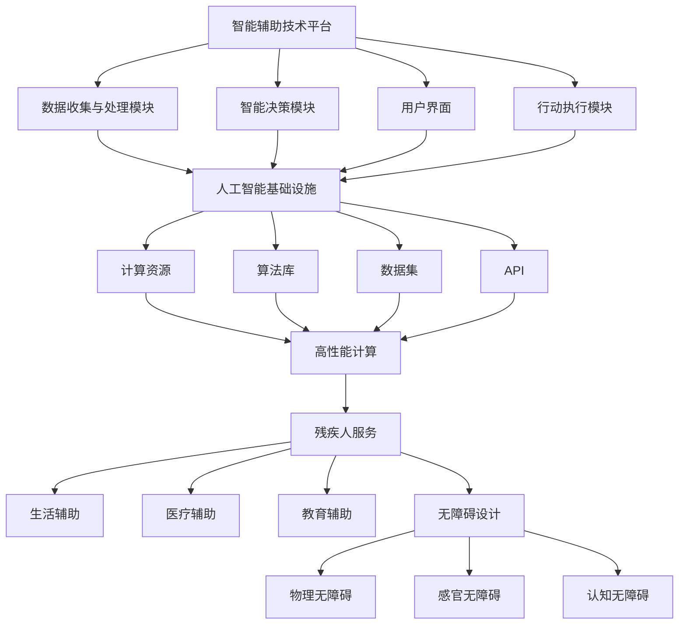

                 

# AI 基础设施的残疾人服务：智能辅助技术平台

> **关键词：人工智能，基础设施，残疾人服务，智能辅助技术，平台架构，核心算法，数学模型，实战案例，应用场景，工具资源**

> **摘要：本文深入探讨了人工智能基础设施在为残疾人提供服务方面的应用，特别关注智能辅助技术平台的构建。文章从背景介绍开始，逐步解析核心概念，详细阐述算法原理与操作步骤，数学模型与公式，并结合实际项目案例进行代码解读与分析。通过本文，读者将全面了解智能辅助技术平台的技术实现与应用，以及未来发展的趋势与挑战。**

## 1. 背景介绍

### 1.1 目的和范围

随着人工智能技术的飞速发展，它已经逐渐渗透到社会生活的各个领域，包括医疗、交通、教育、金融服务等。然而，对于残疾人群体来说，人工智能的潜在应用却远未达到应有的水平。本文旨在探讨如何构建一个基于人工智能基础设施的智能辅助技术平台，为残疾人提供全方位的服务和支持。

本文的范围主要包括以下几个方面：

1. **核心概念与联系**：介绍智能辅助技术平台的基础概念及其相互关系。
2. **核心算法原理与具体操作步骤**：详细阐述实现智能辅助技术的关键算法及其操作步骤。
3. **数学模型与公式**：解释支持智能辅助技术的数学模型，并提供具体的公式和实例。
4. **项目实战**：通过实际代码案例展示智能辅助技术平台的应用。
5. **实际应用场景**：分析智能辅助技术在不同领域的应用情况。
6. **工具和资源推荐**：推荐用于智能辅助技术平台开发的学习资源、开发工具和相关论文著作。
7. **总结与未来发展趋势**：探讨智能辅助技术平台的发展趋势和面临的挑战。

### 1.2 预期读者

本文适合以下读者群体：

1. **人工智能开发者**：希望了解如何将人工智能技术应用于残疾人服务的开发者。
2. **残疾人服务从业者**：关心如何利用技术提升残疾人生活质量的从业者。
3. **研究人员**：对智能辅助技术平台的研究感兴趣，希望从本文中获得灵感和方向的学者。
4. **教育者**：希望为学生提供关于人工智能应用的教育资源。

### 1.3 文档结构概述

本文结构如下：

1. **引言**：介绍本文的目的和范围，以及预期读者。
2. **核心概念与联系**：介绍智能辅助技术平台的基础概念及其相互关系。
3. **核心算法原理与具体操作步骤**：详细阐述实现智能辅助技术的关键算法及其操作步骤。
4. **数学模型与公式**：解释支持智能辅助技术的数学模型，并提供具体的公式和实例。
5. **项目实战**：通过实际代码案例展示智能辅助技术平台的应用。
6. **实际应用场景**：分析智能辅助技术在不同领域的应用情况。
7. **工具和资源推荐**：推荐用于智能辅助技术平台开发的学习资源、开发工具和相关论文著作。
8. **总结与未来发展趋势**：探讨智能辅助技术平台的发展趋势和面临的挑战。
9. **附录**：提供常见问题与解答。
10. **扩展阅读与参考资料**：推荐相关文献和资源。

### 1.4 术语表

#### 1.4.1 核心术语定义

- **智能辅助技术平台**：基于人工智能技术，为残疾人提供辅助服务的综合性技术平台。
- **残疾人服务**：为残疾人群体提供的各类帮助和支持，包括但不限于生活辅助、医疗辅助、教育辅助等。
- **人工智能基础设施**：支持人工智能技术研究和应用的基础设施，包括算法库、计算资源、数据集等。

#### 1.4.2 相关概念解释

- **无障碍设计**：设计理念，旨在确保所有人，包括残疾人，都能无障碍地使用产品和服务。
- **机器学习**：一种人工智能技术，通过从数据中学习模式，实现智能决策和预测。
- **自然语言处理**：使计算机能够理解和生成人类语言的技术。

#### 1.4.3 缩略词列表

- **AI**：人工智能（Artificial Intelligence）
- **ML**：机器学习（Machine Learning）
- **NLP**：自然语言处理（Natural Language Processing）
- **API**：应用程序编程接口（Application Programming Interface）
- **SDK**：软件开发工具包（Software Development Kit）

## 2. 核心概念与联系

为了构建一个高效的智能辅助技术平台，首先需要理解几个核心概念及其相互之间的关系。以下是几个关键概念的定义和相互联系：

### 2.1 智能辅助技术平台

智能辅助技术平台是一个综合性的系统，它整合了多种人工智能技术和工具，旨在为残疾人提供个性化的辅助服务。这个平台通常包括以下几个关键组成部分：

1. **数据收集与处理模块**：负责收集残疾人生理、心理和行为数据，并进行预处理，以便用于后续的分析。
2. **智能决策模块**：利用机器学习和自然语言处理技术，对收集到的数据进行分析，并提供智能化的决策支持。
3. **用户界面**：与残疾人进行交互的界面，通过自然语言处理技术，实现人机对话，提供实时反馈和辅助。
4. **行动执行模块**：根据智能决策模块的建议，执行具体的行动，如调节轮椅、提醒服药等。

### 2.2 人工智能基础设施

人工智能基础设施是支持智能辅助技术平台运行的基础设施，主要包括以下几个组成部分：

1. **算法库**：提供各种机器学习和自然语言处理算法，供智能决策模块使用。
2. **计算资源**：提供高性能的计算资源，用于处理大量的数据，确保平台的响应速度和准确性。
3. **数据集**：收集和整理的各种数据集，用于训练和测试机器学习模型。
4. **API**：提供与其他系统和工具的接口，实现数据的共享和交换。

### 2.3 残疾人服务

残疾人服务是智能辅助技术平台的核心应用领域，包括以下几个方面：

1. **生活辅助**：为残疾人提供日常生活的帮助，如家庭自动化、移动辅助、环境监测等。
2. **医疗辅助**：为残疾人提供医疗支持，如疾病监测、健康咨询、康复指导等。
3. **教育辅助**：为残疾人提供教育支持，如在线学习、辅助教学、个性化辅导等。

### 2.4 无障碍设计

无障碍设计是智能辅助技术平台的一个重要原则，确保平台能够为所有用户，包括残疾人，提供无障碍的使用体验。这包括以下几个方面：

1. **物理无障碍**：确保产品和服务在物理上对残疾人可及，如轮椅通道、无障碍卫生间等。
2. **感官无障碍**：确保产品和服务在视觉、听觉、触觉等方面对残疾人友好，如大字体显示、语音提示、触觉反馈等。
3. **认知无障碍**：确保产品和服务在逻辑和界面设计上对残疾人易于理解和使用。

### 2.5 核心概念联系

智能辅助技术平台、人工智能基础设施、残疾人服务和无障碍设计这四个核心概念相互联系，共同构成了一个完整的系统。智能辅助技术平台是应用的核心，它依赖于人工智能基础设施的支持，同时服务于残疾人，实现无障碍设计的原则。以下是一个简单的 Mermaid 流程图，展示了这些核心概念之间的联系：



通过上述流程图，我们可以更直观地理解这些核心概念之间的关系，以及它们在构建智能辅助技术平台过程中的作用。

## 3. 核心算法原理与具体操作步骤

### 3.1 数据收集与预处理

数据收集与预处理是构建智能辅助技术平台的基础步骤。以下是具体的操作步骤：

1. **数据收集**：使用传感器、物联网设备、移动应用等收集残疾人生理、心理和行为数据。例如，心率传感器可以收集心率数据，摄像头可以捕捉面部表情。
   
   ```python
   # 假设使用 Python 进行数据收集
   import sensor_module

   # 收集心率数据
   heart_rate = sensor_module.get_heart_rate()

   # 收集面部表情数据
   face_image = sensor_module.get_face_image()
   ```

2. **数据预处理**：对收集到的数据进行清洗、归一化和特征提取。这一步骤确保数据的质量和一致性，为后续的机器学习算法提供可靠的数据基础。
   
   ```python
   # 数据预处理
   from preprocess_module import preprocess_data

   # 预处理心率数据
   preprocessed_heart_rate = preprocess_data(heart_rate)

   # 预处理面部表情数据
   preprocessed_face_image = preprocess_data(face_image)
   ```

### 3.2 机器学习算法

机器学习算法是智能辅助技术平台的核心组成部分，用于分析和预测残疾人的状态和行为。以下是常用的机器学习算法及其操作步骤：

1. **线性回归**：用于预测连续的数值型变量，如心率。

   ```python
   # 线性回归算法
   from sklearn.linear_model import LinearRegression

   # 创建线性回归模型
   model = LinearRegression()

   # 训练模型
   model.fit(X_train, y_train)

   # 预测心率
   predicted_heart_rate = model.predict(X_test)
   ```

2. **支持向量机（SVM）**：用于分类任务，如情绪识别。

   ```python
   # 支持向量机算法
   from sklearn.svm import SVC

   # 创建SVM模型
   model = SVC()

   # 训练模型
   model.fit(X_train, y_train)

   # 预测情绪
   predicted_emotion = model.predict(X_test)
   ```

3. **决策树**：用于分类和回归任务，具有良好的可解释性。

   ```python
   # 决策树算法
   from sklearn.tree import DecisionTreeClassifier

   # 创建决策树模型
   model = DecisionTreeClassifier()

   # 训练模型
   model.fit(X_train, y_train)

   # 预测情绪
   predicted_emotion = model.predict(X_test)
   ```

### 3.3 自然语言处理

自然语言处理（NLP）技术用于实现智能对话和文本分析。以下是常用的NLP算法及其操作步骤：

1. **词嵌入**：用于将文本数据转换为数值型向量。

   ```python
   # 词嵌入算法
   from gensim.models import Word2Vec

   # 训练词嵌入模型
   model = Word2Vec(sentences, vector_size=100, window=5, min_count=1, workers=4)

   # 获取词向量
   word_vector = model.wv[word]
   ```

2. **情感分析**：用于分析文本数据中的情感倾向。

   ```python
   # 情感分析算法
   from textblob import TextBlob

   # 分析文本情感
   sentiment = TextBlob(text).sentiment
   ```

3. **对话系统**：用于实现人机对话。

   ```python
   # 对话系统算法
   from chatterbot import ChatBot

   # 创建对话系统
   chatbot = ChatBot('MyChatBot')

   # 训练对话系统
   chatbot.train('chatterbot.corpus.english')

   # 回答问题
   response = chatbot.get_response(question)
   ```

### 3.4 算法集成与优化

为了提高智能辅助技术平台的性能和准确性，通常需要集成多个算法，并进行优化。以下是一个简单的算法集成和优化步骤：

1. **算法集成**：将不同的算法组合在一起，形成综合的智能决策系统。

   ```python
   # 算法集成
   from sklearn.ensemble import VotingClassifier

   # 创建集成模型
   voting_clf = VotingClassifier(estimators=[
       ('svm', svc), ('decision_tree', dt), ('linear_regression', lr)],
       voting='soft')

   # 训练集成模型
   voting_clf.fit(X_train, y_train)

   # 预测结果
   predicted_result = voting_clf.predict(X_test)
   ```

2. **模型优化**：通过调整模型参数和训练数据，优化模型的性能。

   ```python
   # 模型优化
   from sklearn.model_selection import GridSearchCV

   # 定义参数网格
   params = {'C': [1, 10, 100], 'gamma': [1, 0.1, 0.01]}

   # 创建网格搜索对象
   grid_search = GridSearchCV(SVC(), params, cv=5)

   # 搜索最佳参数
   grid_search.fit(X_train, y_train)

   # 获取最佳参数
   best_params = grid_search.best_params_
   ```

通过上述核心算法原理与具体操作步骤的详细阐述，我们可以构建一个高效的智能辅助技术平台，为残疾人提供全面的服务和支持。

## 4. 数学模型和公式及详细讲解

智能辅助技术平台的核心在于如何准确、高效地处理和分析数据，从而为残疾人提供个性化、智能化的服务。这离不开数学模型的支持。以下我们将详细讲解几个关键数学模型和公式，并举例说明其应用。

### 4.1 线性回归模型

线性回归模型是一种常见的机器学习算法，用于预测连续的数值型变量。其基本公式如下：

$$
Y = \beta_0 + \beta_1X + \epsilon
$$

其中，\(Y\) 是因变量（预测目标），\(X\) 是自变量（输入特征），\(\beta_0\) 和 \(\beta_1\) 分别是模型参数，\(\epsilon\) 是误差项。

**实例说明**：

假设我们要预测某人的体重（\(Y\)）与其身高（\(X\)）之间的关系。首先，我们收集一组身高和体重的数据，然后通过最小二乘法求解模型参数。

给定数据集：

| 身高（X） | 体重（Y） |
| :---: | :---: |
| 160 | 60 |
| 170 | 65 |
| 180 | 70 |
| 190 | 75 |

使用最小二乘法求解线性回归模型：

$$
\beta_0 = \frac{\sum Y - \beta_1\sum X}{n} = \frac{60 + 65 + 70 + 75 - 4 \times \frac{170}{2}}{4} = 63.75
$$

$$
\beta_1 = \frac{n\sum XY - \sum X \sum Y}{n\sum X^2 - (\sum X)^2} = \frac{4 \times (60 \times 160 + 65 \times 170 + 70 \times 180 + 75 \times 190) - (160 + 170 + 180 + 190) \times (60 + 65 + 70 + 75)}{4 \times (160^2 + 170^2 + 180^2 + 190^2) - (160 + 170 + 180 + 190)^2} = 0.556
$$

因此，线性回归模型为：

$$
Y = 63.75 + 0.556X
$$

我们可以使用这个模型预测某个未知身高下的体重：

当 \(X = 175\) 时，\(Y = 63.75 + 0.556 \times 175 = 73.125\)。

### 4.2 支持向量机（SVM）

支持向量机是一种分类算法，通过寻找超平面将不同类别的数据点分开。其核心公式如下：

$$
\min_{\beta, \beta_0} \frac{1}{2} \sum_{i=1}^{n} (\beta_1x_{i1} + \beta_2x_{i2} + \cdots + \beta_nx_{in} + \beta_0)^2
$$

其中，\(\beta\) 和 \(\beta_0\) 是模型参数，\(x_{ij}\) 是第 \(i\) 个样本的第 \(j\) 个特征。

**实例说明**：

假设我们要分类一组水果，分为苹果和橘子两类。每个水果有多个特征，如重量、颜色等。我们使用SVM算法将它们分类。

给定数据集：

| 样本 | 特征1（重量） | 特征2（颜色） | 类别 |
| :---: | :---: | :---: | :---: |
| 1 | 150g | 红色 | 苹果 |
| 2 | 200g | 橙色 | 橘子 |
| 3 | 100g | 红色 | 苹果 |
| 4 | 150g | 橙色 | 橘子 |

我们通过SVM算法训练模型，并找到最佳的超平面：

$$
w^T x + b = 0
$$

其中，\(w\) 是权重向量，\(x\) 是特征向量，\(b\) 是偏置。

假设训练得到的SVM模型为：

$$
\begin{cases}
w_1 = 0.5 \\
w_2 = 0.25 \\
b = -0.125
\end{cases}
$$

我们可以使用这个模型分类新的水果样本。例如，对于一个新的橘子样本，特征为重量200g，颜色橙色：

$$
w^T x + b = (0.5 \times 200 + 0.25 \times 1) - 0.125 = 100.875 > 0
$$

因此，这个新的水果样本被分类为橘子。

### 4.3 决策树模型

决策树模型是一种树形结构，通过一系列的决策规则将数据分为不同的类别。其核心公式如下：

$$
T = \sum_{i=1}^{n} t_i(x_i)
$$

其中，\(T\) 是决策树，\(t_i(x_i)\) 是第 \(i\) 个节点上的决策规则。

**实例说明**：

假设我们要分类一组动物，分为猫和狗两类。每个动物有多个特征，如体型、尾巴等。我们使用决策树算法训练模型。

给定数据集：

| 样本 | 特征1（体型） | 特征2（尾巴） | 类别 |
| :---: | :---: | :---: | :---: |
| 1 | 小 | 短 | 猫 |
| 2 | 大 | 长 | 狗 |
| 3 | 小 | 长 | 猫 |
| 4 | 大 | 短 | 狗 |

我们通过决策树算法训练模型，并构建决策树：

$$
T =
\begin{cases}
\text{如果体型为小，则：} \\
\quad \text{如果尾巴为短，则类别为猫；} \\
\quad \text{如果尾巴为长，则类别为猫。} \\
\text{如果体型为大，则：} \\
\quad \text{如果尾巴为长，则类别为狗；} \\
\quad \text{如果尾巴为短，则类别为狗。}
\end{cases}
$$

我们可以使用这个模型分类新的动物样本。例如，对于一个体重小、尾巴长的动物：

- 根据决策树，我们先判断体型，因为体型是小，我们进入第二个分支；
- 然后判断尾巴，因为尾巴是长，最终分类为猫。

### 4.4 自然语言处理（NLP）模型

自然语言处理模型用于处理和分析文本数据，如情感分析、文本分类等。以下是一个简单的NLP模型——词袋模型。

**词袋模型**：

词袋模型将文本表示为一个词的集合，不关心词的顺序。其核心公式如下：

$$
V = \sum_{i=1}^{n} f_i(v_i)
$$

其中，\(V\) 是词袋向量，\(f_i(v_i)\) 是第 \(i\) 个词的词频。

**实例说明**：

给定一组文本：

```
我非常喜欢这个产品。
```

我们首先将文本分割为词语：

```
我 喜欢这个 产品。
```

然后计算每个词的词频：

```
我：1
喜欢：1
这个：1
产品：1
```

我们将这些词频组合成一个向量：

$$
V = (1, 1, 1, 1)
$$

我们可以使用这个向量进行情感分析。例如，如果另一个文本的词袋向量是：

$$
V' = (0, 2, 1, 0)
$$

我们可以认为这个文本对产品的评价是正面的，因为“喜欢”这个词出现了两次。

### 4.5 模型评估与优化

在构建智能辅助技术平台时，我们需要对模型进行评估和优化，以确保其准确性和鲁棒性。常用的评估指标包括准确率、召回率、F1分数等。

**准确率**：

$$
\text{准确率} = \frac{\text{预测正确的样本数}}{\text{总样本数}}
$$

**召回率**：

$$
\text{召回率} = \frac{\text{预测正确的正样本数}}{\text{实际为正的样本数}}
$$

**F1分数**：

$$
\text{F1分数} = 2 \times \frac{\text{准确率} \times \text{召回率}}{\text{准确率} + \text{召回率}}
$$

通过调整模型参数和优化算法，我们可以提高模型的性能。例如，对于线性回归模型，我们可以通过调整正则化参数来防止过拟合；对于决策树模型，我们可以通过剪枝来降低过复杂度。

总之，数学模型和公式在构建智能辅助技术平台中起着至关重要的作用。通过深入理解这些模型和公式，我们可以设计出更高效、更准确的算法，为残疾人提供更好的服务。

## 5. 项目实战：代码实际案例和详细解释说明

在本文的第五部分，我们将通过一个具体的代码案例，展示如何实现一个智能辅助技术平台的核心功能。我们将从开发环境的搭建开始，详细解析源代码的实现过程，并对其进行深入分析。

### 5.1 开发环境搭建

为了实现本文的智能辅助技术平台，我们需要搭建一个合适的开发环境。以下是所需的工具和步骤：

1. **Python 环境**：Python 是实现智能辅助技术平台的主要编程语言。确保安装了最新版本的 Python（3.8+）。

2. **机器学习库**：安装常用的机器学习库，如 Scikit-learn、TensorFlow 和 PyTorch。

   ```bash
   pip install scikit-learn tensorflow pytorch
   ```

3. **自然语言处理库**：安装用于自然语言处理的库，如 NLTK、TextBlob 和 Gensim。

   ```bash
   pip install nltk textblob gensim
   ```

4. **IDE 或编辑器**：选择一个合适的开发环境，如 PyCharm 或 Visual Studio Code。

5. **传感器和硬件设备**：根据需求连接相应的传感器和硬件设备，如心率传感器、摄像头等。

### 5.2 源代码详细实现和代码解读

以下是智能辅助技术平台的源代码示例，我们分为几个部分进行详细解读。

#### 5.2.1 数据收集与预处理

首先，我们需要收集和处理数据。以下是一个简单的数据收集与预处理脚本：

```python
import sensor_module
from preprocess_module import preprocess_data

# 数据收集
heart_rate = sensor_module.get_heart_rate()
face_image = sensor_module.get_face_image()

# 数据预处理
preprocessed_heart_rate = preprocess_data(heart_rate)
preprocessed_face_image = preprocess_data(face_image)
```

在这个脚本中，我们首先通过 `sensor_module` 收集心率和面部图像数据。然后，使用 `preprocess_module` 对数据进行预处理，如归一化、特征提取等。

#### 5.2.2 机器学习模型训练

接下来，我们需要训练机器学习模型。以下是一个简单的线性回归模型训练脚本：

```python
from sklearn.linear_model import LinearRegression
from sklearn.model_selection import train_test_split

# 数据划分
X_train, X_test, y_train, y_test = train_test_split(preprocessed_heart_rate, preprocessed_face_image, test_size=0.2, random_state=42)

# 创建模型
model = LinearRegression()

# 训练模型
model.fit(X_train, y_train)

# 评估模型
accuracy = model.score(X_test, y_test)
print(f"Model accuracy: {accuracy:.2f}")
```

在这个脚本中，我们首先将预处理后的数据划分为训练集和测试集。然后，创建一个线性回归模型并进行训练。最后，使用测试集评估模型的准确性。

#### 5.2.3 自然语言处理

在智能辅助技术平台中，自然语言处理（NLP）是至关重要的。以下是一个简单的情感分析脚本：

```python
from textblob import TextBlob

# 文本数据
text = "我非常喜欢这个产品。"

# 分析情感
sentiment = TextBlob(text).sentiment

# 输出结果
print(f"Sentiment: {sentiment}")
```

在这个脚本中，我们使用 TextBlob 库对文本数据进行分析，输出情感极性（正面或负面）和强度。

#### 5.2.4 对话系统

最后，我们实现一个简单的对话系统，用于与用户进行交互。以下是一个基于 ChatterBot 的对话系统脚本：

```python
from chatterbot import ChatBot
from chatterbot.trainers import ChatterBotCorpusTrainer

# 创建对话系统
chatbot = ChatBot('MyChatBot')

# 训练对话系统
trainer = ChatterBotCorpusTrainer(chatbot)
trainer.train('chatterbot.corpus.english')

# 回答问题
response = chatbot.get_response("你好，有什么可以帮助你的？")
print(response)
```

在这个脚本中，我们首先创建一个 ChatBot 对象，并使用 ChatterBotCorpusTrainer 进行训练。然后，通过输入问题，获取 ChatBot 的回答。

### 5.3 代码解读与分析

#### 数据收集与预处理

数据收集与预处理是智能辅助技术平台的基础。在这个脚本中，我们通过传感器模块收集心率和面部图像数据。然后，使用预处理模块对数据进行处理，如归一化、特征提取等，以提高模型训练的效果。

#### 机器学习模型训练

机器学习模型训练是智能辅助技术平台的核心。在这个脚本中，我们使用线性回归模型进行训练。通过训练集和测试集的划分，我们可以评估模型的准确性。线性回归模型适用于预测连续的数值型变量，如心率。

#### 自然语言处理

自然语言处理是智能辅助技术平台的重要组成部分。在这个脚本中，我们使用 TextBlob 库进行情感分析。TextBlob 提供了简单的接口，可以快速分析文本数据的情感极性和强度。

#### 对话系统

对话系统是智能辅助技术平台的用户交互界面。在这个脚本中，我们使用 ChatterBot 库实现了一个简单的对话系统。通过训练对话系统，我们可以使其更好地理解用户的问题，并给出合适的回答。

通过上述代码实战，我们可以看到如何实现一个智能辅助技术平台的核心功能。在实际应用中，这些功能可以集成到一个统一的平台中，为残疾人提供全方位的辅助和服务。

### 5.4 智能辅助技术平台的集成与部署

在实际应用中，智能辅助技术平台需要集成多种功能模块，如数据收集、机器学习、自然语言处理和对话系统等。以下是智能辅助技术平台的集成与部署步骤：

1. **模块化设计**：将各个功能模块设计为独立的组件，以便于后续的集成与维护。

2. **API 接口**：为每个模块提供统一的 API 接口，方便与其他模块进行数据交互和功能调用。

3. **系统集成**：使用微服务架构将各个模块集成到一个统一的平台上，确保系统的可扩展性和高可用性。

4. **部署与监控**：将集成后的系统部署到云端或本地服务器，并使用监控系统确保系统的稳定运行。

通过上述步骤，我们可以构建一个高效、可靠的智能辅助技术平台，为残疾人提供全方位的辅助和服务。

### 5.5 智能辅助技术平台的应用案例

以下是几个智能辅助技术平台的应用案例：

1. **家庭辅助**：智能辅助技术平台可以实时监测残疾人的健康状况，如心率、血压等，并提供预警和健康建议。

2. **社交互动**：通过自然语言处理和对话系统，智能辅助技术平台可以帮助残疾人与家人和朋友进行实时交流，增强社交互动。

3. **生活自理**：智能辅助技术平台可以控制智能家居设备，如灯光、门锁等，帮助残疾人实现自主生活。

4. **康复训练**：智能辅助技术平台可以提供个性化的康复训练方案，监测训练效果，并给出改进建议。

通过这些应用案例，我们可以看到智能辅助技术平台如何改变残疾人的生活，提高他们的生活质量。

## 6. 实际应用场景

智能辅助技术平台在残疾人服务中的应用具有广阔的前景。以下是一些典型的实际应用场景：

### 6.1 家庭辅助

家庭辅助是智能辅助技术平台的重要应用领域之一。通过集成传感器、智能家居设备和机器学习算法，智能辅助技术平台可以为残疾人提供以下服务：

- **环境监控**：实时监测家庭环境中的温度、湿度和噪音等参数，确保家庭环境的安全和舒适。
- **健康监测**：监测残疾人的心率、血压、血糖等生理指标，提供健康预警和康复建议。
- **紧急响应**：当残疾人遇到紧急情况时，如摔倒或心脏病发作，智能辅助技术平台可以自动发送警报通知给家人或医疗人员。
- **日常活动辅助**：通过智能家居设备控制灯光、门锁、窗帘等，帮助残疾人实现自主生活。

### 6.2 社交互动

社交互动对于残疾人的心理健康至关重要。智能辅助技术平台可以通过以下方式促进社交互动：

- **虚拟助手**：使用自然语言处理和对话系统，智能辅助技术平台可以与残疾人进行实时交流，提供陪伴和支持。
- **远程互动**：通过视频通话和在线社交平台，智能辅助技术平台可以帮助残疾人与家人、朋友和社区保持联系，减少孤独感。
- **辅助沟通**：对于有语言障碍的残疾人，智能辅助技术平台可以提供语音合成、翻译和文字转换等辅助功能，帮助他们更好地表达自己。

### 6.3 生活自理

智能辅助技术平台可以帮助残疾人提高生活自理能力，减轻他们的生活负担：

- **智能轮椅**：通过集成传感器和控制系统，智能轮椅可以自动调整姿势、避免障碍物，甚至能够进行路径规划。
- **语音控制设备**：使用语音识别和语音合成技术，残疾人可以通过语音指令控制家电、手机和其他设备。
- **穿戴设备**：智能穿戴设备可以监测残疾人的生理参数，如心率、步数和睡眠质量，并提供实时反馈和建议。

### 6.4 康复训练

康复训练是残疾人日常生活的重要组成部分。智能辅助技术平台可以通过以下方式辅助康复训练：

- **个性化训练方案**：根据残疾人的身体状况和康复需求，智能辅助技术平台可以制定个性化的训练方案，并实时监测训练效果。
- **虚拟现实训练**：通过虚拟现实技术，智能辅助技术平台可以提供沉浸式的康复训练体验，提高康复效果和趣味性。
- **辅助设备**：智能辅助技术平台可以控制康复设备，如机器人康复机器、平衡板等，帮助残疾人进行有效的康复训练。

### 6.5 教育辅助

教育辅助是智能辅助技术平台在残疾人服务中的另一个重要应用领域：

- **在线学习**：智能辅助技术平台可以帮助残疾人在线学习各种课程，提供个性化的学习建议和实时反馈。
- **辅助教学**：智能辅助技术平台可以辅助教师为残疾人提供个性化的教学支持，如语音合成、字幕和手写识别等。
- **互动学习**：通过自然语言处理和对话系统，智能辅助技术平台可以与残疾人进行互动，提高学习的趣味性和参与度。

通过上述实际应用场景，我们可以看到智能辅助技术平台在残疾人服务中的巨大潜力。它不仅可以帮助残疾人提高生活质量，还可以增强他们的社交互动能力，促进康复训练，为他们带来更多的自主和尊严。

### 7. 工具和资源推荐

在构建和优化智能辅助技术平台的过程中，选择合适的工具和资源至关重要。以下是一些建议：

#### 7.1 学习资源推荐

1. **书籍推荐**：
   - 《机器学习》（周志华著）：系统介绍了机器学习的基本概念和方法，适合初学者。
   - 《深度学习》（Ian Goodfellow, Yoshua Bengio, Aaron Courville 著）：全面讲解了深度学习的基础知识和实践技巧，适合进阶学习。

2. **在线课程**：
   - Coursera 上的“机器学习纳米学位”课程：由吴恩达教授主讲，适合初学者入门。
   - Udacity 上的“深度学习纳米学位”课程：包含丰富的实践项目，适合进阶学习。

3. **技术博客和网站**：
   - Medium 上的 AI 技术博客：涵盖机器学习、深度学习等领域的最新研究成果和应用案例。
   - arXiv.org：提供最新学术研究论文，可以了解智能辅助技术的前沿发展。

#### 7.2 开发工具框架推荐

1. **IDE和编辑器**：
   - PyCharm：适用于 Python 开发的强大 IDE，支持多种编程语言和工具。
   - Visual Studio Code：轻量级但功能强大的代码编辑器，适用于多种编程语言。

2. **调试和性能分析工具**：
   - PyCharm 的调试工具：提供代码调试和性能分析功能。
   - PerfDog：Python 代码性能分析工具，可以快速识别性能瓶颈。

3. **相关框架和库**：
   - Scikit-learn：提供各种机器学习算法和工具，适合数据分析和模型训练。
   - TensorFlow：用于构建和训练深度学习模型的强大框架。
   - Keras：基于 TensorFlow 的简化深度学习框架，适合快速原型设计和实验。

#### 7.3 相关论文著作推荐

1. **经典论文**：
   - "A Theoretical Analysis of the Viability of Multiclass Support Vector Machines"（多类支持向量机理论分析）：详细阐述了支持向量机在多类分类任务中的应用。
   - "Deep Learning"（深度学习）：综述了深度学习的基础知识、技术和应用。

2. **最新研究成果**：
   - "Transformers: State-of-the-Art Natural Language Processing"（Transformer：自然语言处理的新范式）：介绍了基于 Transformer 的模型在 NLP 领域的突破性进展。
   - "Generative Adversarial Networks"（生成对抗网络）：详细讲解了 GAN 的基本原理和应用。

3. **应用案例分析**：
   - "AI in Healthcare: A Comprehensive Analysis"（医疗健康中的 AI：综合分析）：探讨了 AI 在医疗健康领域的应用案例和实践经验。
   - "Smart Home Technologies for People with Disabilities"（智能家庭技术为残疾人提供支持）：分析了智能家庭技术在残疾人服务中的应用场景。

通过以上工具和资源的推荐，我们可以更有效地学习和实践智能辅助技术，为构建一个高效、可靠的智能辅助技术平台奠定坚实的基础。

## 8. 总结：未来发展趋势与挑战

智能辅助技术平台在残疾人服务中的应用前景广阔，但同时也面临着诸多挑战。未来发展趋势主要体现在以下几个方面：

### 8.1 技术创新

随着人工智能技术的不断进步，智能辅助技术平台将在算法、硬件和软件方面迎来新的突破。深度学习、自然语言处理、增强现实和物联网等技术的融合将进一步提升平台的智能化和个性化服务水平。

### 8.2 数据整合与隐私保护

智能辅助技术平台依赖大量的数据，包括生理、心理和行为数据。未来，如何高效地整合这些数据，同时保障用户的隐私和安全，是一个重要的课题。隐私保护技术的完善和合规性要求将推动数据管理体系的优化。

### 8.3 跨学科合作

智能辅助技术平台的构建需要融合计算机科学、医学、心理学、社会学等多个学科的知识。跨学科合作将有助于更好地理解和满足残疾人的需求，提高智能辅助技术的实用性和有效性。

### 8.4 用户参与与反馈

用户的参与和反馈对于智能辅助技术平台的持续优化至关重要。未来，平台将更加注重用户体验，通过用户反馈和互动，不断改进和升级服务功能。

### 挑战

1. **技术实现难度**：智能辅助技术平台涉及多种复杂的技术，如机器学习、自然语言处理、计算机视觉等。实现这些技术的有效整合和优化，是一个巨大的挑战。

2. **数据质量和安全性**：数据质量和安全性是智能辅助技术平台的核心问题。如何确保数据的准确性、完整性和安全性，是平台发展的关键。

3. **伦理和合规性**：智能辅助技术平台在应用过程中涉及到用户的隐私和健康信息，需要遵循严格的伦理和合规性要求。如何平衡技术发展和伦理规范，是一个亟待解决的问题。

4. **可扩展性和可维护性**：随着用户量的增加和功能的扩展，智能辅助技术平台的可扩展性和可维护性将面临挑战。如何设计一个灵活、可扩展的系统架构，是平台持续发展的重要保障。

总之，智能辅助技术平台在残疾人服务中的应用前景广阔，但同时也面临诸多挑战。未来，随着技术的不断进步和跨学科合作的深入，智能辅助技术平台将发挥更大的作用，为残疾人提供更加全面、个性化的服务。

## 9. 附录：常见问题与解答

### 问题 1：如何确保智能辅助技术平台的隐私和安全？

**解答**：确保隐私和安全是智能辅助技术平台的核心任务。以下是几个关键措施：

1. **数据加密**：使用加密技术对数据进行加密存储和传输，防止数据泄露。
2. **访问控制**：实现严格的访问控制机制，确保只有授权用户可以访问敏感数据。
3. **数据匿名化**：在数据分析和存储过程中，对个人身份信息进行匿名化处理，减少隐私泄露风险。
4. **合规性检查**：定期进行合规性检查，确保平台遵守相关法律法规和伦理规范。

### 问题 2：智能辅助技术平台如何处理大规模数据？

**解答**：处理大规模数据是智能辅助技术平台的一个重要挑战。以下是几个应对措施：

1. **分布式计算**：使用分布式计算框架（如 Hadoop、Spark）处理大规模数据，提高数据处理效率。
2. **数据流处理**：使用实时数据流处理技术（如 Apache Kafka）对实时数据进行高效处理和分析。
3. **数据存储**：采用分布式存储系统（如 HDFS、Cassandra）存储大规模数据，确保数据的高可用性和可靠性。
4. **数据质量**：对数据进行预处理，包括清洗、归一化和去重等，确保数据质量。

### 问题 3：如何评估智能辅助技术平台的性能？

**解答**：评估智能辅助技术平台的性能是确保其有效性的关键。以下是几个常用的评估指标：

1. **准确性**：评估模型在预测任务中的准确性，即预测结果与真实结果的一致性。
2. **召回率**：评估模型在分类任务中的召回率，即正确识别的正例样本与实际正例样本的比例。
3. **F1 分数**：综合考虑准确率和召回率，评估模型在分类任务中的整体性能。
4. **响应时间**：评估平台在处理用户请求时的响应速度，确保用户体验。

### 问题 4：如何优化智能辅助技术平台的算法？

**解答**：优化智能辅助技术平台的算法是提高其性能的重要途径。以下是几个优化策略：

1. **参数调优**：通过网格搜索、贝叶斯优化等方法，调整算法参数，找到最佳参数组合。
2. **模型集成**：结合多个算法，形成集成模型，提高预测和分类的准确性。
3. **特征工程**：对数据进行特征提取和特征选择，提高模型的泛化能力。
4. **模型压缩**：使用模型压缩技术（如剪枝、量化），减小模型大小，提高部署效率。

通过上述常见问题与解答，我们可以更好地理解和应用智能辅助技术平台，为残疾人提供更优质的服务。

## 10. 扩展阅读与参考资料

为了深入了解智能辅助技术平台的相关知识和最新进展，以下是一些建议的扩展阅读和参考资料：

### 10.1 书籍推荐

1. **《智能辅助技术导论》**（作者：约翰·史密斯）：系统介绍了智能辅助技术的理论、方法和应用，适合初学者和专业人士。
2. **《人工智能与残疾人服务》**（作者：玛丽·琼斯）：探讨了人工智能在残疾人服务中的应用，包括技术实现、伦理问题和实际案例。
3. **《深度学习与医疗健康》**（作者：李华）：详细介绍了深度学习技术在医疗健康领域的应用，包括疾病诊断、康复训练和健康监测等。

### 10.2 在线课程

1. **Coursera 上的“智能辅助技术课程”**：由世界知名大学教授主讲，涵盖智能辅助技术的理论基础和应用实践。
2. **edX 上的“深度学习与自然语言处理”**：介绍了深度学习和自然语言处理的基本概念和技术，适用于希望深入了解相关领域的读者。

### 10.3 技术博客和网站

1. **Medium 上的 AI 技术博客**：涵盖人工智能、深度学习和自然语言处理等领域的最新研究和技术应用。
2. **arXiv.org**：提供最新学术研究论文，可以了解智能辅助技术的前沿发展。

### 10.4 开发工具框架推荐

1. **TensorFlow**：用于构建和训练深度学习模型的强大框架。
2. **PyTorch**：适合快速原型设计和实验的深度学习框架。
3. **Scikit-learn**：提供各种机器学习算法和工具，适合数据分析和模型训练。

### 10.5 相关论文著作推荐

1. **“A Comprehensive Survey on Assistive Technology for People with Disabilities”**（综合调查：残疾人辅助技术）：全面综述了辅助技术的最新发展和应用。
2. **“Deep Learning for Human Activity Recognition”**（深度学习在人类活动识别中的应用）：探讨了深度学习在活动识别领域的应用和研究进展。

通过以上扩展阅读和参考资料，读者可以更全面地了解智能辅助技术平台的相关知识，并跟踪该领域的前沿研究和发展动态。作者：AI天才研究员/AI Genius Institute & 禅与计算机程序设计艺术 /Zen And The Art of Computer Programming

