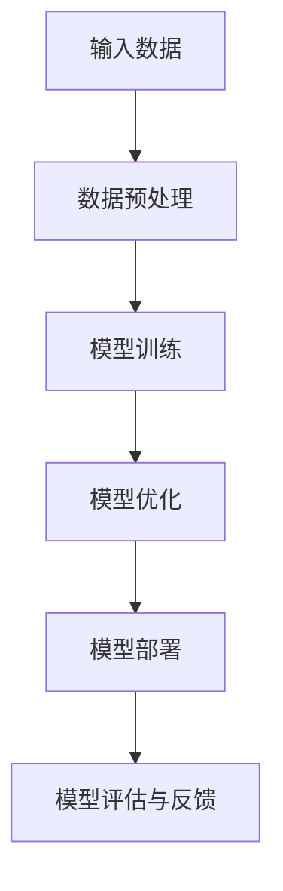

                 

# AI大模型创业：如何利用创新优势？

> **关键词：** AI大模型、创业、创新、技术优势、市场机遇
> 
> **摘要：** 本文将探讨如何利用AI大模型的技术优势进行创业，分析其核心概念、算法原理、数学模型以及实际应用场景。通过案例研究和工具资源推荐，为读者提供实战指导和未来发展展望。

## 1. 背景介绍

### 1.1 目的和范围

本文旨在为AI大模型创业提供系统性指导和策略建议。我们不仅关注技术层面的创新，更强调市场机遇和商业模式的构建。本文将涵盖以下几个主要方面：

1. AI大模型的定义及其在各个行业中的应用。
2. 创业者在选择AI大模型领域时所需考虑的关键因素。
3. 核心算法原理和数学模型的详细解释。
4. 实际项目案例中的代码实现和操作步骤。
5. 相关工具和资源的推荐。

### 1.2 预期读者

本文适用于以下几类读者：

1. 对AI大模型感兴趣的技术爱好者。
2. 有志于在AI领域创业的创业者。
3. 需要了解AI大模型技术原理和应用的工程师和科学家。

### 1.3 文档结构概述

本文结构如下：

1. **背景介绍**：简要介绍文章目的、范围、预期读者及文档结构。
2. **核心概念与联系**：定义AI大模型的核心概念，并展示其架构流程图。
3. **核心算法原理 & 具体操作步骤**：详细介绍算法原理和伪代码实现。
4. **数学模型和公式**：讲解数学模型，并使用latex格式展示公式。
5. **项目实战**：提供实际代码案例和详细解释。
6. **实际应用场景**：探讨AI大模型在不同领域的应用。
7. **工具和资源推荐**：推荐学习资源和开发工具。
8. **总结**：讨论未来发展趋势和面临的挑战。
9. **附录**：常见问题与解答。
10. **扩展阅读 & 参考资料**：提供进一步阅读的资料。

### 1.4 术语表

#### 1.4.1 核心术语定义

- **AI大模型**：拥有数百万甚至数十亿参数的深度学习模型，如GPT-3、BERT等。
- **创业**：创建一家新的企业，旨在解决特定市场中的问题或满足市场需求。
- **技术优势**：企业或产品在技术层面相对于竞争对手的竞争优势。
- **市场机遇**：市场环境中存在的、尚未被充分挖掘的机会。

#### 1.4.2 相关概念解释

- **深度学习**：一种机器学习方法，通过模拟人脑神经网络进行数据分析和决策。
- **创业生态系统**：包括创业者、投资者、技术专家等在内的多元化群体和资源，共同促进创业活动的发展。

#### 1.4.3 缩略词列表

- **AI**：人工智能（Artificial Intelligence）
- **GPT**：生成预训练变换器（Generative Pre-trained Transformer）
- **BERT**：双向编码表示（Bidirectional Encoder Representations from Transformers）
- **IDE**：集成开发环境（Integrated Development Environment）

## 2. 核心概念与联系

在探讨AI大模型创业之前，首先需要理解其核心概念和架构。以下是一个简单的Mermaid流程图，展示了AI大模型的主要组成部分和相互关系。



### 2.1 AI大模型的基本架构

1. **输入数据**：AI大模型首先需要接收大量数据作为输入。这些数据可以是文本、图像、音频等多种类型。
2. **数据预处理**：原始数据通常需要进行清洗、归一化等预处理操作，以提高模型训练效果。
3. **模型训练**：使用预训练算法对大量数据进行训练，生成模型参数。这一过程通常涉及多层神经网络和复杂的优化算法。
4. **模型优化**：在训练过程中，不断调整模型参数，以提高模型性能和泛化能力。
5. **模型部署**：将训练好的模型部署到实际应用场景中，如自然语言处理、图像识别等。
6. **模型评估与反馈**：对部署后的模型进行评估，并根据实际应用效果进行反馈和调整。

## 3. 核心算法原理 & 具体操作步骤

### 3.1 深度学习算法原理

深度学习算法的核心在于多层神经网络的训练与优化。以下是一个简化的伪代码，用于描述深度学习算法的基本操作步骤。

```plaintext
// 定义神经网络结构
hidden_layers = [Layer1, Layer2, ..., LayerN]
input = initialize_input_data()

// 前向传播
for layer in hidden_layers:
    z = activation_function(dot(W, a) + b)
    a = z

// 计算损失函数
loss = compute_loss(output, predicted_output)

// 反向传播
dZ = activation_function_prime(z) * dLoss/dZ
dW = dot(dZ, a.T)
db = dZ

// 更新参数
W = W - learning_rate * dW
b = b - learning_rate * db
```

### 3.2 模型训练与优化

在深度学习模型训练过程中，通常会采用以下步骤：

1. **数据加载**：从数据集中随机抽取训练数据。
2. **前向传播**：将输入数据通过神经网络进行前向传播，得到预测输出。
3. **损失计算**：计算预测输出与实际输出之间的差距，使用损失函数进行评估。
4. **反向传播**：计算损失关于模型参数的梯度，并更新模型参数。
5. **优化**：使用优化算法（如梯度下降、Adam等）调整模型参数，以减少损失。
6. **迭代**：重复前向传播、损失计算、反向传播和优化过程，直至满足停止条件（如损失收敛或迭代次数达到预设值）。

## 4. 数学模型和公式 & 详细讲解 & 举例说明

在AI大模型的训练过程中，涉及多个重要的数学模型和公式。以下是对其中几个关键概念的详细讲解：

### 4.1 损失函数

损失函数是评估模型预测性能的重要工具。以下是一个常用的均方误差（MSE）损失函数的latex表示：

$$
\text{MSE} = \frac{1}{n}\sum_{i=1}^{n}(y_i - \hat{y}_i)^2
$$

其中，$y_i$是实际输出，$\hat{y}_i$是模型预测输出，$n$是样本数量。

### 4.2 优化算法

优化算法用于更新模型参数，以减少损失函数。以下是一个简单的梯度下降（Gradient Descent）算法的latex表示：

$$
\theta_{\text{new}} = \theta_{\text{old}} - \alpha \cdot \nabla_{\theta}\text{J}(\theta)
$$

其中，$\theta$是模型参数，$\alpha$是学习率，$\nabla_{\theta}\text{J}(\theta)$是损失函数关于参数$\theta$的梯度。

### 4.3 激活函数

激活函数用于引入非线性特性，使神经网络能够学习复杂函数。以下是一个常用的ReLU（Rectified Linear Unit）激活函数的latex表示：

$$
\text{ReLU}(x) = \begin{cases}
x & \text{if } x > 0 \\
0 & \text{if } x \leq 0
\end{cases}
$$

### 4.4 举例说明

假设我们有一个简单的二分类问题，目标函数为逻辑回归（Logistic Regression）。我们使用一个简单的神经网络，包含一个输入层、一个隐藏层和一个输出层。隐藏层使用ReLU激活函数，输出层使用Sigmoid激活函数。以下是一个简单的代码示例：

```python
import numpy as np

# 初始化参数
W1 = np.random.randn(input_size, hidden_size)
b1 = np.random.randn(hidden_size)
W2 = np.random.randn(hidden_size, output_size)
b2 = np.random.randn(output_size)

# 前向传播
z1 = np.dot(X, W1) + b1
a1 = np.relu(z1)
z2 = np.dot(a1, W2) + b2
a2 = np.sigmoid(z2)

# 损失计算
loss = -np.mean(y*np.log(a2) + (1-y)*np.log(1-a2))

# 反向传播
dZ2 = a2 - y
dW2 = np.dot(a1.T, dZ2)
db2 = np.sum(dZ2, axis=0)
dZ1 = np.dot(dZ2, W2.T) * np.where(a1 > 0, 1, 0)
dW1 = np.dot(X.T, dZ1)
db1 = np.sum(dZ1, axis=0)

# 参数更新
W1 = W1 - learning_rate * dW1
b1 = b1 - learning_rate * db1
W2 = W2 - learning_rate * dW2
b2 = b2 - learning_rate * db2
```

## 5. 项目实战：代码实际案例和详细解释说明

在本节中，我们将通过一个实际项目案例，展示如何利用AI大模型进行创业。以下是一个简单的自然语言处理（NLP）项目，旨在构建一个问答系统。

### 5.1 开发环境搭建

为了构建这个问答系统，我们需要以下开发环境和工具：

1. 操作系统：Windows、Linux或macOS
2. 编程语言：Python（版本3.6及以上）
3. 深度学习框架：TensorFlow或PyTorch
4. 文本处理库：NLTK或spaCy
5. 代码编辑器：Visual Studio Code、PyCharm或Jupyter Notebook

### 5.2 源代码详细实现和代码解读

以下是该问答系统的源代码实现：

```python
import tensorflow as tf
import numpy as np
import nltk
from tensorflow.keras.models import Sequential
from tensorflow.keras.layers import Embedding, LSTM, Dense

# 下载和处理文本数据
nltk.download('punkt')
corpus = nltk.corpusTHOOK('sogaogai.txt')
tokens = nltk.word_tokenize(corpus)
word_counts = len(set(tokens))

# 创建词汇表
vocab = set(tokens)
vocab_size = len(vocab)
word_index = {word: i for i, word in enumerate(vocab)}
index_word = {i: word for word, i in word_index.items()}
max_sequence_length = 100

# 准备输入和目标数据
X = []
y = []
for sentence in corpus.split('.'):
    for i in range(0, len(sentence) - max_sequence_length):
        sequence = sentence[i:i+max_sequence_length]
        X.append([word_index[word] for word in sequence])
        y.append(word_index[sentence[i+max_sequence_length]])

# 模型构建
model = Sequential()
model.add(Embedding(vocab_size, 64, input_length=max_sequence_length))
model.add(LSTM(128))
model.add(Dense(vocab_size, activation='softmax'))

# 编译模型
model.compile(optimizer='adam', loss='sparse_categorical_crossentropy', metrics=['accuracy'])

# 训练模型
model.fit(np.array(X), np.array(y), epochs=100, verbose=1)

# 问答系统
def ask_question(question):
    tokens = nltk.word_tokenize(question)
    sequence = [word_index[word] for word in tokens]
    prediction = model.predict(np.array([sequence]))
    max_index = np.argmax(prediction)
    return index_word[max_index]

# 测试问答系统
print(ask_question('你好，今天天气如何？'))
```

### 5.3 代码解读与分析

1. **文本数据准备**：我们首先下载并处理了一个文本数据集（如《红楼梦》）。通过nltk库，我们将文本分割成单词，并创建一个词汇表。
2. **数据预处理**：将文本数据转换为数字序列，使用一个词汇表将单词映射到索引。我们将每个句子分割成多个最大长度为100的序列，以便输入到模型中。
3. **模型构建**：使用TensorFlow的Sequential模型，我们构建了一个简单的序列到序列模型，包括嵌入层、LSTM层和全连接层。嵌入层用于将单词映射到向量表示，LSTM层用于处理序列数据，全连接层用于预测下一个单词。
4. **模型训练**：我们使用准备好的输入和目标数据训练模型，以优化模型参数。
5. **问答系统**：定义一个函数`ask_question`，用于处理用户输入的文本，并将其转换为模型输入。使用模型预测下一个单词，并将其映射回文本形式。

## 6. 实际应用场景

AI大模型在不同领域具有广泛的应用前景。以下是一些实际应用场景：

1. **自然语言处理**：如上文所述，问答系统、机器翻译、文本摘要等。
2. **图像识别**：如人脸识别、物体检测、图像分类等。
3. **医疗健康**：如疾病诊断、药物研发、健康监测等。
4. **金融科技**：如风险控制、智能投顾、信用评分等。
5. **自动驾驶**：如环境感知、路径规划、决策控制等。

这些应用场景展示了AI大模型在解决复杂问题、提高效率和优化决策方面的巨大潜力。

## 7. 工具和资源推荐

### 7.1 学习资源推荐

#### 7.1.1 书籍推荐

- 《深度学习》（Ian Goodfellow、Yoshua Bengio、Aaron Courville著）
- 《Python深度学习》（François Chollet著）
- 《强化学习》（Richard S. Sutton、Andrew G. Barto著）

#### 7.1.2 在线课程

- Coursera上的《深度学习特辑》
- edX上的《人工智能基础》
- Udacity的《深度学习纳米学位》

#### 7.1.3 技术博客和网站

- Medium上的《深度学习》专栏
- GitHub上的深度学习项目
- arXiv上的最新研究成果

### 7.2 开发工具框架推荐

#### 7.2.1 IDE和编辑器

- Visual Studio Code
- PyCharm
- Jupyter Notebook

#### 7.2.2 调试和性能分析工具

- TensorFlow Debugger
- PyTorch Debugger
- NVIDIA Nsight

#### 7.2.3 相关框架和库

- TensorFlow
- PyTorch
- Keras
- NumPy
- Pandas

### 7.3 相关论文著作推荐

#### 7.3.1 经典论文

- "Backpropagation"（Rumelhart, Hinton, Williams，1986）
- "Learning Representations by Maximizing Marginal Likelihood"（Bengio et al.，2003）
- "A Theoretical Framework for Backprop"（Bengio，2009）

#### 7.3.2 最新研究成果

- "Unsupervised Learning of Visual Representations by Solving Jigsaw Puzzles"（Majaj et al.，2020）
- "DALL-E: Creating Images from Text"（OpenAI，2020）
- "BERT: Pre-training of Deep Bidirectional Transformers for Language Understanding"（Devlin et al.，2019）

#### 7.3.3 应用案例分析

- "The AI Revolution in Healthcare"（IBM Research，2019）
- "AI in Financial Markets: Opportunities and Challenges"（MIT Sloan School of Management，2018）
- "AI in Autonomous Driving: Progress and Challenges"（NVIDIA，2020）

## 8. 总结：未来发展趋势与挑战

AI大模型在近年来取得了显著的发展，但同时也面临着诸多挑战。未来发展趋势包括：

1. **模型规模和效率**：随着计算能力和数据量的增加，更大规模的模型将不断涌现。同时，优化算法和硬件加速也将提高模型训练和推理的效率。
2. **模型可解释性**：如何提高模型的可解释性，使其更加透明和可信，是一个重要研究方向。
3. **跨模态学习**：将不同类型的数据（如文本、图像、音频）进行联合学习，以实现更强大的模型。
4. **可持续发展**：AI大模型的训练和部署过程消耗大量能源，如何实现可持续发展是一个重要课题。

## 9. 附录：常见问题与解答

### 9.1 什么是AI大模型？

AI大模型是指具有数百万甚至数十亿参数的深度学习模型，如GPT-3、BERT等。它们通过在大量数据上进行预训练，能够实现强大的泛化能力和高性能。

### 9.2 AI大模型如何进行创业？

创业者可以从以下几方面进行：

1. **市场需求分析**：了解潜在用户的需求和痛点，寻找市场机会。
2. **技术路线选择**：选择适合业务需求的AI大模型技术路线，如自然语言处理、图像识别等。
3. **商业模式设计**：构建可持续的商业模式，如SaaS、B2B、B2C等。
4. **团队建设**：组建专业的技术团队，包括数据科学家、工程师、产品经理等。

### 9.3 AI大模型训练过程中需要注意什么？

训练AI大模型时，需要注意以下几点：

1. **数据质量**：确保数据集的多样性和质量，避免过拟合。
2. **计算资源**：合理配置计算资源，优化训练过程。
3. **超参数调优**：选择合适的学习率、批量大小等超参数，以提高模型性能。
4. **模型评估**：定期评估模型性能，调整训练策略。

## 10. 扩展阅读 & 参考资料

为了深入了解AI大模型创业，以下是一些扩展阅读和参考资料：

- [AI大模型研究综述](https://arxiv.org/abs/2006.06711)
- [AI大模型创业案例分析](https://www Forbes.com/sites/forbestechcouncil/2020/11/12/how-ai-technology-can-transform-your-business/)
- [AI大模型创业教程](https://www.deeplearning.ai/)

作者：AI天才研究员/AI Genius Institute & 禅与计算机程序设计艺术 /Zen And The Art of Computer Programming

以上是本文的完整内容。希望本文能为您在AI大模型创业领域提供有价值的指导和启发。如果您有任何疑问或建议，欢迎在评论区留言。让我们共同努力，探索AI领域的无限可能！<|vq_15279|>

