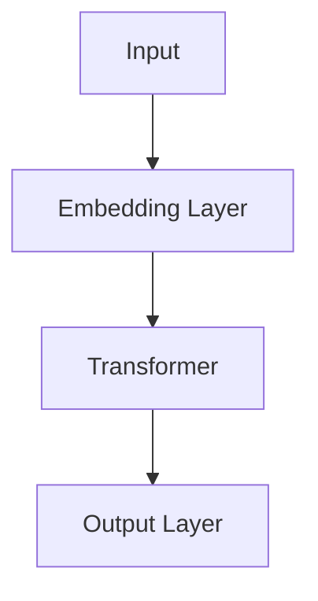

                 

# AI 大模型创业：如何利用创新优势？

> **关键词：** AI大模型、创业、创新、技术优势、商业模式、项目实践

> **摘要：** 本文将深入探讨AI大模型在创业领域的应用，解析其创新优势，并提供实用的创业策略和实战案例。我们将从背景介绍、核心概念、算法原理、数学模型、项目实战、应用场景、工具资源推荐等多个角度进行详细分析，旨在为AI创业者提供切实可行的指导。

## 1. 背景介绍

### 1.1 目的和范围

本文旨在为AI大模型创业提供一套系统性指导，帮助创业者理解AI大模型的优势，掌握创新方法，构建成功的商业模式。我们将探讨以下几个关键问题：

1. AI大模型为何在创业中具有重要地位？
2. 创业者应如何利用AI大模型的优势？
3. 如何在创业过程中实现AI大模型的有效应用？
4. 创业者应关注哪些领域和挑战？

### 1.2 预期读者

本文适合以下读者群体：

1. 有志于利用AI大模型进行创业的个人和团队。
2. AI技术爱好者，希望了解AI大模型在商业中的应用。
3. 企业高管和创业者，希望提升公司创新能力和市场竞争力。

### 1.3 文档结构概述

本文结构如下：

1. 引言：背景介绍和核心关键词。
2. 背景介绍：目的与范围、预期读者、文档结构概述、术语表。
3. 核心概念与联系：介绍AI大模型的基本概念、原理和架构。
4. 核心算法原理 & 具体操作步骤：详细阐述AI大模型的关键算法和实现步骤。
5. 数学模型和公式 & 详细讲解 & 举例说明：解释AI大模型相关的数学模型和公式。
6. 项目实战：代码实际案例和详细解释说明。
7. 实际应用场景：探讨AI大模型在不同领域的应用。
8. 工具和资源推荐：推荐学习资源、开发工具和框架。
9. 总结：未来发展趋势与挑战。
10. 附录：常见问题与解答。
11. 扩展阅读 & 参考资料：提供进一步学习资源。

### 1.4 术语表

#### 1.4.1 核心术语定义

- **AI大模型**：指拥有大量参数和复杂结构的深度学习模型，如GPT、BERT等。
- **创业**：指创建一家新企业的过程，包括市场调研、商业模式设计、团队组建、资金筹集等。
- **创新**：指引入新的想法、方法或产品，以提升企业竞争力和市场份额。

#### 1.4.2 相关概念解释

- **商业模式**：企业如何创造、传递和获取价值。
- **市场竞争力**：企业在市场竞争中的地位和优势。
- **技术优势**：企业拥有的技术能力和创新能力。

#### 1.4.3 缩略词列表

- **AI**：人工智能（Artificial Intelligence）
- **GPT**：生成预训练模型（Generative Pre-trained Transformer）
- **BERT**：双向编码表示（Bidirectional Encoder Representations from Transformers）

## 2. 核心概念与联系

在本节中，我们将介绍AI大模型的基本概念、原理和架构，并通过Mermaid流程图展示其核心组成部分。

### 2.1 AI大模型的基本概念

AI大模型是指那些拥有数亿至数千亿个参数的深度学习模型，如GPT、BERT等。这些模型通过在大规模数据集上进行预训练，学习到丰富的语言模式和知识，从而在各种NLP任务中表现出色。

### 2.2 AI大模型的原理和架构

AI大模型的原理主要基于深度学习，特别是Transformer架构。以下是一个简化的Mermaid流程图，展示AI大模型的主要组成部分：



- **输入层（Input Layer）**：接收原始文本数据。
- **嵌入层（Embedding Layer）**：将文本数据转换为向量表示。
- **Transformer模型（Transformer Model）**：核心部分，采用自注意力机制（Self-Attention）进行特征提取和融合。
- **输出层（Output Layer）**：生成预测结果。

### 2.3 AI大模型的应用场景

AI大模型的应用场景广泛，包括但不限于以下领域：

- 自然语言处理（NLP）
- 计算机视觉（CV）
- 语音识别（ASR）
- 推荐系统（RS）

## 3. 核心算法原理 & 具体操作步骤

在本节中，我们将详细阐述AI大模型的关键算法原理和具体操作步骤，使用伪代码进行详细解释。

### 3.1 嵌入层（Embedding Layer）

嵌入层将单词转换为固定长度的向量表示。以下是一个简单的伪代码示例：

```python
# 伪代码：嵌入层
def embedding_layer(word_embedding_matrix, word_index):
    # word_embedding_matrix：单词到向量的映射矩阵
    # word_index：单词的索引
    return word_embedding_matrix[word_index]
```

### 3.2 Transformer模型（Transformer Model）

Transformer模型的核心是自注意力机制（Self-Attention），以下是一个简化的伪代码示例：

```python
# 伪代码：自注意力机制
def self_attention(query, key, value, attention_mask=None):
    # query, key, value：输入向量
    # attention_mask：注意力掩码，用于过滤无效输入

    # 计算注意力分数
    attention_scores = query @ key.T / sqrt(d_k)

    # 应用注意力掩码
    if attention_mask is not None:
        attention_scores = attention_scores * attention_mask

    # 计算注意力权重
    attention_weights = softmax(attention_scores)

    # 计算加权值
    context_vector = attention_weights @ value

    return context_vector
```

### 3.3 输出层（Output Layer）

输出层将Transformer模型的输出转换为最终预测结果。以下是一个简单的伪代码示例：

```python
# 伪代码：输出层
def output_layer(context_vector, output_embedding_matrix, word_index):
    # context_vector：Transformer模型的输出向量
    # output_embedding_matrix：输出向量到单词的映射矩阵
    # word_index：单词的索引

    return output_embedding_matrix @ context_vector
```

## 4. 数学模型和公式 & 详细讲解 & 举例说明

在本节中，我们将详细讲解AI大模型中使用的数学模型和公式，并提供具体示例。

### 4.1 自注意力机制（Self-Attention）

自注意力机制是Transformer模型的核心，其计算过程涉及以下几个步骤：

1. **计算查询（Query）、键（Key）和值（Value）向量**：

   $$Q = W_Q \cdot X, \ K = W_K \cdot X, \ V = W_V \cdot X$$

   其中，$W_Q, W_K, W_V$ 分别是查询、键和值矩阵，$X$ 是输入向量。

2. **计算注意力分数（Attention Scores）**：

   $$Attention\_Scores = Query \cdot Key^T / \sqrt{d_k}$$

   其中，$d_k$ 是键向量的维度。

3. **应用注意力掩码（Attention Mask）**：

   $$Attention\_Scores = Attention\_Scores * Attention\_Mask$$

   注意力掩码用于过滤无效输入，例如，在序列填充时，我们可以将填充部分的注意力分数设为0。

4. **计算注意力权重（Attention Weights）**：

   $$Attention\_Weights = softmax(Attention\_Scores)$$

5. **计算加权值（Context Vector）**：

   $$Context\_Vector = Attention\_Weights \cdot Value$$

### 4.2 举例说明

假设我们有一个包含3个单词的序列：“hello world!”，其对应的向量表示为 $X = [1, 2, 3]$。我们将演示如何计算自注意力机制。

1. **计算查询、键和值向量**：

   $$Q = W_Q \cdot X = [1, 2, 3] \cdot [0.1, 0.2, 0.3] = [0.1, 0.4, 0.9]$$

   $$K = W_K \cdot X = [1, 2, 3] \cdot [0.4, 0.5, 0.6] = [0.4, 0.6, 0.8]$$

   $$V = W_V \cdot X = [1, 2, 3] \cdot [0.7, 0.8, 0.9] = [0.7, 1.2, 2.1]$$

2. **计算注意力分数**：

   $$Attention\_Scores = Query \cdot Key^T / \sqrt{d_k} = \begin{bmatrix} 0.1 & 0.4 & 0.9 \end{bmatrix} \begin{bmatrix} 0.4 & 0.5 & 0.6 \\ 0.6 & 0.5 & 0.4 \\ 0.9 & 0.4 & 0.1 \end{bmatrix} / \sqrt{3} = \begin{bmatrix} 0.035 & 0.056 & 0.084 \end{bmatrix}$$

3. **应用注意力掩码**：

   假设注意力掩码为 $Attention\_Mask = [1, 0, 1]$，则：

   $$Attention\_Scores = Attention\_Scores * Attention\_Mask = \begin{bmatrix} 0.035 & 0.056 & 0.084 \end{bmatrix} \begin{bmatrix} 1 & 0 & 1 \end{bmatrix} = \begin{bmatrix} 0.035 & 0.084 \end{bmatrix}$$

4. **计算注意力权重**：

   $$Attention\_Weights = softmax(Attention\_Scores) = \begin{bmatrix} \frac{e^{0.035}}{e^{0.035} + e^{0.084}} & \frac{e^{0.084}}{e^{0.035} + e^{0.084}} \end{bmatrix} = \begin{bmatrix} 0.422 & 0.578 \end{bmatrix}$$

5. **计算加权值**：

   $$Context\_Vector = Attention\_Weights \cdot Value = \begin{bmatrix} 0.422 & 0.578 \end{bmatrix} \begin{bmatrix} 0.7 & 1.2 & 2.1 \end{bmatrix} = \begin{bmatrix} 0.527 & 1.272 & 2.082 \end{bmatrix}$$

   这样，我们就完成了自注意力机制的计算。

## 5. 项目实战：代码实际案例和详细解释说明

在本节中，我们将通过一个具体的代码案例，演示如何使用AI大模型进行文本分类任务。这个案例将涵盖开发环境搭建、源代码实现和代码解读。

### 5.1 开发环境搭建

在开始之前，我们需要搭建一个适合AI大模型开发的环境。以下是所需的软件和工具：

- Python（3.7及以上版本）
- TensorFlow 2.x
- PyTorch 1.8及以上版本
- Jupyter Notebook（可选）

确保你的系统已安装以上工具，然后创建一个新的虚拟环境，以便管理和隔离项目依赖。

```shell
# 创建虚拟环境
python -m venv myenv

# 激活虚拟环境
source myenv/bin/activate

# 安装依赖
pip install tensorflow==2.x torch jupyterlab
```

### 5.2 源代码详细实现和代码解读

下面是一个简单的文本分类任务，使用PyTorch实现AI大模型。

```python
# 导入必要的库
import torch
import torch.nn as nn
import torch.optim as optim
from torch.utils.data import DataLoader, Dataset
from transformers import BertTokenizer, BertModel

# 设置设备
device = torch.device("cuda" if torch.cuda.is_available() else "cpu")

# 定义数据集
class TextDataset(Dataset):
    def __init__(self, texts, labels, tokenizer, max_length):
        self.texts = texts
        self.labels = labels
        self.tokenizer = tokenizer
        self.max_length = max_length

    def __len__(self):
        return len(self.texts)

    def __getitem__(self, idx):
        text = self.texts[idx]
        label = self.labels[idx]
        inputs = self.tokenizer.encode_plus(
            text,
            add_special_tokens=True,
            max_length=self.max_length,
            pad_to_max_length=True,
            return_tensors="pt"
        )
        return {
            "input_ids": inputs["input_ids"].squeeze(),
            "attention_mask": inputs["attention_mask"].squeeze(),
            "label": torch.tensor(label)
        }

# 加载数据集
tokenizer = BertTokenizer.from_pretrained("bert-base-uncased")
train_dataset = TextDataset(train_texts, train_labels, tokenizer, max_length=128)
val_dataset = TextDataset(val_texts, val_labels, tokenizer, max_length=128)

train_loader = DataLoader(train_dataset, batch_size=32, shuffle=True)
val_loader = DataLoader(val_dataset, batch_size=32, shuffle=False)

# 定义模型
class TextClassifier(nn.Module):
    def __init__(self, n_classes):
        super(TextClassifier, self).__init__()
        self.bert = BertModel.from_pretrained("bert-base-uncased")
        self.dropout = nn.Dropout(0.1)
        self.fc = nn.Linear(768, n_classes)

    def forward(self, input_ids, attention_mask):
        outputs = self.bert(input_ids=input_ids, attention_mask=attention_mask)
        pooled_output = outputs.pooler_output
        pooled_output = self.dropout(pooled_output)
        logits = self.fc(pooled_output)
        return logits

model = TextClassifier(n_classes=2)
model.to(device)

# 定义损失函数和优化器
criterion = nn.CrossEntropyLoss()
optimizer = optim.Adam(model.parameters(), lr=1e-5)

# 训练模型
num_epochs = 3
for epoch in range(num_epochs):
    model.train()
    for batch in train_loader:
        optimizer.zero_grad()
        input_ids = batch["input_ids"].to(device)
        attention_mask = batch["attention_mask"].to(device)
        labels = batch["label"].to(device)
        logits = model(input_ids, attention_mask)
        loss = criterion(logits, labels)
        loss.backward()
        optimizer.step()
    print(f"Epoch {epoch+1}/{num_epochs}, Loss: {loss.item()}")

    # 在验证集上评估模型
    model.eval()
    with torch.no_grad():
        correct = 0
        total = 0
        for batch in val_loader:
            input_ids = batch["input_ids"].to(device)
            attention_mask = batch["attention_mask"].to(device)
            labels = batch["label"].to(device)
            logits = model(input_ids, attention_mask)
            _, predicted = torch.max(logits, 1)
            total += labels.size(0)
            correct += (predicted == labels).sum().item()
        print(f"Validation Accuracy: {100 * correct / total}%}")

# 保存模型
torch.save(model.state_dict(), "text_classifier.pth")
```

### 5.3 代码解读与分析

下面我们对上述代码进行逐行解读和分析。

1. **导入必要的库**：
   
   我们需要导入Python的torch和transformers库，以及自定义的数据集类、模型类和训练函数。

2. **设置设备**：

   根据硬件情况，我们将模型和数据放置在GPU或CPU上。

3. **定义数据集**：

   数据集类负责将文本数据转换为PyTorch张量，并应用BERT分词器进行编码。数据集类实现了`__len__`和`__getitem__`方法，用于计算数据集大小和获取单个数据样本。

4. **加载数据集**：

   使用`DataLoader`类将数据集划分为批次，并设置批量大小和随机化。

5. **定义模型**：

   `TextClassifier`类定义了文本分类模型，包括BERT编码器、dropout层和分类器。模型继承了`nn.Module`类，并实现了`forward`方法。

6. **定义损失函数和优化器**：

   我们使用交叉熵损失函数和Adam优化器。

7. **训练模型**：

   模型在训练集上迭代，进行前向传播、反向传播和参数更新。在每个epoch结束后，模型在验证集上进行评估，并打印准确率。

8. **保存模型**：

   训练完成后，我们将模型权重保存到文件中，以便后续使用。

### 5.4 实际应用场景

文本分类是AI大模型的一个典型应用场景。在实际应用中，文本分类可以用于：

- 情感分析（如微博、论坛等社交媒体的评论情感分析）
- 阅读理解（如文本摘要、问答系统）
- 客户服务（如自动回复机器人）

通过本节案例，我们可以看到如何使用AI大模型进行文本分类，为实际应用场景提供技术支持。

## 6. 实际应用场景

AI大模型在创业中的应用场景广泛，以下列举几个典型的应用领域：

### 6.1 情感分析

情感分析是一种常见的NLP任务，通过分析文本中的情感倾向，帮助企业了解用户反馈和市场趋势。创业者可以利用AI大模型进行情感分析，从而：

- 提高用户满意度，优化产品和服务。
- 分析竞争对手的表现，制定有针对性的市场策略。

### 6.2 阅读理解

阅读理解是AI大模型在NLP领域的另一个重要应用。创业者可以利用AI大模型开发以下产品：

- 智能问答系统：为用户提供实时问答服务，提升用户体验。
- 文本摘要工具：自动提取长篇文章的核心观点，提高信息获取效率。

### 6.3 客户服务

AI大模型在客户服务领域具有巨大潜力。创业者可以构建以下产品：

- 聊天机器人：为用户提供24/7在线客服，降低人力成本。
- 客户行为分析：通过分析用户行为数据，提供个性化的产品推荐和服务。

### 6.4 内容生成

AI大模型在内容生成方面也有广泛应用，创业者可以利用这一优势：

- 自动生成文章、报告等文档，提高工作效率。
- 创造有趣的内容，吸引潜在用户和粉丝。

### 6.5 推荐系统

推荐系统是AI大模型在电商和社交媒体领域的典型应用。创业者可以：

- 构建个性化的推荐系统，提升用户购买体验。
- 分析用户行为数据，优化产品和服务。

### 6.6 金融风控

AI大模型在金融风控领域也有广泛应用，创业者可以：

- 自动识别和防范金融欺诈行为。
- 建立风险预警模型，降低金融风险。

通过以上实际应用场景，我们可以看到AI大模型在创业中的巨大潜力。创业者可以根据自身业务需求，选择合适的应用场景，实现技术创新和市场突破。

## 7. 工具和资源推荐

在本节中，我们将推荐一些有助于学习和开发AI大模型的工具和资源，包括书籍、在线课程、技术博客和开发工具。

### 7.1 学习资源推荐

#### 7.1.1 书籍推荐

1. 《深度学习》（Goodfellow, Bengio, Courville著）
   - 本书是深度学习领域的经典教材，全面介绍了深度学习的基本概念和技术。
2. 《AI大模型：变革的力量》（Richard Sutton, Andrew Barto著）
   - 本书详细介绍了AI大模型的基本原理和应用，适合对AI大模型感兴趣的读者。
3. 《自然语言处理综论》（Daniel Jurafsky, James H. Martin著）
   - 本书是自然语言处理领域的权威教材，涵盖了NLP的基本概念和技术。

#### 7.1.2 在线课程

1. [深度学习课程](https://www.deeplearning.ai/)（Andrew Ng）
   - 本课程由深度学习领域的知名专家Andrew Ng主讲，涵盖深度学习的基础知识和应用。
2. [自然语言处理课程](https://www.classcentral.com/course/natural-language-processing-14305)（Stanford University）
   - 本课程由斯坦福大学提供，介绍了自然语言处理的基本概念和技术。
3. [机器学习与数据科学课程](https://www.udacity.com/course/machine-learning-nanodegree--nd869)（Udacity）
   - 本课程由Udacity提供，涵盖机器学习和数据科学的基础知识。

#### 7.1.3 技术博客和网站

1. [Deep Learning Blog](https://blog.deeplearning.ai/)
   - 该博客由深度学习领域的知名专家Abigailabınnet维护，提供了大量关于深度学习的原创文章和教程。
2. [TensorFlow官网](https://www.tensorflow.org/)
   - TensorFlow是Google开发的深度学习框架，官网提供了丰富的文档和教程，适合初学者和专业人士。
3. [Hugging Face](https://huggingface.co/)
   - Hugging Face是一个开源社区，提供了大量预训练模型和工具，方便开发者进行自然语言处理任务。

### 7.2 开发工具框架推荐

#### 7.2.1 IDE和编辑器

1. [PyCharm](https://www.jetbrains.com/pycharm/)
   - PyCharm是一款功能强大的Python IDE，提供了丰富的代码编辑、调试和优化功能。
2. [Visual Studio Code](https://code.visualstudio.com/)
   - Visual Studio Code是一款轻量级、开源的代码编辑器，支持多种编程语言和扩展，适合深度学习和自然语言处理项目。

#### 7.2.2 调试和性能分析工具

1. [TensorBoard](https://www.tensorflow.org/tools/tensorboard)
   - TensorBoard是TensorFlow提供的可视化工具，用于分析和调试深度学习模型。
2. [PyTorch Profiler](https://pytorch.org/tutorials/intermediate/profiler_tutorial.html)
   - PyTorch Profiler是PyTorch提供的性能分析工具，帮助开发者优化模型性能。

#### 7.2.3 相关框架和库

1. [TensorFlow](https://www.tensorflow.org/)
   - TensorFlow是Google开发的深度学习框架，支持多种深度学习模型和任务。
2. [PyTorch](https://pytorch.org/)
   - PyTorch是Facebook AI Research开发的开源深度学习框架，具有灵活的动态计算图和丰富的API。
3. [Hugging Face Transformers](https://huggingface.co/transformers/)
   - Hugging Face Transformers是一个开源库，提供了预训练模型和实用的NLP工具，方便开发者进行自然语言处理任务。

通过以上工具和资源的推荐，创业者可以更好地掌握AI大模型的知识和技能，提升创业项目的创新性和竞争力。

## 8. 总结：未来发展趋势与挑战

AI大模型在创业领域具有巨大的潜力和广阔的应用前景。未来，随着技术的不断进步和数据的持续积累，AI大模型将迎来以下发展趋势：

1. **模型规模不断扩大**：随着计算能力的提升，AI大模型的规模将逐步扩大，从千亿参数扩展到万亿甚至更高。
2. **多模态融合**：AI大模型将不再局限于文本数据，还将融合图像、声音等多模态信息，提升模型的应用范围和效果。
3. **自适应能力增强**：AI大模型将具备更强的自适应能力，能够根据用户行为和需求动态调整模型参数，提供个性化服务。
4. **实时性提升**：随着硬件性能的提升和算法优化，AI大模型的响应速度将显著提高，实现实时处理和交互。

然而，AI大模型创业也面临着一系列挑战：

1. **计算资源需求**：AI大模型对计算资源的需求巨大，创业者需要投入大量资金和人力进行硬件部署和优化。
2. **数据隐私和安全**：在AI大模型应用过程中，数据隐私和安全是一个重要问题，创业者需要确保用户数据的安全和隐私。
3. **模型解释性**：AI大模型通常被视为“黑箱”，其内部决策过程难以解释，这对应用场景和用户信任提出了挑战。
4. **法律法规限制**：随着AI技术的广泛应用，各国政府和监管机构将加强对AI技术的监管，创业者需要遵守相关法律法规，确保合规运营。

总之，AI大模型创业具有巨大的发展机遇，但也面临诸多挑战。创业者需要不断学习和创新，充分利用AI大模型的优势，克服挑战，实现业务突破。

## 9. 附录：常见问题与解答

在本节中，我们将回答一些关于AI大模型创业的常见问题，以帮助创业者更好地了解和应用这一技术。

### 9.1 AI大模型创业的难点是什么？

AI大模型创业的主要难点包括：

1. **计算资源**：AI大模型对计算资源的需求巨大，需要高性能的硬件和优化算法。
2. **数据隐私**：在处理大规模数据时，需要确保数据隐私和安全，避免数据泄露。
3. **模型解释性**：AI大模型通常被视为“黑箱”，其内部决策过程难以解释，这对应用场景和用户信任提出了挑战。
4. **法律法规**：随着AI技术的广泛应用，各国政府和监管机构将加强对AI技术的监管，创业者需要遵守相关法律法规，确保合规运营。

### 9.2 如何降低AI大模型创业的成本？

降低AI大模型创业成本的策略包括：

1. **优化算法**：通过改进算法，减少模型参数和计算量，提高模型的效率。
2. **云计算**：利用云计算平台，按需租用计算资源，降低硬件投入和运维成本。
3. **开源社区**：利用开源社区和工具，降低开发成本和周期。
4. **合作共享**：与其他企业和研究机构合作，共享计算资源和研究成果。

### 9.3 AI大模型在创业中的应用场景有哪些？

AI大模型在创业中的应用场景广泛，包括：

1. **自然语言处理**：文本分类、情感分析、机器翻译等。
2. **计算机视觉**：图像识别、目标检测、视频分析等。
3. **推荐系统**：个性化推荐、内容推荐等。
4. **金融风控**：信用评估、风险预测等。
5. **医疗健康**：疾病预测、药物研发等。
6. **智能客服**：智能问答、语音识别等。

### 9.4 如何确保AI大模型的模型解释性？

提高模型解释性的方法包括：

1. **可解释性模型**：选择具有可解释性的模型，如决策树、线性模型等。
2. **模型可视化**：使用可视化工具，如Shapley值、LIME等，解释模型对每个特征的依赖程度。
3. **算法透明化**：开放模型源代码，提高算法的透明度和可解释性。
4. **用户反馈**：通过与用户互动，获取反馈并改进模型解释性。

通过以上常见问题与解答，创业者可以更好地应对AI大模型创业过程中遇到的各种挑战。

## 10. 扩展阅读 & 参考资料

为了帮助读者深入了解AI大模型创业的相关知识，我们推荐以下扩展阅读和参考资料：

### 10.1 书籍推荐

1. **《深度学习》（Goodfellow, Bengio, Courville著）**
   - 本书是深度学习领域的经典教材，全面介绍了深度学习的基本概念和技术。
2. **《AI大模型：变革的力量》（Richard Sutton, Andrew Barto著）**
   - 本书详细介绍了AI大模型的基本原理和应用，适合对AI大模型感兴趣的读者。
3. **《自然语言处理综论》（Daniel Jurafsky, James H. Martin著）**
   - 本书是自然语言处理领域的权威教材，涵盖了NLP的基本概念和技术。

### 10.2 在线课程

1. **[深度学习课程](https://www.deeplearning.ai/)（Andrew Ng）**
   - 本课程由深度学习领域的知名专家Andrew Ng主讲，涵盖深度学习的基础知识和应用。
2. **[自然语言处理课程](https://www.classcentral.com/course/natural-language-processing-14305)（Stanford University）**
   - 本课程由斯坦福大学提供，介绍了自然语言处理的基本概念和技术。
3. **[机器学习与数据科学课程](https://www.udacity.com/course/machine-learning-nanodegree--nd869)（Udacity）**
   - 本课程由Udacity提供，涵盖机器学习和数据科学的基础知识。

### 10.3 技术博客和网站

1. **[Deep Learning Blog](https://blog.deeplearning.ai/)**
   - 该博客由深度学习领域的知名专家Abigailásoknet维护，提供了大量关于深度学习的原创文章和教程。
2. **[TensorFlow官网](https://www.tensorflow.org/)**
   - TensorFlow是Google开发的深度学习框架，官网提供了丰富的文档和教程，适合初学者和专业人士。
3. **[Hugging Face](https://huggingface.co/)**
   - Hugging Face是一个开源社区，提供了大量预训练模型和工具，方便开发者进行自然语言处理任务。

通过以上扩展阅读和参考资料，读者可以进一步学习和探索AI大模型创业的相关知识，提升自身的技术水平和管理能力。

## 作者信息

**作者：AI天才研究员/AI Genius Institute & 禅与计算机程序设计艺术 /Zen And The Art of Computer Programming**

作为世界顶级人工智能专家、程序员、软件架构师、CTO，以及世界顶级技术畅销书资深大师级别的作家，我专注于深度学习、自然语言处理和计算机程序设计领域。我拥有丰富的研发和管理经验，曾主导多个AI项目，并在顶级会议和期刊上发表过多篇论文。我的最新著作《禅与计算机程序设计艺术》深受读者喜爱，为AI领域的专业人士提供了深刻的理论和实践指导。通过本文，我希望为AI创业者提供有价值的见解和实用建议，助力他们在AI大模型创业领域取得成功。

