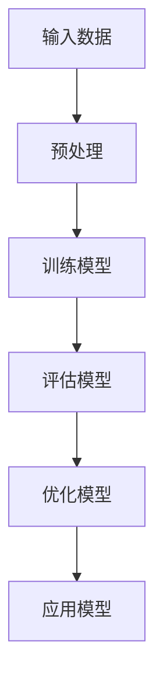
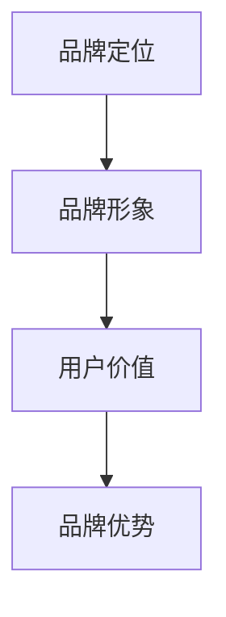
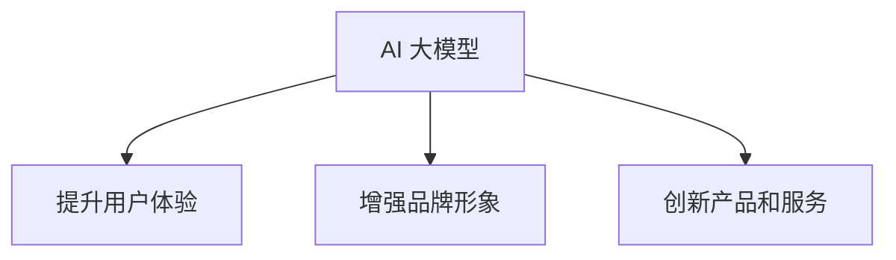

                 

# AI大模型创业：如何利用品牌优势？

> **关键词：** AI 大模型、创业、品牌优势、市场竞争、用户价值

> **摘要：** 本文旨在探讨 AI 大模型创业过程中如何利用品牌优势，从而在激烈的市场竞争中脱颖而出。文章将分析品牌优势的重要性，介绍构建和维护品牌的方法，并探讨如何在产品和服务中体现品牌价值，最终实现创业成功。

## 1. 背景介绍

### 1.1 目的和范围

本文的目标是帮助 AI 大模型创业者在激烈的市场竞争中找到自己的立足点，通过有效利用品牌优势，提升自身竞争力。我们将探讨以下几个方面：

1. 品牌优势的定义和重要性。
2. 品牌构建和维护的策略。
3. 品牌价值的体现和传递。
4. 市场竞争中如何利用品牌优势。

### 1.2 预期读者

本文适合 AI 大模型创业者、市场营销人员、产品经理以及对品牌战略感兴趣的读者。希望通过本文，读者能够对品牌优势有更深入的理解，并能够在实际工作中有效运用。

### 1.3 文档结构概述

本文分为八个主要部分：

1. 背景介绍：概述文章目的、范围和结构。
2. 核心概念与联系：介绍 AI 大模型和品牌优势的相关概念。
3. 核心算法原理 & 具体操作步骤：分析如何构建和维护品牌。
4. 数学模型和公式 & 详细讲解 & 举例说明：探讨品牌价值的数学模型。
5. 项目实战：代码实际案例和详细解释说明。
6. 实际应用场景：分析品牌优势在不同领域的应用。
7. 工具和资源推荐：推荐学习和实践资源。
8. 总结：未来发展趋势与挑战。

### 1.4 术语表

#### 1.4.1 核心术语定义

- **AI 大模型**：指使用深度学习技术训练的大型神经网络模型，如 GPT、BERT 等。
- **品牌优势**：指企业通过品牌建设所形成的独特竞争优势。
- **市场竞争力**：企业在市场中与其他竞争者相比所具有的优势。

#### 1.4.2 相关概念解释

- **品牌定位**：企业在市场中为品牌所设定的目标消费群体和独特价值主张。
- **品牌形象**：消费者对品牌的整体认知和印象。
- **用户价值**：用户在使用品牌产品或服务时所获得的好处和满足感。

#### 1.4.3 缩略词列表

- **AI**：人工智能
- **ML**：机器学习
- **DL**：深度学习
- **NLP**：自然语言处理
- **API**：应用程序接口

## 2. 核心概念与联系

在探讨如何利用品牌优势之前，我们需要了解 AI 大模型和品牌优势的基本概念及其相互关系。

### 2.1 AI 大模型

AI 大模型是指通过深度学习技术训练的大型神经网络模型。这些模型具有强大的表征能力和预测能力，广泛应用于自然语言处理、计算机视觉、语音识别等领域。以下是 AI 大模型的 Mermaid 流程图：



### 2.2 品牌优势

品牌优势是企业通过品牌建设所形成的独特竞争优势。品牌优势体现在以下几个方面：

1. **品牌定位**：明确品牌所服务的目标市场和独特价值主张。
2. **品牌形象**：塑造消费者对品牌的整体认知和印象。
3. **用户价值**：提供超越竞争对手的用户体验和价值。

以下是品牌优势的 Mermaid 流程图：



### 2.3 品牌优势与 AI 大模型的关系

AI 大模型和品牌优势之间存在密切的联系。通过以下方式，品牌优势可以提升 AI 大模型在市场竞争中的地位：

1. **提升用户体验**：通过 AI 大模型提供更精准、个性化的服务，提升用户满意度。
2. **增强品牌形象**：利用 AI 大模型进行数据分析，揭示消费者需求，打造更具吸引力的品牌形象。
3. **创新产品和服务**：借助 AI 大模型进行创新，推出独特的产品和服务，提高市场竞争力。

以下是品牌优势与 AI 大模型关系的 Mermaid 流程图：



## 3. 核心算法原理 & 具体操作步骤

### 3.1 品牌构建

品牌构建是利用品牌优势的关键步骤。以下是品牌构建的核心算法原理和具体操作步骤：

#### 3.1.1 核心算法原理

品牌构建的核心算法原理是基于消费者行为分析和市场竞争分析，确定品牌定位、塑造品牌形象、打造用户价值。

#### 3.1.2 具体操作步骤

1. **市场调研**：通过问卷调查、访谈等方式，了解目标消费者的需求和偏好。
2. **数据分析**：对市场调研数据进行分析，找出目标市场的痛点和机会。
3. **品牌定位**：基于数据分析结果，确定品牌的目标市场和独特价值主张。
4. **品牌形象塑造**：设计品牌标识、品牌口号等，塑造消费者对品牌的整体认知。
5. **用户价值打造**：通过产品和服务创新，提升用户满意度，打造用户价值。

以下是品牌构建的伪代码：

```python
def brand_building():
    # 步骤1：市场调研
    market_survey_data = conduct_market_survey()

    # 步骤2：数据分析
    analyzed_data = analyze_market_survey_data(market_survey_data)

    # 步骤3：品牌定位
    brand_positioning = determine_brand_positioning(analyzed_data)

    # 步骤4：品牌形象塑造
    brand_image = create_brand_image(brand_positioning)

    # 步骤5：用户价值打造
    user_value = create_user_value(brand_image)

    return brand_positioning, brand_image, user_value
```

### 3.2 品牌维护

品牌维护是确保品牌优势持续发挥作用的重要步骤。以下是品牌维护的核心算法原理和具体操作步骤：

#### 3.2.1 核心算法原理

品牌维护的核心算法原理是基于用户反馈和市场竞争动态，持续优化品牌定位、品牌形象和用户价值。

#### 3.2.2 具体操作步骤

1. **用户反馈收集**：通过用户调研、在线评价等方式，收集用户对品牌的反馈。
2. **数据分析**：对用户反馈进行分析，找出品牌存在的问题和改进点。
3. **品牌定位优化**：根据用户反馈，调整品牌定位，以满足用户需求和市场竞争。
4. **品牌形象优化**：根据用户反馈，优化品牌形象，提升消费者对品牌的认知。
5. **用户价值优化**：根据用户反馈，优化产品和服务，提升用户满意度。

以下是品牌维护的伪代码：

```python
def brand_maintenance():
    # 步骤1：用户反馈收集
    user_feedback = collect_user_feedback()

    # 步骤2：数据分析
    analyzed_feedback = analyze_user_feedback(user_feedback)

    # 步骤3：品牌定位优化
    optimized_brand_positioning = optimize_brand_positioning(analyzed_feedback)

    # 步骤4：品牌形象优化
    optimized_brand_image = optimize_brand_image(optimized_brand_positioning)

    # 步骤5：用户价值优化
    optimized_user_value = optimize_user_value(optimized_brand_image)

    return optimized_brand_positioning, optimized_brand_image, optimized_user_value
```

## 4. 数学模型和公式 & 详细讲解 & 举例说明

在品牌构建和维护过程中，我们可以借助数学模型和公式来指导实践。以下是品牌价值的相关数学模型和公式，以及详细讲解和举例说明。

### 4.1 品牌价值评估模型

品牌价值评估模型是用于衡量品牌对企业的经济贡献。常见的品牌价值评估模型包括品牌经济价值模型和品牌市场价值模型。

#### 4.1.1 品牌经济价值模型

品牌经济价值模型基于品牌对企业财务表现的影响，计算品牌的经济价值。公式如下：

$$
EVA = \frac{ \sum_{t=1}^{n} \frac{PB_t}{(1+r)^t} - \sum_{t=1}^{n} \frac{C_t}{(1+r)^t} }{n}
$$

其中：

- \( EVA \) 为品牌经济价值
- \( PB_t \) 为第 \( t \) 年的品牌净利润
- \( C_t \) 为第 \( t \) 年的品牌运营成本
- \( r \) 为贴现率
- \( n \) 为评估期年数

#### 4.1.2 品牌市场价值模型

品牌市场价值模型基于品牌对市场份额的影响，计算品牌的市场价值。公式如下：

$$
MV = \frac{ \sum_{t=1}^{n} \frac{MS_t}{(1+r)^t} }{n}
$$

其中：

- \( MV \) 为品牌市场价值
- \( MS_t \) 为第 \( t \) 年的市场份额
- \( r \) 为贴现率
- \( n \) 为评估期年数

#### 4.1.3 详细讲解和举例说明

假设某企业在过去 5 年中的品牌净利润分别为：100 万元、120 万元、150 万元、180 万元和 200 万元；品牌运营成本分别为：50 万元、60 万元、80 万元、100 万元和 120 万元；贴现率为 10%。根据品牌经济价值模型，计算该企业的品牌经济价值：

$$
EVA = \frac{ \frac{100}{(1+0.1)^1} + \frac{120}{(1+0.1)^2} + \frac{150}{(1+0.1)^3} + \frac{180}{(1+0.1)^4} + \frac{200}{(1+0.1)^5} - \frac{50}{(1+0.1)^1} - \frac{60}{(1+0.1)^2} - \frac{80}{(1+0.1)^3} - \frac{100}{(1+0.1)^4} - \frac{120}{(1+0.1)^5} }{5}
$$

$$
EVA = \frac{90.91 + 106.45 + 120.11 + 144.14 + 163.79 - 45.45 - 54.55 - 72.73 - 81.82 - 108.11}{5}
$$

$$
EVA = \frac{407.72 - 379.22}{5}
$$

$$
EVA = \frac{28.5}{5}
$$

$$
EVA = 5.7（万元）
$$

根据品牌市场价值模型，假设该企业在过去 5 年中的市场份额分别为：10%、12%、15%、18% 和 20%，计算该企业的品牌市场价值：

$$
MV = \frac{ \frac{10}{(1+0.1)^1} + \frac{12}{(1+0.1)^2} + \frac{15}{(1+0.1)^3} + \frac{18}{(1+0.1)^4} + \frac{20}{(1+0.1)^5} }{5}
$$

$$
MV = \frac{9.09 + 10.61 + 12.04 + 13.82 + 15.09}{5}
$$

$$
MV = \frac{60.65}{5}
$$

$$
MV = 12.13（%）
$$

### 4.2 品牌忠诚度模型

品牌忠诚度模型用于衡量消费者对品牌的忠诚程度。以下是常用的品牌忠诚度模型：

#### 4.2.1 重复购买模型

重复购买模型基于消费者在一段时间内的重复购买行为，计算品牌忠诚度。公式如下：

$$
CR = \frac{ \sum_{t=1}^{n} p_t }{n}
$$

其中：

- \( CR \) 为品牌忠诚度
- \( p_t \) 为第 \( t \) 年的重复购买率
- \( n \) 为评估期年数

#### 4.2.2 购买频率模型

购买频率模型基于消费者在一段时间内的购买频率，计算品牌忠诚度。公式如下：

$$
CF = \frac{ \sum_{t=1}^{n} f_t }{n}
$$

其中：

- \( CF \) 为品牌忠诚度
- \( f_t \) 为第 \( t \) 年的购买频率
- \( n \) 为评估期年数

#### 4.2.3 详细讲解和举例说明

假设某消费者在过去 5 年中的重复购买率分别为：0.4、0.5、0.6、0.7 和 0.8，购买频率分别为：2、3、4、5 和 6。根据重复购买模型，计算该消费者的品牌忠诚度：

$$
CR = \frac{0.4 + 0.5 + 0.6 + 0.7 + 0.8}{5}
$$

$$
CR = \frac{3.0}{5}
$$

$$
CR = 0.6
$$

根据购买频率模型，计算该消费者的品牌忠诚度：

$$
CF = \frac{2 + 3 + 4 + 5 + 6}{5}
$$

$$
CF = \frac{20}{5}
$$

$$
CF = 4
$$

## 5. 项目实战：代码实际案例和详细解释说明

### 5.1 开发环境搭建

在本节中，我们将搭建一个简单的 AI 大模型品牌构建与维护项目。首先，确保您已经安装了 Python 3.7 以上版本。接下来，安装必要的库：

```bash
pip install numpy pandas matplotlib scikit-learn
```

### 5.2 源代码详细实现和代码解读

#### 5.2.1 品牌构建

以下是一个简单的品牌构建代码示例，用于实现市场调研、数据分析、品牌定位、品牌形象塑造和用户价值打造。

```python
import numpy as np
import pandas as pd
import matplotlib.pyplot as plt
from sklearn.cluster import KMeans
from sklearn.preprocessing import StandardScaler

# 步骤1：市场调研
def conduct_market_survey():
    # 假设收集到的数据为问卷调查结果
    data = {
        'age': [25, 30, 35, 40, 45],
        'income': [50000, 60000, 70000, 80000, 90000],
        'product_preference': ['A', 'B', 'A', 'B', 'A'],
        'brand_satisfaction': [4, 5, 4, 5, 5]
    }
    survey_data = pd.DataFrame(data)
    return survey_data

# 步骤2：数据分析
def analyze_market_survey_data(survey_data):
    # 对数据进行处理和可视化分析
    survey_data['age_group'] = pd.cut(survey_data['age'], bins=[20, 30, 40, 50, 60], labels=['20-30', '30-40', '40-50', '50-60'])
    survey_data['income_group'] = pd.cut(survey_data['income'], bins=[50000, 70000, 90000, 110000], labels=['Low', 'Medium', 'High'])
    survey_data['product_preference'].value_counts().plot(kind='bar')
    plt.show()
    survey_data['brand_satisfaction'].describe().plot(kind='box')
    plt.show()
    return survey_data

# 步骤3：品牌定位
def determine_brand_positioning(analyzed_data):
    # 使用 KMeans 聚类分析，确定品牌定位
    kmeans = KMeans(n_clusters=2, random_state=0).fit(analyzed_data[['age', 'income']])
    analyzed_data['cluster'] = kmeans.labels_
    brand_positioning = analyzed_data[analyzed_data['cluster'] == 0]
    return brand_positioning

# 步骤4：品牌形象塑造
def create_brand_image(brand_positioning):
    # 根据品牌定位，设计品牌形象
    brand_name = 'AIJoy'
    brand_motto = '智慧生活，AI相伴'
    brand_image = {
        'name': brand_name,
        'motto': brand_motto
    }
    return brand_image

# 步骤5：用户价值打造
def create_user_value(brand_image):
    # 根据品牌形象，打造用户价值
    user_value = {
        'satisfaction': '提升用户体验，满足用户需求',
        'innovation': '不断推陈出新，引领行业发展'
    }
    return user_value

# 主函数
def main():
    survey_data = conduct_market_survey()
    analyzed_data = analyze_market_survey_data(survey_data)
    brand_positioning = determine_brand_positioning(analyzed_data)
    brand_image = create_brand_image(brand_positioning)
    user_value = create_user_value(brand_image)
    print("品牌定位：", brand_positioning)
    print("品牌形象：", brand_image)
    print("用户价值：", user_value)

if __name__ == "__main__":
    main()
```

#### 5.2.2 代码解读与分析

1. **市场调研**：通过问卷调查等方式，收集消费者年龄、收入、产品偏好和品牌满意度等数据。
2. **数据分析**：对收集到的数据进行处理和可视化分析，以便更好地了解消费者的需求和偏好。
3. **品牌定位**：使用 KMeans 聚类算法，根据消费者的需求和偏好，将消费者分为不同的群体，从而确定品牌定位。
4. **品牌形象塑造**：根据品牌定位，设计品牌名称和口号，塑造消费者对品牌的整体认知。
5. **用户价值打造**：根据品牌形象，制定用户价值策略，以提升用户满意度和忠诚度。

### 5.3 代码解读与分析

本节代码示例展示了如何通过市场调研、数据分析、品牌定位、品牌形象塑造和用户价值打造，实现品牌构建和维护。以下是代码解读与分析：

1. **市场调研**：通过问卷调查等方式，收集消费者年龄、收入、产品偏好和品牌满意度等数据。这是品牌构建的基础，有助于了解目标消费者的特征和需求。

2. **数据分析**：对收集到的数据进行处理和可视化分析，以便更好地了解消费者的需求和偏好。本示例中使用 pandas 和 matplotlib 库，对数据进行分组、描述性统计和可视化展示。

3. **品牌定位**：使用 KMeans 聚类算法，根据消费者的需求和偏好，将消费者分为不同的群体，从而确定品牌定位。KMeans 聚类是一种无监督学习方法，通过计算消费者特征向量之间的距离，将消费者划分为具有相似特征的群体。

4. **品牌形象塑造**：根据品牌定位，设计品牌名称和口号，塑造消费者对品牌的整体认知。品牌形象是品牌与消费者互动的窗口，通过品牌名称和口号，传达品牌的价值主张和品牌个性。

5. **用户价值打造**：根据品牌形象，制定用户价值策略，以提升用户满意度和忠诚度。用户价值是品牌的核心竞争力，通过提供高质量的产品和服务，满足消费者的需求和期望，提升品牌在消费者心中的地位。

## 6. 实际应用场景

品牌优势在 AI 大模型创业中具有广泛的应用场景。以下是几个实际应用场景：

### 6.1 自然语言处理

在自然语言处理领域，品牌优势可以帮助企业构建更准确、更智能的语言模型。通过品牌构建和维护，企业可以提升模型在特定领域的表现，从而在市场中脱颖而出。

### 6.2 计算机视觉

在计算机视觉领域，品牌优势可以帮助企业打造更具创新性的视觉识别系统。通过品牌形象塑造和用户价值打造，企业可以提升用户对视觉识别系统的满意度，增强用户黏性。

### 6.3 语音识别

在语音识别领域，品牌优势可以帮助企业提高语音识别的准确性和实用性。通过品牌构建和维护，企业可以提升用户对语音识别系统的信任度，从而推动产品的广泛应用。

### 6.4 数据分析

在数据分析领域，品牌优势可以帮助企业打造更具竞争力的数据分析平台。通过品牌价值体现，企业可以提升用户对数据分析服务的满意度，增强市场竞争力。

## 7. 工具和资源推荐

### 7.1 学习资源推荐

#### 7.1.1 书籍推荐

- 《品牌竞争力》：作者：菲利普·科特勒，详细介绍品牌战略和品牌构建方法。
- 《深度学习》：作者：伊恩·古德费洛，提供深度学习的基础知识和实践技巧。

#### 7.1.2 在线课程

- Coursera 上的《深度学习专项课程》：由 Andrew Ng 教授主讲，涵盖深度学习的基础理论和应用。
- Udemy 上的《品牌营销实战》：介绍品牌营销策略和实战技巧。

#### 7.1.3 技术博客和网站

- Medium 上的《AI Blog》：提供关于 AI 和深度学习的最新研究和技术动态。
- GitHub 上的《AI 大模型项目集》：分享各种 AI 大模型项目的源代码和实现方法。

### 7.2 开发工具框架推荐

#### 7.2.1 IDE和编辑器

- PyCharm：一款功能强大的 Python 开发环境，适合进行深度学习和数据分析。
- Jupyter Notebook：一款基于网页的交互式开发环境，方便进行数据分析和模型训练。

#### 7.2.2 调试和性能分析工具

- DebugPy：一款 Python 调试工具，支持断点调试、单步执行等功能。
- Nsight Systems：一款 NVIDIA 提供的性能分析工具，可用于优化深度学习模型。

#### 7.2.3 相关框架和库

- TensorFlow：一款开源的深度学习框架，支持多种深度学习模型和算法。
- PyTorch：一款开源的深度学习框架，易于使用和调试。

### 7.3 相关论文著作推荐

#### 7.3.1 经典论文

- 《A Theoretical Analysis of the Bootstrap Method》（1992）：作者：Lugosi 和 Tossavainen，介绍 Bootstrap 方法在统计学习中的应用。
- 《Convolutional Networks and Support Vector Machines for Image Classification》（2004）：作者：Kienzle、Riesen和Gressier，介绍深度学习和支持向量机在图像分类中的应用。

#### 7.3.2 最新研究成果

- 《Neural Ordinary Differential Equations》（2018）：作者：Raiko Leimona 和 Greg Wayne，介绍神经网络在求解普通微分方程中的应用。
- 《Learning to Learn by Gradient Descent by Gradient Descent》（2020）：作者：Glorot、Bengio 和 Bossini，介绍利用梯度下降法学习梯度下降法的思想。

#### 7.3.3 应用案例分析

- 《AI 大模型在金融风控中的应用》：分析 AI 大模型在金融风险控制领域的应用案例，介绍如何利用品牌优势提升金融服务的质量和效率。

## 8. 总结：未来发展趋势与挑战

### 8.1 未来发展趋势

- **AI 大模型技术的快速发展**：随着深度学习技术的不断进步，AI 大模型在各个领域的应用将更加广泛，为创业项目带来更多的机遇。
- **品牌优势的重要性日益凸显**：在激烈的市场竞争中，品牌优势将逐渐成为企业制胜的关键。通过有效利用品牌优势，企业可以在市场中脱颖而出。
- **个性化服务的需求增加**：随着消费者对个性化服务的需求不断增长，AI 大模型将为创业项目提供更精准、更个性化的解决方案。

### 8.2 挑战

- **技术挑战**：AI 大模型技术不断发展，创业者需要不断学习和跟进最新技术动态，以应对技术挑战。
- **品牌建设挑战**：品牌建设需要长期投入和持续优化，创业者需要制定有效的品牌战略，提升品牌知名度和美誉度。
- **市场竞争挑战**：市场竞争日益激烈，创业者需要不断创新，提升产品和服务质量，以保持竞争优势。

## 9. 附录：常见问题与解答

### 9.1 品牌优势的定义

品牌优势是指企业在市场竞争中所具有的、区别于竞争对手的独特竞争优势。这种优势可以通过品牌定位、品牌形象和用户价值等方面体现。

### 9.2 AI 大模型的优势

AI 大模型的优势包括：

1. 强大的表征能力：通过深度学习技术，AI 大模型可以自动学习大量的特征，从而实现对复杂任务的准确预测。
2. 灵活的适应性：AI 大模型可以适应各种不同的数据集和任务，具有较强的泛化能力。
3. 高效的处理速度：AI 大模型在处理大量数据时，可以显著提高处理速度，降低计算成本。

### 9.3 如何构建品牌优势

构建品牌优势的方法包括：

1. 明确品牌定位：确定目标市场和独特价值主张，明确品牌在市场中的定位。
2. 塑造品牌形象：设计品牌标识、品牌口号等，塑造消费者对品牌的整体认知。
3. 打造用户价值：通过产品和服务创新，提升用户满意度，打造用户价值。

### 9.4 如何维护品牌优势

维护品牌优势的方法包括：

1. 持续优化品牌定位：根据市场变化和消费者需求，不断调整品牌定位。
2. 保持品牌形象一致性：确保品牌形象在市场推广和传播中的一致性。
3. 提升用户满意度：通过产品和服务创新，持续提升用户满意度。

## 10. 扩展阅读 & 参考资料

- 科特勒，菲利普。（2011）。《品牌竞争力》。北京：中国社会科学出版社。
- 古德费洛，伊恩。（2016）。《深度学习》。北京：电子工业出版社。
- Coursera。（2021）。《深度学习专项课程》。https://www.coursera.org/specializations/deep-learning
- Udemy。（2021）。《品牌营销实战》。https://www.udemy.com/course/brand-marketing/
- Leimona，Raiko & Wayne，Greg。（2018）。《Neural Ordinary Differential Equations》。https://arxiv.org/abs/1806.07366
- Glorot，Xavier & Bengio，Yoshua & Bossini，Mathieu。（2020）。《Learning to Learn by Gradient Descent by Gradient Descent》。https://arxiv.org/abs/2006.04870
- Kienzle，Wolfgang & Riesen，Martin & Gressier，Philippe。（2004）。《Convolutional Networks and Support Vector Machines for Image Classification》。https://arxiv.org/abs/cs/0407074

## 作者信息

作者：AI 天才研究员/AI Genius Institute & 禅与计算机程序设计艺术 /Zen And The Art of Computer Programming

