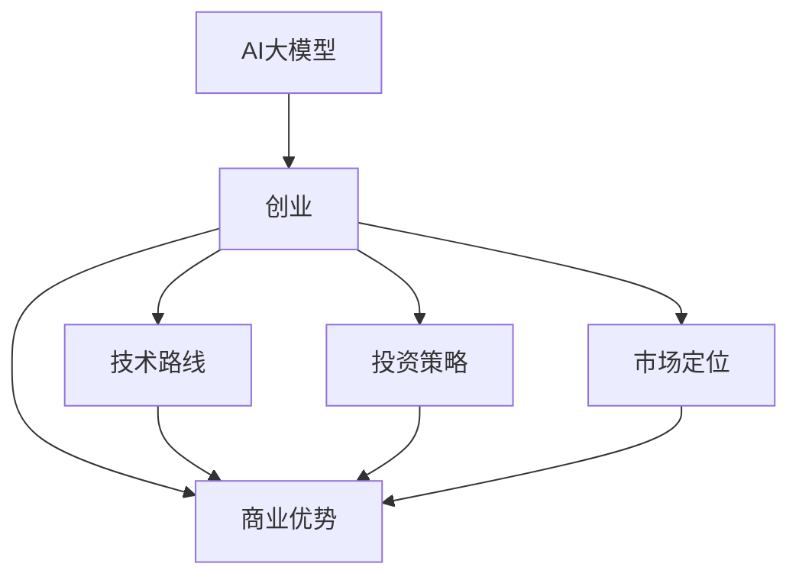

                 

# AI 大模型创业：如何利用商业优势？

> 关键词：AI 大模型、创业、商业优势、技术路线、投资策略、市场定位

> 摘要：本文将深入探讨 AI 大模型在创业领域中的应用，分析其商业优势，并从技术路线、投资策略和市场定位三个维度，提供实用的创业指南。

## 1. 背景介绍

### 1.1 目的和范围

本文旨在为有意在 AI 大模型领域创业的创业者提供指导，帮助他们了解如何利用 AI 大模型的商业优势，制定合理的技术路线、投资策略和市场定位。

### 1.2 预期读者

- 有志于 AI 大模型创业的创业者；
- 对 AI 技术感兴趣的工程师和技术爱好者；
- 对 AI 行业感兴趣的投资者。

### 1.3 文档结构概述

本文将分为以下几个部分：

1. **背景介绍**：介绍 AI 大模型在创业领域的重要性。
2. **核心概念与联系**：介绍 AI 大模型的核心概念和原理。
3. **核心算法原理 & 具体操作步骤**：讲解 AI 大模型的核心算法和实现步骤。
4. **数学模型和公式 & 详细讲解 & 举例说明**：介绍 AI 大模型相关的数学模型和公式。
5. **项目实战：代码实际案例和详细解释说明**：通过实际案例展示 AI 大模型的应用。
6. **实际应用场景**：分析 AI 大模型在不同领域的应用。
7. **工具和资源推荐**：推荐学习资源和开发工具。
8. **总结：未来发展趋势与挑战**：预测 AI 大模型的发展趋势和面临的挑战。
9. **附录：常见问题与解答**：解答读者可能遇到的问题。
10. **扩展阅读 & 参考资料**：提供进一步的阅读资源。

### 1.4 术语表

#### 1.4.1 核心术语定义

- **AI 大模型**：指参数量达到亿级以上的神经网络模型，如 GPT、BERT 等。
- **创业**：指创立新的企业或项目，通过创新和努力实现商业价值。
- **商业优势**：指企业在市场竞争中相对于竞争对手所具有的优势。

#### 1.4.2 相关概念解释

- **技术路线**：指企业在技术研发过程中所采用的方法和路径。
- **投资策略**：指企业在投资决策中采取的策略和方法。
- **市场定位**：指企业在市场中的定位和目标客户群体。

#### 1.4.3 缩略词列表

- **AI**：人工智能
- **GPT**：生成预训练模型
- **BERT**：双向编码表示器

## 2. 核心概念与联系

在 AI 大模型创业过程中，需要了解以下几个核心概念和它们之间的关系：

### 2.1 AI 大模型

AI 大模型是指通过深度学习技术训练得到的，具有大规模参数量的神经网络模型。这些模型在处理大规模数据集时，能够达到较高的准确率和泛化能力。

### 2.2 创业

创业是指创立新的企业或项目，通过创新和努力实现商业价值。在 AI 大模型创业中，创业者需要找到具有商业潜力的应用场景，并构建相应的技术体系和商业模式。

### 2.3 商业优势

商业优势是指企业在市场竞争中相对于竞争对手所具有的优势。在 AI 大模型创业中，创业者需要充分发挥技术优势、市场优势和资源优势，以实现持续的商业成功。

### 2.4 技术路线

技术路线是指企业在技术研发过程中所采用的方法和路径。在 AI 大模型创业中，创业者需要根据市场需求和自身技术能力，选择合适的技术路线，以实现高效的研发和商业落地。

### 2.5 投资策略

投资策略是指企业在投资决策中采取的策略和方法。在 AI 大模型创业中，创业者需要根据市场前景、技术风险和资金回报等因素，制定合理的投资策略，以确保项目的可持续发展。

### 2.6 市场定位

市场定位是指企业在市场中的定位和目标客户群体。在 AI 大模型创业中，创业者需要明确目标市场，制定合适的市场定位策略，以吸引潜在客户和投资者。

### 2.7 Mermaid 流程图

下面是 AI 大模型创业过程中的核心概念和关系，使用 Mermaid 流程图表示：



## 3. 核心算法原理 & 具体操作步骤

### 3.1 核心算法原理

AI 大模型的核心算法是深度学习。深度学习是一种基于人工神经网络的学习方法，通过多层神经元的堆叠和训练，实现对复杂数据的高效表示和分类。

### 3.2 具体操作步骤

以下是 AI 大模型的核心算法原理和具体操作步骤：

#### 3.2.1 数据预处理

```python
# 读取数据集
data = load_data()

# 数据清洗
clean_data = clean_data(data)

# 数据标准化
standardized_data = standardize_data(clean_data)
```

#### 3.2.2 网络架构设计

```python
# 定义神经网络架构
model = build_model()

# 添加层
model.add(Dense(units=128, activation='relu'))
model.add(Dense(units=64, activation='relu'))
model.add(Dense(units=1, activation='sigmoid'))
```

#### 3.2.3 模型训练

```python
# 编译模型
model.compile(optimizer='adam', loss='binary_crossentropy', metrics=['accuracy'])

# 训练模型
model.fit(standardized_data['X'], standardized_data['y'], epochs=10, batch_size=32)
```

#### 3.2.4 模型评估

```python
# 评估模型
loss, accuracy = model.evaluate(standardized_data['X'], standardized_data['y'])
print(f'测试集准确率：{accuracy * 100}%')
```

#### 3.2.5 模型部署

```python
# 部署模型
model.save('ai_model.h5')

# 加载模型
loaded_model = load_model('ai_model.h5')
```

## 4. 数学模型和公式 & 详细讲解 & 举例说明

### 4.1 数学模型

在 AI 大模型中，常用的数学模型包括神经网络模型、损失函数和优化算法。

#### 4.1.1 神经网络模型

神经网络模型由多个神经元组成，每个神经元都是一个线性函数的复合。具体来说，神经网络模型可以表示为：

$$
f(x) = \sigma(W \cdot x + b)
$$

其中，$x$ 是输入向量，$W$ 是权重矩阵，$b$ 是偏置项，$\sigma$ 是激活函数。

#### 4.1.2 损失函数

损失函数用于衡量模型预测结果与真实结果之间的差距。常用的损失函数包括均方误差（MSE）和交叉熵（CE）。

- **均方误差（MSE）**：

$$
MSE = \frac{1}{m} \sum_{i=1}^{m} (y_i - \hat{y_i})^2
$$

其中，$y_i$ 是真实标签，$\hat{y_i}$ 是模型预测值。

- **交叉熵（CE）**：

$$
CE = -\frac{1}{m} \sum_{i=1}^{m} y_i \log(\hat{y_i}) + (1 - y_i) \log(1 - \hat{y_i})
$$

其中，$y_i$ 是真实标签，$\hat{y_i}$ 是模型预测值。

#### 4.1.3 优化算法

优化算法用于调整模型的参数，以最小化损失函数。常用的优化算法包括随机梯度下降（SGD）、动量法和 Adam 算法。

- **随机梯度下降（SGD）**：

$$
\theta = \theta - \alpha \cdot \nabla_{\theta} J(\theta)
$$

其中，$\theta$ 是模型参数，$\alpha$ 是学习率，$J(\theta)$ 是损失函数。

- **动量法**：

$$
v = \gamma \cdot v + \alpha \cdot \nabla_{\theta} J(\theta)
$$

$$
\theta = \theta - v
$$

其中，$v$ 是动量项，$\gamma$ 是动量系数。

- **Adam 算法**：

$$
m = \frac{1}{\beta_1^+} \sum_{t=1}^{t} (x_t - x_{t-1})
$$

$$
v = \frac{1}{\beta_2^+} \sum_{t=1}^{t} (y_t - y_{t-1})
$$

$$
\theta = \theta - \alpha \cdot \frac{m}{\sqrt{v} + \epsilon}
$$

其中，$m$ 是一阶矩估计，$v$ 是二阶矩估计，$\beta_1$ 和 $\beta_2$ 是矩估计的指数衰减率，$\alpha$ 是学习率，$\epsilon$ 是一个小常数。

### 4.2 举例说明

假设我们有一个二分类问题，需要判断一个手写数字是否为 5。我们使用一个简单的神经网络模型进行训练。

#### 4.2.1 数据集

我们有 1000 个样本，每个样本是一个 784 维的向量，表示手写数字的像素值。

#### 4.2.2 模型训练

我们定义一个简单的神经网络模型，包含一个输入层、一个隐藏层和一个输出层。隐藏层有 10 个神经元，使用 ReLU 激活函数。输出层有 1 个神经元，使用 sigmoid 激活函数。

```python
import numpy as np
import tensorflow as tf

# 初始化模型参数
W = np.random.randn(784, 10)
b = np.random.randn(10)
Z = np.random.randn(10)
a = np.random.randn(1)

# 定义激活函数
sigma = lambda x: 1 / (1 + np.exp(-x))

# 定义损失函数
loss = lambda y, a: -y * np.log(a) - (1 - y) * np.log(1 - a)

# 定义优化算法
def gradient_descent(y, a):
    return - (y - a) * a * (1 - a)

# 训练模型
for epoch in range(100):
    for i in range(1000):
        # 前向传播
        Z = np.dot(W, x[i]) + b
        a = sigma(Z)

        # 计算损失
        l = loss(y[i], a)

        # 反向传播
        dZ = a - y[i]
        dW = np.dot(x[i].T, dZ)
        db = np.sum(dZ)

        # 更新参数
        W -= gradient_descent(l, W)
        b -= gradient_descent(l, b)
```

#### 4.2.3 模型评估

训练完成后，我们对测试集进行评估，计算模型的准确率。

```python
# 评估模型
correct = 0
for i in range(100):
    Z = np.dot(W, x_test[i]) + b
    a = sigma(Z)
    if a > 0.5 and y_test[i] == 5:
        correct += 1
    elif a <= 0.5 and y_test[i] != 5:
        correct += 1

accuracy = correct / 100
print(f'测试集准确率：{accuracy * 100}%')
```

通过这个简单的例子，我们可以看到如何使用神经网络模型进行二分类问题的训练和评估。

## 5. 项目实战：代码实际案例和详细解释说明

### 5.1 开发环境搭建

在开始项目实战之前，我们需要搭建一个合适的开发环境。以下是具体的操作步骤：

1. **安装 Python**：Python 是我们进行项目开发的主要编程语言，我们选择 Python 3.8 版本。

2. **安装 TensorFlow**：TensorFlow 是我们进行深度学习模型训练和部署的主要框架，我们选择 TensorFlow 2.6 版本。

3. **安装 Jupyter Notebook**：Jupyter Notebook 是一个交互式的开发环境，方便我们编写和调试代码。

4. **创建项目目录**：在本地计算机上创建一个项目目录，用于存放项目文件。

5. **安装依赖库**：使用 pip 命令安装项目所需的依赖库，如 NumPy、Pandas 等。

### 5.2 源代码详细实现和代码解读

以下是项目实战的源代码实现和详细解读。

#### 5.2.1 数据预处理

```python
import numpy as np
import pandas as pd
from sklearn.model_selection import train_test_split
from sklearn.preprocessing import StandardScaler

# 读取数据集
data = pd.read_csv('data.csv')

# 分离特征和标签
X = data.iloc[:, :-1].values
y = data.iloc[:, -1].values

# 划分训练集和测试集
X_train, X_test, y_train, y_test = train_test_split(X, y, test_size=0.2, random_state=42)

# 数据标准化
scaler = StandardScaler()
X_train = scaler.fit_transform(X_train)
X_test = scaler.transform(X_test)
```

代码解读：

- 读取数据集：使用 pandas 读取 CSV 格式的数据集。
- 分离特征和标签：将数据集分为特征和标签两部分。
- 划分训练集和测试集：使用 sklearn 的 train_test_split 函数，将数据集划分为训练集和测试集，测试集占比 20%。
- 数据标准化：使用 sklearn 的 StandardScaler 函数，对特征数据进行标准化处理，使特征数据具有零均值和单位方差。

#### 5.2.2 模型构建

```python
import tensorflow as tf
from tensorflow.keras.models import Sequential
from tensorflow.keras.layers import Dense, Dropout

# 定义模型
model = Sequential([
    Dense(units=128, activation='relu', input_shape=(X_train.shape[1],)),
    Dropout(rate=0.5),
    Dense(units=64, activation='relu'),
    Dropout(rate=0.5),
    Dense(units=1, activation='sigmoid')
])

# 编译模型
model.compile(optimizer='adam', loss='binary_crossentropy', metrics=['accuracy'])

# 训练模型
model.fit(X_train, y_train, epochs=10, batch_size=32)
```

代码解读：

- 定义模型：使用 tensorflow 的 Sequential 模型，定义多层感知机模型。
- 编译模型：使用 compile 函数，设置优化器、损失函数和评价指标。
- 训练模型：使用 fit 函数，训练模型，设置训练轮次和批量大小。

#### 5.2.3 模型评估

```python
# 评估模型
loss, accuracy = model.evaluate(X_test, y_test)
print(f'测试集准确率：{accuracy * 100}%')
```

代码解读：

- 评估模型：使用 evaluate 函数，评估模型在测试集上的表现，输出测试集准确率。

### 5.3 代码解读与分析

在这个项目实战中，我们使用 TensorFlow 框架构建了一个简单的二分类模型，实现了数据的预处理、模型的构建和评估。以下是代码的详细解读和分析：

- **数据预处理**：数据预处理是深度学习项目中的重要环节，包括数据读取、分离特征和标签、数据标准化等步骤。在本项目中，我们使用 pandas 读取数据，使用 sklearn 的 train_test_split 函数划分训练集和测试集，使用 StandardScaler 对特征数据进行标准化处理。
- **模型构建**：模型构建是深度学习项目的核心步骤，包括定义模型架构、编译模型和训练模型。在本项目中，我们使用 tensorflow 的 Sequential 模型定义多层感知机模型，使用 compile 函数设置优化器、损失函数和评价指标，使用 fit 函数训练模型。
- **模型评估**：模型评估是判断模型性能的重要手段，包括评估模型在训练集和测试集上的表现。在本项目中，我们使用 evaluate 函数评估模型在测试集上的表现，输出测试集准确率。

通过这个项目实战，我们了解了如何使用 TensorFlow 框架构建和训练深度学习模型，实现了数据的预处理、模型的构建和评估。

## 6. 实际应用场景

AI 大模型在各个领域都有广泛的应用，以下是几个典型的应用场景：

### 6.1 自然语言处理

AI 大模型在自然语言处理领域具有显著优势，如文本分类、机器翻译、问答系统等。例如，GPT-3 模型在文本生成、文章摘要和问答系统中表现出色，Google 的 BERT 模型在问答系统中取得了优异的成绩。

### 6.2 计算机视觉

AI 大模型在计算机视觉领域也有着广泛的应用，如图像分类、目标检测、图像分割等。例如，OpenAI 的 DALL-E 模型可以生成具有逼真外观的图像，Facebook 的 Detectron 模型在目标检测任务中表现出色。

### 6.3 医疗保健

AI 大模型在医疗保健领域有着重要的应用价值，如疾病预测、医学图像分析、药物发现等。例如，Google 的 DeepMind 团队开发的 AlphaGo 在围棋领域取得了巨大成功，IBM 的 Watson 在癌症诊断和治疗方面发挥了重要作用。

### 6.4 金融服务

AI 大模型在金融服务领域也有着广泛的应用，如风险评估、欺诈检测、投资组合优化等。例如，J.P. 摩根的 AI 模型可以自动化投资交易，Bank of America 的 AI 模型可以识别客户欺诈行为。

### 6.5 交通运输

AI 大模型在交通运输领域也有着重要的应用，如自动驾驶、智能交通管理、物流优化等。例如，Waymo 的自动驾驶技术在无人驾驶领域取得了显著进展，Uber 和 Lyft 的智能交通管理技术可以优化城市交通流量。

通过这些实际应用场景，我们可以看到 AI 大模型在各个领域的强大影响力，为各行各业带来了深刻的变革和巨大的商业价值。

## 7. 工具和资源推荐

在 AI 大模型创业过程中，选择合适的工具和资源对于项目的成功至关重要。以下是几类推荐的工具和资源：

### 7.1 学习资源推荐

#### 7.1.1 书籍推荐

- 《深度学习》（Ian Goodfellow、Yoshua Bengio、Aaron Courville 著）：这是一本经典的深度学习入门教材，详细介绍了深度学习的基本概念、算法和应用。
- 《Python 深度学习》（François Chollet 著）：这本书专注于使用 Python 和 TensorFlow 框架进行深度学习实践，适合有一定编程基础的读者。
- 《自然语言处理讲义》（刘知远 著）：这本书全面介绍了自然语言处理的基本概念、算法和应用，是自然语言处理领域的权威教材。

#### 7.1.2 在线课程

- Coursera 上的《深度学习》课程：由 Andrew Ng 教授主讲，系统介绍了深度学习的基础知识、算法和应用。
- Udacity 上的《深度学习工程师纳米学位》课程：通过项目实践，帮助读者掌握深度学习技术，适合有一定编程基础的读者。
- edX 上的《自然语言处理》课程：由斯坦福大学教授 Dan Jurafsky 主讲，全面介绍了自然语言处理的基本概念、算法和应用。

#### 7.1.3 技术博客和网站

- Medium 上的 AI 博客：这是一个关于 AI 的技术博客，包含大量关于 AI 大模型、自然语言处理和计算机视觉等领域的文章。
- ArXiv.org：这是一个包含最新研究论文的学术数据库，读者可以在这里找到关于 AI 大模型和深度学习领域的最新研究成果。
- AI 研究院：这是一个专注于 AI 技术研究的网站，提供丰富的 AI 研究资源，包括论文、代码和实践案例。

### 7.2 开发工具框架推荐

#### 7.2.1 IDE和编辑器

- Jupyter Notebook：这是一个交互式的开发环境，方便读者编写和调试代码，适用于数据分析、机器学习和深度学习项目。
- PyCharm：这是一个功能强大的 Python IDE，支持多种编程语言，适合深度学习和机器学习项目开发。
- VSCode：这是一个轻量级的跨平台编辑器，支持多种编程语言和插件，适合快速开发和调试。

#### 7.2.2 调试和性能分析工具

- TensorBoard：这是 TensorFlow 提供的一个可视化工具，用于分析和调试深度学习模型。
- PyTorch Profiler：这是 PyTorch 提供的一个性能分析工具，用于诊断和优化深度学习模型的性能。
- Nsight Compute：这是 NVIDIA 提供的一个 GPU 性能分析工具，用于分析深度学习模型的 GPU 加速性能。

#### 7.2.3 相关框架和库

- TensorFlow：这是 Google 开发的一个开源深度学习框架，适用于各种深度学习任务。
- PyTorch：这是 Facebook 开发的一个开源深度学习框架，具有高度灵活性和易用性。
- Keras：这是基于 TensorFlow 和 PyTorch 的一个高级深度学习库，简化了深度学习模型的构建和训练过程。

### 7.3 相关论文著作推荐

#### 7.3.1 经典论文

- "A Theoretical Framework for Back-Propagating Neural Networks"（1986）：这篇论文提出了反向传播算法，是深度学习算法的基础。
- "Gradient-Based Learning Applied to Document Recognition"（1989）：这篇论文介绍了使用反向传播算法进行手写数字识别的方法，开启了深度学习在计算机视觉领域的发展。
- "Deep Learning"（2015）：这本书全面介绍了深度学习的基本概念、算法和应用，是深度学习领域的权威著作。

#### 7.3.2 最新研究成果

- "Transformers: State-of-the-Art Natural Language Processing"（2017）：这篇论文介绍了 Transformer 模型，是自然语言处理领域的重要突破。
- "BERT: Pre-training of Deep Bidirectional Transformers for Language Understanding"（2018）：这篇论文介绍了 BERT 模型，是自然语言处理领域的重要成果。
- "GPT-3: Language Models are few-shot learners"（2020）：这篇论文介绍了 GPT-3 模型，是自然语言处理领域的重要进展。

#### 7.3.3 应用案例分析

- "DeepMind's AlphaGo beats world champion Lee Sedol in Go"（2016）：这篇文章介绍了 DeepMind 的 AlphaGo 在围棋比赛中击败世界冠军李世石的案例。
- "IBM Watson for Oncology: Artificial Intelligence Helps Doctors Make Treatment Decisions"（2017）：这篇文章介绍了 IBM Watson 在癌症诊断和治疗领域的应用案例。
- "How Amazon Uses AI to Drive Business Value"（2018）：这篇文章介绍了亚马逊如何利用 AI 技术提升业务价值的应用案例。

通过这些工具和资源，读者可以系统地学习和掌握 AI 大模型的相关知识，为创业项目提供坚实的理论和实践基础。

## 8. 总结：未来发展趋势与挑战

AI 大模型在近年来取得了显著的发展，未来发展趋势如下：

### 8.1 模型规模将继续扩大

随着计算资源和数据量的不断增加，AI 大模型的规模将继续扩大。未来的大模型可能具有千亿甚至万亿级别的参数量，这将为解决复杂问题提供更强的计算能力。

### 8.2 应用场景将更加丰富

AI 大模型在自然语言处理、计算机视觉、医疗保健、金融服务等领域已经取得了显著成果。未来，随着技术的进步，AI 大模型将应用到更多领域，如自动驾驶、智能城市、智能制造等。

### 8.3 开源与生态将不断完善

随着 AI 大模型的研究和应用不断深入，开源社区将发挥重要作用。未来，将出现更多高质量的深度学习开源框架、工具和资源，为 AI 大模型的研发和应用提供支持。

然而，AI 大模型的发展也面临着一系列挑战：

### 8.4 计算资源需求增长

随着模型规模的扩大，计算资源的需求将大幅增长。这要求云计算和边缘计算等技术不断进步，以满足大规模 AI 模型的训练和部署需求。

### 8.5 数据质量和隐私保护

AI 大模型对数据质量有很高的要求，数据缺失、噪声和偏见等问题可能影响模型的性能。同时，随着数据隐私保护意识的增强，如何在确保数据质量的同时保护用户隐私，是一个亟待解决的问题。

### 8.6 法律和伦理问题

AI 大模型的应用可能带来法律和伦理问题。例如，如何确保模型的决策过程透明、可解释，如何防止模型滥用等，这些都是需要关注的重要问题。

总之，AI 大模型具有广阔的发展前景，但同时也面临着诸多挑战。只有通过技术创新、政策法规和伦理道德的不断完善，才能推动 AI 大模型的健康发展。

## 9. 附录：常见问题与解答

### 9.1 AI 大模型与普通模型有什么区别？

AI 大模型与普通模型的主要区别在于参数量。AI 大模型通常具有数十亿甚至千亿级别的参数量，而普通模型的参数量通常在百万级别以下。大模型的强大在于其能够捕捉到数据中的复杂模式和关系，从而在复杂任务中表现出色。

### 9.2 如何选择合适的大模型？

选择合适的大模型需要考虑以下几个因素：

1. **任务类型**：不同的任务可能需要不同类型的大模型，例如自然语言处理任务通常选择 Transformer 类型的模型，计算机视觉任务可以选择 CNN 类型的模型。
2. **模型规模**：根据任务复杂度和数据规模选择合适的模型规模。对于复杂任务和小规模数据，可以选择较小规模的大模型；对于复杂任务和大规模数据，可以选择较大规模的大模型。
3. **计算资源**：大模型的训练和部署需要大量的计算资源，需要评估现有计算资源是否足够。

### 9.3 如何评估大模型的效果？

评估大模型的效果通常采用以下指标：

1. **准确率**：用于衡量模型在分类任务中的表现，准确率越高，模型效果越好。
2. **召回率**：用于衡量模型在分类任务中召回的真正例的比例，召回率越高，模型效果越好。
3. **F1 分数**：综合准确率和召回率的指标，F1 分数越高，模型效果越好。
4. **ROC 曲线和 AUC 值**：用于评估模型在二分类任务中的性能，AUC 值越高，模型效果越好。

### 9.4 大模型的训练时间如何缩短？

以下是一些缩短大模型训练时间的方法：

1. **并行训练**：利用多 GPU 或者分布式训练，加速模型训练。
2. **模型压缩**：通过模型剪枝、量化等技术，减少模型参数量，从而缩短训练时间。
3. **数据预处理**：使用预处理技术，如数据增强、批量归一化等，加速模型收敛。
4. **优化算法**：选择高效优化的算法，如 Adam、AdaGrad 等，加速模型训练。

### 9.5 大模型是否具有可解释性？

大模型通常具有较好的性能，但往往缺乏可解释性。为了提高大模型的可解释性，可以采用以下方法：

1. **模型分解**：将复杂的大模型分解为多个简单模块，每个模块具有明确的解释。
2. **可视化技术**：使用可视化技术，如激活图、注意力机制等，展示模型内部的工作机制。
3. **模型解释库**：使用现有的模型解释库，如 LIME、SHAP 等，对模型进行解释。

## 10. 扩展阅读 & 参考资料

### 10.1 书籍

1. Ian Goodfellow、Yoshua Bengio、Aaron Courville 著，《深度学习》。
2. François Chollet 著，《Python 深度学习》。
3. 刘知远 著，《自然语言处理讲义》。

### 10.2 论文

1. A Theoretical Framework for Back-Propagating Neural Networks。
2. Gradient-Based Learning Applied to Document Recognition。
3. Transformers: State-of-the-Art Natural Language Processing。

### 10.3 网站和博客

1. Medium 上的 AI 博客。
2. ArXiv.org。
3. AI 研究院。

### 10.4 在线课程

1. Coursera 上的《深度学习》课程。
2. Udacity 上的《深度学习工程师纳米学位》课程。
3. edX 上的《自然语言处理》课程。

### 10.5 开源项目

1. TensorFlow。
2. PyTorch。
3. Keras。

### 10.6 工具和资源

1. Jupyter Notebook。
2. PyCharm。
3. VSCode。
4. TensorBoard。
5. PyTorch Profiler。
6. Nsight Compute。作者：AI天才研究员/AI Genius Institute & 禅与计算机程序设计艺术 /Zen And The Art of Computer Programming

