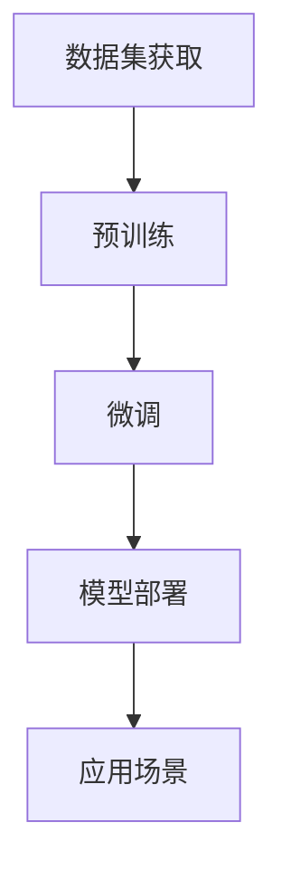

                 

# AI 大模型创业：如何利用国际优势？

## 摘要

人工智能领域正迎来前所未有的发展机遇，大模型技术作为其中的关键驱动力，正引发全球范围内的关注和投入。本文旨在探讨AI大模型创业的国际优势，从技术发展、市场机会、合作模式和风险控制等多方面分析，帮助创业者在全球舞台上找到独特的立足点。我们将通过详细的分析和实际案例，为AI大模型创业提供策略指导和实用建议。

## 1. 背景介绍

在过去的几年中，人工智能（AI）技术经历了从实验室走向市场，再到大规模商业应用的转变。这一过程中，大模型技术扮演了至关重要的角色。大模型，如OpenAI的GPT系列、Google的Bard、百度的文心大模型等，通过海量的数据和强大的计算能力，实现了前所未有的性能提升，推动了一系列新兴应用的出现，包括自然语言处理（NLP）、计算机视觉（CV）、推荐系统等。

### 1.1 技术发展历程

大模型技术的发展历程可以追溯到上世纪80年代，当时研究人员开始尝试使用神经网络来模拟人类大脑的学习能力。随着计算能力的提升和海量数据资源的积累，深度学习技术在21世纪初取得了突破性进展。特别是2012年，AlexNet在ImageNet图像识别竞赛中取得的优异成绩，标志着深度学习进入一个新纪元。

在此之后，研究人员不断探索如何构建更大、更复杂的神经网络模型。2018年，Google推出的Transformer架构彻底改变了自然语言处理领域的格局。基于Transformer的BERT、GPT等大模型，通过自注意力机制和大规模预训练，实现了对文本、图像等复杂数据的精准理解和生成。

### 1.2 市场机遇

随着大模型技术的成熟，市场需求也随之增长。各行各业对AI技术的需求日益旺盛，从金融、医疗到制造业，AI正成为提高效率、降低成本、创造新价值的重要工具。特别是随着5G、云计算等技术的普及，AI大模型的应用场景不断扩大，市场前景广阔。

在全球范围内，越来越多的企业开始布局AI大模型技术，寻求在竞争中取得先发优势。与此同时，各国政府也纷纷出台政策，支持AI技术研发和产业化，为创业者提供了有利的外部环境。

## 2. 核心概念与联系

在探讨AI大模型创业的国际优势之前，我们首先需要理解几个核心概念和它们之间的联系。

### 2.1 大模型技术的基本原理

大模型技术主要基于深度学习和神经网络，特别是近年来兴起的自注意力机制（如Transformer架构）。自注意力机制允许模型在处理输入数据时，自动关注到数据中的重要部分，从而提高模型对复杂任务的识别和理解能力。

### 2.2 大模型的应用领域

大模型技术在多个领域展现出了强大的潜力。以下是一些主要的应用领域：

- **自然语言处理（NLP）**：包括语言翻译、文本生成、情感分析等。
- **计算机视觉（CV）**：如图像识别、视频分析、自动驾驶等。
- **推荐系统**：通过分析用户行为和兴趣，实现个性化推荐。
- **金融科技**：如风险控制、量化交易、信用评估等。
- **医疗健康**：如疾病诊断、药物研发、健康管理等。

### 2.3 大模型的架构

大模型通常由以下几个部分组成：

- **数据集**：用于训练模型的原始数据。
- **预训练**：在大量数据上进行模型训练，使其具备基本的能力。
- **微调**：在特定任务上对模型进行细粒度的调整，以适应具体应用场景。

### 2.4 大模型的计算需求

大模型训练和部署需要强大的计算资源。特别是训练阶段，计算资源的需求随着模型规模的增加而急剧上升。近年来，GPU和TPU等专用硬件的快速发展，为大规模模型训练提供了有力支持。

### 2.5 大模型的安全性

随着AI大模型的应用日益广泛，其安全性问题也日益突出。大模型可能受到恶意攻击，导致数据泄露或功能失常。因此，保障大模型的安全性是创业过程中不可忽视的重要方面。

### 2.6 Mermaid流程图

以下是一个简化的Mermaid流程图，展示了大模型技术的基本流程：



在这个流程图中，数据集获取、预训练、微调和模型部署是四个关键步骤。每个步骤都需要相应的技术和资源支持，以确保模型的有效性和实用性。

## 3. 核心算法原理 & 具体操作步骤

### 3.1 深度学习基础

深度学习是构建大模型的核心技术。以下简要介绍深度学习的基本原理和常用算法：

- **神经网络（Neural Network）**：模仿人脑神经元之间的连接，通过层层处理输入数据，实现复杂函数的逼近。
- **卷积神经网络（Convolutional Neural Network, CNN）**：主要用于图像处理，通过卷积操作提取图像的特征。
- **循环神经网络（Recurrent Neural Network, RNN）**：用于序列数据建模，如时间序列分析、语言建模等。
- **Transformer架构**：一种基于自注意力机制的神经网络模型，广泛应用于自然语言处理任务。

### 3.2 自注意力机制

自注意力机制是Transformer架构的核心，它允许模型在处理输入序列时，自动关注到序列中的重要部分。具体步骤如下：

1. **输入序列编码**：将输入序列转换为向量表示，通常使用嵌入层（Embedding Layer）。
2. **多头自注意力**：将输入序列分成多个头，每个头独立计算自注意力，然后合并结果。
3. **前馈神经网络**：对自注意力结果进行进一步处理，增加模型的非线性表达能力。

### 3.3 大模型训练过程

大模型的训练过程可以分为以下几个步骤：

1. **数据预处理**：清洗和预处理原始数据，包括去噪、归一化、数据增强等。
2. **模型初始化**：随机初始化模型参数，通常使用正态分布或高斯分布。
3. **前向传播**：输入数据通过模型，计算输出结果。
4. **反向传播**：计算损失函数，更新模型参数。
5. **迭代训练**：重复前向传播和反向传播，直到模型收敛或达到预定的训练轮数。

### 3.4 大模型微调

在特定应用场景下，预训练的大模型可能需要进一步微调，以适应具体任务。微调过程通常包括以下几个步骤：

1. **选择任务**：确定需要微调的任务，如文本分类、图像识别等。
2. **调整模型结构**：根据任务需求，对模型结构进行适当调整，如增加或减少层、修改层间连接等。
3. **数据预处理**：针对任务数据，进行相应的预处理操作。
4. **训练模型**：使用调整后的模型在任务数据上进行训练。
5. **评估模型**：在验证集上评估模型性能，根据评估结果进行调整。

### 3.5 大模型部署

大模型部署是将训练好的模型部署到实际应用场景中。部署过程包括以下几个步骤：

1. **模型固化**：将训练好的模型参数保存为文件，以便后续使用。
2. **部署环境配置**：搭建部署环境，包括硬件配置、操作系统、框架依赖等。
3. **模型加载**：将模型文件加载到部署环境中，进行初始化。
4. **接口设计**：设计模型接口，以便与其他系统进行集成。
5. **性能优化**：根据应用场景，对模型进行性能优化，如量化、剪枝等。

## 4. 数学模型和公式 & 详细讲解 & 举例说明

### 4.1 深度学习中的基本数学模型

在深度学习中，数学模型起到了核心作用。以下是几个基本数学模型及其简要解释：

#### 4.1.1 激活函数

激活函数是深度学习模型中不可或缺的一部分，用于引入非线性特性。以下是一些常见的激活函数：

- **sigmoid函数**：\[ f(x) = \frac{1}{1 + e^{-x}} \]
  - **作用**：将输入映射到（0,1）区间，常用于二分类问题。
  - **例子**：假设输入x为3，计算sigmoid函数的输出：
    \[ f(3) = \frac{1}{1 + e^{-3}} \approx 0.95 \]

- **ReLU函数**：\[ f(x) = \max(0, x) \]
  - **作用**：引入稀疏性，加速训练过程。
  - **例子**：假设输入x为-2，计算ReLU函数的输出：
    \[ f(-2) = \max(0, -2) = 0 \]

- **Tanh函数**：\[ f(x) = \frac{e^x - e^{-x}}{e^x + e^{-x}} \]
  - **作用**：将输入映射到（-1,1）区间，常用于回归问题。
  - **例子**：假设输入x为2，计算Tanh函数的输出：
    \[ f(2) = \frac{e^2 - e^{-2}}{e^2 + e^{-2}} \approx 0.96 \]

#### 4.1.2 损失函数

损失函数用于衡量模型预测结果与实际结果之间的差距，常见的损失函数包括：

- **均方误差（MSE）**：\[ Loss = \frac{1}{n}\sum_{i=1}^{n}(y_i - \hat{y}_i)^2 \]
  - **作用**：用于回归问题。
  - **例子**：假设有3个样本，实际输出为\[y_1, y_2, y_3\]，预测输出为\[ \hat{y}_1, \hat{y}_2, \hat{y}_3\]，计算MSE损失：
    \[ Loss = \frac{1}{3}[(y_1 - \hat{y}_1)^2 + (y_2 - \hat{y}_2)^2 + (y_3 - \hat{y}_3)^2] \]

- **交叉熵（Cross-Entropy）**：\[ Loss = -\sum_{i=1}^{n} y_i \log(\hat{y}_i) \]
  - **作用**：用于分类问题。
  - **例子**：假设有3个样本，实际输出为\[y_1, y_2, y_3\]，其中\[y_1 = 1, y_2 = 0, y_3 = 1\]，预测输出为\[ \hat{y}_1, \hat{y}_2, \hat{y}_3\]，其中\[ \hat{y}_1 = 0.8, \hat{y}_2 = 0.2, \hat{y}_3 = 0.6\]，计算交叉熵损失：
    \[ Loss = -[1 \cdot \log(0.8) + 0 \cdot \log(0.2) + 1 \cdot \log(0.6)] \]

### 4.2 大模型中的自注意力机制

自注意力机制是Transformer架构的核心，通过计算输入序列中每个元素与其他元素之间的关联性，实现对输入序列的细粒度处理。以下是自注意力机制的数学描述：

#### 4.2.1 自注意力公式

\[ \text{Attention}(Q, K, V) = \text{softmax}\left(\frac{QK^T}{\sqrt{d_k}}\right)V \]

其中：
- \( Q, K, V \) 分别是查询（Query）、键（Key）、值（Value）向量，维度相同。
- \( d_k \) 是键向量的维度。
- \( QK^T \) 是查询和键的矩阵乘积，结果是一个二维矩阵。
- \( \text{softmax} \) 是归一化操作，用于将矩阵乘积转换为概率分布。

#### 4.2.2 多头注意力

多头注意力（Multi-Head Attention）是自注意力机制的一种扩展，通过多个独立的注意力头来捕捉输入序列的多种关联性。数学描述如下：

\[ \text{MultiHead}(Q, K, V) = \text{softmax}\left(\frac{QW_QK^T}{\sqrt{d_k}}\right)W_V \]

其中：
- \( W_Q, W_K, W_V \) 分别是查询、键、值权重矩阵，维度为\[ d_model \times d_k \]。
- \( W_V \) 是值权重矩阵，维度为\[ d_model \times d_v \]。

#### 4.2.3 自注意力计算示例

假设有一个序列\[ x_1, x_2, x_3 \]，我们需要计算序列中每个元素与其他元素的关联性。

1. **嵌入层**：将序列中的每个元素（比如单词）转换为向量表示。

2. **查询、键、值向量**：根据嵌入层输出，分别计算查询（Q）、键（K）、值（V）向量。

3. **计算自注意力**：对每个查询向量与其他键向量进行点积运算，得到注意力权重。

4. **加权求和**：根据注意力权重，将值向量加权求和，得到新的序列表示。

5. **多头注意力**：将自注意力结果通过多个独立的注意力头进行处理，增加模型的表示能力。

假设我们使用两个注意力头，查询、键、值向量的维度分别为\[ 64, 64, 64 \]。

- **查询向量**：\[ Q_1, Q_2 \]
- **键向量**：\[ K_1, K_2 \]
- **值向量**：\[ V_1, V_2 \]

计算过程如下：

1. **计算注意力权重**：

\[ 
A_1 = \text{softmax}\left(\frac{Q_1K_1^T}{\sqrt{64}}\right) \\
A_2 = \text{softmax}\left(\frac{Q_1K_2^T}{\sqrt{64}}\right) \\
B_1 = \text{softmax}\left(\frac{Q_2K_1^T}{\sqrt{64}}\right) \\
B_2 = \text{softmax}\left(\frac{Q_2K_2^T}{\sqrt{64}}\right)
\]

2. **加权求和**：

\[ 
V'_{1} = A_1V_1 + A_2V_2 \\
V'_{2} = B_1V_1 + B_2V_2 
\]

3. **多头注意力输出**：

\[ 
\text{MultiHead}(Q, K, V) = [V'_{1}, V'_{2}] 
\]

通过这种方式，自注意力机制能够捕捉序列中的长距离依赖关系，实现对输入序列的细粒度处理。

### 4.3 大模型训练中的优化算法

大模型训练通常涉及到大量的参数调整，优化算法在这个过程中起到了关键作用。以下介绍几种常用的优化算法：

#### 4.3.1 随机梯度下降（SGD）

随机梯度下降是最简单的优化算法，其核心思想是每次迭代只随机选择一部分样本进行梯度计算和参数更新。

\[ 
\theta = \theta - \alpha \cdot \nabla_{\theta} J(\theta) 
\]

其中：
- \( \theta \) 是模型参数。
- \( \alpha \) 是学习率。
- \( \nabla_{\theta} J(\theta) \) 是损失函数关于模型参数的梯度。

#### 4.3.2 动量优化（Momentum）

动量优化通过引入动量项，累积之前的梯度，提高优化过程的速度和稳定性。

\[ 
v_t = \gamma v_{t-1} + \alpha \nabla_{\theta} J(\theta) \\
\theta = \theta - v_t 
\]

其中：
- \( v_t \) 是动量项。
- \( \gamma \) 是动量系数。

#### 4.3.3 Adam优化器

Adam优化器结合了动量和RMSprop的优点，通过计算一阶矩估计（均值）和二阶矩估计（方差），自适应调整学习率。

\[ 
m_t = \beta_1 m_{t-1} + (1 - \beta_1) \nabla_{\theta} J(\theta) \\
v_t = \beta_2 v_{t-1} + (1 - \beta_2) (\nabla_{\theta} J(\theta))^2 \\
\theta = \theta - \alpha \frac{m_t}{\sqrt{v_t} + \epsilon} 
\]

其中：
- \( m_t \) 是一阶矩估计。
- \( v_t \) 是二阶矩估计。
- \( \beta_1, \beta_2 \) 是超参数。

## 5. 项目实战：代码实际案例和详细解释说明

### 5.1 开发环境搭建

在开始构建AI大模型之前，我们需要搭建一个合适的开发环境。以下是在Python环境中使用TensorFlow搭建AI大模型开发环境的步骤：

1. **安装Python**：确保Python版本为3.7或更高。

2. **安装TensorFlow**：使用pip命令安装TensorFlow。

   ```shell
   pip install tensorflow
   ```

3. **安装GPU版本TensorFlow**（如果使用GPU训练）：使用以下命令安装GPU版本的TensorFlow。

   ```shell
   pip install tensorflow-gpu
   ```

4. **安装其他依赖**：根据项目需求，安装其他必要的库，如NumPy、Pandas等。

   ```shell
   pip install numpy pandas
   ```

### 5.2 源代码详细实现和代码解读

以下是一个简单的示例，展示如何使用TensorFlow构建一个基于Transformer架构的文本分类模型。代码分为以下几个部分：

1. **数据预处理**：读取和处理输入文本数据。
2. **模型定义**：定义Transformer模型结构。
3. **模型训练**：使用训练数据训练模型。
4. **模型评估**：在验证集上评估模型性能。
5. **模型部署**：将训练好的模型部署到生产环境。

```python
import tensorflow as tf
from tensorflow.keras.layers import Embedding, TransformerEncoder
from tensorflow.keras.models import Model
from tensorflow.keras.preprocessing.sequence import pad_sequences

# 1. 数据预处理
# 假设已有一份包含文本和标签的数据集
texts = ['这是一个文本示例', '另一个文本示例', '第三个文本示例']
labels = [0, 1, 0]

# 将文本序列化并填充
max_length = 10
padded_texts = pad_sequences(texts, maxlen=max_length)

# 2. 模型定义
# 定义嵌入层
embedding = Embedding(input_dim=len(texts), output_dim=64)

# 定义Transformer编码器
transformer_encoder = TransformerEncoder(num_layers=2, d_model=64, num_heads=2)

# 定义模型结构
inputs = tf.keras.Input(shape=(max_length,))
x = embedding(inputs)
x = transformer_encoder(x)

# 添加全连接层和输出层
outputs = tf.keras.layers.Dense(2, activation='softmax')(x)

# 构建模型
model = Model(inputs=inputs, outputs=outputs)

# 编译模型
model.compile(optimizer='adam', loss='categorical_crossentropy', metrics=['accuracy'])

# 3. 模型训练
model.fit(padded_texts, labels, epochs=5, batch_size=32)

# 4. 模型评估
test_texts = ['第四个文本示例', '第五个文本示例']
padded_test_texts = pad_sequences(test_texts, maxlen=max_length)
predictions = model.predict(padded_test_texts)
print(predictions)

# 5. 模型部署
# 将模型保存为HDF5文件
model.save('text_classification_model.h5')
```

### 5.3 代码解读与分析

以下是对上述代码的详细解读和分析：

- **数据预处理**：
  - 使用`pad_sequences`函数将输入文本序列填充到同一长度，便于模型处理。

- **模型定义**：
  - 使用`Embedding`层将文本转换为向量表示。
  - 使用`TransformerEncoder`层构建Transformer编码器。
  - 将编码器输出连接到全连接层和输出层，实现文本分类。

- **模型训练**：
  - 使用`model.fit`函数训练模型，指定训练数据、标签、训练轮数和批次大小。

- **模型评估**：
  - 使用`model.predict`函数在测试数据上预测标签，输出预测结果。

- **模型部署**：
  - 使用`model.save`函数将训练好的模型保存为HDF5文件，便于后续加载和使用。

### 5.4 性能优化

在实际应用中，我们通常需要优化模型性能，以下是一些常见的优化策略：

- **数据增强**：通过增加数据多样性，提高模型泛化能力。
- **模型剪枝**：去除模型中不重要的连接和神经元，降低模型复杂度。
- **量化**：将模型参数从浮点数转换为低精度格式，降低模型存储和计算需求。
- **迁移学习**：使用预训练模型作为起点，进行微调，提高模型性能。

## 6. 实际应用场景

### 6.1 金融领域

在金融领域，AI大模型技术广泛应用于风险管理、量化交易、信用评估等方面。以下是一些具体应用案例：

- **风险管理**：通过分析历史数据和市场走势，AI大模型能够预测金融市场的波动，帮助金融机构制定风险控制策略。
- **量化交易**：AI大模型可以根据市场数据生成交易策略，实现自动化的交易操作，提高交易效率和收益。
- **信用评估**：AI大模型通过对个人或企业的信用历史、财务状况等多方面信息进行分析，提供信用评分，辅助金融机构进行信用决策。

### 6.2 医疗健康

在医疗健康领域，AI大模型技术有助于提升疾病诊断、药物研发和健康管理等方面的能力。以下是一些具体应用案例：

- **疾病诊断**：通过分析医学图像和病历数据，AI大模型能够辅助医生进行疾病诊断，提高诊断准确率和效率。
- **药物研发**：AI大模型可以分析大量的生物数据，预测药物的有效性和安全性，加速新药的研发进程。
- **健康管理**：AI大模型可以根据个人的健康数据，提供个性化的健康建议和预防措施，提高健康管理水平。

### 6.3 教育领域

在教育领域，AI大模型技术有助于提升教学质量、学习体验和个性化教育。以下是一些具体应用案例：

- **智能辅导**：AI大模型可以根据学生的学习情况和知识点掌握情况，提供个性化的辅导建议，帮助学生提高学习效果。
- **自动批改**：AI大模型可以自动批改学生作业，提供即时反馈，节省教师批改时间，提高教学效率。
- **智能推荐**：AI大模型可以根据学生的学习兴趣和进度，推荐适合的学习资源和课程，实现个性化教育。

### 6.4 制造业

在制造业领域，AI大模型技术有助于提升生产效率、产品质量和设备维护。以下是一些具体应用案例：

- **质量控制**：AI大模型可以通过分析生产数据，识别异常情况，提前预警质量风险，提高产品质量。
- **设备维护**：AI大模型可以根据设备运行数据，预测设备故障，制定预防性维护计划，降低设备停机时间。
- **生产优化**：AI大模型可以通过分析生产流程和资源配置，提供优化建议，提高生产效率和资源利用率。

## 7. 工具和资源推荐

### 7.1 学习资源推荐

以下是一些关于AI大模型技术的优秀学习资源：

- **书籍**：
  - 《深度学习》（Deep Learning）作者：Ian Goodfellow、Yoshua Bengio、Aaron Courville
  - 《自然语言处理综述》（Speech and Language Processing）作者：Daniel Jurafsky、James H. Martin
- **论文**：
  - “Attention Is All You Need”（Transformer架构的原创论文）
  - “BERT: Pre-training of Deep Bidirectional Transformers for Language Understanding”（BERT模型的原创论文）
- **博客**：
  - [TensorFlow官方文档](https://www.tensorflow.org/)
  - [PyTorch官方文档](https://pytorch.org/)
- **网站**：
  - [Hugging Face](https://huggingface.co/)：提供丰富的预训练模型和工具库，方便模型开发和部署。

### 7.2 开发工具框架推荐

以下是一些常用的AI大模型开发工具和框架：

- **TensorFlow**：谷歌开源的深度学习框架，支持多种模型架构和算法。
- **PyTorch**：Facebook开源的深度学习框架，提供灵活的动态图操作，便于模型开发和调试。
- **Transformers**：基于PyTorch的Transformer架构实现，提供丰富的预训练模型和工具库。
- **Hugging Face Transformers**：开源的Transformer架构实现，提供丰富的预训练模型和工具库，方便模型开发和部署。

### 7.3 相关论文著作推荐

以下是一些关于AI大模型技术的重要论文和著作：

- **“Attention Is All You Need”**：提出Transformer架构，彻底改变了自然语言处理领域的格局。
- **“BERT: Pre-training of Deep Bidirectional Transformers for Language Understanding”**：提出BERT模型，实现了基于Transformer的自监督预训练。
- **“GPT-3: Language Models are Few-Shot Learners”**：提出GPT-3模型，展示了自监督预训练在语言理解任务中的强大能力。
- **《深度学习》**：全面介绍了深度学习的基本理论、算法和实战技巧，是深度学习领域的经典著作。

## 8. 总结：未来发展趋势与挑战

### 8.1 未来发展趋势

1. **计算能力的进一步提升**：随着GPU、TPU等专用硬件的发展，AI大模型的计算需求将得到更好的满足，推动大模型技术的广泛应用。
2. **数据资源的不断丰富**：随着互联网和物联网的普及，数据资源将更加丰富多样，为AI大模型的发展提供坚实基础。
3. **跨领域融合**：AI大模型技术将在金融、医疗、教育、制造等各个领域实现深度融合，推动产业升级和创新发展。
4. **自监督学习的普及**：自监督学习作为一种无需标注数据的预训练方法，将在AI大模型领域得到广泛应用，降低数据标注成本。

### 8.2 面临的挑战

1. **计算资源消耗**：AI大模型的训练和部署需要大量计算资源，如何高效利用现有计算资源是一个重要挑战。
2. **数据隐私和安全**：随着AI大模型的应用场景不断扩大，数据隐私和安全问题日益突出，需要建立完善的数据保护机制。
3. **模型解释性和可靠性**：大模型的复杂性和黑箱特性导致其解释性和可靠性受到质疑，需要开发可解释性和可靠性的评估方法。
4. **跨模态学习**：AI大模型在跨模态学习方面仍有很大发展空间，如何同时处理文本、图像、声音等多种模态数据是一个重要挑战。

## 9. 附录：常见问题与解答

### 9.1 如何选择合适的预训练模型？

选择预训练模型时，可以从以下几个方面进行考虑：

- **任务需求**：根据具体任务需求，选择具有相应能力的预训练模型。
- **数据规模**：选择数据规模较大的预训练模型，有助于提高模型的泛化能力。
- **模型大小**：根据计算资源和内存限制，选择适合的模型大小。
- **开源社区支持**：选择开源社区支持较好的预训练模型，便于后续开发和优化。

### 9.2 如何处理数据不平衡问题？

数据不平衡问题可以通过以下方法进行解决：

- **数据增强**：通过增加较少类别数据的样本，平衡数据分布。
- **损失函数调整**：使用加权损失函数，提高较少类别样本的权重。
- **类别平衡**：在训练过程中，动态调整样本比例，保证各类别样本的训练次数相近。
- **集成学习**：使用集成学习方法，如Bagging、Boosting等，提高模型对较少类别样本的识别能力。

### 9.3 如何评估大模型的性能？

评估大模型的性能可以从以下几个方面进行：

- **准确率（Accuracy）**：衡量模型对正类别的识别能力。
- **召回率（Recall）**：衡量模型对正类别的召回能力。
- **F1值（F1 Score）**：综合考虑准确率和召回率，平衡二者的评价指标。
- **AUC（Area Under Curve）**：用于二分类问题，衡量模型区分正负样本的能力。
- **混淆矩阵（Confusion Matrix）**：展示模型在不同类别上的识别效果。

## 10. 扩展阅读 & 参考资料

- [Deep Learning](https://www.deeplearningbook.org/)：Ian Goodfellow、Yoshua Bengio、Aaron Courville 著，深度学习领域的经典著作。
- [Speech and Language Processing](https://web.stanford.edu/~jurafsky/slp3/)：Daniel Jurafsky、James H. Martin 著，自然语言处理领域的权威教材。
- [Attention Is All You Need](https://arxiv.org/abs/1706.03762)：Vaswani et al.，提出Transformer架构的原创论文。
- [BERT: Pre-training of Deep Bidirectional Transformers for Language Understanding](https://arxiv.org/abs/1810.04805)：Devlin et al.，提出BERT模型的原创论文。
- [GPT-3: Language Models are Few-Shot Learners](https://arxiv.org/abs/2005.14165)：Brown et al.，提出GPT-3模型的原创论文。
- [TensorFlow官方文档](https://www.tensorflow.org/)：TensorFlow深度学习框架的官方文档。
- [PyTorch官方文档](https://pytorch.org/)：PyTorch深度学习框架的官方文档。
- [Hugging Face](https://huggingface.co/)：提供丰富的预训练模型和工具库，方便模型开发和部署。

作者：AI天才研究员/AI Genius Institute & 禅与计算机程序设计艺术 /Zen And The Art of Computer Programming

