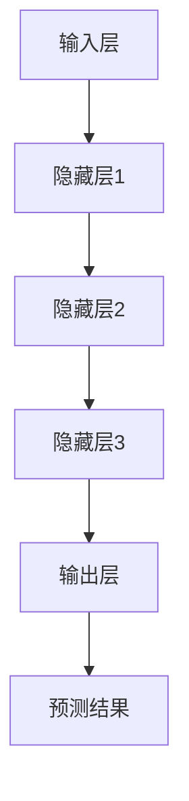

                 

# AI大模型创业：如何利用市场优势？

> **关键词：** AI大模型、创业、市场优势、商业模式、技术应用
> 
> **摘要：** 本文将深入探讨AI大模型创业的关键要素，包括市场优势的分析、商业模式的设计、核心技术应用的探讨，以及未来发展趋势与面临的挑战。通过逐步分析，帮助创业者更好地理解并利用AI大模型的市场优势，实现创新与成功。

## 1. 背景介绍

### 1.1 目的和范围

本文旨在为那些有意投身AI大模型创业的创业者提供一份详细的指南。我们将探讨AI大模型在当前市场环境下的优势，分析如何构建一个成功的商业模式，并深入理解AI大模型的核心技术和应用场景。文章将涵盖从市场调研到项目实施的各个环节，帮助创业者做出明智的商业决策。

### 1.2 预期读者

本文的预期读者包括：

- 有志于从事AI大模型创业的创业者
- 对AI大模型技术感兴趣的科技从业人士
- 想了解AI大模型商业模式的投资者
- 对AI技术发展有深入研究的学者和研究人员

### 1.3 文档结构概述

本文将分为十个部分：

1. **背景介绍**：介绍本文的目的、范围和预期读者。
2. **核心概念与联系**：阐述AI大模型的基本概念和架构。
3. **核心算法原理 & 具体操作步骤**：分析AI大模型的算法原理和操作步骤。
4. **数学模型和公式 & 详细讲解 & 举例说明**：介绍AI大模型的数学模型和公式。
5. **项目实战：代码实际案例和详细解释说明**：通过实际案例展示AI大模型的应用。
6. **实际应用场景**：探讨AI大模型在不同领域的应用。
7. **工具和资源推荐**：推荐学习资源、开发工具和框架。
8. **总结：未来发展趋势与挑战**：总结AI大模型创业的前景和挑战。
9. **附录：常见问题与解答**：解答常见的疑问。
10. **扩展阅读 & 参考资料**：提供进一步阅读的参考资料。

### 1.4 术语表

#### 1.4.1 核心术语定义

- **AI大模型**：指参数量巨大、训练数据庞大的深度学习模型。
- **市场优势**：指在市场竞争中相对于其他企业的有利条件。
- **商业模式**：指企业如何创造、传递和获取价值。
- **算法原理**：指AI大模型中使用的算法的基本原理。
- **数学模型**：用数学公式描述AI大模型的工作原理。

#### 1.4.2 相关概念解释

- **深度学习**：一种机器学习技术，通过多层神经网络进行数据分析和预测。
- **大数据**：指数据量大、种类多、生成速度快的复杂数据集合。
- **神经网络**：模拟人脑神经元连接的数学模型，用于数据分析和模式识别。

#### 1.4.3 缩略词列表

- **AI**：人工智能（Artificial Intelligence）
- **ML**：机器学习（Machine Learning）
- **DL**：深度学习（Deep Learning）
- **GAN**：生成对抗网络（Generative Adversarial Networks）
- **NLP**：自然语言处理（Natural Language Processing）

## 2. 核心概念与联系

### 2.1 AI大模型的基本概念

AI大模型是深度学习的一个分支，其核心在于通过大规模数据训练得到具有高度复杂性的模型。这种模型能够实现自动化的数据分析和决策，具有广泛的应用潜力。

#### 2.1.1 深度学习的基本原理

深度学习基于多层神经网络，通过反向传播算法不断优化网络参数，使其能够对数据进行有效的分类、回归或生成。每一层神经网络都能提取更高层次的特征，从而实现从简单到复杂的特征转换。

#### 2.1.2 大模型的特征

- **大规模参数**：AI大模型通常拥有数十亿甚至千亿级别的参数，这使得模型能够捕捉到数据中的复杂模式。
- **大规模训练数据**：大模型的训练需要大量的数据，这些数据来源可以是互联网、传感器、图像库等。
- **高效率的计算**：随着计算能力的提升，AI大模型能够高效地进行训练和推理。

### 2.2 AI大模型的架构

AI大模型的架构通常包括以下几个层次：

1. **输入层**：接收外部数据，如文本、图像、声音等。
2. **隐藏层**：通过多层神经网络提取特征，每一层都建立在前一层特征的基础上。
3. **输出层**：根据提取到的特征生成预测结果。

#### 2.2.1 Mermaid流程图



### 2.3 AI大模型的应用领域

AI大模型的应用领域广泛，包括但不限于：

- **自然语言处理（NLP）**：如文本分类、情感分析、机器翻译等。
- **计算机视觉**：如图像识别、目标检测、人脸识别等。
- **推荐系统**：基于用户行为和偏好进行个性化推荐。
- **金融分析**：如风险控制、股票预测、信用评估等。
- **医疗健康**：如疾病诊断、药物研发、个性化治疗等。

### 2.4 AI大模型的优势

AI大模型具有以下优势：

- **高准确性**：能够处理大规模、高维数据，提高预测和分类的准确性。
- **自适应性强**：能够根据新数据和场景进行自我优化。
- **泛用性**：可以应用于多种领域和任务，实现跨领域的迁移学习。

### 2.5 AI大模型的挑战

尽管AI大模型具有巨大的潜力，但也面临以下挑战：

- **数据隐私**：大模型需要大量敏感数据训练，如何保护数据隐私成为重要问题。
- **计算资源**：训练大模型需要大量计算资源，成本较高。
- **解释性**：大模型通常缺乏可解释性，难以理解其决策过程。

## 3. 核心算法原理 & 具体操作步骤

### 3.1 深度学习算法原理

深度学习算法的核心是多层神经网络，其基本原理如下：

1. **前向传播**：输入数据经过神经网络各个层，通过权重矩阵和激活函数进行非线性变换，最终得到输出。
2. **反向传播**：根据输出与真实值的差异，反向更新各个层的权重，使得输出更接近真实值。
3. **优化算法**：如梯度下降、随机梯度下降等，用于加速收敛和提高效果。

### 3.2 深度学习算法的具体操作步骤

以下是深度学习算法的具体操作步骤：

1. **数据预处理**：
    - **归一化**：将数据归一化到同一尺度，便于模型训练。
    - **数据增强**：通过旋转、缩放、裁剪等方式增加数据多样性。

2. **模型设计**：
    - **选择架构**：根据任务需求选择合适的神经网络架构，如卷积神经网络（CNN）、循环神经网络（RNN）、Transformer等。
    - **定义损失函数**：根据任务选择适当的损失函数，如均方误差（MSE）、交叉熵损失等。
    - **定义优化器**：选择合适的优化器，如Adam、RMSprop等。

3. **模型训练**：
    - **初始化参数**：随机初始化模型参数。
    - **前向传播**：输入数据，通过神经网络得到预测结果。
    - **计算损失**：计算预测结果与真实值的差异，得到损失值。
    - **反向传播**：根据损失值更新模型参数。
    - **迭代优化**：重复以上步骤，直至模型收敛。

4. **模型评估**：
    - **验证集评估**：在验证集上评估模型性能，选择最佳模型。
    - **测试集评估**：在测试集上评估模型性能，确保模型泛化能力。

5. **模型部署**：
    - **模型保存**：将训练好的模型保存到文件中。
    - **模型加载**：将模型加载到生产环境中。
    - **实时预测**：根据输入数据进行实时预测。

### 3.3 伪代码

```python
# 数据预处理
X_train, X_test, y_train, y_test = train_test_split(X, y, test_size=0.2, random_state=42)
X_train = normalize(X_train)
X_test = normalize(X_test)

# 模型设计
model = Sequential()
model.add(Dense(128, activation='relu', input_shape=(input_shape)))
model.add(Dense(64, activation='relu'))
model.add(Dense(num_classes, activation='softmax'))

# 编译模型
model.compile(optimizer='adam', loss='categorical_crossentropy', metrics=['accuracy'])

# 模型训练
model.fit(X_train, y_train, epochs=10, batch_size=32, validation_split=0.1)

# 模型评估
loss, accuracy = model.evaluate(X_test, y_test)
print('Test accuracy:', accuracy)

# 模型部署
model.save('model.h5')
```

## 4. 数学模型和公式 & 详细讲解 & 举例说明

### 4.1 数学模型的基本原理

AI大模型的数学模型通常基于以下几个核心概念：

- **激活函数**：如Sigmoid、ReLU、Tanh等，用于引入非线性变换，提高模型表达能力。
- **损失函数**：如均方误差（MSE）、交叉熵损失等，用于衡量预测结果与真实值之间的差距。
- **优化算法**：如梯度下降、Adam等，用于更新模型参数，降低损失函数。

### 4.2 激活函数

激活函数是神经网络中的一个关键组件，用于引入非线性变换。以下是一些常见的激活函数及其公式：

1. **Sigmoid函数**：
   $$
   f(x) = \frac{1}{1 + e^{-x}}
   $$
   Sigmoid函数的特点是将输入映射到（0，1）区间，适合用于二分类问题。

2. **ReLU函数**：
   $$
   f(x) =
   \begin{cases}
   0 & \text{if } x < 0 \\
   x & \text{if } x \geq 0
   \end{cases}
   $$
   ReLU函数在0处不连续，但计算简单，有助于加快模型训练。

3. **Tanh函数**：
   $$
   f(x) = \frac{e^x - e^{-x}}{e^x + e^{-x}}
   $$
   Tanh函数将输入映射到（-1，1）区间，具有较好的对称性。

### 4.3 损失函数

损失函数是衡量预测结果与真实值之间差异的指标，以下是一些常见的损失函数及其公式：

1. **均方误差（MSE）**：
   $$
   \text{MSE} = \frac{1}{n} \sum_{i=1}^{n} (y_i - \hat{y}_i)^2
   $$
   均方误差是回归问题中最常用的损失函数，适合衡量预测值与真实值之间的差异。

2. **交叉熵损失（Cross-Entropy Loss）**：
   $$
   \text{Cross-Entropy Loss} = -\frac{1}{n} \sum_{i=1}^{n} y_i \log(\hat{y}_i)
   $$
   交叉熵损失是分类问题中最常用的损失函数，适合衡量预测概率分布与真实分布之间的差异。

### 4.4 优化算法

优化算法用于更新模型参数，以最小化损失函数。以下是一些常见的优化算法：

1. **梯度下降（Gradient Descent）**：
   $$
   \theta = \theta - \alpha \frac{\partial J}{\partial \theta}
   $$
   梯度下降通过计算损失函数关于参数的梯度，反向更新参数，以减小损失。

2. **随机梯度下降（Stochastic Gradient Descent，SGD）**：
   $$
   \theta = \theta - \alpha \frac{\partial J}{\partial \theta_k}
   $$
   随机梯度下降在每次迭代中随机选择一个小批量样本，计算梯度并更新参数，加快收敛。

3. **Adam优化器**：
   $$
   m_t = \beta_1 m_{t-1} + (1 - \beta_1) \frac{\partial J}{\partial \theta_t}
   $$
   $$
   v_t = \beta_2 v_{t-1} + (1 - \beta_2) \left(\frac{\partial J}{\partial \theta_t}\right)^2
   $$
   $$
   \theta = \theta - \alpha \frac{m_t}{1 - \beta_1^t} / (1 - \beta_2^t)
   $$
   Adam优化器结合了SGD和动量法的优点，通过计算指数加权平均的梯度，并引入自适应学习率，提高训练效果。

### 4.5 举例说明

假设我们有一个简单的神经网络，用于对输入数据进行二分类。该网络包含一个输入层、一个隐藏层和一个输出层。输入层有3个神经元，隐藏层有5个神经元，输出层有2个神经元。激活函数使用ReLU，损失函数使用交叉熵损失，优化算法使用Adam。

1. **数据预处理**：

假设我们有100个样本的数据集，每个样本包含3个特征和1个标签。我们对数据进行归一化处理，并将标签进行独热编码。

2. **模型设计**：

```python
model = Sequential()
model.add(Dense(5, activation='relu', input_shape=(3,)))
model.add(Dense(2, activation='softmax'))
model.compile(optimizer='adam', loss='categorical_crossentropy', metrics=['accuracy'])
```

3. **模型训练**：

```python
model.fit(X_train, y_train, epochs=10, batch_size=10, validation_split=0.2)
```

4. **模型评估**：

```python
loss, accuracy = model.evaluate(X_test, y_test)
print('Test accuracy:', accuracy)
```

5. **模型预测**：

```python
predictions = model.predict(X_test)
```

## 5. 项目实战：代码实际案例和详细解释说明

### 5.1 开发环境搭建

在开始项目实战之前，我们需要搭建一个合适的开发环境。以下是搭建开发环境的基本步骤：

1. **安装Python环境**：确保Python版本为3.6及以上。

2. **安装深度学习框架**：我们选择TensorFlow作为深度学习框架。

   ```bash
   pip install tensorflow
   ```

3. **安装其他依赖库**：包括NumPy、Pandas等。

   ```bash
   pip install numpy pandas
   ```

4. **配置GPU支持**：如果使用GPU训练，确保安装CUDA和cuDNN。

   ```bash
   pip install tensorflow-gpu
   ```

### 5.2 源代码详细实现和代码解读

以下是一个简单的AI大模型项目，用于实现文本分类。

```python
# 导入必要的库
import tensorflow as tf
from tensorflow.keras.preprocessing.text import Tokenizer
from tensorflow.keras.preprocessing.sequence import pad_sequences
from tensorflow.keras.models import Sequential
from tensorflow.keras.layers import Embedding, LSTM, Dense, EmbeddingLayer, LSTM, TimeDistributed, Dense
from tensorflow.keras.preprocessing.sequence import pad_sequences
from tensorflow.keras.optimizers import Adam

# 数据预处理
# 加载预处理后的数据
# X: 文本数据
# y: 标签数据
# max_sequence_length: 文本序列的最大长度
# max_words: 词典中保留的最多词汇
max_sequence_length = 100
max_words = 10000

tokenizer = Tokenizer(num_words=max_words)
tokenizer.fit_on_texts(X)
X_seq = tokenizer.texts_to_sequences(X)
X_padded = pad_sequences(X_seq, maxlen=max_sequence_length)

# 模型设计
model = Sequential()
model.add(Embedding(max_words, 128))
model.add(LSTM(128, dropout=0.2, recurrent_dropout=0.2))
model.add(Dense(1, activation='sigmoid'))

# 编译模型
model.compile(optimizer='adam', loss='binary_crossentropy', metrics=['accuracy'])

# 模型训练
model.fit(X_padded, y, epochs=10, batch_size=128)

# 评估模型
loss, accuracy = model.evaluate(X_test_padded, y_test)
print('Test accuracy:', accuracy)

# 模型预测
predictions = model.predict(X_test_padded)
```

#### 5.2.1 代码解读与分析

1. **数据预处理**：

   - **Tokenizer**：用于将文本数据转换为数字序列。我们首先创建一个Tokenizer对象，并使用`fit_on_texts`方法对其训练。
   - **texts_to_sequences**：将文本转换为数字序列。
   - **pad_sequences**：将数字序列填充到固定长度。

2. **模型设计**：

   - **Embedding**：将词向量转换为嵌入向量。
   - **LSTM**：用于处理序列数据，能够捕获序列中的长期依赖关系。
   - **Dense**：全连接层，用于输出分类结果。

3. **编译模型**：

   - **optimizer**：选择Adam优化器。
   - **loss**：二分类问题通常使用`binary_crossentropy`作为损失函数。

4. **模型训练**：

   - **epochs**：训练轮数。
   - **batch_size**：批量大小。

5. **评估模型**：

   - 使用测试集评估模型性能。

6. **模型预测**：

   - 使用训练好的模型对新的数据进行分类预测。

### 5.3 实际应用场景

本案例中的文本分类模型可以应用于多种实际场景，如：

- **社交媒体情感分析**：分析用户评论的情感倾向。
- **新闻分类**：自动将新闻文章归类到不同的主题。
- **客户服务**：自动分类客户咨询，提高响应速度。

## 6. 实际应用场景

AI大模型的应用场景非常广泛，涵盖了众多行业和领域。以下是几个典型的应用场景：

### 6.1 医疗健康

AI大模型在医疗健康领域具有巨大的潜力，可以用于：

- **疾病诊断**：通过分析患者的医疗记录和生物数据，预测疾病的诊断结果。
- **药物研发**：通过模拟药物与生物分子的相互作用，加速新药的发现和开发。
- **个性化治疗**：根据患者的具体病情和生物信息，制定个性化的治疗方案。

### 6.2 金融科技

AI大模型在金融科技领域也有广泛应用，包括：

- **风险控制**：通过分析历史交易数据和市场趋势，预测潜在的风险。
- **股票预测**：基于历史数据和新闻文章，预测股票价格走势。
- **信用评估**：通过分析个人的信用记录和行为数据，评估其信用风险。

### 6.3 智能家居

智能家居系统可以利用AI大模型实现：

- **智能语音助手**：通过自然语言处理技术，理解用户的语音指令，提供相应的服务。
- **设备智能控制**：根据用户的生活习惯和环境变化，自动调整家居设备的运行状态。
- **安全监控**：通过视频图像分析，实时监测家庭安全情况，提供报警服务。

### 6.4 自动驾驶

自动驾驶系统需要AI大模型进行：

- **环境感知**：通过摄像头和传感器收集环境数据，实时识别道路状况和交通情况。
- **路径规划**：根据实时数据，规划最佳行驶路径，避免交通拥堵和危险路段。
- **决策控制**：在紧急情况下，快速做出决策，确保行车安全。

### 6.5 教育

在教育领域，AI大模型可以用于：

- **智能辅导**：根据学生的学习情况和进度，提供个性化的学习计划和辅导。
- **教育资源推荐**：根据学生的学习兴趣和需求，推荐合适的学习资源和课程。
- **在线教育平台**：通过分析用户行为数据，优化教学流程和内容，提高教育效果。

## 7. 工具和资源推荐

为了更好地掌握AI大模型的开发和应用，以下是几个推荐的工具和资源：

### 7.1 学习资源推荐

#### 7.1.1 书籍推荐

- **《深度学习》**：Goodfellow、Bengio、Courville著，系统地介绍了深度学习的理论和方法。
- **《Python机器学习》**：Sebastian Raschka著，通过Python实现了多种机器学习算法，包括深度学习。
- **《深度学习实务》**：François Chollet著，深入讲解了TensorFlow的使用方法。

#### 7.1.2 在线课程

- **Coursera上的《深度学习》课程**：吴恩达教授讲授，内容包括深度学习的理论基础和实践技巧。
- **edX上的《机器学习》课程**：李航教授讲授，系统地介绍了机器学习的相关算法。
- **Udacity的《深度学习工程师》纳米学位**：提供深度学习项目实践，帮助学员掌握实际应用技能。

#### 7.1.3 技术博客和网站

- **TensorFlow官方文档**：详细介绍了TensorFlow的使用方法和API。
- **Fast.ai**：提供免费的深度学习课程和资源，适合初学者和进阶者。
- **ArXiv**：收录了最新的深度学习论文和研究进展。

### 7.2 开发工具框架推荐

#### 7.2.1 IDE和编辑器

- **PyCharm**：强大的Python集成开发环境，支持深度学习和多种框架。
- **Jupyter Notebook**：方便的数据分析和项目演示工具，支持多种编程语言。
- **Visual Studio Code**：轻量级的开源编辑器，支持多种编程语言和深度学习框架。

#### 7.2.2 调试和性能分析工具

- **TensorBoard**：TensorFlow的可视化工具，用于分析和优化模型性能。
- **Wandb**：实验管理和性能分析工具，支持多种深度学习框架。
- **NVIDIA Nsight**：NVIDIA的调试和性能分析工具，用于优化GPU性能。

#### 7.2.3 相关框架和库

- **TensorFlow**：Google开源的深度学习框架，支持多种深度学习模型。
- **PyTorch**：Facebook开源的深度学习框架，易于调试和实现新的算法。
- **Keras**：Python的深度学习库，提供简洁的API，方便快速实现深度学习模型。

### 7.3 相关论文著作推荐

#### 7.3.1 经典论文

- **"A Theoretical Analysis of the VAE"**：Kingma和Welling提出的变分自编码器（VAE）的论文。
- **"Deep Learning"**：Goodfellow、Bengio、Courville合著的深度学习经典教材。
- **"Generative Adversarial Nets"**：GAN的奠基性论文，由Goodfellow等人提出。

#### 7.3.2 最新研究成果

- **"Attention Is All You Need"**：Transformer模型的奠基性论文，由Vaswani等人提出。
- **"BERT: Pre-training of Deep Neural Networks for Language Understanding"**：BERT模型的介绍论文，由Devlin等人提出。
- **"GPT-3: Language Models are Few-Shot Learners"**：GPT-3模型的介绍论文，由Brown等人提出。

#### 7.3.3 应用案例分析

- **"DeepMind的AlphaGo**：DeepMind的AlphaGo在围棋领域的成功应用案例，展示了深度学习和强化学习在复杂问题上的潜力。
- **"OpenAI的五子棋AI**：OpenAI的五子棋AI通过深度强化学习实现自我学习，展示了AI在游戏领域的应用。
- **"Facebook的图像识别系统**：Facebook的图像识别系统通过卷积神经网络实现，大幅度提高了图像识别的准确率。

## 8. 总结：未来发展趋势与挑战

AI大模型作为当前技术领域的前沿，其发展潜力巨大。未来，AI大模型将在以下几个方向上取得突破：

### 8.1 技术创新

- **模型压缩**：通过模型压缩技术，降低模型的参数量和计算复杂度，提高部署效率。
- **自适应学习**：实现模型的自适应学习，使模型能够根据新数据和环境动态调整自身参数。
- **多模态学习**：结合多种数据类型（如文本、图像、声音等），提高模型的处理能力和应用范围。

### 8.2 应用拓展

- **医疗健康**：在疾病诊断、药物研发、个性化治疗等领域，AI大模型将发挥重要作用。
- **金融科技**：在风险管理、市场预测、信用评估等领域，AI大模型将提升金融决策的准确性和效率。
- **智能交通**：在自动驾驶、交通流量预测、智能交通管理等领域，AI大模型将优化交通运行效率和安全性。

### 8.3 伦理与安全

- **数据隐私**：如何保护训练数据隐私，防止数据泄露，是AI大模型面临的重要挑战。
- **模型可解释性**：提高模型的可解释性，使模型决策过程更加透明，增强用户信任。
- **公平性**：确保AI大模型在不同群体中的公平性，防止算法偏见。

### 8.4 挑战与机遇

- **计算资源**：随着模型规模的扩大，计算资源的需求急剧增加，如何高效利用计算资源是一个重要挑战。
- **数据质量**：高质量的数据是AI大模型训练的基础，如何获取和处理大量高质量数据是一个关键问题。
- **人才短缺**：AI大模型领域对专业人才的需求日益增长，但人才培养速度难以满足市场需求，人才短缺成为一大挑战。

总之，AI大模型的发展前景广阔，但也面临诸多挑战。通过技术创新、应用拓展、伦理与安全等方面的努力，我们有理由相信，AI大模型将在未来发挥更大的作用，推动社会进步和经济发展。

## 9. 附录：常见问题与解答

### 9.1 AI大模型如何训练？

AI大模型的训练过程通常包括以下几个步骤：

1. **数据收集与预处理**：收集大量相关的数据，并进行数据清洗、归一化和增强处理。
2. **模型设计**：根据任务需求选择合适的神经网络架构，定义损失函数和优化器。
3. **模型训练**：通过前向传播和反向传播算法，不断更新模型参数，优化损失函数。
4. **模型评估**：使用验证集和测试集评估模型性能，确保模型具有良好的泛化能力。
5. **模型部署**：将训练好的模型部署到生产环境中，进行实时预测。

### 9.2 如何提高AI大模型的训练效率？

以下方法可以提升AI大模型的训练效率：

1. **数据预处理优化**：对数据进行高效的预处理，减少计算量。
2. **使用GPU加速**：利用GPU进行计算，加快模型训练速度。
3. **模型压缩**：通过模型压缩技术，减少模型参数和计算复杂度。
4. **多GPU训练**：使用多GPU并行训练，提高训练效率。
5. **分布式训练**：将训练任务分布在多台机器上，实现高效并行训练。

### 9.3 AI大模型如何保证数据隐私？

为确保AI大模型训练过程中数据隐私，可以采取以下措施：

1. **数据加密**：对训练数据进行加密，防止数据泄露。
2. **差分隐私**：在数据处理过程中引入差分隐私，保护用户隐私。
3. **联邦学习**：在保持数据本地化的同时，通过模型聚合实现全局训练。
4. **数据匿名化**：对训练数据进行匿名化处理，去除可识别信息。
5. **合规性检查**：确保数据处理符合相关法律法规和道德标准。

### 9.4 AI大模型在金融领域的应用有哪些？

AI大模型在金融领域有广泛的应用，包括：

1. **风险管理**：通过分析历史数据和实时数据，预测潜在风险，为投资决策提供支持。
2. **市场预测**：根据市场趋势和新闻文章，预测股票价格和金融指数。
3. **信用评估**：通过分析个人信用记录和行为数据，评估信用风险，优化信用评分模型。
4. **自动化交易**：利用AI大模型进行高频交易和算法交易，提高交易效率和收益。

## 10. 扩展阅读 & 参考资料

### 10.1 书籍推荐

- **《深度学习》**：Goodfellow、Bengio、Courville著，系统地介绍了深度学习的理论和方法。
- **《Python机器学习》**：Sebastian Raschka著，通过Python实现了多种机器学习算法，包括深度学习。
- **《深度学习实务》**：François Chollet著，深入讲解了TensorFlow的使用方法。

### 10.2 在线课程

- **Coursera上的《深度学习》课程**：吴恩达教授讲授，内容包括深度学习的理论基础和实践技巧。
- **edX上的《机器学习》课程**：李航教授讲授，系统地介绍了机器学习的相关算法。
- **Udacity的《深度学习工程师》纳米学位**：提供深度学习项目实践，帮助学员掌握实际应用技能。

### 10.3 技术博客和网站

- **TensorFlow官方文档**：详细介绍了TensorFlow的使用方法和API。
- **Fast.ai**：提供免费的深度学习课程和资源，适合初学者和进阶者。
- **ArXiv**：收录了最新的深度学习论文和研究进展。

### 10.4 相关论文著作

- **"A Theoretical Analysis of the VAE"**：Kingma和Welling提出的变分自编码器（VAE）的论文。
- **"Deep Learning"**：Goodfellow、Bengio、Courville合著的深度学习经典教材。
- **"Generative Adversarial Nets"**：GAN的奠基性论文，由Goodfellow等人提出。

### 10.5 应用案例分析

- **"DeepMind的AlphaGo**：DeepMind的AlphaGo在围棋领域的成功应用案例，展示了深度学习和强化学习在复杂问题上的潜力。
- **"OpenAI的五子棋AI**：OpenAI的五子棋AI通过深度强化学习实现自我学习，展示了AI在游戏领域的应用。
- **"Facebook的图像识别系统**：Facebook的图像识别系统通过卷积神经网络实现，大幅度提高了图像识别的准确率。

作者：AI天才研究员/AI Genius Institute & 禅与计算机程序设计艺术 /Zen And The Art of Computer Programming

