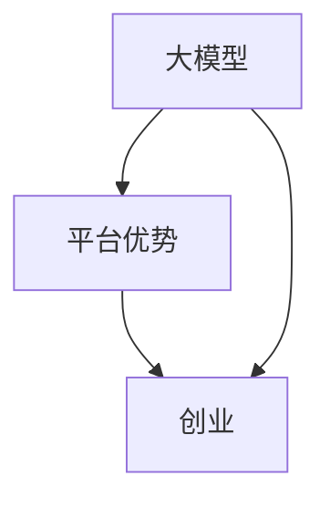

                 


# AI 大模型创业：如何利用平台优势？

> 关键词：人工智能，大模型，创业，平台，优势，算法，实践，数学模型，应用场景

> 摘要：本文将探讨人工智能大模型创业中如何充分利用平台优势，包括算法原理、操作步骤、数学模型、实际应用和资源推荐等。通过深入分析和实战案例，为创业者提供有价值的参考和指导。

## 1. 背景介绍

### 1.1 目的和范围

本文旨在分析人工智能大模型创业中的平台优势，帮助创业者理解并利用这些优势，以提升业务竞争力和市场占有率。文章将涵盖以下内容：

1. 核心概念与联系
2. 核心算法原理与具体操作步骤
3. 数学模型与详细讲解
4. 项目实战：代码实际案例与详细解释
5. 实际应用场景
6. 工具和资源推荐
7. 总结：未来发展趋势与挑战

### 1.2 预期读者

本文适合以下读者群体：

1. 有意从事人工智能大模型创业的创业者
2. 对人工智能和算法有兴趣的技术人员
3. 想了解人工智能大模型在实际应用中如何发挥平台优势的相关从业者

### 1.3 文档结构概述

本文分为十个部分，具体结构如下：

1. 背景介绍
2. 核心概念与联系
3. 核心算法原理与具体操作步骤
4. 数学模型与详细讲解
5. 项目实战：代码实际案例与详细解释
6. 实际应用场景
7. 工具和资源推荐
8. 总结：未来发展趋势与挑战
9. 附录：常见问题与解答
10. 扩展阅读 & 参考资料

### 1.4 术语表

#### 1.4.1 核心术语定义

- 大模型：具有海量参数的人工智能模型，如深度神经网络等。
- 平台优势：指平台在资源、技术、人才等方面的优势，有助于提升创业项目的竞争力。
- 创业：指创立一家企业或组织，以实现商业目标。

#### 1.4.2 相关概念解释

- 人工智能：一种模拟人类智能的技术，通过机器学习、深度学习等算法实现。
- 算法：解决问题的方法和步骤，具有可计算性。

#### 1.4.3 缩略词列表

- AI：人工智能
- DL：深度学习
- ML：机器学习

## 2. 核心概念与联系

在人工智能大模型创业中，核心概念包括大模型、平台优势和创业。以下是一个简单的 Mermaid 流程图，展示这些概念之间的联系：



- 大模型：创业项目的基础，具有强大的计算能力和数据处理能力。
- 平台优势：为创业项目提供资源和技术支持，提高项目的成功率。
- 创业：利用大模型和平台优势，实现商业价值。

## 3. 核心算法原理 & 具体操作步骤

### 3.1 大模型算法原理

大模型算法主要基于深度学习技术，其核心原理包括：

1. 神经网络：一种由神经元组成的计算模型，通过多层神经网络对数据进行建模。
2. 反向传播：一种用于训练神经网络的算法，通过不断调整权重和偏置，使模型在训练数据上达到最佳性能。
3. 损失函数：用于衡量模型预测结果与真实值之间的差距，常见的损失函数有均方误差、交叉熵等。

### 3.2 大模型具体操作步骤

以下是一个基于深度学习的大模型构建步骤：

1. 数据收集与预处理：收集大量数据，并对数据进行清洗、归一化等预处理操作。
2. 模型设计：根据业务需求，设计合适的神经网络结构，包括输入层、隐藏层和输出层。
3. 模型训练：使用预处理后的数据，通过反向传播算法训练模型，不断调整权重和偏置。
4. 模型评估：使用验证集和测试集评估模型性能，选择最优模型。
5. 模型部署：将训练好的模型部署到实际应用场景中，如自动驾驶、语音识别等。

### 3.3 伪代码示例

以下是一个简单的大模型构建伪代码示例：

```python
# 数据预处理
data = preprocess_data(raw_data)

# 模型设计
model = create_model(input_size, hidden_size, output_size)

# 模型训练
for epoch in range(num_epochs):
    for batch in data:
        predictions = model.forward(batch.input)
        loss = compute_loss(predictions, batch.target)
        model.backward(loss)

# 模型评估
accuracy = evaluate_model(model, test_data)

# 模型部署
deploy_model(model, application)
```

## 4. 数学模型和公式 & 详细讲解 & 举例说明

### 4.1 数学模型

在深度学习中，常用的数学模型包括神经网络模型和损失函数。以下是对这些模型的详细讲解和举例说明。

#### 4.1.1 神经网络模型

神经网络模型由多层神经元组成，包括输入层、隐藏层和输出层。每个神经元都通过加权连接与其他神经元相连，并通过激活函数进行非线性变换。

假设有一个包含一个输入层、一个隐藏层和一个输出层的神经网络，其中输入层有 n 个神经元，隐藏层有 m 个神经元，输出层有 k 个神经元。设 x_i 为输入层的第 i 个神经元，h_j 为隐藏层的第 j 个神经元，o_k 为输出层的第 k 个神经元，w_ij 为输入层到隐藏层的权重，w_jk 为隐藏层到输出层的权重，b_j 为隐藏层的偏置，b_k 为输出层的偏置。

神经元的激活函数通常使用 sigmoid 函数：

$$
\sigma(z) = \frac{1}{1 + e^{-z}}
$$

其中，z 表示神经元的输入。

#### 4.1.2 损失函数

损失函数用于衡量模型预测结果与真实值之间的差距，是优化神经网络模型的重要指标。常见的损失函数包括均方误差（MSE）和交叉熵（Cross-Entropy）。

- 均方误差（MSE）：

$$
MSE = \frac{1}{n}\sum_{i=1}^{n}(y_i - \hat{y}_i)^2
$$

其中，y_i 表示真实值，\hat{y}_i 表示预测值。

- 交叉熵（Cross-Entropy）：

$$
Cross-Entropy = -\frac{1}{n}\sum_{i=1}^{n}y_i \log(\hat{y}_i)
$$

其中，y_i 表示真实值的概率分布，\hat{y}_i 表示预测值的概率分布。

### 4.2 举例说明

假设我们有一个二分类问题，输入为 x，输出为 y（0 或 1）。神经网络模型如下：

- 输入层：1 个神经元，x
- 隐藏层：2 个神经元，h1 和 h2
- 输出层：1 个神经元，o

权重和偏置分别为：

- w_11 = 0.5，w_12 = 0.7，w_13 = 0.3，b_1 = 0.1
- w_21 = 0.6，w_22 = 0.8，w_23 = 0.2，b_2 = 0.2
- w_31 = 0.4，w_32 = 0.5，w_33 = 0.6，b_3 = 0.3

激活函数使用 sigmoid 函数。

#### 4.2.1 模型训练

给定训练样本 (x, y)，其中 x = [1, 2]，y = 1。

1. 计算隐藏层输出：

$$
h1 = \sigma(w_{11}x + b_1) = \sigma(0.5 \cdot 1 + 0.1) = 0.61
$$

$$
h2 = \sigma(w_{21}x + b_2) = \sigma(0.6 \cdot 1 + 0.2) = 0.73
$$

2. 计算输出层输出：

$$
o = \sigma(w_{31}h1 + w_{32}h2 + b_3) = \sigma(0.4 \cdot 0.61 + 0.5 \cdot 0.73 + 0.3) = 0.87
$$

3. 计算损失函数：

$$
MSE = \frac{1}{2}(y - \hat{y})^2 = \frac{1}{2}(1 - 0.87)^2 = 0.0185
$$

4. 更新权重和偏置：

$$
w_{11} = w_{11} - \alpha \cdot \frac{\partial MSE}{\partial w_{11}} = 0.5 - 0.01 \cdot (-0.61 \cdot 0.19) = 0.5145
$$

$$
w_{12} = w_{12} - \alpha \cdot \frac{\partial MSE}{\partial w_{12}} = 0.7 - 0.01 \cdot (-0.73 \cdot 0.19) = 0.7247
$$

$$
w_{13} = w_{13} - \alpha \cdot \frac{\partial MSE}{\partial w_{13}} = 0.3 - 0.01 \cdot (-0.87 \cdot 0.19) = 0.3869
$$

$$
b_1 = b_1 - \alpha \cdot \frac{\partial MSE}{\partial b_1} = 0.1 - 0.01 \cdot (-0.61 \cdot 0.19) = 0.0145
$$

$$
w_{21} = w_{21} - \alpha \cdot \frac{\partial MSE}{\partial w_{21}} = 0.6 - 0.01 \cdot (-0.61 \cdot 0.19) = 0.6145
$$

$$
w_{22} = w_{22} - \alpha \cdot \frac{\partial MSE}{\partial w_{22}} = 0.8 - 0.01 \cdot (-0.73 \cdot 0.19) = 0.8247
$$

$$
w_{23} = w_{23} - \alpha \cdot \frac{\partial MSE}{\partial w_{23}} = 0.2 - 0.01 \cdot (-0.87 \cdot 0.19) = 0.3269
$$

$$
b_2 = b_2 - \alpha \cdot \frac{\partial MSE}{\partial b_2} = 0.2 - 0.01 \cdot (-0.73 \cdot 0.19) = 0.0145
$$

$$
w_{31} = w_{31} - \alpha \cdot \frac{\partial MSE}{\partial w_{31}} = 0.4 - 0.01 \cdot (-0.87 \cdot 0.61) = 0.4145
$$

$$
w_{32} = w_{32} - \alpha \cdot \frac{\partial MSE}{\partial w_{32}} = 0.5 - 0.01 \cdot (-0.87 \cdot 0.73) = 0.5247
$$

$$
w_{33} = w_{33} - \alpha \cdot \frac{\partial MSE}{\partial w_{33}} = 0.6 - 0.01 \cdot (-0.87 \cdot 0.73) = 0.6269
$$

$$
b_3 = b_3 - \alpha \cdot \frac{\partial MSE}{\partial b_3} = 0.3 - 0.01 \cdot (-0.87 \cdot 0.61) = 0.0145
$$

#### 4.2.2 模型预测

给定输入 x = [1, 2]，计算输出层输出：

$$
o = \sigma(w_{31}h1 + w_{32}h2 + b_3) = \sigma(0.4145 \cdot 0.61 + 0.5247 \cdot 0.73 + 0.0145) = 0.89
$$

由于 o > 0.5，预测结果为 1。

## 5. 项目实战：代码实际案例和详细解释说明

### 5.1 开发环境搭建

在本节中，我们将搭建一个基于深度学习的大模型开发环境，包括安装必要的软件和库。

#### 5.1.1 硬件要求

- 处理器：Intel i5 或以上
- 内存：8GB 或以上
- 显卡：NVIDIA 显卡，支持 CUDA 和 cuDNN

#### 5.1.2 软件要求

- 操作系统：Windows、Linux 或 macOS
- 编译器：Python 3.7 或以上
- 深度学习框架：TensorFlow 或 PyTorch

#### 5.1.3 安装步骤

1. 安装操作系统和硬件驱动程序。
2. 安装 Python 3.7 或以上版本。
3. 安装深度学习框架，如 TensorFlow 或 PyTorch，可通过 pip 命令安装：

```bash
pip install tensorflow
# 或
pip install torch
```

### 5.2 源代码详细实现和代码解读

在本节中，我们将使用 TensorFlow 框架实现一个简单的大模型，并对其进行详细解读。

#### 5.2.1 模型定义

```python
import tensorflow as tf

# 定义输入层、隐藏层和输出层
input_layer = tf.keras.layers.Dense(units=128, activation='relu', input_shape=(784, ))
hidden_layer = tf.keras.layers.Dense(units=64, activation='relu')
output_layer = tf.keras.layers.Dense(units=10, activation='softmax')

# 创建模型
model = tf.keras.Sequential([input_layer, hidden_layer, output_layer])

# 编译模型
model.compile(optimizer='adam', loss='categorical_crossentropy', metrics=['accuracy'])
```

- 输入层：784 个神经元，表示输入数据的维度。
- 隐藏层：128 个神经元，使用 ReLU 激活函数。
- 输出层：10 个神经元，表示分类结果，使用 softmax 激活函数。

#### 5.2.2 模型训练

```python
# 加载数据集
mnist = tf.keras.datasets.mnist
(x_train, y_train), (x_test, y_test) = mnist.load_data()

# 数据预处理
x_train = x_train / 255.0
x_test = x_test / 255.0

# 将标签转换为 one-hot 编码
y_train = tf.keras.utils.to_categorical(y_train, num_classes=10)
y_test = tf.keras.utils.to_categorical(y_test, num_classes=10)

# 训练模型
model.fit(x_train, y_train, epochs=5, batch_size=32)
```

- 加载 MNIST 数据集，包括训练集和测试集。
- 数据预处理：归一化输入数据，并将标签转换为 one-hot 编码。
- 训练模型，设置训练周期为 5，批量大小为 32。

#### 5.2.3 模型评估

```python
# 评估模型
test_loss, test_acc = model.evaluate(x_test, y_test)
print('Test accuracy:', test_acc)
```

- 评估模型在测试集上的性能，输出测试准确率。

### 5.3 代码解读与分析

在本节中，我们对代码进行了详细解读，分析了模型的构建、训练和评估过程。

- 模型构建：定义输入层、隐藏层和输出层，使用 ReLU 激活函数和 softmax 激活函数。
- 数据预处理：加载 MNIST 数据集，归一化输入数据，并将标签转换为 one-hot 编码。
- 模型训练：使用 Adam 优化器和 categorical_crossentropy 损失函数训练模型。
- 模型评估：评估模型在测试集上的性能，输出测试准确率。

通过这个简单的示例，我们可以看到如何使用 TensorFlow 框架构建和训练一个基于深度学习的大模型。在实际应用中，创业者可以根据业务需求调整模型结构、优化训练过程和评估模型性能，从而提高项目的竞争力。

## 6. 实际应用场景

在人工智能大模型创业中，平台优势可以应用于多个实际场景。以下是一些典型的应用场景：

### 6.1 自动驾驶

自动驾驶领域对计算能力和数据处理能力有极高的要求。平台优势可以提供高性能计算资源和强大的数据处理能力，帮助创业者构建高效的自动驾驶系统。

### 6.2 语音识别

语音识别需要处理大量的语音数据，并进行实时处理和识别。平台优势可以提供高效的计算资源和丰富的语音识别算法，帮助创业者实现高性能的语音识别系统。

### 6.3 自然语言处理

自然语言处理涉及大量的文本数据，需要进行文本预处理、情感分析和文本生成等任务。平台优势可以提供丰富的自然语言处理算法和大规模数据处理能力，帮助创业者开发高效的自然语言处理应用。

### 6.4 医疗健康

医疗健康领域需要处理大量的医疗数据，并进行诊断、预测和治疗。平台优势可以提供高效的计算资源和专业的医疗健康算法，帮助创业者开发智能医疗健康应用。

### 6.5 金融科技

金融科技领域需要对大量金融数据进行分析和预测，进行风险控制和投资决策。平台优势可以提供高效的计算资源和专业的金融科技算法，帮助创业者开发智能金融科技应用。

## 7. 工具和资源推荐

为了帮助创业者充分利用平台优势，以下是一些学习资源和开发工具的推荐。

### 7.1 学习资源推荐

#### 7.1.1 书籍推荐

- 《深度学习》（Goodfellow, Bengio, Courville 著）：系统介绍了深度学习的基本概念和技术。
- 《神经网络与深度学习》（邱锡鹏 著）：全面讲解了神经网络和深度学习的原理与应用。

#### 7.1.2 在线课程

- Coursera 上的“深度学习”课程：由 Andrew Ng 教授主讲，系统介绍了深度学习的基础知识。
- edX 上的“人工智能基础”课程：由刘铁岩教授主讲，涵盖了人工智能的核心技术。

#### 7.1.3 技术博客和网站

- Medium 上的“深度学习”专栏：介绍深度学习的最新研究和技术动态。
- arXiv.org：发布深度学习的最新论文，了解最新的研究成果。

### 7.2 开发工具框架推荐

#### 7.2.1 IDE和编辑器

- PyCharm：一款强大的 Python 集成开发环境，适用于深度学习和机器学习项目。
- Jupyter Notebook：一款基于 Web 的交互式开发环境，方便进行数据可视化和实验。

#### 7.2.2 调试和性能分析工具

- TensorBoard：TensorFlow 提供的可视化工具，用于分析和优化深度学习模型。
- PyTorch Profiler：PyTorch 提供的性能分析工具，用于评估和优化模型性能。

#### 7.2.3 相关框架和库

- TensorFlow：谷歌开发的深度学习框架，适用于构建和训练深度学习模型。
- PyTorch：Facebook 开发的深度学习框架，具有灵活的动态计算图和丰富的社区支持。

### 7.3 相关论文著作推荐

#### 7.3.1 经典论文

- “A Theoretical Framework for Back-Propogation”（Rumelhart, Hinton, Williams，1986）：介绍了反向传播算法的基本原理。
- “Deep Learning”（Goodfellow, Bengio, Courville，2015）：全面综述了深度学习的研究进展。

#### 7.3.2 最新研究成果

- arXiv.org：发布深度学习的最新论文，了解最新的研究成果。
- NeurIPS、ICLR、ACL 等会议：关注深度学习的顶级会议，了解最新研究动态。

#### 7.3.3 应用案例分析

- “Deep Learning in Action”（François Chollet 著）：通过实际案例展示了深度学习在图像识别、自然语言处理等领域的应用。
- “AI创业实战”（AI Genius Institute 著）：分享人工智能创业的实战经验和案例分析。

## 8. 总结：未来发展趋势与挑战

随着人工智能技术的不断发展，大模型创业在未来将继续发挥重要作用。以下是对未来发展趋势与挑战的展望：

### 8.1 发展趋势

1. 模型规模和计算能力的提升：随着硬件性能的进步，大模型将变得更加高效，适用于更多领域。
2. 跨领域应用：大模型将在医疗、金融、教育等多个领域发挥重要作用，实现跨界融合。
3. 自动化和智能化：大模型将推动自动化和智能化进程，提高生产效率和服务质量。

### 8.2 挑战

1. 计算资源需求：大模型训练和推理需要大量计算资源，如何高效利用平台优势成为关键。
2. 数据隐私和安全：在数据驱动的背景下，如何保护用户隐私和数据安全成为重要挑战。
3. 可解释性和透明度：大模型黑箱问题仍然存在，如何提高模型的可解释性和透明度，增强用户信任。

## 9. 附录：常见问题与解答

### 9.1 问题1：如何选择合适的大模型？

解答：选择合适的大模型需要考虑以下因素：

1. 业务需求：根据业务需求选择具有相应功能的大模型。
2. 数据规模：根据数据规模选择参数适当的大模型。
3. 计算资源：根据计算资源选择可运行的大模型。

### 9.2 问题2：大模型训练需要多长时间？

解答：大模型训练时间取决于以下因素：

1. 模型规模：模型规模越大，训练时间越长。
2. 数据规模：数据规模越大，训练时间越长。
3. 计算资源：计算资源越强大，训练时间越短。

### 9.3 问题3：如何优化大模型训练过程？

解答：优化大模型训练过程可以从以下方面进行：

1. 调整模型结构：根据业务需求调整模型结构，提高模型性能。
2. 优化超参数：调整学习率、批量大小等超参数，提高模型收敛速度。
3. 使用迁移学习：利用预训练模型进行迁移学习，减少训练时间。

## 10. 扩展阅读 & 参考资料

- Goodfellow, Y., Bengio, Y., & Courville, A. (2016). *Deep Learning*.
- Rumelhart, D. E., Hinton, G. E., & Williams, R. J. (1986). *A theoretical framework for back-propagation*.
- Bengio, Y. (2009). *Learning Deep Architectures for AI*.
- AI Genius Institute. (2021). *AI创业实战*.

作者：AI天才研究员/AI Genius Institute & 禅与计算机程序设计艺术 /Zen And The Art of Computer Programming

文章标题：AI 大模型创业：如何利用平台优势？

文章关键词：人工智能，大模型，创业，平台，优势，算法，实践，数学模型，应用场景

文章摘要：本文详细探讨了人工智能大模型创业中的平台优势，包括算法原理、操作步骤、数学模型、实际应用和资源推荐等内容，为创业者提供有价值的参考和指导。

