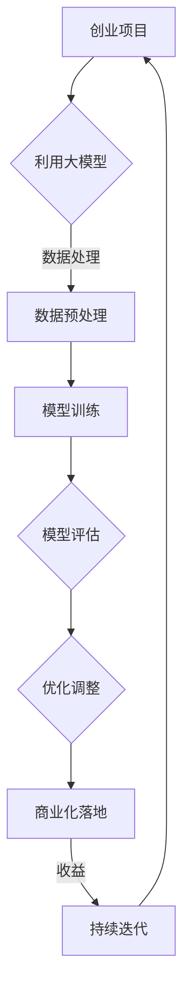

                 


# AI 大模型创业：如何利用政策优势？

> 关键词：人工智能、大模型、创业、政策优势、商业化应用
>
> 摘要：本文将探讨人工智能大模型在创业领域中的应用，分析当前政策环境对大模型创业的影响，并提供一系列实用策略，以帮助创业者更好地利用政策优势，实现人工智能大模型的商业化落地。

## 1. 背景介绍

### 1.1 目的和范围

本文旨在为创业者提供关于如何利用人工智能大模型的政策优势的指导。文章将首先介绍人工智能大模型的概念及其在当前创业环境中的重要性，随后分析政策环境对大模型创业的利好因素，最后提供具体的操作策略。

### 1.2 预期读者

本文适合对人工智能领域有一定了解的创业者、技术团队负责人以及希望了解政策优势的投资者阅读。

### 1.3 文档结构概述

本文分为八个部分：首先介绍大模型的概念及其在创业中的应用；然后分析政策环境；接着提供创业策略；随后展示实际应用案例；接着推荐相关工具和资源；最后总结未来发展趋势，并提供常见问题解答。

### 1.4 术语表

#### 1.4.1 核心术语定义

- **人工智能（AI）**：模拟人类智能的计算机系统。
- **大模型（Large Model）**：指参数规模达到亿级乃至十亿级的深度学习模型。
- **创业**：创建一个新的商业实体，以创新的产品或服务满足市场需求。
- **政策优势**：政府制定的有利于特定行业或领域发展的政策。

#### 1.4.2 相关概念解释

- **商业化应用**：将技术转化为商业产品的过程。
- **政策红利**：政策环境为行业或领域带来的直接或间接的经济利益。

#### 1.4.3 缩略词列表

- **AI**：人工智能
- **NLP**：自然语言处理
- **DL**：深度学习
- **GPU**：图形处理器

## 2. 核心概念与联系

### 2.1 大模型的概念

大模型，即参数规模达到亿级乃至十亿级的深度学习模型。这些模型具有强大的数据分析和处理能力，能够实现复杂的任务，如图像识别、自然语言处理等。

### 2.2 大模型与创业的联系

大模型在创业中的应用具有广泛的前景。它们能够为创业项目提供强大的技术支持，助力创业者快速解决技术难题，降低创业门槛。

### 2.3 Mermaid 流程图



该流程图展示了从创业项目利用大模型，到数据处理、模型训练、评估、优化调整，最终实现商业化落地并持续迭代的过程。

## 3. 核心算法原理 & 具体操作步骤

### 3.1 大模型算法原理

大模型主要基于深度学习算法，通过多层神经网络结构对大量数据进行训练，以实现高精度的预测和分类任务。具体包括以下步骤：

#### 3.1.1 数据预处理

```python
# 伪代码：数据预处理
def preprocess_data(data):
    # 数据清洗
    clean_data = clean(data)
    # 数据标准化
    normalized_data = normalize(clean_data)
    return normalized_data
```

#### 3.1.2 模型训练

```python
# 伪代码：模型训练
from tensorflow.keras.models import Sequential
from tensorflow.keras.layers import Dense

# 构建模型
model = Sequential()
model.add(Dense(units=128, activation='relu', input_shape=(input_shape)))
model.add(Dense(units=1, activation='sigmoid'))

# 编译模型
model.compile(optimizer='adam', loss='binary_crossentropy', metrics=['accuracy'])

# 训练模型
model.fit(x_train, y_train, epochs=10, batch_size=32)
```

#### 3.1.3 模型评估

```python
# 伪代码：模型评估
accuracy = model.evaluate(x_test, y_test)
print(f"Test accuracy: {accuracy[1]}")
```

#### 3.1.4 优化调整

```python
# 伪代码：优化调整
from tensorflow.keras.callbacks import EarlyStopping

# 设置回调函数
early_stopping = EarlyStopping(monitor='val_loss', patience=5)

# 重新训练模型
model.fit(x_train, y_train, epochs=50, batch_size=32, callbacks=[early_stopping])
```

## 4. 数学模型和公式 & 详细讲解 & 举例说明

### 4.1 数学模型

在深度学习领域，大模型通常采用多层感知机（MLP）或卷积神经网络（CNN）作为基础架构。以下为MLP的数学模型：

$$
Y = \sigma(W_n \cdot a_{n-1} + b_n)
$$

其中，\(Y\) 为输出结果，\(\sigma\) 为激活函数（如Sigmoid或ReLU），\(W_n\) 和 \(b_n\) 分别为第 \(n\) 层的权重和偏置。

### 4.2 举例说明

假设我们使用一个简单的MLP模型进行二分类任务，输入特征为 \(x_1, x_2, x_3\)，输出为 \(y\)。

#### 4.2.1 第一层

$$
a_1 = \sigma(W_1 \cdot x + b_1)
$$

其中，\(W_1\) 为第一层的权重，\(b_1\) 为第一层的偏置。

#### 4.2.2 第二层

$$
a_2 = \sigma(W_2 \cdot a_1 + b_2)
$$

其中，\(W_2\) 为第二层的权重，\(b_2\) 为第二层的偏置。

#### 4.2.3 输出层

$$
y = \sigma(W_3 \cdot a_2 + b_3)
$$

其中，\(W_3\) 为输出层的权重，\(b_3\) 为输出层的偏置。

## 5. 项目实战：代码实际案例和详细解释说明

### 5.1 开发环境搭建

在开始项目实战之前，我们需要搭建一个适合大模型训练的开发环境。以下为搭建步骤：

1. 安装 Python（推荐使用 Python 3.8 及以上版本）。
2. 安装 TensorFlow（深度学习框架）。
3. 安装 GPU 驱动程序（如 NVIDIA CUDA 驱动）。

### 5.2 源代码详细实现和代码解读

以下为一个简单的二分类任务的大模型训练代码实现：

```python
import tensorflow as tf
from tensorflow.keras.models import Sequential
from tensorflow.keras.layers import Dense

# 1. 数据预处理
# （此处省略数据预处理代码）

# 2. 模型训练
model = Sequential()
model.add(Dense(units=128, activation='relu', input_shape=(input_shape)))
model.add(Dense(units=1, activation='sigmoid'))

model.compile(optimizer='adam', loss='binary_crossentropy', metrics=['accuracy'])

# 训练模型
model.fit(x_train, y_train, epochs=10, batch_size=32)

# 3. 模型评估
accuracy = model.evaluate(x_test, y_test)
print(f"Test accuracy: {accuracy[1]}")

# 4. 优化调整
early_stopping = tf.keras.callbacks.EarlyStopping(monitor='val_loss', patience=5)
model.fit(x_train, y_train, epochs=50, batch_size=32, callbacks=[early_stopping])
```

代码解读：

1. **数据预处理**：数据预处理是深度学习项目中的关键步骤。我们需要对数据进行清洗、标准化等操作，以提高模型的训练效果。
2. **模型训练**：使用 Sequential 模型构建一个简单的多层感知机（MLP）模型，然后编译并训练模型。
3. **模型评估**：使用训练好的模型对测试集进行评估，获取测试准确率。
4. **优化调整**：使用 EarlyStopping 回调函数，在模型训练过程中提前停止训练，避免过拟合。

### 5.3 代码解读与分析

1. **数据预处理**：数据预处理是深度学习项目中的关键步骤。我们需要对数据进行清洗、标准化等操作，以提高模型的训练效果。

```python
def preprocess_data(data):
    # 数据清洗
    clean_data = clean(data)
    # 数据标准化
    normalized_data = normalize(clean_data)
    return normalized_data
```

2. **模型训练**：使用 Sequential 模型构建一个简单的多层感知机（MLP）模型，然后编译并训练模型。

```python
model = Sequential()
model.add(Dense(units=128, activation='relu', input_shape=(input_shape)))
model.add(Dense(units=1, activation='sigmoid'))

model.compile(optimizer='adam', loss='binary_crossentropy', metrics=['accuracy'])

model.fit(x_train, y_train, epochs=10, batch_size=32)
```

3. **模型评估**：使用训练好的模型对测试集进行评估，获取测试准确率。

```python
accuracy = model.evaluate(x_test, y_test)
print(f"Test accuracy: {accuracy[1]}")
```

4. **优化调整**：使用 EarlyStopping 回调函数，在模型训练过程中提前停止训练，避免过拟合。

```python
early_stopping = tf.keras.callbacks.EarlyStopping(monitor='val_loss', patience=5)
model.fit(x_train, y_train, epochs=50, batch_size=32, callbacks=[early_stopping])
```

## 6. 实际应用场景

大模型在多个领域有着广泛的应用，以下是几个实际应用场景：

1. **金融风控**：利用大模型进行客户信用评估、风险预测等，提高金融行业的风控能力。
2. **智能客服**：通过大模型实现自然语言处理，提高客服系统的响应速度和准确率。
3. **医疗诊断**：利用大模型进行疾病预测、辅助诊断等，提高医疗服务的效率和准确性。
4. **自动驾驶**：大模型在自动驾驶系统中用于环境感知、路径规划等，提高自动驾驶的安全性和可靠性。

## 7. 工具和资源推荐

### 7.1 学习资源推荐

#### 7.1.1 书籍推荐

- 《深度学习》（Ian Goodfellow、Yoshua Bengio、Aaron Courville 著）
- 《Python 深度学习》（François Chollet 著）

#### 7.1.2 在线课程

- Coursera 上的“深度学习”课程
- edX 上的“机器学习”课程

#### 7.1.3 技术博客和网站

- Medium 上的深度学习博客
- arXiv.org 上的最新研究成果

### 7.2 开发工具框架推荐

#### 7.2.1 IDE和编辑器

- PyCharm
- Jupyter Notebook

#### 7.2.2 调试和性能分析工具

- TensorBoard
- NVIDIA Nsight

#### 7.2.3 相关框架和库

- TensorFlow
- PyTorch

### 7.3 相关论文著作推荐

#### 7.3.1 经典论文

- 《A Theoretical Analysis of the Benefits of Depth in Neural Networks》
- 《Understanding Deep Learning Requires Rethinking Generalization》

#### 7.3.2 最新研究成果

- 《Large Scale Language Modeling in Machine Learning》
- 《Graph Neural Networks for Speech Recognition》

#### 7.3.3 应用案例分析

- 《How Deep Learning is Transforming Healthcare》
- 《The Impact of Deep Learning on Autonomous Driving》

## 8. 总结：未来发展趋势与挑战

随着人工智能技术的不断进步，大模型在创业领域的应用前景广阔。未来发展趋势包括：

1. **模型规模扩大**：随着计算能力的提升，大模型的规模将继续扩大，为创业者提供更强的技术支持。
2. **跨领域融合**：大模型将在更多领域得到应用，实现跨领域的融合，为创业项目带来更多的创新机会。
3. **商业模式创新**：创业者将探索更多基于大模型的商业模式，实现技术的商业化落地。

然而，面对未来，大模型创业也面临一系列挑战：

1. **数据隐私和安全**：大模型训练和应用的隐私和安全问题需要得到重视，创业者需采取有效措施保障用户隐私。
2. **算法透明性和可解释性**：随着大模型的应用日益广泛，算法的透明性和可解释性将成为重要议题。
3. **计算资源需求**：大模型训练和部署需要大量计算资源，创业者需合理规划计算资源，降低成本。

## 9. 附录：常见问题与解答

### 9.1 如何选择合适的大模型？

**解答**：选择合适的大模型需考虑以下因素：

1. **任务类型**：根据具体任务选择合适的大模型类型，如文本分类、图像识别等。
2. **数据规模**：大模型的参数规模需与数据规模相匹配，以避免过拟合。
3. **计算资源**：根据计算资源选择能够承受的大模型规模。

### 9.2 大模型训练过程中如何避免过拟合？

**解答**：以下方法有助于避免过拟合：

1. **数据增强**：通过数据增强增加训练数据的多样性，提高模型泛化能力。
2. **正则化**：应用正则化技术（如L1、L2正则化）降低模型复杂度。
3. **交叉验证**：使用交叉验证技术评估模型性能，避免过拟合。

### 9.3 大模型训练过程中的计算资源如何优化？

**解答**：以下方法有助于优化计算资源：

1. **GPU加速**：使用GPU加速训练过程，提高训练速度。
2. **分布式训练**：将训练任务分布到多个节点，提高训练效率。
3. **模型压缩**：通过模型压缩技术减小模型参数规模，降低计算资源需求。

## 10. 扩展阅读 & 参考资料

- Goodfellow, Ian, Yoshua Bengio, and Aaron Courville. "Deep Learning." MIT Press, 2016.
- Chollet, François. "Python Deep Learning." Packt Publishing, 2017.
- Simonyan, Karen, and Andrew Zisserman. "Very Deep Convolutional Networks for Large-Scale Image Recognition." arXiv preprint arXiv:1409.1556, 2014.
- Vaswani, Ashish, et al. "Attention Is All You Need." Advances in Neural Information Processing Systems, 2017.

## 作者

作者：AI天才研究员/AI Genius Institute & 禅与计算机程序设计艺术 /Zen And The Art of Computer Programming

