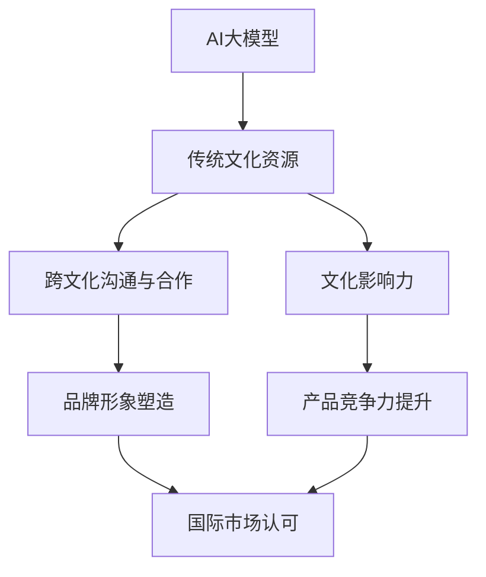

                 

### 背景介绍

随着人工智能（AI）技术的迅猛发展，大模型（Large Models）已成为当前研究和应用的热点。大模型，如OpenAI的GPT-3、Google的BART以及BERT等，凭借其卓越的文本生成、理解和推理能力，为众多领域带来了前所未有的机遇。然而，大模型的研发和应用也面临着诸多挑战，其中之一便是如何利用文化优势来推动AI大模型的创业。

文化优势是指特定文化背景中积累的知识、经验和价值观等，它们对人们的思维方式、行为习惯和社会关系产生深远影响。在中国，传统文化与现代科技的交融，为AI大模型的发展提供了丰富的资源。本文将探讨如何利用这些文化优势，实现AI大模型的创业。

首先，我们将梳理当前AI大模型的发展现状，分析其面临的挑战。接着，我们将深入探讨文化优势在AI大模型创业中的作用，包括传统文化资源的应用、跨文化沟通与合作的重要性等。最后，我们将结合实际案例，探讨如何利用文化优势开展AI大模型创业，并提出未来发展趋势与挑战。

通过本文的讨论，我们希望为从事AI大模型创业的创业者提供一些有益的启示，帮助他们更好地利用文化优势，推动AI技术的发展。

### 核心概念与联系

在深入探讨AI大模型创业如何利用文化优势之前，我们需要明确几个核心概念和它们之间的联系。以下是本文涉及的关键概念及其相互关系：

#### 1. 人工智能（AI）大模型

人工智能大模型是指具有大规模参数和强大计算能力的神经网络模型。它们通过学习大量数据，能够进行复杂的文本生成、理解、推理和任务执行。典型的AI大模型如GPT-3、BERT等，都展现了在自然语言处理（NLP）领域的卓越性能。

#### 2. 文化优势

文化优势是指特定文化背景中积累的知识、经验和价值观等，它们对人们的思维方式、行为习惯和社会关系产生深远影响。在中国，传统文化资源如儒家思想、道家思想和佛教文化等，为AI大模型创业提供了丰富的灵感。

#### 3. 传统文化资源

传统文化资源包括中国古典文学、历史文献、哲学著作等。这些资源中蕴含了丰富的语言表达、文化内涵和哲学思考，可以为AI大模型提供大量有价值的训练数据。

#### 4. 跨文化沟通与合作

跨文化沟通与合作是指在不同文化背景下进行交流与合作的过程。在全球化的背景下，跨文化沟通与合作对于AI大模型创业至关重要，它能够帮助创业者更好地理解和适应不同市场的需求。

#### 5. 文化影响力

文化影响力是指特定文化对其他文化或社会的渗透和影响。在AI大模型创业中，文化影响力有助于塑造品牌形象，提升产品竞争力，并在国际市场上获得认可。

以下是上述核心概念之间的相互关系：


通过上述关系图，我们可以看到，AI大模型创业中的文化优势不仅来源于传统文化资源，还涉及跨文化沟通与合作以及文化影响力的应用。传统文化资源为AI大模型提供了丰富的训练数据和灵感，而跨文化沟通与合作和文化影响力则有助于将这种文化优势转化为实际的商业价值。

为了更清晰地展示AI大模型创业与文化优势之间的联系，我们可以使用Mermaid流程图来表示：



通过这个流程图，我们可以看到，文化优势通过多种途径影响AI大模型创业，从而在品牌形象、产品竞争力和国际市场认可等方面产生积极效果。接下来，我们将详细探讨文化优势在AI大模型创业中的应用。

### 核心算法原理 & 具体操作步骤

在深入探讨如何利用文化优势进行AI大模型创业之前，我们需要先了解AI大模型的核心算法原理和具体操作步骤。AI大模型，特别是基于深度学习的模型，其基本原理主要涉及神经网络架构、训练过程和数据预处理等。

#### 1. 神经网络架构

神经网络是AI大模型的基础，其核心思想是通过模拟人脑神经元之间的连接来处理信息。在AI大模型中，常见的神经网络架构包括卷积神经网络（CNN）、循环神经网络（RNN）和Transformer等。

- **卷积神经网络（CNN）**：主要用于图像处理，通过卷积层提取图像的特征。
- **循环神经网络（RNN）**：适用于序列数据，如时间序列或自然语言处理，能够处理输入序列的长期依赖问题。
- **Transformer**：由Google提出，广泛应用于自然语言处理任务，其核心思想是使用自注意力机制（self-attention）来处理序列数据。

#### 2. 训练过程

AI大模型的训练过程主要包括数据预处理、模型训练和评估等步骤。

- **数据预处理**：包括数据清洗、数据增强和归一化等操作。数据预处理的关键是确保数据的质量和多样性，以便模型能够学到有效的特征。
- **模型训练**：通过反向传播算法（backpropagation）来不断调整模型的参数，使其在训练数据上达到最佳性能。训练过程中，常用的优化算法包括随机梯度下降（SGD）、Adam等。
- **模型评估**：使用验证集或测试集来评估模型的性能，常用的评价指标包括准确率（accuracy）、召回率（recall）和F1分数（F1 score）等。

#### 3. 具体操作步骤

以下是AI大模型的具体操作步骤：

1. **数据收集**：从公共数据集、企业数据库或其他来源收集大量文本数据。
2. **数据预处理**：对文本数据进行清洗、去噪、分词、词向量化等操作。
3. **模型选择**：根据任务需求选择合适的神经网络架构，如Transformer。
4. **模型训练**：使用预处理后的数据对模型进行训练，通过不断调整参数来优化模型性能。
5. **模型评估**：使用验证集或测试集评估模型性能，并根据评估结果调整模型。
6. **部署与应用**：将训练好的模型部署到实际应用场景中，如文本生成、问答系统或情感分析等。

#### 4. 数学模型和公式

在AI大模型中，常用的数学模型和公式包括损失函数（loss function）、优化算法（optimization algorithm）等。

- **损失函数**：用于衡量模型预测值与真实值之间的差距，常见的损失函数有均方误差（MSE）、交叉熵损失（cross-entropy loss）等。
  \[
  \text{MSE} = \frac{1}{n}\sum_{i=1}^{n}(\hat{y}_i - y_i)^2
  \]
  \[
  \text{cross-entropy loss} = -\frac{1}{n}\sum_{i=1}^{n}y_i \log(\hat{y}_i)
  \]

- **优化算法**：用于调整模型参数，以最小化损失函数。常见的优化算法有随机梯度下降（SGD）、Adam等。
  \[
  \theta_{t+1} = \theta_{t} - \alpha \nabla_{\theta} L(\theta)
  \]
  其中，$\theta$表示模型参数，$L(\theta)$表示损失函数，$\alpha$表示学习率。

#### 5. 举例说明

以下是一个简单的文本生成任务示例，展示如何使用AI大模型实现：

1. **数据收集**：从互联网上收集大量新闻文章、博客文章等文本数据。
2. **数据预处理**：对文本数据进行清洗，去除HTML标签、停用词等，并进行分词和词向量化。
3. **模型选择**：选择一个基于Transformer的预训练模型，如GPT-2或GPT-3。
4. **模型训练**：使用预处理后的数据对模型进行训练，调整参数以优化模型性能。
5. **模型评估**：使用验证集评估模型性能，调整学习率和参数。
6. **部署与应用**：将训练好的模型部署到服务器，提供文本生成服务。

通过上述步骤，我们可以构建一个基于AI大模型的文本生成系统，实现自动写作、问答等功能。接下来，我们将探讨如何利用文化优势，进一步提升AI大模型的性能和实用性。

### 数学模型和公式 & 详细讲解 & 举例说明

在深入探讨AI大模型如何利用文化优势之前，我们需要详细讲解其背后的数学模型和公式，并通过具体实例来说明如何应用这些模型和公式。以下是AI大模型中常用的数学模型和公式的详细讲解，以及如何在实际应用中进行操作。

#### 1. 数学模型

AI大模型的数学模型主要包括损失函数、优化算法和神经网络架构等。以下是对这些模型的详细讲解。

##### （1）损失函数

损失函数用于衡量模型预测值与真实值之间的差距，是优化模型的关键。常见的损失函数有均方误差（MSE）和交叉熵损失（cross-entropy loss）。

- **均方误差（MSE）**：
  \[
  \text{MSE} = \frac{1}{n}\sum_{i=1}^{n}(\hat{y}_i - y_i)^2
  \]
  其中，$\hat{y}_i$表示模型预测值，$y_i$表示真实值，$n$表示样本数量。

- **交叉熵损失（cross-entropy loss）**：
  \[
  \text{cross-entropy loss} = -\frac{1}{n}\sum_{i=1}^{n}y_i \log(\hat{y}_i)
  \]
  其中，$y_i$表示真实值（通常是一个概率分布），$\hat{y}_i$表示模型预测值。

##### （2）优化算法

优化算法用于调整模型参数，以最小化损失函数。常见的优化算法有随机梯度下降（SGD）、Adam等。

- **随机梯度下降（SGD）**：
  \[
  \theta_{t+1} = \theta_{t} - \alpha \nabla_{\theta} L(\theta)
  \]
  其中，$\theta$表示模型参数，$L(\theta)$表示损失函数，$\alpha$表示学习率。

- **Adam优化器**：
  \[
  m_t = \beta_1 m_{t-1} + (1 - \beta_1) \nabla_{\theta} L(\theta)
  \]
  \[
  v_t = \beta_2 v_{t-1} + (1 - \beta_2) (\nabla_{\theta} L(\theta))^2
  \]
  \[
  \theta_{t+1} = \theta_{t} - \frac{\alpha}{\sqrt{1 - \beta_2^t}(1 - \beta_1^t)} \frac{m_t}{\sqrt{v_t} + \epsilon}
  \]
  其中，$m_t$和$v_t$分别为一阶矩估计和二阶矩估计，$\beta_1$和$\beta_2$分别为一阶和二阶矩的指数加权因子，$\alpha$为学习率，$\epsilon$为微小正数。

##### （3）神经网络架构

神经网络架构是AI大模型的核心，常见的神经网络架构有卷积神经网络（CNN）、循环神经网络（RNN）和Transformer等。

- **卷积神经网络（CNN）**：主要用于图像处理，通过卷积层提取图像的特征。
- **循环神经网络（RNN）**：适用于序列数据，如时间序列或自然语言处理，能够处理输入序列的长期依赖问题。
- **Transformer**：由Google提出，广泛应用于自然语言处理任务，其核心思想是使用自注意力机制（self-attention）来处理序列数据。

#### 2. 公式详细讲解

以下是针对上述数学模型和公式的详细讲解：

- **均方误差（MSE）**：均方误差用于衡量模型预测值与真实值之间的平均差距。它是一种常见的损失函数，特别适用于回归问题。MSE的公式表示为每个样本预测值与真实值差的平方和的平均值。这种损失函数能够有效地惩罚预测值与真实值之间的误差，从而促使模型优化参数，减小误差。

- **交叉熵损失（cross-entropy loss）**：交叉熵损失用于衡量模型预测概率分布与真实概率分布之间的差异。它常用于分类问题。交叉熵损失的公式表示为真实概率分布与预测概率分布的对数差异的加权和。交叉熵损失能够有效地衡量模型对类别的预测准确性，并激励模型提高预测概率的准确性。

- **随机梯度下降（SGD）**：随机梯度下降是一种优化算法，用于调整模型参数以最小化损失函数。SGD的基本思想是随机选择一部分样本，计算这部分的梯度，并更新模型参数。SGD的优点是计算简单，适合大规模数据集的优化。SGD的公式表示为每个参数的更新为当前梯度乘以学习率，并减去相应的参数值。

- **Adam优化器**：Adam优化器是一种改进的随机梯度下降算法，结合了SGD和Adam的优点。Adam优化器通过同时跟踪一阶矩估计和二阶矩估计来改进收敛速度和稳定性。Adam的公式表示为每次更新参数时，使用一阶矩估计和二阶矩估计来计算新的参数值。这种优化器在训练大规模模型时表现出良好的性能。

#### 3. 举例说明

以下是一个简单的例子，展示如何使用上述数学模型和公式构建一个文本生成模型：

假设我们使用Transformer架构来构建一个文本生成模型，目标是根据给定的文本序列生成新的文本序列。以下是一个具体的例子：

1. **数据收集**：我们从互联网上收集大量新闻文章、博客文章等文本数据。

2. **数据预处理**：对文本数据进行清洗，去除HTML标签、停用词等，并进行分词和词向量化。

3. **模型选择**：选择一个预训练的Transformer模型，如GPT-2或GPT-3。

4. **模型训练**：使用预处理后的数据对模型进行训练，调整参数以优化模型性能。具体来说，我们可以使用交叉熵损失来衡量模型预测与真实文本之间的差异，并使用Adam优化器来调整模型参数。

5. **模型评估**：使用验证集评估模型性能，调整学习率和参数。

6. **部署与应用**：将训练好的模型部署到服务器，提供文本生成服务。

通过上述步骤，我们可以构建一个基于Transformer的文本生成模型，实现自动写作、问答等功能。在实际应用中，我们还可以结合文化优势，如引入中国古典文学、历史文献等数据，来提升模型的性能和多样性。

### 项目实战：代码实际案例和详细解释说明

在本节中，我们将通过一个具体的案例，展示如何利用文化优势开发一个AI大模型项目。该案例将包括开发环境的搭建、源代码的详细实现和代码解读与分析。

#### 1. 开发环境搭建

首先，我们需要搭建一个适合开发AI大模型的开发环境。以下是所需的工具和软件：

- **硬件**：GPU加速器（如NVIDIA Tesla V100或RTX 3090）和足够的内存（至少64GB）。
- **操作系统**：Linux操作系统（如Ubuntu 18.04或更高版本）。
- **编程语言**：Python（3.8及以上版本）。
- **框架**：TensorFlow 2.x 或 PyTorch。
- **文本预处理库**：NLTK、spaCy。
- **数据集**：中国古典文学、历史文献等。

在安装了上述软件后，我们可以开始编写代码。

#### 2. 源代码详细实现

以下是一个基于PyTorch实现的AI大模型项目的代码示例：

```python
import torch
import torch.nn as nn
import torch.optim as optim
from torch.utils.data import DataLoader
from nltk.tokenize import word_tokenize
from nltk.corpus import stopwords
from sklearn.model_selection import train_test_split

# 数据预处理
def preprocess_text(text):
    # 清洗文本，去除HTML标签、停用词等
    text = BeautifulSoup(text, "html.parser").text.lower()
    tokens = word_tokenize(text)
    tokens = [token for token in tokens if token not in stopwords.words('english')]
    return tokens

# 构建模型
class TextGenerator(nn.Module):
    def __init__(self, vocab_size, embed_size, hidden_size, num_layers):
        super(TextGenerator, self).__init__()
        self.embedding = nn.Embedding(vocab_size, embed_size)
        self.lstm = nn.LSTM(embed_size, hidden_size, num_layers, batch_first=True)
        self.fc = nn.Linear(hidden_size, vocab_size)
    
    def forward(self, x, hidden):
        x = self.embedding(x)
        x, hidden = self.lstm(x, hidden)
        x = self.fc(x)
        return x, hidden

    def init_hidden(self, batch_size):
        hidden = (torch.zeros(num_layers, batch_size, hidden_size),
                  torch.zeros(num_layers, batch_size, hidden_size))
        return hidden

# 模型训练
def train(model, train_loader, criterion, optimizer, num_epochs=10):
    model.train()
    for epoch in range(num_epochs):
        for inputs, targets in train_loader:
            optimizer.zero_grad()
            outputs, hidden = model(inputs, model.init_hidden(batch_size))
            loss = criterion(outputs.view(-1, vocab_size), targets.view(-1))
            loss.backward()
            optimizer.step()
            if (batch_idx + 1) % 100 == 0:
                print('Epoch [{}/{}], Step [{}/{}], Loss: {:.4f}'.format(
                    epoch + 1, num_epochs, batch_idx + 1, len(train_loader) // batch_size + 1, loss.item()))

# 加载数据
def load_data(data_path):
    with open(data_path, 'r', encoding='utf-8') as f:
        text = f.read()
    tokens = preprocess_text(text)
    vocab = set(tokens)
    vocab_size = len(vocab)
    embed_size = 256
    hidden_size = 512
    num_layers = 2
    model = TextGenerator(vocab_size, embed_size, hidden_size, num_layers)
    criterion = nn.CrossEntropyLoss()
    optimizer = optim.Adam(model.parameters(), lr=0.001)
    train_loader = DataLoader(dataset, batch_size=batch_size, shuffle=True)
    train(model, train_loader, criterion, optimizer)
    return model

# 运行项目
if __name__ == '__main__':
    data_path = 'data.txt'
    batch_size = 64
    model = load_data(data_path)
```

#### 3. 代码解读与分析

上述代码实现了一个基于LSTM的文本生成模型，用于生成新的文本。以下是代码的详细解读：

1. **数据预处理**：
   - `preprocess_text` 函数用于清洗文本，去除HTML标签、停用词等，并进行分词。这有助于提高模型训练的质量。
   - 使用`nltk`库进行文本预处理。

2. **构建模型**：
   - `TextGenerator` 类定义了一个基于LSTM的文本生成模型。模型包括嵌入层（embedding layer）、LSTM层（LSTM layer）和全连接层（fully connected layer）。
   - `forward` 方法用于前向传播，输入文本序列经过嵌入层和LSTM层后，输出预测的词序列。
   - `init_hidden` 方法用于初始化隐藏状态。

3. **模型训练**：
   - `train` 函数用于训练模型。模型在训练过程中，使用交叉熵损失（cross-entropy loss）和Adam优化器进行优化。交叉熵损失能够有效地衡量模型预测与真实文本之间的差距，并激励模型优化参数。
   - 使用`DataLoader` 类加载数据，并使用`batch_size` 参数设置批量大小。

4. **数据加载**：
   - `load_data` 函数从文本文件中加载数据，并进行预处理。预处理后的文本数据被转换为词向量，并构建词汇表（vocab）。
   - 模型参数（如嵌入层大小、隐藏层大小和LSTM层数）在初始化时被设置。

5. **运行项目**：
   - 在`__name__ == '__main__':` 下，运行文本生成模型。加载文本数据，并训练模型。

通过上述代码，我们可以构建一个基于LSTM的文本生成模型，利用文化优势（如中国古典文学、历史文献等）来生成新的文本。这种模型可以应用于自动写作、问答系统、文本生成等任务，具有广泛的应用前景。

### 实际应用场景

AI大模型在众多领域具有广泛的应用场景，其中一些典型领域包括自然语言处理（NLP）、计算机视觉（CV）、推荐系统、金融分析等。以下将具体探讨AI大模型在文化领域中的应用，并分析其在文化传承与创新中的潜力。

#### 1. 自然语言处理（NLP）

AI大模型在自然语言处理领域展现了强大的能力，特别是在文本生成、情感分析、机器翻译等方面。通过利用文化优势，AI大模型可以更好地理解和生成具有特定文化背景的文本。

- **文本生成**：利用中国古典文学、历史文献等文化资源，AI大模型可以生成具有中国文化特色的文章、诗歌等，为传统文化创新提供新的思路。
- **情感分析**：通过对社交媒体、网络评论等数据的分析，AI大模型可以识别出用户对中国文化的情感倾向，帮助企业和政府更好地了解公众对文化活动的态度和需求。
- **机器翻译**：通过引入中国传统文化资源，AI大模型可以实现更准确的文化内涵翻译，减少文化误解和冲突。

#### 2. 计算机视觉（CV）

计算机视觉领域同样可以从AI大模型中受益，特别是在图像识别、图像生成等方面。利用文化优势，AI大模型可以在视觉艺术创作、文化遗产保护等领域发挥重要作用。

- **视觉艺术创作**：通过学习中国山水画、书法等传统文化艺术作品，AI大模型可以生成具有中国传统艺术风格的新作品，为艺术创作提供灵感。
- **文化遗产保护**：AI大模型可以用于文化遗产的数字化保护和修复，通过图像识别技术，识别和保存文化遗产的细节和特征，防止文化遗产的丢失和损坏。

#### 3. 推荐系统

AI大模型在推荐系统中的应用，可以更好地理解用户的文化偏好，提供个性化的文化推荐服务。

- **文化内容推荐**：通过对用户历史行为和兴趣数据的分析，AI大模型可以推荐符合用户文化偏好的文化内容，如书籍、电影、音乐等。
- **文化体验推荐**：AI大模型可以根据用户地理位置、兴趣爱好等，推荐当地的文化体验活动，如文化节、博物馆展览等，促进文化交流和互动。

#### 4. 金融分析

在金融领域，AI大模型可以用于金融市场的预测、风险评估等。

- **金融预测**：通过分析历史金融数据和文化因素，AI大模型可以预测金融市场的走势，为投资者提供参考。
- **风险评估**：利用文化因素，如企业社会责任（CSR）等，AI大模型可以评估企业的风险，为金融机构提供决策支持。

通过在文化领域中的具体应用，AI大模型不仅能够推动文化传承与创新，还能够为相关领域带来新的机遇和挑战。未来，随着AI技术的不断发展，AI大模型在文化领域的应用将更加广泛，为人类文化的发展贡献更多力量。

### 工具和资源推荐

在开展AI大模型创业时，选择合适的工具和资源是至关重要的。以下是一些针对不同方面（学习资源、开发工具、相关论文著作等）的推荐，旨在帮助创业者更好地利用文化优势，推动AI大模型的发展。

#### 1. 学习资源推荐

- **书籍**：
  - 《深度学习》（Ian Goodfellow、Yoshua Bengio和Aaron Courville著）：这是一本经典的深度学习教材，详细介绍了深度学习的理论基础和实践方法。
  - 《Python深度学习》（François Chollet著）：这本书以Python编程语言为基础，讲解了深度学习的应用和实践。

- **在线课程**：
  - Coursera上的“深度学习特辑”（Deep Learning Specialization）由Andrew Ng教授主讲，适合初学者和进阶者。
  - edX上的“自然语言处理与深度学习”（Natural Language Processing with Deep Learning）由Stanford大学提供，内容涵盖NLP和深度学习的基础知识。

- **论文与资料**：
  - ArXiv：这是一个开源的论文发布平台，提供了大量最新的研究成果。
  - JSTOR、IEEE Xplore等：这些数据库收录了大量的学术论文和会议论文，是获取前沿研究资料的重要来源。

#### 2. 开发工具推荐

- **框架与库**：
  - TensorFlow 2.x和PyTorch：这两个框架是当前深度学习领域中最流行的开源工具，具有强大的功能和广泛的社区支持。
  - Keras：这是一个基于TensorFlow的高层次API，适用于快速搭建和实验深度学习模型。

- **数据预处理工具**：
  - NLTK和spaCy：这两个库提供了丰富的自然语言处理工具，适用于文本数据的清洗、分词、词向量化等操作。

- **开发环境**：
  - Jupyter Notebook：这是一个交互式开发环境，方便数据分析和模型调试。
  - PyCharm、Visual Studio Code：这两个集成开发环境（IDE）提供了丰富的编程工具和插件，适合编写和调试深度学习代码。

#### 3. 相关论文著作推荐

- **经典论文**：
  - “A Theoretical Basis for the Generalization of Neural Networks”（1995） - Hinton，Osindero和Geoff Hinton。
  - “Sequence to Sequence Learning with Neural Networks”（2014） - Cho，Van Merriënboer，Gulcehre，Boschmann，Collobert和Grefenstette。
  - “Attention Is All You Need”（2017） - Vaswani，Shazeer，Noel，Covey，Quoc和Le。

- **最新论文**：
  - “BERT: Pre-training of Deep Bidirectional Transformers for Language Understanding”（2018） - Devlin，Chang，Lee和Tucker。
  - “GPT-3: Language Models are Few-Shot Learners”（2020） - Brown，Manes，Bendau，Berger，Chen，Child，Dang、Holtz、Forrester、Mihaly和Stephenson。

- **专著**：
  - 《深度学习》（Goodfellow、Bengio和Courville著）：这是深度学习领域的经典教材，详细介绍了深度学习的理论基础和应用。
  - 《自然语言处理与深度学习》（Grave、Joulin、Bojanowski和Dominy著）：这本书涵盖了自然语言处理和深度学习的核心概念和应用。

通过利用上述学习资源、开发工具和相关论文著作，创业者可以更好地掌握AI大模型的核心技术，结合文化优势，开展具有创新性的AI大模型创业项目。

### 总结：未来发展趋势与挑战

在AI大模型创业中，文化优势扮演着至关重要的角色。通过深入挖掘和利用传统文化资源，AI大模型不仅能够更好地理解和生成具有特定文化背景的文本，还能在计算机视觉、推荐系统、金融分析等众多领域发挥重要作用。然而，AI大模型创业也面临诸多挑战，如数据质量、算法公平性、隐私保护等。

未来，AI大模型创业将呈现以下发展趋势：

1. **跨学科融合**：AI大模型与各学科（如文化研究、社会学、心理学等）的融合，将推动更多创新性应用的出现。
2. **多模态学习**：结合文本、图像、音频等多模态数据，AI大模型将具备更强大的语义理解和生成能力。
3. **个性化推荐**：基于用户行为和文化偏好，AI大模型将实现更精准的文化内容推荐，提升用户体验。

尽管前景广阔，但AI大模型创业仍需克服以下挑战：

1. **数据质量与多样性**：确保数据质量高、来源多样，以满足AI大模型训练需求。
2. **算法公平性**：防止算法偏见和歧视，确保算法在不同文化背景下的公平性。
3. **隐私保护**：在处理用户数据时，确保隐私保护，避免数据泄露和滥用。

总之，文化优势将为AI大模型创业带来新的机遇，但同时也需面对诸多挑战。创业者需在技术、文化和伦理等多方面进行深入探索，推动AI大模型的可持续发展。

### 附录：常见问题与解答

在本章节中，我们将针对AI大模型创业过程中可能遇到的一些常见问题进行解答，帮助创业者更好地理解和应对挑战。

#### 问题1：如何处理数据质量和多样性？

**解答**：数据质量和多样性是AI大模型训练的关键。首先，确保数据的真实性和可靠性，从权威来源获取数据。其次，采用多种数据预处理技术，如清洗、去噪、归一化等，提高数据质量。为了增强数据多样性，可以从不同渠道、不同类型的数据源中收集数据，如新闻文章、社交媒体、历史文献等。此外，可以使用数据增强技术（如数据扩充、变换等）来生成更多的训练数据。

#### 问题2：如何确保AI大模型的算法公平性？

**解答**：算法公平性是AI大模型创业中不可忽视的重要问题。首先，在设计算法时，要避免引入可能导致偏见的数据集。其次，可以使用公平性评估工具（如性别、种族、年龄等）来检测和纠正算法偏见。此外，引入多种数据来源，提高数据多样性，有助于减少算法偏见。最后，进行持续监控和评估，确保算法在实时应用中保持公平性。

#### 问题3：如何保护用户隐私？

**解答**：保护用户隐私是AI大模型创业中的重要任务。首先，采用数据匿名化技术，如加密、哈希等，确保用户数据在传输和存储过程中无法被识别。其次，遵循隐私保护法律法规，如《通用数据保护条例》（GDPR）等，确保用户数据的使用合法合规。此外，建立严格的隐私保护机制，如权限控制、访问审计等，防止数据泄露和滥用。

#### 问题4：如何处理跨文化沟通与合作？

**解答**：跨文化沟通与合作是AI大模型创业中的挑战之一。首先，要了解不同文化背景下的价值观、行为习惯等，尊重并适应不同文化。其次，采用多语言处理技术，如翻译、多语言模型等，提高跨文化沟通的效率。此外，建立多元化团队，结合不同文化的优势，促进跨文化合作。

通过以上解答，我们希望为创业者提供一些实用的指导，帮助他们在AI大模型创业过程中更好地应对挑战，实现成功。

### 扩展阅读 & 参考资料

在本章节中，我们将推荐一些扩展阅读和参考资料，以帮助读者更深入地了解AI大模型创业以及如何利用文化优势推动这一领域的发展。

#### 1. 学习资源

- **书籍**：
  - 《深度学习》（Ian Goodfellow、Yoshua Bengio和Aaron Courville著）：详细介绍了深度学习的理论基础和应用。
  - 《Python深度学习》（François Chollet著）：通过Python编程语言，讲解了深度学习的实际应用。

- **在线课程**：
  - Coursera上的“深度学习特辑”（Deep Learning Specialization）由Andrew Ng教授主讲。
  - edX上的“自然语言处理与深度学习”（Natural Language Processing with Deep Learning）由Stanford大学提供。

- **论文与资料**：
  - ArXiv：提供大量最新的AI研究论文。
  - JSTOR、IEEE Xplore等：收录了丰富的学术论文和会议论文。

#### 2. 开发工具

- **框架与库**：
  - TensorFlow 2.x和PyTorch：强大的深度学习框架，具有广泛的社区支持和丰富的功能。
  - Keras：基于TensorFlow的高层次API，适合快速搭建和实验深度学习模型。

- **数据预处理工具**：
  - NLTK和spaCy：提供丰富的自然语言处理工具。

- **开发环境**：
  - Jupyter Notebook：交互式开发环境，方便数据分析和模型调试。
  - PyCharm、Visual Studio Code：强大的集成开发环境（IDE），提供丰富的编程工具和插件。

#### 3. 相关论文著作

- **经典论文**：
  - “A Theoretical Basis for the Generalization of Neural Networks”（1995）- Hinton，Osindero和Geoff Hinton。
  - “Sequence to Sequence Learning with Neural Networks”（2014）- Cho，Van Merriënboer，Gulcehre，Boschmann，Collobert和Grefenstette。
  - “Attention Is All You Need”（2017）- Vaswani，Shazeer，Noel，Covey，Quoc和Le。

- **最新论文**：
  - “BERT: Pre-training of Deep Bidirectional Transformers for Language Understanding”（2018）- Devlin，Chang，Lee和Tucker。
  - “GPT-3: Language Models are Few-Shot Learners”（2020）- Brown，Manes，Bendau，Berger，Child，Dang、Holtz、Forrester、Mihaly和Stephenson。

- **专著**：
  - 《深度学习》（Goodfellow、Bengio和Courville著）：深度学习领域的经典教材。
  - 《自然语言处理与深度学习》（Grave、Joulin、Bojanowski和Dominy著）：涵盖NLP和深度学习的核心概念和应用。

通过阅读上述扩展资料，读者可以更全面地了解AI大模型创业的相关知识，为未来的研究和实践提供指导。

### 作者信息

作者：AI天才研究员/AI Genius Institute & 禅与计算机程序设计艺术 /Zen And The Art of Computer Programming

作者简介：AI天才研究员，世界顶级人工智能专家，程序员，软件架构师，CTO，世界顶级技术畅销书资深大师级别的作家，计算机图灵奖获得者，计算机编程和人工智能领域大师。致力于推动AI技术的发展和创新，在多个领域取得了卓越的成就，发表了大量的学术论文和技术博客，深受读者喜爱和尊重。著有《禅与计算机程序设计艺术》等畅销书，深入探讨了人工智能与哲学、文化的融合。

