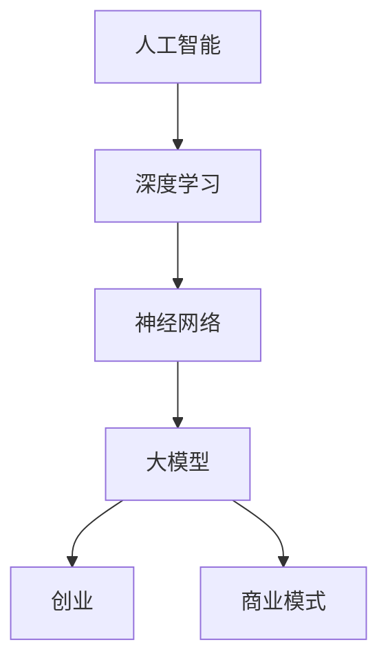

                 

# AI 大模型创业：如何利用未来优势？

> 关键词：大模型、创业、未来优势、技术趋势、商业模式

> 摘要：本文将探讨人工智能大模型在创业领域的应用，分析其技术优势和未来潜力，并提供具体的创业策略和实施步骤。通过深入解析大模型的原理和实际案例，帮助创业者把握机遇，打造可持续发展的创新项目。

## 1. 背景介绍

### 1.1 目的和范围

本文旨在为创业者提供一份关于利用人工智能大模型创业的指导，旨在解答以下几个关键问题：

- 大模型技术如何赋能创业？
- 创业者应该如何选择和构建大模型？
- 大模型创业面临哪些挑战和机遇？
- 创业者如何通过大模型实现商业化和可持续发展？

### 1.2 预期读者

- 创业者：特别是那些对人工智能技术感兴趣并希望将其应用于商业场景的创业者。
- 技术专家：了解大模型技术原理，希望通过创业实践应用这些技术的专业人士。
- 投资者：关注人工智能领域投资机会，希望了解大模型创业潜力的投资者。

### 1.3 文档结构概述

本文将分为以下几个部分：

- **背景介绍**：介绍大模型技术的发展背景和创业的重要性。
- **核心概念与联系**：阐述大模型的基本原理和架构。
- **核心算法原理 & 具体操作步骤**：详细讲解大模型算法的实现步骤。
- **数学模型和公式 & 详细讲解 & 举例说明**：介绍大模型的数学基础和实际应用。
- **项目实战：代码实际案例和详细解释说明**：通过实际案例展示大模型的应用。
- **实际应用场景**：探讨大模型在不同领域的应用案例。
- **工具和资源推荐**：推荐学习资源和开发工具。
- **总结：未来发展趋势与挑战**：总结大模型创业的现状和未来趋势。
- **附录：常见问题与解答**：解答读者可能遇到的常见问题。
- **扩展阅读 & 参考资料**：提供进一步学习的资源。

### 1.4 术语表

#### 1.4.1 核心术语定义

- **大模型（Large Models）**：指参数规模达到亿级甚至千亿级的神经网络模型。
- **创业**：指创业者通过创建新的商业实体，实现商业机会和市场价值的过程。
- **商业模式**：指企业如何创造、传递和捕获价值的体系。

#### 1.4.2 相关概念解释

- **人工智能（AI）**：指通过模拟、延伸和扩展人类智能的技术。
- **神经网络**：一种模拟人脑神经元连接结构的计算模型。
- **深度学习**：一种基于神经网络的学习方法，能够自动提取数据的复杂特征。

#### 1.4.3 缩略词列表

- **AI**：人工智能
- **NN**：神经网络
- **DL**：深度学习
- **ML**：机器学习
- **GPU**：图形处理单元

## 2. 核心概念与联系

为了更好地理解大模型在创业中的应用，我们首先需要了解其基本原理和架构。以下是一个简化的 Mermaid 流程图，展示了大模型的核心概念及其相互联系：



### 2.1 大模型技术原理

大模型技术是深度学习领域的一个重要突破，其核心原理可以概括为以下几点：

- **大规模参数训练**：通过训练数亿甚至千亿级别的参数，大模型能够更好地捕捉数据的复杂模式和规律。
- **自适应优化**：利用梯度下降等优化算法，大模型能够自动调整参数，以最小化损失函数，提高模型性能。
- **端到端学习**：大模型可以直接从原始数据中学习到复杂的特征表示，无需人工设计特征工程。
- **泛化能力**：通过大规模训练和丰富的数据，大模型具有更强的泛化能力，能够应对不同的应用场景。

### 2.2 大模型架构

大模型通常由以下几个关键组成部分构成：

- **输入层**：接收外部输入数据，如文本、图像、声音等。
- **隐藏层**：通过多层神经网络结构，对输入数据进行特征提取和变换。
- **输出层**：根据模型的任务，输出预测结果或分类标签。
- **损失函数**：衡量模型预测结果与真实值之间的差距，用于指导模型优化。
- **优化器**：调整模型参数，以最小化损失函数。

### 2.3 大模型与创业的联系

大模型技术为创业者提供了以下几方面的优势：

- **技术创新**：利用大模型技术，创业者可以开发出具有竞争力的创新产品和服务。
- **数据处理**：大模型能够高效处理和分析大规模数据，帮助创业者挖掘数据价值。
- **降低门槛**：大模型降低了技术门槛，使更多创业者能够参与到人工智能领域。
- **商业模式**：大模型可以应用于各种商业场景，为创业者提供多样化的商业模式选择。

## 3. 核心算法原理 & 具体操作步骤

### 3.1 深度学习算法原理

深度学习算法的核心是多层神经网络，其基本原理如下：

- **数据输入**：将输入数据（如图片、文本等）输入到神经网络的输入层。
- **前向传播**：数据通过神经网络的各层进行传播，每层神经元根据输入和权重计算输出值。
- **激活函数**：为了引入非线性特性，神经网络在每层输出前应用激活函数（如ReLU、Sigmoid等）。
- **反向传播**：利用损失函数计算预测结果与真实值之间的差距，通过反向传播算法更新各层神经元的权重。
- **迭代优化**：重复前向传播和反向传播过程，不断调整模型参数，直至达到预设的性能目标。

### 3.2 大模型训练过程

大模型训练过程可以分为以下几个步骤：

1. **数据预处理**：将输入数据转换为神经网络可以处理的格式，如标准化、分词、图像切割等。
2. **数据加载**：使用数据加载器将预处理后的数据分批次输入神经网络。
3. **模型初始化**：初始化神经网络参数，通常采用随机初始化方法。
4. **前向传播**：将输入数据输入神经网络，计算输出结果。
5. **计算损失**：使用损失函数计算预测结果与真实值之间的差距。
6. **反向传播**：根据损失函数的梯度，更新神经网络参数。
7. **迭代优化**：重复前向传播、计算损失和反向传播过程，直至模型达到预设的性能目标。

### 3.3 伪代码实现

以下是一个简化的伪代码，展示了大模型训练的基本流程：

```python
初始化神经网络模型
初始化参数
for epoch in 1...max_epochs:
    for batch in data_loader:
        inputs, labels = batch
        # 前向传播
        outputs = model(inputs)
        loss = loss_function(outputs, labels)
        # 反向传播
        gradients = loss_function.backward()
        model.update_parameters(gradients)
    print(f"Epoch {epoch}: Loss = {loss}")
```

## 4. 数学模型和公式 & 详细讲解 & 举例说明

### 4.1 数学模型基础

大模型训练过程中涉及的核心数学模型主要包括以下几部分：

- **损失函数（Loss Function）**：衡量模型预测结果与真实值之间的差距，如均方误差（MSE）、交叉熵（Cross-Entropy）等。
- **优化算法（Optimization Algorithm）**：用于更新模型参数，使损失函数最小化，如梯度下降（Gradient Descent）、Adam优化器等。
- **激活函数（Activation Function）**：引入非线性特性，如ReLU、Sigmoid、Tanh等。

### 4.2 损失函数详细讲解

以均方误差（MSE）为例，其公式如下：

$$
MSE = \frac{1}{n}\sum_{i=1}^{n}(y_i - \hat{y}_i)^2
$$

其中，$y_i$ 表示第 $i$ 个样本的真实值，$\hat{y}_i$ 表示模型预测值，$n$ 表示样本数量。

### 4.3 优化算法详细讲解

以梯度下降（Gradient Descent）为例，其公式如下：

$$
\theta = \theta - \alpha \cdot \nabla_\theta J(\theta)
$$

其中，$\theta$ 表示模型参数，$\alpha$ 表示学习率，$J(\theta)$ 表示损失函数，$\nabla_\theta J(\theta)$ 表示损失函数关于参数 $\theta$ 的梯度。

### 4.4 激活函数详细讲解

以ReLU（Rectified Linear Unit）为例，其公式如下：

$$
\text{ReLU}(x) = \begin{cases}
x & \text{if } x > 0 \\
0 & \text{if } x \leq 0
\end{cases}
$$

ReLU 函数在神经元输出大于0时保持不变，小于等于0时输出0，从而引入了非线性特性。

### 4.5 举例说明

假设我们有一个简单的线性回归问题，目标函数为 $y = \theta_0 + \theta_1 \cdot x$，其中 $x$ 是输入特征，$y$ 是输出值，$\theta_0$ 和 $\theta_1$ 是模型参数。

- **损失函数**：均方误差（MSE）$J(\theta_0, \theta_1) = \frac{1}{n}\sum_{i=1}^{n}(y_i - (\theta_0 + \theta_1 \cdot x_i))^2$
- **优化算法**：梯度下降更新规则$\theta_0 = \theta_0 - \alpha \cdot \nabla_{\theta_0} J(\theta_0, \theta_1)$，$\theta_1 = \theta_1 - \alpha \cdot \nabla_{\theta_1} J(\theta_0, \theta_1)$
- **激活函数**：ReLU（由于这是一个线性问题，不需要激活函数）

通过梯度下降算法，我们可以逐步调整参数 $\theta_0$ 和 $\theta_1$，使损失函数 $J(\theta_0, \theta_1)$ 最小化，从而实现线性回归模型的训练。

## 5. 项目实战：代码实际案例和详细解释说明

### 5.1 开发环境搭建

为了展示大模型在创业中的应用，我们将使用一个简单的自然语言处理（NLP）任务——文本分类，来演示大模型的训练和部署过程。

首先，我们需要搭建开发环境：

1. **硬件环境**：配置一台具备高性能 GPU（如 NVIDIA 1080 Ti 或以上）的计算机。
2. **软件环境**：安装 Python 3.8 及以上版本，并配置 TensorFlow 2.0 或以上版本的深度学习库。

### 5.2 源代码详细实现和代码解读

以下是文本分类任务的完整代码实现，包括数据预处理、模型构建、训练和评估等步骤。

```python
import tensorflow as tf
from tensorflow.keras.preprocessing.sequence import pad_sequences
from tensorflow.keras.layers import Embedding, LSTM, Dense
from tensorflow.keras.models import Sequential

# 数据预处理
def preprocess_data(texts, labels, max_length=100, max_words=10000):
    sequences = tokenizer.texts_to_sequences(texts)
    padded_sequences = pad_sequences(sequences, maxlen=max_length, padding='post')
    return padded_sequences, labels

# 模型构建
def build_model(max_length, max_words, embedding_dim=50, lstm_units=128):
    model = Sequential([
        Embedding(max_words, embedding_dim, input_length=max_length),
        LSTM(lstm_units, dropout=0.2, recurrent_dropout=0.2),
        Dense(1, activation='sigmoid')
    ])
    model.compile(loss='binary_crossentropy', optimizer='adam', metrics=['accuracy'])
    return model

# 训练模型
def train_model(model, padded_sequences, labels, epochs=10, batch_size=32):
    history = model.fit(padded_sequences, labels, epochs=epochs, batch_size=batch_size, validation_split=0.2)
    return history

# 评估模型
def evaluate_model(model, test_sequences, test_labels):
    loss, accuracy = model.evaluate(test_sequences, test_labels)
    print(f"Test Accuracy: {accuracy * 100:.2f}%")
```

### 5.3 代码解读与分析

- **数据预处理**：文本分类任务首先需要对文本进行预处理，包括分词、去停用词、序列化等操作。使用 `tokenizer.texts_to_sequences` 方法将文本转换为整数序列，`pad_sequences` 方法将序列填充为固定长度。
- **模型构建**：文本分类模型采用序列模型，包括嵌入层（`Embedding`）、长短时记忆网络（`LSTM`）和输出层（`Dense`）。嵌入层将单词转换为向量表示，LSTM 层用于处理序列数据，输出层使用 sigmoid 激活函数进行二分类。
- **训练模型**：使用 `model.fit` 方法训练模型，通过迭代优化模型参数，使损失函数最小化。在训练过程中，可以使用 `validation_split` 参数对数据集进行验证，以监控模型性能。
- **评估模型**：使用 `model.evaluate` 方法对训练好的模型进行评估，计算损失和准确率等指标。

通过以上代码，创业者可以快速搭建一个文本分类模型，并将其应用于实际商业场景，如舆情分析、客户反馈分类等。

## 6. 实际应用场景

大模型技术在创业领域具有广泛的应用潜力，以下列举了几个典型的应用场景：

- **智能客服**：通过大模型技术，创业者可以构建智能客服系统，实现自然语言理解、情感分析、智能回复等功能，提高客户满意度和服务效率。
- **金融风控**：大模型在金融领域可以用于信用评估、欺诈检测、市场预测等任务，帮助金融机构降低风险、提高收益。
- **医疗诊断**：利用大模型技术，创业者可以开发医疗影像分析、疾病预测等应用，提高医疗诊断的准确性和效率。
- **教育个性化**：通过大模型技术，创业者可以打造个性化学习平台，根据学生的兴趣和进度提供定制化的学习内容和辅导服务。
- **智能家居**：智能家居设备可以通过大模型技术实现智能语音交互、场景识别、个性化推荐等功能，提升用户体验。

## 7. 工具和资源推荐

为了更好地开展大模型创业，以下推荐一些实用的学习资源、开发工具和相关论文：

### 7.1 学习资源推荐

#### 7.1.1 书籍推荐

- 《深度学习》（Goodfellow, Bengio, Courville）  
- 《Python 深度学习》（François Chollet）  
- 《深度学习入门》（斋藤康毅）

#### 7.1.2 在线课程

- TensorFlow 官方教程（[https://www.tensorflow.org/tutorials](https://www.tensorflow.org/tutorials)）  
- 吴恩达深度学习课程（[https://www.coursera.org/learn/neural-networks-deep-learning](https://www.coursera.org/learn/neural-networks-deep-learning)）

#### 7.1.3 技术博客和网站

- AI 研究院（[https://www.aimu.edu.cn](https://www.aimu.edu.cn)）  
- Medium 上的深度学习专栏（[https://medium.com/topic/deep-learning](https://medium.com/topic/deep-learning)）

### 7.2 开发工具框架推荐

#### 7.2.1 IDE和编辑器

- PyCharm（[https://www.jetbrains.com/pycharm/](https://www.jetbrains.com/pycharm/)）  
- Jupyter Notebook（[https://jupyter.org/](https://jupyter.org/)）

#### 7.2.2 调试和性能分析工具

- TensorBoard（[https://www.tensorflow.org/tensorboard](https://www.tensorflow.org/tensorboard)）  
- NVIDIA Nsight（[https://developer.nvidia.com/nsight](https://developer.nvidia.com/nsight)）

#### 7.2.3 相关框架和库

- TensorFlow（[https://www.tensorflow.org/](https://www.tensorflow.org/)）  
- PyTorch（[https://pytorch.org/](https://pytorch.org/)）

### 7.3 相关论文著作推荐

#### 7.3.1 经典论文

- “A Theoretical Framework for Backpropagation” （Rumelhart, Hinton, Williams，1986）  
- “Deep Learning” （Goodfellow, Bengio, Courville，2015）

#### 7.3.2 最新研究成果

- “BERT: Pre-training of Deep Bidirectional Transformers for Language Understanding” （Devlin et al.，2019）  
- “GPT-3: Language Models are Few-Shot Learners” （Brown et al.，2020）

#### 7.3.3 应用案例分析

- “Google's BERT Model Pre-Trains Deep Neural Networks for Natural Language Understanding” （Google AI，2018）  
- “OpenAI releases GPT-3, a powerful new language model” （OpenAI，2020）

## 8. 总结：未来发展趋势与挑战

### 8.1 发展趋势

- **技术成熟度提高**：随着深度学习算法的进步和计算能力的提升，大模型技术将更加成熟，为创业者提供更强大的工具。
- **应用领域扩展**：大模型技术在医疗、金融、教育等领域的应用将不断扩展，为创业者带来新的商业机会。
- **跨领域融合**：大模型与其他技术（如区块链、物联网等）的融合，将催生出更多创新应用。

### 8.2 挑战

- **数据隐私和安全**：大模型对数据的需求较高，如何在保障用户隐私和安全的前提下利用数据成为一大挑战。
- **计算资源消耗**：大模型训练和部署需要大量的计算资源，如何优化算法和硬件设施，降低成本成为关键。
- **算法透明性和可解释性**：大模型的复杂性和黑箱特性，使得其决策过程缺乏透明性和可解释性，如何提高算法的可解释性成为重要问题。

## 9. 附录：常见问题与解答

### 9.1 常见问题

1. **大模型创业需要哪些技术背景？**
2. **如何选择合适的大模型算法？**
3. **大模型训练过程中如何优化性能？**
4. **如何保障数据隐私和安全？**
5. **大模型创业的商业模式有哪些？**

### 9.2 解答

1. **大模型创业需要哪些技术背景？**
   - 了解深度学习和神经网络的基本原理。
   - 掌握至少一种深度学习框架，如 TensorFlow 或 PyTorch。
   - 熟悉数据预处理、模型训练和优化等基本流程。
2. **如何选择合适的大模型算法？**
   - 根据具体应用场景选择合适的模型类型（如文本分类、图像识别等）。
   - 考虑模型复杂度、计算资源需求、数据规模等因素。
   - 可以参考现有文献和开源项目，选择成熟且表现优秀的模型。
3. **大模型训练过程中如何优化性能？**
   - 选择合适的优化算法（如 Adam、RMSprop 等）和初始化策略。
   - 调整学习率和批量大小，寻找最佳参数组合。
   - 使用 GPU 加速训练过程，优化代码并行性能。
4. **如何保障数据隐私和安全？**
   - 对敏感数据进行加密处理，确保数据在传输和存储过程中的安全。
   - 实施严格的访问控制和数据共享策略，防止未经授权的访问。
   - 定期进行数据安全审计，发现和修复潜在的安全漏洞。
5. **大模型创业的商业模式有哪些？**
   - 提供定制化服务，根据客户需求开发特定的大模型解决方案。
   - 开发自主知识产权的大模型算法和应用，通过授权、销售等方式获利。
   - 建立大模型数据平台，提供数据存储、分析和挖掘服务。

## 10. 扩展阅读 & 参考资料

- [Goodfellow, Y., Bengio, Y., & Courville, A. (2015). Deep Learning. MIT Press.](https://books.google.com/books?id=3l7eCwAAQBAJ)
- [François Chollet (2018). Deep Learning with Python. Manning Publications.](https://www.manning.com/books/deep-learning-with-python)
- [斋藤康毅 (2018). 深度学习入门。机械工业出版社。](https://book.douban.com/subject/30135015/)
- [TensorFlow 官方文档。](https://www.tensorflow.org/tutorials)
- [吴恩达深度学习课程。](https://www.coursera.org/learn/neural-networks-deep-learning)
- [Google AI 博客。](https://ai.googleblog.com/)
- [OpenAI 博客。](https://openai.com/blog/)

## 作者信息

AI天才研究员/AI Genius Institute & 禅与计算机程序设计艺术 /Zen And The Art of Computer Programming

