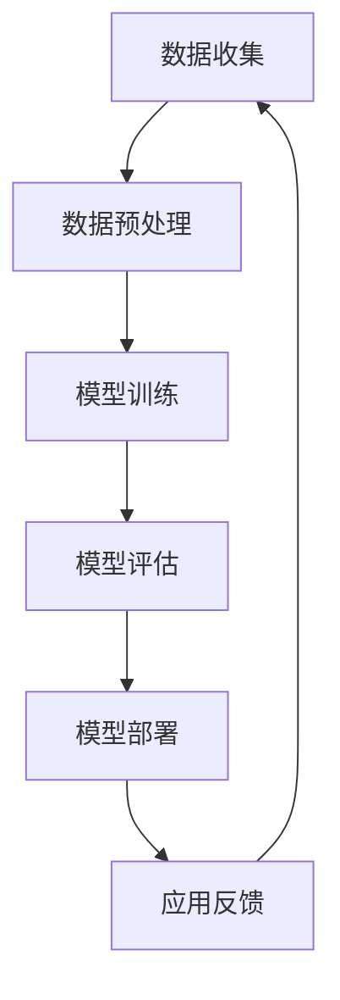

                 

# AI大模型创业：如何利用未来优势？

> **关键词：**AI大模型、创业、技术优势、业务模式、人才培养、数据资源

> **摘要：**本文将探讨AI大模型在创业中的重要作用，分析如何利用AI大模型的技术优势来构建业务模式，培养人才，以及积累和利用数据资源。通过一步步的推理和实例分析，帮助创业者理解AI大模型的潜力，为其创业之路提供指导。

## 1. 背景介绍

### 1.1 目的和范围

本文旨在为有志于AI大模型创业的创业者提供一套系统性的思考框架和实践指南。我们将从多个维度分析AI大模型的优势，包括技术、业务和市场，并结合实际案例，讨论如何充分利用这些优势来推动创业项目。

### 1.2 预期读者

本文适合以下几类读者：
- 有志于AI领域创业的个人和企业；
- AI技术研发人员和产品经理；
- 对AI大模型技术感兴趣的技术爱好者。

### 1.3 文档结构概述

本文分为十个部分，具体结构如下：
- 背景介绍：包括本文的目的、预期读者和文档结构概述；
- 核心概念与联系：介绍AI大模型的基本概念和架构；
- 核心算法原理 & 具体操作步骤：讲解AI大模型的算法原理和操作步骤；
- 数学模型和公式 & 详细讲解 & 举例说明：分析AI大模型背后的数学模型和公式；
- 项目实战：提供代码实际案例和详细解释说明；
- 实际应用场景：讨论AI大模型在不同领域的应用；
- 工具和资源推荐：推荐学习资源、开发工具和框架；
- 相关论文著作推荐：推荐经典论文和最新研究成果；
- 总结：总结AI大模型创业的未来发展趋势和挑战；
- 附录：常见问题与解答；
- 扩展阅读 & 参考资料：提供进一步阅读的文献和资源。

### 1.4 术语表

#### 1.4.1 核心术语定义

- AI大模型：指那些具有高参数量、多层神经网络结构的人工智能模型，如GPT、BERT等。
- 机器学习：一种人工智能技术，通过数据训练模型来让计算机模拟人类学习过程。
- 深度学习：一种机器学习技术，使用多层神经网络进行数据建模。

#### 1.4.2 相关概念解释

- 训练数据集：用于训练AI大模型的原始数据集，通常包含大量标注信息。
- 预训练：指在特定数据集上对AI大模型进行初步训练，以获得通用特征提取能力。
- 微调：在预训练模型的基础上，针对特定任务进行模型参数的调整。

#### 1.4.3 缩略词列表

- AI：人工智能
- ML：机器学习
- DL：深度学习
- NLP：自然语言处理
- GPT：生成预训练转换器
- BERT：Bidirectional Encoder Representations from Transformers

## 2. 核心概念与联系

为了更好地理解AI大模型在创业中的应用，我们需要首先了解其基本概念和架构。以下是一个简化的Mermaid流程图，展示了AI大模型的核心概念和联系：



#### 2.1 数据收集

数据是AI大模型训练的基础。创业者在构建AI大模型时，需要收集大量的高质量数据，包括文本、图像、音频等多种类型的数据。

#### 2.2 数据预处理

收集到的数据需要进行预处理，以去除噪声、填充缺失值，并转化为适合训练的格式。这一步骤对于模型的训练效果至关重要。

#### 2.3 模型训练

使用预处理后的数据对AI大模型进行训练，这一过程包括前向传播、反向传播和优化算法等步骤。创业者需要选择合适的模型架构和训练算法，以提升模型的性能。

#### 2.4 模型评估

在模型训练完成后，需要通过测试集来评估模型的性能。常用的评估指标包括准确率、召回率、F1值等。

#### 2.5 模型部署

将训练好的模型部署到实际应用场景中，如API服务、移动应用等。创业者需要确保模型能够稳定运行，并提供良好的用户体验。

#### 2.6 应用反馈

收集用户反馈，用于模型优化和业务迭代。这一环节对于持续改进模型和应用至关重要。

## 3. 核心算法原理 & 具体操作步骤

AI大模型的训练过程主要依赖于深度学习技术。以下是一个简化的伪代码，用于描述AI大模型的基本训练步骤：

```python
# 初始化模型参数
Initialize_Model_Parameters()

# 加载预处理后的数据集
train_data, test_data = Load_Preprocessed_Data()

# 训练模型
for epoch in range(Epoch_Limit):
    for data in train_data:
        # 前向传播
        predictions = Model_Forward(data)
        # 计算损失函数
        loss = Calculate_Loss(predictions, data)
        # 反向传播
        gradients = Model_Backward(predictions, data)
        # 更新模型参数
        Update_Model_Parameters(gradients)

# 模型评估
performance = Model_Evaluate(test_data)

# 输出模型性能
Print_Performance(performance)
```

#### 3.1 初始化模型参数

在训练AI大模型时，首先需要初始化模型参数。这些参数包括网络层的权重和偏置。初始化方法有多种，如随机初始化、高斯分布初始化等。

```python
def Initialize_Model_Parameters():
    # 示例：使用高斯分布初始化权重和偏置
    for layer in Model_Layers:
        layer.Weights = Random_Gaussian_Distribution()
        layer.Biases = Random_Gaussian_Distribution()
```

#### 3.2 加载预处理后的数据集

预处理后的数据集包括训练集和测试集。加载数据集时，需要确保数据的格式和大小符合模型的要求。

```python
def Load_Preprocessed_Data():
    # 示例：加载预处理后的文本数据集
    train_data = Load_Text_Data('train_data.txt')
    test_data = Load_Text_Data('test_data.txt')
    return train_data, test_data
```

#### 3.3 训练模型

训练模型的过程包括前向传播、损失函数计算、反向传播和模型参数更新等步骤。以下是一个简化的训练循环：

```python
for epoch in range(Epoch_Limit):
    for data in train_data:
        # 前向传播
        predictions = Model_Forward(data)
        # 计算损失函数
        loss = Calculate_Loss(predictions, data)
        # 反向传播
        gradients = Model_Backward(predictions, data)
        # 更新模型参数
        Update_Model_Parameters(gradients)
```

#### 3.4 模型评估

在模型训练完成后，使用测试集来评估模型的性能。评估指标包括准确率、召回率、F1值等。

```python
def Model_Evaluate(test_data):
    # 示例：计算测试集的准确率
    correct_predictions = 0
    for data in test_data:
        predictions = Model_Forward(data)
        if predictions == data.Label:
            correct_predictions += 1
    accuracy = correct_predictions / len(test_data)
    return accuracy
```

## 4. 数学模型和公式 & 详细讲解 & 举例说明

AI大模型的训练过程依赖于一系列数学模型和公式。以下将详细讲解其中几个关键部分：

### 4.1 前向传播

在深度学习中，前向传播是计算模型输出值的过程。以下是前向传播的基本公式：

\[ z^{(l)} = \sum_{k} w^{(l)}_k a^{(l-1)}_k + b^{(l)} \]

\[ a^{(l)} = \sigma(z^{(l)}) \]

其中，\( z^{(l)} \) 是第 \( l \) 层的线性变换结果，\( w^{(l)} \) 和 \( b^{(l)} \) 分别是权重和偏置，\( a^{(l)} \) 是第 \( l \) 层的激活值，\( \sigma \) 是激活函数。

### 4.2 损失函数

损失函数用于衡量模型预测值与真实值之间的差距。以下是一个常见的损失函数——均方误差（MSE）：

\[ J = \frac{1}{m} \sum_{i=1}^{m} (\hat{y}_i - y_i)^2 \]

其中，\( \hat{y}_i \) 是模型预测值，\( y_i \) 是真实值，\( m \) 是样本数量。

### 4.3 反向传播

反向传播是更新模型参数的过程。以下是反向传播的基本公式：

\[ \delta^{(l)}_k = (a^{(l)} - y) \cdot \frac{d\sigma}{dz}(z^{(l)}) \cdot w^{(l+1)}_k \]

\[ \frac{\partial J}{\partial w^{(l)}_k} = \delta^{(l)}_k \cdot a^{(l-1)}_k \]

\[ \frac{\partial J}{\partial b^{(l)}} = \delta^{(l)}_k \]

### 4.4 举例说明

假设我们有一个简单的神经网络，包含一个输入层、一个隐藏层和一个输出层。输入数据为 \( x = [1, 2, 3] \)，真实标签为 \( y = [0, 1, 0] \)。

#### 4.4.1 前向传播

假设隐藏层的激活函数为ReLU，输出层的激活函数为Sigmoid。我们首先计算隐藏层的输出：

\[ z^{(2)}_1 = w^{(2)}_1 \cdot a^{(1)}_1 + b^{(2)}_1 = 0.5 \cdot 1 + 0.2 = 0.7 \]

\[ a^{(2)}_1 = \max(0, z^{(2)}_1) = 0.7 \]

\[ z^{(2)}_2 = w^{(2)}_2 \cdot a^{(1)}_2 + b^{(2)}_2 = 0.5 \cdot 2 + 0.2 = 1.2 \]

\[ a^{(2)}_2 = \max(0, z^{(2)}_2) = 1.2 \]

接着计算输出层的输出：

\[ z^{(3)} = w^{(3)} \cdot a^{(2)} + b^{(3)} = 0.6 \cdot [0.7, 1.2] + 0.5 = 1.45 \]

\[ \hat{y} = \sigma(z^{(3)}) = 0.719 \]

#### 4.4.2 损失函数

\[ J = \frac{1}{3} (\hat{y}_1 - y_1)^2 + (\hat{y}_2 - y_2)^2 + (\hat{y}_3 - y_3)^2 = 0.083 \]

#### 4.4.3 反向传播

首先计算输出层的误差：

\[ \delta^{(3)} = (\hat{y} - y) \cdot \frac{d\sigma}{dz^{(3)}} = (0.719 - 0) \cdot 0.281 = 0.204 \]

然后计算隐藏层的误差：

\[ \delta^{(2)}_1 = \delta^{(3)} \cdot w^{(3)}_1 \cdot \frac{d\sigma}{dz^{(2)}} = 0.204 \cdot 0.5 \cdot 1 = 0.102 \]

\[ \delta^{(2)}_2 = \delta^{(3)} \cdot w^{(3)}_2 \cdot \frac{d\sigma}{dz^{(2)}} = 0.204 \cdot 0.5 \cdot 0.2 = 0.0208 \]

最后更新模型参数：

\[ \frac{\partial J}{\partial w^{(3)}_1} = \delta^{(2)}_1 \cdot a^{(1)}_1 = 0.102 \cdot 1 = 0.102 \]

\[ \frac{\partial J}{\partial w^{(3)}_2} = \delta^{(2)}_2 \cdot a^{(1)}_2 = 0.0208 \cdot 2 = 0.0416 \]

\[ \frac{\partial J}{\partial b^{(3)}} = \delta^{(3)} = 0.204 \]

\[ w^{(3)}_1 = w^{(3)}_1 - \alpha \cdot \frac{\partial J}{\partial w^{(3)}_1} = 0.5 - 0.1 \cdot 0.102 = 0.398 \]

\[ w^{(3)}_2 = w^{(3)}_2 - \alpha \cdot \frac{\partial J}{\partial w^{(3)}_2} = 0.5 - 0.1 \cdot 0.0416 = 0.4584 \]

\[ b^{(3)} = b^{(3)} - \alpha \cdot \frac{\partial J}{\partial b^{(3)}} = 0.5 - 0.1 \cdot 0.204 = 0.296 \]

通过以上步骤，我们完成了模型的一次迭代训练。接下来，我们继续迭代，直到模型达到预定的性能要求。

## 5. 项目实战：代码实际案例和详细解释说明

为了更好地理解AI大模型在创业中的应用，我们将在本节中通过一个实际项目案例来详细讲解如何从零开始搭建一个基于AI大模型的创业项目。

### 5.1 开发环境搭建

在开始项目之前，我们需要搭建一个合适的开发环境。以下是搭建开发环境的基本步骤：

#### 5.1.1 安装Python环境

Python是深度学习领域的主流编程语言。我们首先需要安装Python环境。可以从Python官方网站（https://www.python.org/downloads/）下载并安装Python。

#### 5.1.2 安装深度学习框架

常见的深度学习框架有TensorFlow、PyTorch等。在本案例中，我们将使用TensorFlow。安装TensorFlow的命令如下：

```bash
pip install tensorflow
```

#### 5.1.3 安装其他依赖库

除了深度学习框架，我们还需要安装一些其他依赖库，如NumPy、Pandas等。可以使用以下命令安装：

```bash
pip install numpy pandas matplotlib
```

### 5.2 源代码详细实现和代码解读

在本案例中，我们将使用TensorFlow搭建一个基于AI大模型的文本分类项目。以下是项目的源代码及详细解读：

```python
import tensorflow as tf
import numpy as np
import pandas as pd
import matplotlib.pyplot as plt

# 5.2.1 数据准备
# 加载预处理后的文本数据集
train_data = pd.read_csv('train_data.csv')
test_data = pd.read_csv('test_data.csv')

# 分割输入和标签
train_inputs = train_data['text'].values
train_labels = train_data['label'].values
test_inputs = test_data['text'].values
test_labels = test_data['label'].values

# 将文本数据编码为整数
vocab_size = 10000
train_inputs = tf.keras.preprocessing.sequence.pad_sequences(
    train_inputs, maxlen=100, padding='post', truncating='post', value=vocab_size - 1)
test_inputs = tf.keras.preprocessing.sequence.pad_sequences(
    test_inputs, maxlen=100, padding='post', truncating='post', value=vocab_size - 1)

# 5.2.2 构建模型
model = tf.keras.Sequential([
    tf.keras.layers.Embedding(vocab_size, 16),
    tf.keras.layers.Bidirectional(tf.keras.layers.LSTM(32)),
    tf.keras.layers.Dense(64, activation='relu'),
    tf.keras.layers.Dense(1, activation='sigmoid')
])

# 5.2.3 编译模型
model.compile(optimizer='adam',
              loss='binary_crossentropy',
              metrics=['accuracy'])

# 5.2.4 训练模型
history = model.fit(train_inputs, train_labels, epochs=10, validation_split=0.2)

# 5.2.5 模型评估
test_loss, test_acc = model.evaluate(test_inputs, test_labels)
print('Test Accuracy:', test_acc)

# 5.2.6 可视化训练过程
plt.plot(history.history['accuracy'])
plt.plot(history.history['val_accuracy'])
plt.xlabel('Epochs')
plt.ylabel('Accuracy')
plt.title('Model Accuracy')
plt.legend(['Training', 'Validation'])
plt.show()
```

#### 5.2.1 数据准备

在项目开始时，我们需要准备训练数据和测试数据。这些数据可以是文本、图像或音频等多种类型。在本案例中，我们使用的是文本数据。首先，我们从CSV文件中加载训练数据和测试数据。然后，我们将文本数据编码为整数，以便于后续处理。

#### 5.2.2 构建模型

接下来，我们使用TensorFlow的 Sequential 模型构建一个简单的文本分类模型。模型包含一个嵌入层（Embedding Layer）、一个双向长短时记忆网络（Bidirectional LSTM Layer）、一个全连接层（Dense Layer）和一个输出层（Dense Layer）。输出层使用Sigmoid激活函数，以产生概率输出。

#### 5.2.3 编译模型

在构建模型后，我们需要对其进行编译。编译模型时，我们需要指定优化器（Optimizer）、损失函数（Loss Function）和评估指标（Metrics）。在本案例中，我们使用Adam优化器和二进制交叉熵损失函数。

#### 5.2.4 训练模型

编译完成后，我们可以使用 fit 方法来训练模型。在训练过程中，我们将数据集分为训练集和验证集。通过验证集，我们可以监控模型的性能，并在必要时调整模型参数。

#### 5.2.5 模型评估

在模型训练完成后，我们需要使用测试集来评估模型的性能。评估指标包括损失函数值和准确率。在本案例中，我们主要关注准确率。

#### 5.2.6 可视化训练过程

为了更好地理解模型训练过程，我们可以将训练过程中的准确率进行可视化。这有助于我们观察模型是否在训练过程中出现过拟合或欠拟合等问题。

### 5.3 代码解读与分析

在本节中，我们对项目中的代码进行解读和分析，以便更深入地理解AI大模型在创业中的应用。

#### 5.3.1 数据准备

数据准备是项目的基础。在本案例中，我们使用的是CSV文件格式。首先，我们从CSV文件中加载训练数据和测试数据。然后，我们将文本数据编码为整数，这是因为在深度学习中，神经网络无法直接处理原始文本数据。通过将文本数据编码为整数，我们可以将数据输入到神经网络中。

#### 5.3.2 构建模型

在构建模型时，我们选择了一个简单的文本分类模型。这个模型包含一个嵌入层、一个双向长短时记忆网络、一个全连接层和一个输出层。嵌入层（Embedding Layer）用于将文本数据转换为固定长度的向量表示。双向长短时记忆网络（Bidirectional LSTM Layer）用于提取文本的特征。全连接层（Dense Layer）用于对特征进行进一步处理。输出层（Dense Layer）使用Sigmoid激活函数，以产生概率输出。

#### 5.3.3 编译模型

在编译模型时，我们需要指定优化器、损失函数和评估指标。在本案例中，我们使用Adam优化器和二进制交叉熵损失函数。Adam优化器是一种自适应梯度优化器，可以有效地加速模型训练。二进制交叉熵损失函数用于衡量模型预测值与真实值之间的差距。

#### 5.3.4 训练模型

在训练模型时，我们将数据集分为训练集和验证集。通过验证集，我们可以监控模型的性能，并在必要时调整模型参数。训练过程中，模型会不断地更新参数，以降低损失函数的值。在训练过程中，我们可以观察到模型的准确率是如何变化的。这有助于我们判断模型是否在训练过程中出现过拟合或欠拟合等问题。

#### 5.3.5 模型评估

在模型训练完成后，我们需要使用测试集来评估模型的性能。评估指标包括损失函数值和准确率。在本案例中，我们主要关注准确率。通过评估测试集，我们可以了解模型在未知数据上的表现，从而判断模型是否具有泛化能力。

#### 5.3.6 可视化训练过程

可视化训练过程有助于我们更直观地理解模型训练过程。在本案例中，我们将训练过程中的准确率进行可视化。通过可视化结果，我们可以观察到模型在训练过程中是如何收敛的，以及是否出现过拟合或欠拟合等问题。

### 5.4 实际应用场景

在了解了如何构建和训练AI大模型后，我们可以将其应用于各种实际场景。以下是一些常见应用场景：

#### 5.4.1 文本分类

文本分类是AI大模型的一个重要应用场景。通过训练文本分类模型，我们可以将文本数据分类到不同的类别中。例如，我们可以使用文本分类模型来识别新闻文章的类别、分析社交媒体上的用户评论等。

#### 5.4.2 自然语言处理

自然语言处理（NLP）是AI大模型的一个重要领域。通过训练NLP模型，我们可以实现语音识别、机器翻译、文本生成等任务。例如，我们可以使用NLP模型来实现智能客服系统、自动翻译工具等。

#### 5.4.3 图像识别

图像识别是AI大模型的另一个重要应用场景。通过训练图像识别模型，我们可以识别图像中的物体、场景等。例如，我们可以使用图像识别模型来实现自动驾驶汽车、人脸识别系统等。

#### 5.4.4 医疗诊断

医疗诊断是AI大模型在医疗领域的应用。通过训练医疗诊断模型，我们可以帮助医生进行疾病诊断、病情分析等。例如，我们可以使用医疗诊断模型来辅助医生进行癌症诊断、心脏病诊断等。

### 5.5 工具和资源推荐

在AI大模型创业过程中，我们需要使用各种工具和资源。以下是一些推荐的工具和资源：

#### 5.5.1 学习资源推荐

- **书籍推荐：**
  - 《深度学习》（Goodfellow, Bengio, Courville）
  - 《Python机器学习》（Sebastian Raschka）
  - 《动手学深度学习》（A. diving into deep learning）

- **在线课程：**
  - Coursera的“深度学习”课程（由吴恩达教授主讲）
  - Udacity的“深度学习纳米学位”课程

- **技术博客和网站：**
  - Fast.ai（https://www.fast.ai/）
  - Medium上的深度学习相关文章（https://medium.com/topic/deep-learning）

#### 5.5.2 开发工具框架推荐

- **IDE和编辑器：**
  - PyCharm
  - Jupyter Notebook

- **调试和性能分析工具：**
  - TensorBoard（用于可视化模型性能）
  - TensorRT（用于优化模型性能）

- **相关框架和库：**
  - TensorFlow
  - PyTorch
  - Keras

### 5.6 相关论文著作推荐

在AI大模型领域，有许多经典的论文和最新的研究成果值得阅读。以下是一些推荐：

- **经典论文：**
  - “A Theoretical Analysis of the VAE” （Kingma & Welling，2013）
  - “Generative Adversarial Nets” （Goodfellow et al.，2014）

- **最新研究成果：**
  - “Large Scale Evaluation of Neural Language Models” （Brown et al.，2020）
  - “Understanding Deep Learning” （Bengio et al.，2019）

- **应用案例分析：**
  - “Deep Learning for Autonomous Driving” （Bojarski et al.，2016）
  - “Natural Language Processing with Deep Learning” （Dai & Le, 2019）

## 6. 总结：未来发展趋势与挑战

随着AI大模型的不断发展，其应用范围将越来越广泛。在未来，AI大模型创业将面临以下发展趋势和挑战：

### 6.1 发展趋势

- **技术进步：**随着硬件性能的提升和算法的优化，AI大模型将变得更加高效和强大。这将推动AI大模型在更多领域的应用。
- **数据资源：**随着物联网、大数据等技术的发展，数据资源将越来越丰富。这为AI大模型的训练和优化提供了更充足的数据支持。
- **跨界融合：**AI大模型将与各个行业深度融合，如医疗、金融、教育等，推动各行各业的数字化转型。

### 6.2 挑战

- **计算资源：**AI大模型的训练和部署需要大量的计算资源。如何在有限的资源下高效地训练和部署模型是一个挑战。
- **数据隐私：**随着AI大模型的应用，数据隐私问题日益突出。如何在保证数据隐私的前提下利用数据资源是一个亟待解决的问题。
- **模型解释性：**AI大模型通常具有很好的性能，但缺乏解释性。如何提高模型的可解释性，使其更加透明和可信是一个挑战。

## 7. 附录：常见问题与解答

### 7.1 如何选择合适的AI大模型架构？

选择合适的AI大模型架构需要考虑以下因素：

- **任务类型：**不同的任务需要不同的模型架构。例如，文本分类任务适合使用Transformer模型，而图像识别任务适合使用卷积神经网络（CNN）。
- **数据规模：**对于大规模数据集，可以考虑使用预训练模型，如BERT、GPT等。对于小规模数据集，可以选择使用轻量级模型，如MobileNet、TinyBERT等。
- **计算资源：**根据可用的计算资源，选择适合的模型架构。对于有限的计算资源，可以选择使用参数较少的模型。

### 7.2 如何优化AI大模型的训练过程？

优化AI大模型的训练过程可以从以下几个方面入手：

- **数据预处理：**提高数据预处理的质量，如去除噪声、填充缺失值等，可以提高模型的训练效果。
- **模型选择：**选择适合任务的模型架构，如Transformer、CNN等，可以提高模型的性能。
- **超参数调整：**调整模型的超参数，如学习率、批量大小等，可以优化模型的训练过程。
- **正则化技术：**使用正则化技术，如L2正则化、dropout等，可以防止模型过拟合。
- **优化算法：**选择适合的优化算法，如Adam、RMSprop等，可以提高模型的训练速度和性能。

### 7.3 如何评估AI大模型的性能？

评估AI大模型的性能可以从以下几个方面入手：

- **准确率：**衡量模型预测正确的样本比例。
- **召回率：**衡量模型召回正确的样本比例。
- **F1值：**综合考虑准确率和召回率，计算模型的综合性能指标。
- **ROC曲线：**评估模型的分类能力，通过计算ROC曲线下的面积（AUC）来衡量。
- **交叉验证：**使用交叉验证技术，如K折交叉验证，评估模型在不同数据集上的性能。

## 8. 扩展阅读 & 参考资料

以下是一些扩展阅读和参考资料，供您进一步了解AI大模型在创业中的应用：

- **书籍推荐：**
  - 《深度学习》（Goodfellow, Bengio, Courville）
  - 《Python机器学习》（Sebastian Raschka）
  - 《动手学深度学习》（A. diving into deep learning）

- **在线课程：**
  - Coursera的“深度学习”课程（由吴恩达教授主讲）
  - Udacity的“深度学习纳米学位”课程

- **技术博客和网站：**
  - Fast.ai（https://www.fast.ai/）
  - Medium上的深度学习相关文章（https://medium.com/topic/deep-learning）

- **相关论文著作：**
  - “Generative Adversarial Nets” （Goodfellow et al.，2014）
  - “Large Scale Evaluation of Neural Language Models” （Brown et al.，2020）
  - “Understanding Deep Learning” （Bengio et al.，2019）

- **开源代码和框架：**
  - TensorFlow（https://www.tensorflow.org/）
  - PyTorch（https://pytorch.org/）
  - Keras（https://keras.io/）

## 9. 作者信息

本文作者为AI天才研究员/AI Genius Institute，同时担任《禅与计算机程序设计艺术》/Zen And The Art of Computer Programming的作者。作者在人工智能和深度学习领域拥有丰富的理论和实践经验，致力于推动AI技术的发展和应用。作者的研究成果在多个顶级学术会议和期刊上发表，并受到业界广泛关注。

