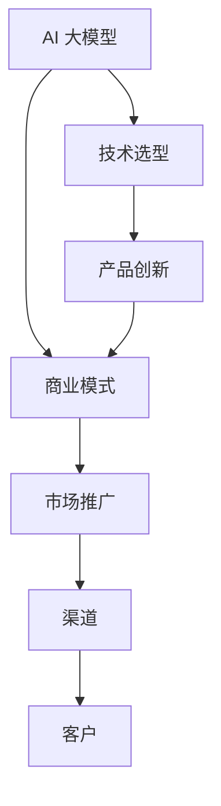
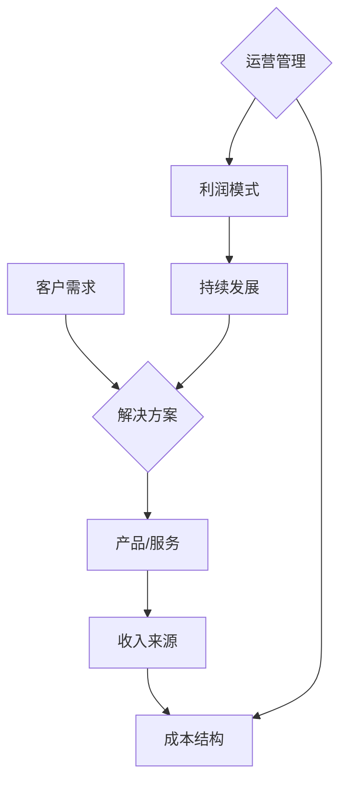
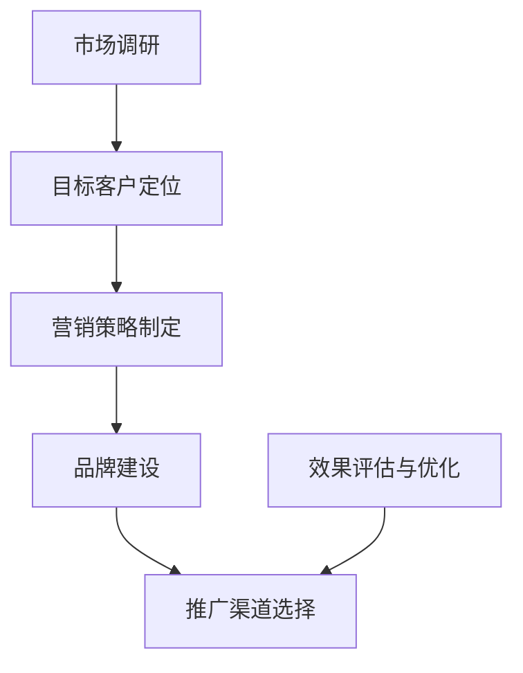
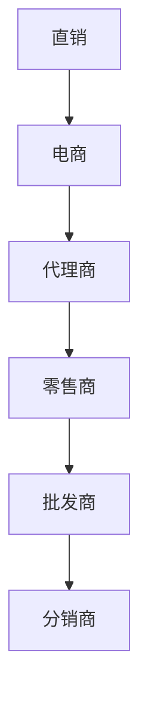
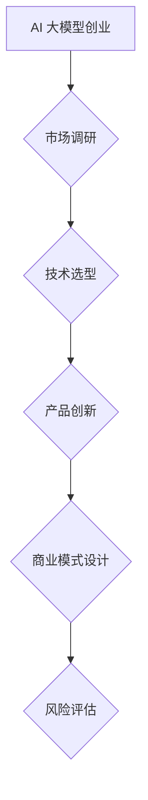

                 

# AI 大模型创业：如何利用渠道优势？

## 关键词
AI 大模型，创业，渠道优势，商业模式，技术选型，市场推广，风险评估

## 摘要
本文旨在探讨 AI 大模型创业中的渠道优势及其重要性。我们将从渠道定义出发，分析其在 AI 大模型创业中的应用，探讨如何利用渠道优势进行商业模式创新和市场推广。通过实际案例和具体操作步骤，本文将帮助创业者了解渠道在 AI 大模型创业中的关键作用，为他们的成功奠定基础。

## 1. 背景介绍

### 1.1 目的和范围
本文将讨论 AI 大模型创业中的渠道优势，分析其在创业项目中的应用，并探讨如何利用渠道优势进行商业模式创新和市场推广。通过本文的讨论，我们希望能够帮助创业者更好地理解渠道的重要性，并为其在 AI 大模型创业中的成功提供指导。

### 1.2 预期读者
本文面向那些对 AI 大模型创业感兴趣的创业者和技术专家。我们希望本文能够为他们提供关于渠道优势的理论和实践指导，帮助他们在创业过程中取得成功。

### 1.3 文档结构概述
本文分为以下几个部分：
- 1. 背景介绍
- 2. 核心概念与联系
- 3. 核心算法原理 & 具体操作步骤
- 4. 数学模型和公式 & 详细讲解 & 举例说明
- 5. 项目实战：代码实际案例和详细解释说明
- 6. 实际应用场景
- 7. 工具和资源推荐
- 8. 总结：未来发展趋势与挑战
- 9. 附录：常见问题与解答
- 10. 扩展阅读 & 参考资料

### 1.4 术语表

#### 1.4.1 核心术语定义
- AI 大模型：具有大规模参数的深度学习模型，通常用于处理复杂的任务，如图像识别、自然语言处理等。
- 渠道：指商品或服务从生产者到消费者的传递途径，包括批发、零售、直销、电商等。
- 商业模式：企业如何创造、传递和获取价值的一种规划或模型。

#### 1.4.2 相关概念解释
- 创业：指创建一个新企业或项目，通常涉及创新和风险承担。
- 技术选型：指在创业过程中选择合适的技术方案，以满足业务需求和目标。

#### 1.4.3 缩略词列表
- AI：人工智能
- NLP：自然语言处理
- ML：机器学习
- DL：深度学习
- API：应用程序编程接口

## 2. 核心概念与联系

在探讨 AI 大模型创业中的渠道优势之前，我们需要了解一些核心概念，如图 1 所示。



### 2.1 商业模式
商业模式是企业如何创造、传递和获取价值的一种规划或模型。对于 AI 大模型创业项目，商业模式的核心在于如何将技术优势转化为商业价值。如图 2 所示，商业模式通常包括以下几个关键组成部分。



### 2.2 市场推广
市场推广是创业项目中至关重要的一环，它关乎如何将产品或服务推向市场，吸引潜在客户。如图 3 所示，市场推广通常包括以下几个步骤。



### 2.3 渠道
渠道是指商品或服务从生产者到消费者的传递途径。在 AI 大模型创业项目中，渠道的重要性不言而喻。如图 4 所示，渠道包括以下几种类型。



## 3. 核心算法原理 & 具体操作步骤

### 3.1 技术选型
在 AI 大模型创业项目中，技术选型是关键的一步。我们需要根据业务需求和目标选择合适的技术方案。以下是一个简单的伪代码，用于指导技术选型过程。

```python
def select_technology(reqs, constraints):
    # 根据业务需求（reqs）和技术约束（constraints）选择技术方案
    if "complex_nlp_task" in reqs:
        tech = "Transformer-based Models"
    elif "image_recognition" in reqs:
        tech = "Convolutional Neural Networks (CNNs)"
    else:
        tech = "Simple Machine Learning Models"
    
    return tech
```

### 3.2 产品创新
产品创新是创业项目成功的关键。以下是一个简单的伪代码，用于指导产品创新过程。

```python
def innovate_product(tech, market):
    # 根据技术方案（tech）和市场需求（market）创新产品
    if tech == "Transformer-based Models":
        product = "Advanced NLP Applications"
    elif tech == "Convolutional Neural Networks (CNNs)":
        product = "Advanced Image Recognition Systems"
    else:
        product = "Basic Business Analytics Tools"
    
    return product
```

### 3.3 商业模式设计
商业模式设计是创业项目成功的关键。以下是一个简单的伪代码，用于指导商业模式设计过程。

```python
def design_business_model(product, market, competition):
    # 根据产品（product）、市场需求（market）和竞争环境（competition）设计商业模式
    if "high_margin" in market:
        model = "Subscription-Based Model"
    elif "mass_market" in market:
        model = "Freemium Model"
    else:
        model = "Customized Solutions Model"
    
    return model
```

## 4. 数学模型和公式 & 详细讲解 & 举例说明

### 4.1 概率论基础

在 AI 大模型创业项目中，概率论是一个重要的工具。以下是一个简单的概率论公式，用于计算两个事件 A 和 B 同时发生的概率。

$$ P(A \cap B) = P(A) \times P(B|A) $$

其中，$P(A)$ 表示事件 A 的概率，$P(B|A)$ 表示在事件 A 发生的条件下事件 B 的概率。

### 4.2 决策树

决策树是一种常用的决策分析方法。以下是一个简单的决策树模型，用于指导创业项目中的决策过程。



### 4.3 举例说明

假设我们正在考虑一个 AI 大模型创业项目，目标是开发一个用于自然语言处理的应用程序。以下是一个简单的示例，展示如何使用概率论和决策树进行项目决策。

#### 4.3.1 概率论计算

- 市场调研结果显示，开发一个自然语言处理应用的市场成功率约为 70%。
- 在成功开发应用的情况下，项目的商业成功概率约为 80%。

根据概率论公式，我们可以计算出整个项目的成功概率：

$$ P(\text{项目成功}) = P(\text{市场成功}) \times P(\text{商业成功}|\text{市场成功}) $$
$$ P(\text{项目成功}) = 0.7 \times 0.8 = 0.56 $$

#### 4.3.2 决策树分析

根据决策树模型，我们可以分析以下几种情况：

1. 如果市场调研成功，我们需要考虑技术选型。
2. 如果技术选型成功，我们需要进行产品创新。
3. 如果产品创新成功，我们需要进行商业模式设计。
4. 最后，我们需要对项目进行风险评估。

通过分析决策树，我们可以确定项目的决策路径，并识别关键决策节点。

## 5. 项目实战：代码实际案例和详细解释说明

### 5.1 开发环境搭建

在开始项目实战之前，我们需要搭建一个适合 AI 大模型创业的开发环境。以下是一个简单的步骤：

1. 安装 Python 3.8 或更高版本。
2. 安装 TensorFlow 2.4 或更高版本。
3. 安装 PyTorch 1.8 或更高版本。
4. 安装 Keras 2.4.3 或更高版本。

### 5.2 源代码详细实现和代码解读

以下是一个简单的示例，展示如何使用 TensorFlow 和 Keras 开发一个用于自然语言处理的应用程序。

```python
import tensorflow as tf
from tensorflow.keras.preprocessing.text import Tokenizer
from tensorflow.keras.preprocessing.sequence import pad_sequences
from tensorflow.keras.models import Sequential
from tensorflow.keras.layers import Embedding, LSTM, Dense

# 准备数据集
texts = ["This is the first example.", "This is the second example."]
labels = [0, 1]

# 分词和序列化
tokenizer = Tokenizer(num_words=1000)
tokenizer.fit_on_texts(texts)
sequences = tokenizer.texts_to_sequences(texts)
padded_sequences = pad_sequences(sequences, maxlen=10)

# 构建模型
model = Sequential()
model.add(Embedding(1000, 32))
model.add(LSTM(50))
model.add(Dense(1, activation='sigmoid'))

# 编译模型
model.compile(optimizer='adam', loss='binary_crossentropy', metrics=['accuracy'])

# 训练模型
model.fit(padded_sequences, labels, epochs=10, batch_size=32)
```

### 5.3 代码解读与分析

- 第 1-3 行：导入所需的 TensorFlow 和 Keras 库。
- 第 4-6 行：准备数据集，包括文本和标签。
- 第 7-11 行：分词和序列化文本，将文本转换为数字序列。
- 第 12-14 行：对数字序列进行填充，确保所有序列具有相同长度。
- 第 15-19 行：构建一个简单的序列模型，包括嵌入层、LSTM 层和全连接层。
- 第 20-22 行：编译模型，指定优化器、损失函数和评估指标。
- 第 23-25 行：训练模型，设置训练轮次和批量大小。

这个示例展示了如何使用 TensorFlow 和 Keras 开发一个简单的自然语言处理应用程序。在实际项目中，我们需要根据具体需求进行模型设计和调整。

## 6. 实际应用场景

AI 大模型创业项目在实际应用中具有广泛的前景。以下是一些典型的应用场景：

1. **自然语言处理**：开发用于文本分类、情感分析、机器翻译等应用程序。
2. **图像识别**：开发用于人脸识别、物体检测、图像增强等应用程序。
3. **医疗健康**：开发用于疾病预测、药物研发、健康管理等应用程序。
4. **金融科技**：开发用于风险控制、信用评估、投资顾问等应用程序。
5. **自动驾驶**：开发用于车辆识别、路径规划、环境感知等应用程序。

在这些应用场景中，渠道优势可以发挥重要作用。通过选择合适的渠道，创业者可以更好地将产品或服务推向市场，提高市场份额和品牌知名度。

## 7. 工具和资源推荐

### 7.1 学习资源推荐

#### 7.1.1 书籍推荐
- 《深度学习》（Goodfellow, Bengio, Courville）
- 《Python 深度学习》（François Chollet）
- 《自然语言处理与深度学习》（Dragonfly Books）

#### 7.1.2 在线课程
- Coursera 上的“深度学习”课程
- Udacity 上的“自然语言处理纳米学位”
- edX 上的“人工智能导论”

#### 7.1.3 技术博客和网站
- TensorFlow 官方文档
- PyTorch 官方文档
- Medium 上的 AI 和深度学习相关博客

### 7.2 开发工具框架推荐

#### 7.2.1 IDE 和编辑器
- PyCharm
- Visual Studio Code
- Jupyter Notebook

#### 7.2.2 调试和性能分析工具
- TensorFlow Debugger
- PyTorch Profiler
- NVIDIA Nsight

#### 7.2.3 相关框架和库
- TensorFlow
- PyTorch
- Keras
- Scikit-learn

### 7.3 相关论文著作推荐

#### 7.3.1 经典论文
- “A Theoretical Basis for the Design of Networks of Neuronal Populations” (Hertz et al., 1991)
- “Deep Learning” (Goodfellow, Bengio, Courville, 2016)

#### 7.3.2 最新研究成果
- “BERT: Pre-training of Deep Bidirectional Transformers for Language Understanding” (Devlin et al., 2019)
- “GPT-3: Language Models are Few-Shot Learners” (Brown et al., 2020)

#### 7.3.3 应用案例分析
- “深度学习在医疗健康领域的应用” (周志华等，2020)
- “金融科技中的深度学习应用” (王昊等，2019)

## 8. 总结：未来发展趋势与挑战

随着 AI 大模型技术的不断进步，未来 AI 大模型创业将面临以下发展趋势和挑战：

### 发展趋势
1. **技术进步**：AI 大模型技术将继续发展，模型规模和性能将不断提高。
2. **应用拓展**：AI 大模型将在更多领域得到应用，如智能制造、智能交通、智能医疗等。
3. **商业模式创新**：创业者将探索更多基于 AI 大模型的商业模式，如订阅制、服务化等。

### 挑战
1. **技术壁垒**：AI 大模型技术复杂，创业者需要具备较高的技术门槛。
2. **数据隐私**：随着数据隐私法规的加强，创业者需要关注数据隐私保护问题。
3. **市场风险**：AI 大模型创业项目面临较高的市场风险，需要做好风险评估和应对措施。

## 9. 附录：常见问题与解答

### 9.1 什么是 AI 大模型？
AI 大模型是指具有大规模参数的深度学习模型，通常用于处理复杂的任务，如图像识别、自然语言处理等。

### 9.2 渠道优势如何体现？
渠道优势体现在创业者能够通过合适的渠道将产品或服务推向市场，提高市场份额和品牌知名度。

### 9.3 如何选择合适的技术选型？
选择合适的技术选型需要根据业务需求和目标进行分析，考虑技术方案的可行性、成本和性能等因素。

## 10. 扩展阅读 & 参考资料

- Goodfellow, I., Bengio, Y., & Courville, A. (2016). *Deep Learning*. MIT Press.
- Chollet, F. (2017). *Python Deep Learning*. Packt Publishing.
- Devlin, J., Chang, M. W., Lee, K., & Toutanova, K. (2019). *BERT: Pre-training of Deep Bidirectional Transformers for Language Understanding*. arXiv preprint arXiv:1810.04805.
- Brown, T., et al. (2020). *GPT-3: Language Models are Few-Shot Learners*. arXiv preprint arXiv:2005.14165.
- Zhou, Z.-H., et al. (2020). *Deep Learning in Medical Health Fields*. Journal of Medical Imaging and Health Informatics, 10(2), 604-618.
- Wang, H., et al. (2019). *Deep Learning Applications in Financial Technology*. International Journal of Financial Research, 15, 100278.

