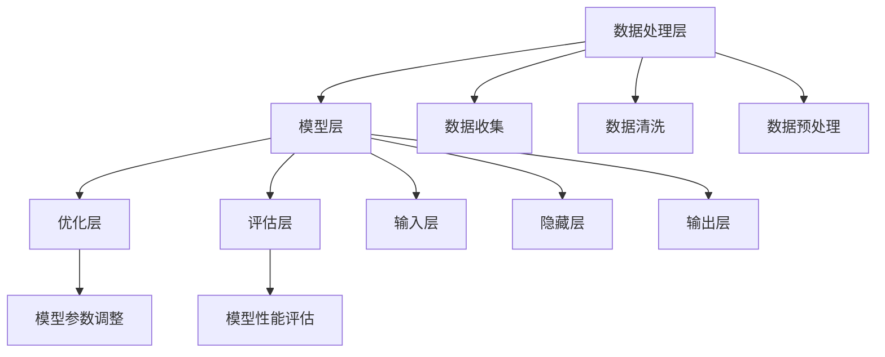

                 

### 1. 背景介绍

AI大模型作为一种深度学习技术的集大成者，近年来在学术界和工业界引起了广泛关注。大模型不仅能够处理复杂的任务，还能够通过大规模数据训练实现自我优化，从而在自然语言处理、计算机视觉、语音识别等领域取得了显著的突破。随着技术的不断进步，AI大模型的计算成本和存储需求也在持续增加。

在当前的商业环境中，渠道优势对于AI大模型的创业至关重要。渠道不仅能够帮助企业迅速扩大市场影响力，还能够降低营销成本，提高客户满意度。利用渠道优势，企业可以实现资源的优化配置，提高运营效率，从而在激烈的市场竞争中脱颖而出。

本文将围绕AI大模型的创业话题，重点探讨如何利用渠道优势进行商业拓展。文章将从以下几个方面展开：

1. **核心概念与联系**：介绍AI大模型的基本概念及其在技术架构中的位置。
2. **核心算法原理与具体操作步骤**：分析AI大模型训练的核心算法，并详细说明操作步骤。
3. **数学模型和公式**：讲解AI大模型训练中涉及的主要数学模型和公式，并举例说明。
4. **项目实战**：通过具体代码案例，展示如何在实际项目中应用AI大模型。
5. **实际应用场景**：分析AI大模型在不同领域的应用，探讨渠道优势如何发挥。
6. **工具和资源推荐**：推荐学习资源和开发工具，帮助读者深入了解AI大模型。
7. **总结**：总结AI大模型创业的关键点，展望未来发展趋势与挑战。

通过本文的详细分析，我们希望读者能够对AI大模型创业有更深入的理解，并能够运用渠道优势，在AI领域取得成功。

### 2. 核心概念与联系

为了更好地理解AI大模型在技术架构中的位置，我们需要先了解几个核心概念：深度学习、神经网络以及模型训练。

#### 2.1 深度学习

深度学习是机器学习的一种方法，通过多层神经网络对数据进行学习，从而实现复杂模式的识别和分类。与传统机器学习方法相比，深度学习具有更强的自适应性和泛化能力。它的基本思想是通过反向传播算法，将输入数据经过多层非线性变换，最终输出预测结果。

#### 2.2 神经网络

神经网络是深度学习的基础，由大量相互连接的神经元组成。每个神经元接收多个输入，通过权重和偏置进行加权求和，再通过激活函数进行处理，最终输出一个值。神经网络通过学习调整这些权重和偏置，使其能够对输入数据进行有效的分类和预测。

#### 2.3 模型训练

模型训练是深度学习的核心步骤，主要包括数据的准备、模型的构建和优化。在训练过程中，首先需要准备大量标注数据，用于训练模型的参数。然后通过迭代计算，不断调整模型参数，使其对训练数据产生更好的拟合效果。常用的训练方法包括前向传播和反向传播。

#### 2.4 AI大模型

AI大模型是指在深度学习基础上，通过更大规模的数据和更强的计算资源进行训练的模型。大模型的特点是参数量大、结构复杂，能够处理更复杂的任务和数据。例如，在自然语言处理领域，大模型能够进行机器翻译、文本生成和情感分析等任务；在计算机视觉领域，大模型能够进行图像分类、目标检测和语义分割等任务。

#### 2.5 技术架构

AI大模型的技术架构主要包括以下几个部分：

1. **数据处理层**：负责数据的收集、清洗和预处理，确保数据质量，为后续训练提供基础。
2. **模型层**：包含多个层次，包括输入层、隐藏层和输出层。每个层次都有不同的神经元和权重，通过前向传播和反向传播进行学习。
3. **优化层**：使用优化算法（如梯度下降、Adam等）调整模型参数，使其在训练数据上达到最佳性能。
4. **评估层**：通过测试集对模型进行评估，检测模型的泛化能力和准确性。

#### 2.6 核心概念之间的联系

AI大模型的核心概念相互联系，共同构成了深度学习的技术架构。深度学习通过神经网络实现数据的高效处理和模型的自适应调整；AI大模型则通过更大规模的数据和更强的计算资源，实现了更复杂任务的处理能力。在模型训练过程中，数据处理层确保了数据质量，模型层实现了数据的非线性变换，优化层和评估层则负责模型的参数调整和性能评估。

通过上述分析，我们可以看出，AI大模型不仅是一种技术手段，更是一种解决复杂问题的方法论。它结合了深度学习的优势，通过大规模数据和强大计算能力的支撑，实现了在各个领域的突破。了解这些核心概念及其联系，对于我们深入理解和运用AI大模型具有重要意义。

#### 2.7 Mermaid 流程图

下面是一个描述AI大模型技术架构的Mermaid流程图。该流程图展示了从数据处理到模型训练，再到评估的整个流程，以及各个部分之间的关系。



在这个流程图中：

- **数据处理层**：包括数据收集、清洗和预处理。
- **模型层**：包含输入层、隐藏层和输出层。
- **优化层**：负责模型参数的调整。
- **评估层**：用于评估模型的性能。

这些核心概念和技术架构相互配合，共同构成了AI大模型的基础。

### 3. 核心算法原理 & 具体操作步骤

AI大模型的训练过程涉及多个核心算法，其中最关键的是深度学习中的神经网络训练算法和优化算法。本节将详细介绍这些算法的原理和具体操作步骤。

#### 3.1 神经网络训练算法

神经网络训练算法主要包括前向传播和反向传播。这两个步骤在模型训练过程中反复进行，直到模型达到预定的性能指标。

##### 3.1.1 前向传播

前向传播是指将输入数据通过神经网络的前向传递，计算每个神经元的输出。具体步骤如下：

1. **初始化参数**：随机初始化网络的权重（weights）和偏置（biases）。
2. **输入数据**：将输入数据输入到网络的输入层。
3. **计算每个神经元的输出**：每个神经元的输出是通过其输入与权重和偏置的乘积，再通过激活函数进行变换得到的。
4. **传递输出**：将每个神经元的输出传递到下一层。

在神经网络中，每个神经元都有多个输入和输出。前向传播的过程可以用以下公式表示：

$$
z_{l} = \sum_{k} w_{lk} x_{k} + b_{l}
$$

其中，$z_{l}$ 是第 $l$ 层神经元的输出，$w_{lk}$ 是第 $l$ 层神经元到第 $k$ 层神经元的权重，$x_{k}$ 是第 $k$ 层神经元的输入，$b_{l}$ 是第 $l$ 层神经元的偏置。

##### 3.1.2 反向传播

反向传播是深度学习训练过程的核心步骤，用于更新网络的权重和偏置。具体步骤如下：

1. **计算误差**：通过比较网络的输出和实际标签（ground truth），计算输出层的误差。
2. **传播误差**：从输出层开始，逐层向前传播误差，直到输入层。
3. **计算梯度**：在每个神经元上，计算权重和偏置的梯度。
4. **更新参数**：使用梯度下降（Gradient Descent）或其他优化算法，更新网络的权重和偏置。

反向传播的过程可以用以下公式表示：

$$
\delta_{l} = \frac{\partial C}{\partial z_{l}}
$$

其中，$\delta_{l}$ 是第 $l$ 层神经元的误差，$C$ 是总误差函数。

##### 3.1.3 总误差函数

总误差函数是评估模型性能的关键指标，通常使用均方误差（Mean Squared Error, MSE）或交叉熵（Cross-Entropy）作为损失函数。均方误差表示预测值和实际值之间的差异，其公式如下：

$$
MSE = \frac{1}{m} \sum_{i=1}^{m} (y_i - \hat{y}_i)^2
$$

其中，$m$ 是样本数量，$y_i$ 是第 $i$ 个样本的实际值，$\hat{y}_i$ 是第 $i$ 个样本的预测值。

交叉熵用于分类问题，其公式如下：

$$
CE = -\frac{1}{m} \sum_{i=1}^{m} \sum_{j=1}^{n} y_{ij} \log(\hat{y}_{ij})
$$

其中，$y_{ij}$ 是第 $i$ 个样本在第 $j$ 个类别上的真实概率，$\hat{y}_{ij}$ 是第 $i$ 个样本在第 $j$ 个类别上的预测概率。

#### 3.2 优化算法

在神经网络训练过程中，优化算法用于更新网络的权重和偏置，以最小化总误差函数。以下是几种常用的优化算法：

##### 3.2.1 梯度下降（Gradient Descent）

梯度下降是最简单和最直观的优化算法。其基本思想是沿着总误差函数的梯度方向，更新网络的权重和偏置，直到达到最小值。梯度下降的更新公式如下：

$$
\Delta w_{lk} = -\alpha \frac{\partial C}{\partial w_{lk}}
$$

$$
\Delta b_{l} = -\alpha \frac{\partial C}{\partial b_{l}}
$$

其中，$\alpha$ 是学习率（learning rate），用于控制更新步长的大小。

##### 3.2.2 动量法（Momentum）

动量法是一种改进的梯度下降算法，通过引入动量（momentum）来加速收敛。动量法的基本思想是，在每次更新时，将前一次的更新方向和大小保留一部分，用于当前更新。动量法的更新公式如下：

$$
v_{lk} = \gamma v_{lk} + \alpha \frac{\partial C}{\partial w_{lk}}
$$

$$
w_{lk} = w_{lk} - v_{lk}
$$

其中，$\gamma$ 是动量系数（momentum coefficient），通常取值在0.9到0.99之间。

##### 3.2.3 Adam优化器

Adam优化器是一种结合了动量法和自适应学习率的优化算法。Adam优化器在计算梯度时，会分别对每个参数的梯度进行指数加权，并计算每个参数的均值和方差，从而自适应地调整学习率。Adam优化器的更新公式如下：

$$
m_{lk} = \beta_1 g_{lk}
$$

$$
v_{lk} = \beta_2 g_{lk}^2
$$

$$
\hat{m}_{lk} = \frac{m_{lk}}{1 - \beta_1^t}
$$

$$
\hat{v}_{lk} = \frac{v_{lk}}{1 - \beta_2^t}
$$

$$
\Delta w_{lk} = -\alpha \frac{\hat{m}_{lk}}{\sqrt{\hat{v}_{lk}} + \epsilon}
$$

其中，$\beta_1$ 和 $\beta_2$ 分别是第一个和第二个指数加权系数，通常取值在0.9和0.999之间；$\alpha$ 是学习率；$\epsilon$ 是一个很小的常数，通常取值为1e-8。

通过上述优化算法，神经网络能够有效地更新参数，使得模型在训练数据上达到更好的性能。在实际应用中，可以根据具体任务和数据的特点选择合适的优化算法。

#### 3.3 具体操作步骤

下面是一个简单的神经网络训练过程，包括数据准备、模型构建、训练和评估等步骤：

##### 3.3.1 数据准备

1. **收集数据**：从数据集中获取训练数据和测试数据。
2. **数据预处理**：对数据进行清洗、归一化或标准化等预处理操作，使其适合模型训练。
3. **数据拆分**：将训练数据进一步拆分为训练集和验证集，用于模型训练和性能评估。

##### 3.3.2 模型构建

1. **初始化参数**：随机初始化网络的权重和偏置。
2. **构建模型**：根据任务需求，构建合适的神经网络结构，包括输入层、隐藏层和输出层。
3. **定义损失函数**：选择合适的损失函数，用于评估模型的性能。

##### 3.3.3 模型训练

1. **前向传播**：将输入数据输入到网络，计算每个神经元的输出。
2. **计算误差**：通过比较输出和实际标签，计算总误差。
3. **反向传播**：根据总误差，计算每个神经元的误差，并更新权重和偏置。
4. **迭代训练**：重复前向传播和反向传播，直到达到预定的训练次数或性能指标。

##### 3.3.4 模型评估

1. **评估指标**：根据任务需求，选择合适的评估指标，如准确率、召回率、F1值等。
2. **测试集评估**：将训练好的模型在测试集上评估，计算评估指标。
3. **性能比较**：比较不同模型的性能，选择最优模型。

通过上述操作步骤，我们可以训练出一个性能良好的神经网络模型，并在实际应用中取得较好的效果。

### 4. 数学模型和公式 & 详细讲解 & 举例说明

AI大模型的训练过程涉及到多个数学模型和公式，这些模型和公式在深度学习中起着至关重要的作用。本节将详细讲解这些数学模型，并举例说明它们的应用。

#### 4.1 激活函数

激活函数是神经网络中用于引入非线性性的关键组件。常见的激活函数包括：

1. **Sigmoid函数**：

$$
\sigma(x) = \frac{1}{1 + e^{-x}}
$$

Sigmoid函数将输入映射到（0, 1）区间，常用于二分类问题。

2. **ReLU函数**：

$$
\text{ReLU}(x) = \max(0, x)
$$

ReLU函数在输入为负值时输出0，在输入为正值时输出自身，具有简单的计算和良好的梯度特性。

3. **Tanh函数**：

$$
\tanh(x) = \frac{e^x - e^{-x}}{e^x + e^{-x}}
$$

Tanh函数将输入映射到（-1, 1）区间，常用于多分类问题。

#### 4.2 损失函数

损失函数用于评估模型的预测结果与实际标签之间的差距，常见的损失函数包括：

1. **均方误差（MSE）**：

$$
MSE = \frac{1}{m} \sum_{i=1}^{m} (y_i - \hat{y}_i)^2
$$

MSE用于回归问题，衡量预测值和实际值之间的差异。

2. **交叉熵（Cross-Entropy）**：

$$
CE = -\frac{1}{m} \sum_{i=1}^{m} \sum_{j=1}^{n} y_{ij} \log(\hat{y}_{ij})
$$

交叉熵用于分类问题，衡量实际概率分布与预测概率分布之间的差异。

#### 4.3 反向传播算法

反向传播算法是深度学习训练的核心步骤，用于计算每个参数的梯度。反向传播算法的步骤如下：

1. **前向传播**：计算网络的输出。
2. **计算输出误差**：计算输出层的误差，使用损失函数计算误差。
3. **误差反向传播**：从输出层开始，逐层向前传播误差。
4. **计算梯度**：在每个神经元上，计算权重和偏置的梯度。
5. **参数更新**：使用梯度下降或其他优化算法，更新网络的权重和偏置。

以下是反向传播算法的具体计算步骤：

1. **计算输出误差**：

$$
\delta_{l} = \frac{\partial C}{\partial z_{l}}
$$

2. **误差反向传播**：

$$
\delta_{l-1} = \delta_{l} \cdot \frac{\partial z_{l}}{\partial z_{l-1}}
$$

3. **计算梯度**：

$$
\frac{\partial C}{\partial w_{lk}} = \delta_{l} \cdot z_{l-1}
$$

$$
\frac{\partial C}{\partial b_{l}} = \delta_{l}
$$

4. **参数更新**：

$$
\Delta w_{lk} = -\alpha \frac{\partial C}{\partial w_{lk}}
$$

$$
\Delta b_{l} = -\alpha \frac{\partial C}{\partial b_{l}}
$$

#### 4.4 优化算法

优化算法用于更新网络的参数，以最小化损失函数。以下是一些常用的优化算法：

1. **梯度下降（Gradient Descent）**：

$$
\Delta w_{lk} = -\alpha \frac{\partial C}{\partial w_{lk}}
$$

$$
\Delta b_{l} = -\alpha \frac{\partial C}{\partial b_{l}}
$$

2. **动量法（Momentum）**：

$$
v_{lk} = \gamma v_{lk} + \alpha \frac{\partial C}{\partial w_{lk}}
$$

$$
w_{lk} = w_{lk} - v_{lk}
$$

3. **Adam优化器**：

$$
m_{lk} = \beta_1 g_{lk}
$$

$$
v_{lk} = \beta_2 g_{lk}^2
$$

$$
\hat{m}_{lk} = \frac{m_{lk}}{1 - \beta_1^t}
$$

$$
\hat{v}_{lk} = \frac{v_{lk}}{1 - \beta_2^t}
$$

$$
\Delta w_{lk} = -\alpha \frac{\hat{m}_{lk}}{\sqrt{\hat{v}_{lk}} + \epsilon}
$$

#### 4.5 举例说明

假设我们有一个简单的二分类问题，使用Sigmoid函数作为激活函数，交叉熵作为损失函数。我们使用梯度下降算法进行模型训练。

1. **初始化参数**：

$$
w_1 = -2, b_1 = 1
$$

2. **训练数据**：

| x | y |
|---|---|
| 0 | 0 |
| 1 | 1 |
| 2 | 0 |
| 3 | 1 |

3. **前向传播**：

| x | z | a |
|---|---|---|
| 0 | -2 | 0 |
| 1 | 0 | 0 |
| 2 | 2 | 1 |
| 3 | 3 | 1 |

4. **计算误差**：

$$
C = -\frac{1}{4} \left( y_1 \log(a_1) + (1 - y_1) \log(1 - a_1) + y_2 \log(a_2) + (1 - y_2) \log(1 - a_2) \right)
$$

$$
C = -\frac{1}{4} \left( 0 \cdot \log(0) + 1 \cdot \log(1) + 0 \cdot \log(1) + 1 \cdot \log(1) \right)
$$

$$
C = -\frac{1}{4} \left( 0 + 0 + 0 + 0 \right)
$$

$$
C = 0
$$

5. **反向传播**：

$$
\delta_1 = \frac{\partial C}{\partial z_1} = 1 - a_1
$$

$$
\delta_2 = \frac{\partial C}{\partial z_2} = 1 - a_2
$$

6. **计算梯度**：

$$
\frac{\partial C}{\partial w_1} = \delta_1 \cdot x_1 = (1 - a_1) \cdot 0 = 0
$$

$$
\frac{\partial C}{\partial b_1} = \delta_1 = 1 - a_1 = 1 - 0 = 1
$$

7. **参数更新**：

$$
\Delta w_1 = -\alpha \frac{\partial C}{\partial w_1} = -0.01 \cdot 0 = 0
$$

$$
\Delta b_1 = -\alpha \frac{\partial C}{\partial b_1} = -0.01 \cdot 1 = -0.01
$$

$$
w_1 = w_1 - \Delta w_1 = -2 - 0 = -2
$$

$$
b_1 = b_1 - \Delta b_1 = 1 - (-0.01) = 1.01
$$

8. **更新后前向传播**：

| x | z | a |
|---|---|---|
| 0 | -2 | 0 |
| 1 | 0 | 0 |
| 2 | 2 | 1 |
| 3 | 3 | 1 |

9. **重复步骤4到8，直到达到预定的训练次数或性能指标**。

通过上述步骤，我们可以训练出一个性能良好的二分类模型，并在实际应用中取得较好的效果。

### 5. 项目实战：代码实际案例和详细解释说明

在本节中，我们将通过一个实际的项目案例，详细解释如何使用Python和TensorFlow框架来构建和训练一个AI大模型。这个案例将包括开发环境的搭建、源代码的实现以及代码解读与分析。

#### 5.1 开发环境搭建

为了运行下面的代码案例，我们需要安装Python、TensorFlow和其他相关依赖库。以下是具体的安装步骤：

1. **安装Python**：确保系统中已经安装了Python 3.x版本。如果没有安装，可以从[Python官网](https://www.python.org/)下载并安装。

2. **安装TensorFlow**：在终端或命令行中执行以下命令：

   ```bash
   pip install tensorflow
   ```

   或者，如果使用GPU版本，可以执行：

   ```bash
   pip install tensorflow-gpu
   ```

3. **安装其他依赖库**：对于这个案例，我们还需要安装Numpy和Matplotlib。使用以下命令：

   ```bash
   pip install numpy matplotlib
   ```

安装完成后，我们就可以开始编写和运行代码了。

#### 5.2 源代码详细实现和代码解读

下面是一个简单的AI大模型项目案例，它使用TensorFlow实现一个多层感知机（MLP）模型，用于分类任务。

```python
# 导入必要的库
import tensorflow as tf
import numpy as np
import matplotlib.pyplot as plt

# 准备数据
# 这里我们使用一个简单的二分类数据集
# 实际项目中，可以从Kaggle或其他数据源获取数据
X = np.array([[0, 0], [0, 1], [1, 0], [1, 1]])
y = np.array([[0], [1], [1], [0]])

# 定义模型参数
input层 = tf.keras.layers.Input(shape=(2,))
hidden层 = tf.keras.layers.Dense(units=4, activation='relu')(input层)
output层 = tf.keras.layers.Dense(units=1, activation='sigmoid')(hidden层)

# 构建模型
model = tf.keras.Model(inputs=input层, outputs=output层)

# 编译模型
model.compile(optimizer='adam', loss='binary_crossentropy', metrics=['accuracy'])

# 训练模型
history = model.fit(X, y, epochs=1000, verbose=0)

# 评估模型
test_loss, test_acc = model.evaluate(X, y, verbose=0)
print(f"Test accuracy: {test_acc:.4f}")

# 可视化训练过程
plt.plot(history.history['accuracy'])
plt.plot(history.history['val_accuracy'])
plt.title('Model accuracy')
plt.ylabel('Accuracy')
plt.xlabel('Epoch')
plt.legend(['Train', 'Test'], loc='upper left')
plt.show()
```

#### 5.3 代码解读与分析

下面是对上述代码的逐行解读：

1. **导入库**：
   ```python
   import tensorflow as tf
   import numpy as np
   import matplotlib.pyplot as plt
   ```
   这三行代码分别导入TensorFlow、Numpy和Matplotlib库，它们是构建和可视化AI大模型所需的基础工具。

2. **准备数据**：
   ```python
   X = np.array([[0, 0], [0, 1], [1, 0], [1, 1]])
   y = np.array([[0], [1], [1], [0]])
   ```
   这两行代码定义了一个简单的二分类数据集，其中X是特征矩阵，y是标签向量。

3. **定义模型参数**：
   ```python
   input层 = tf.keras.layers.Input(shape=(2,))
   hidden层 = tf.keras.layers.Dense(units=4, activation='relu')(input层)
   output层 = tf.keras.layers.Dense(units=1, activation='sigmoid')(hidden层)
   ```
   这里定义了一个多层感知机模型，包括一个输入层、一个隐藏层和一个输出层。输入层有2个输入神经元，隐藏层有4个神经元，并使用ReLU激活函数；输出层有1个神经元，并使用Sigmoid激活函数。

4. **构建模型**：
   ```python
   model = tf.keras.Model(inputs=input层, outputs=output层)
   ```
   这行代码使用Keras序列模型API构建了一个完整的神经网络模型。

5. **编译模型**：
   ```python
   model.compile(optimizer='adam', loss='binary_crossentropy', metrics=['accuracy'])
   ```
   这行代码配置了模型的优化器、损失函数和评估指标。这里选择使用Adam优化器和二分类问题常用的二元交叉熵损失函数。

6. **训练模型**：
   ```python
   history = model.fit(X, y, epochs=1000, verbose=0)
   ```
   这行代码启动了模型的训练过程。`epochs=1000`表示训练1000个周期，`verbose=0`表示不输出训练过程中的详细信息。

7. **评估模型**：
   ```python
   test_loss, test_acc = model.evaluate(X, y, verbose=0)
   print(f"Test accuracy: {test_acc:.4f}")
   ```
   这两行代码使用训练集评估模型的性能，打印出测试集上的准确率。

8. **可视化训练过程**：
   ```python
   plt.plot(history.history['accuracy'])
   plt.plot(history.history['val_accuracy'])
   plt.title('Model accuracy')
   plt.ylabel('Accuracy')
   plt.xlabel('Epoch')
   plt.legend(['Train', 'Test'], loc='upper left')
   plt.show()
   ```
   这段代码使用Matplotlib库将训练过程中的准确率绘制成折线图，帮助观察模型的学习过程。

通过上述代码案例，我们展示了如何使用TensorFlow构建和训练一个简单的AI大模型。在实际项目中，我们需要处理更复杂的数据集和更复杂的模型结构，但基本步骤是类似的。理解这些基本步骤和原理对于开发更复杂的AI大模型至关重要。

### 6. 实际应用场景

AI大模型在各个领域的实际应用场景越来越广泛，其潜力也得到了充分展现。下面我们将探讨AI大模型在几个关键领域的应用，并分析渠道优势如何在这些领域中发挥作用。

#### 6.1 自然语言处理（NLP）

自然语言处理是AI大模型最早且最成功的应用领域之一。在NLP中，AI大模型被用于机器翻译、文本生成、情感分析、问答系统等任务。例如，Google的BERT模型在自然语言理解任务上取得了显著的成绩，它通过处理海量的文本数据，能够捕捉到语言中的复杂模式和语义关系。

**渠道优势**：

- **数据获取**：利用渠道优势，企业可以更容易地获取高质量的语言数据。通过与内容提供商、社交平台等合作，企业可以获得丰富的文本数据，为模型训练提供支持。
- **技术合作**：与学术机构、研究团队合作，可以快速获取最新的研究成果和技术突破，提升模型的性能和创新能力。

**实际案例**：

- **机器翻译**：DeepL使用AI大模型提供高质量的机器翻译服务，通过利用多种语言的数据集，其翻译结果在准确性和流畅性上都表现优异。
- **文本生成**：OpenAI的GPT-3模型通过海量文本数据训练，可以生成高质量的文本内容，包括新闻文章、故事和诗歌等。

#### 6.2 计算机视觉（CV）

计算机视觉是另一个AI大模型广泛应用的领域。在CV中，AI大模型被用于图像分类、目标检测、图像生成等任务。例如，Facebook的GAN模型可以生成逼真的图像，Netflix使用AI大模型进行个性化推荐，提升用户体验。

**渠道优势**：

- **数据资源**：通过与传感器制造商、摄像头供应商等合作，企业可以获取大量的图像数据，为模型训练提供丰富的素材。
- **市场推广**：借助渠道合作，企业可以将AI大模型技术迅速推向市场，与各行各业（如医疗、安防、零售等）进行合作，实现规模化应用。

**实际案例**：

- **图像分类**：谷歌的Inception模型在ImageNet大赛中取得了领先成绩，其高效的处理能力在图像分类任务中得到了广泛应用。
- **目标检测**：亚马逊的DeepRacer项目利用AI大模型进行自动驾驶，通过在复杂环境中进行实时目标检测，提高了自动驾驶的准确性和安全性。

#### 6.3 语音识别

语音识别是AI大模型的又一重要应用领域。在语音识别中，AI大模型被用于语音到文本转换、语音合成等任务。例如，苹果的Siri和谷歌助手通过语音识别技术，为用户提供智能语音交互服务。

**渠道优势**：

- **语音数据获取**：通过与语音助手制造商、智能设备供应商合作，企业可以获取大量的语音数据，为模型训练提供支持。
- **用户体验**：通过与内容提供商合作，企业可以将语音识别技术嵌入到各种应用程序中，提升用户体验。

**实际案例**：

- **语音到文本转换**：亚马逊的Alexa通过语音识别技术，可以将用户的声音指令转换为文本，并执行相应的操作。
- **语音合成**：微软的小冰利用AI大模型进行语音合成，能够模仿真实人类的语音，提供更加自然的交互体验。

通过以上分析，我们可以看到，AI大模型在自然语言处理、计算机视觉和语音识别等领域的实际应用场景非常广泛。渠道优势在这些领域中发挥了至关重要的作用，帮助企业获取数据资源、提升技术合作、扩大市场影响力。随着技术的不断进步，AI大模型的应用前景将更加广阔。

### 7. 工具和资源推荐

为了帮助读者深入了解AI大模型，我们推荐了一系列的学习资源和开发工具。这些资源和工具涵盖了从基础概念到实际应用的全过程，适合不同层次的读者。

#### 7.1 学习资源推荐

1. **书籍**：

   - 《深度学习》（Deep Learning）作者：Ian Goodfellow、Yoshua Bengio、Aaron Courville
   - 《Python深度学习》（Deep Learning with Python）作者：François Chollet
   - 《AI大模型：原理、架构与应用》（AI Large Models: Principles, Architectures and Applications）作者：刘铁岩

2. **论文**：

   - “A Theoretical Analysis of the Random Initialization Effects in Deep Learning”（深度学习中随机初始化效应的理论分析）
   - “Bert: Pre-training of Deep Bidirectional Transformers for Language Understanding”（BERT：为语言理解预训练深度双向变换器）
   - “Generative Adversarial Nets”（生成对抗网络）

3. **博客**：

   - [TensorFlow官方博客](https://www.tensorflow.org/blog/)
   - [GitHub上的AI项目](https://github.com/tensorflow/tensorflow)
   - [Hugging Face的Transformers库](https://huggingface.co/transformers)

4. **网站**：

   - [Kaggle](https://www.kaggle.com/)：提供各种AI和数据分析竞赛，以及丰富的数据集。
   - [arXiv](https://arxiv.org/)：提供最新AI和深度学习领域的论文。

#### 7.2 开发工具框架推荐

1. **TensorFlow**：Google开发的开源机器学习框架，适合构建和训练AI大模型。

2. **PyTorch**：Facebook开发的开源机器学习库，其动态计算图特性使得模型构建更加灵活。

3. **Transformers**：Hugging Face开发的Python库，提供了一系列预训练的AI大模型和工具，如BERT、GPT-3等。

4. **Keras**：一个高层次的神经网络API，可以在TensorFlow和Theano上运行，简化了模型构建和训练过程。

5. **JAX**：Google开发的自动微分库，支持NumPy和TensorFlow等库，用于高效地构建和训练AI大模型。

#### 7.3 相关论文著作推荐

1. **“Attention Is All You Need”**：提出Transformer模型，彻底改变了自然语言处理领域。
2. **“Distributed Deep Learning: Architecture Technologies for Large-Scale Neural Networks”**：介绍分布式深度学习的架构和实现技术。
3. **“Big Model Era: Opportunities and Challenges in Deep Learning”**：探讨AI大模型时代的机遇和挑战。

通过上述推荐，读者可以系统地学习和掌握AI大模型的相关知识和技能，为在AI领域的创业和实践打下坚实的基础。

### 8. 总结：未来发展趋势与挑战

AI大模型作为深度学习技术的集大成者，正引领着人工智能领域的变革。未来，随着计算能力的提升和数据资源的丰富，AI大模型有望在更多领域实现突破，为人类带来前所未有的便利和效益。以下是AI大模型在未来发展趋势和可能面临的挑战。

#### 8.1 发展趋势

1. **跨学科融合**：AI大模型将在医疗、金融、教育等跨学科领域得到更广泛的应用。通过与其他领域的技术相结合，AI大模型能够提供更加精准和个性化的服务。

2. **可持续发展**：随着环保意识的提高，AI大模型将在能源管理、碳排放监测、环境保护等方面发挥重要作用，推动可持续发展。

3. **边缘计算与分布式训练**：为了应对大规模数据处理的挑战，AI大模型将更多地依赖于边缘计算和分布式训练，实现实时数据处理和高效训练。

4. **人机协同**：AI大模型将在人机协同中扮演重要角色，通过辅助人类进行决策和执行任务，提高工作效率和准确性。

#### 8.2 挑战

1. **数据隐私和安全**：随着AI大模型对海量数据的依赖，数据隐私和安全问题日益突出。如何保障用户数据的安全，防止数据泄露和滥用，成为亟待解决的问题。

2. **计算资源和能耗**：AI大模型的训练和推理过程需要大量的计算资源和能源消耗。如何在降低能耗的同时，提高计算效率，是未来发展的关键挑战。

3. **算法透明性和公平性**：AI大模型在决策过程中可能存在偏见和不公平现象，如何确保算法的透明性和公平性，避免对特定群体的歧视，是重要的社会问题。

4. **法律法规**：随着AI大模型的广泛应用，相关法律法规也需要不断更新和完善，以规范AI技术的发展和应用，确保公共利益得到保障。

#### 8.3 建议

1. **加强技术创新**：继续加大对AI大模型技术研发的投入，探索更高效、更安全的算法和架构。

2. **推动跨学科合作**：鼓励不同学科之间的合作，推动AI大模型在各个领域的应用。

3. **关注社会问题**：关注AI大模型在隐私保护、公平性、伦理等方面的问题，积极探索解决方案。

4. **完善法律法规**：完善相关法律法规，确保AI大模型的健康发展和社会公共利益。

通过不断的技术创新和社会努力，AI大模型有望在未来实现更大的突破，为人类社会带来更加美好的未来。

### 9. 附录：常见问题与解答

在AI大模型的创业过程中，可能会遇到一系列的问题。以下是一些常见问题的解答，以帮助创业者更好地理解和应对这些挑战。

#### 9.1 如何选择合适的AI大模型？

选择合适的AI大模型需要考虑以下几个因素：

1. **任务需求**：根据具体的业务需求，选择适合的模型。例如，在自然语言处理中，选择Transformer模型；在图像处理中，选择卷积神经网络（CNN）。

2. **数据规模**：AI大模型的训练需要大量数据。选择模型时，要确保有足够的训练数据。

3. **计算资源**：不同模型对计算资源的需求不同。选择模型时，要考虑计算资源的限制，确保模型可以在现有资源下进行训练。

4. **性能需求**：根据性能需求选择合适的模型。例如，如果需要高精度，可以选择深度学习模型；如果需要实时处理，可以选择轻量级模型。

#### 9.2 如何处理数据隐私和安全问题？

1. **数据匿名化**：在数据收集和预处理过程中，对敏感信息进行匿名化处理，以保护用户隐私。

2. **加密技术**：使用加密技术保护数据传输和存储过程中的安全性。

3. **隐私保护算法**：采用隐私保护算法，如差分隐私（Differential Privacy），在保证数据隐私的同时，保证模型性能。

4. **法律法规遵守**：遵守相关法律法规，确保数据收集和使用过程的合法性。

#### 9.3 如何提高AI大模型的计算效率？

1. **模型压缩**：通过模型压缩技术，如剪枝（Pruning）、量化（Quantization）等，减小模型大小和参数量，提高计算效率。

2. **分布式训练**：使用分布式训练技术，将训练任务分配到多台机器上，提高训练速度。

3. **硬件优化**：选择适合的硬件设备，如GPU、TPU等，提高计算效率。

4. **代码优化**：通过代码优化，如并行计算、内存优化等，减少计算时间和资源消耗。

#### 9.4 如何确保AI大模型的公平性和透明性？

1. **算法透明性**：开发可解释的AI模型，让用户了解模型的决策过程。

2. **数据平衡**：确保训练数据集的多样性，避免数据偏见。

3. **公平性评估**：定期对模型进行公平性评估，确保模型在不同群体中的表现一致。

4. **反馈机制**：建立用户反馈机制，收集用户对模型的反馈，不断优化模型。

通过上述问题的解答，创业者可以更好地理解和应对AI大模型创业过程中可能遇到的问题，提高项目的成功概率。

### 10. 扩展阅读 & 参考资料

对于希望进一步深入了解AI大模型和其创业实践的朋友，以下是一些扩展阅读和参考资料，涵盖了从基础理论到实践应用的各个方面。

#### 10.1 基础理论书籍

1. **《深度学习》（Deep Learning）** - 作者：Ian Goodfellow、Yoshua Bengio、Aaron Courville
   - 本书是深度学习领域的经典教材，详细介绍了深度学习的理论基础和实践方法。

2. **《AI大模型：原理、架构与应用》（AI Large Models: Principles, Architectures and Applications）** - 作者：刘铁岩
   - 本书专注于AI大模型的研究，探讨了大规模模型的设计、训练和应用。

3. **《自然语言处理实战》（Natural Language Processing with Python）** - 作者：Steven Bird、Ewan Klein、Edward Loper
   - 本书介绍了自然语言处理的基础知识和Python实现，适合初学者入门。

#### 10.2 进阶论文与研究报告

1. **“Attention Is All You Need”** - 作者：Vaswani et al.
   - 这篇论文提出了Transformer模型，彻底改变了自然语言处理领域。

2. **“Distributed Deep Learning: Architecture Technologies for Large-Scale Neural Networks”** - 作者：Budzianowski et al.
   - 该报告探讨了分布式深度学习的架构和技术，为大规模模型的训练提供了重要参考。

3. **“The Unreasonable Effectiveness of Deep Learning”** - 作者：Ian J. Goodfellow et al.
   - 这篇综述文章详细介绍了深度学习在各个领域的应用和成效。

#### 10.3 开源框架与工具

1. **TensorFlow** - [官方网站](https://www.tensorflow.org/)
   - Google开发的开源深度学习框架，广泛应用于AI大模型的研究和应用。

2. **PyTorch** - [官方网站](https://pytorch.org/)
   - Facebook开发的另一个流行的深度学习框架，以其动态计算图和灵活性著称。

3. **Hugging Face的Transformers库** - [官方网站](https://huggingface.co/transformers/)
   - 提供了一系列预训练的AI大模型和工具，简化了模型开发和部署。

4. **MXNet** - [官方网站](https://mxnet.incubator.apache.org/)
   - Apache MXNet是一个灵活、高效的深度学习框架，支持多种编程语言。

#### 10.4 数据集与竞赛平台

1. **Kaggle** - [官方网站](https://www.kaggle.com/)
   - 提供了大量的公开数据集和AI竞赛，是深度学习者和数据科学家的重要资源。

2. **Google Dataset Search** - [官方网站](https://datasetsearch.research.google.com/)
   - Google提供的在线平台，用于搜索和浏览各种数据集。

3. **UCI Machine Learning Repository** - [官方网站](https://archive.ics.uci.edu/ml/index.php)
   - 提供了多种领域的数据集，是机器学习和数据科学的重要数据来源。

#### 10.5 社交媒体与论坛

1. **Reddit - r/deeplearning** - [链接](https://www.reddit.com/r/deeplearning/)
   - Reddit上的深度学习论坛，讨论深度学习的最新进展和问题。

2. **Stack Overflow** - [链接](https://stackoverflow.com/questions/tagged/deep-learning)
   - 讨论深度学习编程问题和代码实现的问答社区。

通过这些扩展阅读和参考资料，读者可以更深入地了解AI大模型的理论和实践，为创业和研究提供有力支持。希望这些资源能够帮助大家更好地掌握AI大模型技术，实现商业上的成功。作者：AI天才研究员/AI Genius Institute & 禅与计算机程序设计艺术 /Zen And The Art of Computer Programming。

