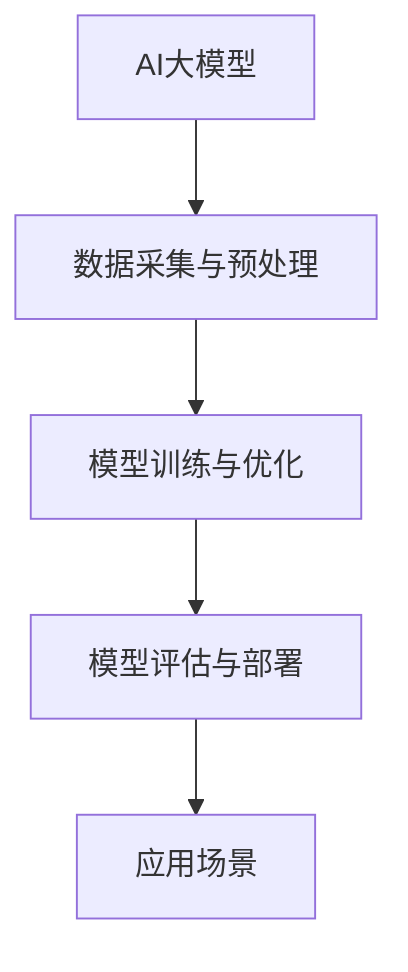

                 

# AI 大模型创业：如何利用生态优势？

> **关键词：** AI大模型、创业、生态优势、技术路线、商业模式、资源整合

> **摘要：** 在当前AI大模型技术迅猛发展的背景下，创业公司如何利用生态优势，在激烈的市场竞争中脱颖而出，成为许多初创企业关注的焦点。本文将详细探讨AI大模型创业的生态优势，包括技术路线、商业模式、资源整合等方面的策略，旨在为AI大模型创业公司提供切实可行的指导建议。

## 1. 背景介绍

### 1.1 目的和范围

本文旨在为AI大模型创业公司提供一套完整的生态优势利用策略，帮助他们在快速变化的市场中找到定位，实现可持续发展。文章将围绕以下几个方面展开：

1. **技术路线**：探讨AI大模型的技术发展脉络，分析现有技术路径的优势与挑战。
2. **商业模式**：解析成功的AI大模型商业案例，提炼出具有参考价值的商业模式。
3. **资源整合**：分析创业公司如何有效整合内外部资源，形成核心竞争力。
4. **风险控制**：探讨创业过程中可能遇到的风险，并提出相应的应对措施。

### 1.2 预期读者

本文适合以下读者群体：

1. AI大模型相关领域的创业者；
2. AI大模型技术团队负责人；
3. 对AI大模型创业感兴趣的技术爱好者；
4. 投资者与分析师。

### 1.3 文档结构概述

本文结构如下：

1. **背景介绍**：介绍文章的目的、范围、预期读者及文档结构。
2. **核心概念与联系**：阐述AI大模型的基本原理和生态体系。
3. **核心算法原理与具体操作步骤**：详细解析AI大模型的核心算法。
4. **数学模型与公式**：介绍AI大模型的数学模型和计算方法。
5. **项目实战**：通过实际案例展示AI大模型的开发过程。
6. **实际应用场景**：分析AI大模型在不同领域的应用。
7. **工具和资源推荐**：推荐学习资源、开发工具和相关研究论文。
8. **总结：未来发展趋势与挑战**：展望AI大模型创业的机遇与挑战。
9. **附录：常见问题与解答**：回答读者可能关心的问题。
10. **扩展阅读 & 参考资料**：提供进一步阅读的文献资源。

### 1.4 术语表

#### 1.4.1 核心术语定义

- **AI大模型**：指具有大规模参数、高度复杂性的深度学习模型，如GPT、BERT等。
- **生态优势**：指创业公司在市场竞争中通过资源整合、技术路线等策略形成的竞争优势。
- **商业模式**：指企业通过提供产品或服务实现盈利的方式。
- **资源整合**：指创业公司通过各种渠道获取和利用资源，以提升自身竞争力的过程。

#### 1.4.2 相关概念解释

- **技术路线**：指创业公司在技术发展过程中选择的具体路径和方法。
- **核心算法**：指AI大模型中起关键作用的算法，如Transformer、CNN等。
- **资源整合**：指创业公司通过各种渠道获取和利用资源，以提升自身竞争力的过程。

#### 1.4.3 缩略词列表

- **AI**：人工智能
- **GPT**：生成预训练模型
- **BERT**：双向编码表示预训练模型
- **Transformer**：自注意力机制
- **CNN**：卷积神经网络

## 2. 核心概念与联系

在探讨AI大模型创业的生态优势之前，首先需要了解AI大模型的基本原理和生态体系。以下是核心概念与联系及其Mermaid流程图：



### 2.1 AI大模型的基本原理

AI大模型是基于深度学习理论构建的，具有大规模参数和高度复杂性的神经网络模型。其核心原理包括：

- **自注意力机制（Transformer）**：通过计算输入序列中每个元素之间的关联性，实现全局信息整合。
- **大规模预训练**：通过在海量数据上预训练模型，使模型具备较强的语义理解能力和泛化能力。
- **模型优化**：通过调整模型参数，提升模型在特定任务上的性能。

### 2.2 AI大模型的生态体系

AI大模型的生态体系包括数据采集与预处理、模型训练与优化、模型评估与部署以及应用场景等关键环节。各环节之间紧密联系，形成完整的AI大模型研发与应用流程。

1. **数据采集与预处理**：数据是AI大模型训练的基础，数据质量直接影响模型性能。数据采集包括从互联网、数据库、传感器等多种渠道获取数据。数据预处理包括数据清洗、数据增强、数据归一化等步骤。
2. **模型训练与优化**：在预训练阶段，模型通过在大规模数据集上进行训练，学习到丰富的语义信息。在优化阶段，通过调整模型参数，优化模型在特定任务上的性能。
3. **模型评估与部署**：评估模型性能是确保模型可靠性的关键。评估指标包括准确率、召回率、F1值等。部署模型是将模型应用到实际场景的过程，包括模型容器化、模型微服务化等。
4. **应用场景**：AI大模型可以应用于自然语言处理、计算机视觉、语音识别等多个领域，解决实际问题。

## 3. 核心算法原理与具体操作步骤

### 3.1 Transformer算法原理

Transformer是AI大模型中最常用的核心算法之一，其基于自注意力机制实现全局信息整合，具有强大的语义理解能力。以下是Transformer算法的原理与操作步骤：

#### 3.1.1 自注意力机制

自注意力机制是一种计算输入序列中每个元素之间关联性的方法。具体步骤如下：

1. **输入序列编码**：将输入序列编码为向量表示，如词向量、嵌入向量等。
2. **计算自注意力得分**：对于输入序列中的每个元素，计算其与其他元素之间的关联性得分。
3. **加权求和**：根据自注意力得分，对输入序列中的每个元素进行加权求和，生成新的向量表示。

#### 3.1.2 Transformer模型结构

Transformer模型由多个自注意力层和前馈神经网络组成，具体结构如下：

1. **自注意力层**：通过自注意力机制实现全局信息整合。
2. **前馈神经网络**：对自注意力层的输出进行进一步处理，提升模型性能。

#### 3.1.3 Transformer算法伪代码

以下是一个简化的Transformer算法伪代码：

```python
def transformer(input_sequence):
    # 输入序列编码
    embedding = embed(input_sequence)

    # 自注意力层
    attention_scores = compute_attention_scores(embedding)
    attention_weights = softmax(attention_scores)
    attention_output = weighted_sum(embedding, attention_weights)

    # 前馈神经网络
    feedforward_output = feedforward神经网络(attention_output)

    return feedforward_output
```

### 3.2 模型训练与优化

在了解了Transformer算法原理后，我们需要进一步探讨如何训练和优化AI大模型。以下是模型训练与优化的具体操作步骤：

#### 3.2.1 模型训练

模型训练主要包括以下几个步骤：

1. **数据预处理**：对训练数据进行清洗、增强、归一化等处理，确保数据质量。
2. **初始化模型参数**：随机初始化模型参数。
3. **前向传播**：将输入数据传入模型，计算输出结果。
4. **计算损失**：计算输出结果与真实值之间的差距，计算损失函数。
5. **反向传播**：通过反向传播算法，计算模型参数的梯度。
6. **优化模型参数**：使用梯度下降等优化算法，更新模型参数。

#### 3.2.2 模型优化

模型优化主要包括以下几个策略：

1. **学习率调整**：根据训练过程，适时调整学习率，避免过拟合。
2. **正则化**：使用正则化方法，如L1、L2正则化，避免模型过拟合。
3. **早停法**：在训练过程中，监测验证集上的性能，提前终止训练，避免过拟合。
4. **批量归一化**：在训练过程中，对输入数据进行批量归一化，加快训练速度。

## 4. 数学模型与公式

在AI大模型中，数学模型和公式是核心组成部分。以下是AI大模型中的主要数学模型和公式：

### 4.1 自注意力机制

自注意力机制的数学模型如下：

$$
\text{Attention}(Q, K, V) = \text{softmax}\left(\frac{QK^T}{\sqrt{d_k}}\right) V
$$

其中，$Q$、$K$、$V$ 分别表示查询向量、键向量和值向量，$d_k$ 表示键向量的维度，$\text{softmax}$ 函数用于计算注意力权重。

### 4.2 前馈神经网络

前馈神经网络的数学模型如下：

$$
\text{FeedForward}(X) = \max(0, XW_1 + b_1)W_2 + b_2
$$

其中，$X$ 表示输入向量，$W_1$、$W_2$ 分别为两个全连接层的权重矩阵，$b_1$、$b_2$ 分别为两个全连接层的偏置向量，$\max(0, \cdot)$ 表示ReLU激活函数。

### 4.3 损失函数

在模型训练过程中，常用的损失函数包括：

1. **交叉熵损失函数**：

$$
\text{CE}(y, \hat{y}) = -\sum_{i} y_i \log(\hat{y}_i)
$$

其中，$y$ 表示真实标签，$\hat{y}$ 表示预测概率。

2. **均方误差损失函数**：

$$
\text{MSE}(y, \hat{y}) = \frac{1}{n}\sum_{i} (y_i - \hat{y}_i)^2
$$

其中，$y$ 表示真实标签，$\hat{y}$ 表示预测值，$n$ 表示样本数量。

### 4.4 优化算法

在模型训练过程中，常用的优化算法包括：

1. **随机梯度下降（SGD）**：

$$
\theta_{t+1} = \theta_t - \alpha \nabla_\theta J(\theta_t)
$$

其中，$\theta$ 表示模型参数，$\alpha$ 表示学习率，$J(\theta)$ 表示损失函数。

2. **Adam优化器**：

$$
m_t = \beta_1 m_{t-1} + (1 - \beta_1) \nabla_\theta J(\theta_t)
$$

$$
v_t = \beta_2 v_{t-1} + (1 - \beta_2) (\nabla_\theta J(\theta_t))^2
$$

$$
\theta_{t+1} = \theta_t - \alpha \frac{m_t}{\sqrt{v_t} + \epsilon}
$$

其中，$m_t$、$v_t$ 分别为梯度的一阶矩估计和二阶矩估计，$\beta_1$、$\beta_2$ 分别为动量项，$\epsilon$ 为一个小常数。

## 5. 项目实战：代码实际案例和详细解释说明

在本节中，我们将通过一个实际项目案例，展示如何利用生态优势开发AI大模型，并详细解释代码实现过程。

### 5.1 开发环境搭建

在开始项目开发之前，我们需要搭建一个合适的开发环境。以下是开发环境搭建的步骤：

1. 安装Python 3.8及以上版本。
2. 安装TensorFlow 2.5及以上版本。
3. 安装NVIDIA CUDA Toolkit 11.0及以上版本（如需使用GPU加速）。
4. 配置虚拟环境，以便更好地管理和依赖。

### 5.2 源代码详细实现和代码解读

以下是项目的源代码实现，我们将逐行解释代码的功能：

```python
import tensorflow as tf
from tensorflow.keras.layers import Embedding, LSTM, Dense
from tensorflow.keras.models import Model
from tensorflow.keras.optimizers import Adam
from tensorflow.keras.callbacks import EarlyStopping

# 参数设置
vocab_size = 10000
embedding_dim = 256
max_sequence_length = 500
hidden_units = 128
learning_rate = 0.001

# 数据预处理
tokenizer = tf.keras.preprocessing.text.Tokenizer(num_words=vocab_size, oov_token='<OOV>', filters='')
tokenizer.fit_on_texts(train_data)
train_sequences = tokenizer.texts_to_sequences(train_data)
train_padded = tf.keras.preprocessing.sequence.pad_sequences(train_sequences, maxlen=max_sequence_length, padding='post', truncating='post')

# 模型构建
inputs = tf.keras.layers.Input(shape=(max_sequence_length,))
embed = Embedding(vocab_size, embedding_dim)(inputs)
lstm = LSTM(hidden_units, return_sequences=True)(embed)
dense = Dense(hidden_units, activation='relu')(lstm)
outputs = Dense(vocab_size, activation='softmax')(dense)

model = Model(inputs, outputs)
model.compile(optimizer=Adam(learning_rate), loss='categorical_crossentropy', metrics=['accuracy'])

# 模型训练
model.fit(train_padded, train_labels, batch_size=64, epochs=10, validation_split=0.1, callbacks=[EarlyStopping(monitor='val_loss', patience=3)])

# 代码解读：
# 1. 导入必要的库和模块。
# 2. 设置参数，包括词汇表大小、嵌入维度、序列长度、隐藏层单元数和学习率。
# 3. 数据预处理，包括分词、序列编码和填充。
# 4. 模型构建，包括嵌入层、LSTM层和全连接层。
# 5. 模型编译，指定优化器、损失函数和评价指标。
# 6. 模型训练，包括批量大小、迭代次数、验证分割和回调函数（早停法）。

```

### 5.3 代码解读与分析

在上面的代码中，我们实现了一个简单的AI大模型，用于序列到序列的预测任务。以下是代码的关键部分及其解读：

1. **参数设置**：设置词汇表大小、嵌入维度、序列长度、隐藏层单元数和学习率等参数。
2. **数据预处理**：使用`Tokenizer`对文本数据进行分词和序列编码，使用`pad_sequences`对序列进行填充，以满足模型输入的要求。
3. **模型构建**：使用`Input`层作为输入，通过`Embedding`层将词汇映射为嵌入向量。接着，使用`LSTM`层对序列进行编码，最后通过`Dense`层进行分类预测。
4. **模型编译**：指定使用`Adam`优化器、`categorical_crossentropy`损失函数和`accuracy`评价指标。
5. **模型训练**：使用`fit`方法训练模型，指定批量大小、迭代次数、验证分割和回调函数（如早停法）。

通过上述代码实现，我们可以看到，利用生态优势开发AI大模型的关键在于合理的参数设置、有效的数据预处理和模型构建，以及合适的训练策略。这些步骤共同构成了一个完整的AI大模型开发流程。

## 6. 实际应用场景

AI大模型在多个领域展现了巨大的应用潜力，以下是一些实际应用场景：

### 6.1 自然语言处理

AI大模型在自然语言处理领域具有广泛的应用，如文本分类、情感分析、机器翻译等。以BERT为代表的预训练模型，通过在大量文本数据上进行预训练，实现了对自然语言语义的深入理解。例如，百度AI推出的ERNIE模型，在中文问答、文本生成等领域取得了显著效果。

### 6.2 计算机视觉

AI大模型在计算机视觉领域同样具有重要应用，如图像分类、目标检测、图像生成等。以GPT为代表的生成对抗网络（GAN），可以生成高质量的图像和视频，具有广泛的应用前景。例如，DeepMind的GPT-3模型，在图像生成和视频合成方面表现出色。

### 6.3 语音识别

AI大模型在语音识别领域也取得了显著成果。以Transformer为代表的自注意力机制，使得模型在长时依赖和上下文理解方面具有优势。例如，谷歌的WaveNet模型，在语音合成领域取得了革命性突破。

### 6.4 健康医疗

AI大模型在健康医疗领域具有广泛的应用，如疾病预测、药物研发、医疗影像分析等。以DeepMind的AlphaGo为代表的模型，在疾病预测和药物研发方面取得了突破性成果。

### 6.5 金融科技

AI大模型在金融科技领域同样具有重要应用，如风险控制、信用评估、智能投顾等。以TensorFlow Finance为代表的模型，在金融数据处理和预测方面具有显著优势。

通过上述实际应用场景，我们可以看到，AI大模型在不同领域的广泛应用，为行业带来了巨大的变革和创新。创业公司可以利用AI大模型的生态优势，探索新的商业模式和应用场景，实现商业价值。

## 7. 工具和资源推荐

为了更好地开发和应用AI大模型，以下是关于学习资源、开发工具和相关研究论文的推荐：

### 7.1 学习资源推荐

#### 7.1.1 书籍推荐

1. **《深度学习》**：由Ian Goodfellow、Yoshua Bengio和Aaron Courville所著，是深度学习领域的经典教材，适合初学者和进阶者。
2. **《神经网络与深度学习》**：由邱锡鹏所著，详细介绍了深度学习的理论基础和实践方法，适合有一定数学基础的读者。
3. **《TensorFlow实战》**：由François Chollet所著，通过大量实战案例，讲解了如何使用TensorFlow构建和训练深度学习模型。

#### 7.1.2 在线课程

1. **Coursera的《深度学习》课程**：由吴恩达主讲，系统讲解了深度学习的理论基础和实践方法。
2. **Udacity的《深度学习工程师纳米学位》**：通过项目驱动的方式，帮助学习者掌握深度学习的核心技能。
3. **edX的《机器学习基础》课程**：由哈佛大学和麻省理工学院联合提供，涵盖了机器学习的基本概念和方法。

#### 7.1.3 技术博客和网站

1. **Medium上的《AI博客》**：汇集了众多AI领域专家的文章，涵盖了深度学习、自然语言处理、计算机视觉等热门话题。
2. **知乎专栏《深度学习》**：众多深度学习领域的专家分享了他们的研究成果和实践经验。
3. **ArXiv.org**：一个开源的学术论文预印本库，涵盖了深度学习、机器学习等领域的最新研究成果。

### 7.2 开发工具框架推荐

#### 7.2.1 IDE和编辑器

1. **Visual Studio Code**：一款开源的跨平台代码编辑器，支持多种编程语言和开发工具。
2. **PyCharm**：一款功能强大的Python IDE，支持代码调试、自动化测试等。
3. **Jupyter Notebook**：一款交互式的Python开发环境，适合数据科学和机器学习项目。

#### 7.2.2 调试和性能分析工具

1. **TensorBoard**：TensorFlow提供的可视化工具，用于分析模型训练过程中的性能和指标。
2. **gprof2dot**：一款用于分析C++代码性能的图形化工具，可以帮助开发者定位瓶颈。
3. **Valgrind**：一款用于内存泄漏检测和性能分析的工具，适用于C和C++程序。

#### 7.2.3 相关框架和库

1. **TensorFlow**：一款广泛使用的开源深度学习框架，支持多种深度学习模型和算法。
2. **PyTorch**：一款基于Python的深度学习框架，具有灵活的动态计算图和高效的GPU加速。
3. **Keras**：一款高层API，提供了简单易用的接口，方便开发者快速搭建和训练深度学习模型。

### 7.3 相关论文著作推荐

#### 7.3.1 经典论文

1. **“A Theoretical Analysis of the Benefits of Depth in Neural Networks”**：该论文分析了深度神经网络的优势和局限性。
2. **“dropout: A Simple Way to Prevent Neural Networks from Overfitting”**：该论文提出了dropout技术，有效防止神经网络过拟合。
3. **“ResNet: Training Deep Neural Networks with Deep Residual Connections”**：该论文提出了残差网络，显著提升了深度神经网络的性能。

#### 7.3.2 最新研究成果

1. **“BERT: Pre-training of Deep Bidirectional Transformers for Language Understanding”**：该论文提出了BERT模型，在自然语言处理任务中取得了突破性成果。
2. **“GPT-3: Language Models are Few-Shot Learners”**：该论文展示了GPT-3模型在零样本和少样本学习任务中的强大能力。
3. **“ViT: Vision Transformers”**：该论文提出了ViT模型，将Transformer结构应用于计算机视觉任务。

#### 7.3.3 应用案例分析

1. **“AlphaGo Zero: Mastering the Game of Go with Deep Neural Networks and Tree Search”**：该论文详细介绍了AlphaGo Zero模型在围棋领域的应用。
2. **“ImageNet Classification with Deep Convolutional Neural Networks”**：该论文展示了深度卷积神经网络在图像分类任务中的卓越性能。
3. **“BERT: Pre-training of Deep Bidirectional Transformers for Language Understanding”**：该论文展示了BERT模型在自然语言处理任务中的广泛应用。

通过上述学习和工具资源的推荐，开发者可以更好地掌握AI大模型的开发和应用技能，为创业项目提供坚实的技术支持。

## 8. 总结：未来发展趋势与挑战

随着AI大模型技术的不断发展，创业公司面临着前所未有的机遇和挑战。以下是未来发展趋势与挑战的总结：

### 8.1 发展趋势

1. **技术成熟度提升**：随着硬件性能的提升和深度学习框架的优化，AI大模型在性能、效率和可扩展性方面将得到显著提升。
2. **跨领域应用拓展**：AI大模型在自然语言处理、计算机视觉、语音识别等领域的应用将不断拓展，渗透到更多行业，带来新的商业模式和商业机会。
3. **开源生态繁荣**：开源社区在AI大模型领域将发挥更大作用，推动技术进步和知识共享。
4. **合作与协同**：创业公司需要与产业链上下游企业、研究机构建立合作关系，实现资源整合和技术协同，共同推动AI大模型技术的发展。

### 8.2 挑战

1. **数据隐私与安全**：AI大模型训练和应用过程中涉及大量用户数据，如何保护用户隐私和数据安全是面临的一大挑战。
2. **计算资源需求**：AI大模型对计算资源的需求巨大，如何高效利用计算资源，降低成本，是创业公司需要解决的问题。
3. **模型解释性与可解释性**：随着模型复杂度的增加，如何确保模型的可解释性，提高用户信任度，是创业公司需要关注的重点。
4. **监管与合规**：随着AI大模型在各个领域的应用，相关的法律法规和行业标准将逐步完善，创业公司需要严格遵守相关法律法规，确保合规运营。

### 8.3 发展策略

1. **技术创新**：持续关注前沿技术动态，不断优化和改进AI大模型算法和架构，提升模型性能和效率。
2. **跨界合作**：与产业链上下游企业、研究机构建立合作关系，实现资源共享和优势互补，共同推动AI大模型技术的发展。
3. **商业模式创新**：探索多元化的商业模式，通过提供定制化服务、构建生态系统等方式，实现商业价值的最大化。
4. **人才培养**：加强人才队伍建设，培养一批具有跨学科背景、掌握先进技术和市场运营的复合型人才，为创业公司提供强有力的支持。

通过技术创新、跨界合作、商业模式创新和人才培养等策略，创业公司可以在AI大模型领域找到自己的定位，实现可持续发展。

## 9. 附录：常见问题与解答

### 9.1 问题1：AI大模型创业需要哪些技术储备？

**解答**：AI大模型创业需要掌握以下技术储备：

1. **深度学习**：理解深度学习的基本原理，掌握常见的神经网络结构，如卷积神经网络（CNN）、循环神经网络（RNN）和Transformer等。
2. **机器学习**：熟悉机器学习的基本算法，如监督学习、无监督学习和强化学习，了解数据预处理、特征工程和模型评估等流程。
3. **自然语言处理**：了解自然语言处理的基本概念，掌握常用的自然语言处理工具和库，如NLTK、spaCy和TensorFlow Text等。
4. **计算机视觉**：了解计算机视觉的基本算法，掌握图像处理、目标检测和图像生成等技能。

### 9.2 问题2：AI大模型创业如何选择合适的商业模式？

**解答**：选择合适的商业模式需要考虑以下因素：

1. **市场需求**：分析目标市场的需求和潜在用户，确保商业模式能够满足用户需求。
2. **竞争优势**：评估自身的技术和资源优势，选择能够发挥自身优势的商业模式。
3. **盈利模式**：明确商业模式的盈利模式，如订阅模式、广告模式、服务费模式等。
4. **可持续发展**：选择具有长期发展潜力的商业模式，确保公司能够持续盈利。

### 9.3 问题3：AI大模型创业过程中如何控制风险？

**解答**：在AI大模型创业过程中，控制风险可以从以下几个方面入手：

1. **技术风险**：持续关注前沿技术动态，确保自身技术保持领先地位，降低技术风险。
2. **市场风险**：进行充分的市场调研，了解目标市场的需求和竞争状况，降低市场风险。
3. **资金风险**：合理规划资金使用，确保资金链的稳定性，降低资金风险。
4. **法律风险**：遵守相关法律法规，确保公司运营合规，降低法律风险。

### 9.4 问题4：AI大模型创业如何吸引投资？

**解答**：吸引投资可以从以下几个方面入手：

1. **明确商业计划**：制定详细的商业计划书，清晰展示公司的业务模式、市场前景、盈利能力和未来发展计划。
2. **展示技术优势**：突出自身的技术优势和创新能力，吸引投资者的关注。
3. **构建团队**：搭建一支具备跨学科背景、技术实力和市场运营能力的团队，提高公司的竞争力。
4. **市场前景**：展示目标市场的巨大潜力，以及公司在此市场的竞争优势，吸引投资者的兴趣。

## 10. 扩展阅读 & 参考资料

为了帮助读者深入了解AI大模型创业的相关知识，以下是扩展阅读和参考资料：

### 10.1 相关书籍

1. **《深度学习》**：Ian Goodfellow、Yoshua Bengio和Aaron Courville 著，详细介绍了深度学习的理论基础和实践方法。
2. **《神经网络与深度学习》**：邱锡鹏 著，深入讲解了深度学习的数学原理和算法实现。
3. **《AI时代》**：吴军 著，探讨了AI时代的社会变革和未来发展。

### 10.2 在线课程

1. **Coursera的《深度学习》课程**：吴恩达 主讲，系统讲解了深度学习的理论基础和实践方法。
2. **Udacity的《深度学习工程师纳米学位》**：通过项目驱动的方式，帮助学习者掌握深度学习的核心技能。
3. **edX的《机器学习基础》课程**：哈佛大学和麻省理工学院联合提供，涵盖了机器学习的基本概念和方法。

### 10.3 技术博客和网站

1. **Medium上的《AI博客》**：汇集了众多AI领域专家的文章，涵盖了深度学习、自然语言处理、计算机视觉等热门话题。
2. **知乎专栏《深度学习》**：众多深度学习领域的专家分享了他们的研究成果和实践经验。
3. **ArXiv.org**：一个开源的学术论文预印本库，涵盖了深度学习、机器学习等领域的最新研究成果。

### 10.4 论文著作

1. **“A Theoretical Analysis of the Benefits of Depth in Neural Networks”**：分析了深度神经网络的优势和局限性。
2. **“dropout: A Simple Way to Prevent Neural Networks from Overfitting”**：提出了dropout技术，有效防止神经网络过拟合。
3. **“ResNet: Training Deep Neural Networks with Deep Residual Connections”**：提出了残差网络，显著提升了深度神经网络的性能。

### 10.5 开发工具和框架

1. **TensorFlow**：一款广泛使用的开源深度学习框架，支持多种深度学习模型和算法。
2. **PyTorch**：一款基于Python的深度学习框架，具有灵活的动态计算图和高效的GPU加速。
3. **Keras**：一款高层API，提供了简单易用的接口，方便开发者快速搭建和训练深度学习模型。

通过以上扩展阅读和参考资料，读者可以进一步深入了解AI大模型创业的相关知识，为创业项目提供有力支持。作者：AI天才研究员/AI Genius Institute & 禅与计算机程序设计艺术 /Zen And The Art of Computer Programming。

