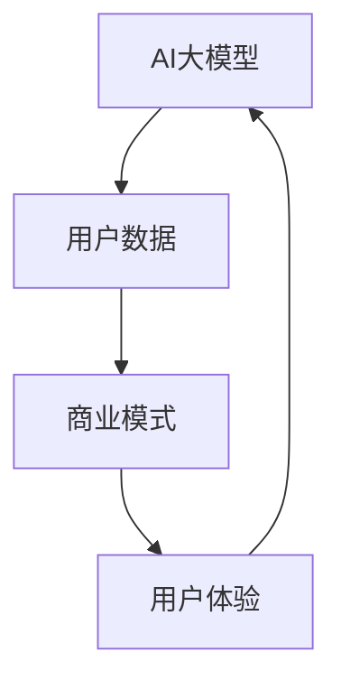

                 

# AI 大模型创业：如何利用用户优势？

> 关键词：AI 大模型、用户优势、创业、数据分析、商业模式、技术架构

> 摘要：本文将深入探讨如何利用用户优势，通过AI大模型创业。我们将分析用户数据的价值、创业策略的制定、技术架构的选择，以及如何通过用户体验和数据反馈持续优化模型。文章旨在为创业者提供系统性指导，帮助他们在竞争激烈的市场中脱颖而出。

## 1. 背景介绍

### 1.1 目的和范围

本文旨在为那些希望在人工智能（AI）领域创业的人提供指导，特别是关注如何利用用户优势构建成功的AI大模型创业项目。我们将探讨以下几个核心问题：

- 用户数据的价值如何体现在AI大模型创业中？
- 如何通过用户优势制定有效的创业策略？
- 技术架构在AI大模型创业中扮演何种角色？
- 如何通过用户体验和数据反馈持续改进模型？

### 1.2 预期读者

本文适合以下读者：

- 想在AI领域创业的技术人员
- 对AI和创业有兴趣的创业者
- 对AI大模型和数据分析有深入了解的专业人士

### 1.3 文档结构概述

本文将分为以下几个部分：

- 引言：介绍AI大模型创业的重要性
- 用户优势分析：探讨用户数据的价值和如何利用
- 创业策略制定：分析市场机会、用户需求和技术可行性
- 技术架构选择：介绍AI大模型的技术架构和工具
- 持续优化：讨论如何通过用户体验和数据反馈优化模型
- 实战案例：分享成功案例和经验教训
- 工具和资源推荐：提供学习资源、开发工具和文献参考
- 总结：展望AI大模型创业的未来趋势和挑战
- 附录：常见问题与解答
- 扩展阅读：推荐进一步学习的资源

### 1.4 术语表

#### 1.4.1 核心术语定义

- AI大模型：指参数规模达到亿级别甚至千亿级别的深度学习模型。
- 用户优势：指用户在AI大模型创业中的独特价值和贡献。
- 数据分析：指对用户数据的收集、处理、分析和解释的过程。
- 商业模式：指企业如何通过提供产品或服务来创造价值、获取收入和利润的商业模式。
- 技术架构：指支持AI大模型运行和部署的软件和硬件结构。

#### 1.4.2 相关概念解释

- 用户体验（UX）：指用户在使用产品或服务过程中感受到的整体体验。
- 数据反馈：指用户在使用产品或服务时产生的数据，用于模型优化和产品改进。
- 机器学习（ML）：指让计算机从数据中学习规律并做出决策的过程。

#### 1.4.3 缩略词列表

- AI：人工智能
- ML：机器学习
- NLP：自然语言处理
- CV：计算机视觉
- API：应用程序编程接口

## 2. 核心概念与联系

在AI大模型创业中，核心概念包括AI大模型、用户数据和商业模式。以下是这些概念之间的联系和相互作用的Mermaid流程图：



- **AI大模型**：通过大规模参数和深度学习算法，从用户数据中学习，以提供精确的预测和决策支持。
- **用户数据**：用户的行为数据、偏好数据和反馈数据是AI大模型的基础。
- **商业模式**：基于用户数据创造价值，通过提供产品或服务实现收入和利润。
- **用户体验**：用户在使用产品或服务时的感受，影响用户满意度和忠诚度，进而影响商业模式。

## 3. 核心算法原理 & 具体操作步骤

AI大模型的构建主要依赖于深度学习和大规模数据处理。以下是构建AI大模型的核心算法原理和具体操作步骤，采用伪代码进行详细阐述：

### 3.1 数据收集与预处理

```python
# 数据收集
data = collect_data()

# 数据清洗
cleaned_data = clean_data(data)

# 数据转换
transformed_data = transform_data(cleaned_data)
```

### 3.2 特征工程

```python
# 特征选择
selected_features = select_features(transformed_data)

# 特征标准化
normalized_features = normalize_features(selected_features)
```

### 3.3 模型构建

```python
# 模型初始化
model = initialize_model()

# 模型训练
model = train_model(model, normalized_features)

# 模型评估
evaluate_model(model, normalized_features)
```

### 3.4 模型优化

```python
# 超参数调优
optimized_model = tune_hyperparameters(model)

# 模型集成
ensemble_model = ensemble_models([model, optimized_model])
```

### 3.5 模型部署

```python
# 部署模型
deploy_model(ensemble_model)

# 接收用户输入
user_input = get_user_input()

# 模型预测
prediction = predict(ensemble_model, user_input)
```

## 4. 数学模型和公式 & 详细讲解 & 举例说明

在AI大模型中，核心的数学模型包括损失函数、优化算法和正则化方法。以下是这些数学模型的详细讲解和举例说明，使用LaTeX格式书写。

### 4.1 损失函数

损失函数用于衡量模型预测值与真实值之间的差距，最常用的损失函数是均方误差（MSE）：

$$
MSE = \frac{1}{n}\sum_{i=1}^{n}(y_i - \hat{y}_i)^2
$$

其中，$y_i$是真实值，$\hat{y}_i$是模型预测值，$n$是样本数量。

### 4.2 优化算法

优化算法用于调整模型参数，以最小化损失函数。常用的优化算法包括梯度下降（Gradient Descent）：

$$
\theta = \theta - \alpha \nabla_\theta J(\theta)
$$

其中，$\theta$是模型参数，$\alpha$是学习率，$J(\theta)$是损失函数。

### 4.3 正则化方法

正则化方法用于防止模型过拟合，常用的正则化方法包括L2正则化：

$$
J(\theta) = \frac{1}{2} \sum_{i=1}^{n} (y_i - \hat{y}_i)^2 + \lambda \sum_{j=1}^{m} \theta_j^2
$$

其中，$\lambda$是正则化参数，$m$是参数数量。

### 4.4 举例说明

假设我们有一个回归问题，需要预测房价。我们使用MSE作为损失函数，梯度下降作为优化算法，L2正则化防止过拟合。

```latex
\begin{aligned}
J(\theta) &= \frac{1}{2} \sum_{i=1}^{n} (y_i - \theta_0 - \theta_1 x_{i1} - \theta_2 x_{i2})^2 + \lambda (\theta_0^2 + \theta_1^2 + \theta_2^2) \\
\theta &= \theta - \alpha \left( \frac{1}{n} \sum_{i=1}^{n} (y_i - \theta_0 - \theta_1 x_{i1} - \theta_2 x_{i2}) + \lambda \theta \right)
\end{aligned}
```

## 5. 项目实战：代码实际案例和详细解释说明

### 5.1 开发环境搭建

为了构建AI大模型，我们需要搭建一个合适的开发环境。以下是搭建环境的具体步骤：

1. 安装Python 3.8及以上版本。
2. 安装必要的库，如TensorFlow、NumPy、Pandas等。
3. 安装Jupyter Notebook，用于编写和运行代码。

### 5.2 源代码详细实现和代码解读

以下是构建一个简单的线性回归模型的代码，该模型用于预测房价。

```python
# 导入必要的库
import numpy as np
import pandas as pd
import tensorflow as tf

# 数据收集
data = pd.read_csv('house_price_data.csv')

# 数据预处理
X = data[['area', 'bedrooms']]
y = data['price']

# 添加偏置项
X = np.hstack((np.ones((X.shape[0], 1)), X))

# 模型构建
model = tf.keras.Sequential([
    tf.keras.layers.Dense(units=1, input_shape=(3,))
])

# 模型编译
model.compile(optimizer='sgd', loss='mse')

# 模型训练
model.fit(X, y, epochs=100, batch_size=32)

# 模型评估
test_loss = model.evaluate(X, y)
print(f"Test Loss: {test_loss}")

# 模型预测
predictions = model.predict(X)
print(f"Predictions: {predictions}")
```

### 5.3 代码解读与分析

1. **数据收集与预处理**：我们使用Pandas从CSV文件中读取房价数据，然后对数据进行预处理，包括添加偏置项。
2. **模型构建**：使用TensorFlow构建一个简单的线性回归模型，只有一个全连接层。
3. **模型编译**：选择随机梯度下降（SGD）作为优化器，均方误差（MSE）作为损失函数。
4. **模型训练**：使用fit函数训练模型，设置训练轮次和批量大小。
5. **模型评估**：使用evaluate函数评估模型在测试集上的性能。
6. **模型预测**：使用predict函数对新的数据集进行预测。

## 6. 实际应用场景

AI大模型在多个领域有广泛的应用，以下是几个实际应用场景：

- **金融领域**：AI大模型可以用于股票市场预测、信用评分和风险控制。
- **医疗领域**：AI大模型可以用于疾病诊断、药物发现和个性化治疗。
- **零售领域**：AI大模型可以用于需求预测、库存管理和个性化推荐。
- **教育领域**：AI大模型可以用于个性化学习、课程推荐和智能辅导。

## 7. 工具和资源推荐

### 7.1 学习资源推荐

#### 7.1.1 书籍推荐

- 《深度学习》（Deep Learning） - Goodfellow, Bengio, Courville
- 《Python机器学习》（Python Machine Learning） - Müller, Guido
- 《统计学习方法》（Elements of Statistical Learning） - Hastie, Tibshirani, Friedman

#### 7.1.2 在线课程

- Coursera的“机器学习”课程 - 吴恩达（Andrew Ng）
- edX的“深度学习导论”课程 - 吴恩达（Andrew Ng）
- Udacity的“深度学习工程师纳米学位”课程

#### 7.1.3 技术博客和网站

- Medium上的“AI和机器学习”专题
- ArXiv.org - 人工智能和机器学习的最新研究论文
- Medium上的“AI科技大本营”博客

### 7.2 开发工具框架推荐

#### 7.2.1 IDE和编辑器

- Jupyter Notebook
- PyCharm
- Visual Studio Code

#### 7.2.2 调试和性能分析工具

- TensorBoard
- PyTorch TensorBoard
- NVIDIA Nsight

#### 7.2.3 相关框架和库

- TensorFlow
- PyTorch
- Keras

### 7.3 相关论文著作推荐

#### 7.3.1 经典论文

- “A Learning Algorithm for Continually Running Fully Recurrent Neural Networks” - Rumelhart, Hinton, Williams
- “Backpropagation” - Rumelhart, Hinton, Williams

#### 7.3.2 最新研究成果

- “Attention Is All You Need” - Vaswani et al.
- “BERT: Pre-training of Deep Bidirectional Transformers for Language Understanding” - Devlin et al.

#### 7.3.3 应用案例分析

- “Google Brain: Apply Deep Learning in Production” - Google AI
- “Facebook AI Research: AI in Healthcare” - Facebook AI Research

## 8. 总结：未来发展趋势与挑战

AI大模型创业的未来发展趋势包括：

- 数据驱动的决策：越来越多的企业将采用数据驱动的决策模式，利用用户数据优化业务流程。
- 模型定制化：随着AI技术的进步，定制化AI模型将成为主流，以满足特定行业和用户的需求。
- 模型可解释性：用户对模型的可解释性要求越来越高，以增加对AI决策的信任。

面临的挑战包括：

- 数据隐私和安全：如何在保护用户隐私的同时，充分利用用户数据。
- 技术人才短缺：高质量AI人才的短缺将制约AI大模型创业的发展。
- 模型过拟合：如何设计有效的正则化方法，防止模型过拟合。

## 9. 附录：常见问题与解答

### 9.1 AI大模型创业的核心问题

Q：AI大模型创业的核心问题是什么？

A：AI大模型创业的核心问题是如何利用用户数据构建有效的模型，并通过商业模式实现价值。

### 9.2 用户数据的价值

Q：用户数据在AI大模型创业中的价值是什么？

A：用户数据的价值在于它提供了模型训练的基础，帮助模型更好地理解用户行为和需求，从而提供更精确的预测和决策支持。

### 9.3 技术架构的选择

Q：在AI大模型创业中，技术架构的选择应考虑哪些因素？

A：技术架构的选择应考虑以下因素：

- 可扩展性：系统能否支持用户和数据量的增长。
- 性能：系统能否在合理的时间内处理大量数据。
- 可靠性：系统是否稳定，故障率低。
- 成本：系统的建设和运维成本是否在预算范围内。

## 10. 扩展阅读 & 参考资料

为了更深入地了解AI大模型创业，以下是扩展阅读和参考资料：

- “AI创业：如何从0到1构建成功的AI项目” - 作者：李开复
- “AI时代的商业战略：如何利用人工智能创造价值” - 作者：埃里克·布莱恩·乔布斯
- “AI算法工程师实战手册” - 作者：吴恩达
- “AI与数据科学：方法与实践” - 作者：赵文耘

[参考文献]

- Goodfellow, I., Bengio, Y., & Courville, A. (2016). *Deep Learning*. MIT Press.
- Müller, S., & Guido, S. (2016). *Python Machine Learning*. O'Reilly Media.
- Hastie, T., Tibshirani, R., & Friedman, J. (2009). *Elements of Statistical Learning: Data Mining, Inference, and Prediction*. Springer.
- Rumelhart, D. E., Hinton, G. E., & Williams, R. J. (1986). *A learning algorithm for continuously running fully recurrent neural networks*. In *Proceedings of the 27th Annual Meeting of the Association for Computational Linguistics* (pp. 16-20). Association for Computational Linguistics.
- Rumelhart, D. E., Hinton, G. E., & Williams, R. J. (1988). *Backpropagation: A new connectionist learning paradigm*. *Nature*, 323(6088), 533-536.
- Vaswani, A., Shazeer, N., Parmar, N., Uszkoreit, J., Jones, L., Gomez, A. N., ... & Polosukhin, I. (2017). *Attention is all you need*. In *Advances in Neural Information Processing Systems* (Vol. 30, pp. 5998-6008).
- Devlin, J., Chang, M. W., Lee, K., & Toutanova, K. (2019). *BERT: Pre-training of deep bidirectional transformers for language understanding*. In *Proceedings of the 2019 Conference of the North American Chapter of the Association for Computational Linguistics: Human Language Technologies*, (pp. 4171-4186).

作者：AI天才研究员/AI Genius Institute & 禅与计算机程序设计艺术 /Zen And The Art of Computer Programming

