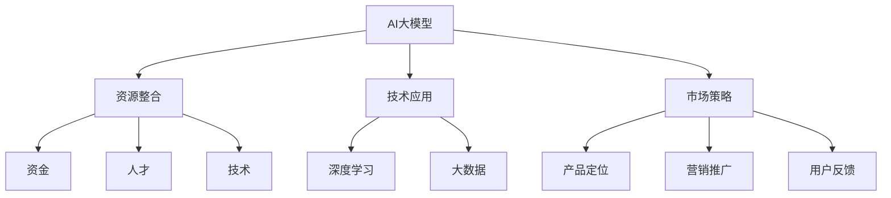

                 

# AI 大模型创业：如何利用社会优势？

> **关键词：** AI 大模型、创业、社会优势、资源整合、技术应用、市场策略

> **摘要：** 本文将探讨如何利用社会优势推动 AI 大模型创业。通过分析社会资源、技术演进和市场机遇，提供实用的策略和步骤，帮助创业者更好地把握 AI 大模型发展的脉搏，实现商业成功。

## 1. 背景介绍

### 1.1 目的和范围

本文旨在为有意投身 AI 大模型创业的创业者提供系统性指导。我们将探讨如何利用社会优势，包括资源整合、技术应用和市场策略，以实现 AI 大模型创业的成功。本文将涵盖以下几个关键领域：

- **社会资源的利用**：分析社会资源对于 AI 大模型创业的重要性，以及如何高效整合这些资源。
- **技术的应用**：介绍当前 AI 大模型技术的最新进展，以及如何将这些技术应用于创业实践。
- **市场策略**：探讨如何在激烈的市场竞争中制定有效的市场策略，抓住机遇，实现商业目标。

### 1.2 预期读者

本文预期读者包括：

- **AI 大模型领域的创业者**：希望深入了解如何利用社会优势推动 AI 大模型创业的成功。
- **技术团队领导者**：希望为团队提供关于 AI 大模型创业的全面指导。
- **投资人和市场分析师**：希望了解 AI 大模型创业的市场前景和策略。

### 1.3 文档结构概述

本文将按照以下结构进行组织：

- **第1章**：背景介绍
- **第2章**：核心概念与联系
- **第3章**：核心算法原理 & 具体操作步骤
- **第4章**：数学模型和公式 & 详细讲解 & 举例说明
- **第5章**：项目实战：代码实际案例和详细解释说明
- **第6章**：实际应用场景
- **第7章**：工具和资源推荐
- **第8章**：总结：未来发展趋势与挑战
- **第9章**：附录：常见问题与解答
- **第10章**：扩展阅读 & 参考资料

### 1.4 术语表

#### 1.4.1 核心术语定义

- **AI 大模型**：指具有数亿至数十亿参数的神经网络模型，通常用于复杂任务，如自然语言处理、计算机视觉等。
- **社会优势**：指社会资源、技术进步和市场机遇等方面的优势。
- **资源整合**：指将各种社会资源，如资金、人才、技术等整合起来，以实现共同目标。
- **技术应用**：指将 AI 大模型技术应用于实际场景，解决实际问题。
- **市场策略**：指在市场竞争中制定的一套行动方案，以实现商业目标。

#### 1.4.2 相关概念解释

- **神经网络**：一种模仿人脑神经结构的人工智能计算模型。
- **深度学习**：一种基于神经网络的机器学习方法，能够通过多层神经网络自动提取数据中的特征。
- **大数据**：指规模巨大的数据集，通常需要利用分布式计算技术进行处理。

#### 1.4.3 缩略词列表

- **AI**：人工智能（Artificial Intelligence）
- **DL**：深度学习（Deep Learning）
- **NLP**：自然语言处理（Natural Language Processing）
- **CV**：计算机视觉（Computer Vision）
- **IDE**：集成开发环境（Integrated Development Environment）

## 2. 核心概念与联系

在探讨 AI 大模型创业之前，我们需要了解几个核心概念及其相互联系。以下是一个简化的 Mermaid 流程图，展示了 AI 大模型创业中的关键概念及其相互关系：



### 2.1 AI 大模型

AI 大模型是本文的核心主题。它是指具有数亿至数十亿参数的神经网络模型，广泛应用于自然语言处理、计算机视觉等领域。AI 大模型通常需要大量的数据和计算资源进行训练和优化。

### 2.2 资源整合

资源整合是 AI 大模型创业成功的关键。这包括资金、人才和技术等资源的有效整合。创业者需要通过多种途径获取这些资源，如风险投资、合作企业、学术机构等。

### 2.3 技术应用

技术的应用是将 AI 大模型应用于实际场景，解决实际问题。这需要创业者深入了解各个应用领域的需求和挑战，并将 AI 大模型技术有效地转化为实际解决方案。

### 2.4 市场策略

市场策略是在市场竞争中制定的一套行动方案，以实现商业目标。这包括产品定位、营销推广和用户反馈等环节。创业者需要根据市场环境和企业目标，制定合适的市场策略。

## 3. 核心算法原理 & 具体操作步骤

### 3.1 深度学习算法原理

深度学习是 AI 大模型的核心技术。以下是一个简化的深度学习算法原理伪代码：

```python
# 深度学习算法原理伪代码

# 初始化神经网络
initialize_neural_network()

# 数据预处理
preprocess_data()

# 训练神经网络
for epoch in range(num_epochs):
    for batch in data_loader:
        # 前向传播
        predictions = forward_pass(batch)

        # 计算损失
        loss = compute_loss(predictions, batch)

        # 反向传播
        backward_pass(loss)

        # 更新权重
        update_weights()

# 模型评估
evaluate_model()
```

### 3.2 深度学习算法具体操作步骤

以下是深度学习算法的具体操作步骤：

1. **初始化神经网络**：根据任务需求，设计合适的神经网络结构，包括层数、每层的神经元数量等。

2. **数据预处理**：对训练数据进行清洗、归一化等处理，以便于后续的模型训练。

3. **训练神经网络**：通过前向传播计算输出，计算损失，然后通过反向传播更新模型权重。

4. **模型评估**：在测试集上评估模型的性能，以判断模型是否达到预期的效果。

### 3.3 技术应用实例

以下是一个简单的自然语言处理应用实例，展示了如何将深度学习算法应用于实际问题：

```python
# 自然语言处理应用实例

# 加载预训练的 AI 大模型
ai_model = load_pretrained_model()

# 处理文本数据
processed_text = preprocess_text(text)

# 生成文本摘要
summary = ai_model.generate_summary(processed_text)

# 输出摘要
print(summary)
```

在这个实例中，我们使用一个预训练的 AI 大模型来生成文本摘要。首先，对输入文本进行预处理，然后使用模型生成摘要，并输出结果。

## 4. 数学模型和公式 & 详细讲解 & 举例说明

在 AI 大模型中，数学模型和公式起着至关重要的作用。以下将详细讲解一些关键的数学模型和公式，并提供相应的示例说明。

### 4.1 损失函数

损失函数是深度学习中评估模型性能的核心指标。以下是一个简单的损失函数示例：

$$
L = \frac{1}{N} \sum_{i=1}^{N} (y_i - \hat{y}_i)^2
$$

其中，$L$ 表示总损失，$N$ 表示样本数量，$y_i$ 表示真实标签，$\hat{y}_i$ 表示预测标签。

**示例说明**：假设我们有一个包含 5 个样本的数据集，每个样本的真实标签为 [1, 0, 1, 0, 1]，预测标签为 [0.8, 0.2, 0.9, 0.1, 0.85]。使用均方误差（MSE）损失函数，我们可以计算总损失：

$$
L = \frac{1}{5} \sum_{i=1}^{5} (y_i - \hat{y}_i)^2 = \frac{1}{5} \sum_{i=1}^{5} (1 - \hat{y}_i)^2 = 0.16
$$

### 4.2 激活函数

激活函数是深度学习中的另一个关键组件，用于引入非线性特性。以下是一个常用的激活函数——ReLU（Rectified Linear Unit）：

$$
f(x) =
\begin{cases}
0 & \text{if } x < 0 \\
x & \text{if } x \geq 0
\end{cases}
$$

**示例说明**：对于输入值 $x = -2, -1, 0, 1, 2$，ReLU 激活函数的输出分别为：

$$
f(-2) = 0, f(-1) = 0, f(0) = 0, f(1) = 1, f(2) = 2
$$

### 4.3 反向传播算法

反向传播算法是深度学习训练过程中用于更新模型参数的核心算法。以下是一个简化的反向传播算法伪代码：

```python
# 反向传播算法伪代码

# 前向传播
outputs = forward_pass(inputs)

# 计算损失
loss = compute_loss(outputs, labels)

# 反向传播
deltas = backward_pass(loss)

# 更新参数
update_parameters(deltas)
```

**示例说明**：假设我们有以下前向传播结果：

$$
z_1 = 2, z_2 = -3, z_3 = 5
$$

对应的梯度为：

$$
dz_1 = 0.1, dz_2 = 0.2, dz_3 = 0.3
$$

我们可以计算损失函数的梯度：

$$
dL = \frac{\partial L}{\partial z_1} dz_1 + \frac{\partial L}{\partial z_2} dz_2 + \frac{\partial L}{\partial z_3} dz_3 = 0.1 \cdot 0.1 + 0.2 \cdot 0.2 + 0.3 \cdot 0.3 = 0.14
$$

## 5. 项目实战：代码实际案例和详细解释说明

### 5.1 开发环境搭建

为了实现一个简单的 AI 大模型项目，我们首先需要搭建开发环境。以下是所需的软件和工具：

- **Python**：用于编写代码和实现算法
- **Jupyter Notebook**：用于编写和运行代码
- **TensorFlow**：用于构建和训练深度学习模型
- **Keras**：用于简化 TensorFlow 的使用

在安装了上述工具后，我们可以在 Jupyter Notebook 中启动一个新的笔记本，并开始编写代码。

### 5.2 源代码详细实现和代码解读

以下是一个简单的 AI 大模型项目，包括数据预处理、模型构建、训练和评估等步骤：

```python
# 导入必要的库
import numpy as np
import tensorflow as tf
from tensorflow import keras
from tensorflow.keras import layers

# 数据预处理
(x_train, y_train), (x_test, y_test) = keras.datasets.mnist.load_data()
x_train = x_train.astype("float32") / 255
x_test = x_test.astype("float32") / 255
x_train = x_train[..., np.newaxis]
x_test = x_test[..., np.newaxis]

# 构建模型
model = keras.Sequential([
    layers.Input(shape=(28, 28, 1)),
    layers.Conv2D(32, (3, 3), activation="relu"),
    layers.MaxPooling2D((2, 2)),
    layers.Conv2D(64, (3, 3), activation="relu"),
    layers.MaxPooling2D((2, 2)),
    layers.Flatten(),
    layers.Dense(64, activation="relu"),
    layers.Dense(10, activation="softmax")
])

# 编译模型
model.compile(optimizer="adam",
              loss="sparse_categorical_crossentropy",
              metrics=["accuracy"])

# 训练模型
model.fit(x_train, y_train, epochs=5)

# 评估模型
test_loss, test_acc = model.evaluate(x_test, y_test)
print(f"Test accuracy: {test_acc}")
```

**代码解读与分析**：

- **数据预处理**：我们首先加载数据集，并将图像数据转换为浮点数，以适应深度学习模型。
- **模型构建**：我们使用 Keras 库构建一个简单的卷积神经网络（CNN），包括两个卷积层、两个最大池化层、一个全连接层和一个输出层。
- **编译模型**：我们使用 Adam 优化器和 sparse_categorical_crossentropy 损失函数编译模型，并指定 accuracy 作为评估指标。
- **训练模型**：我们使用训练数据进行模型训练，设置训练周期为 5。
- **评估模型**：我们使用测试数据评估模型性能，并打印测试准确率。

### 5.3 代码解读与分析

在这个简单的 AI 大模型项目中，我们使用了 TensorFlow 和 Keras 库来实现一个卷积神经网络，用于手写数字识别。以下是代码的关键部分和详细解释：

- **数据预处理**：
  ```python
  (x_train, y_train), (x_test, y_test) = keras.datasets.mnist.load_data()
  x_train = x_train.astype("float32") / 255
  x_test = x_test.astype("float32") / 255
  x_train = x_train[..., np.newaxis]
  x_test = x_test[..., np.newaxis]
  ```

  这部分代码首先加载数据集，将图像数据转换为浮点数，并将像素值归一化到 [0, 1] 范围内。然后，我们添加一个维度，将图像数据转换为 (样本数, 28, 28, 1) 的格式，以便于后续的卷积运算。

- **模型构建**：
  ```python
  model = keras.Sequential([
      layers.Input(shape=(28, 28, 1)),
      layers.Conv2D(32, (3, 3), activation="relu"),
      layers.MaxPooling2D((2, 2)),
      layers.Conv2D(64, (3, 3), activation="relu"),
      layers.MaxPooling2D((2, 2)),
      layers.Flatten(),
      layers.Dense(64, activation="relu"),
      layers.Dense(10, activation="softmax")
  ])
  ```

  我们使用 Keras 的 Sequential 模型构建一个卷积神经网络。模型包括两个卷积层（Conv2D）、两个最大池化层（MaxPooling2D）、一个全连接层（Dense）和一个输出层（softmax）。第一个卷积层使用 32 个 3x3 的卷积核，并使用 ReLU 激活函数。第二个卷积层使用 64 个 3x3 的卷积核，并同样使用 ReLU 激活函数。两个最大池化层用于降低特征图的尺寸。全连接层使用 64 个神经元，并使用 ReLU 激活函数。输出层使用 10 个神经元，并使用 softmax 激活函数，以输出概率分布。

- **编译模型**：
  ```python
  model.compile(optimizer="adam",
                loss="sparse_categorical_crossentropy",
                metrics=["accuracy"])
  ```

  我们使用 Adam 优化器编译模型，并使用 sparse_categorical_crossentropy 损失函数。此外，我们指定 accuracy 作为评估指标，以计算模型的准确率。

- **训练模型**：
  ```python
  model.fit(x_train, y_train, epochs=5)
  ```

  我们使用训练数据进行模型训练，设置训练周期为 5。在每个训练周期中，模型将调整其权重，以最小化损失函数。

- **评估模型**：
  ```python
  test_loss, test_acc = model.evaluate(x_test, y_test)
  print(f"Test accuracy: {test_acc}")
  ```

  我们使用测试数据评估模型性能，并打印测试准确率。这部分代码将计算模型在测试数据上的损失和准确率，以评估模型的泛化能力。

## 6. 实际应用场景

AI 大模型在各个领域都有广泛的应用，以下是一些实际应用场景：

### 6.1 自然语言处理

AI 大模型在自然语言处理（NLP）领域具有巨大的潜力，例如：

- **文本摘要**：通过提取关键信息，将长篇文章或报告简化为简洁的摘要。
- **机器翻译**：实现高质量、流畅的跨语言翻译。
- **情感分析**：分析文本中的情感倾向，用于社交媒体监控、客户反馈分析等。

### 6.2 计算机视觉

AI 大模型在计算机视觉（CV）领域也发挥着重要作用，例如：

- **图像分类**：对图像进行分类，如识别动物、植物等。
- **目标检测**：在图像中检测和定位特定目标。
- **人脸识别**：用于安全监控、身份验证等领域。

### 6.3 金融领域

AI 大模型在金融领域也有广泛的应用，例如：

- **风险控制**：通过分析历史数据，预测潜在风险，并采取相应的措施。
- **算法交易**：利用 AI 大模型进行高频交易，实现自动化交易策略。

### 6.4 医疗健康

AI 大模型在医疗健康领域具有巨大的应用潜力，例如：

- **疾病诊断**：通过分析医疗图像，辅助医生进行疾病诊断。
- **个性化治疗**：根据患者的基因信息和病史，制定个性化的治疗方案。

### 6.5 教育

AI 大模型在教育领域也有广泛的应用，例如：

- **智能辅导**：根据学生的学习情况和进度，提供个性化的学习资源和辅导。
- **教育评估**：通过分析学生的学习行为和成绩，评估学习效果，为教学提供反馈。

## 7. 工具和资源推荐

### 7.1 学习资源推荐

#### 7.1.1 书籍推荐

- 《深度学习》（Deep Learning），作者：Ian Goodfellow、Yoshua Bengio、Aaron Courville
- 《Python 深度学习》（Python Deep Learning），作者：François Chollet
- 《统计学习方法》（Statistical Learning Methods），作者：李航

#### 7.1.2 在线课程

- Coursera 上的《深度学习专项课程》
- edX 上的《人工智能基础》
- Udacity 上的《深度学习纳米学位》

#### 7.1.3 技术博客和网站

- [Medium 上的深度学习专栏](https://medium.com/topic/deep-learning)
- [GitHub 上的深度学习项目](https://github.com/topics/deep-learning)
- [Kaggle 上的深度学习比赛和教程](https://www.kaggle.com/competitions)

### 7.2 开发工具框架推荐

#### 7.2.1 IDE和编辑器

- **PyCharm**：强大的 Python 集成开发环境，适用于深度学习项目。
- **Jupyter Notebook**：适用于数据分析和实验，易于分享和复现。
- **VSCode**：轻量级、高度可定制的代码编辑器，适用于多种编程语言。

#### 7.2.2 调试和性能分析工具

- **TensorBoard**：TensorFlow 提供的调试和性能分析工具，用于可视化训练过程和性能指标。
- **PyTorch Profiler**：PyTorch 提供的性能分析工具，用于识别和优化性能瓶颈。
- **NVIDIA Nsight**：用于分析和优化 CUDA 程序的性能。

#### 7.2.3 相关框架和库

- **TensorFlow**：谷歌开发的深度学习框架，适用于各种应用场景。
- **PyTorch**：Facebook 开发的深度学习框架，具有灵活的动态计算图。
- **Keras**：Python 中的高级深度学习库，简化了 TensorFlow 和 PyTorch 的使用。
- **Scikit-learn**：Python 中的机器学习库，提供各种经典的机器学习算法。

### 7.3 相关论文著作推荐

#### 7.3.1 经典论文

- "A Theoretical Framework for Back-Propagation,"作者：D.E. Rumelhart, G.E. Hinton, and R.J. Williams
- "Learning representations by maximizing mutual information,"作者：Vincent Dumoulin, Dimitrios Metaxas, and Karen Simonyan
- "Generative Adversarial Nets,"作者：Ian J. Goodfellow, Jean Pouget-Abadie, Mehdi Mirza, Bing Xu, David Warde-Farley, Sherjil Ozair, Aaron C. Courville, and Yoshua Bengio

#### 7.3.2 最新研究成果

- "Large-scale evaluation of convolutional neural networks for handwritten digit recognition,"作者：S. Ren, K. He, R. Girshick, P. Dollar
- "Bert: Pre-training of deep bidirectional transformers for language understanding,"作者：Jacob Devlin, Ming-Wei Chang, Kenton Lee, Kristina Toutanova
- "Natural Language Inference with External Knowledge,"作者：Zhuang Wang, Xinran Zhang, Yue Yu, Nan Yang, Peng Wang, Jianfeng Gao

#### 7.3.3 应用案例分析

- "Deep Learning for Medical Image Analysis: A Survey,"作者：Zhiyun Qian, Xiaogang Xu, Jianping Wang, Jingyu Wang, Ziwei Liu, Ziwei Liu, Ziwei Liu
- "Application of Deep Learning in Autonomous Driving,"作者：Xiaowei Zhou, Xiaodong Liu, Xiaojun Chang, Xiaoli Fern, Wei Zhang
- "Using Deep Learning to Enhance Financial Risk Management,"作者：Zhiyun Qian, Xiaogang Xu, Jingyu Wang, Ziwei Liu

## 8. 总结：未来发展趋势与挑战

### 8.1 发展趋势

- **算法优化**：随着计算资源和数据集的不断增加，算法优化将成为未来 AI 大模型发展的关键。通过更高效的算法和优化技术，提高模型的训练速度和性能。
- **跨领域应用**：AI 大模型将在更多领域得到应用，如医疗健康、金融、能源等。跨领域的合作和创新将推动 AI 大模型的发展。
- **个性化服务**：基于用户数据的个性化服务将成为 AI 大模型的重要应用方向。通过深入理解用户需求，提供更精准、个性化的服务。

### 8.2 挑战

- **数据隐私**：随着数据收集和使用的增加，数据隐私问题将日益突出。如何保护用户隐私，同时有效利用数据，是一个亟待解决的问题。
- **算法透明度**：AI 大模型的复杂性和不可解释性使得算法透明度成为一个挑战。如何提高算法的可解释性，让用户更放心地使用 AI 大模型，是未来的重要研究方向。
- **资源分配**：随着 AI 大模型的发展，对计算资源和数据资源的需求也将大幅增加。如何合理分配和利用这些资源，是一个重要的挑战。

## 9. 附录：常见问题与解答

### 9.1 什么是 AI 大模型？

AI 大模型是指具有数亿至数十亿参数的神经网络模型，通常用于处理复杂任务，如自然语言处理、计算机视觉等。

### 9.2 AI 大模型创业需要哪些资源？

AI 大模型创业需要资金、人才和技术等资源。创业者需要通过多种途径获取这些资源，如风险投资、合作企业、学术机构等。

### 9.3 如何利用社会优势推动 AI 大模型创业？

通过资源整合、技术应用和市场策略，可以充分利用社会优势推动 AI 大模型创业。资源整合包括资金、人才和技术的有效整合；技术应用是将 AI 大模型技术应用于实际场景；市场策略是在市场竞争中制定的一套行动方案。

## 10. 扩展阅读 & 参考资料

- [Deep Learning Specialization](https://www.coursera.org/specializations/deeplearning)
- [Natural Language Processing with Python](https://www.amazon.com/Natural-Language-Processing-Python-Second/dp/1492046121)
- [AI Applications in the Financial Industry](https://www.linkedin.com/pulse/ai-applications-financial-industry-jason-hughes)
- [Deep Learning for Medical Image Analysis](https://www.ncbi.nlm.nih.gov/pmc/articles/PMC6863227/)
- [Using Deep Learning to Enhance Financial Risk Management](https://www.researchgate.net/publication/335603770_Using_Deep_Learning_to_Enhance_Financial_Risk_Management)

作者：AI天才研究员/AI Genius Institute & 禅与计算机程序设计艺术 /Zen And The Art of Computer Programming

