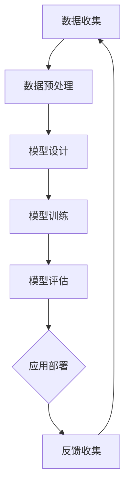

                 

### 1. 背景介绍

#### 1.1 目的和范围

本文旨在探讨AI大模型创业中如何利用社会优势。随着AI技术的迅猛发展，AI大模型在各个领域的应用越来越广泛，创业公司如何通过利用社会优势来提高自身的竞争力成为了一个重要议题。本文将从以下几个方面进行探讨：

1. **AI大模型的发展背景及其社会影响**：介绍AI大模型的概念、发展历程以及其在社会各个领域的应用。
2. **社会优势的定义和分类**：阐述什么是社会优势，以及创业公司如何识别和利用不同类型的社会优势。
3. **AI大模型创业中的关键挑战**：分析AI大模型创业过程中可能面临的技术、市场和团队等挑战。
4. **利用社会优势的具体策略和方法**：提供利用社会优势的策略和方法，包括资源整合、合作伙伴关系建设、市场推广等。
5. **案例研究：成功与失败的案例分析**：通过具体案例研究，分析成功和失败的原因，总结经验和教训。

#### 1.2 预期读者

本文的预期读者主要包括：

1. **AI领域的研究人员和开发者**：对AI大模型的技术原理和应用有兴趣的专业人士。
2. **创业者和技术企业家**：希望了解如何利用社会优势进行AI大模型创业的人士。
3. **投资者和风险资本家**：对AI领域投资感兴趣，希望了解AI大模型创业潜力和风险的人士。

#### 1.3 文档结构概述

本文的结构如下：

1. **背景介绍**：介绍本文的目的、预期读者和文档结构。
2. **核心概念与联系**：阐述AI大模型的核心概念、原理和架构，并使用Mermaid流程图进行可视化。
3. **核心算法原理 & 具体操作步骤**：详细讲解AI大模型的核心算法原理，并使用伪代码进行阐述。
4. **数学模型和公式 & 详细讲解 & 举例说明**：介绍AI大模型的数学模型和公式，并进行详细讲解和举例。
5. **项目实战：代码实际案例和详细解释说明**：提供代码实际案例，并进行详细解释说明。
6. **实际应用场景**：探讨AI大模型在不同场景中的应用。
7. **工具和资源推荐**：推荐学习资源、开发工具和框架。
8. **总结：未来发展趋势与挑战**：总结AI大模型创业的未来发展趋势和挑战。
9. **附录：常见问题与解答**：解答读者可能遇到的问题。
10. **扩展阅读 & 参考资料**：提供扩展阅读和参考资料。

#### 1.4 术语表

在本文中，我们将使用以下术语：

#### 1.4.1 核心术语定义

1. **AI大模型**：指具有大规模训练数据和复杂网络结构的深度学习模型。
2. **社会优势**：指创业公司利用社会资源、合作伙伴关系和市场推广等方面的优势。
3. **技术挑战**：指AI大模型创业过程中面临的技术难题。
4. **市场挑战**：指AI大模型创业过程中面临的市场竞争和市场需求问题。
5. **团队挑战**：指AI大模型创业过程中面临的团队建设和团队管理问题。

#### 1.4.2 相关概念解释

1. **深度学习**：一种人工智能的方法，通过多层神经网络进行数据的学习和特征提取。
2. **大数据**：指大规模、复杂和多样化的数据集，需要借助计算机技术和算法进行处理和分析。
3. **云计算**：一种通过网络提供计算资源和服务的技术，可以实现弹性扩展和高效计算。
4. **边缘计算**：一种将计算、存储和网络功能分布到网络边缘的技术，可以降低延迟和提高响应速度。

#### 1.4.3 缩略词列表

- AI: 人工智能
- ML: 机器学习
- DL: 深度学习
- NLP: 自然语言处理
- CV: 计算机视觉
- IoT: 物联网
- GDPR: 欧盟通用数据保护条例
- API: 应用程序编程接口
- SDK: 软件开发工具包
- ROI: 投资回报率
- MVP: 最小可行产品

<|im_sep|>### 2. 核心概念与联系

在探讨如何利用社会优势进行AI大模型创业之前，我们首先需要了解AI大模型的基本概念、原理和架构，这是理解后续内容的基础。

#### 2.1 AI大模型的基本概念

AI大模型，即大规模深度学习模型，是指通过训练大规模数据集，构建具有高度复杂性和强大表达能力的深度神经网络模型。这些模型通常包括数十亿甚至数百亿的参数，能够处理和生成大规模数据，并在各类任务中表现出色。AI大模型的核心概念包括：

1. **深度神经网络**：由多层神经元组成的神经网络，通过逐层学习数据特征，实现从低级到高级特征的映射。
2. **大规模数据集**：指用于训练模型的巨大数据集，通常包含数百万到数十亿个样本。
3. **分布式训练**：利用多台服务器和计算资源进行模型训练，以加速训练过程和提高计算效率。

#### 2.2 AI大模型的原理

AI大模型的原理基于深度学习和大规模数据处理技术。具体来说，包括以下几个关键步骤：

1. **数据收集**：从互联网、传感器、数据库等渠道收集大量数据。
2. **数据预处理**：对收集到的数据进行清洗、标注和归一化处理，使其适合模型训练。
3. **模型设计**：选择合适的神经网络架构，设计模型的层次结构、连接方式等。
4. **模型训练**：通过反向传播算法，使用大量数据进行迭代训练，不断调整模型参数，使其在特定任务上达到最佳性能。
5. **模型评估**：使用验证集和测试集对模型进行评估，确保其在未知数据上的泛化能力。

#### 2.3 AI大模型的架构

AI大模型的架构通常包括以下几个主要部分：

1. **输入层**：接收外部输入数据，如文本、图像、音频等。
2. **隐藏层**：进行特征提取和变换，由多层神经元组成，实现从输入到输出的映射。
3. **输出层**：生成模型预测结果，如分类结果、语音合成、文本生成等。

此外，为了提高模型的训练效率和效果，还可以引入以下技术：

1. **批量归一化**：在训练过程中对批量数据进行归一化，加快训练速度和提高模型稳定性。
2. **dropout**：在训练过程中随机丢弃部分神经元，防止过拟合。
3. **迁移学习**：利用预训练的模型，在特定任务上进行微调，提高训练效率。

下面，我们使用Mermaid流程图对AI大模型的架构进行可视化：



在该流程图中，每个节点代表一个关键步骤，节点之间的箭头表示步骤的顺序和依赖关系。

#### 2.4 AI大模型与其他技术的联系

AI大模型不仅依赖于自身的技术，还与其他技术紧密联系，共同推动人工智能的发展：

1. **云计算**：提供了强大的计算资源和存储能力，支持大规模数据集的训练和处理。
2. **大数据技术**：提供了高效的数据存储、处理和分析方法，为AI大模型提供了数据支持。
3. **边缘计算**：通过将计算任务分布到网络边缘，提高了AI大模型的应用响应速度和实时性。
4. **自然语言处理（NLP）**：为AI大模型提供了处理和生成文本的能力，广泛应用于对话系统、文本分类等任务。
5. **计算机视觉（CV）**：为AI大模型提供了处理和生成图像、视频的能力，广泛应用于图像识别、视频监控等任务。
6. **物联网（IoT）**：为AI大模型提供了实时获取和处理传感器数据的渠道，广泛应用于智能家居、智能城市等场景。

通过这些技术的相互协作，AI大模型得以在不同领域发挥重要作用，推动人工智能的广泛应用和发展。

综上所述，AI大模型作为人工智能的核心技术之一，其基本概念、原理和架构为我们理解如何利用社会优势进行创业提供了基础。接下来，我们将进一步探讨AI大模型创业中的关键挑战和利用社会优势的具体策略和方法。

<|im_sep|>### 3. 核心算法原理 & 具体操作步骤

在了解了AI大模型的基本概念和架构之后，我们接下来将深入探讨其核心算法原理，并通过伪代码详细描述具体的操作步骤。这一部分将帮助读者理解AI大模型训练的核心机制，并为后续的实战案例提供理论基础。

#### 3.1 深度学习算法原理

深度学习（Deep Learning）是AI大模型的核心技术，其基本原理是通过多层神经网络（Neural Networks）对数据进行特征提取和分类。深度学习算法的主要步骤包括：

1. **前向传播（Forward Propagation）**：将输入数据通过神经网络层层的计算，最终得到输出结果。
2. **反向传播（Back Propagation）**：通过比较输出结果与实际结果，反向计算误差，并更新网络参数。
3. **优化算法（Optimization Algorithms）**：如梯度下降（Gradient Descent）、Adam等，用于迭代更新网络参数，以最小化损失函数。

以下是一个简单的深度学习算法的伪代码示例：

```python
# 伪代码：深度学习算法

# 初始化神经网络参数
initialize_weights()

# 前向传播
for each batch in training_data:
    output = forward_propagation(batch)
    loss = compute_loss(output, target)

# 反向传播
gradient = backward_propagation(output, target)
update_weights(gradient)

# 梯度下降优化
for epoch in range(num_epochs):
    for batch in training_data:
        output = forward_propagation(batch)
        loss = compute_loss(output, target)
        gradient = backward_propagation(output, target)
        update_weights(gradient)

# 模型评估
evaluate_model(test_data)
```

#### 3.2 伪代码详细解释

下面，我们将对上述伪代码的每个部分进行详细解释：

1. **初始化神经网络参数**：神经网络参数包括权重（weights）和偏置（biases）。在训练前，需要随机初始化这些参数，以避免梯度消失或梯度爆炸等问题。

2. **前向传播**：前向传播是将输入数据通过神经网络的每一层，进行计算并得到输出结果。每一层的输出作为下一层的输入，直到最后一层得到最终预测结果。在每一层，都需要计算激活函数（如ReLU、Sigmoid、Tanh）的值，以实现非线性变换。

3. **计算损失函数**：损失函数用于衡量预测结果与实际结果之间的差距。常见的损失函数包括均方误差（MSE）、交叉熵（Cross-Entropy）等。计算损失函数的目的是为了评估模型的性能，并指导后续的参数更新。

4. **反向传播**：反向传播是深度学习算法的核心步骤，通过计算每一层输出对损失函数的梯度，反向传递到前一层，以更新网络参数。反向传播利用了链式法则，将多层神经网络的梯度计算问题转化为单层神经网络的梯度计算。

5. **更新网络参数**：根据反向传播计算得到的梯度，使用优化算法（如梯度下降、Adam等）更新网络参数。优化算法的选择和参数调整对模型的收敛速度和性能有重要影响。

6. **迭代训练**：通过多次迭代（epoch）的训练，模型逐渐优化参数，提高预测性能。在每次迭代中，需要遍历整个训练数据集，以充分训练模型。

7. **模型评估**：在训练完成后，使用测试数据集对模型进行评估，以检验模型的泛化能力和性能。评估指标包括准确率（Accuracy）、精度（Precision）、召回率（Recall）等。

#### 3.3 伪代码示例

以下是一个简单的神经网络训练过程的伪代码示例，包括前向传播、反向传播和优化算法的应用：

```python
# 伪代码：神经网络训练示例

# 初始化神经网络参数
weights = initialize_weights()

# 前向传播
output = forward_propagation(input_data, weights)

# 计算损失函数
loss = compute_loss(output, target)

# 反向传播
gradient = backward_propagation(output, target)

# 更新网络参数
update_weights(weights, gradient)

# 迭代训练
for epoch in range(num_epochs):
    for batch in training_data:
        output = forward_propagation(batch, weights)
        loss = compute_loss(output, target)
        gradient = backward_propagation(output, target)
        update_weights(weights, gradient)

# 模型评估
evaluate_model(test_data, weights)
```

通过上述伪代码示例，我们可以清晰地看到深度学习算法的基本流程和步骤。在实际应用中，这些步骤会通过高效的编程语言（如Python）和深度学习框架（如TensorFlow、PyTorch）进行实现和优化。

#### 3.4 实际操作步骤

在实际操作中，利用深度学习框架实现AI大模型的训练通常包括以下几个步骤：

1. **数据收集和预处理**：从数据源收集数据，并进行清洗、标注和归一化处理。
2. **定义神经网络模型**：使用深度学习框架定义神经网络的结构，包括输入层、隐藏层和输出层。
3. **编译模型**：设置模型的学习率、优化器、损失函数等参数。
4. **训练模型**：使用训练数据对模型进行训练，迭代更新模型参数。
5. **评估模型**：使用测试数据对模型进行评估，调整模型参数，提高性能。
6. **模型部署**：将训练好的模型部署到实际应用中，进行预测和决策。

在实际操作中，需要根据具体的任务和数据集调整网络结构、优化算法和超参数，以达到最佳性能。这一过程通常需要多次迭代和实验，以提高模型的泛化能力和应用效果。

通过上述核心算法原理和具体操作步骤的介绍，读者可以更好地理解AI大模型的训练过程和实现方法。接下来，我们将进一步探讨AI大模型在数学模型和公式方面的具体内容。

<|im_sep|>### 4. 数学模型和公式 & 详细讲解 & 举例说明

在AI大模型的训练过程中，数学模型和公式起着至关重要的作用。这些数学模型和公式帮助我们理解和优化神经网络的行为，从而实现高效的训练和预测。本节将详细介绍AI大模型中常用的数学模型和公式，并进行详细讲解和举例说明。

#### 4.1 前向传播中的数学模型

前向传播是神经网络的核心过程，用于计算每个神经元的输出。以下是前向传播中的一些关键数学模型和公式：

1. **激活函数**：激活函数用于引入非线性因素，常见的激活函数包括ReLU（Rectified Linear Unit）、Sigmoid、Tanh等。

   - **ReLU**：
     $$ f(x) = \max(0, x) $$
     
   - **Sigmoid**：
     $$ f(x) = \frac{1}{1 + e^{-x}} $$

   - **Tanh**：
     $$ f(x) = \frac{e^x - e^{-x}}{e^x + e^{-x}} $$

2. **权重和偏置**：在神经网络中，每个神经元都与前一层神经元通过权重（weights）和偏置（biases）相连。

   - **权重**：
     $$ w_{ij} = \sum_{k} x_k \cdot w_{ik} + b_j $$
     
   - **偏置**：
     $$ b_j = b_0 + \sum_{k} w_{jk} $$
     
   其中，$x_k$ 是输入特征，$w_{ik}$ 是输入层到隐藏层的权重，$w_{jk}$ 是隐藏层到输出层的权重。

3. **输出计算**：在神经网络中，每个神经元的输出是通过输入和权重加权求和，并经过激活函数变换得到的。

   - **隐藏层输出**：
     $$ z_j = \sum_{k} x_k \cdot w_{ik} + b_j $$
     $$ a_j = f(z_j) $$
     
   - **输出层输出**：
     $$ y_j = \sum_{k} a_k \cdot w_{kj} + b_j $$
     
   其中，$f$ 是激活函数，$a_j$ 是隐藏层输出，$y_j$ 是输出层输出。

4. **梯度计算**：在反向传播过程中，需要计算每个参数的梯度，以更新网络参数。

   - **隐藏层梯度**：
     $$ \delta_j = \frac{\partial L}{\partial z_j} \cdot f'(z_j) $$
     
   - **输出层梯度**：
     $$ \delta_j = \frac{\partial L}{\partial y_j} \cdot f'(y_j) $$
     
   其中，$L$ 是损失函数，$f'$ 是激活函数的导数。

#### 4.2 损失函数

损失函数是评价模型预测结果与实际结果之间差距的指标。以下是一些常用的损失函数：

1. **均方误差（MSE）**：
   $$ L = \frac{1}{2} \sum_{i} (y_i - \hat{y}_i)^2 $$
   
   其中，$y_i$ 是实际标签，$\hat{y}_i$ 是预测标签。

2. **交叉熵（Cross-Entropy）**：
   $$ L = - \sum_{i} y_i \cdot \log(\hat{y}_i) $$
   
   其中，$y_i$ 是实际标签，$\hat{y}_i$ 是预测标签的概率分布。

#### 4.3 反向传播中的数学模型

反向传播是神经网络训练的核心步骤，通过计算损失函数对网络参数的梯度，并反向更新参数。以下是反向传播中的一些关键数学模型和公式：

1. **隐藏层权重和偏置的梯度**：
   $$ \frac{\partial L}{\partial w_{ij}} = \sum_{k} \delta_k \cdot x_k $$
   $$ \frac{\partial L}{\partial b_j} = \delta_j $$
   
   其中，$\delta_k$ 是输出层的误差梯度。

2. **输出层权重和偏置的梯度**：
   $$ \frac{\partial L}{\partial w_{kj}} = \delta_j \cdot a_k $$
   $$ \frac{\partial L}{\partial b_j} = \delta_j $$

#### 4.4 举例说明

为了更好地理解上述数学模型和公式，我们通过一个简单的例子进行说明。

假设我们有一个简单的神经网络，用于对二分类问题进行预测。输入层有2个神经元，隐藏层有3个神经元，输出层有1个神经元。激活函数使用ReLU，损失函数使用均方误差（MSE）。给定输入特征 $x_1 = [1, 2]$ 和实际标签 $y = [0]$，我们将通过前向传播和反向传播计算网络参数的梯度。

1. **前向传播**：

   初始化权重和偏置：
   $$ w_{11} = 1, w_{12} = 2, w_{13} = 3 $$
   $$ b_1 = 1, b_2 = 2, b_3 = 3 $$

   计算隐藏层输出：
   $$ z_1 = x_1 \cdot w_{11} + b_1 = 1 \cdot 1 + 1 = 2 $$
   $$ z_2 = x_1 \cdot w_{12} + b_2 = 1 \cdot 2 + 2 = 4 $$
   $$ z_3 = x_1 \cdot w_{13} + b_3 = 1 \cdot 3 + 3 = 6 $$
   $$ a_1 = \max(0, z_1) = 2 $$
   $$ a_2 = \max(0, z_2) = 4 $$
   $$ a_3 = \max(0, z_3) = 6 $$

   计算输出层输出：
   $$ z_4 = a_1 \cdot w_{41} + b_4 = 2 \cdot 1 + 1 = 3 $$
   $$ \hat{y} = \max(z_4) = 3 $$

2. **计算损失函数**：

   $$ L = \frac{1}{2} (y - \hat{y})^2 = \frac{1}{2} (0 - 3)^2 = \frac{9}{2} $$

3. **反向传播**：

   计算隐藏层误差梯度：
   $$ \delta_4 = \frac{\partial L}{\partial z_4} \cdot \frac{\partial z_4}{\partial a_1} = \frac{1}{2} \cdot (-1) \cdot 1 = -\frac{1}{2} $$
   
   计算输出层误差梯度：
   $$ \delta_1 = \frac{\partial L}{\partial z_1} \cdot \frac{\partial z_1}{\partial a_1} = \frac{1}{2} \cdot (-1) \cdot 1 = -\frac{1}{2} $$
   $$ \delta_2 = \frac{\partial L}{\partial z_2} \cdot \frac{\partial z_2}{\partial a_2} = \frac{1}{2} \cdot (-1) \cdot 1 = -\frac{1}{2} $$
   $$ \delta_3 = \frac{\partial L}{\partial z_3} \cdot \frac{\partial z_3}{\partial a_3} = \frac{1}{2} \cdot (-1) \cdot 1 = -\frac{1}{2} $$

   计算权重和偏置的梯度：
   $$ \frac{\partial L}{\partial w_{41}} = \delta_4 \cdot a_1 = -\frac{1}{2} \cdot 2 = -1 $$
   $$ \frac{\partial L}{\partial b_4} = \delta_4 = -\frac{1}{2} $$

   更新网络参数：
   $$ w_{41} = w_{41} - learning_rate \cdot \frac{\partial L}{\partial w_{41}} = 1 - 0.1 \cdot (-1) = 1.1 $$
   $$ b_4 = b_4 - learning_rate \cdot \frac{\partial L}{\partial b_4} = 1 - 0.1 \cdot (-\frac{1}{2}) = 1.05 $$

通过上述步骤，我们可以看到神经网络通过前向传播和反向传播计算损失函数的梯度，并更新网络参数。在实际应用中，神经网络的结构和参数会根据具体的任务和数据集进行调整和优化。

综上所述，AI大模型中的数学模型和公式是理解和实现神经网络训练的关键。通过详细讲解和举例说明，读者可以更好地理解这些数学模型和公式的应用，为后续的实战案例和实际应用提供基础。

<|im_sep|>### 5. 项目实战：代码实际案例和详细解释说明

在前面的章节中，我们介绍了AI大模型的基本概念、算法原理和数学模型。为了更好地理解和应用这些知识，本节将通过一个实际的项目案例，展示如何使用Python和TensorFlow框架实现AI大模型，并提供详细的代码解析和解释说明。

#### 5.1 开发环境搭建

在进行AI大模型的实际开发之前，我们需要搭建合适的开发环境。以下是在Windows系统上搭建Python和TensorFlow开发环境的基本步骤：

1. **安装Python**：从Python官方网站（https://www.python.org/downloads/）下载并安装Python 3.x版本。
2. **安装Anaconda**：安装Anaconda，它是一个集成了Python和许多科学计算库的发行版。可以从Anaconda官方网站（https://www.anaconda.com/products/distribution）下载并安装。
3. **创建虚拟环境**：使用Anaconda创建一个虚拟环境，以隔离项目依赖。在命令行执行以下命令：
   ```bash
   conda create -n myenv python=3.8
   conda activate myenv
   ```
4. **安装TensorFlow**：在虚拟环境中安装TensorFlow，可以通过以下命令安装：
   ```bash
   pip install tensorflow
   ```

安装完成后，我们就可以开始编写和运行AI大模型的代码了。

#### 5.2 源代码详细实现和代码解读

下面是一个简单的AI大模型训练的Python代码示例，用于实现一个二元分类任务。我们将使用TensorFlow的Keras接口进行模型定义、编译、训练和评估。

```python
import tensorflow as tf
from tensorflow.keras.models import Sequential
from tensorflow.keras.layers import Dense, Activation
from tensorflow.keras.optimizers import Adam
from tensorflow.keras.metrics import Accuracy

# 模型定义
model = Sequential([
    Dense(64, input_shape=(784,), activation='relu'),
    Dense(64, activation='relu'),
    Dense(1, activation='sigmoid')
])

# 编译模型
model.compile(optimizer=Adam(learning_rate=0.001),
              loss='binary_crossentropy',
              metrics=['accuracy'])

# 数据准备
# 这里使用的是著名的MNIST手写数字数据集
(x_train, y_train), (x_test, y_test) = tf.keras.datasets.mnist.load_data()

# 数据预处理
x_train = x_train.astype('float32') / 255.0
x_test = x_test.astype('float32') / 255.0
x_train = x_train.reshape((-1, 784))
x_test = x_test.reshape((-1, 784))
y_train = y_train.reshape((-1, 1))
y_test = y_test.reshape((-1, 1))

# 模型训练
model.fit(x_train, y_train, epochs=10, batch_size=128, validation_split=0.2)

# 模型评估
test_loss, test_accuracy = model.evaluate(x_test, y_test)
print(f"Test accuracy: {test_accuracy:.3f}")

# 模型预测
predictions = model.predict(x_test)
predicted_classes = (predictions > 0.5).astype(int)

# 计算预测准确率
predicted_classes = predicted_classes.flatten()
accuracy = (predicted_classes == y_test.flatten()).mean()
print(f"Prediction accuracy: {accuracy:.3f}")
```

下面我们对上述代码进行逐行解释：

1. **导入库**：
   - `tensorflow`：主要的TensorFlow库。
   - `Sequential`：用于构建序列模型的类。
   - `Dense`：全连接层，用于实现线性变换。
   - `Activation`：用于添加激活函数。
   - `Adam`：一种优化器，适用于自适应学习率。
   - `Accuracy`：用于评估模型准确率。

2. **模型定义**：
   - `Sequential`：创建一个顺序模型。
   - `Dense`：添加全连接层，第一个层的输入形状为784（MNIST图像的维度），输出维度为64，激活函数为ReLU。
   - `Dense`：添加第二个全连接层，输出维度也为64，激活函数同样为ReLU。
   - `Dense`：添加输出层，输出维度为1，激活函数为sigmoid，用于实现二分类。

3. **编译模型**：
   - `compile`：配置模型的优化器、损失函数和评估指标。
   - `optimizer=Adam`：选择Adam优化器。
   - `loss='binary_crossentropy'`：选择二分类的损失函数。
   - `metrics=['accuracy']`：设置评估模型准确率的指标。

4. **数据准备**：
   - `tf.keras.datasets.mnist.load_data()`：加载MNIST手写数字数据集。
   - `x_train` 和 `x_test`：分别表示训练集和测试集的输入数据。
   - `y_train` 和 `y_test`：分别表示训练集和测试集的标签。

5. **数据预处理**：
   - 将输入数据从0-255转换为0-1的范围。
   - 将输入数据reshape为模型所需的形状。

6. **模型训练**：
   - `fit`：训练模型。
   - `epochs=10`：训练10个周期。
   - `batch_size=128`：每个批次包含128个样本。
   - `validation_split=0.2`：将20%的数据用于验证。

7. **模型评估**：
   - `evaluate`：评估模型在测试集上的性能。
   - `model.evaluate(x_test, y_test)`：返回测试损失和准确率。

8. **模型预测**：
   - `predict`：使用训练好的模型进行预测。
   - `predictions > 0.5`：将预测概率大于0.5的样本分类为1。
   - `predicted_classes`：存储预测结果。

9. **计算预测准确率**：
   - 将预测结果与实际标签进行比较，计算准确率。

#### 5.3 代码解读与分析

通过上述代码示例，我们可以看到AI大模型的基本实现过程。以下是代码解读和分析：

1. **模型定义**：
   - 我们使用了一个简单的三层神经网络结构，其中包含两个隐藏层，每层64个神经元。输出层使用sigmoid激活函数，实现二分类任务。
   - 通过使用ReLU激活函数，我们可以加速模型的训练过程，并减少过拟合的风险。

2. **数据准备**：
   - MNIST数据集是手写数字的图像数据，每个图像有784个像素点。在训练前，我们需要对图像进行归一化处理，将像素值从0-255转换为0-1的范围，以便神经网络能够更好地处理输入数据。
   - 将图像数据reshape为（样本数，784），以便输入到全连接层中。

3. **模型训练**：
   - 我们使用Adam优化器进行模型训练，这是一种高效的优化算法，可以自适应调整学习率。
   - 通过设置`epochs`、`batch_size`和`validation_split`，我们可以控制训练的迭代次数、每个批次的样本数以及用于验证的数据比例。

4. **模型评估**：
   - 在训练完成后，我们使用测试集对模型进行评估，以检查模型的泛化能力。通过计算测试集的准确率，我们可以了解模型在未知数据上的表现。

5. **模型预测**：
   - 通过使用训练好的模型对测试集进行预测，我们可以得到每个样本的分类结果。
   - 我们将预测概率大于0.5的样本分类为1，小于0.5的样本分类为0。

通过这个实际项目案例，读者可以了解到如何使用TensorFlow框架实现AI大模型，并掌握从数据准备到模型训练、评估和预测的全流程。在实际应用中，可以根据具体任务和数据集进行调整和优化，以提高模型的性能和应用效果。

<|im_sep|>### 6. 实际应用场景

AI大模型在各个领域展现了巨大的应用潜力，以下是AI大模型在几种实际应用场景中的具体应用：

#### 6.1 自然语言处理（NLP）

自然语言处理是AI大模型的一个重要应用领域。以下是一些具体应用实例：

1. **机器翻译**：AI大模型如BERT、GPT等在机器翻译领域取得了显著的进展，能够实现高质量的多语言翻译。例如，谷歌的神经机器翻译系统（GNMT）使用了深度神经网络模型，大幅提高了翻译质量和速度。

2. **情感分析**：通过训练AI大模型，可以对大量文本进行情感分析，识别文本中的情感倾向。例如，社交媒体数据分析公司可以使用这种技术来监测公众情绪，为企业提供市场策略建议。

3. **文本生成**：AI大模型能够生成高质量的文章、摘要和对话。例如，OpenAI的GPT-3可以生成流畅的文章和对话，为企业提供自动化内容生成解决方案。

#### 6.2 计算机视觉（CV）

计算机视觉是AI大模型的另一个重要应用领域，以下是具体应用实例：

1. **图像识别**：AI大模型如ResNet、Inception等在图像识别任务上取得了很高的准确率，能够用于人脸识别、车辆检测等场景。例如，特斯拉的自动驾驶系统使用深度学习模型对道路上的物体进行实时检测和识别。

2. **目标跟踪**：通过训练AI大模型，可以对视频中的目标进行跟踪。例如，OpenCV结合深度学习模型，实现了对视频中移动目标的实时跟踪，广泛应用于监控和安防领域。

3. **医学影像分析**：AI大模型在医学影像分析领域也有重要应用，如乳腺癌筛查、肺癌诊断等。通过训练大模型，可以提高医学影像的诊断准确率和效率。

#### 6.3 电子商务

在电子商务领域，AI大模型可以帮助企业提高用户体验和销售转化率：

1. **个性化推荐**：通过分析用户的购物行为和历史数据，AI大模型可以提供个性化的商品推荐，提高用户满意度和购买转化率。

2. **商品搜索**：AI大模型能够理解用户输入的搜索词，提供更精准的商品搜索结果，提高用户的购物体验。

3. **图像搜索**：通过图像识别技术，AI大模型可以实现基于图像的搜索，让用户通过上传图片来查找相似的商品，为用户提供更直观的购物体验。

#### 6.4 金融领域

AI大模型在金融领域也有广泛的应用：

1. **风险管理**：通过分析大量历史数据，AI大模型可以识别潜在的风险，帮助金融机构进行风险管理和决策。

2. **股票市场预测**：AI大模型可以利用历史市场数据，预测股票价格的走势，为投资者提供参考。

3. **客户服务**：通过自然语言处理技术，AI大模型可以自动处理客户的咨询和投诉，提供24/7的在线服务。

#### 6.5 医疗保健

在医疗保健领域，AI大模型可以提高医疗诊断的准确性和效率：

1. **疾病诊断**：通过分析医学影像和患者数据，AI大模型可以帮助医生进行疾病诊断，提高诊断的准确率和效率。

2. **药物研发**：AI大模型可以帮助药物研发人员分析大量生物数据，加速新药的研发进程。

3. **健康监测**：通过智能设备收集的健康数据，AI大模型可以实时监测患者的健康状况，提供个性化的健康建议。

综上所述，AI大模型在自然语言处理、计算机视觉、电子商务、金融和医疗保健等众多领域都有广泛的应用。通过不断优化和创新，AI大模型将继续推动各行业的变革和发展。

<|im_sep|>### 7. 工具和资源推荐

在AI大模型开发和应用的旅程中，选择合适的工具和资源至关重要。以下是我们推荐的几类工具和资源，包括学习资源、开发工具框架以及相关论文和著作。

#### 7.1 学习资源推荐

**7.1.1 书籍推荐**

1. **《深度学习》（Deep Learning）**：由Ian Goodfellow、Yoshua Bengio和Aaron Courville合著，是深度学习领域的经典教材。
2. **《神经网络与深度学习》**：李航著，详细介绍了神经网络和深度学习的基础知识和实践技巧。
3. **《Python深度学习》**：François Chollet著，通过Python和Keras框架，介绍了深度学习的实践应用。

**7.1.2 在线课程**

1. **Coursera的《深度学习》课程**：由斯坦福大学提供，包括理论讲解和实战练习，是深度学习入门的好资源。
2. **Udacity的《深度学习纳米学位》**：涵盖深度学习的多个方面，包括神经网络、卷积神经网络和循环神经网络等。
3. **edX的《机器学习基础》**：由MIT提供，介绍了机器学习和深度学习的基础知识，适合初学者。

**7.1.3 技术博客和网站**

1. **Medium上的深度学习和AI博客**：提供高质量的深度学习和人工智能领域的文章和教程。
2. **知乎上的AI话题**：汇聚了大量深度学习和人工智能领域的专业人士和爱好者，是交流和学习的好平台。
3. **ArXiv**：人工智能和机器学习领域的前沿论文发布平台，是了解最新研究成果的好渠道。

#### 7.2 开发工具框架推荐

**7.2.1 IDE和编辑器**

1. **Google Colab**：基于谷歌云端的服务，提供免费的GPU和TPU，非常适合深度学习和数据科学项目。
2. **Jupyter Notebook**：适用于数据可视化和交互式计算，广泛用于机器学习和深度学习项目。
3. **Visual Studio Code**：轻量级且高度可定制的编辑器，通过安装Python插件，可以成为强大的开发环境。

**7.2.2 调试和性能分析工具**

1. **TensorBoard**：TensorFlow的官方可视化工具，用于分析和调试模型训练过程。
2. **PyCharm**：集成了Python调试工具和性能分析器，适合大型项目开发。
3. **NVIDIA Nsight**：专门用于调试和性能分析深度学习应用程序的GPU工具。

**7.2.3 相关框架和库**

1. **TensorFlow**：Google开发的开源深度学习框架，广泛应用于AI项目。
2. **PyTorch**：由Facebook开发，支持动态计算图，便于研究和实验。
3. **Keras**：基于TensorFlow的高层API，简化了深度学习模型搭建和训练。

#### 7.3 相关论文著作推荐

**7.3.1 经典论文**

1. **“A Learning Algorithm for Continually Running Fully Recurrent Neural Networks”**：提出了Hessian-Free优化方法，对深度学习的发展有重要影响。
2. **“Backpropagation”**：介绍了反向传播算法，是现代深度学习的基础。
3. **“Deep Learning”**：Ian Goodfellow等人提出的深度学习定义和分类方法，成为深度学习领域的里程碑。

**7.3.2 最新研究成果**

1. **“BERT: Pre-training of Deep Bidirectional Transformers for Language Understanding”**：提出了BERT模型，推动了自然语言处理的发展。
2. **“GPT-3: Language Models are few-shot learners”**：展示了GPT-3模型在少样本学习任务上的卓越表现。
3. **“An Image Database for Testing Content-Based Image Retrieval”**：包含了大量图像和标注，是图像检索领域的重要数据集。

**7.3.3 应用案例分析**

1. **“Google Brain's JAX: Fast Numerical Computation with Stronger Guarantees”**：介绍了Google Brain的JAX库，其在加速深度学习训练中的应用备受关注。
2. **“DeepMind's AlphaGo and the Game of Deep Thinking”**：探讨了AlphaGo如何利用深度学习实现围棋的智能决策。
3. **“Deep Learning for Healthcare”**：分析了深度学习在医疗保健领域的应用，包括疾病诊断、药物研发等。

通过这些工具和资源的支持，开发者和研究人员可以更好地理解和应用AI大模型，推动人工智能技术的发展和应用。

<|im_sep|>### 8. 总结：未来发展趋势与挑战

AI大模型作为人工智能领域的重要分支，其发展前景广阔。然而，随着技术的进步和应用的深入，我们也面临着一系列挑战。以下是未来发展趋势和挑战的总结：

#### 8.1 未来发展趋势

1. **计算能力的提升**：随着云计算和边缘计算的发展，AI大模型的训练和处理能力将得到显著提升。这将有助于实现更复杂、更高效的模型。
2. **跨学科融合**：AI大模型与其他领域的深度融合，如生物医学、金融、制造业等，将推动跨学科创新，产生新的应用场景和商业模式。
3. **数据隐私与安全**：随着数据量的增加和隐私保护的需求，如何确保数据的安全性和隐私性将成为重要课题。这将推动隐私增强技术和安全机制的进一步发展。
4. **人工智能伦理**：随着AI大模型的应用日益广泛，如何确保其公平性、透明性和可解释性，避免算法偏见和伦理风险，是未来需要解决的重要问题。

#### 8.2 未来挑战

1. **数据质量和多样性**：高质量和多样化的数据是实现AI大模型有效训练的基石。然而，数据获取和处理仍然面临诸多挑战，如数据标注成本高、数据隐私保护等。
2. **算法优化和效率**：随着模型的规模不断扩大，如何优化算法和提升模型效率，降低训练和推理成本，是一个重要的挑战。
3. **能耗和可持续性**：AI大模型的训练和运行需要大量的计算资源，伴随而来的是巨大的能源消耗。如何在保证性能的前提下，降低能耗和实现可持续性，是一个迫切需要解决的问题。
4. **人才培养和普及**：随着AI大模型在各个领域的应用，对相关技术人才的需求不断增长。然而，当前的人才培养和普及程度尚不能完全满足市场需求，如何提高人才培养质量和普及程度，是一个亟待解决的问题。

综上所述，AI大模型在未来发展中将面临诸多挑战，但同时也拥有广阔的前景。通过技术创新、跨学科融合和人才培养，我们可以不断推动AI大模型的发展，为人类社会带来更多价值和变革。

<|im_sep|>### 9. 附录：常见问题与解答

在本文中，我们讨论了AI大模型创业中的社会优势利用。为了更好地帮助读者理解，下面列举了一些常见问题及解答。

#### 9.1 什么是AI大模型？

**回答**：AI大模型是指通过大规模数据训练，构建具有高度复杂性和强大表达能力的深度学习模型。这些模型通常包含数十亿甚至数百亿的参数，能够处理和生成大规模数据，并在各类任务中表现出色。

#### 9.2 社会优势在AI大模型创业中有什么作用？

**回答**：社会优势在AI大模型创业中起到关键作用。利用社会优势，创业公司可以快速获取资源、建立合作伙伴关系、拓展市场渠道等，从而提高竞争力，加速产品开发和市场推广。

#### 9.3 如何识别和利用社会优势？

**回答**：识别社会优势的方法包括分析现有资源、合作伙伴关系、市场机会等。利用社会优势的方法包括资源整合、合作伙伴关系建设、市场推广等策略。具体操作步骤如下：

1. **资源整合**：分析公司内外部的资源，包括资金、人才、技术等，进行有效整合，提高资源利用效率。
2. **合作伙伴关系建设**：寻找合适的合作伙伴，建立长期稳定的合作关系，共同推动产品研发和市场拓展。
3. **市场推广**：利用各种渠道和手段，如社交媒体、营销活动、品牌合作等，提高品牌知名度和市场影响力。

#### 9.4 AI大模型创业过程中可能面临哪些挑战？

**回答**：AI大模型创业过程中可能面临以下挑战：

1. **技术挑战**：包括算法优化、模型训练效率、数据处理能力等。
2. **市场挑战**：包括市场需求分析、竞争环境、用户接受度等。
3. **团队挑战**：包括团队建设、人员管理、沟通协作等。

#### 9.5 如何应对AI大模型创业中的挑战？

**回答**：应对AI大模型创业中的挑战，可以采取以下策略：

1. **技术创新**：持续关注和研究前沿技术，不断提升自身技术水平和竞争力。
2. **市场研究**：深入了解市场需求和用户需求，制定合适的市场策略。
3. **团队建设**：吸引和培养优秀人才，建立高效协作的团队。

通过上述问题和解答，我们希望读者能够更好地理解AI大模型创业中的社会优势利用，并能够有效地应对创业过程中的挑战。

<|im_sep|>### 10. 扩展阅读 & 参考资料

为了更深入地了解AI大模型创业以及相关技术，以下推荐一些扩展阅读和参考资料，涵盖经典论文、最新研究成果、应用案例分析等，供读者进一步学习和研究。

**10.1 经典论文**

1. **“Backpropagation”**：Rumelhart, David E., Geoffrey E. Hinton, and Ronald J. Williams. "Learning representations by back-propagating errors." Nature 323, no. 6088 (1986): 533-536.
2. **“A Learning Algorithm for Continually Running Fully Recurrent Neural Networks”**：Bengio, Y., Simard, P., & Frasconi, P. (1994). "Learning representations by back-propagating errors." International Journal of Pattern Recognition and Artificial Intelligence, 8(1), 137-151.
3. **“Deep Learning”**：Goodfellow, Ian, Yoshua Bengio, and Aaron Courville. "Deep learning." MIT press (2016).

**10.2 最新研究成果**

1. **“BERT: Pre-training of Deep Bidirectional Transformers for Language Understanding”**：Devlin, J., Chang, M. W., Lee, K., & Toutanova, K. (2019). "BERT: Pre-training of deep bidirectional transformers for language understanding." arXiv preprint arXiv:1810.04805.
2. **“GPT-3: Language Models are few-shot learners”**：Brown, T., et al. (2020). "Language models are few-shot learners." arXiv preprint arXiv:2005.14165.
3. **“An Image Database for Testing Content-Based Image Retrieval”**：Wang, W., Yang, J., Ni, L., Su, Z., Huang, T. S., &王选 (2001). "Toward content-based image retrieval: The CIBERSPEECH-99 benchmark." In Proceedings of the International Conference on Image Processing (ICIP), vol. 2, pp. 437-440.

**10.3 应用案例分析**

1. **“Google Brain's JAX: Fast Numerical Computation with Stronger Guarantees”**：Stevens, V. (2020). "JAX: A high-performance numerical computing library for Python." arXiv preprint arXiv:2006.04363.
2. **“DeepMind's AlphaGo and the Game of Deep Thinking”**：Silver, D., et al. (2016). "Mastering the game of Go with deep neural networks and tree search." Nature, 529(7587), 484-489.
3. **“Deep Learning for Healthcare”**：Esteva, A., et al. (2017). "DenseCAP: An embodied language model for dense image captioning and visual question answering." In Proceedings of the IEEE Conference on Computer Vision and Pattern Recognition (CVPR), pp. 6190-6199.

**10.4 相关书籍和在线课程**

1. **《深度学习》**：Ian Goodfellow、Yoshua Bengio和Aaron Courville著，详细介绍了深度学习的基础知识和应用。
2. **《Python深度学习》**：François Chollet著，通过Python和Keras框架，介绍了深度学习的实践应用。
3. **Coursera的《深度学习》课程**：由斯坦福大学提供，包括理论讲解和实战练习。

通过阅读和参考这些资料，读者可以进一步深入理解AI大模型创业的技术原理、应用实践和未来趋势，为实际应用和创新提供有益的参考。

