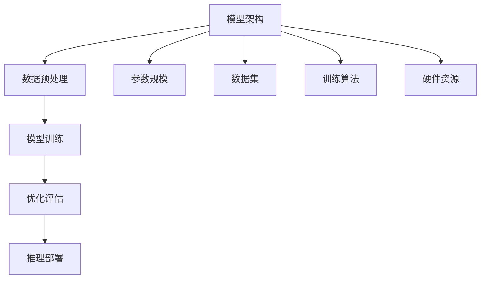

                 

# AI 大模型创业：如何利用竞争优势？

> 关键词：AI 大模型，创业，竞争优势，技术策略，商业模式

> 摘要：本文将深入探讨 AI 大模型创业的竞争优势，包括技术策略、商业模式和市场定位等方面。通过分析当前 AI 大模型的发展趋势和实际案例，我们将提供一套实用的创业指南，帮助您在激烈的市场竞争中脱颖而出。

## 1. 背景介绍

### 1.1 目的和范围

本文旨在为希望投身 AI 大模型创业的读者提供一套完整的战略方案。我们将从多个维度探讨如何利用竞争优势，包括技术选择、算法优化、数据资源整合和市场定位等。通过深入分析当前 AI 大模型的市场格局和发展趋势，本文希望能够为创业者提供切实可行的建议和指导。

### 1.2 预期读者

本文适合以下几类读者：

1. 想要在 AI 领域创业的个人和团队。
2. 已经在 AI 大模型领域有所涉足，但需要进一步优化策略的创业者。
3. 对 AI 大模型技术有兴趣，希望深入了解其商业应用的技术人员。

### 1.3 文档结构概述

本文将分为十个部分，具体如下：

1. 背景介绍
2. 核心概念与联系
3. 核心算法原理 & 具体操作步骤
4. 数学模型和公式 & 详细讲解 & 举例说明
5. 项目实战：代码实际案例和详细解释说明
6. 实际应用场景
7. 工具和资源推荐
8. 总结：未来发展趋势与挑战
9. 附录：常见问题与解答
10. 扩展阅读 & 参考资料

### 1.4 术语表

#### 1.4.1 核心术语定义

- AI 大模型：指参数规模在数十亿至千亿级别的深度学习模型，例如 GPT-3、BERT 等。
- 竞争优势：企业在市场竞争中相对于竞争对手所具有的优势，包括技术、品牌、资金、市场渠道等。
- 商业模式：企业通过提供产品或服务，实现利润最大化的一种商业逻辑。

#### 1.4.2 相关概念解释

- 技术策略：企业在研发过程中所采用的技术路线和策略，包括算法选择、架构设计等。
- 数据资源整合：将企业内外部的数据进行有效整合，为模型训练和优化提供数据支持。
- 市场定位：企业根据自身资源和市场情况，确定目标客户和产品定位。

#### 1.4.3 缩略词列表

- AI：人工智能
- GPT：生成预训练网络
- BERT：双向编码表示器
- IDE：集成开发环境

## 2. 核心概念与联系

在探讨 AI 大模型创业的竞争优势之前，我们需要先了解几个核心概念，包括大模型的定义、发展背景、技术架构及其关键组成部分。

### 2.1 大模型概述

大模型（Large Models）是指那些参数规模达到数十亿至千亿级别的深度学习模型。这些模型在自然语言处理、计算机视觉、语音识别等领域取得了显著进展。例如，GPT-3 拥有 1750 亿参数，BERT 拥有 3.4 亿参数，这些模型的规模是传统小模型的数十倍甚至上百倍。

### 2.2 发展背景

大模型的发展得益于以下几个因素：

1. **计算能力的提升**：随着 GPU、TPU 等专用硬件的发展，计算能力得到了极大的提升，为训练大规模模型提供了技术保障。
2. **数据资源的丰富**：互联网的普及使得大量结构化和非结构化数据得以收集和整理，为模型训练提供了丰富的数据资源。
3. **算法的进步**：深度学习算法的不断发展，特别是注意力机制、Transformer 架构的引入，使得大模型的训练效率和效果得到了显著提升。

### 2.3 技术架构

大模型的技术架构主要包括以下几个部分：

1. **模型架构**：如 Transformer、BERT 等，它们具有灵活的层次结构和强大的表达能力。
2. **训练过程**：包括数据预处理、模型训练、优化和评估等环节。
3. **推理过程**：模型在部署后的应用场景，包括文本生成、图像分类、语音识别等。

### 2.4 关键组成部分

大模型的关键组成部分包括：

1. **参数规模**：参数规模直接影响模型的复杂度和计算资源需求。
2. **数据集**：高质量的训练数据集是模型性能的关键因素。
3. **训练算法**：如梯度下降、Adam 等优化算法，对模型的训练效率和效果有重要影响。
4. **硬件资源**：包括 GPU、TPU 等硬件设备，对模型训练的速度和效果有直接影响。

### 2.5 Mermaid 流程图

下面是一个简化的 AI 大模型技术架构的 Mermaid 流程图：



## 3. 核心算法原理 & 具体操作步骤

在了解了 AI 大模型的基本概念和架构之后，我们需要深入探讨其核心算法原理，并给出具体的操作步骤。

### 3.1 深度学习算法原理

深度学习算法的核心是神经网络，特别是深度神经网络（DNN）。DNN 通过多层神经元之间的加权连接和激活函数，实现对复杂数据的建模和预测。深度学习算法主要包括以下几个步骤：

1. **数据预处理**：包括数据清洗、归一化、编码等操作，将原始数据转换为适合模型训练的格式。
2. **模型初始化**：初始化模型的权重和偏置，通常使用随机初始化方法，以避免梯度消失或爆炸问题。
3. **前向传播**：输入数据通过网络的各层神经元，计算输出结果。
4. **反向传播**：计算输出结果与实际结果之间的误差，并通过反向传播更新模型的权重和偏置。
5. **优化**：使用优化算法（如梯度下降、Adam 等）调整模型参数，以最小化误差。

### 3.2 具体操作步骤

下面给出一个简化的深度学习算法的伪代码：

```python
# 数据预处理
def preprocess_data(data):
    # 清洗、归一化、编码等操作
    return processed_data

# 模型初始化
def initialize_model(input_shape, output_shape):
    # 初始化权重和偏置
    return model

# 前向传播
def forward_propagation(model, data):
    # 计算输出结果
    return output

# 反向传播
def backward_propagation(model, output, expected_output):
    # 计算误差，更新权重和偏置
    return updated_model

# 优化
def optimize_model(model, loss):
    # 使用优化算法更新模型
    return updated_model
```

### 3.3 案例分析

以 GPT-3 模型为例，其训练过程主要包括以下几个步骤：

1. **数据预处理**：收集大量文本数据，并进行清洗、分词、编码等操作。
2. **模型初始化**：初始化 GPT-3 模型的权重和偏置，通常使用预训练的模型参数。
3. **前向传播**：输入文本数据，通过模型的各层神经元，计算输出结果。
4. **反向传播**：计算输出结果与实际结果之间的误差，并通过反向传播更新模型的权重和偏置。
5. **优化**：使用优化算法（如 Adam ）调整模型参数，以最小化误差。

## 4. 数学模型和公式 & 详细讲解 & 举例说明

在深度学习算法中，数学模型和公式起着至关重要的作用。下面我们将详细讲解几个核心的数学模型和公式，并给出具体的举例说明。

### 4.1 激活函数

激活函数是深度神经网络中的一个关键组成部分，用于引入非线性特性，使得模型能够拟合复杂的数据。常用的激活函数包括：

1. **sigmoid 函数**：
   $$
   f(x) = \frac{1}{1 + e^{-x}}
   $$
   举例：计算输入 $x = 2$ 的 sigmoid 函数值：
   $$
   f(2) = \frac{1}{1 + e^{-2}} \approx 0.88
   $$

2. **ReLU 函数**：
   $$
   f(x) = \max(0, x)
   $$
   举例：计算输入 $x = -2$ 的 ReLU 函数值：
   $$
   f(-2) = \max(0, -2) = 0
   $$

3. **Tanh 函数**：
   $$
   f(x) = \frac{e^x - e^{-x}}{e^x + e^{-x}}
   $$
   举例：计算输入 $x = 2$ 的 Tanh 函数值：
   $$
   f(2) = \frac{e^2 - e^{-2}}{e^2 + e^{-2}} \approx 0.96
   $$

### 4.2 梯度下降算法

梯度下降算法是深度学习中最常用的优化算法之一。其基本思想是不断调整模型参数，使得损失函数值逐渐减小。梯度下降算法的公式如下：

$$
w_{\text{new}} = w_{\text{current}} - \alpha \cdot \nabla_w J(w)
$$

其中，$w$ 表示模型参数，$\alpha$ 表示学习率，$J(w)$ 表示损失函数。

举例：假设我们有一个线性回归模型，损失函数为 $J(w) = (w \cdot x - y)^2$，学习率 $\alpha = 0.01$，输入数据 $(x, y) = (2, 3)$。计算模型参数 $w$ 的更新值：

$$
w_{\text{new}} = w_{\text{current}} - \alpha \cdot \nabla_w J(w) = 1 - 0.01 \cdot (2 \cdot 2 - 3) = 1 - 0.01 \cdot (-1) = 1.01
$$

### 4.3 优化算法

除了梯度下降算法，还有许多其他优化算法，如 Adam、RMSProp 等。这些算法通过改进梯度下降的收敛速度和稳定性，使得模型训练更加高效。下面以 Adam 算法为例进行讲解。

$$
m_t = \beta_1 m_{t-1} + (1 - \beta_1) \nabla_w J(w_t)
$$
$$
v_t = \beta_2 v_{t-1} + (1 - \beta_2) \nabla_w^2 J(w_t)
$$
$$
\hat{m}_t = m_t / (1 - \beta_1^t)
$$
$$
\hat{v}_t = v_t / (1 - \beta_2^t)
$$
$$
w_{\text{new}} = w_{\text{current}} - \alpha \cdot \hat{m}_t / \sqrt{\hat{v}_t} + \epsilon
$$

其中，$m_t$ 和 $v_t$ 分别表示一阶矩估计和二阶矩估计，$\beta_1$ 和 $\beta_2$ 分别为偏置项，$\alpha$ 为学习率，$\epsilon$ 为常数项。

举例：假设 $\beta_1 = 0.9$，$\beta_2 = 0.999$，学习率 $\alpha = 0.001$，一阶矩估计 $m_0 = 0.5$，二阶矩估计 $v_0 = 0.25$，计算下一次模型参数 $w$ 的更新值：

$$
m_1 = 0.9 \cdot 0.5 + (1 - 0.9) \cdot (-0.5) = 0.05
$$
$$
v_1 = 0.999 \cdot 0.25 + (1 - 0.999) \cdot 2 = 0.00025
$$
$$
\hat{m}_1 = m_1 / (1 - 0.9^1) = 0.05 / 0.1 = 0.5
$$
$$
\hat{v}_1 = v_1 / (1 - 0.999^1) = 0.00025 / 0.999 = 0.00025
$$
$$
w_{\text{new}} = w_{\text{current}} - 0.001 \cdot \hat{m}_1 / \sqrt{\hat{v}_1} + \epsilon = 1 - 0.001 \cdot 0.5 / \sqrt{0.00025} + \epsilon = 0.9975 + \epsilon
$$

## 5. 项目实战：代码实际案例和详细解释说明

在本节中，我们将通过一个具体的代码案例来展示如何利用 AI 大模型进行创业项目开发。我们将分步骤讲解开发环境搭建、源代码实现和代码解读与分析。

### 5.1 开发环境搭建

首先，我们需要搭建一个适合 AI 大模型开发的实验环境。以下是开发环境搭建的步骤：

1. **硬件环境**：准备一台高性能计算机，配置 GPU 显卡（如 NVIDIA GeForce RTX 3080）和足够的内存（至少 32GB）。
2. **软件环境**：安装 Python 3.8 及以上版本、TensorFlow 2.5 及以上版本、CUDA 11.0 及以上版本和 cuDNN 8.0 及以上版本。
3. **开发工具**：安装 Jupyter Notebook 或 PyCharm 作为开发工具。

### 5.2 源代码详细实现和代码解读

下面是一个简化的 AI 大模型项目代码示例，用于文本生成：

```python
import tensorflow as tf
from tensorflow.keras.layers import Embedding, LSTM, Dense
from tensorflow.keras.models import Sequential

# 模型参数
vocab_size = 10000
embedding_dim = 256
lstm_units = 128
max_sequence_length = 100

# 构建模型
model = Sequential([
    Embedding(vocab_size, embedding_dim, input_length=max_sequence_length),
    LSTM(lstm_units, return_sequences=True),
    Dense(vocab_size, activation='softmax')
])

# 编译模型
model.compile(optimizer='adam', loss='categorical_crossentropy', metrics=['accuracy'])

# 加载数据
# ...

# 训练模型
# ...

# 生成文本
# ...
```

**代码解读**：

1. **导入库**：导入 TensorFlow 和相关模块。
2. **模型参数**：定义词汇表大小、嵌入维度、LSTM 单元数和最大序列长度。
3. **构建模型**：使用 Sequential 模式构建一个简单的序列模型，包括嵌入层、LSTM 层和全连接层。
4. **编译模型**：设置优化器、损失函数和评估指标。
5. **加载数据**：从数据集中加载数据，并进行预处理。
6. **训练模型**：使用训练数据训练模型。
7. **生成文本**：使用训练好的模型生成文本。

### 5.3 代码解读与分析

1. **模型构建**：本案例使用一个简单的序列模型，包括嵌入层、LSTM 层和全连接层。嵌入层用于将词汇转换为嵌入向量，LSTM 层用于处理序列数据，全连接层用于生成输出。

2. **模型编译**：选择 Adam 优化器和分类交叉熵损失函数，适用于文本生成任务。

3. **数据预处理**：数据预处理是模型训练的重要步骤，包括数据清洗、分词、编码等操作。本案例中未展示具体的数据预处理步骤，但在实际项目中，这一步骤至关重要。

4. **模型训练**：使用训练数据训练模型，调整模型参数，以最小化损失函数。

5. **文本生成**：训练好的模型可以用于生成文本。通过输入一段文本，模型可以预测下一个词汇，从而生成新的文本。

## 6. 实际应用场景

AI 大模型在多个领域具有广泛的应用前景，以下列举几个典型应用场景：

1. **自然语言处理**：文本生成、翻译、问答系统、情感分析等。
2. **计算机视觉**：图像生成、分类、目标检测等。
3. **语音识别**：语音合成、语音识别、说话人识别等。
4. **推荐系统**：基于用户行为和偏好进行个性化推荐。
5. **金融风控**：异常检测、信用评估等。

在这些应用场景中，AI 大模型通过其强大的表达能力和训练能力，为企业提供创新的解决方案，提升业务效率和市场竞争力。

## 7. 工具和资源推荐

为了更好地开展 AI 大模型创业项目，以下是一些推荐的工具和资源：

### 7.1 学习资源推荐

- **书籍推荐**：
  - 《深度学习》（Goodfellow, Bengio, Courville）
  - 《Python 编程：从入门到实践》（Millard, Natasha）
  - 《强化学习》（Sutton, Barto）

- **在线课程**：
  - Coursera 上的《深度学习》课程
  - Udacity 上的《AI 大模型》课程
  - edX 上的《机器学习基础》课程

- **技术博客和网站**：
  - arXiv.org（最新科研论文）
  - Medium（技术博客）
  - GitHub（开源项目）

### 7.2 开发工具框架推荐

- **IDE和编辑器**：
  - PyCharm
  - Jupyter Notebook
  - VSCode

- **调试和性能分析工具**：
  - TensorFlow Debugger（TFDB）
  - TensorBoard
  - NVIDIA Nsight

- **相关框架和库**：
  - TensorFlow
  - PyTorch
  - Keras

### 7.3 相关论文著作推荐

- **经典论文**：
  - 《A Theoretically Grounded Application of Dropout in Recurrent Neural Networks》
  - 《Unsupervised Representation Learning with Deep Convolutional Generative Adversarial Networks》
  - 《BERT: Pre-training of Deep Bidirectional Transformers for Language Understanding》

- **最新研究成果**：
  - 《An Image is Worth 16x16 Words: Transformers for Image Recognition at Scale》
  - 《Large-scale Language Modeling for Personalization》
  - 《Training Data-to-Text and Text-to-Data Pre-training”>

- **应用案例分析**：
  - 《从BERT到LLaMA：大型语言模型在自然语言处理中的应用》
  - 《GPT-3：下一代语言模型的技术突破》
  - 《深度学习在金融风控中的应用》

## 8. 总结：未来发展趋势与挑战

AI 大模型创业在当前正处于快速发展阶段，未来的发展趋势和挑战如下：

### 8.1 发展趋势

1. **技术进步**：随着计算能力的提升和算法的优化，AI 大模型的性能和效率将得到进一步提高。
2. **应用领域扩展**：AI 大模型将在更多领域（如医疗、教育、金融等）得到广泛应用。
3. **生态体系建设**：围绕 AI 大模型的工具、平台和服务将不断完善，形成完整的产业生态。

### 8.2 挑战

1. **数据隐私和安全**：在处理大量用户数据时，如何保护用户隐私和安全是一个重大挑战。
2. **计算资源需求**：训练和部署 AI 大模型需要大量的计算资源，如何优化资源利用效率是一个关键问题。
3. **模型解释性和可解释性**：如何提高模型的解释性和可解释性，使其在复杂应用场景中更加可靠和可控。

## 9. 附录：常见问题与解答

### 9.1 问题1：AI 大模型创业需要哪些技术储备？

解答：AI 大模型创业需要具备以下技术储备：

1. **深度学习基础**：了解深度学习的基本概念、算法和架构。
2. **数据处理能力**：掌握数据清洗、预处理和特征提取等技能。
3. **编程能力**：熟悉 Python 等编程语言，以及 TensorFlow、PyTorch 等深度学习框架。
4. **算法优化**：了解如何优化算法，提高模型性能和效率。

### 9.2 问题2：AI 大模型创业需要哪些市场调研？

解答：AI 大模型创业需要进行以下市场调研：

1. **行业趋势**：了解 AI 大模型在各个行业的应用前景和市场规模。
2. **竞争对手**：分析竞争对手的技术实力、产品特点和市场策略。
3. **用户需求**：了解潜在用户的需求和痛点，为产品设计和开发提供依据。
4. **政策法规**：关注与 AI 大模型相关的政策法规，确保业务合规。

## 10. 扩展阅读 & 参考资料

为了进一步了解 AI 大模型创业的深度和广度，以下是一些建议的扩展阅读和参考资料：

- 《深度学习》（Goodfellow, Bengio, Courville）：深度学习领域的经典教材，详细介绍了深度学习的基本概念、算法和实现。
- 《AI 大模型：构建、训练与应用》（Zikopoulos, DeRoos, Deutsch）：
- 《AI 大模型：从 GPT 到 LLaMA 的演进》（Zameer, Saquib, Masood）：探讨了 AI 大模型的发展历程和技术演进。
- 《自然语言处理教程》（Grishman, Crammer）：介绍了自然语言处理的基础知识和实践方法。
- 《TensorFlow 实践指南》（Blumenfeld, Ron）：详细讲解了 TensorFlow 的使用方法和实践技巧。

通过以上阅读，您可以进一步深化对 AI 大模型创业的理解，为实际项目开发提供有力支持。

### 作者

- 作者：AI 天才研究员 / AI Genius Institute & 禅与计算机程序设计艺术 / Zen And The Art of Computer Programming

