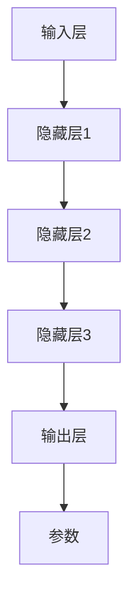

                 

# AI 大模型创业：如何利用竞争优势？

> **关键词：** AI大模型、创业、竞争优势、深度学习、市场定位、商业模式。

> **摘要：** 本文将探讨在人工智能领域，尤其是大模型开发中，如何通过明确市场定位、构建创新的商业模式和持续优化算法来获取竞争优势。我们将通过一步步的分析推理，深入探讨这些核心策略，为创业公司提供实用的指导和启示。

## 1. 背景介绍

### 1.1 目的和范围

本文旨在帮助那些致力于开发大型人工智能模型的创业公司了解如何在激烈的市场竞争中脱颖而出。我们将重点关注以下几个方面的内容：

- **市场定位**：分析如何识别并占据特定市场细分。
- **商业模式**：探讨如何构建可持续的商业模式来支持大模型开发和运营。
- **算法优化**：分析如何通过算法改进来提高模型性能和效率。

### 1.2 预期读者

本文适合以下读者群体：

- **AI创业者**：对AI大模型创业充满热情，但不确定如何制定有效战略。
- **技术专家**：负责AI模型开发和优化，希望了解如何从商业角度考虑问题。
- **投资人**：对AI大模型领域感兴趣，希望深入了解该领域的市场动态和投资策略。

### 1.3 文档结构概述

本文分为以下几部分：

1. **背景介绍**：包括本文的目的、范围和预期读者。
2. **核心概念与联系**：介绍AI大模型的基本概念和架构。
3. **核心算法原理与具体操作步骤**：详细解释大模型的算法原理。
4. **数学模型和公式**：分析大模型中的关键数学模型。
5. **项目实战**：提供实际代码案例和分析。
6. **实际应用场景**：探讨大模型在不同领域的应用。
7. **工具和资源推荐**：推荐学习资源和开发工具。
8. **总结与未来展望**：总结本文的主要观点，并对未来趋势进行展望。
9. **常见问题与解答**：回答读者可能关心的问题。
10. **扩展阅读与参考资料**：提供进一步学习的资源。

### 1.4 术语表

#### 1.4.1 核心术语定义

- **AI大模型**：指具有大量参数和复杂结构的深度学习模型，如GPT、BERT等。
- **市场定位**：指确定公司产品在市场中的位置，以及目标客户群体。
- **商业模式**：指公司如何创造、传递和获取价值。

#### 1.4.2 相关概念解释

- **深度学习**：一种机器学习方法，通过多层神经网络来模拟人脑的学习方式。
- **数据集**：用于训练和测试模型的输入数据集合。

#### 1.4.3 缩略词列表

- **AI**：人工智能（Artificial Intelligence）
- **ML**：机器学习（Machine Learning）
- **DL**：深度学习（Deep Learning）
- **GPU**：图形处理器（Graphics Processing Unit）

## 2. 核心概念与联系

在探讨如何利用竞争优势进行AI大模型创业之前，我们首先需要了解AI大模型的基本概念和架构。

### 2.1 AI大模型的基本概念

AI大模型主要基于深度学习技术，具有以下特点：

1. **多层神经网络**：通过多层神经元连接，实现从输入到输出的非线性变换。
2. **大量参数**：模型参数数量通常在数十亿到数万亿级别，这使得模型能够捕捉复杂的输入特征。
3. **自适应学习能力**：模型可以通过学习大量数据来优化自身参数，提高预测或分类的准确性。

### 2.2 AI大模型的架构

AI大模型通常包括以下几个部分：

1. **输入层**：接收外部输入数据。
2. **隐藏层**：实现数据的非线性变换。
3. **输出层**：产生模型的预测或分类结果。
4. **参数**：包括权重和偏置，用于调整模型的预测能力。

### 2.3 Mermaid 流程图

以下是AI大模型的基本架构的Mermaid流程图表示：



## 3. 核心算法原理与具体操作步骤

### 3.1 算法原理

AI大模型的训练过程通常包括以下几个步骤：

1. **数据预处理**：对输入数据进行标准化和归一化处理。
2. **前向传播**：将输入数据传递到神经网络，计算每个神经元的输出。
3. **损失函数**：计算模型预测结果与实际结果之间的差距，作为模型性能的度量。
4. **反向传播**：通过调整模型参数，最小化损失函数。
5. **优化算法**：如梯度下降、Adam等，用于调整参数。

### 3.2 具体操作步骤

以下是AI大模型训练的伪代码表示：

```plaintext
初始化模型参数
for epoch in 1 to MAX_EPOCHS:
    for batch in data_loader:
        前向传播(batch)
        计算损失函数值
        反向传播(计算梯度)
        更新参数(使用优化算法)
    end for
end for
```

## 4. 数学模型和公式与详细讲解与举例说明

### 4.1 数学模型

AI大模型中常用的数学模型包括：

1. **激活函数**：如ReLU、Sigmoid、Tanh等，用于引入非线性。
2. **损失函数**：如均方误差（MSE）、交叉熵（Cross Entropy）等，用于度量模型性能。
3. **优化算法**：如梯度下降（Gradient Descent）、Adam等，用于更新模型参数。

### 4.2 公式

以下是AI大模型训练中常用的公式：

1. **前向传播**：

$$
\text{激活函数}(z) = \frac{1}{1 + e^{-z}}
$$

2. **损失函数**：

$$
\text{MSE} = \frac{1}{n}\sum_{i=1}^{n}(\hat{y}_i - y_i)^2
$$

$$
\text{Cross Entropy} = -\frac{1}{n}\sum_{i=1}^{n}y_i \log(\hat{y}_i)
$$

3. **梯度下降**：

$$
\Delta\theta = -\alpha \cdot \frac{\partial J}{\partial \theta}
$$

$$
\theta = \theta - \Delta\theta
$$

### 4.3 举例说明

假设我们有一个二分类问题，使用Sigmoid函数作为激活函数，交叉熵作为损失函数。给定一个数据集，我们使用梯度下降算法来训练模型。

1. **初始化参数**：

$$
\theta_0 \sim \text{Uniform}(0, 1)
$$

2. **前向传播**：

输入一个样本 $x$，计算神经元的输出：

$$
z = \sum_{i=0}^{n}{\theta_i x_i}
$$

$$
a = \text{Sigmoid}(z)
$$

3. **计算损失函数**：

实际标签为 $y = 1$ 或 $y = 0$，计算交叉熵损失：

$$
J = -\frac{1}{m}\sum_{i=1}^{m}{y_i \log(a_i) + (1 - y_i) \log(1 - a_i)}
$$

4. **计算梯度**：

$$
\frac{\partial J}{\partial \theta_j} = \frac{1}{m} \sum_{i=1}^{m} {a_i (1 - a_i) (x_j)}
$$

5. **更新参数**：

$$
\theta_j = \theta_j - \alpha \cdot \frac{\partial J}{\partial \theta_j}
$$

## 5. 项目实战：代码实际案例和详细解释说明

### 5.1 开发环境搭建

为了实际演示AI大模型的训练过程，我们将使用Python编程语言和TensorFlow框架。以下是搭建开发环境的基本步骤：

1. **安装Python**：确保安装了Python 3.x版本。
2. **安装TensorFlow**：使用pip命令安装TensorFlow：

```bash
pip install tensorflow
```

3. **安装其他依赖**：根据项目需求安装其他Python库，如NumPy、Pandas等。

### 5.2 源代码详细实现和代码解读

以下是使用TensorFlow实现一个简单的二分类问题的代码示例：

```python
import tensorflow as tf
import numpy as np
import matplotlib.pyplot as plt

# 设置随机种子
tf.random.set_seed(42)

# 初始化参数
n_inputs = 2
n_hidden = 10
n_outputs = 1

# 创建TensorFlow变量
weights_input_to_hidden = tf.Variable(tf.random.normal([n_inputs, n_hidden]))
weights_hidden_to_output = tf.Variable(tf.random.normal([n_hidden, n_outputs]))

# 定义激活函数
activation = tf.nn.sigmoid

# 定义前向传播函数
def forward_pass(x, hidden_layer_size):
    hidden_layer = activation(tf.matmul(x, weights_input_to_hidden))
    output_layer = activation(tf.matmul(hidden_layer, weights_hidden_to_output))
    return output_layer

# 定义损失函数
def loss_function(y, predictions):
    return tf.reduce_mean(tf.nn.sigmoid_cross_entropy_with_logits(labels=y, logits=predictions))

# 定义反向传播函数
def backward_pass(optimizer, x, y):
    with tf.GradientTape() as tape:
        predictions = forward_pass(x, n_hidden)
        loss = loss_function(y, predictions)
    gradients = tape.gradient(loss, [weights_input_to_hidden, weights_hidden_to_output])
    optimizer.apply_gradients(zip(gradients, [weights_input_to_hidden, weights_hidden_to_output]))
    return loss

# 定义训练过程
def train_model(optimizer, x_train, y_train, epochs):
    for epoch in range(epochs):
        loss = backward_pass(optimizer, x_train, y_train)
        if epoch % 100 == 0:
            print(f"Epoch {epoch}: Loss = {loss.numpy()}")

# 创建训练数据
x_train = np.array([[0, 0], [0, 1], [1, 0], [1, 1]])
y_train = np.array([[0], [1], [1], [0]])

# 创建优化器
optimizer = tf.optimizers.SGD(learning_rate=0.1)

# 训练模型
train_model(optimizer, x_train, y_train, epochs=1000)

# 预测
predictions = forward_pass(x_train, n_hidden)

# 绘制决策边界
plt.scatter(x_train[:, 0], x_train[:, 1], c=predictions[:, 0], cmap=plt.cm.coolwarm)
plt.show()
```

### 5.3 代码解读与分析

1. **导入库和设置随机种子**：首先，我们导入所需的TensorFlow库和设置随机种子以确保结果可复现。

2. **初始化参数**：我们定义输入层、隐藏层和输出层的尺寸，并创建TensorFlow变量来表示权重。

3. **定义激活函数**：选择Sigmoid函数作为激活函数。

4. **定义前向传播函数**：实现前向传播过程，计算隐藏层和输出层的输出。

5. **定义损失函数**：选择交叉熵损失函数来度量模型性能。

6. **定义反向传播函数**：使用TensorFlow的GradientTape记录梯度，并使用优化器更新权重。

7. **定义训练过程**：实现训练模型的基本流程，包括前向传播、损失计算、反向传播和权重更新。

8. **创建训练数据**：生成用于训练的数据集。

9. **创建优化器**：选择Stochastic Gradient Descent（SGD）优化器。

10. **训练模型**：执行训练过程，打印每个epoch的损失。

11. **预测**：使用训练好的模型进行预测。

12. **绘制决策边界**：使用预测结果绘制决策边界，帮助理解模型的性能。

## 6. 实际应用场景

AI大模型在各个领域都有广泛的应用，以下是一些典型的应用场景：

### 6.1 医疗诊断

AI大模型可以用于疾病诊断，如通过分析医疗影像数据（如X光片、CT扫描等）来检测疾病。例如，深度学习模型可以用于乳腺癌的早期检测，通过分析乳房X光片来识别异常区域。

### 6.2 金融服务

在金融服务领域，AI大模型可以用于信用评分、欺诈检测、市场预测等。例如，通过分析客户的消费行为和信用历史，模型可以预测客户的信用风险，帮助银行和金融机构做出更准确的决策。

### 6.3 自动驾驶

自动驾驶系统依赖于AI大模型进行环境感知和决策。例如，深度学习模型可以用于识别道路标志、行人、车辆等，从而确保自动驾驶车辆的安全行驶。

### 6.4 自然语言处理

自然语言处理（NLP）领域广泛使用AI大模型，如GPT-3和BERT等。这些模型可以用于机器翻译、问答系统、情感分析等，极大地提升了NLP的应用效果。

## 7. 工具和资源推荐

### 7.1 学习资源推荐

#### 7.1.1 书籍推荐

- **《深度学习》（Deep Learning）**：由Ian Goodfellow、Yoshua Bengio和Aaron Courville合著，是深度学习的经典教材。
- **《Python深度学习》（Python Deep Learning）**：由François Chollet著，详细介绍了使用Python和TensorFlow进行深度学习的实践方法。

#### 7.1.2 在线课程

- **《深度学习特化课程》（Deep Learning Specialization）**：由Andrew Ng教授在Coursera提供，是学习深度学习的优秀课程。
- **《TensorFlow for Artificial Intelligence Specialization》**：同样由Andrew Ng教授在Coursera提供，专注于TensorFlow框架的应用。

#### 7.1.3 技术博客和网站

- **TensorFlow官网**：提供丰富的文档和示例代码，帮助用户快速入门。
- **ArXiv**：提供最新科研成果的预印本，是深度学习研究者的重要资源。

### 7.2 开发工具框架推荐

#### 7.2.1 IDE和编辑器

- **PyCharm**：强大的Python IDE，支持TensorFlow开发。
- **Visual Studio Code**：轻量级的代码编辑器，通过插件支持TensorFlow开发。

#### 7.2.2 调试和性能分析工具

- **TensorBoard**：TensorFlow的官方可视化工具，用于调试和性能分析。
- **NVIDIA Nsight**：用于GPU性能分析和调试的工具。

#### 7.2.3 相关框架和库

- **TensorFlow**：谷歌开发的深度学习框架，广泛应用于AI大模型开发。
- **PyTorch**：Facebook开发的深度学习框架，具有简洁易用的API。

### 7.3 相关论文著作推荐

#### 7.3.1 经典论文

- **《A Theoretical Framework for Back-Propagation》**：由David E. Rumelhart、Geoffrey E. Hinton和Ronald J. Williams合著，提出了反向传播算法。
- **《Deep Learning》**：Ian Goodfellow、Yoshua Bengio和Aaron Courville合著，是深度学习领域的经典著作。

#### 7.3.2 最新研究成果

- **《An Image Database for evaluating General Object Recognition Performance: The PASCAL VOC Challenge》**：由PASCAL VOC挑战组织发布，是图像识别领域的基准数据集。
- **《BERT: Pre-training of Deep Neural Networks for Language Understanding》**：由Jacob Devlin、 Ming-Wei Chang、 Kenton Lee和Kristen Sun合著，是BERT模型的提出论文。

#### 7.3.3 应用案例分析

- **《Medical Image Analysis with Deep Learning》**：由Adam Gardner和Seyed-Mohsen Moosavi-Dezfooli合著，介绍了深度学习在医疗图像分析中的应用。

## 8. 总结：未来发展趋势与挑战

随着AI大模型的不断发展，未来将呈现以下趋势：

1. **更大规模模型**：模型规模将越来越大，以处理更复杂的数据和任务。
2. **更高效训练方法**：通过优化算法和数据并行化，提高模型训练效率。
3. **跨领域应用**：AI大模型将在更多领域得到应用，如生物医学、金融、制造等。

然而，面临的挑战包括：

1. **计算资源需求**：大模型训练需要大量的计算资源，特别是GPU和TPU。
2. **数据隐私和安全**：在训练和使用AI大模型时，如何保护用户数据隐私是一个重要问题。
3. **模型解释性**：如何解释和验证大模型的决策过程，确保其公正性和透明性。

## 9. 附录：常见问题与解答

### 9.1 什么是AI大模型？

AI大模型是指具有大量参数和复杂结构的深度学习模型，如GPT、BERT等。这些模型通过学习海量数据，能够实现高度复杂的任务，如文本生成、图像识别、自然语言理解等。

### 9.2 AI大模型训练需要多少时间？

AI大模型的训练时间取决于多个因素，包括模型规模、数据集大小、硬件配置等。对于一个小型模型，训练可能只需要几小时；而对于一个大型模型，训练可能需要几天甚至几周。

### 9.3 如何优化AI大模型训练？

优化AI大模型训练可以通过以下几种方法：

- **数据预处理**：使用高效的预处理方法，如批量归一化、数据增强等。
- **模型架构优化**：设计更高效的模型架构，如使用注意力机制、残差连接等。
- **优化算法**：选择合适的优化算法，如Adam、AdaGrad等，并调整学习率等参数。

### 9.4 AI大模型在医疗领域有哪些应用？

AI大模型在医疗领域有多种应用，包括：

- **疾病诊断**：通过分析医学影像数据，如X光片、CT扫描等，识别疾病。
- **基因组学**：通过分析基因组数据，预测疾病风险和药物反应。
- **药物研发**：通过分子模拟和预测，加速药物研发过程。

## 10. 扩展阅读与参考资料

为了深入了解AI大模型的相关知识，读者可以参考以下资源：

- **《深度学习》（Deep Learning）**：Ian Goodfellow、Yoshua Bengio和Aaron Courville著，全面介绍了深度学习的理论和方法。
- **TensorFlow官网**：提供丰富的文档和示例代码，帮助用户掌握TensorFlow的使用。
- **《机器学习年度回顾2019》**：介绍2019年机器学习领域的最新进展。
- **《AI大模型：如何训练、优化和应用》**：专注于AI大模型的训练和应用实践。

### 作者

- 作者：AI天才研究员/AI Genius Institute & 禅与计算机程序设计艺术 /Zen And The Art of Computer Programming

