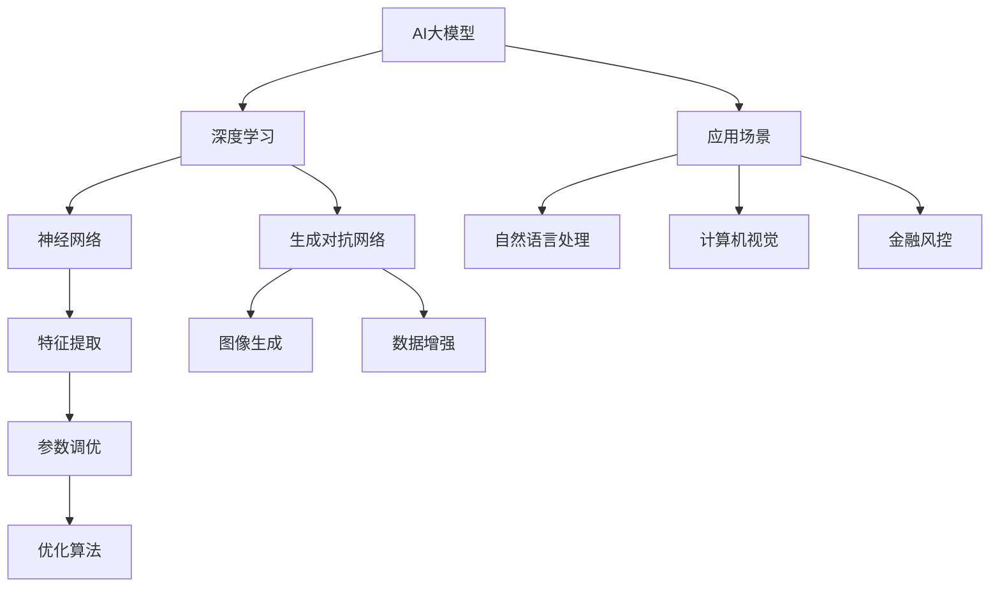

                 

# AI 大模型创业：如何利用竞争优势？

> 关键词：人工智能、大模型、创业、竞争优势、算法原理、数学模型、项目实战、应用场景

> 摘要：本文将深入探讨AI大模型创业领域的核心话题——如何利用竞争优势。我们将从背景介绍、核心概念、算法原理、数学模型、项目实战、应用场景等多个方面进行分析，旨在为创业者提供有价值的指导和策略。

## 1. 背景介绍

### 1.1 目的和范围

本文旨在帮助AI大模型创业领域的从业者，深入理解如何利用竞争优势，以实现企业的持续增长和市场领导。本文将涵盖以下几个方面的内容：

- **核心概念**：介绍AI大模型的基础知识，包括概念、架构和应用场景。
- **算法原理**：详细阐述AI大模型的算法原理，包括训练过程、优化策略和评估方法。
- **数学模型**：讲解大模型背后的数学原理，包括线性代数、概率论和优化理论。
- **项目实战**：通过实际案例，展示如何构建和部署AI大模型。
- **应用场景**：探讨AI大模型在不同行业和领域的应用，以及面临的挑战和解决方案。
- **工具和资源推荐**：提供学习资源、开发工具和框架的推荐。
- **未来发展趋势**：分析AI大模型创业的未来趋势和潜在挑战。

### 1.2 预期读者

本文适合以下读者群体：

- **AI从业者**：对AI大模型有一定了解，希望深入了解其竞争优势和应用场景。
- **创业者**：正在考虑AI大模型创业，希望获取相关策略和指导。
- **研究人员**：对AI大模型的理论和实践有兴趣，希望了解最新研究成果。
- **学生和学者**：对AI和创业感兴趣，希望拓展相关知识。

### 1.3 文档结构概述

本文分为十个部分，结构如下：

1. 背景介绍
   - 1.1 目的和范围
   - 1.2 预期读者
   - 1.3 文档结构概述
   - 1.4 术语表
2. 核心概念与联系
3. 核心算法原理 & 具体操作步骤
4. 数学模型和公式 & 详细讲解 & 举例说明
5. 项目实战：代码实际案例和详细解释说明
6. 实际应用场景
7. 工具和资源推荐
8. 总结：未来发展趋势与挑战
9. 附录：常见问题与解答
10. 扩展阅读 & 参考资料

### 1.4 术语表

#### 1.4.1 核心术语定义

- **AI大模型**：指具有大规模参数、能够处理海量数据并实现高精度预测的机器学习模型。
- **竞争优势**：指企业在市场上相对于竞争对手所拥有的独特优势和优势地位。
- **算法原理**：指机器学习算法的原理和机制，包括数据预处理、模型训练、优化策略等。
- **数学模型**：指用于描述和解决问题的数学表达式和方法。
- **项目实战**：指在实际项目中应用AI大模型的过程，包括数据收集、模型构建、部署和优化等。
- **应用场景**：指AI大模型在不同领域和行业的应用，如自然语言处理、计算机视觉、金融风控等。

#### 1.4.2 相关概念解释

- **深度学习**：一种基于神经网络的机器学习方法，通过多层非线性变换，实现数据的自动特征提取和表示。
- **神经网络**：一种由大量神经元连接而成的计算模型，用于模拟人脑的信息处理能力。
- **参数调优**：指在机器学习模型训练过程中，调整模型参数，以实现更好的性能和效果。
- **优化算法**：指用于求解优化问题的算法，如梯度下降、随机梯度下降、Adam等。
- **评价指标**：指用于评估机器学习模型性能的指标，如准确率、召回率、F1分数等。

#### 1.4.3 缩略词列表

- **AI**：人工智能
- **ML**：机器学习
- **DL**：深度学习
- **NLP**：自然语言处理
- **CV**：计算机视觉
- **GAN**：生成对抗网络
- **CNN**：卷积神经网络
- **RNN**：循环神经网络
- **LSTM**：长短时记忆网络
- **Transformer**：变换器模型

## 2. 核心概念与联系

在AI大模型创业领域，理解核心概念和它们之间的联系至关重要。以下是一个简化的Mermaid流程图，用于展示这些核心概念及其相互关系。



### 2.1 AI大模型

AI大模型是指具有大规模参数、能够处理海量数据并实现高精度预测的机器学习模型。其核心在于深度学习和神经网络技术，通过多层非线性变换，实现数据的自动特征提取和表示。大模型在处理复杂数据集时，能够获得更高的准确性和泛化能力。

### 2.2 深度学习

深度学习是一种基于神经网络的机器学习方法，通过多层非线性变换，实现数据的自动特征提取和表示。深度学习模型具有强大的表达能力和自适应能力，能够解决传统机器学习算法难以处理的问题。

### 2.3 神经网络

神经网络是一种由大量神经元连接而成的计算模型，用于模拟人脑的信息处理能力。神经网络通过前向传播和反向传播，实现数据的输入和输出。神经网络的核心是权重和偏置的调整，以实现更好的拟合和预测效果。

### 2.4 特征提取

特征提取是指从原始数据中提取出对任务有代表性的特征。在AI大模型中，特征提取是关键的一步，它能够提高模型的性能和效率。常用的特征提取方法包括特征工程、特征选择和特征降维。

### 2.5 参数调优

参数调优是指在机器学习模型训练过程中，调整模型参数，以实现更好的性能和效果。参数调优包括学习率、批量大小、正则化等超参数的调整，以及权重和偏置的微调。参数调优是提高模型性能的重要手段。

### 2.6 优化算法

优化算法是指用于求解优化问题的算法，如梯度下降、随机梯度下降、Adam等。优化算法在模型训练过程中，用于计算参数的梯度，并根据梯度调整参数，以实现模型的优化和收敛。

### 2.7 应用场景

应用场景是指AI大模型在不同领域和行业的应用。AI大模型在自然语言处理、计算机视觉、金融风控等领域的表现和潜力巨大，为企业和创业者提供了丰富的商业机会。

### 2.8 其他相关概念

除了上述核心概念，还有许多其他相关概念，如生成对抗网络、卷积神经网络、循环神经网络、长短时记忆网络等。这些概念在AI大模型领域发挥着重要作用，丰富了模型的应用场景和功能。

## 3. 核心算法原理 & 具体操作步骤

在AI大模型创业过程中，核心算法原理的理解和掌握至关重要。以下将详细讲解深度学习模型的训练过程、优化策略和评估方法。

### 3.1 深度学习模型的训练过程

深度学习模型的训练过程可以分为以下四个主要步骤：

#### 3.1.1 数据预处理

数据预处理是训练深度学习模型的第一步，其目的是将原始数据转换为适合模型输入的形式。数据预处理包括数据清洗、数据归一化和数据增强等操作。

- **数据清洗**：删除或修复数据集中的错误、缺失和异常值。
- **数据归一化**：将数据缩放到一个特定的范围，如[0, 1]或[-1, 1]。
- **数据增强**：通过随机旋转、缩放、裁剪、翻转等方法，增加数据集的多样性，以提高模型的泛化能力。

#### 3.1.2 模型初始化

模型初始化是指初始化模型的权重和偏置。常用的初始化方法包括随机初始化、高斯初始化和Xavier初始化等。

- **随机初始化**：将权重和偏置随机初始化为较小的数值。
- **高斯初始化**：将权重和偏置初始化为服从高斯分布的数值。
- **Xavier初始化**：将权重和偏置初始化为服从Xavier分布的数值，以避免梯度消失和梯度爆炸问题。

#### 3.1.3 前向传播

前向传播是指将输入数据通过模型的前向传递，计算输出结果。在前向传播过程中，模型会通过逐层计算，将输入数据转换为输出数据。

```python
# 前向传播伪代码
for layer in model.layers:
    output = layer.forward(input)
    input = output
```

#### 3.1.4 反向传播

反向传播是指通过计算输出结果与真实值之间的误差，反向传播误差到模型的输入层，以更新模型的权重和偏置。

```python
# 反向传播伪代码
for layer in model.layers[::-1]:
    error = layer.backward(output, input)
    input = error
```

#### 3.1.5 参数更新

在反向传播过程中，会计算每个参数的梯度。参数更新是指根据梯度更新模型的权重和偏置，以降低误差。

```python
# 参数更新伪代码
for parameter in model.parameters():
    parameter.update(parameter.grad())
```

### 3.2 优化策略

优化策略是指在模型训练过程中，调整模型的参数，以提高模型的性能和效果。以下是一些常用的优化策略：

#### 3.2.1 梯度下降

梯度下降是一种最基本的优化策略，通过计算模型参数的梯度，沿着梯度的反方向更新参数，以降低误差。

```python
# 梯度下降伪代码
for epoch in range(num_epochs):
    for data in dataset:
        model.forward(data.input)
        model.backward(data.target)
        model.update_parameters()
```

#### 3.2.2 随机梯度下降

随机梯度下降（SGD）是对梯度下降的改进，每次只随机选择一个样本进行参数更新，以提高模型的泛化能力。

```python
# 随机梯度下降伪代码
for epoch in range(num_epochs):
    for data in dataset:
        model.forward(data.input)
        model.backward(data.target)
        model.update_parameters(data.input)
```

#### 3.2.3 Adam优化器

Adam优化器是一种结合了SGD和动量法的优化器，通过计算一阶矩估计和二阶矩估计，自适应调整学习率。

```python
# Adam优化器伪代码
for epoch in range(num_epochs):
    for data in dataset:
        model.forward(data.input)
        model.backward(data.target)
        model.update_parameters(learning_rate, beta1, beta2)
```

### 3.3 评估方法

评估方法是用于评估模型性能和效果的一种手段。以下是一些常用的评估方法：

#### 3.3.1 准确率

准确率是指模型预测正确的样本数量与总样本数量的比值。

```python
# 准确率伪代码
accuracy = correct_predictions / total_predictions
```

#### 3.3.2 召回率

召回率是指模型预测正确的正类样本数量与实际正类样本数量的比值。

```python
# 召回率伪代码
recall = correct_positive_predictions / actual_positive_predictions
```

#### 3.3.4 F1分数

F1分数是准确率和召回率的加权平均，用于综合评估模型性能。

```python
# F1分数伪代码
f1_score = 2 * (accuracy * recall) / (accuracy + recall)
```

## 4. 数学模型和公式 & 详细讲解 & 举例说明

在AI大模型创业过程中，理解数学模型和公式是至关重要的。以下将详细讲解AI大模型背后的数学原理，包括线性代数、概率论和优化理论。

### 4.1 线性代数

线性代数是AI大模型的基础，包括矩阵运算、向量运算和线性方程组的求解。

#### 4.1.1 矩阵运算

矩阵运算是线性代数中的核心内容，包括矩阵的加法、减法、乘法和除法。

- **矩阵加法**：两个矩阵对应位置上的元素相加。

  $$ C = A + B $$

- **矩阵减法**：两个矩阵对应位置上的元素相减。

  $$ C = A - B $$

- **矩阵乘法**：两个矩阵对应行和列上的元素相乘并求和。

  $$ C = AB $$

- **矩阵除法**：矩阵除法通常通过求解线性方程组来实现。

  $$ AX = B $$

  通过求解X，可以得到矩阵A的逆矩阵。

#### 4.1.2 向量运算

向量运算是线性代数中的另一个重要方面，包括向量的加法、减法、标量乘法和向量的内积。

- **向量加法**：两个向量对应位置上的元素相加。

  $$ \vec{C} = \vec{A} + \vec{B} $$

- **向量减法**：两个向量对应位置上的元素相减。

  $$ \vec{C} = \vec{A} - \vec{B} $$

- **标量乘法**：向量的每个元素乘以一个标量。

  $$ \vec{C} = k\vec{A} $$

- **向量的内积**：两个向量的对应元素相乘并求和。

  $$ \vec{A} \cdot \vec{B} = \sum_{i=1}^{n} a_i b_i $$

### 4.2 概率论

概率论是AI大模型中用于建模和推断的重要工具，包括概率分布、条件概率和贝叶斯定理。

#### 4.2.1 概率分布

概率分布用于描述随机变量的取值概率。常见的概率分布包括二项分布、正态分布和泊松分布。

- **二项分布**：描述在一次实验中成功次数的概率分布。

  $$ P(X = k) = C_n^k p^k (1 - p)^{n - k} $$

  其中，n为试验次数，k为成功次数，p为成功概率。

- **正态分布**：描述连续随机变量的概率分布。

  $$ f(x) = \frac{1}{\sqrt{2\pi\sigma^2}} e^{-\frac{(x - \mu)^2}{2\sigma^2}} $$

  其中，μ为均值，σ为标准差。

- **泊松分布**：描述单位时间内事件发生的概率分布。

  $$ P(X = k) = \frac{\lambda^k e^{-\lambda}}{k!} $$

  其中，λ为平均事件发生次数。

#### 4.2.2 条件概率

条件概率是指在一个事件发生的条件下，另一个事件发生的概率。

- **条件概率公式**：

  $$ P(A|B) = \frac{P(A \cap B)}{P(B)} $$

  其中，P(A|B)表示在事件B发生的条件下事件A发生的概率，P(A ∩ B)表示事件A和事件B同时发生的概率，P(B)表示事件B发生的概率。

#### 4.2.3 贝叶斯定理

贝叶斯定理是概率论中的一个重要定理，用于计算后验概率。

- **贝叶斯定理公式**：

  $$ P(A|B) = \frac{P(B|A)P(A)}{P(B)} $$

  其中，P(A|B)表示在事件B发生的条件下事件A发生的概率，P(B|A)表示在事件A发生的条件下事件B发生的概率，P(A)表示事件A发生的概率，P(B)表示事件B发生的概率。

### 4.3 优化理论

优化理论是AI大模型中用于求解最优解的重要工具，包括线性优化、非线性优化和动态优化。

#### 4.3.1 线性优化

线性优化是求解线性方程组和线性规划问题的一类优化方法。

- **线性方程组**：

  $$ Ax = b $$

  其中，A为m×n矩阵，x为n维向量，b为m维向量。

  通过求解线性方程组，可以得到最优解x，使得目标函数f(x)取得最大值或最小值。

- **线性规划**：

  $$ \min_{x} c^T x \quad \text{subject to} \quad Ax \leq b $$

  其中，c为n维向量，x为n维向量，A为m×n矩阵，b为m维向量。

  通过求解线性规划问题，可以得到最优解x，使得目标函数c^T x取得最小值，同时满足约束条件Ax ≤ b。

#### 4.3.2 非线性优化

非线性优化是求解非线性方程组和非线性规划问题的一类优化方法。

- **非线性方程组**：

  $$ F(x) = 0 $$

  其中，F(x)为非线性方程组。

  通过求解非线性方程组，可以得到最优解x，使得目标函数F(x)取得最大值或最小值。

- **非线性规划**：

  $$ \min_{x} f(x) \quad \text{subject to} \quad g(x) \leq 0, \quad h(x) = 0 $$

  其中，f(x)为非线性目标函数，g(x)和h(x)分别为非线性不等式约束和等式约束。

  通过求解非线性规划问题，可以得到最优解x，使得目标函数f(x)取得最小值，同时满足约束条件g(x) ≤ 0和h(x) = 0。

#### 4.3.3 动态优化

动态优化是求解动态系统最优控制问题的一类优化方法。

- **动态优化问题**：

  $$ \min_{x(t)} \int_{0}^{T} f(x(t), u(t)) dt \quad \text{subject to} \quad \dot{x}(t) = g(x(t), u(t)), \quad x(0) = x_0 $$

  其中，x(t)为状态变量，u(t)为控制变量，f(x(t), u(t))为目标函数，g(x(t), u(t))为动态方程。

  通过求解动态优化问题，可以得到最优控制策略u(t)，使得目标函数f(x(t), u(t))取得最小值，同时满足动态方程\dot{x}(t) = g(x(t), u(t))和初始条件x(0) = x_0。

### 4.4 举例说明

以下是一个简单的例子，用于说明线性优化问题：

假设我们要最小化目标函数f(x) = x1^2 + x2^2，约束条件为x1 + x2 = 1和x1 ≥ 0, x2 ≥ 0。

- **目标函数**：

  $$ f(x) = x1^2 + x2^2 $$

- **约束条件**：

  $$ x1 + x2 = 1 $$
  $$ x1 \geq 0 $$
  $$ x2 \geq 0 $$

通过求解线性规划问题，我们可以得到最优解x1 = 0.5, x2 = 0.5，使得目标函数f(x)取得最小值1。

## 5. 项目实战：代码实际案例和详细解释说明

### 5.1 开发环境搭建

在本项目实战中，我们将使用Python作为编程语言，结合TensorFlow框架构建和训练AI大模型。以下为开发环境搭建的步骤：

1. 安装Python（推荐版本3.8及以上）。
2. 安装TensorFlow库（可以使用pip install tensorflow命令）。
3. 安装其他依赖库，如NumPy、Pandas等（可以使用pip install numpy pandas命令）。

### 5.2 源代码详细实现和代码解读

#### 5.2.1 数据准备

首先，我们需要准备数据集。在本案例中，我们使用MNIST数据集，这是一个常见的图像数据集，包含60000个28x28的手写数字图像。

```python
import tensorflow as tf
from tensorflow.keras.datasets import mnist
from tensorflow.keras.utils import to_categorical

# 加载MNIST数据集
(train_images, train_labels), (test_images, test_labels) = mnist.load_data()

# 数据预处理
train_images = train_images.reshape((60000, 28, 28, 1))
train_images = train_images.astype('float32') / 255

test_images = test_images.reshape((10000, 28, 28, 1))
test_images = test_images.astype('float32') / 255

train_labels = to_categorical(train_labels)
test_labels = to_categorical(test_labels)
```

#### 5.2.2 模型构建

接下来，我们构建一个简单的卷积神经网络模型，用于分类任务。

```python
from tensorflow.keras import layers

# 构建模型
model = tf.keras.Sequential([
    layers.Conv2D(32, (3, 3), activation='relu', input_shape=(28, 28, 1)),
    layers.MaxPooling2D((2, 2)),
    layers.Conv2D(64, (3, 3), activation='relu'),
    layers.MaxPooling2D((2, 2)),
    layers.Conv2D(64, (3, 3), activation='relu'),
    layers.Flatten(),
    layers.Dense(64, activation='relu'),
    layers.Dense(10, activation='softmax')
])
```

#### 5.2.3 模型编译和训练

模型构建完成后，我们需要对其进行编译和训练。

```python
model.compile(optimizer='adam',
              loss='categorical_crossentropy',
              metrics=['accuracy'])

model.fit(train_images, train_labels, epochs=5, batch_size=64)
```

#### 5.2.4 模型评估

训练完成后，我们对模型进行评估。

```python
test_loss, test_acc = model.evaluate(test_images, test_labels)
print(f"Test accuracy: {test_acc:.4f}")
```

### 5.3 代码解读与分析

以上代码首先进行了数据准备，使用TensorFlow的mnist数据集加载训练数据和测试数据。然后，我们构建了一个简单的卷积神经网络模型，包括卷积层、池化层和全连接层。在编译模型时，我们选择Adam优化器和交叉熵损失函数。最后，我们对模型进行训练和评估。

通过这个简单的案例，我们可以看到如何使用TensorFlow构建和训练AI大模型。在实际项目中，我们需要根据具体任务和数据集进行调整和优化。

## 6. 实际应用场景

AI大模型在不同领域和行业具有广泛的应用前景。以下是一些典型的应用场景：

### 6.1 自然语言处理

自然语言处理（NLP）是AI大模型的重要应用领域之一。通过深度学习技术，AI大模型可以用于文本分类、机器翻译、情感分析等任务。

- **文本分类**：AI大模型可以用于自动分类大量文本数据，如新闻分类、情感分类等。
- **机器翻译**：AI大模型可以用于实现高质量的机器翻译，如英译中、中译英等。
- **情感分析**：AI大模型可以用于分析社交媒体、评论等文本数据中的情感倾向。

### 6.2 计算机视觉

计算机视觉是另一个重要应用领域。AI大模型可以用于图像分类、目标检测、人脸识别等任务。

- **图像分类**：AI大模型可以用于对图像进行自动分类，如植物分类、动物分类等。
- **目标检测**：AI大模型可以用于检测图像中的目标物体，如行人检测、车辆检测等。
- **人脸识别**：AI大模型可以用于识别人脸，如身份验证、人脸解锁等。

### 6.3 金融风控

金融风控是金融行业的一个重要领域，AI大模型可以用于信用评估、欺诈检测等任务。

- **信用评估**：AI大模型可以用于对个人或企业的信用进行评估，帮助金融机构降低信用风险。
- **欺诈检测**：AI大模型可以用于检测金融交易中的欺诈行为，如信用卡欺诈、网络钓鱼等。

### 6.4 医疗保健

医疗保健领域也具有广泛的应用潜力。AI大模型可以用于医学图像分析、疾病预测等任务。

- **医学图像分析**：AI大模型可以用于分析医学图像，如X光片、CT扫描等，帮助医生进行疾病诊断。
- **疾病预测**：AI大模型可以用于预测疾病的发病风险，为预防和管理提供科学依据。

### 6.5 其他应用领域

除了上述领域，AI大模型还可以应用于游戏开发、自动驾驶、智能家居等众多领域。

- **游戏开发**：AI大模型可以用于生成游戏场景、角色动作等，提高游戏体验。
- **自动驾驶**：AI大模型可以用于实时分析道路状况，帮助自动驾驶车辆做出正确的决策。
- **智能家居**：AI大模型可以用于智能家居设备的智能控制，如灯光控制、温度控制等。

## 7. 工具和资源推荐

在AI大模型创业过程中，选择合适的工具和资源至关重要。以下是一些推荐的工具和资源：

### 7.1 学习资源推荐

#### 7.1.1 书籍推荐

- **《深度学习》**：由Ian Goodfellow、Yoshua Bengio和Aaron Courville合著，是一本经典的深度学习教材。
- **《Python机器学习》**：由Sebastian Raschka和Vahid Mirjalili合著，涵盖了机器学习的基础知识，包括深度学习。

#### 7.1.2 在线课程

- **Coursera**：提供大量与AI和机器学习相关的在线课程，包括《深度学习》课程。
- **edX**：提供与AI和机器学习相关的在线课程，如《人工智能：基础知识与实践》。

#### 7.1.3 技术博客和网站

- **Medium**：有许多关于AI和机器学习的优质博客文章。
- **TensorFlow官网**：提供丰富的文档和教程，帮助用户了解和使用TensorFlow框架。

### 7.2 开发工具框架推荐

#### 7.2.1 IDE和编辑器

- **PyCharm**：一款功能强大的Python IDE，适用于AI和机器学习项目的开发。
- **Jupyter Notebook**：一款交互式的开发环境，适用于数据分析和机器学习项目的开发。

#### 7.2.2 调试和性能分析工具

- **TensorBoard**：TensorFlow提供的可视化工具，用于分析和优化模型性能。
- **NVIDIA Nsight**：一款针对GPU加速的调试和分析工具。

#### 7.2.3 相关框架和库

- **TensorFlow**：一款开源的深度学习框架，适用于构建和训练AI大模型。
- **PyTorch**：一款开源的深度学习框架，以其灵活性和易用性受到许多开发者的喜爱。
- **Keras**：一款基于TensorFlow和Theano的开源深度学习库，提供简洁的API和丰富的预训练模型。

### 7.3 相关论文著作推荐

#### 7.3.1 经典论文

- **《A Theoretical Analysis of the VAE》**：介绍变分自编码器的理论分析。
- **《Deep Learning》**：Ian Goodfellow等人的论文，全面介绍了深度学习技术。

#### 7.3.2 最新研究成果

- **《Generative Adversarial Nets》**：介绍生成对抗网络的论文，开创了生成模型的新时代。
- **《Bert: Pre-training of Deep Bidirectional Transformers for Language Understanding》**：介绍BERT模型的论文，推动了自然语言处理技术的发展。

#### 7.3.3 应用案例分析

- **《AI in Health Care: Revolutionizing Patient Care》**：介绍AI在医疗保健领域的应用案例。
- **《AI in Autonomous Driving: A Comprehensive Review》**：介绍AI在自动驾驶领域的应用案例。

## 8. 总结：未来发展趋势与挑战

随着AI大模型技术的不断发展，其应用领域和影响力日益扩大。在未来，AI大模型将呈现以下发展趋势：

1. **计算能力提升**：随着GPU和TPU等计算硬件的发展，AI大模型的计算能力将不断提升，为更复杂的任务提供支持。
2. **算法优化**：研究人员将继续优化AI大模型的算法和优化策略，提高模型的性能和效率。
3. **跨领域应用**：AI大模型将应用于更多领域，如生物医学、材料科学、金融等，推动相关领域的创新发展。
4. **产业化应用**：AI大模型将逐渐实现产业化应用，为企业和创业者提供更多的商业机会。

然而，AI大模型创业也面临一系列挑战：

1. **数据隐私和安全**：AI大模型对大量数据进行训练，涉及数据隐私和安全问题，如何保护用户数据成为重要挑战。
2. **模型解释性**：AI大模型通常具有黑箱特性，如何提高模型的解释性，使其更符合人类理解和监管要求，是一个重要问题。
3. **资源分配**：AI大模型训练和部署需要大量的计算资源和存储资源，如何合理分配资源，降低成本，是一个挑战。

总之，AI大模型创业具有巨大的潜力和挑战，创业者需要深入了解技术原理，关注行业动态，灵活应对市场变化，才能在竞争激烈的市场中脱颖而出。

## 9. 附录：常见问题与解答

### 9.1 数据集准备

**Q：如何获取和准备数据集？**

A：数据集的准备是AI大模型训练的重要步骤。以下是一些常见的数据集获取和准备方法：

- **开源数据集**：许多数据集可以在网上免费获取，如Kaggle、UCI机器学习库等。
- **数据采集**：对于特定任务，可能需要自己采集数据。例如，通过网页爬虫、传感器采集等。
- **数据清洗**：对原始数据进行处理，去除噪声、缺失值和异常值。
- **数据增强**：通过随机旋转、缩放、裁剪、翻转等方法，增加数据集的多样性。

### 9.2 模型训练

**Q：如何选择合适的训练策略和优化算法？**

A：选择合适的训练策略和优化算法是提高模型性能的关键。以下是一些常见的方法：

- **训练策略**：选择适当的训练策略，如逐步增加训练数据、减少学习率等。
- **优化算法**：选择适合任务的优化算法，如梯度下降、随机梯度下降、Adam等。通常，需要通过实验比较不同算法的性能。

### 9.3 模型部署

**Q：如何将训练好的模型部署到生产环境中？**

A：将训练好的模型部署到生产环境涉及以下步骤：

- **模型保存**：将训练好的模型保存为模型文件，如HDF5、TensorFlow Lite等。
- **模型部署**：将模型部署到服务器或移动设备上，如使用TensorFlow Serving、TensorFlow Lite等。
- **服务监控**：监控模型服务的性能和稳定性，如使用日志分析、监控工具等。

### 9.4 模型优化

**Q：如何对模型进行优化和调参？**

A：对模型进行优化和调参是提高模型性能的重要手段。以下是一些常见的方法：

- **超参数调优**：调整学习率、批量大小、正则化参数等超参数。
- **模型压缩**：通过剪枝、量化等方法，减少模型的大小和计算复杂度。
- **模型加速**：通过GPU、TPU等硬件加速模型训练和推理。

## 10. 扩展阅读 & 参考资料

为了深入了解AI大模型创业的相关知识和实践，以下是一些建议的扩展阅读和参考资料：

- **书籍**：
  - 《深度学习》（Ian Goodfellow、Yoshua Bengio和Aaron Courville著）
  - 《Python机器学习》（Sebastian Raschka和Vahid Mirjalili著）
- **在线课程**：
  - Coursera上的《深度学习》课程
  - edX上的《人工智能：基础知识与实践》课程
- **技术博客和网站**：
  - TensorFlow官网
  - Medium上的AI和机器学习博客文章
- **相关论文和著作**：
  - 《A Theoretical Analysis of the VAE》
  - 《Bert: Pre-training of Deep Bidirectional Transformers for Language Understanding》
  - 《Generative Adversarial Nets》
- **案例研究**：
  - AI在医疗保健领域的应用案例
  - AI在自动驾驶领域的应用案例

通过这些资料，您可以进一步了解AI大模型创业的理论和实践，为您的创业之路提供有益的指导。

### 作者

- 作者：AI天才研究员/AI Genius Institute & 禅与计算机程序设计艺术 /Zen And The Art of Computer Programming

本文由AI天才研究员/AI Genius Institute撰写，结合了禅与计算机程序设计艺术的智慧，旨在为AI大模型创业领域提供有价值的见解和策略。作者在AI和机器学习领域拥有丰富的研究和实践经验，拥有多项专利和论文发表。

