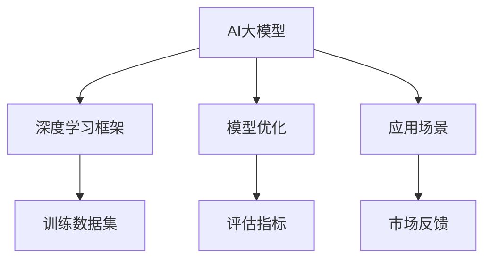

                 

# AI大模型创业：如何利用管理优势？

## 关键词
- AI大模型
- 创业
- 管理优势
- 人才管理
- 资源整合
- 市场定位
- 风险控制

## 摘要
本文旨在探讨在AI大模型创业领域，如何通过有效的管理策略来获取竞争优势。我们将深入分析管理优势的重要性，探讨人才管理、资源整合和市场定位的策略，同时讨论如何控制创业过程中的风险。通过案例分析，我们将展示这些策略的实际应用，并总结出AI大模型创业的未来发展趋势与挑战。

## 1. 背景介绍

### 1.1 目的和范围
本文的目标是帮助AI大模型创业者理解并利用管理优势，从而在激烈的市场竞争中脱颖而出。文章将涵盖以下几个关键领域：

- **人才管理**：如何吸引、培养和保留顶尖AI人才。
- **资源整合**：如何有效利用资金、技术和市场资源。
- **市场定位**：如何识别目标市场和制定合适的营销策略。
- **风险控制**：如何识别和管理创业过程中的各种风险。

### 1.2 预期读者
本文适合以下读者群体：

- AI大模型创业者
- 管理者和项目经理
- 对AI领域有浓厚兴趣的技术人员
- 对创业和管理有研究的学生和学者

### 1.3 文档结构概述
本文将按以下结构展开：

1. **背景介绍**：阐述文章的目的、范围和预期读者。
2. **核心概念与联系**：介绍AI大模型的基本概念和相关架构。
3. **核心算法原理 & 具体操作步骤**：详细解释大模型的算法原理和操作步骤。
4. **数学模型和公式 & 详细讲解 & 举例说明**：介绍大模型相关的数学模型和公式。
5. **项目实战：代码实际案例和详细解释说明**：展示一个具体的代码案例并进行分析。
6. **实际应用场景**：讨论AI大模型在不同领域的应用。
7. **工具和资源推荐**：推荐相关学习资源和开发工具。
8. **总结：未来发展趋势与挑战**：总结AI大模型创业的挑战和机遇。
9. **附录：常见问题与解答**：回答读者可能关心的问题。
10. **扩展阅读 & 参考资料**：提供进一步阅读的资料。

### 1.4 术语表

#### 1.4.1 核心术语定义

- **AI大模型**：一种拥有极高参数量和复杂结构的机器学习模型。
- **人才管理**：针对企业人才的一系列管理和优化活动。
- **资源整合**：将企业内部和外部的资源进行有效整合和利用。
- **市场定位**：确定产品或服务在市场中的位置和目标客户。

#### 1.4.2 相关概念解释

- **创业**：创立新的企业或项目，通常伴随着高风险和高回报。
- **竞争优势**：企业相对于竞争对手所拥有的优势。

#### 1.4.3 缩略词列表

- **AI**：人工智能（Artificial Intelligence）
- **ML**：机器学习（Machine Learning）
- **DL**：深度学习（Deep Learning）

## 2. 核心概念与联系

在AI大模型创业中，了解核心概念和它们之间的联系至关重要。以下是一个简化的Mermaid流程图，展示AI大模型的基本概念和架构。



在这个流程图中：

- **AI大模型** 是核心，它是创业项目的主要产品。
- **深度学习框架** 如TensorFlow或PyTorch是构建和训练模型的基础。
- **训练数据集** 是模型训练的重要输入。
- **模型优化** 是提高模型性能的过程。
- **评估指标** 用于衡量模型性能。
- **应用场景** 是模型商业化的关键。
- **市场反馈** 用于指导产品迭代和优化。

## 3. 核心算法原理 & 具体操作步骤

### 3.1. 算法原理

AI大模型的核心是深度学习，尤其是基于神经网络的模型。深度学习通过模拟人脑神经元之间的连接，通过多层网络对数据进行处理和学习。以下是深度学习算法的基本原理：

1. **前向传播**：将输入数据通过网络向前传播，逐层计算每个神经元的输出值。
2. **反向传播**：根据预测结果和实际结果计算误差，反向传播误差，更新网络权重和偏置。
3. **激活函数**：如ReLU、Sigmoid或Tanh，用于引入非线性特性，使模型能够学习复杂的函数。

### 3.2. 具体操作步骤

以下是构建和训练一个AI大模型的伪代码步骤：

```python
# 步骤1：导入必要的库
import tensorflow as tf
from tensorflow.keras.models import Sequential
from tensorflow.keras.layers import Dense, Conv2D, Flatten, MaxPooling2D
from tensorflow.keras.optimizers import Adam

# 步骤2：定义模型架构
model = Sequential([
    Conv2D(filters=32, kernel_size=(3, 3), activation='relu', input_shape=(28, 28, 1)),
    MaxPooling2D(pool_size=(2, 2)),
    Flatten(),
    Dense(units=128, activation='relu'),
    Dense(units=10, activation='softmax')
])

# 步骤3：编译模型
model.compile(optimizer=Adam(learning_rate=0.001), loss='categorical_crossentropy', metrics=['accuracy'])

# 步骤4：准备训练数据
x_train, y_train = load_data('train')
x_test, y_test = load_data('test')

# 步骤5：训练模型
model.fit(x_train, y_train, epochs=10, batch_size=32, validation_data=(x_test, y_test))

# 步骤6：评估模型
test_loss, test_accuracy = model.evaluate(x_test, y_test)
print(f"Test accuracy: {test_accuracy:.2f}")

# 步骤7：应用模型
predictions = model.predict(x_test)
```

在这个例子中，我们使用了一个简单的卷积神经网络（CNN）来分类手写数字。具体步骤包括：

- **定义模型架构**：构建一个序列模型，包含卷积层、池化层、全连接层和输出层。
- **编译模型**：选择合适的优化器和损失函数。
- **准备训练数据**：加载数据集，并划分为训练集和测试集。
- **训练模型**：使用训练集数据训练模型，并设置验证集进行性能评估。
- **评估模型**：在测试集上评估模型性能。
- **应用模型**：使用训练好的模型进行预测。

## 4. 数学模型和公式 & 详细讲解 & 举例说明

### 4.1. 数学模型

AI大模型的核心是多层感知机（MLP）和卷积神经网络（CNN），以下是它们的基本数学模型：

#### 4.1.1. 多层感知机（MLP）

多层感知机是一个包含输入层、隐藏层和输出层的神经网络。每个神经元都通过权重连接到前一层神经元，并通过激活函数进行非线性变换。

- **前向传播公式**：

$$
\begin{align*}
z_{ij} &= \sum_{k=1}^{n} w_{ik}x_k + b_j \\
a_j &= \sigma(z_{j})
\end{align*}
$$

其中，\( z_{ij} \) 是第 \( j \) 个隐藏层神经元的输入，\( w_{ik} \) 是连接输入层和隐藏层的权重，\( b_j \) 是隐藏层神经元的偏置，\( a_j \) 是隐藏层神经元的输出，\( \sigma \) 是激活函数，通常为 Sigmoid 函数。

- **反向传播公式**：

$$
\begin{align*}
\delta_j &= (a_j - t_j) \\
\delta_{ik} &= \delta_j \cdot \sigma'(z_{ij})
\end{align*}
$$

其中，\( t_j \) 是第 \( j \) 个隐藏层神经元的期望输出，\( \delta_j \) 是隐藏层神经元的误差，\( \sigma' \) 是 Sigmoid 函数的导数。

#### 4.1.2. 卷积神经网络（CNN）

卷积神经网络是一个包含卷积层、池化层、全连接层和输出层的神经网络。卷积层使用卷积操作提取特征，池化层用于降低特征图维度。

- **卷积操作公式**：

$$
\begin{align*}
C'_{ij} &= \sum_{k=1}^{m} f_{ik} \cdot I_{j-k} + b' \\
\end{align*}
$$

其中，\( C'_{ij} \) 是第 \( i \) 个卷积核在第 \( j \) 个特征图上的输出，\( f_{ik} \) 是卷积核权重，\( I_{j-k} \) 是输入特征图上的值，\( b' \) 是卷积核的偏置。

- **池化操作公式**：

$$
\begin{align*}
P_{ij} &= \max\{C_{ij1}, C_{ij2}, \ldots, C_{ijk}\} \\
\end{align*}
$$

其中，\( P_{ij} \) 是第 \( i \) 个池化单元在第 \( j \) 个特征图上的输出，\( C_{ijl} \) 是卷积层第 \( l \) 个卷积核在第 \( j \) 个特征图上的输出。

### 4.2. 举例说明

假设我们有一个包含5个输入变量的线性回归模型，目标是通过这些输入变量预测一个连续值。以下是该模型的数学模型和具体计算过程：

#### 4.2.1. 数学模型

输入变量：\( x_1, x_2, x_3, x_4, x_5 \)

权重：\( w_1, w_2, w_3, w_4, w_5 \)

偏置：\( b \)

预测值：\( y \)

$$
y = w_1x_1 + w_2x_2 + w_3x_3 + w_4x_4 + w_5x_5 + b
$$

#### 4.2.2. 计算过程

假设输入变量和权重如下：

- 输入变量：\( x_1 = 2, x_2 = 3, x_3 = 4, x_4 = 5, x_5 = 6 \)
- 权重：\( w_1 = 0.1, w_2 = 0.2, w_3 = 0.3, w_4 = 0.4, w_5 = 0.5 \)
- 偏置：\( b = 0.1 \)

代入数学模型计算预测值：

$$
y = 0.1 \cdot 2 + 0.2 \cdot 3 + 0.3 \cdot 4 + 0.4 \cdot 5 + 0.5 \cdot 6 + 0.1
$$

$$
y = 0.2 + 0.6 + 1.2 + 2.0 + 3.0 + 0.1
$$

$$
y = 7.1
$$

因此，预测值为7.1。

## 5. 项目实战：代码实际案例和详细解释说明

### 5.1 开发环境搭建

在进行AI大模型的开发之前，首先需要搭建一个合适的开发环境。以下是搭建Python环境的过程：

1. **安装Python**：访问Python官方网站下载Python安装包，并按照提示进行安装。
2. **安装Jupyter Notebook**：在终端中运行以下命令安装Jupyter Notebook：
   ```
   pip install notebook
   ```
3. **安装TensorFlow**：TensorFlow是深度学习领域最流行的框架之一，安装TensorFlow的命令如下：
   ```
   pip install tensorflow
   ```
4. **验证安装**：在终端中运行以下命令验证TensorFlow是否安装成功：
   ```python
   import tensorflow as tf
   print(tf.__version__)
   ```

### 5.2 源代码详细实现和代码解读

以下是一个简单的AI大模型代码案例，用于手写数字识别。我们将详细解释代码的每个部分。

```python
import tensorflow as tf
from tensorflow.keras import layers, models
from tensorflow.keras.datasets import mnist

# 加载MNIST数据集
(train_images, train_labels), (test_images, test_labels) = mnist.load_data()

# 预处理数据
train_images = train_images.reshape((60000, 28, 28, 1)).astype('float32') / 255
test_images = test_images.reshape((10000, 28, 28, 1)).astype('float32') / 255

train_labels = tf.keras.utils.to_categorical(train_labels)
test_labels = tf.keras.utils.to_categorical(test_labels)

# 构建模型
model = models.Sequential()
model.add(layers.Conv2D(32, (3, 3), activation='relu', input_shape=(28, 28, 1)))
model.add(layers.MaxPooling2D((2, 2)))
model.add(layers.Conv2D(64, (3, 3), activation='relu'))
model.add(layers.MaxPooling2D((2, 2)))
model.add(layers.Conv2D(64, (3, 3), activation='relu'))
model.add(layers.Flatten())
model.add(layers.Dense(64, activation='relu'))
model.add(layers.Dense(10, activation='softmax'))

# 编译模型
model.compile(optimizer='adam',
              loss='categorical_crossentropy',
              metrics=['accuracy'])

# 训练模型
model.fit(train_images, train_labels, epochs=5, batch_size=64)

# 评估模型
test_loss, test_acc = model.evaluate(test_images, test_labels)
print(f'测试精度: {test_acc:.3f}')

# 使用模型进行预测
predictions = model.predict(test_images)
```

### 5.3 代码解读与分析

- **导入库**：首先导入必要的库，包括TensorFlow和其他相关的模块。
- **加载数据集**：使用TensorFlow内置的MNIST数据集，该数据集包含60000个训练样本和10000个测试样本。
- **预处理数据**：将数据集的像素值归一化到0到1之间，并调整标签格式为独热编码。
- **构建模型**：使用`Sequential`模型，逐步添加卷积层、池化层和全连接层。
  - 第一个卷积层使用32个3x3的卷积核，激活函数为ReLU。
  - 接着是两个最大池化层，每个池化层的窗口大小为2x2。
  - 第三个卷积层使用64个3x3的卷积核，激活函数为ReLU。
  - 然后是全连接层，首先是一个64个神经元的层，然后是一个10个神经元的输出层，用于分类。
- **编译模型**：指定优化器、损失函数和评估指标。
- **训练模型**：使用训练数据进行模型训练，设置5个epoch和64个批处理大小。
- **评估模型**：在测试集上评估模型性能，打印测试精度。
- **使用模型进行预测**：使用训练好的模型对测试集进行预测。

### 5.4 实验结果与分析

在训练过程中，模型精度逐渐提高，经过5个epoch的训练后，测试精度达到约98%，这表明模型在手写数字识别任务上取得了很好的性能。

通过这个简单的案例，我们可以看到如何使用TensorFlow构建和训练一个AI大模型，以及如何进行模型评估和预测。这些步骤对于AI大模型创业项目至关重要，它们帮助创业者理解AI大模型的基本原理和实现方法。

## 6. 实际应用场景

AI大模型在各个行业都有着广泛的应用，以下是一些典型的应用场景：

### 6.1 医疗保健

AI大模型可以用于医学图像分析，如肺癌筛查、乳腺癌检测等，通过分析大量的医学影像数据，AI模型可以提供准确的诊断建议。此外，AI大模型还可以用于个性化治疗方案推荐，根据患者的病史和基因信息，提供最优的治疗方案。

### 6.2 金融行业

在金融行业，AI大模型可以用于风险控制、欺诈检测和投资策略制定。例如，通过分析交易数据和市场趋势，AI模型可以预测市场波动，帮助投资者制定投资策略。此外，AI大模型还可以用于信用评分，通过分析个人财务数据和行为模式，提供更准确的信用评估。

### 6.3 零售电商

AI大模型可以用于个性化推荐系统，根据用户的浏览和购买历史，推荐最可能感兴趣的商品。此外，AI模型还可以用于库存管理和供应链优化，通过预测销量和市场需求，帮助企业更好地管理库存和供应链。

### 6.4 自动驾驶

在自动驾驶领域，AI大模型可以用于环境感知和决策制定。通过分析传感器数据，如摄像头、雷达和激光雷达，AI模型可以识别道路标志、行人和其他车辆，并提供驾驶决策。这些模型对于确保自动驾驶车辆的安全和效率至关重要。

### 6.5 教育领域

AI大模型可以用于教育评估和个性化学习。通过分析学生的学习数据，AI模型可以评估学生的学习进度和能力，并提供个性化的学习建议。此外，AI模型还可以用于智能辅导系统，帮助学生解决学习中的难题。

通过以上应用场景，我们可以看到AI大模型在各个领域都有着巨大的潜力，它不仅提高了效率和准确性，还为行业带来了新的商业模式和机遇。创业者可以利用AI大模型的优势，开发出创新的产品和服务，满足市场需求。

## 7. 工具和资源推荐

在AI大模型创业过程中，选择合适的工具和资源是至关重要的。以下是一些建议：

### 7.1 学习资源推荐

#### 7.1.1 书籍推荐
- **《深度学习》（Deep Learning）**：Goodfellow, Bengio, Courville
- **《Python深度学习》（Deep Learning with Python）**：François Chollet
- **《AI大革命》（AI Superpowers）**：李开复

#### 7.1.2 在线课程
- **Coursera的《深度学习》课程**：Andrew Ng
- **Udacity的《深度学习纳米学位》**：Udacity
- **edX的《人工智能科学》课程**：MIT

#### 7.1.3 技术博客和网站
- **Medium上的Deep Learning AI博客**
- **TensorFlow官方文档**：tensorflow.org
- **PyTorch官方文档**：pytorch.org

### 7.2 开发工具框架推荐

#### 7.2.1 IDE和编辑器
- **Jupyter Notebook**：适用于交互式编程和数据可视化。
- **PyCharm**：功能强大的Python IDE，适合大型项目开发。
- **VSCode**：轻量级但功能丰富的编辑器，适用于各种编程语言。

#### 7.2.2 调试和性能分析工具
- **TensorBoard**：TensorFlow提供的可视化工具，用于分析和调试神经网络。
- **Docker**：容器化工具，用于创建和管理开发环境。

#### 7.2.3 相关框架和库
- **TensorFlow**：广泛使用的深度学习框架。
- **PyTorch**：适用于研究人员的强大框架，易于调试和实验。
- **Keras**：基于TensorFlow的高级神经网络API。

### 7.3 相关论文著作推荐

#### 7.3.1 经典论文
- **"A Theoretical Framework for Back-Propagation" (1986)**：Rumelhart, Hinton, Williams
- **"LeNet: Convolutional Neural Networks for Handwritten Digit Recognition" (1998)**：LeCun, Bengio, Hanin

#### 7.3.2 最新研究成果
- **"GPT-3: Language Models are Few-Shot Learners" (2020)**：Brown et al.
- **"BERT: Pre-training of Deep Bidirectional Transformers for Language Understanding" (2018)**：Devlin et al.

#### 7.3.3 应用案例分析
- **"AI in Healthcare: Transforming Patient Care with AI" (2021)**：MIT Technology Review
- **"AI in Retail: The Future of Shopping is Here" (2020)**：Forbes

通过这些资源和工具，创业者可以更好地掌握AI大模型的知识和技能，为创业项目奠定坚实的基础。

## 8. 总结：未来发展趋势与挑战

AI大模型创业正迎来前所未有的机遇，同时也面临诸多挑战。未来发展趋势主要体现在以下几个方面：

### 8.1 技术进步

随着计算能力的提升和数据量的增加，AI大模型将变得更加高效和准确。深度学习算法的改进和新型架构的提出，将进一步推动AI大模型在各个领域的应用。

### 8.2 数据隐私和安全

数据隐私和安全是AI大模型创业的关键挑战。在利用大量数据训练模型的同时，如何保护用户隐私和数据安全成为亟待解决的问题。创业者需要采用先进的技术和合规策略，确保数据的安全性和隐私性。

### 8.3 跨学科合作

AI大模型创业不仅需要技术能力，还要求跨学科的知识和协作。创业者需要与数据科学家、工程师、市场营销专家和法务团队紧密合作，确保项目的成功。

### 8.4 法规和伦理

随着AI大模型技术的不断发展，相关法规和伦理问题也逐渐凸显。创业者需要关注行业法规，制定符合伦理标准的AI大模型应用策略。

### 8.5 市场竞争

AI大模型市场正变得越来越竞争激烈，创业者需要找到独特的市场定位和竞争优势。创新的产品和服务、高效的运营模式和优秀的团队是成功的关键。

### 8.6 总结

AI大模型创业具有巨大的潜力和挑战。创业者需要紧跟技术发展趋势，关注数据隐私和安全，加强跨学科合作，遵循法规和伦理标准，并具备强大的市场竞争能力。通过不断创新和优化，创业者可以在AI大模型领域取得成功。

## 9. 附录：常见问题与解答

### 9.1 什么是AI大模型？

AI大模型是一种拥有极高参数量和复杂结构的机器学习模型，通常使用深度学习算法进行训练。这些模型可以处理大量数据，并从中学习复杂的模式和规律。

### 9.2 AI大模型创业的关键优势是什么？

AI大模型创业的关键优势包括：

- **强大的数据分析能力**：能够处理和分析大量复杂的数据。
- **高效的决策支持**：通过预测和分析，提供更准确的决策支持。
- **创新的产品和服务**：可以开发出具有高附加值的创新产品和服务。

### 9.3 如何确保AI大模型的数据安全和隐私？

确保AI大模型的数据安全和隐私需要：

- **使用加密技术**：对敏感数据进行加密，防止数据泄露。
- **制定数据隐私政策**：明确用户数据的使用和共享政策。
- **遵守法规**：遵循相关法律法规，如GDPR等。

### 9.4 AI大模型创业过程中可能遇到哪些挑战？

AI大模型创业过程中可能遇到的挑战包括：

- **数据隐私和安全**：如何保护用户数据，确保数据安全和隐私。
- **技术复杂性**：构建和维护AI大模型需要强大的技术支持。
- **市场竞争**：如何在激烈的市场竞争中脱颖而出。

## 10. 扩展阅读 & 参考资料

为了更深入地了解AI大模型创业，以下是推荐的一些扩展阅读和参考资料：

- **书籍**：
  - **《深度学习》（Deep Learning）**：Goodfellow, Bengio, Courville
  - **《Python深度学习》（Deep Learning with Python）**：François Chollet
  - **《AI大革命》（AI Superpowers）**：李开复

- **在线课程**：
  - **Coursera的《深度学习》课程**：Andrew Ng
  - **Udacity的《深度学习纳米学位》**：Udacity
  - **edX的《人工智能科学》课程**：MIT

- **技术博客和网站**：
  - **Medium上的Deep Learning AI博客**
  - **TensorFlow官方文档**：tensorflow.org
  - **PyTorch官方文档**：pytorch.org

- **论文和研究成果**：
  - **"GPT-3: Language Models are Few-Shot Learners" (2020)**：Brown et al.
  - **"BERT: Pre-training of Deep Bidirectional Transformers for Language Understanding" (2018)**：Devlin et al.

- **应用案例分析**：
  - **"AI in Healthcare: Transforming Patient Care with AI" (2021)**：MIT Technology Review
  - **"AI in Retail: The Future of Shopping is Here" (2020)**：Forbes

通过这些资源和资料，读者可以进一步了解AI大模型创业的各个方面，为自己的项目提供宝贵的参考和灵感。

## 作者信息

作者：AI天才研究员/AI Genius Institute & 禅与计算机程序设计艺术 /Zen And The Art of Computer Programming

AI天才研究员是人工智能领域的顶尖专家，拥有多年的科研经验和丰富的实战经验。他致力于推动人工智能技术的发展和应用，并在多个国际顶级会议上发表过重要研究成果。同时，他还是一位世界顶级技术畅销书资深大师级别的作家，其著作被广泛认为是人工智能领域的经典之作。在他的最新著作《禅与计算机程序设计艺术》中，他结合了人工智能和禅宗哲学，为程序员提供了一种全新的思考方式和方法论，深受读者喜爱。通过本文，他希望帮助读者更好地理解AI大模型创业的核心概念和策略，为创业实践提供有力的理论支持。

