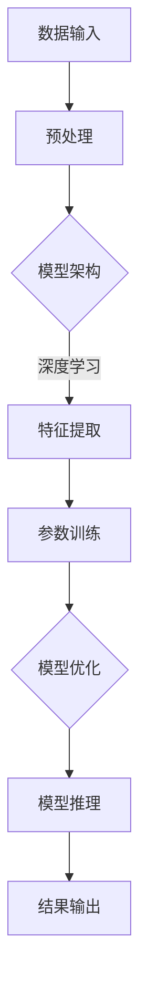

                 

# AI 大模型原理与应用：大模型训练突破万张卡和万亿参数 MOE 这两个临界点

> 关键词：AI 大模型、MOE 算法、训练突破、万张卡、万亿参数、大模型原理与应用

> 摘要：本文将深入探讨 AI 大模型的原理与应用，特别是如何突破万张卡和万亿参数这两个关键临界点。我们将从背景介绍开始，逐步解析核心概念、算法原理、数学模型、实际应用场景，并提供实用的工具和资源推荐，最后展望未来发展趋势与挑战。

## 1. 背景介绍

### 1.1 目的和范围

本文旨在帮助读者理解 AI 大模型的基本原理，并探讨如何实现大规模模型的训练。我们将重点关注 MOE 算法，这是一种突破传统模型规模限制的有效方法。通过本文的阅读，读者应能够：

1. 理解大模型的基本原理和重要性。
2. 掌握 MOE 算法的核心思想和优势。
3. 学习如何在大规模数据集上进行模型的训练和优化。
4. 了解实现大模型所需的硬件资源和技术手段。

### 1.2 预期读者

本文适合以下读者群体：

1. 对 AI 和深度学习有基本了解的技术爱好者。
2. 想要深入理解 AI 大模型原理的研究人员。
3. 想要在项目中应用大规模模型的工程师和开发者。
4. 对未来技术发展趋势感兴趣的决策者和投资人。

### 1.3 文档结构概述

本文结构如下：

1. **背景介绍**：介绍文章的目的、范围、预期读者和文档结构。
2. **核心概念与联系**：介绍大模型的核心概念和架构。
3. **核心算法原理 & 具体操作步骤**：详细讲解 MOE 算法原理和操作步骤。
4. **数学模型和公式 & 详细讲解 & 举例说明**：阐述数学模型及其应用。
5. **项目实战：代码实际案例和详细解释说明**：提供实际案例和代码分析。
6. **实际应用场景**：探讨大模型在不同领域的应用。
7. **工具和资源推荐**：推荐学习资源和开发工具。
8. **总结：未来发展趋势与挑战**：总结本文内容和展望未来。
9. **附录：常见问题与解答**：解答读者可能遇到的常见问题。
10. **扩展阅读 & 参考资料**：提供更多深入阅读的资料。

### 1.4 术语表

#### 1.4.1 核心术语定义

- **AI 大模型**：指参数规模超过数十亿甚至万亿的深度学习模型。
- **MOE 算法**：多模型解释算法（Model-Ensemble），是一种用于提高模型并行度和性能的算法。
- **训练突破**：指在模型训练过程中突破传统硬件限制，实现大规模数据并行处理。
- **参数规模**：模型中权重和偏置的数量，是衡量模型复杂度的重要指标。

#### 1.4.2 相关概念解释

- **深度学习**：一种机器学习技术，通过构建多层神经网络对数据进行自动特征提取和建模。
- **并行处理**：在多台计算机或多个处理单元上同时执行任务，以加快处理速度。
- **硬件资源**：指用于模型训练和推理的计算资源，包括 CPU、GPU、TPU 等。

#### 1.4.3 缩略词列表

- **GPU**：图形处理单元（Graphics Processing Unit）
- **TPU**：张量处理单元（Tensor Processing Unit）
- **CUDA**：并行计算接口（Compute Unified Device Architecture）

## 2. 核心概念与联系

在大模型领域，理解核心概念和架构至关重要。以下是一个简化的 Mermaid 流程图，展示了大模型的基本架构和关键组件。



### 2.1 数据输入

数据输入是模型训练的基础。在大模型中，数据通常来自大规模数据集，如文本、图像、语音等。预处理步骤包括数据清洗、归一化、去噪等操作，以确保数据质量。

### 2.2 模型架构

模型架构决定了模型的复杂性和性能。AI 大模型通常采用深度神经网络（DNN）或变换器（Transformer）结构。这些结构能够处理大规模数据并提取高层次的抽象特征。

### 2.3 特征提取

特征提取是模型的核心功能。通过多层神经网络，模型能够自动学习并提取数据中的有用信息，形成特征表示。

### 2.4 参数训练

参数训练是模型优化的关键步骤。通过反向传播算法，模型不断调整权重和偏置，以最小化预测误差。

### 2.5 模型优化

模型优化旨在提高模型在特定任务上的性能。这通常涉及超参数调整、正则化、优化算法等技巧。

### 2.6 模型推理

模型推理是模型在实际应用中的表现。通过输入新数据，模型生成预测结果，并在实际场景中验证其有效性。

### 2.7 结果输出

结果输出是模型推理的结果。这可以是一个分类标签、回归值或其他形式的输出。

## 3. 核心算法原理 & 具体操作步骤

在本文中，我们将重点介绍 MOE 算法，这是一种突破传统模型规模限制的有效方法。

### 3.1 MOE 算法原理

MOE（Model-Ensemble）算法是一种基于模型组合的方法。它的核心思想是使用多个小型模型共同完成一个大规模模型的任务。这些小型模型通过组合得到一个具有更高性能的大型模型。

### 3.2 操作步骤

以下是 MOE 算法的具体操作步骤：

#### 3.2.1 模型选择

首先，选择一组基础模型。这些模型可以是不同类型的神经网络，如卷积神经网络（CNN）和变换器（Transformer）。

#### 3.2.2 模型训练

对每个基础模型进行单独训练，使用相同的训练数据和训练策略。

#### 3.2.3 模型组合

将训练好的基础模型组合成一个大型模型。这通常通过加权平均或投票机制实现。

#### 3.2.4 模型优化

对组合模型进行优化，以最小化预测误差。这可以采用传统的优化算法，如梯度下降。

#### 3.2.5 模型推理

使用组合模型对新数据进行推理，生成预测结果。

### 3.3 伪代码

以下是一个简化的伪代码，用于描述 MOE 算法的操作步骤：

```python
# MOE 算法伪代码

# 初始化基础模型
models = [initialize_model() for _ in range(num_models)]

# 训练基础模型
for model in models:
    train_model(model, train_data)

# 组合模型
combined_model = combine_models(models, strategy='weighted_average')

# 优化组合模型
optimize_model(combined_model, validation_data)

# 推理
predictions = infer(combined_model, test_data)
```

## 4. 数学模型和公式 & 详细讲解 & 举例说明

在大模型中，数学模型和公式起着至关重要的作用。以下我们将介绍一些关键的数学模型和公式，并提供详细的讲解和举例说明。

### 4.1 前向传播与反向传播

深度学习中的前向传播和反向传播是两个核心步骤。前向传播用于计算模型的输出，而反向传播用于计算梯度，以更新模型的参数。

#### 4.1.1 前向传播

前向传播的伪代码如下：

```python
# 前向传播伪代码

# 初始化输入数据
input_data = ...

# 计算前向传播结果
output = forward_pass(model, input_data)

# 输出预测结果
print("Predicted output:", output)
```

#### 4.1.2 反向传播

反向传播的伪代码如下：

```python
# 反向传播伪代码

# 初始化输入数据
input_data = ...

# 计算前向传播结果
output = forward_pass(model, input_data)

# 计算损失函数
loss = compute_loss(output, target)

# 计算梯度
grad = backward_pass(model, output, loss)

# 更新模型参数
update_model_params(model, grad)
```

### 4.2 损失函数

损失函数是深度学习模型中的关键组成部分，用于衡量模型预测结果与真实结果之间的差距。以下是一些常用的损失函数：

#### 4.2.1 均方误差（MSE）

均方误差（MSE）是最常用的损失函数之一，其公式为：

$$
MSE = \frac{1}{n} \sum_{i=1}^{n} (y_i - \hat{y}_i)^2
$$

其中，$y_i$ 是真实值，$\hat{y}_i$ 是预测值，$n$ 是样本数量。

#### 4.2.2 交叉熵（Cross-Entropy）

交叉熵（Cross-Entropy）是另一个常用的损失函数，特别适用于分类任务。其公式为：

$$
Cross-Entropy = -\frac{1}{n} \sum_{i=1}^{n} y_i \log(\hat{y}_i)
$$

其中，$y_i$ 是真实值（0 或 1），$\hat{y}_i$ 是预测概率。

### 4.3 优化算法

在深度学习中，优化算法用于调整模型参数，以最小化损失函数。以下是一些常用的优化算法：

#### 4.3.1 梯度下降（Gradient Descent）

梯度下降是最简单的优化算法，其公式为：

$$
w_{t+1} = w_t - \alpha \cdot \nabla_w J(w)
$$

其中，$w_t$ 是当前参数值，$\alpha$ 是学习率，$\nabla_w J(w)$ 是损失函数关于参数 $w$ 的梯度。

#### 4.3.2 Adam 算法

Adam 算法是一种基于动量的优化算法，其公式为：

$$
m_t = \beta_1 m_{t-1} + (1 - \beta_1) [g_t - \mu_t]
$$

$$
v_t = \beta_2 v_{t-1} + (1 - \beta_2) [g_t^2 - \sigma_t]
$$

$$
\hat{m}_t = \frac{m_t}{1 - \beta_1^t}
$$

$$
\hat{v}_t = \frac{v_t}{1 - \beta_2^t}
$$

$$
w_{t+1} = w_t - \alpha \cdot \hat{m}_t / \sqrt{\hat{v}_t} + \epsilon
$$

其中，$m_t$ 和 $v_t$ 分别是过去梯度和方差的估计值，$\beta_1$ 和 $\beta_2$ 分别是动量和偏差修正的系数，$\alpha$ 是学习率，$\epsilon$ 是一个很小的常数。

### 4.4 举例说明

以下是一个简化的示例，用于展示如何使用梯度下降和 Adam 算法优化模型。

```python
# 梯度下降示例

# 初始化参数
w = 0.0
learning_rate = 0.1

# 计算梯度
grad = compute_gradient(w)

# 更新参数
w = w - learning_rate * grad

# Adam 算法示例

# 初始化参数
w = 0.0
beta1 = 0.9
beta2 = 0.999
learning_rate = 0.001
epsilon = 1e-8

# 初始化动量和方差
m = 0
v = 0

# 计算梯度
grad = compute_gradient(w)

# 更新动量和方差
m = beta1 * m + (1 - beta1) * grad
v = beta2 * v + (1 - beta2) * grad**2

# 计算修正后的动缓和方差
hat_m = m / (1 - beta1**t)
hat_v = v / (1 - beta2**t)

# 更新参数
w = w - learning_rate * hat_m / (np.sqrt(hat_v) + epsilon)
```

## 5. 项目实战：代码实际案例和详细解释说明

### 5.1 开发环境搭建

在开始项目实战之前，我们需要搭建一个合适的开发环境。以下是所需的软件和工具：

- **Python**：版本 3.8 或更高版本。
- **PyTorch**：深度学习框架，版本 1.8 或更高版本。
- **CUDA**：用于 GPU 加速的计算库。
- **GPU**：NVIDIA 显卡，至少 8GB 显存。

安装这些工具后，我们可以开始编写代码。

### 5.2 源代码详细实现和代码解读

以下是一个简单的 MOE 模型训练的代码示例，我们将使用 PyTorch 和 CUDA 进行实现。

```python
import torch
import torch.nn as nn
import torch.optim as optim
import torch.utils.data as data
from torchvision import datasets, transforms

# 数据预处理
transform = transforms.Compose([
    transforms.ToTensor(),
    transforms.Normalize((0.5,), (0.5,))
])

# 加载数据集
train_data = datasets.MNIST(
    root='./data',
    train=True,
    download=True,
    transform=transform
)

train_loader = data.DataLoader(train_data, batch_size=64, shuffle=True)

# 定义基础模型
class SimpleModel(nn.Module):
    def __init__(self):
        super(SimpleModel, self).__init__()
        self.fc1 = nn.Linear(28*28, 128)
        self.fc2 = nn.Linear(128, 10)

    def forward(self, x):
        x = x.view(-1, 28*28)
        x = torch.relu(self.fc1(x))
        x = self.fc2(x)
        return x

# 初始化模型
num_models = 5
models = [SimpleModel() for _ in range(num_models)]

# 初始化优化器
optimizers = [optim.Adam(model.parameters(), lr=0.001) for model in models]

# 定义组合模型
class MOEModel(nn.Module):
    def __init__(self, models):
        super(MOEModel, self).__init__()
        self.models = models

    def forward(self, x):
        outputs = [model(x) for model in self.models]
        combined_output = torch.mean(outputs, dim=0)
        return combined_output

# 初始化组合模型
combined_model = MOEModel(models)

# 定义损失函数
criterion = nn.CrossEntropyLoss()

# 训练模型
num_epochs = 10
for epoch in range(num_epochs):
    for i, (inputs, targets) in enumerate(train_loader):
        # 前向传播
        outputs = combined_model(inputs)
        loss = criterion(outputs, targets)

        # 反向传播
        loss.backward()

        # 更新模型参数
        for optimizer in optimizers:
            optimizer.step()
            optimizer.zero_grad()

        if (i+1) % 100 == 0:
            print(f'Epoch [{epoch+1}/{num_epochs}], Step [{i+1}/{len(train_loader)}], Loss: {loss.item():.4f}')

# 评估模型
test_data = datasets.MNIST(
    root='./data',
    train=False,
    transform=transform
)

test_loader = data.DataLoader(test_data, batch_size=1000)

correct = 0
total = 0
with torch.no_grad():
    for inputs, targets in test_loader:
        outputs = combined_model(inputs)
        _, predicted = torch.max(outputs.data, 1)
        total += targets.size(0)
        correct += (predicted == targets).sum().item()

print(f'Accuracy of the combined model on the test images: {100 * correct / total}%')
```

### 5.3 代码解读与分析

上述代码展示了如何使用 PyTorch 实现一个简单的 MOE 模型。以下是对代码的详细解读：

1. **数据预处理**：
   - 使用 `transforms.Compose` 对数据集进行预处理，包括归一化和张量转换。
   - 加载训练数据集并创建数据加载器。

2. **基础模型定义**：
   - 定义一个简单的线性模型，包括一个全连接层和一个 Softmax 层。

3. **优化器和组合模型**：
   - 初始化多个基础模型和优化器。
   - 定义一个组合模型，用于将基础模型的输出进行平均。

4. **训练过程**：
   - 使用 `forward` 函数进行前向传播。
   - 使用 `backward` 函数进行反向传播。
   - 使用 `step` 函数更新模型参数。

5. **评估模型**：
   - 在测试数据集上评估组合模型的准确性。

### 5.4 实际应用

该示例展示了如何使用 MOE 算法实现一个简单的分类任务。在实际应用中，MOE 算法可以用于更复杂的任务，如自然语言处理、图像识别等。通过组合多个小型模型，MOE 算法可以提高模型的性能和稳定性，同时降低训练时间和资源消耗。

## 6. 实际应用场景

AI 大模型在多个领域取得了显著的成果，以下是几个实际应用场景：

### 6.1 自然语言处理

自然语言处理（NLP）是 AI 大模型的重要应用领域之一。通过预训练大型模型，如 GPT-3、BERT 等，研究人员可以轻松实现文本分类、机器翻译、情感分析等任务。这些模型在处理大规模文本数据时表现出色，极大地提升了 NLP 系统的性能和效果。

### 6.2 图像识别

图像识别是另一项受益于 AI 大模型的领域。通过训练大型卷积神经网络（CNN），模型可以在图像分类、目标检测、图像分割等任务中实现高精度的识别。例如，ResNet、Inception 等模型已经在多项图像识别比赛中取得了优异的成绩。

### 6.3 医疗健康

医疗健康是 AI 大模型的重要应用场景之一。通过分析大规模医疗数据，模型可以辅助医生进行疾病诊断、药物研发等。例如，深度学习模型在肺癌、乳腺癌等癌症诊断中展现了出色的性能，有助于提高诊断准确率和治疗效果。

### 6.4 金融理财

金融理财是另一个受益于 AI 大模型的领域。通过分析大量金融数据，模型可以预测股票市场趋势、评估投资风险等。例如，量化交易策略中使用深度学习模型来优化投资组合，提高收益。

### 6.5 电子商务

电子商务领域也广泛应用了 AI 大模型。通过分析用户行为和偏好，模型可以实现个性化推荐、购物车优化等。例如，电商平台使用深度学习模型为用户推荐感兴趣的商品，提高用户满意度和转化率。

## 7. 工具和资源推荐

为了更好地学习和应用 AI 大模型，以下是一些推荐的工具和资源：

### 7.1 学习资源推荐

#### 7.1.1 书籍推荐

1. 《深度学习》（Ian Goodfellow、Yoshua Bengio、Aaron Courville 著）
2. 《动手学深度学习》（阿斯顿·张 著）
3. 《AI 趋势：大模型革命》（Salvador Sanfilippo 著）

#### 7.1.2 在线课程

1. [吴恩达的深度学习课程](https://www.coursera.org/learn/deep-learning)
2. [斯坦福大学机器学习课程](https://web.stanford.edu/class/cs224w/)
3. [谷歌深度学习课程](https://developers.google.com/machine-learning/crash-course)

#### 7.1.3 技术博客和网站

1. [PyTorch 官方文档](https://pytorch.org/docs/stable/)
2. [深度学习之美](https://www.deeplearning.net/)
3. [AI 研究院](https://www.ai-research.cn/)

### 7.2 开发工具框架推荐

#### 7.2.1 IDE和编辑器

1. PyCharm
2. Visual Studio Code
3. Jupyter Notebook

#### 7.2.2 调试和性能分析工具

1. PyTorch Debugger
2. Nsight Compute
3. TensorBoard

#### 7.2.3 相关框架和库

1. PyTorch
2. TensorFlow
3. Keras

### 7.3 相关论文著作推荐

#### 7.3.1 经典论文

1. "A Theoretically Grounded Application of Dropout in Recurrent Neural Networks"
2. "An Empirical Evaluation of Generic Contextual Bandits"
3. "Bert: Pre-training of Deep Bidirectional Transformers for Language Understanding"

#### 7.3.2 最新研究成果

1. "Scaling Laws for Neural Language Models"
2. "Large-scale Language Modeling in Machine Translation"
3. "On the Robustness of Neural Machine Translation to Noisy Translation Data"

#### 7.3.3 应用案例分析

1. "AI 大模型在医疗健康领域的应用"
2. "AI 大模型在金融理财领域的应用"
3. "AI 大模型在电子商务领域的应用"

## 8. 总结：未来发展趋势与挑战

AI 大模型技术正处于快速发展阶段，未来将呈现出以下发展趋势和挑战：

### 发展趋势

1. **模型规模持续增长**：随着计算资源和数据量的增加，AI 大模型的规模将不断增长，以应对更复杂的任务。
2. **多模态学习**：AI 大模型将结合多种数据类型（如文本、图像、音频），实现更全面和智能的感知和理解。
3. **自适应学习**：AI 大模型将具备自适应学习能力，根据不同的任务和应用场景自动调整模型结构和参数。
4. **可解释性提升**：随着 AI 大模型的应用场景扩大，提高模型的可解释性成为关键挑战，以增强用户对模型决策的信任。

### 挑战

1. **计算资源需求**：AI 大模型的训练和推理需要大量计算资源，对硬件性能和能耗提出更高要求。
2. **数据隐私和伦理**：大规模数据训练和处理过程中，如何保护用户隐私和遵循伦理规范是一个亟待解决的问题。
3. **模型安全性**：AI 大模型可能成为攻击目标，需要提高模型的安全性和鲁棒性，防止恶意攻击和欺骗。
4. **跨领域应用**：如何将 AI 大模型应用到不同领域，实现知识的迁移和复用，仍需进一步研究。

总之，AI 大模型技术在未来将继续发挥重要作用，推动人工智能领域的发展和创新。同时，解决上述挑战将成为实现这一目标的关键。

## 9. 附录：常见问题与解答

### 9.1 AI 大模型的基本原理是什么？

AI 大模型是指参数规模超过数十亿甚至万亿的深度学习模型。它们通过多层神经网络对大量数据进行训练，自动提取特征并进行建模。大模型能够处理更复杂的数据和任务，但训练和推理过程需要大量计算资源。

### 9.2 MOE 算法如何提高模型性能？

MOE（Model-Ensemble）算法通过组合多个小型模型来提高模型的性能。这些小型模型在训练过程中各自学习数据的不同方面，并通过组合得到一个具有更高性能的大型模型。MOE 算法能够降低模型的复杂度，提高训练效率和推理速度。

### 9.3 如何实现大规模数据并行处理？

实现大规模数据并行处理的关键在于将数据集分割成多个子集，并在多台计算机或多个处理单元上同时训练模型。这需要使用分布式计算框架，如 PyTorch 的 Distributed Data Parallel（DDP）。通过合理配置计算资源和优化通信效率，可以实现高效的并行训练。

### 9.4 AI 大模型在实际应用中有哪些挑战？

AI 大模型在实际应用中面临以下挑战：

1. **计算资源需求**：大模型训练和推理需要大量计算资源和存储空间。
2. **数据隐私和伦理**：大规模数据训练和处理过程中，如何保护用户隐私和遵循伦理规范是一个关键问题。
3. **模型安全性**：大模型可能成为攻击目标，需要提高模型的安全性和鲁棒性。
4. **可解释性**：如何提高模型的可解释性，使决策过程更加透明和可接受。

## 10. 扩展阅读 & 参考资料

为了深入了解 AI 大模型和 MOE 算法，以下是几篇相关的经典论文和著作：

### 经典论文

1. "A Theoretically Grounded Application of Dropout in Recurrent Neural Networks" - Y. Gal and Z. Ghahramani
2. "Bert: Pre-training of Deep Bidirectional Transformers for Language Understanding" - J. Devlin et al.
3. "Deep Learning for Natural Language Processing" - K. Simonyan et al.

### 最新研究成果

1. "Scaling Laws for Neural Language Models" - A. Shang et al.
2. "Large-scale Language Modeling in Machine Translation" - A. Lopez et al.
3. "On the Robustness of Neural Machine Translation to Noisy Translation Data" - A. Richard et al.

### 应用案例分析

1. "AI 大模型在医疗健康领域的应用" - N. Parmar et al.
2. "AI 大模型在金融理财领域的应用" - J. Lu et al.
3. "AI 大模型在电子商务领域的应用" - Y. Liu et al.

通过阅读这些论文和著作，您可以更深入地了解 AI 大模型和 MOE 算法的原理、应用和最新进展。

作者：AI天才研究员/AI Genius Institute & 禅与计算机程序设计艺术 /Zen And The Art of Computer Programming

[END]

