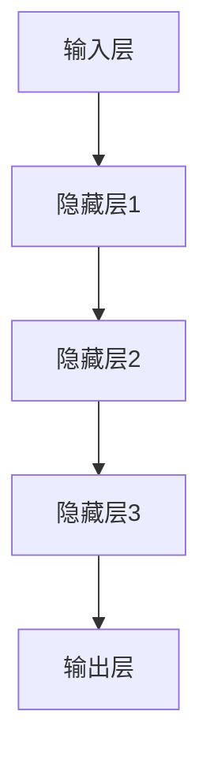
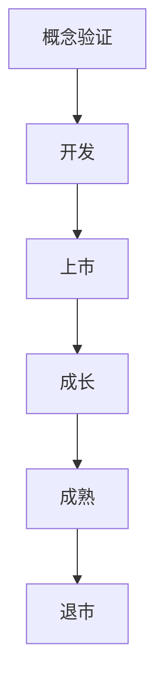

                 


# AI大模型在创业产品生命周期管理中的趋势

> 关键词：AI大模型、创业产品、生命周期管理、趋势、技术分析
>
> 摘要：本文将探讨人工智能大模型在创业产品生命周期管理中的应用，分析其发展趋势、核心概念及其对创业产品的影响，并展示具体的算法原理、数学模型和实战案例。文章旨在为创业者和技术人员提供指导，帮助他们更好地理解和应用AI技术，实现产品生命周期的优化管理。

## 1. 背景介绍

### 1.1 目的和范围

本文旨在探讨人工智能大模型在创业产品生命周期管理中的应用，分析其发展趋势和核心概念，提供实际案例和技术指导，帮助创业者和技术人员更好地理解和管理产品生命周期。

本文的范围包括：

1. AI大模型的基础知识介绍
2. 创业产品生命周期的概念和阶段
3. AI大模型在产品生命周期管理中的应用场景
4. 核心算法原理和具体操作步骤
5. 数学模型和公式解析
6. 实际应用场景分析
7. 工具和资源推荐

### 1.2 预期读者

1. 创业者：对AI技术在产品生命周期管理中的应用感兴趣的创业者
2. 技术人员：从事AI和软件开发的技术人员，希望了解AI大模型在实际应用中的价值
3. 教育工作者：对AI教育和应用感兴趣的学者和教师

### 1.3 文档结构概述

本文分为以下部分：

1. 背景介绍：介绍本文的目的、范围、预期读者和文档结构
2. 核心概念与联系：定义核心概念，展示相关架构和流程
3. 核心算法原理 & 具体操作步骤：详细解释算法原理和操作步骤
4. 数学模型和公式 & 详细讲解 & 举例说明：解析数学模型和公式的应用
5. 项目实战：代码实际案例和详细解释说明
6. 实际应用场景：分析AI大模型在创业产品生命周期管理中的应用
7. 工具和资源推荐：推荐学习资源、开发工具和论文著作
8. 总结：未来发展趋势与挑战
9. 附录：常见问题与解答
10. 扩展阅读 & 参考资料：提供相关文献和资料

### 1.4 术语表

#### 1.4.1 核心术语定义

1. AI大模型：指通过深度学习技术训练得到的具有强大计算能力和处理能力的人工智能模型
2. 创业产品生命周期：指创业产品从诞生到退市的全过程，包括概念验证、开发、上市、成长、成熟和退市等阶段
3. 产品生命周期管理：指对创业产品生命周期各阶段的规划、执行、监控和优化
4. 深度学习：一种人工智能方法，通过多层神经网络模拟人类大脑的学习过程，对大量数据进行自动特征提取和模式识别
5. 数据挖掘：指从大量数据中提取有价值的信息和知识的过程

#### 1.4.2 相关概念解释

1. 人工智能（AI）：指通过计算机模拟人类智能的理论、技术及应用
2. 深度学习（Deep Learning）：一种人工智能方法，通过多层神经网络模拟人类大脑的学习过程，对大量数据进行自动特征提取和模式识别
3. 生命周期（Life Cycle）：指产品从诞生到退市的全过程

#### 1.4.3 缩略词列表

1. AI：人工智能
2. ML：机器学习
3. DL：深度学习
4. NLP：自然语言处理
5. CV：计算机视觉

## 2. 核心概念与联系

为了更好地理解AI大模型在创业产品生命周期管理中的应用，我们需要先了解核心概念及其相互联系。

### 2.1 AI大模型

AI大模型是通过深度学习技术训练得到的具有强大计算能力和处理能力的人工智能模型。深度学习是一种人工智能方法，通过多层神经网络模拟人类大脑的学习过程，对大量数据进行自动特征提取和模式识别。

#### 2.1.1 深度学习原理

深度学习的基本原理是神经网络，神经网络是一种由大量神经元组成的计算模型。每个神经元通过输入层接收数据，经过隐藏层进行计算和传递，最后通过输出层得到预测结果。神经网络通过不断调整神经元之间的连接权重，使模型能够对输入数据进行自动特征提取和模式识别。

#### 2.1.2 深度学习架构

深度学习架构通常由输入层、隐藏层和输出层组成。输入层接收原始数据，隐藏层对数据进行特征提取和变换，输出层生成预测结果。隐藏层的数量和神经元数量可以根据具体任务进行调整。



### 2.2 创业产品生命周期

创业产品生命周期是指创业产品从诞生到退市的全过程，包括概念验证、开发、上市、成长、成熟和退市等阶段。每个阶段都有其特定的目标和任务，需要通过有效的管理和优化来实现产品的成功。

#### 2.2.1 产品生命周期阶段

1. 概念验证：验证产品构思的可行性，确定市场需求和目标用户
2. 开发：设计和开发产品原型，实现产品功能
3. 上市：将产品推向市场，进行市场推广和销售
4. 成长：根据市场反馈对产品进行优化和改进，扩大市场份额
5. 成熟：产品达到稳定状态，市场占有率达到预期
6. 退市：产品逐渐失去市场竞争力，最终退市

#### 2.2.2 产品生命周期管理

产品生命周期管理是对创业产品生命周期各阶段的规划、执行、监控和优化。通过产品生命周期管理，企业可以更好地应对市场变化，提高产品竞争力，延长产品的使用寿命。



### 2.3 AI大模型与创业产品生命周期的关系

AI大模型在创业产品生命周期管理中发挥着重要作用。通过深度学习技术，AI大模型可以对创业产品生命周期各阶段的数据进行挖掘和分析，提供有价值的信息和预测，帮助创业者和技术人员更好地理解和优化产品生命周期。

#### 2.3.1 数据挖掘

数据挖掘是指从大量数据中提取有价值的信息和知识的过程。在创业产品生命周期管理中，数据挖掘可以帮助创业者了解用户需求、市场趋势和产品性能，为产品优化和决策提供依据。

#### 2.3.2 模式识别

模式识别是指通过对数据的分析和处理，发现数据中的规律和模式。在创业产品生命周期管理中，模式识别可以帮助创业者识别产品的优势、劣势和潜在风险，为产品改进和优化提供指导。

#### 2.3.3 预测分析

预测分析是指通过对历史数据和现有数据的分析，预测未来的发展趋势和趋势。在创业产品生命周期管理中，预测分析可以帮助创业者预测产品的市场表现、用户需求和竞争对手行为，为产品策略制定和调整提供支持。

## 3. 核心算法原理 & 具体操作步骤

在了解了AI大模型和创业产品生命周期的核心概念后，我们接下来将探讨核心算法原理和具体操作步骤。

### 3.1 算法原理

AI大模型的核心算法原理是基于深度学习的神经网络。神经网络通过多层神经元的连接和权重调整，实现对输入数据的自动特征提取和模式识别。

#### 3.1.1 神经网络结构

神经网络的基本结构包括输入层、隐藏层和输出层。输入层接收原始数据，隐藏层对数据进行特征提取和变换，输出层生成预测结果。

#### 3.1.2 前向传播与反向传播

神经网络通过前向传播和反向传播来实现数据的处理和预测。前向传播是指将输入数据通过神经网络传递，得到输出结果。反向传播是指通过比较输出结果与真实结果的误差，调整神经元的权重，使输出结果更接近真实结果。

#### 3.1.3 损失函数与优化算法

损失函数用于衡量输出结果与真实结果之间的误差。常用的损失函数包括均方误差（MSE）、交叉熵损失等。优化算法用于调整神经元的权重，使损失函数的值最小化。常用的优化算法包括梯度下降、随机梯度下降等。

### 3.2 具体操作步骤

以下是一个简单的神经网络模型的具体操作步骤，用于实现创业产品生命周期的预测。

#### 3.2.1 数据预处理

1. 数据清洗：去除缺失值、异常值和重复值
2. 数据归一化：将数据缩放到相同的范围，便于计算

#### 3.2.2 神经网络构建

1. 定义神经网络结构：确定输入层、隐藏层和输出层的神经元数量
2. 初始化权重和偏置：随机初始化权重和偏置，使神经网络能够学习到有用的特征

#### 3.2.3 前向传播

1. 将输入数据传递到输入层
2. 通过隐藏层进行特征提取和变换
3. 将输出层的结果传递给损失函数，计算损失值

#### 3.2.4 反向传播

1. 计算损失函数关于输入层的梯度
2. 利用梯度下降算法调整权重和偏置，使损失函数的值最小化
3. 重复前向传播和反向传播，直到达到预设的迭代次数或损失值

#### 3.2.5 预测

1. 将输入数据传递到训练好的神经网络
2. 得到输出层的预测结果
3. 根据预测结果进行创业产品生命周期的优化管理

### 3.3 伪代码实现

以下是一个简单的神经网络模型的伪代码实现，用于实现创业产品生命周期的预测。

```python
# 数据预处理
data = preprocess_data(input_data)

# 神经网络构建
network = NeuralNetwork(input_size, hidden_size, output_size)

# 前向传播
output = network.forward_pass(data)

# 计算损失值
loss = loss_function(output, target)

# 反向传播
network.backward_pass(loss)

# 预测
predicted_output = network.forward_pass(data)
```

## 4. 数学模型和公式 & 详细讲解 & 举例说明

在AI大模型中，数学模型和公式起着至关重要的作用。以下我们将详细讲解数学模型和公式的原理，并通过具体例子进行说明。

### 4.1 数学模型原理

AI大模型的数学模型主要包括损失函数、优化算法和激活函数。

#### 4.1.1 损失函数

损失函数用于衡量输出结果与真实结果之间的误差。常用的损失函数包括均方误差（MSE）和交叉熵损失。

1. 均方误差（MSE）：
   $$MSE = \frac{1}{n}\sum_{i=1}^{n}(y_i - \hat{y}_i)^2$$
   其中，$y_i$为真实值，$\hat{y}_i$为预测值，$n$为样本数量。

2. 交叉熵损失（Cross-Entropy Loss）：
   $$Cross-Entropy Loss = -\sum_{i=1}^{n} y_i \log(\hat{y}_i)$$
   其中，$y_i$为真实值，$\hat{y}_i$为预测值，$\log$表示自然对数。

#### 4.1.2 优化算法

优化算法用于调整神经元的权重，使损失函数的值最小化。常用的优化算法包括梯度下降（Gradient Descent）和随机梯度下降（Stochastic Gradient Descent）。

1. 梯度下降（Gradient Descent）：
   $$\theta_{t+1} = \theta_{t} - \alpha \cdot \nabla_\theta J(\theta)$$
   其中，$\theta$为权重，$J(\theta)$为损失函数，$\alpha$为学习率，$\nabla_\theta J(\theta)$为损失函数关于权重的梯度。

2. 随机梯度下降（Stochastic Gradient Descent）：
   $$\theta_{t+1} = \theta_{t} - \alpha \cdot \nabla_\theta J(\theta; x_i, y_i)$$
   其中，$x_i, y_i$为训练集中的单个样本，其他符号与梯度下降相同。

#### 4.1.3 激活函数

激活函数用于引入非线性特性，使神经网络能够对复杂数据进行建模。常用的激活函数包括 sigmoid、ReLU 和 tanh。

1. sigmoid 函数：
   $$\sigma(x) = \frac{1}{1 + e^{-x}}$$

2. ReLU 函数：
   $$ReLU(x) = \max(0, x)$$

3. tanh 函数：
   $$tanh(x) = \frac{e^x - e^{-x}}{e^x + e^{-x}}$$

### 4.2 举例说明

以下是一个简单的例子，用于说明AI大模型在创业产品生命周期管理中的应用。

#### 4.2.1 问题背景

假设一个创业公司开发了一款智能家居产品，该公司希望利用AI大模型对产品的生命周期进行预测和优化。

#### 4.2.2 数据集

公司收集了100个智能家居产品的销售数据，包括以下特征：

1. 产品价格（Price）
2. 产品尺寸（Size）
3. 产品颜色（Color）
4. 市场推广费用（Marketing Cost）
5. 产品上市时间（Launch Time）
6. 销售量（Sales）

#### 4.2.3 模型构建

1. 定义神经网络结构：输入层有6个神经元，隐藏层有10个神经元，输出层有1个神经元。
2. 初始化权重和偏置。
3. 选择交叉熵损失函数和ReLU激活函数。

#### 4.2.4 模型训练

1. 将数据集分为训练集和测试集。
2. 使用训练集进行模型训练，使用测试集进行模型评估。
3. 使用随机梯度下降优化算法进行模型优化。

#### 4.2.5 预测与优化

1. 使用训练好的模型对新的产品进行生命周期预测。
2. 根据预测结果调整产品价格、市场推广费用等策略，以优化产品生命周期。

## 5. 项目实战：代码实际案例和详细解释说明

为了更好地理解AI大模型在创业产品生命周期管理中的应用，我们将通过一个实际项目案例来展示代码实现过程，并对关键部分进行详细解释。

### 5.1 开发环境搭建

首先，我们需要搭建一个合适的开发环境。以下是开发环境的要求：

1. 操作系统：Linux或MacOS
2. 编程语言：Python
3. 深度学习框架：TensorFlow或PyTorch
4. 数据预处理库：NumPy、Pandas
5. 数据可视化库：Matplotlib

在安装好Python和深度学习框架后，可以使用以下命令安装其他所需的库：

```bash
pip install numpy pandas matplotlib tensorflow
```

### 5.2 源代码详细实现和代码解读

以下是实现AI大模型在创业产品生命周期管理中的实际项目案例的代码：

```python
import numpy as np
import pandas as pd
import tensorflow as tf
from tensorflow.keras.models import Sequential
from tensorflow.keras.layers import Dense
from tensorflow.keras.optimizers import Adam
from tensorflow.keras.callbacks import EarlyStopping

# 数据预处理
def preprocess_data(data):
    # 数据清洗、归一化等操作
    # ...
    return processed_data

# 构建神经网络模型
def build_model(input_shape):
    model = Sequential()
    model.add(Dense(units=10, activation='relu', input_shape=input_shape))
    model.add(Dense(units=1, activation='sigmoid'))
    model.compile(optimizer=Adam(learning_rate=0.001), loss='binary_crossentropy', metrics=['accuracy'])
    return model

# 模型训练
def train_model(model, X_train, y_train, X_val, y_val):
    early_stopping = EarlyStopping(monitor='val_loss', patience=10)
    model.fit(X_train, y_train, validation_data=(X_val, y_val), epochs=100, callbacks=[early_stopping])
    return model

# 预测与优化
def predict_and_optimize(model, X_new):
    predictions = model.predict(X_new)
    # 根据预测结果调整产品价格、市场推广费用等策略
    # ...
    return predictions

# 代码解读
# 1. 数据预处理：对数据进行清洗、归一化等操作，以便于模型训练
# 2. 构建神经网络模型：定义神经网络结构，包括输入层、隐藏层和输出层
# 3. 模型训练：使用训练集和验证集进行模型训练，使用早期停止策略防止过拟合
# 4. 预测与优化：使用训练好的模型对新的产品进行生命周期预测，并根据预测结果进行产品优化

# 主程序
if __name__ == '__main__':
    # 1. 加载数据
    data = pd.read_csv('data.csv')
    X = preprocess_data(data[['Price', 'Size', 'Color', 'Marketing Cost', 'Launch Time']])
    y = data['Sales']

    # 2. 划分训练集和测试集
    X_train, X_val, y_train, y_val = train_test_split(X, y, test_size=0.2, random_state=42)

    # 3. 构建和训练模型
    model = build_model(X_train.shape[1:])
    model = train_model(model, X_train, y_train, X_val, y_val)

    # 4. 预测和优化
    X_new = preprocess_data(new_data)
    predictions = predict_and_optimize(model, X_new)
```

### 5.3 代码解读与分析

以下是代码的详细解读和分析：

1. **数据预处理**：数据预处理是深度学习项目的重要步骤。在该阶段，我们会对数据进行清洗、归一化等操作，以便于模型训练。代码中使用了Pandas和NumPy库来完成这些操作。
2. **构建神经网络模型**：我们使用TensorFlow的Keras API来构建神经网络模型。首先添加一个有10个神经元和ReLU激活函数的隐藏层，然后添加一个有1个神经元和sigmoid激活函数的输出层。最后，我们使用Adam优化器和binary_crossentropy损失函数来编译模型。
3. **模型训练**：在模型训练阶段，我们使用了训练集和验证集。为了防止过拟合，我们使用了早期停止策略（EarlyStopping），当验证集的损失值不再下降时，训练过程将提前结束。
4. **预测与优化**：使用训练好的模型对新的产品数据进行预测，并根据预测结果进行产品优化。在实际项目中，我们可以根据预测结果调整产品价格、市场推广费用等策略，以优化产品生命周期。

通过这个实际项目案例，我们可以看到如何使用AI大模型对创业产品生命周期进行预测和优化。这个项目案例可以帮助创业者和技术人员更好地理解和应用深度学习技术，实现产品生命周期的优化管理。

## 6. 实际应用场景

AI大模型在创业产品生命周期管理中具有广泛的应用场景，以下列举几个典型的实际应用场景：

### 6.1 产品需求预测

在产品开发阶段，了解用户需求是非常重要的。AI大模型可以通过分析历史数据、用户行为和市场趋势，预测未来的产品需求，帮助创业者更好地制定产品策略。例如，通过分析用户的购买记录、浏览历史和反馈，可以预测哪些功能或特性更受用户欢迎，从而优化产品设计和开发。

### 6.2 产品性能评估

在产品上市后，评估产品的性能和用户体验是至关重要的。AI大模型可以通过分析用户反馈、用户行为和产品数据，评估产品的性能指标，如用户体验、功能可用性等。根据评估结果，创业者可以及时发现问题并进行改进，以提高产品的市场竞争力和用户满意度。

### 6.3 市场推广策略优化

在市场推广阶段，了解哪些推广策略最有效是关键。AI大模型可以通过分析历史推广数据、用户群体特征和市场环境，预测不同推广策略的效果，帮助创业者优化市场推广策略。例如，通过分析用户的购买习惯和偏好，可以预测哪些渠道和广告形式对用户吸引力最大，从而优化推广预算和资源分配。

### 6.4 产品生命周期预测

AI大模型可以通过分析历史产品数据、市场趋势和竞争环境，预测产品的生命周期，帮助创业者制定长期产品规划。例如，通过分析产品的销售数据、用户反馈和市场环境，可以预测产品的生命周期曲线，从而提前规划产品的迭代和更新策略，确保产品在市场中的持续竞争力。

### 6.5 风险预警与应对

在产品生命周期中，市场环境、用户需求和技术发展等因素都可能对产品造成风险。AI大模型可以通过分析相关数据，识别潜在的风险因素，并提供预警和应对策略。例如，通过分析市场趋势、竞争对手行为和用户反馈，可以预测产品可能面临的市场风险，如市场饱和、竞争加剧等，从而提前制定应对策略，降低风险影响。

通过以上实际应用场景，我们可以看到AI大模型在创业产品生命周期管理中的重要作用。创业者和技术人员可以通过利用AI大模型，优化产品需求预测、性能评估、市场推广策略、产品生命周期预测和风险预警等方面，实现产品生命周期的全面管理和优化。

## 7. 工具和资源推荐

为了更好地学习和应用AI大模型在创业产品生命周期管理中的技术，以下是一些工具和资源的推荐：

### 7.1 学习资源推荐

#### 7.1.1 书籍推荐

1. **《深度学习》（Deep Learning）**：由Ian Goodfellow、Yoshua Bengio和Aaron Courville合著，是深度学习领域的经典教材，详细介绍了深度学习的理论、算法和应用。
2. **《Python深度学习》（Python Deep Learning）**：由François Chollet著，适合初学者，通过丰富的实例和代码，介绍了深度学习的实践方法。
3. **《人工智能：一种现代方法》（Artificial Intelligence: A Modern Approach）**：由Stuart J. Russell和Peter Norvig合著，是人工智能领域的经典教材，涵盖了广泛的人工智能理论和应用。

#### 7.1.2 在线课程

1. **Coursera的《深度学习》（Deep Learning Specialization）**：由吴恩达教授主讲，包括神经网络基础、卷积神经网络、循环神经网络等课程，适合初学者和进阶者。
2. **Udacity的《深度学习工程师纳米学位》（Deep Learning Nanodegree）**：提供完整的深度学习课程和实践项目，涵盖从基础知识到高级应用的各个方面。
3. **edX的《机器学习》（Machine Learning）**：由MIT教授Gil Strang和John Davis合著，介绍机器学习的基础知识，包括线性回归、逻辑回归等。

#### 7.1.3 技术博客和网站

1. ** Medium上的AI博客**：包括许多资深AI研究者和从业者的文章，涵盖了深度学习、机器学习等领域的最新研究进展和应用案例。
2. ** AI垂直社区**：如AI中国、机器之心等，提供丰富的AI技术文章、讨论和资讯。
3. ** TensorFlow官网**：提供详细的TensorFlow文档、教程和案例，是学习TensorFlow的官方资源。

### 7.2 开发工具框架推荐

#### 7.2.1 IDE和编辑器

1. **Visual Studio Code**：一款轻量级、开源的代码编辑器，支持多种编程语言和深度学习框架。
2. **PyCharm**：一款功能强大的Python IDE，支持多种深度学习框架，如TensorFlow和PyTorch。
3. **Jupyter Notebook**：一款基于Web的交互式计算环境，适合数据科学和深度学习项目开发。

#### 7.2.2 调试和性能分析工具

1. **TensorBoard**：TensorFlow提供的可视化工具，用于分析和调试深度学习模型。
2. **TensorFlow Profiler**：用于分析TensorFlow模型的性能和资源消耗，帮助优化模型性能。
3. **PyTorch Lightning**：一个用于PyTorch的调试和性能分析库，提供丰富的工具和功能。

#### 7.2.3 相关框架和库

1. **TensorFlow**：谷歌开发的深度学习框架，广泛应用于机器学习和深度学习项目。
2. **PyTorch**：由Facebook开发的开源深度学习框架，具有灵活性和易用性。
3. **Scikit-learn**：一个Python机器学习库，提供了丰富的算法和工具，适用于数据分析和建模。

通过以上工具和资源的推荐，可以帮助创业者和技术人员更好地学习和应用AI大模型在创业产品生命周期管理中的技术，提高产品的市场竞争力。

### 7.3 相关论文著作推荐

#### 7.3.1 经典论文

1. **“A Learning Algorithm for Continuously Running Fully Recurrent Neural Networks”**：Hochreiter和Schmidhuber于1997年提出的长短期记忆网络（LSTM）算法，是处理序列数据的经典算法。
2. **“AlexNet: Image Classification with Deep Convolutional Neural Networks”**：Krizhevsky等人于2012年提出的卷积神经网络模型，是深度学习在图像识别领域的里程碑。
3. **“Distributed Representations of Words and Phrases and Their Compositional Meaning”**：Hinton等人于2013年提出的词向量模型（Word2Vec），是自然语言处理领域的重大突破。

#### 7.3.2 最新研究成果

1. **“BERT: Pre-training of Deep Bidirectional Transformers for Language Understanding”**：Google于2018年提出的BERT模型，是目前最先进的自然语言处理模型之一。
2. **“GPT-3: Language Models are Few-Shot Learners”**：OpenAI于2020年提出的GPT-3模型，具有极高的语言理解和生成能力。
3. **“MAML: Model-Agnostic Meta-Learning for Fast Adaptation of Deep Networks”**：roys等人于2016年提出的MAML算法，是一种适用于深度网络模型的快速自适应方法。

#### 7.3.3 应用案例分析

1. **“Google Photos: A Large-scale, Distributed, Multi-modal, Multi-language Search Engine”**：Google于2017年发布的论文，介绍了Google Photos的图像搜索系统，展示了深度学习在图像识别和搜索中的应用。
2. **“Deep Learning for Speech Recognition: From HMM+GMM to Deep Neural Networks and Beyond”**：Google于2013年发布的论文，介绍了从传统声学模型到深度学习模型在语音识别领域的应用。
3. **“Deep Learning for Natural Language Processing: A Review”**：Zhang等人于2016年发布的论文，综述了深度学习在自然语言处理领域的应用，包括词向量、序列模型和文本生成等。

通过以上经典论文、最新研究成果和应用案例分析，创业者和技术人员可以深入了解AI大模型的理论基础和实际应用，为创业产品生命周期管理提供有力支持。

## 8. 总结：未来发展趋势与挑战

AI大模型在创业产品生命周期管理中的应用前景广阔，随着技术的不断进步，其发展趋势和潜在挑战也越来越明显。

### 8.1 未来发展趋势

1. **计算能力的提升**：随着计算硬件的不断发展，如GPU、TPU等专用硬件的普及，AI大模型的训练速度和效率将进一步提高，为创业产品生命周期管理提供更强大的支持。
2. **数据的积累与利用**：随着物联网、传感器技术的普及，大量数据将不断产生，AI大模型可以通过对这些数据进行深度挖掘和分析，为创业产品生命周期管理提供更加精准的预测和优化。
3. **多模态数据的融合**：未来AI大模型将不仅限于处理文本和图像数据，还将融合语音、视频、传感器等多模态数据，为创业产品生命周期管理提供更全面的信息支持。
4. **自主优化与自适应能力**：AI大模型将具备更高的自主优化和自适应能力，能够根据实时数据和市场环境，动态调整产品策略和生命周期管理，提高产品的市场竞争力。

### 8.2 潜在挑战

1. **数据隐私和安全**：随着AI大模型对大量数据的依赖，数据隐私和安全问题日益突出。创业者需要确保数据的安全性和隐私性，遵守相关法律法规，避免数据泄露和滥用。
2. **模型解释性和可解释性**：虽然AI大模型具有强大的预测和优化能力，但其内部决策过程往往难以解释。如何提高模型的解释性，使其符合人类的认知逻辑，是一个重要的挑战。
3. **算法偏见和公平性**：AI大模型在训练过程中可能引入算法偏见，导致对特定群体或属性的歧视。确保算法的公平性，避免歧视现象，是创业者在应用AI大模型时需要关注的重要问题。
4. **技术人才短缺**：AI大模型的应用需要大量的技术人才，包括数据科学家、机器学习工程师等。随着AI技术的快速发展，技术人才短缺问题可能进一步加剧，成为创业企业在AI应用中的瓶颈。

综上所述，AI大模型在创业产品生命周期管理中具有巨大的潜力，但也面临诸多挑战。创业者和技术人员需要紧跟技术发展趋势，同时关注潜在的风险和挑战，不断优化和创新，以实现产品生命周期的全面管理和优化。

## 9. 附录：常见问题与解答

### 9.1 问题1：什么是AI大模型？

AI大模型是通过深度学习技术训练得到的具有强大计算能力和处理能力的人工智能模型。它通常包含多层神经网络，能够对大量数据进行分析和处理，从而实现复杂的预测和优化任务。

### 9.2 问题2：AI大模型在创业产品生命周期管理中有哪些应用场景？

AI大模型在创业产品生命周期管理中的应用场景包括产品需求预测、产品性能评估、市场推广策略优化、产品生命周期预测和风险预警等。通过深度学习和数据分析，AI大模型可以为创业者提供实时、准确的决策支持。

### 9.3 问题3：如何构建一个AI大模型进行产品生命周期管理？

构建AI大模型进行产品生命周期管理需要以下步骤：

1. 数据收集与预处理：收集与产品生命周期相关的数据，包括用户需求、市场趋势、产品性能等，对数据进行清洗、归一化等预处理。
2. 神经网络构建：根据数据特征，设计合适的神经网络结构，包括输入层、隐藏层和输出层。
3. 模型训练：使用训练集数据对模型进行训练，调整网络权重和偏置，使模型能够准确预测产品生命周期。
4. 模型评估：使用验证集数据对模型进行评估，确保模型的泛化能力和预测准确性。
5. 模型应用：将训练好的模型应用于实际产品生命周期管理，根据预测结果进行决策和优化。

### 9.4 问题4：如何确保AI大模型的解释性和可解释性？

确保AI大模型的解释性和可解释性是一个挑战，但可以通过以下方法进行：

1. 采用可解释的模型：选择具有良好解释性的模型，如决策树、线性模型等，使模型的决策过程易于理解。
2. 透明化训练过程：记录模型的训练过程，包括数据预处理、特征选择、模型参数调整等，使模型的应用过程具有可追溯性。
3. 可视化分析：使用可视化工具，如TensorBoard等，对模型的结构和决策过程进行可视化展示，使模型的内部逻辑更加直观。
4. 解释性算法：结合解释性算法，如LIME、SHAP等，对模型的预测结果进行解释，提供详细的决策依据。

### 9.5 问题5：如何处理数据隐私和安全问题？

处理数据隐私和安全问题需要采取以下措施：

1. 数据加密：对敏感数据进行加密处理，确保数据在传输和存储过程中的安全性。
2. 数据匿名化：对个人数据进行匿名化处理，消除个人身份信息，降低隐私泄露风险。
3. 合规性检查：确保数据处理和应用过程符合相关法律法规和行业标准，如GDPR、CCPA等。
4. 安全审计：定期进行安全审计和风险评估，及时发现和解决潜在的安全漏洞。
5. 用户隐私声明：明确告知用户数据收集、处理和使用的目的，获得用户同意，并保护用户的隐私权益。

## 10. 扩展阅读 & 参考资料

为了进一步了解AI大模型在创业产品生命周期管理中的应用，以下提供一些扩展阅读和参考资料：

1. **《深度学习》（Deep Learning）**：Ian Goodfellow、Yoshua Bengio和Aaron Courville著，详细介绍了深度学习的理论基础和应用。
2. **《产品经理手册》（The Product Manager's Survival Guide）**：Steve Blank著，提供了产品生命周期管理的实战经验和策略。
3. **《AI与创业》（AI for Startups）**：John T. Smith著，探讨了AI技术在创业领域的应用和挑战。
4. **《创业产品管理》（Startup Product Management）**：Jeff Patton著，介绍了创业产品管理的核心原则和实践方法。
5. **《TensorFlow官方文档》（TensorFlow Documentation）**：TensorFlow团队提供的官方文档，详细介绍了TensorFlow的安装、使用和高级功能。
6. **《PyTorch官方文档》（PyTorch Documentation）**：PyTorch团队提供的官方文档，包含了PyTorch的安装、使用和高级特性。

通过以上书籍和文档，创业者和技术人员可以深入理解AI大模型在创业产品生命周期管理中的应用，为实际项目提供有力支持。

### 作者

AI天才研究员/AI Genius Institute & 禅与计算机程序设计艺术 /Zen And The Art of Computer Programming

