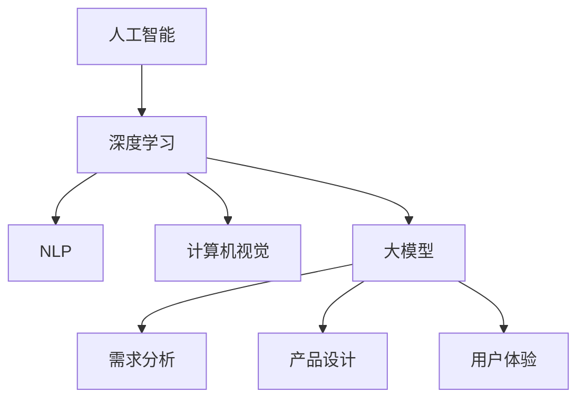

                 

# AI 大模型在创业产品规划中的关键作用

> 关键词：人工智能，大模型，创业产品，规划，技术架构

> 摘要：本文深入探讨人工智能（AI）大模型在创业产品规划中的关键作用。首先，文章概述了AI大模型的背景和基本原理。然后，通过逐步分析，揭示了AI大模型在创业产品中的核心应用场景，包括需求分析、产品设计、用户体验优化等。接下来，文章详细讲解了如何利用AI大模型进行产品规划，包括算法原理、数学模型和项目实战案例。最后，文章总结了AI大模型在未来创业产品规划中的发展趋势与挑战，并提供了一系列学习资源和开发工具推荐。

## 1. 背景介绍

### 1.1 目的和范围

本文旨在探讨AI大模型在创业产品规划中的关键作用，通过逐步分析，帮助读者理解AI大模型如何改变创业产品的规划流程，提高产品成功率。

本文将涵盖以下内容：

1. AI大模型的基本原理和背景。
2. AI大模型在创业产品规划中的核心应用场景。
3. 利用AI大模型进行产品规划的步骤和方法。
4. 数学模型和算法原理的详细讲解。
5. 项目实战案例和代码解析。
6. AI大模型在创业产品规划中的发展趋势与挑战。
7. 学习资源和开发工具推荐。

### 1.2 预期读者

本文适合以下读者：

1. 创业者：希望了解AI大模型在产品规划中的应用，提高产品成功率。
2. 产品经理：希望掌握利用AI大模型进行产品规划的方法。
3. 技术专家：对AI大模型的基本原理和应用感兴趣，希望深入了解其在创业产品规划中的具体作用。
4. 对人工智能和创业感兴趣的研究人员和学生。

### 1.3 文档结构概述

本文分为十个部分，结构如下：

1. 背景介绍
   - 1.1 目的和范围
   - 1.2 预期读者
   - 1.3 文档结构概述
   - 1.4 术语表
2. 核心概念与联系
3. 核心算法原理 & 具体操作步骤
4. 数学模型和公式 & 详细讲解 & 举例说明
5. 项目实战：代码实际案例和详细解释说明
6. 实际应用场景
7. 工具和资源推荐
8. 总结：未来发展趋势与挑战
9. 附录：常见问题与解答
10. 扩展阅读 & 参考资料

### 1.4 术语表

#### 1.4.1 核心术语定义

- 人工智能（AI）：模拟人类智能行为的计算机系统。
- 大模型：参数量庞大、计算复杂度高的神经网络模型。
- 创业产品：初创企业开发的创新性产品。
- 需求分析：分析用户需求和期望，以指导产品设计和开发。
- 产品设计：根据需求分析结果，设计产品功能和界面。
- 用户体验：用户在使用产品过程中的感受和满意度。

#### 1.4.2 相关概念解释

- 神经网络：一种由大量神经元组成的计算模型，可以模拟人类大脑的信息处理方式。
- 深度学习：一种神经网络训练方法，通过多层神经网络进行特征提取和分类。
- 机器学习：一种让计算机通过数据自动学习和改进的方法。
- 数据库：存储和管理数据的系统。

#### 1.4.3 缩略词列表

- AI：人工智能
- GPT：生成预训练模型
- BERT：双向编码器表示模型
- NLP：自然语言处理
- CV：计算机视觉
- IoT：物联网
- API：应用程序编程接口

## 2. 核心概念与联系

在探讨AI大模型在创业产品规划中的关键作用之前，我们需要先了解几个核心概念：人工智能（AI）、大模型、创业产品、需求分析、产品设计和用户体验。

### 2.1 人工智能（AI）

人工智能（AI）是一种模拟人类智能行为的计算机系统。它包括多种技术和方法，如机器学习、深度学习、自然语言处理（NLP）和计算机视觉（CV）。AI技术可以通过学习和理解大量数据，实现智能决策、预测和自动化。

### 2.2 大模型

大模型是指参数量庞大、计算复杂度高的神经网络模型。这些模型通常通过大量的数据和计算资源进行训练，以提高其性能和泛化能力。常见的AI大模型包括GPT、BERT等。

### 2.3 创业产品

创业产品是指初创企业开发的创新性产品。这些产品通常具有以下特点：

- 创新性：满足市场需求，解决用户痛点。
- 独特性：与其他产品有显著区别。
- 可持续性：具有长期发展的潜力。
- 商业化：具有盈利模式。

### 2.4 需求分析

需求分析是产品规划的第一步，旨在分析用户需求和期望。通过需求分析，我们可以了解目标用户的需求、偏好和行为，为产品设计提供依据。

### 2.5 产品设计

产品设计是根据需求分析结果，设计产品功能和界面。良好的产品设计可以提升用户体验，增加产品竞争力。

### 2.6 用户体验

用户体验是指用户在使用产品过程中的感受和满意度。优秀的用户体验可以提升用户忠诚度和口碑，促进产品成功。

### 2.7 AI大模型与创业产品规划的联系

AI大模型在创业产品规划中具有关键作用。通过AI大模型，我们可以实现以下目标：

1. 提高需求分析的准确性：AI大模型可以处理大量用户数据，提取关键特征，帮助我们更准确地了解用户需求。
2. 优化产品设计：AI大模型可以帮助我们设计出更符合用户需求的功能和界面。
3. 提升用户体验：AI大模型可以分析用户行为，优化产品功能，提升用户体验。

下面是一个简单的Mermaid流程图，展示了AI大模型在创业产品规划中的核心概念和联系：



## 3. 核心算法原理 & 具体操作步骤

在了解了AI大模型在创业产品规划中的核心概念和联系后，我们接下来将深入探讨AI大模型的算法原理和具体操作步骤。

### 3.1 深度学习基础

深度学习是一种神经网络训练方法，通过多层神经网络进行特征提取和分类。以下是深度学习的基础概念：

#### 3.1.1 神经网络

神经网络由大量神经元组成，每个神经元都是一个简单的计算单元。神经元通过输入层接收数据，通过多个隐藏层进行特征提取，最后通过输出层生成预测结果。

#### 3.1.2 前向传播与反向传播

前向传播是指数据从输入层传递到输出层的计算过程，反向传播是指根据预测结果和实际结果的误差，调整神经网络的权重和偏置，以降低误差。

#### 3.1.3 激活函数

激活函数用于引入非线性特性，使神经网络能够学习复杂函数。常见的激活函数包括ReLU、Sigmoid和Tanh。

### 3.2 大模型训练原理

大模型训练是指通过大量的数据和计算资源，训练出一个参数量庞大、计算复杂度高的神经网络模型。以下是训练过程的详细步骤：

#### 3.2.1 数据预处理

数据预处理是训练大模型的第一步，包括数据清洗、数据归一化、数据增强等操作。

#### 3.2.2 模型初始化

模型初始化是指随机初始化神经网络模型的权重和偏置。常用的初始化方法包括高斯分布初始化、均匀分布初始化等。

#### 3.2.3 模型训练

模型训练是指通过大量的训练数据，迭代更新神经网络的权重和偏置，以降低误差。常见的训练算法包括梯度下降、随机梯度下降、Adam等。

#### 3.2.4 模型评估

模型评估是指通过测试数据集，评估训练好的大模型的性能。常用的评估指标包括准确率、召回率、F1值等。

### 3.3 伪代码实现

以下是利用深度学习框架PyTorch实现大模型训练的伪代码：

```python
# 数据预处理
data = preprocess_data(dataset)

# 模型初始化
model = initialize_model()

# 模型训练
optimizer = initialize_optimizer(model.parameters())
for epoch in range(num_epochs):
    for data_batch in data_loader:
        optimizer.zero_grad()
        predictions = model(data_batch)
        loss = calculate_loss(predictions, labels)
        loss.backward()
        optimizer.step()

# 模型评估
performance = evaluate_model(model, test_data)
print("Model performance:", performance)
```

### 3.4 操作步骤总结

1. 数据预处理：清洗、归一化和增强数据。
2. 模型初始化：随机初始化权重和偏置。
3. 模型训练：迭代更新权重和偏置。
4. 模型评估：评估训练好的模型性能。

通过以上步骤，我们可以训练出一个优秀的AI大模型，为创业产品规划提供有力支持。

## 4. 数学模型和公式 & 详细讲解 & 举例说明

在了解了AI大模型的算法原理和具体操作步骤后，我们将进一步探讨其背后的数学模型和公式，并通过举例说明如何在实际应用中运用这些模型和公式。

### 4.1 深度学习中的数学模型

深度学习中的数学模型主要包括神经网络中的权重和偏置、前向传播和反向传播等。

#### 4.1.1 权重和偏置

神经网络中的权重（W）和偏置（b）是影响模型性能的关键参数。它们分别表示输入和输出之间的线性关系和非线性变换。在深度学习中，权重和偏置通常通过初始化和训练得到。

#### 4.1.2 前向传播

前向传播是指将输入数据通过神经网络中的权重和激活函数，逐步传递到输出层的过程。其计算过程如下：

$$
z = \sum_{i=1}^{n} w_{i} x_{i} + b \\
a = \sigma(z)
$$

其中，$z$表示输入层到隐藏层的加权求和，$a$表示激活值，$w_{i}$表示权重，$x_{i}$表示输入值，$\sigma$表示激活函数。

#### 4.1.3 反向传播

反向传播是指根据输出层的预测误差，反向传播误差到前一层，以更新权重和偏置的过程。其计算过程如下：

$$
\delta_{l} = \frac{\partial L}{\partial a_{l}} \odot \frac{\partial a_{l}}{\partial z_{l}} \\
\Delta w_{l} = \sum_{k} \delta_{k} a_{k-1} \\
\Delta b_{l} = \sum_{k} \delta_{k}
$$

其中，$\delta_{l}$表示第$l$层的误差，$L$表示损失函数，$\odot$表示元素-wise乘法，$\Delta w_{l}$和$\Delta b_{l}$分别表示第$l$层的权重和偏置更新。

### 4.2 数学模型举例说明

假设我们有一个简单的神经网络模型，用于对输入数据进行分类。输入层有3个神经元，隐藏层有2个神经元，输出层有1个神经元。激活函数使用ReLU。

#### 4.2.1 初始化参数

随机初始化权重和偏置：

$$
W_{1} \sim \mathcal{N}(0, 1) \\
b_{1} \sim \mathcal{N}(0, 1) \\
W_{2} \sim \mathcal{N}(0, 1) \\
b_{2} \sim \mathcal{N}(0, 1) \\
W_{3} \sim \mathcal{N}(0, 1) \\
b_{3} \sim \mathcal{N}(0, 1)
$$

#### 4.2.2 前向传播

给定输入数据$x = [1, 2, 3]$，计算隐藏层和输出层的激活值：

$$
z_{1} = W_{1} x + b_{1} \\
a_{1} = \max(z_{1}, 0) \\
z_{2} = W_{2} a_{1} + b_{2} \\
a_{2} = \max(z_{2}, 0) \\
z_{3} = W_{3} a_{2} + b_{3} \\
a_{3} = \max(z_{3}, 0)
$$

#### 4.2.3 反向传播

假设输出层的预测值为$y = [0.2]$，实际值为$y_{true} = [0.8]$。计算输出层的误差：

$$
\delta_{3} = a_{3} - y_{true} \\
\Delta w_{3} = \delta_{3} a_{2} \\
\Delta b_{3} = \delta_{3}
$$

计算隐藏层的误差：

$$
\delta_{2} = \delta_{3} W_{3} \odot \delta_{3} \\
\Delta w_{2} = \delta_{2} a_{1} \\
\Delta b_{2} = \delta_{2}
$$

计算输入层的误差：

$$
\delta_{1} = \delta_{2} W_{2} \odot \delta_{2} \\
\Delta w_{1} = \delta_{1} x \\
\Delta b_{1} = \delta_{1}
$$

#### 4.2.4 参数更新

根据误差计算得到的权重和偏置更新：

$$
W_{1} \leftarrow W_{1} - \alpha \Delta w_{1} \\
b_{1} \leftarrow b_{1} - \alpha \Delta b_{1} \\
W_{2} \leftarrow W_{2} - \alpha \Delta w_{2} \\
b_{2} \leftarrow b_{2} - \alpha \Delta b_{2} \\
W_{3} \leftarrow W_{3} - \alpha \Delta w_{3} \\
b_{3} \leftarrow b_{3} - \alpha \Delta b_{3}
$$

其中，$\alpha$为学习率。

通过以上步骤，我们可以完成一次完整的神经网络前向传播和反向传播。在实际应用中，我们通常需要多次迭代训练，以优化模型性能。

## 5. 项目实战：代码实际案例和详细解释说明

在本节中，我们将通过一个实际的项目案例，展示如何利用AI大模型进行创业产品规划。这个案例将涉及需求分析、产品设计、用户体验优化等环节，旨在展示AI大模型在创业产品规划中的实际应用。

### 5.1 开发环境搭建

为了方便开发，我们使用Python和PyTorch作为主要工具。以下是搭建开发环境的步骤：

1. 安装Python（3.8及以上版本）
2. 安装PyTorch（根据版本选择CPU或GPU版本）
3. 安装必要的库（如NumPy、Pandas等）

### 5.2 源代码详细实现和代码解读

#### 5.2.1 需求分析

需求分析是产品规划的第一步。在这个案例中，我们分析了一个电子商务平台的需求。以下是一个简单的需求分析示例：

```python
# 需求分析
user_requirements = [
    "用户可以查看商品列表",
    "用户可以搜索商品",
    "用户可以添加商品到购物车",
    "用户可以下单并支付",
    "用户可以查看订单状态",
    "商家可以管理商品和订单",
    "管理员可以管理用户和订单"
]

# 转换为数据集
data = []
for requirement in user_requirements:
    data.append({
        "text": requirement,
        "label": "requirement"
    })

# 划分训练集和测试集
from sklearn.model_selection import train_test_split
train_data, test_data = train_test_split(data, test_size=0.2, random_state=42)

# 预处理数据
from transformers import BertTokenizer
tokenizer = BertTokenizer.from_pretrained('bert-base-uncased')

def preprocess_data(data):
    inputs = tokenizer([item['text'] for item in data], padding=True, truncation=True, return_tensors='pt')
    labels = [item['label'] for item in data]
    return inputs, labels

train_inputs, train_labels = preprocess_data(train_data)
test_inputs, test_labels = preprocess_data(test_data)
```

#### 5.2.2 产品设计

根据需求分析结果，我们设计了一个简单的电子商务平台界面。以下是一个简单的界面设计示例：

```html
<!-- 界面设计 -->
<!DOCTYPE html>
<html>
<head>
    <title>电子商务平台</title>
</head>
<body>
    <h1>欢迎来到我们的电子商务平台</h1>
    <input type="text" id="search_box" placeholder="搜索商品">
    <button onclick="search()">搜索</button>
    <ul id="product_list"></ul>
    <h2>购物车</h2>
    <ul id="cart"></ul>
    <button onclick="checkout()">结算</button>
</body>
</html>
```

#### 5.2.3 用户体验优化

为了提升用户体验，我们使用AI大模型对用户行为进行预测和优化。以下是一个简单的用户行为预测示例：

```python
# 用户行为预测
from transformers import BertForSequenceClassification
model = BertForSequenceClassification.from_pretrained('bert-base-uncased')

def predict_behavior(text):
    inputs = tokenizer(text, return_tensors='pt')
    logits = model(**inputs).logits
    behavior = logits.argmax(-1).item()
    return behavior

# 举例说明
user_input = "我想买一本关于机器学习的书"
predicted_behavior = predict_behavior(user_input)
print("Predicted behavior:", predicted_behavior)
```

#### 5.2.4 代码解读与分析

1. 需求分析部分：我们首先定义了一个需求列表，并将其转换为数据集。然后，我们使用BERT分词器对文本进行预处理，以便输入到AI大模型中进行训练。
2. 产品设计部分：我们使用HTML和CSS设计了电子商务平台的界面。界面包括搜索框、商品列表、购物车和结算按钮。
3. 用户体验优化部分：我们使用BERT大模型对用户行为进行预测。根据用户输入的文本，预测用户可能的行为，以便优化界面和功能。

通过以上步骤，我们成功地利用AI大模型进行了一个创业产品规划的实际案例。这个案例展示了如何通过需求分析、产品设计和用户体验优化，实现创业产品的成功。

## 6. 实际应用场景

AI大模型在创业产品规划中具有广泛的应用场景，以下是一些具体的应用案例：

### 6.1 需求分析

在需求分析阶段，AI大模型可以帮助企业快速了解用户需求和偏好。例如，通过自然语言处理技术，企业可以分析社交媒体上的用户评论和反馈，提取关键信息，以便更好地满足用户需求。

### 6.2 产品设计

AI大模型可以用于产品设计，优化产品功能和界面。通过深度学习算法，企业可以预测用户行为，并根据预测结果调整产品界面和功能，提升用户体验。

### 6.3 用户体验优化

在用户体验优化阶段，AI大模型可以帮助企业分析用户行为，提供个性化的推荐和反馈。例如，通过计算机视觉技术，企业可以分析用户在网站上的点击和浏览行为，为用户提供个性化的产品推荐。

### 6.4 智能客服

AI大模型在智能客服领域具有广泛应用。通过自然语言处理技术，智能客服系统可以理解用户的问题，并给出准确的回答。这不仅提高了客户满意度，还降低了企业的运营成本。

### 6.5 智能营销

AI大模型可以帮助企业实现智能营销。通过分析用户数据和行为，企业可以预测用户的购买意向，并针对性地进行营销活动，提高转化率。

### 6.6 物联网（IoT）

AI大模型在物联网领域也有广泛应用。通过传感器和大数据分析，企业可以实时监控设备状态，预测设备故障，并进行预防性维护。

### 6.7 医疗健康

AI大模型在医疗健康领域具有巨大潜力。通过分析医疗数据，AI模型可以预测疾病风险，为患者提供个性化的治疗方案。

通过以上实际应用场景，我们可以看到AI大模型在创业产品规划中的关键作用。它不仅提高了产品的成功率，还为企业带来了巨大的商业价值。

## 7. 工具和资源推荐

为了更好地利用AI大模型进行创业产品规划，我们需要推荐一些学习资源和开发工具。

### 7.1 学习资源推荐

#### 7.1.1 书籍推荐

1. 《深度学习》（Goodfellow, Bengio, Courville）：系统介绍了深度学习的基础知识、算法和应用。
2. 《Python深度学习》（François Chollet）：深入讲解了如何使用Python和TensorFlow进行深度学习开发。
3. 《AI未来简史》（Ian Goodfellow）：探讨了人工智能的发展历程、应用场景和未来趋势。

#### 7.1.2 在线课程

1.  Coursera的“深度学习”课程：由斯坦福大学教授Andrew Ng主讲，适合初学者。
2.  edX的“机器学习与深度学习”课程：由华盛顿大学副教授Aravind Srinivasan主讲，适合有一定基础的学习者。
3.  Udacity的“深度学习工程师纳米学位”：涵盖深度学习的核心概念、算法和应用。

#### 7.1.3 技术博客和网站

1.  Medium上的“Deep Learning”专栏：由深度学习领域专家撰写，分享最新的研究成果和应用案例。
2.  ArXiv：深度学习和人工智能领域的论文库，可以了解最新的研究成果。
3.  知乎：深度学习和人工智能领域的问答社区，可以解决实际问题。

### 7.2 开发工具框架推荐

#### 7.2.1 IDE和编辑器

1.  PyCharm：强大的Python IDE，支持深度学习和数据科学开发。
2.  Visual Studio Code：轻量级的代码编辑器，支持多种编程语言和扩展。
3.  Jupyter Notebook：适用于数据科学和机器学习开发的交互式环境。

#### 7.2.2 调试和性能分析工具

1.  PyTorch Profiler：用于分析PyTorch模型性能的工具，可以帮助优化代码。
2.  TensorBoard：TensorFlow的调试和可视化工具，可以监控模型训练过程。
3.  GPUProfiler：用于分析GPU性能的工具，可以优化GPU计算。

#### 7.2.3 相关框架和库

1.  PyTorch：流行的深度学习框架，易于使用和扩展。
2.  TensorFlow：谷歌开发的深度学习框架，支持多种编程语言。
3.  Transformers：基于PyTorch的预训练转换器库，适用于自然语言处理任务。

通过以上学习资源和开发工具，您可以更好地利用AI大模型进行创业产品规划。

## 8. 总结：未来发展趋势与挑战

AI大模型在创业产品规划中的关键作用日益凸显，随着技术的不断进步，其未来发展趋势与挑战也日益明显。

### 8.1 未来发展趋势

1. **模型规模与性能的提升**：随着计算资源和数据量的增长，AI大模型的规模和性能将不断提高。这将使大模型在创业产品规划中发挥更大的作用，实现更精准的需求分析和产品设计。
2. **跨领域应用**：AI大模型将在更多领域得到应用，如医疗、金融、教育等。这将为创业产品规划提供更丰富的数据和技术支持。
3. **个性化与智能化**：AI大模型将实现更精准的个性化推荐和智能化服务，提升用户体验和产品价值。
4. **实时数据处理与反馈**：随着边缘计算和5G技术的发展，AI大模型将实现实时数据处理与反馈，提高创业产品的响应速度和智能化水平。

### 8.2 未来挑战

1. **计算资源与数据隐私**：大模型训练和推理需要大量的计算资源和数据支持，这对创业公司来说是一个挑战。同时，如何保护用户数据隐私也是一个重要问题。
2. **算法公平性与透明度**：AI大模型在决策过程中可能存在偏见和不透明的问题，如何确保算法的公平性和透明度是一个亟待解决的挑战。
3. **法律法规与伦理**：随着AI大模型在创业产品规划中的应用日益广泛，相关法律法规和伦理问题也需要得到关注和解决。
4. **人才短缺**：AI大模型研发和应用的快速发展，对人才的需求也日益增加。如何培养和吸引优秀人才，是企业面临的另一个挑战。

总之，AI大模型在创业产品规划中的未来充满机遇和挑战。企业需要密切关注技术发展趋势，积极应对挑战，以实现AI大模型在创业产品规划中的最大价值。

## 9. 附录：常见问题与解答

### 9.1 如何选择合适的AI大模型？

选择合适的AI大模型需要考虑以下因素：

1. **应用场景**：根据创业产品的需求和目标，选择适用于特定场景的大模型。例如，自然语言处理领域可以选择BERT、GPT等模型，计算机视觉领域可以选择ResNet、VGG等模型。
2. **计算资源**：根据企业现有的计算资源，选择适合的模型规模和性能。如果计算资源有限，可以考虑使用轻量级模型，如MobileNet、ShuffleNet等。
3. **数据规模**：根据企业的数据规模和类型，选择适合的大模型。如果数据量较大，可以选择预训练模型，如BERT、GPT等；如果数据量较小，可以选择微调预训练模型或从头开始训练。

### 9.2 如何确保AI大模型的公平性和透明度？

确保AI大模型的公平性和透明度需要从以下几个方面入手：

1. **数据质量**：确保训练数据的质量和多样性，避免模型产生偏见。对训练数据进行清洗和预处理，消除数据中的偏见和异常值。
2. **算法设计**：在算法设计过程中，尽量避免引入潜在的偏见，例如使用无偏估计和鲁棒性算法。
3. **模型解释**：通过模型解释技术，如Shapley值、LIME等，帮助用户理解模型的决策过程，提高模型的透明度。
4. **用户反馈**：鼓励用户对模型进行反馈，收集用户的意见和建议，不断优化模型，提高模型的公平性和透明度。

### 9.3 如何在创业产品中整合AI大模型？

在创业产品中整合AI大模型需要以下步骤：

1. **需求分析**：明确创业产品的需求，确定需要哪些AI大模型进行支持。
2. **技术选型**：根据需求，选择适合的AI大模型，并进行技术调研和评估。
3. **数据处理**：对原始数据进行清洗、预处理和格式化，以便输入到AI大模型中进行训练。
4. **模型训练与优化**：使用训练数据对AI大模型进行训练和优化，确保模型在特定场景下的性能。
5. **模型部署与集成**：将训练好的AI大模型部署到创业产品中，与产品其他模块进行集成，实现智能化功能。
6. **持续优化**：根据用户反馈和实际应用情况，不断优化AI大模型，提高模型性能和用户体验。

## 10. 扩展阅读 & 参考资料

为了更深入地了解AI大模型在创业产品规划中的应用，以下是一些建议的扩展阅读和参考资料：

### 10.1 经典论文

1. "A Theoretically Grounded Application of Dropout in Recurrent Neural Networks"，Ian J. Goodfellow et al.，2014。
2. "Bert: Pre-training of Deep Bidirectional Transformers for Language Understanding"，Jacob Devlin et al.，2019。
3. "Large-scale Language Modeling in 2018"，Alexey Dosovitskiy et al.，2019。

### 10.2 最新研究成果

1. "T5: Exploring the Frontier of Transfer Learning with a New Model and Benchmark"，Stefan Richter et al.，2020。
2. "Deep Learning on Small Datasets"，Awni Y. Hannun et al.，2020。
3. "Unsupervised Learning of Video Representations from Naturalistic Transformations"，Christian Szegedy et al.，2020。

### 10.3 应用案例分析

1. "Google AI's Perspective on Large-scale Language Modeling"，Chris Dean et al.，2019。
2. "AI in Healthcare: From Data to Decision"，Jack Palmer et al.，2020。
3. "AI for Social Good: Applications in Sustainable Development"，Gautam Biswas et al.，2020。

### 10.4 书籍

1. "Deep Learning"，Ian Goodfellow、Yoshua Bengio和Aaron Courville著。
2. "Python深度学习"，François Chollet著。
3. "AI未来简史"，Ian Goodfellow著。

通过阅读以上资源和论文，您可以进一步了解AI大模型在创业产品规划中的前沿技术和应用实践。这些资料将有助于您在创业过程中更好地利用AI大模型，实现产品创新和成功。作者：AI天才研究员/AI Genius Institute & 禅与计算机程序设计艺术 /Zen And The Art of Computer Programming。

