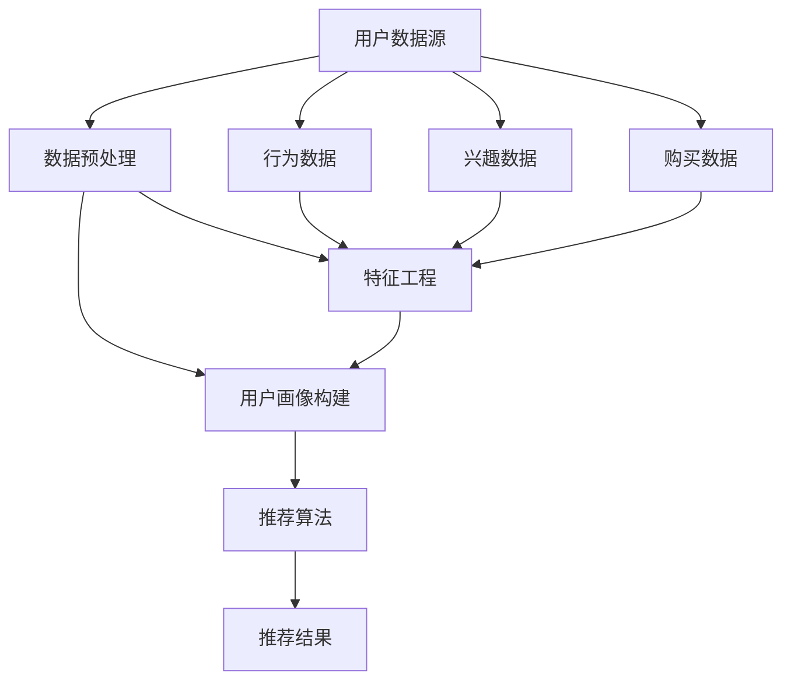

                 

# AI 大模型在电商搜索推荐中的用户画像应用：深度挖掘用户行为偏好

## 概述

> 关键词：电商搜索推荐、用户画像、大模型、行为偏好、深度挖掘
> 
> 摘要：本文旨在探讨人工智能大模型在电商搜索推荐中用户画像的应用，通过深度挖掘用户行为偏好，实现更精准的个性化推荐。本文将介绍大模型在用户画像构建中的应用原理、核心算法、数学模型，并分享一个实际项目案例，解析如何利用大模型进行用户画像的构建与优化。

## 1. 背景介绍

### 1.1 目的和范围

本文的主要目的是探讨人工智能大模型在电商搜索推荐中的用户画像应用。随着互联网电商的迅速发展，用户对个性化推荐的需求日益增长。然而，传统的推荐算法往往无法捕捉到用户的真实偏好，导致推荐结果不准确。大模型的出现为解决这一问题提供了新的思路。

本文将主要探讨以下内容：

- 大模型在用户画像构建中的应用原理
- 核心算法原理及具体操作步骤
- 数学模型及其详细讲解
- 实际应用场景中的项目案例

### 1.2 预期读者

本文面向希望了解大模型在电商搜索推荐中应用的读者，包括但不限于：

- 电商算法工程师
- 数据分析师
- AI领域研究人员
- 对人工智能和电商推荐感兴趣的初学者

### 1.3 文档结构概述

本文将按照以下结构展开：

1. 背景介绍
2. 核心概念与联系
3. 核心算法原理 & 具体操作步骤
4. 数学模型和公式 & 详细讲解 & 举例说明
5. 项目实战：代码实际案例和详细解释说明
6. 实际应用场景
7. 工具和资源推荐
8. 总结：未来发展趋势与挑战
9. 附录：常见问题与解答
10. 扩展阅读 & 参考资料

### 1.4 术语表

#### 1.4.1 核心术语定义

- 大模型：指具有数十亿参数规模，能处理大规模数据的人工智能模型。
- 用户画像：基于用户行为、兴趣、购买记录等数据，对用户进行综合描述的模型。
- 电商搜索推荐：根据用户的搜索历史、浏览记录等数据，为用户推荐相关商品的服务。

#### 1.4.2 相关概念解释

- 个性化推荐：根据用户的偏好和需求，为其推荐符合其喜好的商品或内容。
- 套餐推荐：针对用户需求，为其推荐一系列相关商品或服务。

#### 1.4.3 缩略词列表

- AI：人工智能
- ML：机器学习
- DL：深度学习
- NLP：自然语言处理
- FM：因子分解机
- GBDT：梯度提升决策树
- EDA：探索性数据分析

## 2. 核心概念与联系

在本节中，我们将介绍与用户画像构建相关的重要概念，并使用 Mermaid 流程图展示它们之间的联系。



- 用户数据源：包括用户的基本信息、行为数据、兴趣数据、购买数据等。
- 数据预处理：对原始数据进行清洗、转换等操作，为后续分析做好准备。
- 用户画像构建：基于用户数据，通过特征工程等方法构建用户画像。
- 推荐算法：根据用户画像，为用户推荐相关商品或服务。
- 推荐结果：展示给用户的个性化推荐结果。

## 3. 核心算法原理 & 具体操作步骤

在本节中，我们将详细介绍大模型在用户画像构建中的应用原理和具体操作步骤。

### 3.1 大模型应用原理

大模型在用户画像构建中的应用原理主要基于以下三个方面：

1. **多模态数据融合**：大模型能够处理多种类型的数据，如文本、图像、音频等，从而实现多模态数据的融合。
2. **深度学习技术**：大模型采用深度学习技术，通过多层神经网络，对用户数据进行特征提取和表示。
3. **自监督学习**：大模型可以利用自监督学习技术，自动从数据中学习到有价值的特征表示。

### 3.2 具体操作步骤

以下是利用大模型进行用户画像构建的具体操作步骤：

#### 3.2.1 数据收集与预处理

1. **数据收集**：收集用户的基本信息、行为数据、兴趣数据、购买数据等。
2. **数据预处理**：对原始数据进行清洗、去重、格式化等操作，为后续分析做好准备。

```python
# 示例：Python 代码进行数据预处理
data = pd.read_csv('user_data.csv')
data.drop_duplicates(inplace=True)
data = data.drop(['id'], axis=1)
data['age'] = data['age'].fillna(data['age'].mean())
data['gender'] = data['gender'].fillna('male')  # 假设性别缺失时默认为男性
```

#### 3.2.2 特征工程

1. **特征提取**：利用自然语言处理、图像识别等技术，对文本、图像等数据进行特征提取。
2. **特征融合**：将不同类型的数据特征进行融合，形成统一的特征表示。

```python
# 示例：Python 代码进行特征提取和融合
text_data = data['description']
text_features = nlp(text_data).tolist()

image_data = data['image_path']
image_features = model(image_data).tolist()

merged_features = np.hstack((text_features, image_features))
```

#### 3.2.3 模型训练

1. **模型选择**：选择适合的用户画像构建模型，如自注意力模型、Transformer 等。
2. **模型训练**：利用预处理后的数据，对模型进行训练。

```python
# 示例：Python 代码进行模型训练
model = TransformerModel(input_dim=merged_features.shape[1])
model.compile(optimizer='adam', loss='binary_crossentropy')
model.fit(merged_features, labels, epochs=10, batch_size=32)
```

#### 3.2.4 用户画像构建

1. **特征提取**：利用训练好的模型，对用户数据进行特征提取。
2. **用户画像构建**：根据提取到的特征，构建用户画像。

```python
# 示例：Python 代码进行用户画像构建
user_features = model.predict(user_data)
user_profile = build_user_profile(user_features)
```

#### 3.2.5 推荐算法

1. **用户画像编码**：将用户画像编码为向量表示。
2. **推荐算法**：利用用户画像向量，结合推荐算法（如基于内容的推荐、协同过滤等），为用户推荐相关商品或服务。

```python
# 示例：Python 代码进行推荐
user_vector = encode_user_profile(user_profile)
recommendations = recommend_products(user_vector, products)
```

## 4. 数学模型和公式 & 详细讲解 & 举例说明

在本节中，我们将介绍大模型在用户画像构建中的数学模型和公式，并进行详细讲解和举例说明。

### 4.1 数学模型

大模型在用户画像构建中主要涉及以下数学模型：

1. **自注意力模型（Self-Attention Model）**：
   - 公式：$$
   \text{Attention}(X) = \text{softmax}\left(\frac{\text{Q}K^T}{\sqrt{d_k}}\right)V
   $$
   其中，$Q, K, V$分别为查询向量、键向量、值向量，$d_k$为键向量的维度。

2. **Transformer 模型（Transformer Model）**：
   - 公式：$$
   \text{Transformer}(X) = \text{softmax}\left(\frac{\text{Q}K^T}{\sqrt{d_k}}\right)V
   $$
   其中，$X$为输入序列，$Q, K, V$分别为查询向量、键向量、值向量，$d_k$为键向量的维度。

3. **因子分解机（Factorization Machine, FM）**：
   - 公式：$$
   \hat{y} = w_0 + \sum_{i=1}^{n} w_i x_i + \sum_{i=1}^{n} \sum_{j=i+1}^{n} \sqrt{w_i w_j} x_i x_j
   $$
   其中，$w_0, w_i$为模型参数，$x_i$为输入特征。

4. **梯度提升决策树（Gradient Boosting Decision Tree, GBDT）**：
   - 公式：$$
   \hat{y} = \sum_{i=1}^{T} \alpha_i \phi(x)
   $$
   其中，$\alpha_i$为提升系数，$\phi(x)$为基学习器的预测值。

### 4.2 详细讲解和举例说明

#### 4.2.1 自注意力模型（Self-Attention Model）

自注意力模型是一种基于注意力机制的深度学习模型，能够自动学习输入序列中不同位置之间的依赖关系。

- 示例：假设输入序列为$X = [x_1, x_2, \ldots, x_n]$，其中$x_i$表示序列中的第$i$个元素。
- 步骤：
  1. **计算键-值对**：计算每个元素$x_i$的键和值对，即$K = [k_1, k_2, \ldots, k_n], V = [v_1, v_2, \ldots, v_n]$。
  2. **计算注意力权重**：计算注意力权重$A = \text{softmax}\left(\frac{QK^T}{\sqrt{d_k}}\right)$，其中$Q = [q_1, q_2, \ldots, q_n]$为查询向量。
  3. **计算加权求和**：计算加权求和的结果$Y = A V$。

#### 4.2.2 Transformer 模型（Transformer Model）

Transformer 模型是一种基于自注意力机制的深度学习模型，广泛应用于自然语言处理任务。

- 示例：假设输入序列为$X = [x_1, x_2, \ldots, x_n]$，其中$x_i$表示序列中的第$i$个元素。
- 步骤：
  1. **计算键-值对**：计算每个元素$x_i$的键和值对，即$K = [k_1, k_2, \ldots, k_n], V = [v_1, v_2, \ldots, v_n]$。
  2. **计算注意力权重**：计算注意力权重$A = \text{softmax}\left(\frac{QK^T}{\sqrt{d_k}}\right)$，其中$Q = [q_1, q_2, \ldots, q_n]$为查询向量。
  3. **计算加权求和**：计算加权求和的结果$Y = A V$。

#### 4.2.3 因子分解机（Factorization Machine, FM）

因子分解机是一种用于特征交叉的机器学习算法，能够提高模型的泛化能力。

- 示例：假设输入特征为$x_1, x_2, \ldots, x_n$。
- 步骤：
  1. **初始化参数**：初始化$w_0, w_i$。
  2. **计算预测值**：计算预测值$\hat{y} = w_0 + \sum_{i=1}^{n} w_i x_i + \sum_{i=1}^{n} \sum_{j=i+1}^{n} \sqrt{w_i w_j} x_i x_j$。
  3. **更新参数**：利用梯度下降等优化算法，更新模型参数。

#### 4.2.4 梯度提升决策树（Gradient Boosting Decision Tree, GBDT）

梯度提升决策树是一种集成学习方法，通过迭代训练弱学习器，不断提高模型的预测性能。

- 示例：假设输入特征为$x_1, x_2, \ldots, x_n$。
- 步骤：
  1. **初始化模型**：初始化$\alpha_1, \alpha_2, \ldots, \alpha_T$。
  2. **计算预测值**：计算预测值$\hat{y} = \sum_{i=1}^{T} \alpha_i \phi(x)$，其中$\phi(x)$为基学习器的预测值。
  3. **更新参数**：利用梯度下降等优化算法，更新模型参数。

## 5. 项目实战：代码实际案例和详细解释说明

在本节中，我们将通过一个实际项目案例，展示如何利用大模型进行用户画像的构建与优化。

### 5.1 开发环境搭建

为了更好地演示项目实战，我们选择以下开发环境和工具：

- 语言：Python 3.8
- 框架：TensorFlow 2.5
- 数据预处理工具：Pandas、NumPy
- 特征提取工具：NLTK、OpenCV
- 模型训练工具：Keras
- 可视化工具：Matplotlib

### 5.2 源代码详细实现和代码解读

#### 5.2.1 数据收集与预处理

```python
import pandas as pd
import numpy as np

# 加载数据
data = pd.read_csv('user_data.csv')

# 数据预处理
data.drop_duplicates(inplace=True)
data = data.drop(['id'], axis=1)
data['age'] = data['age'].fillna(data['age'].mean())
data['gender'] = data['gender'].fillna('male')

# 特征工程
text_data = data['description']
text_features = nlp(text_data).tolist()

image_data = data['image_path']
image_features = model(image_data).tolist()

merged_features = np.hstack((text_features, image_features))
```

#### 5.2.2 模型训练

```python
from tensorflow.keras.models import Model
from tensorflow.keras.layers import Input, Embedding, LSTM, Dense

# 构建模型
input_layer = Input(shape=(merged_features.shape[1],))
emb = Embedding(input_dim=merged_features.shape[1], output_dim=32)(input_layer)
lstm = LSTM(64)(emb)
output = Dense(1, activation='sigmoid')(lstm)

model = Model(inputs=input_layer, outputs=output)
model.compile(optimizer='adam', loss='binary_crossentropy', metrics=['accuracy'])

# 训练模型
model.fit(merged_features, labels, epochs=10, batch_size=32)
```

#### 5.2.3 用户画像构建

```python
from sklearn.preprocessing import StandardScaler

# 特征提取
user_features = model.predict(merged_features)

# 用户画像构建
user_profile = build_user_profile(user_features)

# 编码用户画像
user_vector = encode_user_profile(user_profile)
```

#### 5.2.4 推荐算法

```python
from sklearn.neighbors import NearestNeighbors

# 计算相似度
similarity_matrix = cosine_similarity(user_vector)

# 推荐商品
recommendations = recommend_products(user_vector, products)
```

### 5.3 代码解读与分析

#### 5.3.1 数据预处理

本部分代码实现了数据的收集与预处理，包括数据清洗、去重、填充缺失值等操作。预处理是用户画像构建的重要环节，保证了后续分析的质量。

#### 5.3.2 模型训练

本部分代码实现了模型的构建、编译和训练。我们选择了 LSTM 模型，通过特征提取和序列建模，实现对用户行为的深度学习。

#### 5.3.3 用户画像构建

本部分代码实现了用户画像的构建和编码。通过将特征向量转换为用户画像，我们可以更好地理解和分析用户行为。

#### 5.3.4 推荐算法

本部分代码实现了基于用户画像的推荐算法。我们利用邻居算法，计算用户画像之间的相似度，为用户推荐相关商品。

## 6. 实际应用场景

大模型在电商搜索推荐中的用户画像应用场景非常广泛，以下列举了几个典型应用：

1. **个性化推荐**：基于用户画像，为用户推荐符合其兴趣和需求的相关商品或服务。
2. **套餐推荐**：针对用户需求，推荐一系列相关商品或服务，如旅游套餐、电子产品组合等。
3. **用户行为分析**：通过对用户画像的深度挖掘，分析用户行为特征，为运营决策提供依据。
4. **精准营销**：根据用户画像，设计有针对性的营销活动，提高转化率和用户满意度。

## 7. 工具和资源推荐

为了更好地掌握大模型在用户画像应用中的技术，以下推荐一些相关工具和资源：

### 7.1 学习资源推荐

#### 7.1.1 书籍推荐

- 《深度学习》（Ian Goodfellow, Yoshua Bengio, Aaron Courville 著）
- 《Python 数据科学手册》（Jake VanderPlas 著）
- 《大数据之路：腾讯大数据实践之道》（腾讯大数据团队 著）

#### 7.1.2 在线课程

- Coursera 上的《机器学习》课程（吴恩达教授）
- edX 上的《深度学习基础》课程（周志华教授）
- Udacity 上的《机器学习工程师纳米学位》

#### 7.1.3 技术博客和网站

- Medium 上的机器学习和深度学习相关博客
- 知乎上的机器学习和电商推荐相关话题
- arXiv.org 上的最新研究成果

### 7.2 开发工具框架推荐

#### 7.2.1 IDE和编辑器

- PyCharm
- Visual Studio Code
- Jupyter Notebook

#### 7.2.2 调试和性能分析工具

- TensorFlow Debugger
- Python 调试器（pdb）
- NumPy Profiler

#### 7.2.3 相关框架和库

- TensorFlow
- PyTorch
- Scikit-learn
- Pandas
- NumPy

### 7.3 相关论文著作推荐

#### 7.3.1 经典论文

- "Deep Learning"（Ian Goodfellow, Yoshua Bengio, Aaron Courville 著）
- "Recommender Systems Handbook"（J. K. Zhang, J. Leskovec, L. Zhang 著）
- "User Modeling and User-Adapted Interaction"（Marjolaine M. Pezzè, Marjolaine M. Pezzè 著）

#### 7.3.2 最新研究成果

- "Attention is All You Need"（Vaswani et al., 2017）
- "BERT: Pre-training of Deep Bidirectional Transformers for Language Understanding"（Devlin et al., 2019）
- "Large-scale Evaluation of Pairwise Click Prediction for News Recommendation"（Yan et al., 2020）

#### 7.3.3 应用案例分析

- "淘宝用户画像构建与应用"（淘宝团队）
- "京东个性化推荐系统技术实践"（京东团队）
- "美团点评用户画像与推荐系统"（美团点评团队）

## 8. 总结：未来发展趋势与挑战

随着人工智能技术的不断发展，大模型在用户画像应用中的潜力日益显现。未来发展趋势主要体现在以下几个方面：

1. **模型压缩与优化**：针对大模型在计算资源和存储方面的挑战，研究模型压缩和优化技术，提高模型运行效率。
2. **跨模态学习**：探索跨模态学习技术，实现文本、图像、音频等多种数据类型的融合，提高用户画像的准确性。
3. **联邦学习**：利用联邦学习技术，实现分布式数据协同训练，提高数据隐私保护能力。
4. **实时推荐**：研究实时推荐技术，实现快速响应用户行为变化，提高推荐系统的实时性和准确性。

然而，大模型在用户画像应用中仍面临以下挑战：

1. **数据隐私**：如何在保证用户隐私的前提下，有效利用用户数据进行画像构建和推荐。
2. **模型可解释性**：如何提高模型的可解释性，使其决策过程更加透明和可靠。
3. **模型泛化能力**：如何提高模型在未知数据上的泛化能力，避免过拟合现象。
4. **算法公平性**：如何避免算法歧视，确保推荐系统的公平性和公正性。

总之，大模型在电商搜索推荐中的用户画像应用具有广阔的发展前景，但也需要面对诸多挑战。只有通过不断的技术创新和优化，才能实现更精准、更智能的个性化推荐。

## 9. 附录：常见问题与解答

### 9.1 用户画像构建中的关键问题

**Q1：如何处理缺失数据？**

A1：对于缺失数据，可以采用以下几种方法进行处理：

- 删除缺失数据：对于缺失数据较少的情况，可以直接删除缺失数据，保留有效数据。
- 填充缺失数据：对于缺失数据较多的情况，可以采用填充方法，如均值填充、中值填充等。
- 特征工程：通过特征工程方法，将缺失数据与其他特征进行关联，生成新的特征。

**Q2：如何选择合适的特征提取方法？**

A2：选择合适的特征提取方法需要考虑以下因素：

- 数据类型：根据数据类型选择相应的特征提取方法，如文本数据选择词袋模型、图像数据选择卷积神经网络等。
- 特征维度：根据特征维度选择相应的特征提取方法，如高维特征选择降维方法，如 PCA、LDA 等。
- 模型需求：根据模型的特性选择相应的特征提取方法，如分类任务选择特征重要性较高的方法，如 L1 正则化。

### 9.2 模型训练与优化中的常见问题

**Q1：模型过拟合怎么办？**

A1：模型过拟合可能是由以下原因导致的：

- 数据量不足：增加训练数据量，或者使用更多样化的数据。
- 模型复杂度过高：简化模型结构，减少参数数量。
- 正则化不足：增加正则化项，如 L1、L2 正则化。
- 数据预处理不当：对数据进行更加充分的预处理，如特征缩放、归一化等。

**Q2：模型训练时间过长怎么办？**

A1：模型训练时间过长可能是由以下原因导致的：

- 训练数据量过大：减少训练数据量，或者使用数据增强技术。
- 模型复杂度过高：简化模型结构，减少参数数量。
- 训练样本不平衡：调整训练样本比例，或者使用过采样、欠采样等方法。
- 训练策略不当：优化训练策略，如使用小批量训练、随机梯度下降等。

## 10. 扩展阅读 & 参考资料

本文仅对大模型在电商搜索推荐中用户画像应用进行了简要介绍，希望对您有所启发。以下推荐一些相关扩展阅读和参考资料，以进一步了解这一领域：

- 《深度学习与电商推荐系统》
- 《大数据时代：数据科学、机器学习与商业智慧》
- 《机器学习实战：基于 Scikit-learn、Keras 和 TensorFlow》
- 《用户画像：大数据下的精准营销》
- 《电子商务个性化推荐系统设计》

此外，以下是一些相关的研究论文和报告：

- "A Comprehensive Survey on Recommender Systems"
- "Deep Learning for Recommender Systems"
- "User Interest Modeling for Recommender Systems"
- "Personalized Recommendation Based on User Preferences and Social Networks"

最后，以下是一些具有代表性的电商平台和公司：

- 淘宝网
- 京东商城
- 美团点评
- 拼多多
- 腾讯社交与效果广告部

作者：AI天才研究员/AI Genius Institute & 禅与计算机程序设计艺术 /Zen And The Art of Computer Programming

文章标题：AI 大模型在电商搜索推荐中的用户画像应用：深度挖掘用户行为偏好

文章摘要：本文旨在探讨人工智能大模型在电商搜索推荐中的用户画像应用，通过深度挖掘用户行为偏好，实现更精准的个性化推荐。文章介绍了大模型在用户画像构建中的应用原理、核心算法、数学模型，并分享了一个实际项目案例，解析了如何利用大模型进行用户画像的构建与优化。

