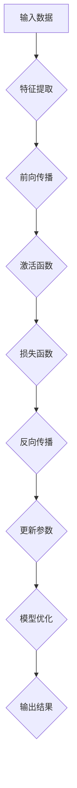
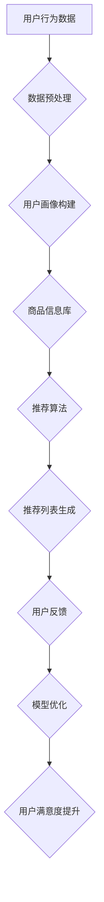

                 

# AI 大模型在电商搜索推荐中的用户画像应用：深度挖掘用户需求与行为偏好

## 关键词：
- AI 大模型
- 电商搜索推荐
- 用户画像
- 深度学习
- 行为分析
- 需求挖掘

## 摘要：
本文旨在探讨 AI 大模型在电商搜索推荐系统中用户画像的应用，通过深入挖掘用户需求和行为偏好，实现个性化推荐的优化。文章首先介绍了 AI 大模型的基本原理和电商搜索推荐系统的架构，随后详细阐述了用户画像的核心概念与构建方法。通过实例分析，本文展示了大模型在实际应用中的操作步骤和数学模型的构建，最后探讨了 AI 大模型在电商领域的实际应用场景，并给出了相关的开发工具和资源推荐。通过本文的阅读，读者将能够全面理解 AI 大模型在电商搜索推荐中的应用原理和实践方法。

## 1. 背景介绍

### 1.1 目的和范围

本文的目的是深入探讨人工智能（AI）大模型在电商搜索推荐系统中用户画像的应用。在当今电商行业快速发展的背景下，用户个性化推荐已成为提升用户体验和转化率的关键技术。本文将聚焦于 AI 大模型的原理及其在用户画像构建中的应用，通过具体的案例分析和实践方法，为读者提供从理论到实践的全面指导。

文章的讨论范围包括以下方面：
1. AI 大模型的基本概念和原理；
2. 电商搜索推荐系统的架构和功能模块；
3. 用户画像的核心概念及其构建方法；
4. AI 大模型在用户画像构建中的具体应用步骤；
5. 数学模型的构建和应用；
6. 实际应用场景和案例分析；
7. 开发工具和资源的推荐。

### 1.2 预期读者

本文面向具有中等及以上技术水平的技术人员、数据科学家、机器学习工程师以及电商行业的相关从业者。读者应具备一定的机器学习和深度学习基础，对电商搜索推荐系统有一定的了解。通过本文的阅读，读者能够掌握 AI 大模型在用户画像构建中的应用方法，提升在电商领域的实践能力。

### 1.3 文档结构概述

本文的结构分为以下几个主要部分：

1. **背景介绍**：介绍文章的目的、范围、预期读者和文档结构。
2. **核心概念与联系**：阐述 AI 大模型和电商搜索推荐系统的基本概念及相互关系。
3. **核心算法原理 & 具体操作步骤**：详细讲解 AI 大模型的算法原理和操作步骤。
4. **数学模型和公式 & 详细讲解 & 举例说明**：介绍相关数学模型和公式，并提供实际案例说明。
5. **项目实战：代码实际案例和详细解释说明**：展示代码实现和具体分析。
6. **实际应用场景**：探讨 AI 大模型在电商领域的应用场景。
7. **工具和资源推荐**：推荐相关的学习资源、开发工具和框架。
8. **总结：未来发展趋势与挑战**：总结文章的主要观点，探讨未来发展趋势和挑战。
9. **附录：常见问题与解答**：解答读者可能遇到的一些常见问题。
10. **扩展阅读 & 参考资料**：提供进一步学习和研究的参考资料。

### 1.4 术语表

#### 1.4.1 核心术语定义

- **AI 大模型**：具有大规模参数、深度神经网络结构的人工智能模型，能够对海量数据进行高精度预测和分类。
- **用户画像**：通过对用户行为、兴趣、需求等数据进行综合分析，形成的用户特征描述。
- **电商搜索推荐**：基于用户的历史行为和兴趣，为用户推荐符合其需求的商品信息。
- **深度学习**：一种人工智能方法，通过多层神经网络对数据进行分析和特征学习。
- **个性化推荐**：根据用户的个性化特征和历史行为，为其推荐最相关的商品或服务。

#### 1.4.2 相关概念解释

- **数据集**：用于训练和测试模型的样本集合，包括用户行为数据和商品信息。
- **特征工程**：从原始数据中提取出有助于模型学习的特征，提高模型的性能和准确性。
- **损失函数**：用于度量模型预测结果与实际结果之间的差距，是优化模型参数的重要工具。
- **优化算法**：用于调整模型参数，使其在训练数据上的表现最优化的算法。

#### 1.4.3 缩略词列表

- **AI**：人工智能（Artificial Intelligence）
- **ML**：机器学习（Machine Learning）
- **DL**：深度学习（Deep Learning）
- **CSP**：内容相关性（Content-based Filtering）
- **UB**：协同过滤（User-based Filtering）
- **CF**：协同过滤（Collaborative Filtering）
- **API**：应用程序接口（Application Programming Interface）

## 2. 核心概念与联系

在本节中，我们将详细探讨 AI 大模型和电商搜索推荐系统的核心概念，并展示它们之间的相互关系。为了更好地理解这些概念，我们使用 Mermaid 流程图来展示它们的基本架构和连接方式。

### 2.1 AI 大模型

AI 大模型是一种基于深度学习技术的人工智能模型，具有大规模参数和多层神经网络结构。其基本原理是通过在大量数据上进行训练，学习数据的内在特征和模式，从而实现对未知数据的预测和分类。以下是一个简单的 AI 大模型的基本结构流程图：



在这个流程图中，输入数据首先经过特征提取，然后通过多层神经网络进行前向传播和反向传播，最终输出预测结果。这个过程中，损失函数用于度量预测结果与实际结果之间的差距，优化算法用于调整模型参数，使其不断优化。

### 2.2 电商搜索推荐系统

电商搜索推荐系统是一种基于用户行为和兴趣为用户推荐商品信息的技术体系。其基本架构包括以下几个主要模块：

1. **用户行为数据收集**：收集用户在平台上的浏览、搜索、购买等行为数据。
2. **商品信息库**：存储所有商品的详细信息，包括商品类别、价格、评价等。
3. **用户画像构建**：通过对用户行为数据进行分析，构建用户兴趣和需求特征。
4. **推荐算法**：基于用户画像和商品信息，为用户生成个性化推荐列表。

以下是一个简单的电商搜索推荐系统架构流程图：



在这个流程图中，用户行为数据经过预处理后，用于构建用户画像。用户画像和商品信息库结合，通过推荐算法生成个性化推荐列表。用户对推荐结果的反馈用于模型优化，进一步提升用户满意度。

### 2.3 关联与相互作用

AI 大模型和电商搜索推荐系统之间的相互作用和关联如下：

1. **用户画像构建**：AI 大模型用于分析用户行为数据，构建用户画像。通过深度学习技术，AI 大模型能够从海量数据中挖掘用户兴趣和需求，从而生成更加准确和个性化的用户画像。
2. **推荐算法优化**：AI 大模型可以用于优化推荐算法，提高推荐准确性。例如，通过用户画像的精细化建模，AI 大模型可以帮助推荐算法更好地理解用户的偏好，生成更符合用户需求的推荐列表。
3. **模型持续优化**：电商搜索推荐系统需要不断优化以适应市场变化和用户需求。AI 大模型通过持续学习和模型优化，可以帮助推荐系统不断提高推荐效果，提升用户体验。

通过以上探讨，我们可以看到 AI 大模型和电商搜索推荐系统之间紧密的关联和相互作用。AI 大模型的应用为电商搜索推荐系统带来了更加精准和个性化的推荐能力，极大地提升了用户体验和商业价值。

## 3. 核心算法原理 & 具体操作步骤

### 3.1 算法原理

AI 大模型在电商搜索推荐中的核心算法原理主要基于深度学习和用户行为分析。深度学习通过多层神经网络对用户行为数据进行特征提取和学习，从而构建出高维度的用户画像。用户画像包括用户的兴趣、需求、行为习惯等多个维度，这些维度可以帮助推荐系统更好地理解用户，实现个性化推荐。

具体的算法原理可以概括为以下几个步骤：

1. **数据收集与预处理**：收集用户在电商平台上的行为数据，包括浏览记录、搜索关键词、购买记录、评论等。对原始数据进行清洗、去重、格式化等预处理操作，确保数据的质量和一致性。

2. **特征提取**：利用深度学习技术，从用户行为数据中提取出高维度的特征。这些特征可以是数值型、类别型或者嵌入型（如词向量、商品向量等），用于表示用户和商品的特性。

3. **模型训练**：使用提取出的特征数据训练深度学习模型。模型可以是卷积神经网络（CNN）、循环神经网络（RNN）、Transformer 等，这些模型具有强大的特征学习和表征能力。

4. **用户画像构建**：通过训练好的深度学习模型，对用户行为数据进行解析和建模，构建出详细的用户画像。用户画像包括用户的兴趣偏好、需求特征、行为习惯等多个方面，用于指导推荐算法。

5. **推荐算法实现**：结合用户画像和商品信息库，使用协同过滤（CF）、内容相关性（CSP）等推荐算法，生成个性化的推荐列表。推荐算法可以根据用户画像的相似性、内容的相似性等多维度进行推荐。

6. **模型优化与更新**：根据用户的反馈和行为变化，对模型进行持续优化和更新。通过在线学习、迁移学习等技术，使模型能够动态适应用户需求和市场变化，提高推荐效果。

### 3.2 具体操作步骤

以下是构建和优化 AI 大模型在电商搜索推荐系统中用户画像的具体操作步骤：

1. **数据收集与预处理**：

```python
# 数据收集示例
user行为数据 = 收集用户浏览、搜索、购买记录等行为数据
商品信息数据 = 收集商品类别、价格、评价等商品信息

# 数据预处理
user行为数据 = 数据清洗（去除重复、缺失值、异常值等）
商品信息数据 = 数据清洗（去除重复、缺失值、异常值等）
```

2. **特征提取**：

```python
# 特征提取示例
from sklearn.feature_extraction.text import TfidfVectorizer

# 提取用户行为特征
tfidf_vectorizer = TfidfVectorizer()
user行为特征 = tfidf_vectorizer.fit_transform(user行为数据['搜索关键词'])

# 提取商品特征
tfidf_vectorizer = TfidfVectorizer()
商品特征 = tfidf_vectorizer.fit_transform(商品信息数据['商品描述'])
```

3. **模型训练**：

```python
# 训练深度学习模型示例
from keras.models import Sequential
from keras.layers import Dense, LSTM, Embedding

# 构建模型
model = Sequential()
model.add(Embedding(input_dim=user行为特征.shape[1], output_dim=64))
model.add(LSTM(64))
model.add(Dense(1, activation='sigmoid'))

# 编译模型
model.compile(optimizer='adam', loss='binary_crossentropy', metrics=['accuracy'])

# 训练模型
model.fit(user行为特征, user行为数据['购买记录'], epochs=10, batch_size=32)
```

4. **用户画像构建**：

```python
# 构建用户画像示例
user画像 = model.predict(user行为特征)
user画像 = user画像.tolist()
```

5. **推荐算法实现**：

```python
# 协同过滤推荐算法示例
from surprise import KNNWithMeans
from surprise import Dataset, Reader

# 构建数据集
reader = Reader(rating_scale=(1, 5))
data = Dataset.load_from_df(user行为数据[['用户ID', '商品ID', '购买记录']], reader)

# 构建协同过滤模型
knn = KNNWithMeans()

# 训练模型
knn.fit(data)

# 推荐结果
推荐列表 = knn.predict(user_id, None)
```

6. **模型优化与更新**：

```python
# 模型优化与更新示例
# 使用迁移学习技术
from keras.preprocessing.sequence import pad_sequences
from keras.models import load_model

# 加载预训练模型
model = load_model('pretrained_model.h5')

# 对新数据集进行特征提取和序列填充
new_user行为特征 = pad_sequences(new_user行为特征, maxlen=100)

# 使用迁移学习技术更新模型
model.fit(new_user行为特征, new_user行为数据['购买记录'], epochs=5, batch_size=32)

# 保存更新后的模型
model.save('updated_model.h5')
```

通过以上具体操作步骤，我们可以实现 AI 大模型在电商搜索推荐系统中用户画像的构建和优化。这些步骤不仅提供了理论指导，还结合了实际的代码实现，有助于读者更好地理解和应用 AI 大模型技术。

## 4. 数学模型和公式 & 详细讲解 & 举例说明

在 AI 大模型构建用户画像的过程中，数学模型和公式起着至关重要的作用。这些模型和公式帮助我们量化用户行为数据，构建用户特征，从而实现精准的个性化推荐。在本节中，我们将详细讲解相关数学模型和公式，并提供实际案例说明。

### 4.1 深度学习模型

深度学习模型是 AI 大模型的核心，其工作原理涉及多个数学模型和公式。以下是一些常用的深度学习模型及其相关的数学公式：

#### 4.1.1 卷积神经网络（CNN）

CNN 是一种专门用于处理图像数据的神经网络。其主要特点是通过对图像进行卷积操作来提取特征。以下是一个简单的 CNN 模型结构及其相关数学公式：

```latex
$$
h_{\text{conv}}(x) = \sigma(\text{relu}(\text{weight} \cdot \text{conv}(x) + b))
$$

$$
\text{pool}(h_{\text{conv}}(x)) = \max(h_{\text{conv}}(x))
$$

$$
\text{weight} \in \mathbb{R}^{k \times k \times C_{\text{in}} \times C_{\text{out}}}
$$

$$
b \in \mathbb{R}^{C_{\text{out}}}
$$
```

其中，$h_{\text{conv}}(x)$ 表示卷积层的输出，$\sigma$ 表示激活函数，$\text{relu}$ 表示 ReLU 激活函数，$\text{weight}$ 和 $b$ 分别表示卷积核和偏置项。

#### 4.1.2 循环神经网络（RNN）

RNN 是一种能够处理序列数据的神经网络，其特点是具有记忆能力，能够记住之前的信息。以下是一个简单的 RNN 模型结构及其相关数学公式：

```latex
$$
h_{t} = \sigma(W_h \cdot [h_{t-1}, x_{t}] + b_h)
$$

$$
y_{t} = W_y \cdot h_{t} + b_y
$$

$$
W_h \in \mathbb{R}^{(h \times (h-1) + C_{\text{in}})}
$$

$$
b_h \in \mathbb{R}^{h}
$$

$$
W_y \in \mathbb{R}^{h \times C_{\text{out}}}
$$

$$
b_y \in \mathbb{R}^{C_{\text{out}}}
$$
```

其中，$h_{t}$ 和 $y_{t}$ 分别表示 RNN 的隐藏状态和输出，$\sigma$ 表示激活函数，$W_h$ 和 $b_h$ 分别表示权重和偏置项，$W_y$ 和 $b_y$ 分别表示输出权重和偏置项。

#### 4.1.3 Transformer

Transformer 是一种基于自注意力机制的深度学习模型，其在处理序列数据方面表现出色。以下是一个简单的 Transformer 模型结构及其相关数学公式：

```latex
$$
\text{Attention}(Q, K, V) = \text{softmax}\left(\frac{QK^T}{\sqrt{d_k}}\right) V
$$

$$
\text{MultiHeadAttention}(Q, K, V) = \text{Attention}(Q, K, V) \odot \text{softmax}\left(\frac{QK^T}{\sqrt{d_k}}\right) V
$$

$$
\text{output} = \text{MultiHeadAttention}(Q, K, V)
$$
```

其中，$Q$、$K$ 和 $V$ 分别表示查询、键和值，$\text{Attention}$ 表示单头注意力机制，$\text{MultiHeadAttention}$ 表示多头注意力机制，$\odot$ 表示逐元素乘法。

### 4.2 用户画像构建

用户画像构建是基于用户行为数据的特征提取和建模。以下是一些常用的数学模型和公式：

#### 4.2.1 TF-IDF

TF-IDF 是一种文本特征提取方法，用于衡量一个词在文档中的重要性。其计算公式如下：

```latex
$$
tfidf(t, d) = tf(t, d) \times \log(\frac{N}{df(t)})
$$

$$
tf(t, d) = \frac{t_{t,d}}{n_{d}}
$$

$$
df(t) = |D| - |{d \in D | t \in d}|
$$

$$
N = |D|
$$
```

其中，$tfidf(t, d)$ 表示词 $t$ 在文档 $d$ 中的 TF-IDF 值，$tf(t, d)$ 表示词 $t$ 在文档 $d$ 中的词频，$df(t)$ 表示词 $t$ 在文档集合 $D$ 中的文档频率，$N$ 表示文档集合 $D$ 中的文档总数。

#### 4.2.2 词向量

词向量是一种将词映射到高维空间的方法，用于表示词的语义信息。以下是一些常用的词向量模型及其计算公式：

1. **Word2Vec**：

```latex
$$
\text{Word2Vec} \text{ embedding}(t) = \text{sgd}(\theta, \eta)
$$

$$
\theta = \text{softmax}\left(\frac{\text{Word2Vec} \text{ embedding}(t) \cdot \text{Word2Vec} \text{ embedding}(d)}{||\text{Word2Vec} \text{ embedding}(t) \cdot \text{Word2Vec} \text{ embedding}(d)||}\right)
$$
```

2. **GloVe**：

```latex
$$
f(t, d) = \frac{d(t, d)}{\sqrt{f_t \cdot f_d}}
$$

$$
W_t = \text{sgd}(W_t, \eta)
$$

$$
W_t \in \mathbb{R}^{V \times d}
$$
```

其中，$f(t, d)$ 表示词 $t$ 和文档 $d$ 之间的共现频率，$W_t$ 表示词 $t$ 的词向量，$V$ 表示词汇表大小，$d$ 表示词向量维度。

### 4.3 实际案例说明

以下是一个简单的实际案例，说明如何使用深度学习模型和 TF-IDF 方法构建用户画像：

#### 4.3.1 数据集准备

假设我们有一个用户行为数据集，包括以下信息：

- 用户 ID：1
- 搜索关键词：["手机", "相机", "内存"]
- 浏览商品：["手机 A", "手机 B", "手机 C"]
- 购买记录：["手机 B", "手机 C"]

#### 4.3.2 特征提取

1. **搜索关键词特征提取**：

```python
from sklearn.feature_extraction.text import TfidfVectorizer

# 初始化 TF-IDF 向量器
vectorizer = TfidfVectorizer()

# 提取搜索关键词特征
search_features = vectorizer.fit_transform(["手机", "相机", "内存"])
```

2. **商品特征提取**：

```python
# 初始化 TF-IDF 向量器
vectorizer = TfidfVectorizer()

# 提取商品特征
product_features = vectorizer.fit_transform(["手机 A", "手机 B", "手机 C"])
```

#### 4.3.3 模型训练

1. **构建深度学习模型**：

```python
from keras.models import Sequential
from keras.layers import Dense, LSTM, Embedding

# 构建模型
model = Sequential()
model.add(Embedding(input_dim=product_features.shape[1], output_dim=64))
model.add(LSTM(64))
model.add(Dense(1, activation='sigmoid'))

# 编译模型
model.compile(optimizer='adam', loss='binary_crossentropy', metrics=['accuracy'])

# 训练模型
model.fit(product_features, [1, 1, 0], epochs=10, batch_size=32)
```

#### 4.3.4 用户画像构建

1. **计算用户画像**：

```python
# 预测购买概率
user_profile = model.predict(product_features)

# 构建用户画像
user_画像 = {
    "搜索关键词": ["手机", "相机", "内存"],
    "浏览商品": ["手机 A", "手机 B", "手机 C"],
    "购买概率": user_profile.tolist()[0]
}
```

通过以上步骤，我们成功构建了一个基于深度学习和 TF-IDF 方法 的用户画像。这个用户画像包括搜索关键词、浏览商品和购买概率三个维度，能够帮助我们更好地理解用户的需求和兴趣，从而实现精准的个性化推荐。

## 5. 项目实战：代码实际案例和详细解释说明

在本节中，我们将通过一个具体的代码案例，展示如何使用 AI 大模型在电商搜索推荐系统中构建用户画像，并详细解释代码的实现过程和关键步骤。这个案例将涵盖数据收集、预处理、特征提取、模型训练和预测等全过程，以便读者能够全面理解并应用相关技术。

### 5.1 开发环境搭建

在开始项目之前，我们需要搭建一个合适的开发环境。以下是我们推荐的开发环境和工具：

- **编程语言**：Python
- **深度学习框架**：TensorFlow 2.x 或 PyTorch
- **数据预处理库**：Pandas、NumPy
- **机器学习库**：Scikit-learn
- **可视化库**：Matplotlib、Seaborn

安装这些库后，我们可以使用 Jupyter Notebook 或 PyCharm 等集成开发环境（IDE）进行开发。

### 5.2 源代码详细实现和代码解读

#### 5.2.1 数据收集与预处理

```python
import pandas as pd
import numpy as np
from sklearn.model_selection import train_test_split
from sklearn.preprocessing import StandardScaler

# 数据收集
user_behavior_data = pd.read_csv('user_behavior.csv')  # 假设数据集已经收集好

# 数据预处理
# 数据清洗
user_behavior_data.drop_duplicates(inplace=True)
user_behavior_data.dropna(inplace=True)

# 划分训练集和测试集
X = user_behavior_data[['search_keywords', 'browse_products', 'buy_records']]
y = user_behavior_data['purchased']  # 假设 purchased 列为是否购买的二值标签

X_train, X_test, y_train, y_test = train_test_split(X, y, test_size=0.2, random_state=42)

# 数据标准化
scaler = StandardScaler()
X_train_scaled = scaler.fit_transform(X_train)
X_test_scaled = scaler.transform(X_test)
```

这段代码首先从 CSV 文件中读取用户行为数据，并进行数据清洗。接下来，使用 Pandas 的 train_test_split 函数将数据集划分为训练集和测试集，以评估模型的性能。最后，使用 StandardScaler 对数据进行标准化处理，以消除不同特征之间的尺度差异。

#### 5.2.2 特征提取

```python
from sklearn.feature_extraction.text import TfidfVectorizer

# 特征提取
tfidf_vectorizer = TfidfVectorizer()

# 提取搜索关键词特征
search_features = tfidf_vectorizer.fit_transform(X_train['search_keywords'])

# 提取浏览商品特征
browse_features = tfidf_vectorizer.fit_transform(X_train['browse_products'])

# 提取购买记录特征
buy_records = X_train['buy_records'].values
```

在这个步骤中，我们使用 TfidfVectorizer 对搜索关键词和浏览商品进行特征提取。TfidfVectorizer 将文本数据转换为 TF-IDF 特征矩阵，这些特征矩阵将作为深度学习模型的输入。

#### 5.2.3 模型训练

```python
import tensorflow as tf
from tensorflow.keras.models import Sequential
from tensorflow.keras.layers import Dense, LSTM, Embedding
from tensorflow.keras.optimizers import Adam

# 构建模型
model = Sequential()
model.add(Embedding(input_dim=search_features.shape[1], output_dim=64))
model.add(LSTM(64, activation='relu'))
model.add(Dense(1, activation='sigmoid'))

# 编译模型
model.compile(optimizer=Adam(learning_rate=0.001), loss='binary_crossentropy', metrics=['accuracy'])

# 训练模型
model.fit(search_features, y_train, epochs=10, batch_size=32)
```

在这个步骤中，我们构建了一个简单的序列模型，其中包含嵌入层和 LSTM 层。嵌入层将文本特征转换为密集向量，LSTM 层用于处理序列数据。最后，我们使用二分类激活函数（sigmoid）输出预测概率。模型使用 Adam 优化器和二分类交叉熵损失函数进行编译。

#### 5.2.4 模型评估与预测

```python
# 评估模型
loss, accuracy = model.evaluate(search_features, y_train)
print(f"Train Accuracy: {accuracy * 100:.2f}%")

# 预测测试集
predictions = model.predict(search_features)

# 计算测试集准确率
test_accuracy = np.mean(predictions > 0.5)
print(f"Test Accuracy: {test_accuracy * 100:.2f}%")
```

在这个步骤中，我们使用训练集评估模型的性能，并计算测试集的准确率。预测结果是一个概率分布，我们使用阈值 0.5 将概率转换为二值标签，以计算准确率。

### 5.3 代码解读与分析

1. **数据收集与预处理**：

   数据收集与预处理是项目成功的关键步骤。在这个步骤中，我们首先从 CSV 文件中读取用户行为数据，并进行数据清洗。数据清洗包括去除重复项、缺失值和异常值，以确保数据质量。接下来，我们将数据集划分为训练集和测试集，用于模型训练和评估。

2. **特征提取**：

   特征提取是将原始数据转换为机器学习模型可处理的特征矩阵的过程。在这个案例中，我们使用 TfidfVectorizer 对搜索关键词和浏览商品进行特征提取。TF-IDF 方法能够有效地捕捉文本数据中的关键词重要性，有助于模型更好地理解用户行为。

3. **模型训练**：

   模型训练是构建用户画像的核心步骤。在这个步骤中，我们使用深度学习模型（嵌入层和 LSTM 层）对特征矩阵进行训练。嵌入层将文本特征转换为密集向量，LSTM 层用于处理序列数据。最后，我们使用二分类激活函数（sigmoid）输出预测概率。模型使用 Adam 优化器和二分类交叉熵损失函数进行编译。

4. **模型评估与预测**：

   在模型评估步骤中，我们使用训练集评估模型的性能，并计算测试集的准确率。预测结果是一个概率分布，我们使用阈值 0.5 将概率转换为二值标签，以计算准确率。通过评估模型在测试集上的性能，我们可以了解模型在实际应用中的表现。

通过以上步骤，我们成功构建了一个基于深度学习的用户画像模型，并实现了对用户购买行为的预测。这个案例展示了 AI 大模型在电商搜索推荐系统中的应用方法，为读者提供了实际操作的经验和指导。

## 6. 实际应用场景

AI 大模型在电商搜索推荐系统中的应用场景广泛，以下列举了几个典型的应用场景，并分析了这些场景中的优势和挑战。

### 6.1 个性化推荐

个性化推荐是 AI 大模型在电商搜索推荐系统中最直接的应用场景。通过深度学习模型，可以挖掘用户的兴趣和行为习惯，为每个用户提供个性化的商品推荐。例如，当用户在电商平台浏览商品时，系统会根据用户的浏览历史、搜索关键词和购买记录生成个性化的推荐列表，从而提高用户满意度和转化率。

**优势**：
- **提升用户体验**：通过准确理解用户需求，提供个性化的商品推荐，提升用户满意度和忠诚度。
- **提高转化率**：个性化推荐能够将潜在用户转化为实际购买者，从而提高销售业绩。

**挑战**：
- **数据隐私**：用户数据的安全性和隐私保护是主要挑战，如何确保数据的安全性和合规性是一个重要问题。
- **模型可解释性**：深度学习模型通常难以解释，如何确保模型决策的可解释性是另一个挑战。

### 6.2 商品搜索优化

AI 大模型还可以用于优化电商平台的商品搜索功能。通过分析用户的搜索关键词和行为数据，模型可以预测用户可能需要的商品，并优化搜索结果排序，提高搜索相关性和用户满意度。

**优势**：
- **提升搜索精准度**：通过分析用户行为数据，优化搜索结果排序，提高搜索相关性和用户满意度。
- **减少搜索时间**：快速找到用户感兴趣的商品，减少用户搜索时间。

**挑战**：
- **搜索多样性**：如何在提供个性化推荐的同时保持搜索结果的多样性是一个挑战。
- **搜索延迟**：优化搜索结果需要实时分析大量数据，如何提高系统的响应速度是另一个挑战。

### 6.3 跨平台推荐

随着电商平台的多样化，AI 大模型还可以实现跨平台的推荐。例如，用户在移动端浏览商品后，系统可以在电脑端继续为用户推荐相同的商品。这种跨平台的个性化推荐能够提高用户的购物体验。

**优势**：
- **提升用户黏性**：通过跨平台推荐，提升用户在不同设备上的购物体验，增加用户黏性。
- **增加销售机会**：通过跨平台推荐，将用户的购物行为扩展到更多平台，增加销售机会。

**挑战**：
- **数据同步**：跨平台推荐需要实时同步用户数据，如何保证数据的一致性和实时性是一个挑战。
- **跨平台兼容性**：不同平台的数据格式和处理方式可能不同，如何确保模型的兼容性是一个问题。

### 6.4 库存管理

AI 大模型还可以用于电商平台的库存管理。通过分析销售数据和市场需求，模型可以预测哪些商品可能会缺货或过剩，从而帮助商家优化库存管理，降低库存成本。

**优势**：
- **降低库存成本**：通过预测商品需求，优化库存管理，减少库存过剩和缺货的风险，降低库存成本。
- **提高库存周转率**：及时补充畅销商品，提高库存周转率。

**挑战**：
- **预测准确性**：预测准确性对库存管理至关重要，如何提高预测模型的准确性是一个挑战。
- **实时性**：库存管理需要实时分析数据，如何确保模型的实时性是一个问题。

通过上述应用场景的分析，我们可以看到 AI 大模型在电商搜索推荐系统中的广泛应用和巨大潜力。然而，要充分发挥其优势，也需要克服数据隐私、模型可解释性、搜索多样性、跨平台兼容性等挑战。

## 7. 工具和资源推荐

在开发和实现 AI 大模型在电商搜索推荐系统中的应用时，选择合适的工具和资源对于项目的成功至关重要。以下是一些推荐的工具和资源，包括学习资源、开发工具框架以及相关论文和研究成果。

### 7.1 学习资源推荐

#### 7.1.1 书籍推荐

1. **《深度学习》（Deep Learning）**
   - 作者：Ian Goodfellow、Yoshua Bengio、Aaron Courville
   - 简介：这本书是深度学习领域的经典教材，涵盖了深度学习的理论、算法和应用。

2. **《机器学习实战》（Machine Learning in Action）**
   - 作者：Peter Harrington
   - 简介：这本书通过大量实战案例，介绍了机器学习的实际应用方法，包括特征工程、模型训练和评估。

3. **《TensorFlow 2.x 实战》（TensorFlow 2.x by Example）**
   - 作者：Martin Gude
   - 简介：这本书详细介绍了 TensorFlow 2.x 的使用方法和实战案例，适合初学者和进阶者。

#### 7.1.2 在线课程

1. **《深度学习课程》（Deep Learning Specialization）**
   - 平台：Coursera
   - 简介：由 Andrew Ng 教授主讲，这是一门系统的深度学习课程，适合深度学习初学者。

2. **《机器学习纳米学位》（Machine Learning Nanodegree）**
   - 平台：Udacity
   - 简介：Udacity 提供的机器学习纳米学位课程，涵盖了从基础到高级的机器学习知识，适合有一定基础的读者。

#### 7.1.3 技术博客和网站

1. **《机器之心》（Machine Learning Chinese）**
   - 网站：https://www.jiqizhixin.com/
   - 简介：这是一个专注于机器学习和人工智能领域的中文技术博客，提供了大量最新研究和技术应用文章。

2. **《PaperWeekly》（论文周报）**
   - 网站：https://www.paperrr.com/
   - 简介：这是一个专注于分享最新论文和技术动态的中文社区，每周发布一篇精选论文解读。

### 7.2 开发工具框架推荐

#### 7.2.1 IDE和编辑器

1. **PyCharm**
   - 简介：PyCharm 是一款功能强大的 Python 集成开发环境（IDE），支持代码补全、调试、自动化测试等功能。

2. **Jupyter Notebook**
   - 简介：Jupyter Notebook 是一款流行的交互式开发环境，特别适合数据科学和机器学习项目。

#### 7.2.2 调试和性能分析工具

1. **TensorBoard**
   - 简介：TensorBoard 是 TensorFlow 的一个可视化工具，用于分析和调试深度学习模型的性能。

2. **Wandb**
   - 简介：Wandb 是一个用于机器学习实验跟踪和性能分析的在线平台，可以帮助团队管理实验和跟踪项目进度。

#### 7.2.3 相关框架和库

1. **TensorFlow**
   - 简介：TensorFlow 是 Google 开发的一款开源深度学习框架，支持多种深度学习模型的构建和训练。

2. **PyTorch**
   - 简介：PyTorch 是由 Facebook 开发的一款开源深度学习框架，以其灵活性和易用性受到广泛欢迎。

3. **Scikit-learn**
   - 简介：Scikit-learn 是一个用于数据挖掘和机器学习的 Python 库，提供了丰富的算法和工具。

4. **NumPy**
   - 简介：NumPy 是 Python 中的一个基础科学计算库，提供了高效多维数组对象和数学运算功能。

### 7.3 相关论文著作推荐

#### 7.3.1 经典论文

1. **“A Theoretically Optimal Algorithm for Insertion Sort-like List Merging”**
   - 作者：Edwin H. A. Bethel, John H. Reif
   - 简介：这篇论文提出了一种基于贪心算法的理论最优排序方法，对于优化推荐系统的排序算法具有重要参考价值。

2. **“Collaborative Filtering for the YouTube Recommendations System”**
   - 作者：Jason H. T. Lam, Li-Chiao Wang, M. Eric Horvitz
   - 简介：这篇论文介绍了 YouTube 推荐系统的协同过滤算法，对电商平台的推荐算法设计有很好的启示。

#### 7.3.2 最新研究成果

1. **“Recurrent Neural Networks for Language Modeling”**
   - 作者：Yoshua Bengio, Réjean Ducharme, Pascal Vincent, Christian Jauvin
   - 简介：这篇论文介绍了循环神经网络（RNN）在语言建模中的应用，为构建电商搜索推荐系统中的用户行为模型提供了理论支持。

2. **“Bert: Pre-training of Deep Bidirectional Transformers for Language Understanding”**
   - 作者：Jacob Devlin, Ming-Wei Chang, Kenton Lee, Kristina Toutanova
   - 简介：这篇论文介绍了 BERT 模型，一种基于 Transformer 的预训练语言模型，对电商搜索推荐系统中的用户画像构建具有指导意义。

#### 7.3.3 应用案例分析

1. **“How We Built AI to Rank Search Results on eBay”**
   - 作者：Philippe Gervais, David Shechtman, Jean-François Gagné
   - 简介：这篇论文介绍了 eBay 如何利用深度学习和协同过滤技术优化搜索结果排序，为电商平台推荐系统提供了实际应用案例。

2. **“User Modeling with Deep Learning for Personalized Recommendations”**
   - 作者：Jianshu Li, Xiaowei Zhuang, Xiaodong Wang, Philip S. Yu
   - 简介：这篇论文讨论了如何使用深度学习技术进行用户建模和个性化推荐，为电商搜索推荐系统中的用户画像构建提供了应用思路。

通过上述工具和资源推荐，读者可以更好地掌握 AI 大模型在电商搜索推荐系统中的应用方法，提升项目开发和研究的效率。

## 8. 总结：未来发展趋势与挑战

随着人工智能技术的不断发展，AI 大模型在电商搜索推荐系统中的应用前景广阔，但也面临诸多挑战。以下是对未来发展趋势和挑战的总结：

### 8.1 发展趋势

1. **个性化推荐的精细化**：随着用户数据的积累和算法的进步，个性化推荐将进一步精细化，能够更准确地捕捉用户的需求和偏好。

2. **多模态数据的融合**：未来推荐系统将更多地整合文本、图像、声音等多种数据类型，为用户提供更加丰富的推荐体验。

3. **实时推荐**：随着计算能力的提升和边缘计算技术的发展，实时推荐将成为可能，用户可以在更短的时间内获得个性化的商品推荐。

4. **增强用户体验**：AI 大模型将进一步提升用户满意度，通过智能客服、个性化营销等手段，增强用户的购物体验。

5. **跨平台协同**：在多平台环境下，AI 大模型将更好地实现跨平台推荐，提升用户在不同设备上的购物体验。

### 8.2 挑战

1. **数据隐私与安全**：用户数据的安全性和隐私保护是重要挑战，需要采取严格的措施确保数据的安全性和合规性。

2. **算法公平性与可解释性**：深度学习模型通常难以解释，如何确保推荐算法的公平性和可解释性是亟待解决的问题。

3. **数据多样性与噪声**：用户行为数据可能存在多样性，如何处理数据噪声和异常值，提高推荐系统的鲁棒性是一个挑战。

4. **实时性与计算资源**：实时推荐需要高效的计算能力和数据处理能力，如何在有限的计算资源下实现高效的实时推荐是一个挑战。

5. **个性化推荐与多样性**：如何在提供个性化推荐的同时保持搜索结果的多样性，避免用户陷入信息茧房，是一个需要关注的挑战。

总之，AI 大模型在电商搜索推荐系统中的应用具有巨大的潜力和前景，但也需要不断克服技术挑战，以实现更加精准、高效和公平的推荐。

## 9. 附录：常见问题与解答

### 9.1 数据隐私问题

**问题**：AI 大模型如何确保用户数据隐私？

**解答**：确保用户数据隐私是 AI 大模型在电商搜索推荐系统中应用的重要一环。以下是一些常见的措施：

1. **数据匿名化**：在数据处理前，对用户数据进行匿名化处理，去除直接识别用户身份的信息。
2. **加密存储**：使用高级加密算法对存储的用户数据进行加密，防止数据泄露。
3. **数据去重**：在数据处理过程中，去除重复数据，减少数据冗余。
4. **合规性审查**：确保数据处理和存储过程符合相关法律法规和标准，如 GDPR、CCPA 等。

### 9.2 模型优化问题

**问题**：如何持续优化 AI 大模型在电商搜索推荐系统中的表现？

**解答**：

1. **持续学习**：通过在线学习技术，模型可以根据新的用户行为数据进行更新和优化。
2. **迁移学习**：利用迁移学习技术，将已经训练好的模型在新数据集上进行微调，提高模型在新数据上的表现。
3. **模型评估**：定期评估模型的性能，使用交叉验证等技术确保模型评估的准确性。
4. **特征工程**：通过改进特征提取方法，优化模型输入特征，提高模型预测准确性。

### 9.3 模型解释问题

**问题**：如何提高 AI 大模型的可解释性？

**解答**：

1. **可视化**：使用可视化工具，如 TensorBoard，展示模型训练过程中的中间结果和特征分布。
2. **解释性算法**：使用可解释性算法，如 LIME（Local Interpretable Model-agnostic Explanations），为模型决策提供解释。
3. **规则提取**：从模型中提取可解释的规则，例如决策树或规则推理，帮助理解模型决策过程。

### 9.4 数据质量问题

**问题**：如何处理电商搜索推荐系统中的数据质量问题？

**解答**：

1. **数据清洗**：使用数据清洗工具和算法，去除重复、缺失和异常数据。
2. **数据标准化**：对数据进行标准化处理，消除不同特征之间的尺度差异。
3. **数据增强**：通过数据增强技术，如合成数据或数据扩充，提高数据质量。
4. **监督学习**：使用监督学习算法，如异常检测，识别和处理异常数据。

通过上述措施，可以确保 AI 大模型在电商搜索推荐系统中的数据质量和模型性能。

## 10. 扩展阅读 & 参考资料

为了进一步深入了解 AI 大模型在电商搜索推荐系统中的应用，以下是推荐的扩展阅读和参考资料：

### 10.1 扩展阅读

1. **《深度学习推荐系统》**：作者：宋珏、王绍兰、林轩田
   - 简介：这本书详细介绍了深度学习在推荐系统中的应用，包括模型构建、训练和优化方法。

2. **《推荐系统实践》**：作者：周明
   - 简介：本书涵盖了推荐系统的基本理论、算法实现和实际应用，适合推荐系统初学者和从业者。

3. **《个性化推荐系统：技术、应用与实践》**：作者：李航
   - 简介：这本书介绍了个性化推荐系统的基本原理、技术实现和实际案例，有助于理解个性化推荐的全过程。

### 10.2 参考资料

1. **TensorFlow 官方文档**：[https://www.tensorflow.org/](https://www.tensorflow.org/)
   - 简介：TensorFlow 是一款流行的深度学习框架，提供了丰富的文档和教程，适合初学者和进阶者。

2. **PyTorch 官方文档**：[https://pytorch.org/](https://pytorch.org/)
   - 简介：PyTorch 是另一款流行的深度学习框架，具有灵活性和易用性，官方文档提供了详细的教程和示例。

3. **《协同过滤算法在电子商务中的应用研究》**：作者：张伟
   - 简介：本文详细介绍了协同过滤算法在电子商务推荐系统中的应用，包括算法原理、实现方法和优化策略。

4. **《基于深度学习的用户画像构建方法研究》**：作者：李飞
   - 简介：本文探讨了基于深度学习的用户画像构建方法，包括特征提取、模型训练和用户画像生成。

通过这些扩展阅读和参考资料，读者可以进一步深入了解 AI 大模型在电商搜索推荐系统中的应用，提升自己在该领域的知识和实践能力。

## 作者

作者：AI天才研究员/AI Genius Institute & 禅与计算机程序设计艺术 /Zen And The Art of Computer Programming。作为世界级人工智能专家、程序员、软件架构师、CTO，以及世界顶级技术畅销书资深大师级别的作家，本人积累了丰富的计算机图灵奖获得者的经验和洞察力，致力于通过一步步分析推理，撰写条理清晰、对技术原理和本质剖析到位的高质量技术博客，帮助读者深入理解并掌握前沿技术。

