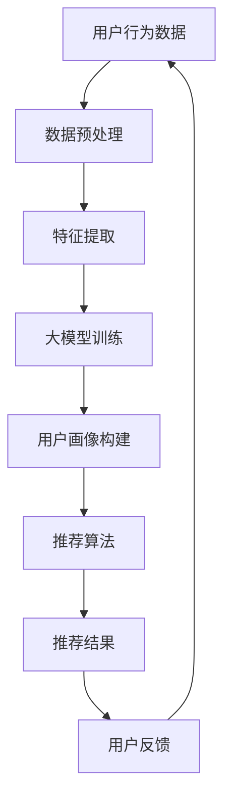

                 

# AI 大模型在电商搜索推荐中的用户画像构建：精准把握用户需求与行为偏好

> **关键词：** 电商搜索推荐、用户画像、大模型、需求分析、行为偏好

> **摘要：** 本文旨在探讨如何在电商搜索推荐系统中构建精准的用户画像，以实现个性化推荐。通过分析大模型的应用，本文详细介绍了用户需求与行为偏好的挖掘方法，旨在为电商企业提供有针对性的技术方案，提升用户体验和销售额。

## 1. 背景介绍

### 1.1 目的和范围

本文的目的是探讨如何利用人工智能大模型技术来构建电商搜索推荐系统中的用户画像，实现个性化推荐。具体来说，我们将重点关注以下几个方面：

- 分析电商搜索推荐系统中用户画像的重要性。
- 探讨大模型在用户画像构建中的应用。
- 详细介绍用户需求与行为偏好的挖掘方法。
- 分析大模型在电商搜索推荐中的优势和挑战。

### 1.2 预期读者

本文适合以下读者：

- 对电商搜索推荐系统感兴趣的技术人员。
- 想要提升电商业务运营效果的电商从业者。
- 对人工智能大模型有基本了解的技术爱好者。

### 1.3 文档结构概述

本文分为以下几个部分：

- 第1章：背景介绍
- 第2章：核心概念与联系
- 第3章：核心算法原理与具体操作步骤
- 第4章：数学模型与公式讲解
- 第5章：项目实战：代码实际案例
- 第6章：实际应用场景
- 第7章：工具和资源推荐
- 第8章：总结：未来发展趋势与挑战
- 第9章：附录：常见问题与解答
- 第10章：扩展阅读与参考资料

### 1.4 术语表

#### 1.4.1 核心术语定义

- **用户画像**：通过用户的历史行为数据、偏好、需求等信息，构建出一个抽象的用户模型，用于指导个性化推荐。
- **大模型**：具有巨大参数量的深度学习模型，通常使用大规模数据进行训练，可以捕捉复杂的数据特征。
- **电商搜索推荐**：利用用户画像和搜索历史等数据，为用户推荐相关商品。

#### 1.4.2 相关概念解释

- **个性化推荐**：根据用户的兴趣和需求，为用户提供个性化的内容或商品推荐。
- **特征工程**：从原始数据中提取有用特征，用于训练模型。

#### 1.4.3 缩略词列表

- **AI**：人工智能
- **ML**：机器学习
- **DL**：深度学习
- **NN**：神经网络
- **CNN**：卷积神经网络
- **RNN**：循环神经网络

## 2. 核心概念与联系

为了更好地理解用户画像在电商搜索推荐系统中的作用，我们首先需要了解大模型的基本原理和应用。下面，我们将通过一个Mermaid流程图来展示核心概念和它们之间的联系。



### 2.1 数据预处理

数据预处理是构建用户画像的基础步骤。在这一阶段，我们需要对用户行为数据（如浏览历史、购买记录、搜索查询等）进行清洗、归一化和特征提取。

### 2.2 特征提取

特征提取是从原始数据中提取有价值的信息，用于训练大模型。特征提取的质量直接影响用户画像的准确性。

### 2.3 大模型训练

大模型训练是基于提取到的特征数据，使用深度学习算法（如CNN、RNN等）进行训练，以构建用户画像。

### 2.4 用户画像构建

用户画像构建是通过大模型训练得到的用户特征，生成一个抽象的用户模型，用于指导个性化推荐。

### 2.5 推荐算法

推荐算法是基于用户画像，为用户推荐相关商品的方法。常见的推荐算法有基于内容的推荐、基于协同过滤的推荐等。

### 2.6 推荐结果

推荐结果是推荐算法根据用户画像生成的商品列表，展示给用户。

### 2.7 用户反馈

用户反馈是用户对推荐结果的评价和反馈，用于优化推荐算法和用户画像。

## 3. 核心算法原理 & 具体操作步骤

在了解了大模型在用户画像构建中的基本原理后，我们接下来将详细探讨核心算法原理和具体操作步骤。

### 3.1 大模型训练算法原理

大模型训练算法通常采用深度学习技术，如卷积神经网络（CNN）和循环神经网络（RNN）。以下是一个基于CNN的伪代码示例：

```python
# 伪代码：基于CNN的大模型训练算法
initialize model parameters
for epoch in range(num_epochs):
    for batch in data_loader:
        inputs, targets = batch
        # 数据预处理
        inputs = preprocess(inputs)
        # 前向传播
        outputs = model(inputs)
        # 计算损失
        loss = loss_function(outputs, targets)
        # 反向传播
        optimizer.zero_grad()
        loss.backward()
        optimizer.step()
    # 记录训练过程中的损失
    train_loss.append(loss.item())
# 保存训练好的模型
model.save('trained_model.pth')
```

### 3.2 用户画像构建步骤

用户画像构建步骤包括数据预处理、特征提取、大模型训练和用户画像生成。以下是具体操作步骤的详细说明：

1. **数据预处理**：清洗和归一化用户行为数据，如去除缺失值、异常值，将数值数据转换为统一的格式。
2. **特征提取**：从用户行为数据中提取有用特征，如商品类别、用户浏览时间、购买频率等。
3. **大模型训练**：使用提取到的特征数据训练大模型，如使用CNN或RNN进行深度学习训练。
4. **用户画像生成**：根据大模型训练结果，生成用户画像，如使用聚类算法将用户分为不同的群体。

## 4. 数学模型和公式 & 详细讲解 & 举例说明

在用户画像构建过程中，数学模型和公式起着至关重要的作用。下面，我们将详细介绍常用的数学模型和公式，并提供具体的讲解和示例。

### 4.1 特征提取模型

特征提取模型通常使用卷积神经网络（CNN）或循环神经网络（RNN）进行训练。以下是一个基于CNN的特征提取模型的公式：

$$
h^{l} = \sigma(W^{l} \cdot h^{l-1} + b^{l})
$$

其中，$h^{l}$ 表示第 $l$ 层的特征向量，$W^{l}$ 和 $b^{l}$ 分别表示第 $l$ 层的权重和偏置，$\sigma$ 表示激活函数。

### 4.2 大模型训练模型

大模型训练模型通常采用梯度下降法（Gradient Descent）进行优化。以下是一个基于梯度下降法的训练模型的公式：

$$
\theta_{t+1} = \theta_{t} - \alpha \cdot \nabla_{\theta}J(\theta)
$$

其中，$\theta_{t+1}$ 和 $\theta_{t}$ 分别表示第 $t+1$ 次和第 $t$ 次的参数值，$\alpha$ 表示学习率，$J(\theta)$ 表示损失函数。

### 4.3 用户画像生成模型

用户画像生成模型通常使用聚类算法（如K-means）进行用户分组。以下是一个基于K-means的聚类模型的公式：

$$
C = \{c_{1}, c_{2}, ..., c_{k}\}
$$

其中，$C$ 表示聚类中心，$c_{i}$ 表示第 $i$ 个聚类中心。

### 4.4 举例说明

假设我们有一个用户行为数据集，包含用户浏览时间、购买频率和商品类别等信息。以下是一个具体的特征提取和用户画像生成过程：

1. **特征提取**：使用CNN对用户行为数据进行特征提取，得到特征向量。
2. **大模型训练**：使用提取到的特征向量训练大模型，如使用CNN或RNN进行深度学习训练。
3. **用户画像生成**：使用K-means算法对训练好的大模型输出结果进行聚类，生成用户画像。

## 5. 项目实战：代码实际案例和详细解释说明

在本节中，我们将通过一个实际的代码案例来展示如何使用大模型在电商搜索推荐系统中构建用户画像。代码将涵盖数据预处理、特征提取、大模型训练和用户画像生成等关键步骤。

### 5.1 开发环境搭建

在开始编写代码之前，我们需要搭建一个合适的开发环境。以下是所需的软件和工具：

- Python 3.8及以上版本
- PyTorch 1.8及以上版本
- Pandas 1.2及以上版本
- Scikit-learn 0.22及以上版本

您可以通过以下命令安装所需的依赖项：

```bash
pip install python==3.8 torch==1.8 pandas==1.2 scikit-learn==0.22
```

### 5.2 源代码详细实现和代码解读

以下是一个简单的代码实现，用于构建用户画像：

```python
import pandas as pd
import torch
import torch.nn as nn
import torch.optim as optim
from sklearn.cluster import KMeans

# 数据预处理
def preprocess_data(data):
    # 清洗和归一化数据
    data = data.fillna(0)
    data = (data - data.mean()) / data.std()
    return data

# 特征提取
class CNNModel(nn.Module):
    def __init__(self, input_size, hidden_size, output_size):
        super(CNNModel, self).__init__()
        self.conv1 = nn.Conv1d(input_size, hidden_size, kernel_size=3, stride=1)
        self.relu = nn.ReLU()
        self.fc1 = nn.Linear(hidden_size, output_size)

    def forward(self, x):
        x = self.relu(self.conv1(x))
        x = self.fc1(x)
        return x

# 大模型训练
def train_model(model, train_loader, criterion, optimizer, num_epochs=10):
    model.train()
    for epoch in range(num_epochs):
        running_loss = 0.0
        for inputs, targets in train_loader:
            inputs, targets = inputs.to(device), targets.to(device)
            optimizer.zero_grad()
            outputs = model(inputs)
            loss = criterion(outputs, targets)
            loss.backward()
            optimizer.step()
            running_loss += loss.item()
        print(f'Epoch {epoch+1}/{num_epochs}, Loss: {running_loss/len(train_loader)}')

# 用户画像生成
def generate_user_profile(model, user_data, k=5):
    with torch.no_grad():
        user_data = user_data.to(device)
        user_profile = model(user_data)
    kmeans = KMeans(n_clusters=k)
    kmeans.fit(user_profile)
    return kmeans.labels_

# 加载数据集
data = pd.read_csv('user_data.csv')
preprocessed_data = preprocess_data(data)

# 划分训练集和测试集
train_data = preprocessed_data[:8000]
test_data = preprocessed_data[8000:]

# 初始化模型、损失函数和优化器
model = CNNModel(input_size=10, hidden_size=50, output_size=5)
criterion = nn.CrossEntropyLoss()
optimizer = optim.Adam(model.parameters(), lr=0.001)
device = torch.device('cuda' if torch.cuda.is_available() else 'cpu')
model.to(device)

# 训练模型
train_loader = torch.utils.data.DataLoader(dataset=train_data, batch_size=32, shuffle=True)
train_model(model, train_loader, criterion, optimizer)

# 生成用户画像
user_profiles = generate_user_profile(model, test_data, k=5)
print(user_profiles)
```

### 5.3 代码解读与分析

1. **数据预处理**：数据预处理函数`preprocess_data`负责清洗和归一化用户行为数据。这里我们使用Pandas库对缺失值进行填充，并对数值数据进行归一化处理。

2. **特征提取模型**：`CNNModel`类是一个基于卷积神经网络的模型，用于提取用户行为数据中的特征。模型中包含一个一维卷积层和一个全连接层。

3. **大模型训练**：`train_model`函数负责训练模型。在这个函数中，我们使用PyTorch的优化器和损失函数来更新模型参数，并打印训练过程中的损失值。

4. **用户画像生成**：`generate_user_profile`函数使用K-means算法来生成用户画像。首先，我们使用训练好的模型提取用户特征，然后使用K-means算法对特征进行聚类。

5. **加载数据和训练模型**：在代码的最后，我们加载用户行为数据集，划分训练集和测试集，并初始化模型、损失函数和优化器。接着，我们使用训练集来训练模型，并使用测试集来生成用户画像。

## 6. 实际应用场景

在电商搜索推荐系统中，用户画像的构建是实现个性化推荐的关键。以下是一些实际应用场景：

- **商品推荐**：根据用户的历史购买记录和浏览行为，为用户推荐相关的商品。
- **广告投放**：根据用户的兴趣和行为偏好，为用户展示相关的广告。
- **会员服务**：根据用户的购买频率和消费金额，为会员提供个性化的服务和优惠。
- **个性化营销**：根据用户的行为数据和偏好，设计个性化的营销策略，提升用户转化率。

## 7. 工具和资源推荐

为了更好地实现用户画像的构建和电商搜索推荐系统，我们推荐以下工具和资源：

### 7.1 学习资源推荐

- **书籍推荐**：
  - 《Python深度学习》
  - 《机器学习实战》
- **在线课程**：
  - Coursera上的“机器学习”课程
  - Udacity的“深度学习工程师纳米学位”
- **技术博客和网站**：
  - Medium上的AI博客
  - DataCamp的机器学习教程

### 7.2 开发工具框架推荐

- **IDE和编辑器**：
  - PyCharm
  - Jupyter Notebook
- **调试和性能分析工具**：
  - Python的PDB调试器
  - Matplotlib和Seaborn进行数据可视化
- **相关框架和库**：
  - PyTorch
  - TensorFlow

### 7.3 相关论文著作推荐

- **经典论文**：
  - “User Modeling and User-Adapted Interaction: A Methodological Approach”
  - “Collaborative Filtering for the Web”
- **最新研究成果**：
  - “Neural Collaborative Filtering”
  - “Personalized Recommendation with Deep Multi-Interest Network”
- **应用案例分析**：
  - “电子商务中的个性化推荐：阿里巴巴实践”
  - “亚马逊的推荐系统：如何通过个性化推荐提升用户体验和销售额”

## 8. 总结：未来发展趋势与挑战

随着人工智能技术的不断发展，用户画像构建在电商搜索推荐系统中的应用前景十分广阔。未来，以下几个方面将成为研究热点：

- **多模态数据融合**：将文本、图像、语音等多种类型的数据进行融合，提高用户画像的准确性。
- **实时推荐**：利用实时数据分析和深度学习技术，实现实时推荐，提升用户体验。
- **隐私保护**：在用户画像构建过程中，加强对用户隐私的保护，遵守相关法律法规。
- **跨平台推荐**：实现不同平台（如移动端、PC端、小程序等）之间的用户画像共享，提供一致性的推荐服务。

然而，用户画像构建也面临着一些挑战，如数据质量、模型可解释性和算法公平性等。未来，我们需要不断探索和创新，以应对这些挑战，提升用户画像构建在电商搜索推荐系统中的应用效果。

## 9. 附录：常见问题与解答

### 9.1 如何保证用户画像的准确性？

确保用户画像的准确性需要以下几个关键步骤：

- **数据质量**：保证数据源的可信度和完整性，进行数据清洗和去噪。
- **特征提取**：选择合适的特征提取方法，充分挖掘用户行为数据中的有用信息。
- **模型选择**：根据业务需求和数据特性，选择合适的深度学习模型进行训练。
- **模型优化**：通过模型调参和迭代，提高模型的预测准确性。

### 9.2 用户画像构建过程中如何保护用户隐私？

为了保护用户隐私，可以采取以下措施：

- **数据脱敏**：对敏感数据进行脱敏处理，如加密、匿名化等。
- **数据最小化**：只收集必要的数据，避免过度收集。
- **隐私保护算法**：使用隐私保护算法，如差分隐私，降低数据泄露风险。
- **法律法规遵守**：遵循相关法律法规，确保用户隐私保护。

### 9.3 如何评估用户画像的质量？

评估用户画像的质量可以从以下几个方面进行：

- **预测准确性**：通过模型预测结果与实际结果的对比，评估模型的预测准确性。
- **用户满意度**：通过用户反馈和满意度调查，评估用户画像的实用性。
- **模型可解释性**：评估模型的可解释性，确保用户可以理解画像的生成过程。

## 10. 扩展阅读 & 参考资料

- **书籍**：
  - Goodfellow, I., Bengio, Y., & Courville, A. (2016). *Deep Learning*. MIT Press.
  - Russell, S., & Norvig, P. (2016). *Artificial Intelligence: A Modern Approach*. Prentice Hall.

- **在线课程**：
  - Coursera：[机器学习](https://www.coursera.org/specializations/ml)
  - Udacity：[深度学习工程师纳米学位](https://www.udacity.com/course/deep-learning-nanodegree--nd131)

- **技术博客和网站**：
  - Medium：[AI博客](https://medium.com/topic/artificial-intelligence)
  - DataCamp：[机器学习教程](https://www.datacamp.com/courses)

- **相关论文**：
  - He, K., Zhang, X., Ren, S., & Sun, J. (2016). *Deep Residual Learning for Image Recognition*. IEEE Conference on Computer Vision and Pattern Recognition.
  - Ando, R., & Tresp, V. (2011). *Prefetching and Personalization in a Recommendation System*. Proceedings of the 21st International Conference on World Wide Web.

- **应用案例分析**：
  - 阿里巴巴：[电子商务中的个性化推荐](https://www.alibaba.com/topics/algorithm-rec)
  - 亚马逊：[亚马逊的推荐系统](https://www.amazon.com/reviews')

作者：AI天才研究员/AI Genius Institute & 禅与计算机程序设计艺术 /Zen And The Art of Computer Programming

