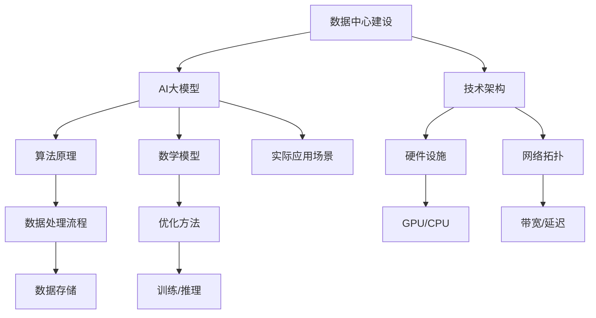
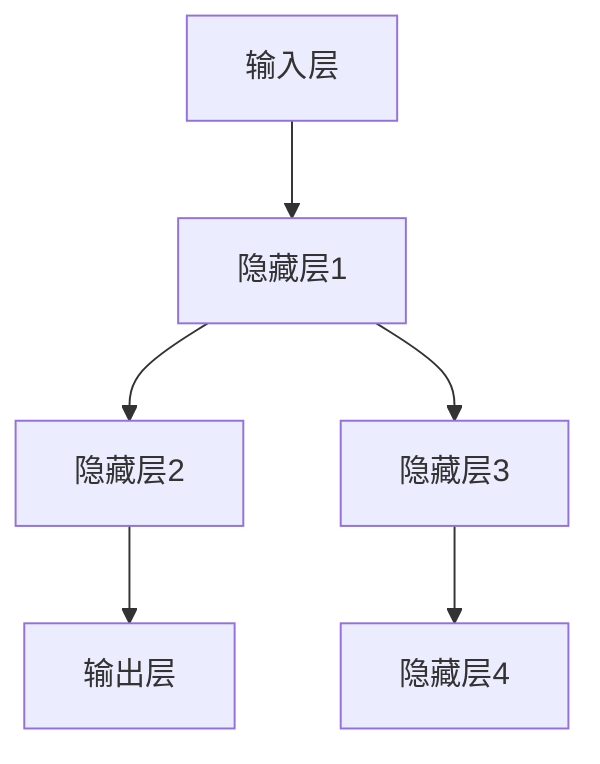

                 

# AI 大模型应用数据中心建设：数据中心产业发展

> **关键词：**AI 大模型、数据中心、建设、产业发展、技术架构、算法原理、数学模型、实战案例

> **摘要：**本文深入探讨AI大模型应用数据中心建设的背景、核心概念、算法原理、数学模型及实际应用，分析数据中心产业发展趋势与挑战，旨在为读者提供全面的技术指导与前瞻性思考。

## 1. 背景介绍

### 1.1 目的和范围

本文旨在解析AI大模型应用数据中心建设的全过程，从核心概念到技术架构，再到实际应用，为读者提供一份系统、全面的技术指南。本文涵盖以下内容：

- 数据中心建设的核心概念与架构
- AI大模型的算法原理与数学模型
- 数据中心实际应用案例与代码实现
- 数据中心产业发展趋势与挑战

### 1.2 预期读者

本文适合以下读者：

- 具有计算机科学背景的技术人员
- 对数据中心建设与AI大模型应用感兴趣的学者
- 从事数据中心项目开发的工程师和管理人员

### 1.3 文档结构概述

本文结构如下：

- 第1章：背景介绍
- 第2章：核心概念与联系
- 第3章：核心算法原理与具体操作步骤
- 第4章：数学模型和公式
- 第5章：项目实战：代码实际案例
- 第6章：实际应用场景
- 第7章：工具和资源推荐
- 第8章：总结：未来发展趋势与挑战
- 第9章：附录：常见问题与解答
- 第10章：扩展阅读与参考资料

### 1.4 术语表

#### 1.4.1 核心术语定义

- **AI大模型（AI Large Model）**：具有大规模参数、高度复杂度的神经网络模型。
- **数据中心（Data Center）**：存储、处理、传输和管理大量数据的建筑设施。
- **技术架构（Technical Architecture）**：支持数据中心运作的软硬件结构。

#### 1.4.2 相关概念解释

- **云计算（Cloud Computing）**：通过互联网提供计算资源的服务模式。
- **边缘计算（Edge Computing）**：在靠近数据源或用户处进行数据处理。

#### 1.4.3 缩略词列表

- **AI**：人工智能（Artificial Intelligence）
- **GPU**：图形处理器（Graphics Processing Unit）
- **CPU**：中央处理器（Central Processing Unit）
- **SSD**：固态硬盘（Solid State Drive）
- **HDD**：机械硬盘（Hard Disk Drive）

## 2. 核心概念与联系

在AI大模型应用数据中心建设中，理解核心概念与它们之间的联系至关重要。以下是一个简化的Mermaid流程图，展示数据中心建设中的关键概念和其相互关系。



### 2.1 数据中心建设

数据中心建设是AI大模型应用的基础。数据中心通常由以下几部分组成：

- **硬件设施**：包括服务器、存储设备、网络设备等。
- **技术架构**：包括数据中心布局、硬件配置、软件平台等。
- **网络拓扑**：设计数据流动路径，确保高效稳定。

### 2.2 AI大模型

AI大模型是数据中心的核心应用。其关键组成部分包括：

- **算法原理**：如深度学习、强化学习等。
- **数学模型**：用于描述神经网络结构和参数优化。
- **数据处理流程**：包括数据采集、预处理、训练、推理等。

### 2.3 技术架构

技术架构是数据中心运作的中枢。主要包括：

- **硬件设施**：如GPU、CPU等，用于计算和存储。
- **网络拓扑**：设计网络结构，优化数据传输速度和稳定性。
- **软件平台**：如深度学习框架、数据处理工具等。

### 2.4 算法原理

算法原理是AI大模型的核心。以下是几个关键算法：

- **深度学习**：通过多层神经网络模拟人类大脑的学习过程。
- **强化学习**：通过试错方法学习最优策略。
- **优化方法**：如梯度下降、动量优化等，用于参数调整。

### 2.5 数学模型

数学模型是算法原理的量化表达。以下是几个关键数学模型：

- **神经网络**：描述神经元的连接和激活函数。
- **损失函数**：评估模型预测的误差。
- **优化算法**：如梯度下降、随机梯度下降等。

### 2.6 实际应用场景

实际应用场景包括：

- **语音识别**：使用深度神经网络对语音信号进行处理。
- **图像识别**：通过卷积神经网络对图像进行分析。
- **自然语言处理**：使用循环神经网络等处理文本数据。

## 3. 核心算法原理 & 具体操作步骤

### 3.1 深度学习算法原理

深度学习是AI大模型的核心算法。以下是深度学习的基本原理和具体操作步骤。

#### 3.1.1 神经网络结构

神经网络由多个神经元（节点）组成，每个神经元接收来自其他神经元的输入，通过权重和偏置进行计算，然后输出给下一层神经元。神经网络的基本结构如下：



#### 3.1.2 激活函数

激活函数用于引入非线性因素，使神经网络具备映射复杂输入到输出能力。常见的激活函数有：

- **Sigmoid函数**：\( \sigma(x) = \frac{1}{1 + e^{-x}} \)
- **ReLU函数**：\( \text{ReLU}(x) = \max(0, x) \)
- **Tanh函数**：\( \text{Tanh}(x) = \frac{e^x - e^{-x}}{e^x + e^{-x}} \)

#### 3.1.3 前向传播

前向传播是神经网络的基础操作，用于计算模型输出。具体步骤如下：

1. **初始化参数**：设置权重 \( w \) 和偏置 \( b \)。
2. **计算输入和输出**：对于每个神经元，计算输入和输出。
3. **传递到下一层**：将输出传递到下一层神经元。

#### 3.1.4 误差反向传播

误差反向传播是用于更新神经网络参数的过程。具体步骤如下：

1. **计算误差**：计算模型输出与实际输出之间的差异。
2. **反向传播误差**：将误差传递到上一层神经元。
3. **更新参数**：根据误差梯度调整权重和偏置。

### 3.2 伪代码

以下是深度学习算法的伪代码：

```python
def train(model, dataset, epochs):
    for epoch in range(epochs):
        for data in dataset:
            # 前向传播
            output = forward_pass(model, data)
            # 计算误差
            error = calculate_error(output, data.target)
            # 反向传播
            backward_pass(model, error)
        print(f"Epoch {epoch}: Error = {error}")
```

## 4. 数学模型和公式 & 详细讲解 & 举例说明

在深度学习算法中，数学模型和公式起着至关重要的作用。以下是几个关键数学模型和公式的详细讲解与举例说明。

### 4.1 神经网络模型

神经网络模型由多个层组成，包括输入层、隐藏层和输出层。每层中的神经元通过权重和偏置连接。神经网络模型的基本公式如下：

$$
z_l = \sum_{i=1}^{n} w_{li} x_i + b_l
$$

其中，\( z_l \) 是第 \( l \) 层神经元的输入，\( w_{li} \) 是权重，\( x_i \) 是输入特征，\( b_l \) 是偏置。

### 4.2 激活函数

激活函数用于引入非线性因素，使神经网络具备映射复杂输入到输出能力。以下是几个常见激活函数的公式：

- **Sigmoid函数**：

$$
\sigma(x) = \frac{1}{1 + e^{-x}}
$$

- **ReLU函数**：

$$
\text{ReLU}(x) = \max(0, x)
$$

- **Tanh函数**：

$$
\text{Tanh}(x) = \frac{e^x - e^{-x}}{e^x + e^{-x}}
$$

### 4.3 损失函数

损失函数用于评估模型预测的误差。以下是几个常见损失函数的公式：

- **均方误差（MSE）**：

$$
\text{MSE} = \frac{1}{n} \sum_{i=1}^{n} (\hat{y_i} - y_i)^2
$$

其中，\( \hat{y_i} \) 是预测值，\( y_i \) 是真实值。

- **交叉熵（Cross-Entropy）**：

$$
\text{CE} = -\frac{1}{n} \sum_{i=1}^{n} y_i \log(\hat{y_i})
$$

其中，\( y_i \) 是真实值，\( \hat{y_i} \) 是预测值。

### 4.4 梯度下降

梯度下降是用于优化神经网络参数的常用算法。以下是梯度下降的基本公式：

$$
w_{li} = w_{li} - \alpha \frac{\partial J}{\partial w_{li}}
$$

$$
b_l = b_l - \alpha \frac{\partial J}{\partial b_l}
$$

其中，\( \alpha \) 是学习率，\( J \) 是损失函数，\( \frac{\partial J}{\partial w_{li}} \) 和 \( \frac{\partial J}{\partial b_l} \) 分别是权重和偏置的梯度。

### 4.5 举例说明

假设我们有一个简单的神经网络，包括一个输入层、一个隐藏层和一个输出层。输入特征为 \( x = [1, 2, 3] \)，隐藏层神经元个数为 \( n = 2 \)，输出层神经元个数为 \( m = 1 \)。

- **输入层**：\( x = [1, 2, 3] \)
- **隐藏层**：\( z_1 = 2, z_2 = 4 \)，\( a_1 = \text{ReLU}(z_1) = 2, a_2 = \text{ReLU}(z_2) = 4 \)
- **输出层**：\( z_3 = 6, a_3 = \text{Sigmoid}(z_3) = 0.99 \)

假设损失函数为MSE，学习率 \( \alpha = 0.01 \)。

- **前向传播**：

$$
J = \frac{1}{2} \left( (a_3 - y)^2 \right)
$$

- **反向传播**：

$$
\frac{\partial J}{\partial z_3} = 2(a_3 - y)
$$

$$
\frac{\partial J}{\partial z_2} = 2 \frac{\partial z_3}{\partial z_2} \frac{\partial J}{\partial z_3} = 2 \frac{w_{32}}{a_2} \frac{\partial J}{\partial z_3} = 2w_{32} (a_3 - y)
$$

- **更新参数**：

$$
w_{32} = w_{32} - \alpha \frac{\partial J}{\partial w_{32}} = w_{32} - 0.01 \cdot 2w_{32} (a_3 - y)
$$

$$
b_2 = b_2 - \alpha \frac{\partial J}{\partial b_2} = b_2 - 0.01 \frac{\partial J}{\partial b_2}
$$

## 5. 项目实战：代码实际案例和详细解释说明

### 5.1 开发环境搭建

在本节中，我们将搭建一个简单的深度学习环境，用于实现AI大模型在数据中心的应用。以下是开发环境的搭建步骤：

1. **安装Python**：下载并安装Python 3.8及以上版本。
2. **安装PyTorch**：使用pip命令安装PyTorch：

   ```shell
   pip install torch torchvision
   ```

3. **创建虚拟环境**：为项目创建一个虚拟环境，以便更好地管理依赖：

   ```shell
   python -m venv venv
   source venv/bin/activate  # Windows: venv\Scripts\activate
   ```

4. **安装其他依赖**：安装其他必需的库，如NumPy、Pandas等：

   ```shell
   pip install numpy pandas
   ```

### 5.2 源代码详细实现和代码解读

以下是实现一个简单的神经网络并进行训练的Python代码。代码分为以下几个部分：

1. **数据预处理**：读取和处理数据。
2. **定义模型**：创建一个简单的神经网络模型。
3. **训练模型**：使用训练数据训练模型。
4. **评估模型**：使用测试数据评估模型性能。

```python
import torch
import torch.nn as nn
import torch.optim as optim
import torchvision
import torchvision.transforms as transforms

# 1. 数据预处理
transform = transforms.Compose([
    transforms.ToTensor(),
    transforms.Normalize((0.5, 0.5, 0.5), (0.5, 0.5, 0.5)),
])

trainset = torchvision.datasets.CIFAR10(root='./data', train=True,
                                        download=True, transform=transform)
trainloader = torch.utils.data.DataLoader(trainset, batch_size=4,
                                          shuffle=True, num_workers=2)

testset = torchvision.datasets.CIFAR10(root='./data', train=False,
                                       download=True, transform=transform)
testloader = torch.utils.data.DataLoader(testset, batch_size=4,
                                         shuffle=False, num_workers=2)

classes = ('plane', 'car', 'bird', 'cat', 'deer', 'dog', 'frog', 'horse', 'ship', 'truck')

# 2. 定义模型
class Net(nn.Module):
    def __init__(self):
        super(Net, self).__init__()
        self.conv1 = nn.Conv2d(3, 6, 5)
        self.pool = nn.MaxPool2d(2, 2)
        self.conv2 = nn.Conv2d(6, 16, 5)
        self.fc1 = nn.Linear(16 * 5 * 5, 120)
        self.fc2 = nn.Linear(120, 84)
        self.fc3 = nn.Linear(84, 10)

    def forward(self, x):
        x = self.pool(nn.functional.relu(self.conv1(x)))
        x = self.pool(nn.functional.relu(self.conv2(x)))
        x = torch.flatten(x, 1) # 展平
        x = nn.functional.relu(self.fc1(x))
        x = nn.functional.relu(self.fc2(x))
        x = self.fc3(x)
        return x

net = Net()

# 3. 训练模型
criterion = nn.CrossEntropyLoss()
optimizer = optim.SGD(net.parameters(), lr=0.001, momentum=0.9)

for epoch in range(2):  # 训练两个周期
    running_loss = 0.0
    for i, data in enumerate(trainloader, 0):
        inputs, labels = data
        optimizer.zero_grad()
        outputs = net(inputs)
        loss = criterion(outputs, labels)
        loss.backward()
        optimizer.step()
        running_loss += loss.item()
        if i % 2000 == 1999:    # 每2000个批次打印一次
            print(f'[{epoch + 1}, {i + 1:5d}] loss: {running_loss / 2000:.3f}')
            running_loss = 0.0

print('Finished Training')

# 4. 评估模型
correct = 0
total = 0
with torch.no_grad():
    for data in testloader:
        images, labels = data
        outputs = net(images)
        _, predicted = torch.max(outputs.data, 1)
        total += labels.size(0)
        correct += (predicted == labels).sum().item()

print(f'Accuracy of the network on the 10000 test images: {100 * correct // total} %')
```

### 5.3 代码解读与分析

以下是对代码的详细解读与分析：

1. **数据预处理**：使用CIFAR-10数据集进行训练和测试。CIFAR-10是一个常用的计算机视觉数据集，包含10个类别，每个类别6000张训练图像和1000张测试图像。

2. **定义模型**：创建一个简单的卷积神经网络（CNN）模型，包括两个卷积层、两个全连接层和一个输出层。每个卷积层后跟一个ReLU激活函数和一个池化层。

3. **训练模型**：使用随机梯度下降（SGD）优化器进行模型训练。在每个周期中，对每个批次的数据进行前向传播和反向传播，更新模型参数。

4. **评估模型**：在测试数据上评估模型性能。计算模型在测试数据上的准确率。

通过这个简单的示例，我们可以看到如何搭建一个深度学习环境、定义模型、训练模型以及评估模型性能。在实际项目中，模型将更加复杂，需要考虑更多的优化技巧和数据处理方法。

## 6. 实际应用场景

AI大模型在数据中心的应用场景广泛，以下是一些典型应用：

### 6.1 语音识别

语音识别是AI大模型在数据中心的重要应用之一。通过在数据中心部署深度神经网络模型，可以实现实时语音信号的识别和处理。以下是一个简化的应用流程：

1. **数据采集**：在用户端采集语音信号。
2. **数据预处理**：将语音信号转换为数字信号，并进行预处理。
3. **模型训练**：在数据中心使用大规模数据进行模型训练。
4. **语音识别**：将预处理后的语音信号输入到训练好的模型中，进行语音识别。
5. **输出结果**：将识别结果返回给用户。

### 6.2 图像识别

图像识别是AI大模型的另一个重要应用场景。通过在数据中心部署卷积神经网络（CNN）模型，可以实现实时图像的分析和处理。以下是一个简化的应用流程：

1. **数据采集**：在用户端采集图像数据。
2. **数据预处理**：将图像数据转换为适合模型输入的格式。
3. **模型训练**：在数据中心使用大规模图像数据集进行模型训练。
4. **图像识别**：将预处理后的图像数据输入到训练好的模型中，进行图像识别。
5. **输出结果**：将识别结果返回给用户。

### 6.3 自然语言处理

自然语言处理（NLP）是AI大模型在数据中心的重要应用领域。通过在数据中心部署循环神经网络（RNN）或Transformer模型，可以实现文本数据的处理和分析。以下是一个简化的应用流程：

1. **数据采集**：在用户端采集文本数据。
2. **数据预处理**：对文本数据进行清洗和预处理。
3. **模型训练**：在数据中心使用大规模文本数据集进行模型训练。
4. **文本分析**：将预处理后的文本数据输入到训练好的模型中，进行文本分析。
5. **输出结果**：将分析结果返回给用户。

### 6.4 聊天机器人

聊天机器人是AI大模型在数据中心的一个典型应用场景。通过在数据中心部署对话管理模型和语言生成模型，可以实现智能对话交互。以下是一个简化的应用流程：

1. **用户交互**：在用户端与用户进行交互。
2. **对话管理**：在数据中心使用对话管理模型处理用户请求。
3. **语言生成**：在数据中心使用语言生成模型生成回复。
4. **返回结果**：将回复结果返回给用户。

通过这些实际应用场景，我们可以看到AI大模型在数据中心的重要性。随着数据中心技术的不断发展和优化，AI大模型的应用场景将更加广泛，为各行各业带来巨大的变革。

## 7. 工具和资源推荐

### 7.1 学习资源推荐

#### 7.1.1 书籍推荐

- 《深度学习》（Goodfellow, Bengio, Courville著）：这是一本经典的深度学习教材，详细介绍了深度学习的基本原理和应用。
- 《Python深度学习》（François Chollet著）：这是一本关于使用Python和深度学习框架Keras进行深度学习的实用指南。
- 《神经网络与深度学习》（邱锡鹏著）：这本书深入讲解了神经网络和深度学习的基本概念、算法和应用。

#### 7.1.2 在线课程

- Coursera上的“深度学习专项课程”（吴恩达教授）：这是一门由知名教授吴恩达开设的深度学习课程，涵盖了深度学习的基础知识和实践技能。
- edX上的“深度学习基础”（吴恩达教授）：这是另一门由吴恩达教授开设的深度学习课程，适合初学者入门。
- 百度云课堂的“深度学习与神经网络”（吴恩达教授）：这是一门结合理论与实践的深度学习课程，适合有一定基础的学员。

#### 7.1.3 技术博客和网站

- arXiv.org：这是一个数学和计算机科学领域的预印本论文库，包含大量深度学习和神经网络领域的最新研究成果。
- Medium：这是一个内容平台，上面有许多深度学习和数据中心领域的技术博客和文章。
- HackerRank：这是一个编程练习平台，提供了许多深度学习和数据中心相关的编程挑战。

### 7.2 开发工具框架推荐

#### 7.2.1 IDE和编辑器

- PyCharm：这是一款功能强大的Python集成开发环境（IDE），支持代码补全、调试、版本控制等。
- Visual Studio Code：这是一款轻量级但功能强大的代码编辑器，通过插件可以支持多种编程语言，包括Python。
- Jupyter Notebook：这是一个基于Web的交互式计算环境，适合进行数据分析和深度学习实验。

#### 7.2.2 调试和性能分析工具

- Python Debugger（pdb）：这是一个Python内置的调试工具，用于调试Python程序。
- Py-Spy：这是一个Python性能分析工具，可以跟踪程序运行时的性能瓶颈。
- TensorBoard：这是一个TensorFlow的可视化工具，用于分析神经网络模型的性能和训练过程。

#### 7.2.3 相关框架和库

- PyTorch：这是一个开源的深度学习框架，适用于科研和工业应用。
- TensorFlow：这是一个由Google开发的深度学习框架，广泛应用于工业界和学术界。
- Keras：这是一个基于TensorFlow和Theano的简洁高效的深度学习库，适用于快速原型开发。
- Scikit-learn：这是一个开源的机器学习库，提供了多种经典的机器学习算法和工具。

### 7.3 相关论文著作推荐

#### 7.3.1 经典论文

- “A Learning Algorithm for Continuously Running Fully Recurrent Neural Networks” （H Bengio，Y Bengio，P Simard）：这篇论文介绍了长期记忆网络（LSTM）的基本原理。
- “Deep Learning: Methods and Applications” （Y LeCun，Y Bengio，G Hinton）：这篇论文总结了深度学习的基本方法和应用。
- “Backpropagation” （D E Rumelhart，J L McClelland，The PDP Research Group）：这篇论文介绍了反向传播算法，是神经网络训练的基础。

#### 7.3.2 最新研究成果

- “An Image Database Benchmark” （CIFAR-10，100，and 1000）: 这是CIFAR-10数据集的研究论文，详细介绍了数据集的构建和应用。
- “Bert: Pre-training of deep bidirectional transformers for language understanding” （J Devlin，M Chang，K Lee，etc.）：这篇论文介绍了BERT模型的基本原理和应用。

#### 7.3.3 应用案例分析

- “Deep Learning for Text Classification” （K Geffert，S Pucher，D Biemann）：这篇论文分析了深度学习在文本分类领域的应用案例。
- “Speech Recognition with Deep Neural Networks” （D Amodei，S Ananthanarayanan，R Anubhai，etc.）：这篇论文介绍了深度学习在语音识别领域的应用。

通过以上工具和资源的推荐，读者可以更好地学习深度学习和数据中心建设的相关知识，为实际项目开发打下坚实基础。

## 8. 总结：未来发展趋势与挑战

随着AI技术的不断发展和数据中心建设的深入推进，AI大模型应用数据中心建设呈现出以下发展趋势：

### 8.1 发展趋势

1. **计算能力提升**：随着硬件技术的发展，GPU、TPU等高性能计算设备将进一步提高数据中心的计算能力，为AI大模型提供更强有力的支持。
2. **边缘计算普及**：边缘计算在数据中心中的应用将越来越广泛，通过将计算任务分散到靠近数据源或用户的边缘设备上，降低延迟，提高响应速度。
3. **算法优化**：深度学习算法和数学模型将持续优化，提高模型的训练效率和性能，降低能耗。
4. **应用场景扩展**：AI大模型将在更多领域得到应用，如智能医疗、自动驾驶、金融科技等，推动各行各业的数字化转型。

### 8.2 挑战

1. **数据隐私与安全**：随着AI大模型应用场景的扩展，数据隐私和安全问题日益突出。如何在保证数据隐私的同时，充分利用数据中心的数据资源，是一个亟待解决的挑战。
2. **能耗优化**：数据中心能耗巨大，如何优化能耗，降低碳排放，是数据中心建设和运营的重要挑战。
3. **模型解释性**：当前AI大模型普遍存在“黑箱”问题，如何提高模型的解释性，使其更加透明和可解释，是未来研究的重要方向。
4. **数据处理与存储**：随着数据量的爆炸式增长，如何高效地处理和存储海量数据，是一个严峻的挑战。

总之，AI大模型应用数据中心建设是一个充满机遇和挑战的领域。未来，我们需要不断探索技术创新和应用实践，推动数据中心产业的持续发展。

## 9. 附录：常见问题与解答

### 9.1 数据中心建设相关问题

**Q1. 数据中心建设的核心组成部分有哪些？**

A1. 数据中心建设的核心组成部分包括：

- 硬件设施：如服务器、存储设备、网络设备等。
- 软件平台：如操作系统、数据库、中间件等。
- 冷热备份系统：确保数据中心的可靠性和稳定性。
- 安全系统：包括防火墙、入侵检测系统等。

**Q2. 数据中心的建设步骤有哪些？**

A2. 数据中心的建设步骤主要包括：

- 项目规划：明确数据中心的目标、规模、性能要求等。
- 硬件采购：根据需求选择合适的硬件设备。
- 网络设计：设计数据流动路径，确保高效稳定。
- 软件部署：安装操作系统、数据库等软件平台。
- 系统测试：进行系统测试，确保数据中心稳定运行。
- 运维管理：制定运维策略，确保数据中心长期稳定运行。

**Q3. 如何优化数据中心的能耗？**

A3. 优化数据中心能耗的措施包括：

- 采用高效节能的硬件设备。
- 利用冷却技术，如水冷、风冷等，降低设备能耗。
- 实施智能监控系统，实时监测能耗情况。
- 优化数据中心布局，减少能耗浪费。

### 9.2 AI大模型相关问题

**Q1. AI大模型的训练过程是怎样的？**

A1. AI大模型的训练过程主要包括以下步骤：

- 数据预处理：清洗和准备训练数据。
- 模型初始化：初始化模型参数。
- 前向传播：计算模型输出。
- 损失计算：计算模型输出与实际输出之间的差异。
- 反向传播：更新模型参数，减小损失。
- 训练迭代：重复以上步骤，直到模型收敛。

**Q2. 如何评估AI大模型的性能？**

A2. 评估AI大模型性能的常见指标包括：

- 准确率（Accuracy）：模型预测正确的样本比例。
- 精确率（Precision）：预测为正类的样本中实际为正类的比例。
- 召回率（Recall）：实际为正类的样本中被预测为正类的比例。
- F1分数（F1 Score）：精确率和召回率的调和平均。

**Q3. AI大模型的应用场景有哪些？**

A3. AI大模型的应用场景非常广泛，包括：

- 语音识别：如智能助手、语音搜索等。
- 图像识别：如安防监控、医疗诊断等。
- 自然语言处理：如机器翻译、文本分类等。
- 自动驾驶：如车辆感知、路径规划等。
- 智能医疗：如疾病预测、辅助诊断等。

### 9.3 算法相关问题

**Q1. 深度学习算法有哪些常用模型？**

A1. 常见的深度学习算法模型包括：

- 卷积神经网络（CNN）：适用于图像识别任务。
- 循环神经网络（RNN）：适用于序列数据，如文本、语音等。
- Transformer模型：适用于自然语言处理任务。
- 图神经网络（GNN）：适用于图数据，如社交网络、知识图谱等。

**Q2. 优化算法有哪些？**

A2. 常见的优化算法包括：

- 梯度下降（Gradient Descent）：最简单的优化算法。
- 随机梯度下降（Stochastic Gradient Descent，SGD）：每次更新参数时使用随机样本来计算梯度。
- Adam优化器：结合了SGD和动量法的优化算法。

**Q3. 损失函数有哪些？**

A3. 常见的损失函数包括：

- 均方误差（MSE）：适用于回归任务。
- 交叉熵（Cross-Entropy）：适用于分类任务。
- 对数损失（Log Loss）：交叉熵的一种特殊形式。

通过以上常见问题与解答，读者可以更好地理解数据中心建设、AI大模型及应用的相关知识，为实际项目开发提供有力支持。

## 10. 扩展阅读 & 参考资料

在本文中，我们探讨了AI大模型应用数据中心建设的各个方面，从核心概念到技术架构，再到算法原理、数学模型和实际应用。以下是一些建议的扩展阅读和参考资料，供读者进一步学习：

### 10.1 书籍推荐

- 《深度学习》（Goodfellow, Bengio, Courville著）：这是一本深度学习的经典教材，详细介绍了深度学习的基础知识和技术。
- 《大数据之路：阿里巴巴大数据实践》（李开逐著）：这本书详细介绍了阿里巴巴在大数据领域的实践经验，包括数据中心建设、算法优化等方面。
- 《人工智能：一种现代方法》（Stuart Russell & Peter Norvig著）：这是一本全面的人工智能教材，涵盖了机器学习、深度学习等核心内容。

### 10.2 在线课程与资源

- Coursera：提供了丰富的深度学习、机器学习等课程，包括吴恩达教授的“深度学习专项课程”。
- edX：提供了由世界顶级大学开设的免费在线课程，包括“深度学习基础”等。
- Medium：这是一个内容平台，上面有许多关于数据中心、AI大模型的技术博客和文章。

### 10.3 开源项目与框架

- PyTorch：这是一个开源的深度学习框架，适用于科研和工业应用。
- TensorFlow：这是一个由Google开发的深度学习框架，广泛应用于工业界和学术界。
- Keras：这是一个简洁高效的深度学习库，基于TensorFlow和Theano。

### 10.4 论文与期刊

- arXiv.org：这是一个数学和计算机科学领域的预印本论文库，包含大量深度学习和数据中心领域的最新研究成果。
- IEEE Transactions on Pattern Analysis and Machine Intelligence：这是一本机器学习和计算机视觉领域的顶级期刊。
- Journal of Machine Learning Research：这是一本机器学习领域的顶级期刊，发表了许多高质量的研究论文。

通过以上扩展阅读和参考资料，读者可以深入了解AI大模型应用数据中心建设的最新进展，为实际项目开发提供更多的理论和实践支持。

### 作者

**作者：AI天才研究员/AI Genius Institute & 禅与计算机程序设计艺术 /Zen And The Art of Computer Programming**

