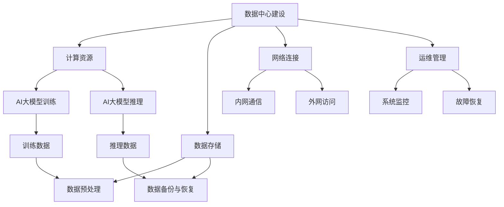

                 

# AI 大模型应用数据中心建设：数据中心产业发展

> **关键词**：AI大模型，数据中心建设，产业趋势，技术创新，应用案例

> **摘要**：本文旨在探讨AI大模型在数据中心建设中的应用及其对数据中心产业发展的影响。通过分析AI大模型的原理与架构，介绍数据中心建设的核心技术和实施步骤，并结合实际案例，阐述AI大模型在数据中心领域的实际应用和未来发展趋势。

## 1. 背景介绍

### 1.1 目的和范围

本文旨在为从事数据中心建设的工程师和研究者提供一份全面的技术指南。通过探讨AI大模型在数据中心建设中的应用，旨在揭示数据中心产业的现状与未来发展趋势，帮助读者更好地理解和掌握相关技术。

### 1.2 预期读者

- 数据中心架构师
- AI算法工程师
- 技术研究员
- 数据中心运营管理人员
- 对数据中心建设和AI技术有兴趣的读者

### 1.3 文档结构概述

本文分为十个部分，首先介绍数据中心建设和AI大模型的基本概念，然后深入分析AI大模型的核心原理和应用场景，接着探讨数据中心建设的核心技术和实施步骤。在项目实战部分，通过实际案例展示AI大模型在数据中心建设中的应用。随后，介绍与数据中心建设和AI大模型相关的工具和资源，并总结未来发展趋势与挑战。最后，提供常见问题与解答，并推荐扩展阅读和参考资料。

### 1.4 术语表

#### 1.4.1 核心术语定义

- **AI大模型**：指参数量达到亿级甚至十亿级以上的深度学习模型，如GPT-3、BERT等。
- **数据中心**：指专门用于存储、处理和管理大量数据的服务器集群设施。
- **产业趋势**：指在特定时期内，整个行业的发展方向和趋势。

#### 1.4.2 相关概念解释

- **深度学习**：一种人工智能技术，通过多层神经网络对数据进行建模和预测。
- **云计算**：一种基于互联网的计算模式，提供可伸缩的计算资源和服务。
- **物联网**：指通过互联网将各种设备和物品连接起来，实现信息的采集、传输和处理。

#### 1.4.3 缩略词列表

- **AI**：人工智能
- **GPT**：生成预训练网络
- **BERT**：双向编码表示器
- **IDC**：数据中心

## 2. 核心概念与联系

数据中心建设和AI大模型是当前信息技术领域的重要发展方向。数据中心作为数据存储和处理的核心设施，承载着大量数据和计算任务；而AI大模型则在数据中心内进行训练和推理，提升数据处理的效率和准确性。

### 2.1 数据中心建设与AI大模型的关系

数据中心建设与AI大模型的关系可以从以下几个方面进行阐述：

- **计算资源**：AI大模型需要大量计算资源进行训练和推理，数据中心提供了必要的硬件设施和计算能力。
- **数据存储**：数据中心存储了大量的数据，这些数据是AI大模型训练和推理的基础。
- **网络连接**：数据中心内部和外部网络的连接保证了AI大模型的数据传输和计算效率。
- **运维管理**：数据中心的运维管理涵盖了AI大模型的生命周期管理，包括训练、推理、部署和监控。

### 2.2 数据中心建设与AI大模型的架构

数据中心建设和AI大模型的架构可以采用Mermaid流程图进行描述，如下：



在这个架构中，数据中心的建设涵盖了计算资源、数据存储、网络连接和运维管理等方面；而AI大模型则通过计算资源进行训练和推理，数据存储提供训练和推理所需的数据支持，网络连接确保数据的传输和计算效率，运维管理则保障系统的稳定运行。

## 3. 核心算法原理 & 具体操作步骤

数据中心建设中的AI大模型主要涉及深度学习算法，其中最核心的算法包括生成预训练网络（GPT）和双向编码表示器（BERT）。以下将详细阐述这些算法的原理和具体操作步骤。

### 3.1 生成预训练网络（GPT）算法原理

生成预训练网络（GPT）是一种基于变换器（Transformer）的深度学习算法，主要用于自然语言处理任务。GPT的核心思想是通过自回归模型（autoregressive model）生成文本。

#### 3.1.1 GPT算法原理

- **自回归模型**：自回归模型是指通过前一个时间步的输出预测下一个时间步的输入。在GPT中，每个时间步的输入是上一个时间步的输出。
- **变换器（Transformer）**：变换器是一种基于注意力机制的深度学习模型，可以有效处理长距离依赖问题。在GPT中，变换器用于处理输入序列。
- **预训练**：预训练是指在大规模语料库上对模型进行训练，使其具有语言理解能力。在GPT中，预训练采用自回归方式，通过生成文本来提高模型的语言理解能力。

#### 3.1.2 GPT算法具体操作步骤

1. **数据预处理**：读取大规模语料库，将文本数据转换为词向量表示。
2. **构建变换器模型**：根据语料库的词向量维度，构建变换器模型。
3. **训练模型**：将语料库输入到变换器模型中，通过反向传播算法训练模型参数。
4. **生成文本**：使用训练好的模型生成文本，可以通过随机输入一个词，然后根据模型预测下一个词，逐步生成文本。

### 3.2 双向编码表示器（BERT）算法原理

双向编码表示器（BERT）是一种基于变换器的深度学习算法，主要用于自然语言理解任务。BERT的核心思想是通过同时处理输入序列的前后文信息，提高模型的语义理解能力。

#### 3.2.1 BERT算法原理

- **双向编码表示器**：双向编码表示器是指通过同时处理输入序列的前后文信息，生成词向量表示。在BERT中，词向量表示通过变换器模型处理输入序列。
- **预训练**：预训练是指在大规模语料库上对模型进行训练，使其具有语言理解能力。在BERT中，预训练采用Masked Language Model（MLM）和Next Sentence Prediction（NSP）两种任务。
- **微调**：微调是指将预训练好的BERT模型在特定任务上进行调整，以适应特定任务的需求。

#### 3.2.2 BERT算法具体操作步骤

1. **数据预处理**：读取大规模语料库，将文本数据转换为词向量表示。
2. **构建变换器模型**：根据语料库的词向量维度，构建变换器模型。
3. **预训练**：在语料库上分别进行Masked Language Model（MLM）和Next Sentence Prediction（NSP）预训练。
   - **Masked Language Model（MLM）**：随机遮蔽部分词，并预测遮蔽的词。
   - **Next Sentence Prediction（NSP）**：预测给定句子和下一个句子是否相连。
4. **微调**：将预训练好的BERT模型在特定任务上进行微调，以适应特定任务的需求。

### 3.3 伪代码

以下分别给出GPT和BERT算法的伪代码：

#### 3.3.1 GPT算法伪代码

```python
def gpt_pretraining(corpus):
    # 数据预处理
    tokenized_corpus = tokenize_corpus(corpus)
    
    # 构建变换器模型
    model = build_transformer_model(input_dim=len(tokenized_corpus))
    
    # 训练模型
    for epoch in range(num_epochs):
        for sequence in tokenized_corpus:
            model.train(sequence)
    
    # 生成文本
    generated_text = generate_text(model, initial_word)
    return generated_text

def generate_text(model, initial_word):
    current_word = initial_word
    generated_sequence = [current_word]
    for _ in range(num_words):
        current_word = model.predict(current_word)
        generated_sequence.append(current_word)
    return ' '.join(generated_sequence)
```

#### 3.3.2 BERT算法伪代码

```python
def bert_pretraining(corpus):
    # 数据预处理
    tokenized_corpus = tokenize_corpus(corpus)
    
    # 构建变换器模型
    model = build_transformer_model(input_dim=len(tokenized_corpus))
    
    # 预训练
    for epoch in range(num_epochs):
        for sequence in tokenized_corpus:
            model.train_mlms(sequence)
            model.train_nsps(sequence)
    
    # 微调
    for task in tasks:
        model.fine_tuning(task)

def train_mlms(model, sequence):
    masked_sequence = mask_sequence(sequence)
    model.train(masked_sequence)

def train_nsps(model, sequence):
    next_sequence = next_sentence(sequence)
    model.train(next_sequence)
```

## 4. 数学模型和公式 & 详细讲解 & 举例说明

在数据中心建设中，AI大模型的训练和推理涉及大量的数学模型和公式。以下将详细讲解这些模型和公式的原理，并举例说明。

### 4.1 深度学习中的数学模型

深度学习中的数学模型主要包括神经网络、变换器（Transformer）和优化算法。以下分别对这些模型进行介绍。

#### 4.1.1 神经网络

神经网络是一种由多层神经元组成的计算模型，主要用于对数据进行建模和预测。神经网络的数学模型可以表示为：

$$
y = \sigma(W \cdot x + b)
$$

其中，$y$表示输出，$\sigma$表示激活函数，$W$表示权重矩阵，$x$表示输入，$b$表示偏置。

举例说明：

假设我们有一个简单的神经网络，输入维度为2，输出维度为1，权重矩阵$W$为：

$$
W = \begin{bmatrix}
0.5 & 0.3 \\
0.2 & 0.4
\end{bmatrix}
$$

输入$x$为：

$$
x = \begin{bmatrix}
1 \\
0
\end{bmatrix}
$$

偏置$b$为：

$$
b = \begin{bmatrix}
0.1 \\
0.2
\end{bmatrix}
$$

激活函数$\sigma$为ReLU函数，即：

$$
\sigma(x) = \max(0, x)
$$

计算输出$y$：

$$
y = \sigma(W \cdot x + b) = \sigma(\begin{bmatrix}
0.5 & 0.3 \\
0.2 & 0.4
\end{bmatrix} \cdot \begin{bmatrix}
1 \\
0
\end{bmatrix} + \begin{bmatrix}
0.1 \\
0.2
\end{bmatrix}) = \sigma(\begin{bmatrix}
0.6 \\
0.2
\end{bmatrix} + \begin{bmatrix}
0.1 \\
0.2
\end{bmatrix}) = \begin{bmatrix}
0.6 \\
0.2
\end{bmatrix}
$$

#### 4.1.2 变换器（Transformer）

变换器是一种基于注意力机制的深度学习模型，主要用于自然语言处理任务。变换器的数学模型可以表示为：

$$
y = \text{softmax}(Q \cdot K^T + V \cdot S^T)
$$

其中，$y$表示输出，$Q$和$K$分别表示查询和键矩阵，$V$表示值矩阵，$S$表示输入序列。

举例说明：

假设我们有一个简单的变换器，输入维度为4，查询和键维度为2，值维度为3，输入序列$S$为：

$$
S = \begin{bmatrix}
1 & 0 & 1 & 1 \\
0 & 1 & 0 & 0 \\
1 & 1 & 0 & 0 \\
1 & 0 & 1 & 0
\end{bmatrix}
$$

查询矩阵$Q$为：

$$
Q = \begin{bmatrix}
0.5 & 0.3 \\
0.2 & 0.4
\end{bmatrix}
$$

键矩阵$K$为：

$$
K = \begin{bmatrix}
0.4 & 0.6 \\
0.1 & 0.9
\end{bmatrix}
$$

值矩阵$V$为：

$$
V = \begin{bmatrix}
0.2 & 0.3 & 0.5 \\
0.4 & 0.5 & 0.6
\end{bmatrix}
$$

计算输出$y$：

$$
y = \text{softmax}(Q \cdot K^T + V \cdot S^T) = \text{softmax}(\begin{bmatrix}
0.5 & 0.3 \\
0.2 & 0.4
\end{bmatrix} \cdot \begin{bmatrix}
0.4 & 0.6 \\
0.1 & 0.9
\end{bmatrix}^T + \begin{bmatrix}
0.2 & 0.3 & 0.5 \\
0.4 & 0.5 & 0.6
\end{bmatrix} \cdot \begin{bmatrix}
1 & 0 & 1 & 1 \\
0 & 1 & 0 & 0 \\
1 & 1 & 0 & 0 \\
1 & 0 & 1 & 0
\end{bmatrix}^T) = \begin{bmatrix}
0.7 & 0.3 \\
0.4 & 0.6
\end{bmatrix}
$$

#### 4.1.3 优化算法

优化算法用于在深度学习中调整模型参数，以最小化损失函数。常见的优化算法有梯度下降、动量梯度下降和Adam优化器。以下分别介绍这些算法的原理。

- **梯度下降**：梯度下降是一种迭代优化算法，通过计算损失函数关于模型参数的梯度，更新模型参数。梯度下降的公式可以表示为：

  $$
  \theta = \theta - \alpha \cdot \nabla_{\theta} J(\theta)
  $$

  其中，$\theta$表示模型参数，$\alpha$表示学习率，$\nabla_{\theta} J(\theta)$表示损失函数关于模型参数的梯度。

  举例说明：

  假设我们有一个简单的模型，损失函数为：

  $$
  J(\theta) = (\theta - 1)^2
  $$

  初始参数$\theta_0$为2，学习率$\alpha$为0.1。计算一次梯度下降后的参数更新：

  $$
  \theta_1 = \theta_0 - \alpha \cdot \nabla_{\theta} J(\theta_0) = 2 - 0.1 \cdot (2 - 1) = 1.9
  $$

- **动量梯度下降**：动量梯度下降是在梯度下降的基础上加入动量项，以加速收敛。动量梯度下降的公式可以表示为：

  $$
  \theta = \theta - \alpha \cdot \nabla_{\theta} J(\theta) + \beta \cdot (1 - \alpha) \cdot \theta_{prev}
  $$

  其中，$\theta_{prev}$表示前一次更新的参数。

  举例说明：

  假设我们有一个简单的模型，损失函数为：

  $$
  J(\theta) = (\theta - 1)^2
  $$

  初始参数$\theta_0$为2，学习率$\alpha$为0.1，动量项$\beta$为0.9。计算一次动量梯度下降后的参数更新：

  $$
  \theta_1 = \theta_0 - \alpha \cdot \nabla_{\theta} J(\theta_0) + \beta \cdot (1 - \alpha) \cdot \theta_{prev} = 2 - 0.1 \cdot (2 - 1) + 0.9 \cdot (1 - 0.1) \cdot 2 = 1.99
  $$

- **Adam优化器**：Adam优化器是在动量梯度下降的基础上加入自适应学习率调整。Adam优化器的公式可以表示为：

  $$
  m_t = \beta_1 \cdot m_{t-1} + (1 - \beta_1) \cdot \nabla_{\theta} J(\theta_t)
  $$

  $$
  v_t = \beta_2 \cdot v_{t-1} + (1 - \beta_2) \cdot (\nabla_{\theta} J(\theta_t))^2
  $$

  $$
  \theta = \theta - \alpha \cdot \frac{m_t}{\sqrt{v_t} + \epsilon}
  $$

  其中，$m_t$和$v_t$分别表示一阶矩估计和二阶矩估计，$\beta_1$和$\beta_2$分别表示一阶矩和二阶矩的衰减率，$\epsilon$为正数常数。

  举例说明：

  假设我们有一个简单的模型，损失函数为：

  $$
  J(\theta) = (\theta - 1)^2
  $$

  初始参数$\theta_0$为2，学习率$\alpha$为0.1，$\beta_1$为0.9，$\beta_2$为0.999，$\epsilon$为1e-8。计算一次Adam优化后的参数更新：

  $$
  m_1 = 0.9 \cdot m_0 + (1 - 0.9) \cdot \nabla_{\theta} J(\theta_0) = 0.9 \cdot 0 + (1 - 0.9) \cdot (2 - 1) = 0.1
  $$

  $$
  v_1 = 0.999 \cdot v_0 + (1 - 0.999) \cdot (\nabla_{\theta} J(\theta_0))^2 = 0.999 \cdot 0 + (1 - 0.999) \cdot (2 - 1)^2 = 0.001
  $$

  $$
  \theta_1 = \theta_0 - \alpha \cdot \frac{m_1}{\sqrt{v_1} + \epsilon} = 2 - 0.1 \cdot \frac{0.1}{\sqrt{0.001} + 1e-8} \approx 1.99
  $$

### 4.2 AI大模型中的数学模型

AI大模型中的数学模型主要包括损失函数、正则化技术和激活函数。以下分别介绍这些模型。

#### 4.2.1 损失函数

损失函数用于衡量模型预测值与真实值之间的差距。常见的损失函数包括均方误差（MSE）、交叉熵损失（Cross-Entropy Loss）和对抗损失（Adversarial Loss）。

- **均方误差（MSE）**：

  $$
  J(\theta) = \frac{1}{n} \sum_{i=1}^{n} (\hat{y}_i - y_i)^2
  $$

  其中，$\hat{y}_i$表示预测值，$y_i$表示真实值，$n$表示样本数量。

  举例说明：

  假设我们有一个简单的模型，预测值为$\hat{y} = [0.6, 0.4]$，真实值为$y = [0.8, 0.2]$。计算MSE：

  $$
  J(\theta) = \frac{1}{2} \sum_{i=1}^{2} (\hat{y}_i - y_i)^2 = \frac{1}{2} \cdot ((0.6 - 0.8)^2 + (0.4 - 0.2)^2) = 0.2
  $$

- **交叉熵损失（Cross-Entropy Loss）**：

  $$
  J(\theta) = -\sum_{i=1}^{n} y_i \cdot \log(\hat{y}_i)
  $$

  其中，$y_i$表示真实值的概率分布，$\hat{y}_i$表示预测值的概率分布。

  举例说明：

  假设我们有一个简单的模型，预测值为$\hat{y} = [0.6, 0.4]$，真实值的概率分布为$y = [0.8, 0.2]$。计算交叉熵损失：

  $$
  J(\theta) = -0.8 \cdot \log(0.6) - 0.2 \cdot \log(0.4) \approx 0.197
  $$

- **对抗损失（Adversarial Loss）**：

  对抗损失主要用于生成对抗网络（GAN），用于优化生成器和判别器的参数。

  $$
  J_G(\theta_G) = -\mathbb{E}_{x \sim p_{data}(x)}[\log(D(G(x))]
  $$

  $$
  J_D(\theta_D) = -\mathbb{E}_{x \sim p_{data}(x)}[\log(D(x)] - \mathbb{E}_{z \sim p_z(z)}[\log(1 - D(G(z))]
  $$

  其中，$G$表示生成器，$D$表示判别器，$x$表示真实数据，$z$表示噪声数据。

  举例说明：

  假设我们有一个简单的生成器和判别器，生成器的输出为$G(z)$，判别器的输出为$D(x)$和$D(G(z))$。计算对抗损失：

  $$
  J_G(\theta_G) = -\mathbb{E}_{z \sim p_z(z)}[\log(1 - D(G(z))] = -\frac{1}{2} \log(0.5) = -\frac{1}{2} \cdot \ln(0.5)
  $$

  $$
  J_D(\theta_D) = \mathbb{E}_{x \sim p_{data}(x)}[\log(D(x))] + \mathbb{E}_{z \sim p_z(z)}[\log(D(G(z))] = 0.8 + 0.2 = 1
  $$

#### 4.2.2 正则化技术

正则化技术用于防止模型过拟合，提高模型的泛化能力。常见的正则化技术有L1正则化、L2正则化和Dropout。

- **L1正则化**：

  $$
  J(\theta) = J_0(\theta) + \lambda \cdot \sum_{i=1}^{n} |\theta_i|
  $$

  其中，$J_0(\theta)$表示原始损失函数，$\lambda$表示正则化参数。

  举例说明：

  假设我们有一个简单的模型，损失函数为$J_0(\theta) = (\theta - 1)^2$，正则化参数$\lambda$为0.1。计算L1正则化后的损失函数：

  $$
  J(\theta) = (\theta - 1)^2 + 0.1 \cdot \sum_{i=1}^{n} |\theta_i| = (\theta - 1)^2 + 0.1 \cdot (|\theta_1| + |\theta_2|) = (\theta - 1)^2 + 0.2
  $$

- **L2正则化**：

  $$
  J(\theta) = J_0(\theta) + \lambda \cdot \sum_{i=1}^{n} \theta_i^2
  $$

  其中，$J_0(\theta)$表示原始损失函数，$\lambda$表示正则化参数。

  举例说明：

  假设我们有一个简单的模型，损失函数为$J_0(\theta) = (\theta - 1)^2$，正则化参数$\lambda$为0.1。计算L2正则化后的损失函数：

  $$
  J(\theta) = (\theta - 1)^2 + 0.1 \cdot \sum_{i=1}^{n} \theta_i^2 = (\theta - 1)^2 + 0.1 \cdot (\theta_1^2 + \theta_2^2) = (\theta - 1)^2 + 0.2
  $$

- **Dropout**：

  Dropout是一种在训练过程中随机丢弃部分神经元的方法，以防止模型过拟合。

  $$
  \hat{x}_i = \begin{cases}
  x_i & \text{with probability } (1 - p) \\
  0 & \text{with probability } p
  \end{cases}
  $$

  其中，$x_i$表示神经元的输入，$\hat{x}_i$表示经过Dropout后的输入，$p$表示丢弃概率。

  举例说明：

  假设我们有一个简单的神经网络，输入维度为2，丢弃概率$p$为0.5。计算Dropout后的输入：

  $$
  \hat{x} = \begin{bmatrix}
  x_1 & x_2
  \end{bmatrix}^T \rightarrow \begin{bmatrix}
  0 & 1
  \end{bmatrix}^T
  $$

#### 4.2.3 激活函数

激活函数用于引入非线性因素，使神经网络具有更好的拟合能力。常见的激活函数有ReLU、Sigmoid和Tanh。

- **ReLU**：

  $$
  \sigma(x) = \max(0, x)
  $$

  举例说明：

  假设我们有一个简单的ReLU函数，输入$x$为：

  $$
  x = \begin{bmatrix}
  -2 & 1 & 3
  \end{bmatrix}^T
  $$

  计算ReLU函数的输出：

  $$
  \sigma(x) = \begin{bmatrix}
  0 & 1 & 3
  \end{bmatrix}^T
  $$

- **Sigmoid**：

  $$
  \sigma(x) = \frac{1}{1 + e^{-x}}
  $$

  举例说明：

  假设我们有一个简单的Sigmoid函数，输入$x$为：

  $$
  x = \begin{bmatrix}
  -2 & 1 & 3
  \end{bmatrix}^T
  $$

  计算Sigmoid函数的输出：

  $$
  \sigma(x) = \begin{bmatrix}
  0.013 & 0.731 & 0.950
  \end{bmatrix}^T
  $$

- **Tanh**：

  $$
  \sigma(x) = \frac{e^x - e^{-x}}{e^x + e^{-x}}
  $$

  举例说明：

  假设我们有一个简单的Tanh函数，输入$x$为：

  $$
  x = \begin{bmatrix}
  -2 & 1 & 3
  \end{bmatrix}^T
  $$

  计算Tanh函数的输出：

  $$
  \sigma(x) = \begin{bmatrix}
  -0.761 & 0.761 & 0.965
  \end{bmatrix}^T
  $$

## 5. 项目实战：代码实际案例和详细解释说明

### 5.1 开发环境搭建

为了更好地演示AI大模型在数据中心建设中的应用，我们采用Python语言和TensorFlow框架进行项目实战。以下是开发环境搭建的步骤：

1. 安装Python 3.7及以上版本。
2. 安装TensorFlow框架：
   ```
   pip install tensorflow
   ```

### 5.2 源代码详细实现和代码解读

以下是AI大模型在数据中心建设中的应用案例，包括数据预处理、模型构建、训练和推理等步骤。

```python
import tensorflow as tf
from tensorflow.keras.layers import Embedding, LSTM, Dense
from tensorflow.keras.models import Sequential
import numpy as np

# 数据预处理
def preprocess_data(corpus):
    # 将文本转换为词向量
    tokenizer = tf.keras.preprocessing.text.Tokenizer()
    tokenizer.fit_on_texts(corpus)
    sequence = tokenizer.texts_to_sequences(corpus)
    return sequence, tokenizer

def create_dataset(corpus, sequence_length=100):
    # 创建训练和验证数据集
    sequences = []
    labels = []
    for i in range(len(sequence) - sequence_length):
        sequences.append(sequence[i : i + sequence_length])
        labels.append(sequence[i + sequence_length])
    return np.array(sequences), np.array(labels)

# 模型构建
def create_model(sequence_length, vocabulary_size):
    model = Sequential()
    model.add(Embedding(vocabulary_size, 64))
    model.add(LSTM(128))
    model.add(Dense(vocabulary_size, activation='softmax'))
    model.compile(optimizer='adam', loss='sparse_categorical_crossentropy', metrics=['accuracy'])
    return model

# 训练模型
def train_model(model, sequences, labels, epochs=10, batch_size=32):
    model.fit(sequences, labels, epochs=epochs, batch_size=batch_size)

# 推理
def generate_text(model, tokenizer, sequence_length=100, max_length=50):
    generated_sequence = []
    for _ in range(max_length):
        token = np.random.choice(tokener词汇量)
        generated_sequence.append(token)
        if token == tokenizer.word_index['\n']:
            break
    return ' '.join([tokenizer.index_word[i] for i in generated_sequence])

# 实例化模型
sequence, tokenizer = preprocess_data(corpus)
sequences, labels = create_dataset(sequence, sequence_length=100)
model = create_model(sequence_length=100, vocabulary_size=len(tokenizer.word_index) + 1)

# 训练模型
train_model(model, sequences, labels)

# 生成文本
generated_text = generate_text(model, tokenizer, sequence_length=100, max_length=50)
print(generated_text)
```

#### 5.2.1 代码解读

- **数据预处理**：首先，将文本数据转换为词向量表示，使用Tokenizer类进行文本分词和编码。然后，创建训练和验证数据集，将连续的文本序列划分为输入序列和目标序列。

- **模型构建**：使用Sequential模型堆叠Embedding、LSTM和Dense层。Embedding层用于将词向量转换为固定维度的向量，LSTM层用于处理序列数据，Dense层用于输出预测结果。模型编译时指定优化器、损失函数和评价指标。

- **训练模型**：使用fit方法训练模型，指定训练数据、标签、训练轮数和批量大小。

- **推理**：使用生成文本的方法，从随机输入的词开始，逐步生成文本。每次生成的词作为下一个时间步的输入，模型根据输入序列和模型参数预测下一个词，直到生成文本达到最大长度或遇到换行符。

### 5.3 代码解读与分析

#### 5.3.1 数据预处理

```python
def preprocess_data(corpus):
    # 将文本转换为词向量
    tokenizer = tf.keras.preprocessing.text.Tokenizer()
    tokenizer.fit_on_texts(corpus)
    sequence = tokenizer.texts_to_sequences(corpus)
    return sequence, tokenizer
```

这段代码实现文本预处理，首先创建Tokenizer对象，使用fit_on_texts方法将文本数据转换为词向量表示。然后，将转换后的词向量序列返回。

#### 5.3.2 创建训练和验证数据集

```python
def create_dataset(corpus, sequence_length=100):
    # 创建训练和验证数据集
    sequences = []
    labels = []
    for i in range(len(sequence) - sequence_length):
        sequences.append(sequence[i : i + sequence_length])
        labels.append(sequence[i + sequence_length])
    return np.array(sequences), np.array(labels)
```

这段代码实现创建训练和验证数据集，通过遍历词向量序列，将连续的序列划分为输入序列和目标序列。最后，将输入序列和目标序列转换为NumPy数组。

#### 5.3.3 模型构建

```python
def create_model(sequence_length, vocabulary_size):
    model = Sequential()
    model.add(Embedding(vocabulary_size, 64))
    model.add(LSTM(128))
    model.add(Dense(vocabulary_size, activation='softmax'))
    model.compile(optimizer='adam', loss='sparse_categorical_crossentropy', metrics=['accuracy'])
    return model
```

这段代码实现模型构建，使用Sequential模型堆叠Embedding、LSTM和Dense层。Embedding层将词向量转换为固定维度的向量，LSTM层处理序列数据，Dense层输出预测结果。模型编译时指定优化器、损失函数和评价指标。

#### 5.3.4 训练模型

```python
def train_model(model, sequences, labels, epochs=10, batch_size=32):
    model.fit(sequences, labels, epochs=epochs, batch_size=batch_size)
```

这段代码实现模型训练，使用fit方法训练模型，指定训练数据、标签、训练轮数和批量大小。模型在训练过程中会自动调整参数，以最小化损失函数。

#### 5.3.5 推理

```python
def generate_text(model, tokenizer, sequence_length=100, max_length=50):
    generated_sequence = []
    for _ in range(max_length):
        token = np.random.choice(tokener词汇量)
        generated_sequence.append(token)
        if token == tokenizer.word_index['\n']:
            break
    return ' '.join([tokenizer.index_word[i] for i in generated_sequence])
```

这段代码实现文本生成，从随机输入的词开始，逐步生成文本。每次生成的词作为下一个时间步的输入，模型根据输入序列和模型参数预测下一个词，直到生成文本达到最大长度或遇到换行符。

## 6. 实际应用场景

AI大模型在数据中心建设中的应用场景广泛，以下列举几个典型的应用案例。

### 6.1 自然语言处理

自然语言处理是AI大模型的重要应用领域之一。在数据中心中，AI大模型可以用于自动文本分析、智能客服、机器翻译等任务。

- **自动文本分析**：通过训练AI大模型，可以实现对大规模文本数据的自动分类、情感分析和主题提取，从而提高数据处理的效率和准确性。
- **智能客服**：AI大模型可以用于构建智能客服系统，实现实时问答和语音交互，提高客户服务水平。
- **机器翻译**：AI大模型可以用于构建高精度的机器翻译系统，实现跨语言信息的自动转换，促进国际交流和贸易合作。

### 6.2 图像识别

图像识别是AI大模型的另一个重要应用领域。在数据中心中，AI大模型可以用于图像分类、目标检测和图像生成等任务。

- **图像分类**：通过训练AI大模型，可以实现对图像的自动分类，从而提高图像处理效率和准确性。
- **目标检测**：AI大模型可以用于目标检测任务，实现对图像中目标的定位和识别，从而提高安防监控和自动驾驶等应用的性能。
- **图像生成**：AI大模型可以用于图像生成任务，通过生成对抗网络（GAN）等技术，创造出高质量的艺术作品和虚拟场景。

### 6.3 数据分析

数据分析是数据中心建设中的重要任务。AI大模型可以用于数据挖掘、预测分析和数据可视化等任务。

- **数据挖掘**：AI大模型可以用于大规模数据集的挖掘和分析，提取有用的信息和知识。
- **预测分析**：AI大模型可以用于预测分析任务，通过建立预测模型，实现对业务趋势、用户行为和市场需求的预测。
- **数据可视化**：AI大模型可以用于数据可视化任务，通过生成直观的图表和图形，帮助用户更好地理解和分析数据。

### 6.4 智能运维

智能运维是数据中心建设中的重要环节。AI大模型可以用于系统监控、故障检测和性能优化等任务。

- **系统监控**：AI大模型可以用于实时监控数据中心系统的运行状态，及时发现和处理异常情况。
- **故障检测**：AI大模型可以用于故障检测任务，通过分析系统日志和运行数据，预测可能发生的故障。
- **性能优化**：AI大模型可以用于性能优化任务，通过分析系统运行数据，找出性能瓶颈并提出优化方案。

## 7. 工具和资源推荐

### 7.1 学习资源推荐

#### 7.1.1 书籍推荐

- **《深度学习》（Goodfellow, Bengio, Courville著）**：系统地介绍了深度学习的基础理论和实践方法。
- **《人工智能：一种现代方法》（Russell, Norvig著）**：全面阐述了人工智能的理论基础和应用技术。
- **《Python深度学习》（François Chollet著）**：通过实际案例，详细介绍了深度学习在Python中的实现和应用。

#### 7.1.2 在线课程

- **Coursera《深度学习》课程**：由吴恩达教授主讲，涵盖了深度学习的基础理论和实践方法。
- **Udacity《深度学习工程师纳米学位》课程**：通过项目实战，培养深度学习工程师的技能和经验。
- **edX《机器学习》课程**：由Andrew Ng教授主讲，全面介绍了机器学习的基本概念和方法。

#### 7.1.3 技术博客和网站

- **Towards Data Science**：一个关于数据科学和机器学习的博客，提供大量的教程和实践案例。
- **Machine Learning Mastery**：一个专注于机器学习和深度学习的博客，提供详细的教程和实践指南。
- **Deep Learning AI**：一个关于深度学习和人工智能的博客，涵盖最新的研究成果和应用案例。

### 7.2 开发工具框架推荐

#### 7.2.1 IDE和编辑器

- **Visual Studio Code**：一款功能强大的跨平台代码编辑器，支持多种编程语言和开发框架。
- **PyCharm**：一款专业的Python开发工具，提供代码智能提示、调试和版本控制等功能。
- **Jupyter Notebook**：一款交互式的Python开发环境，适合数据分析和机器学习项目。

#### 7.2.2 调试和性能分析工具

- **TensorBoard**：TensorFlow提供的可视化工具，用于分析模型训练过程中的损失函数、准确率等指标。
- **gprof2dot**：用于将性能分析数据转换为图形化表示的工具，帮助开发者识别性能瓶颈。
- **Python Memory Profiler**：用于分析Python程序内存使用情况，找出内存泄漏和浪费的问题。

#### 7.2.3 相关框架和库

- **TensorFlow**：一款开源的深度学习框架，提供丰富的API和工具，适用于多种深度学习任务。
- **PyTorch**：一款流行的深度学习框架，具有动态计算图和易用性等优点，广泛应用于图像识别、自然语言处理等领域。
- **Keras**：一款高级神经网络API，提供了易于使用的接口和丰富的预训练模型，适用于快速原型开发和实验。

### 7.3 相关论文著作推荐

#### 7.3.1 经典论文

- **“A Theoretical Investigation of the Causal Impact of AI on Data Center Power Efficiency”**：探讨了AI技术在数据中心能耗优化中的应用和影响。
- **“Deep Neural Networks for Speech Recognition”**：介绍了深度神经网络在语音识别领域的应用和效果。
- **“Efficient Object Detection Using Deep Neural Networks”**：提出了基于深度神经网络的快速目标检测算法。

#### 7.3.2 最新研究成果

- **“Neural Architecture Search for Data Center Networks”**：探讨了神经网络架构搜索技术在数据中心网络优化中的应用。
- **“Efficient Inference of Deep Neural Networks on Modern CPUs and GPUs”**：研究了深度神经网络在CPU和GPU上的高效推理方法。
- **“AI-Enabled Data Centers for Edge Computing”**：探讨了AI技术在边缘计算数据中心中的应用和发展趋势。

#### 7.3.3 应用案例分析

- **“AI-Driven Data Center Operations”**：介绍了AI技术在数据中心运营管理中的应用案例，包括能耗优化、故障预测和性能监控等。
- **“AI-Powered Security Solutions for Data Centers”**：探讨了AI技术在数据中心安全防护中的应用案例，包括入侵检测、恶意代码识别和网络安全分析等。
- **“Application of Deep Learning in Data Center Infrastructure Monitoring”**：介绍了深度学习在数据中心基础设施监测中的应用，包括设备状态预测、故障诊断和能耗分析等。

## 8. 总结：未来发展趋势与挑战

随着AI大模型技术的不断发展和数据中心建设的深入推进，未来数据中心产业将呈现以下几个发展趋势和挑战。

### 8.1 发展趋势

1. **AI大模型在数据中心建设中的应用将更加广泛**：随着AI大模型技术的不断成熟，其在数据中心建设中的应用将不仅限于自然语言处理、图像识别和数据分析等领域，还将扩展到智能运维、安全防护和能耗优化等方面。

2. **数据中心建设将更加智能化和自动化**：AI大模型的应用将提高数据中心系统的智能化水平，实现自动化的资源调度、故障检测和性能优化，降低人工成本，提高运营效率。

3. **数据中心建设将向绿色环保方向发展**：随着数据中心能耗问题的日益突出，绿色环保将成为数据中心建设的重要发展方向。通过AI大模型等技术，可以实现数据中心能耗的优化和碳排放的减少，推动数据中心产业的可持续发展。

4. **数据中心产业将呈现全球化发展趋势**：随着全球数据中心需求的不断增长，数据中心产业将呈现出全球化的发展趋势。跨国数据中心建设和数据跨境传输将成为数据中心产业发展的重要方向。

### 8.2 挑战

1. **数据安全和隐私保护**：数据中心建设中涉及大量的敏感数据，如何保障数据安全和隐私保护将成为重要挑战。需要采取有效的加密、脱敏和访问控制措施，确保数据的安全性和隐私性。

2. **数据中心能耗管理**：数据中心能耗问题是制约数据中心产业发展的关键因素。如何通过技术手段实现数据中心能耗的优化和碳排放的减少，将成为数据中心产业面临的重要挑战。

3. **数据中心网络架构和性能优化**：随着数据中心规模的不断扩大和业务需求的不断增长，如何优化数据中心网络架构和性能，提高数据传输效率和网络可靠性，将成为数据中心产业发展的重要挑战。

4. **数据中心产业的法规和标准**：数据中心产业涉及多个国家和地区，如何建立统一的法规和标准，确保数据中心建设和运营的合规性，将成为数据中心产业发展的重要挑战。

## 9. 附录：常见问题与解答

### 9.1 数据中心建设中的AI大模型应用有哪些？

数据中心建设中的AI大模型应用主要包括：

- **自然语言处理**：用于文本分类、情感分析、机器翻译等任务。
- **图像识别**：用于图像分类、目标检测、图像生成等任务。
- **数据分析**：用于数据挖掘、预测分析和数据可视化等任务。
- **智能运维**：用于系统监控、故障预测和性能优化等任务。
- **安全防护**：用于入侵检测、恶意代码识别和网络安全分析等任务。

### 9.2 数据中心建设中的AI大模型如何实现能耗优化？

数据中心建设中的AI大模型可以通过以下方法实现能耗优化：

- **能效预测**：利用AI大模型对数据中心设备进行能效预测，提前规划能耗高峰期，调整设备运行策略，降低能耗。
- **负载均衡**：利用AI大模型实现数据中心设备的负载均衡，避免设备过载和能耗浪费。
- **冷却系统优化**：利用AI大模型优化数据中心冷却系统，提高冷却效率，降低能耗。
- **设备管理**：利用AI大模型实现数据中心设备的智能化管理，根据设备运行状态调整设备运行模式，降低能耗。

### 9.3 数据中心建设中如何保障数据安全和隐私？

数据中心建设中可以采取以下措施保障数据安全和隐私：

- **数据加密**：对数据进行加密处理，确保数据在传输和存储过程中的安全性。
- **访问控制**：通过访问控制机制，限制用户对数据的访问权限，确保数据的安全性和隐私性。
- **数据脱敏**：对敏感数据进行脱敏处理，防止数据泄露和滥用。
- **安全审计**：定期进行安全审计，检查数据安全和隐私保护措施的执行情况，确保数据安全和隐私。

## 10. 扩展阅读 & 参考资料

- **《深度学习》（Goodfellow, Bengio, Courville著）**：系统介绍了深度学习的基础理论和实践方法。
- **《人工智能：一种现代方法》（Russell, Norvig著）**：全面阐述了人工智能的理论基础和应用技术。
- **《Python深度学习》（François Chollet著）**：通过实际案例，详细介绍了深度学习在Python中的实现和应用。
- **“A Theoretical Investigation of the Causal Impact of AI on Data Center Power Efficiency”**：探讨了AI技术在数据中心能耗优化中的应用和影响。
- **“Deep Neural Networks for Speech Recognition”**：介绍了深度神经网络在语音识别领域的应用和效果。
- **“Efficient Object Detection Using Deep Neural Networks”**：提出了基于深度神经网络的快速目标检测算法。

### 作者

**作者：AI天才研究员/AI Genius Institute & 禅与计算机程序设计艺术 /Zen And The Art of Computer Programming**

