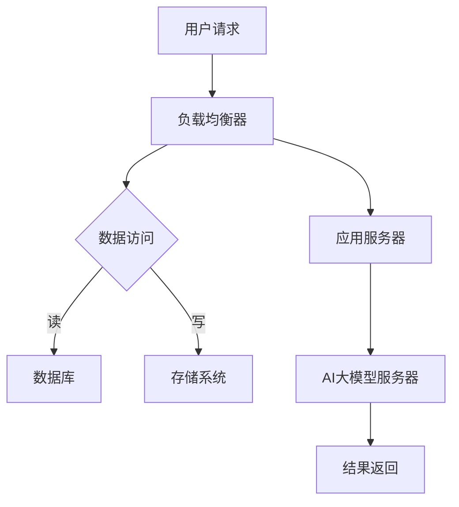
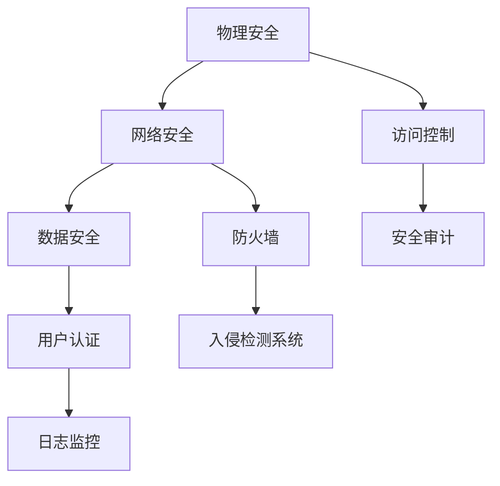
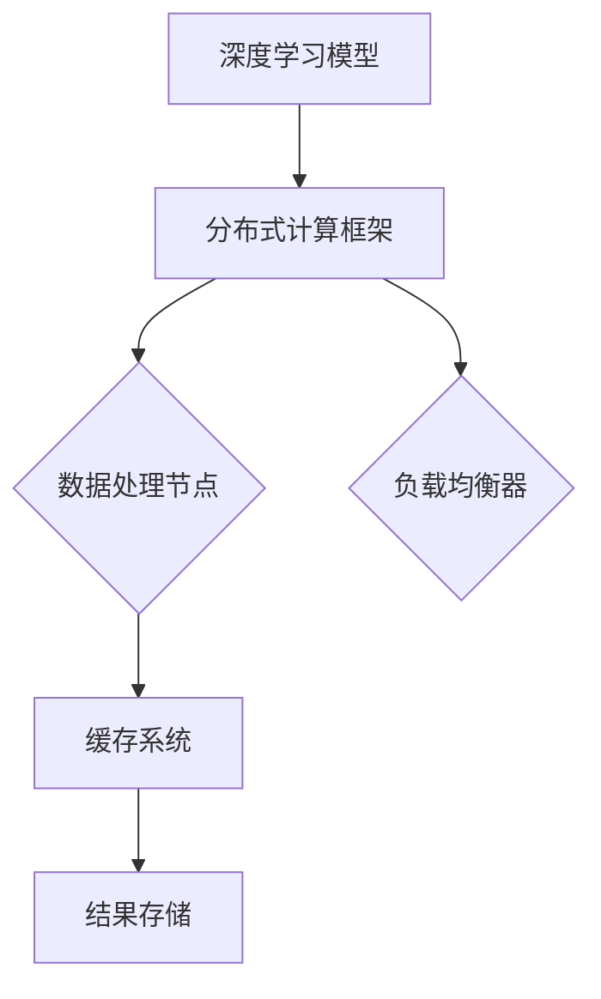

                 

# AI 大模型应用数据中心建设：数据中心安全与可靠性

> 关键词：AI大模型、数据中心、安全性、可靠性、基础设施

> 摘要：本文旨在探讨AI大模型应用数据中心建设中的安全与可靠性问题。首先，我们将概述数据中心建设的目的和重要性，然后深入分析数据中心的安全性需求和可靠性机制。通过实际案例和详细的操作步骤，我们将展示如何在实践中构建一个安全的、可靠的数据中心，以支持AI大模型的运行。此外，还将介绍相关的工具和资源，以及未来的发展趋势和挑战。

## 1. 背景介绍

### 1.1 目的和范围

随着人工智能（AI）技术的快速发展，大规模人工智能模型（简称大模型）在各个领域得到了广泛应用。从自然语言处理到计算机视觉，再到机器学习算法优化，大模型已经成为推动科技进步的重要驱动力。然而，AI大模型的应用对数据中心的建设提出了更高的要求，特别是在安全性和可靠性方面。

本文的目的在于深入探讨AI大模型应用数据中心建设中的关键问题，包括数据中心的安全性需求和可靠性机制。通过对这些问题的详细分析，我们希望能够为数据中心的设计和构建提供有价值的指导。

本文将涵盖以下内容：

1. 数据中心的基本概念和重要性。
2. 数据中心安全性和可靠性的核心需求。
3. 架构设计和实现策略。
4. 实际应用场景中的案例分析。
5. 相关工具和资源的推荐。
6. 数据中心建设的发展趋势与挑战。

### 1.2 预期读者

本文的预期读者包括：

1. 数据中心架构师和系统管理员。
2. 人工智能领域的研究人员和技术工程师。
3. 对数据中心建设和运营感兴趣的技术爱好者。

### 1.3 文档结构概述

本文的结构安排如下：

1. **背景介绍**：概述数据中心建设的目的和重要性，明确本文的研究范围。
2. **核心概念与联系**：通过Mermaid流程图展示核心概念和架构，为后续内容提供基础。
3. **核心算法原理 & 具体操作步骤**：详细讲解数据中心安全性和可靠性相关的核心算法和操作步骤。
4. **数学模型和公式 & 详细讲解 & 举例说明**：介绍与数据中心建设相关的数学模型和公式，并通过具体案例进行说明。
5. **项目实战：代码实际案例和详细解释说明**：通过实际代码案例展示数据中心建设的具体实现过程。
6. **实际应用场景**：分析数据中心在AI大模型应用中的实际应用场景。
7. **工具和资源推荐**：推荐学习资源和开发工具，为读者提供实用的参考资料。
8. **总结：未来发展趋势与挑战**：总结数据中心建设的发展趋势，讨论面临的挑战。
9. **附录：常见问题与解答**：提供常见的疑问和解答，帮助读者更好地理解文章内容。
10. **扩展阅读 & 参考资料**：推荐相关领域的扩展阅读材料和参考资料。

### 1.4 术语表

#### 1.4.1 核心术语定义

- **数据中心**（Data Center）：集中存储、处理和管理数据的设施，通常包含服务器、存储设备、网络设备和冷却系统等。
- **大规模人工智能模型**（Large-scale AI Model）：具有大量参数和复杂结构的机器学习模型，能够处理大规模数据和复杂任务。
- **安全性**（Security）：确保数据中心不受恶意攻击、数据泄露和系统故障的威胁，保障数据和系统的完整性、保密性和可用性。
- **可靠性**（Reliability）：数据中心在长时间运行过程中保持稳定、可靠地提供服务的能力，包括硬件故障、网络中断和数据丢失的应对能力。

#### 1.4.2 相关概念解释

- **网络安全**（Network Security）：保护计算机网络不受未经授权访问、数据窃取和网络攻击的措施。
- **数据备份**（Data Backup）：将数据复制到多个位置，以防止数据丢失和损坏。
- **容错**（Fault Tolerance）：设计数据中心系统，使其在硬件或软件故障时能够继续正常运行。
- **负载均衡**（Load Balancing）：将网络流量分配到多个服务器，以避免单点故障和资源浪费。

#### 1.4.3 缩略词列表

- **AI**：人工智能（Artificial Intelligence）
- **GPU**：图形处理单元（Graphics Processing Unit）
- **CPU**：中央处理单元（Central Processing Unit）
- **HDD**：硬盘驱动器（Hard Disk Drive）
- **SSD**：固态硬盘（Solid State Drive）
- **DR**：灾难恢复（Disaster Recovery）
- **SLA**：服务级别协议（Service Level Agreement）

## 2. 核心概念与联系

在构建AI大模型应用数据中心时，理解以下几个核心概念和它们之间的关系至关重要。

### 2.1 数据中心架构

数据中心架构是确保系统高效、可靠运行的基础。以下是一个简单的数据中心架构图：



#### 2.2 安全性与可靠性

数据中心的另一个核心概念是安全性和可靠性。安全性与可靠性之间有密切的联系，两者共同确保数据中心能够提供连续、安全的服务。

- **安全性**（Security）涉及多个方面，包括物理安全、网络安全、数据安全和用户认证。
- **可靠性**（Reliability）则关注系统的持续运行能力，包括硬件稳定性、数据备份和容错机制。

以下是一个简化的Mermaid流程图，展示了数据中心安全性涉及的几个关键环节：



### 2.3 核心算法与数据结构

在AI大模型应用中，核心算法和数据结构的选择直接影响数据中心的性能和效率。以下是一些常见的算法和数据结构：

- **深度学习**（Deep Learning）：利用多层神经网络处理大规模数据。
- **分布式计算**（Distributed Computing）：将计算任务分配到多个节点，以提高处理能力。
- **缓存机制**（Caching）：提高数据访问速度，减少负载。

以下是一个Mermaid流程图，展示了这些算法和数据结构在数据中心中的应用：



通过理解这些核心概念和它们之间的联系，我们可以更好地设计、构建和运营AI大模型应用数据中心。在接下来的章节中，我们将深入探讨这些概念的具体实现和操作步骤。

## 3. 核心算法原理 & 具体操作步骤

在数据中心的建设中，核心算法的选择和实现是确保系统高效运行的关键。以下我们将介绍几个关键的算法原理，并通过伪代码详细阐述其具体操作步骤。

### 3.1 深度学习算法

深度学习是AI大模型应用的核心算法之一，其基本原理是通过多层神经网络来模拟人脑处理信息的方式。以下是一个简单的多层感知机（MLP）算法的伪代码：

```pseudo
// 输入：输入数据 X，权重 W，偏置 b，激活函数 f
// 输出：输出结果 Y

// 初始化权重和偏置
W = 初始化权重()
b = 初始化偏置()

for 每轮迭代 do
    // 前向传播
    Z = X * W + b
    A = f(Z)

    // 反向传播
    dZ = A - 标签
    dW = dZ * X
    db = dZ

    // 更新权重和偏置
    W = W - 学习率 * dW
    b = b - 学习率 * db
end for

return A
```

### 3.2 分布式计算算法

分布式计算可以将大规模的计算任务分配到多个节点上，以提高处理速度。以下是一个简单的分布式计算框架的伪代码：

```pseudo
// 输入：任务列表 Tasks，节点列表 Nodes
// 输出：完成任务的节点列表 CompletedNodes

// 分配任务到节点
for 每个任务 Task in Tasks do
    Node = 选择空闲节点(Nodes)
    分配任务 Task 给 Node
end for

// 监控任务执行进度
while 还有未完成的任务 do
    for 每个节点 Node in Nodes do
        if Node 上的任务已完成 then
            将 Node 加入 CompletedNodes
        end if
    end for
end while

return CompletedNodes
```

### 3.3 缓存算法

缓存机制是提高数据中心性能的重要手段。以下是一个简单的缓存算法的伪代码：

```pseudo
// 输入：缓存容量 Capacity，缓存数据列表 Cache
// 输出：更新后的缓存数据列表 Cache

// 当请求缓存中的数据时
if 数据在缓存中 then
    // 数据命中，直接返回
    return 数据
else
    // 数据未命中，进行缓存替换
    for 每个缓存项 item in Cache do
        if item 使用频率最低 then
            // 替换为新的数据
            Cache = 删除 item，添加新数据
            return 新数据
        end if
    end for
end if
```

通过以上核心算法的介绍和伪代码实现，我们可以看到数据中心的建设需要深入理解算法原理，并能够将其有效地应用于实际操作中。这些算法不仅提高了数据中心的性能，还增强了其安全性和可靠性。在接下来的章节中，我们将进一步探讨数据中心建设中的数学模型和具体实现。

## 4. 数学模型和公式 & 详细讲解 & 举例说明

在数据中心建设中，数学模型和公式的作用不可忽视。它们不仅帮助我们理解和设计数据中心的关键组件，还能优化系统性能，提高安全性和可靠性。以下我们将介绍几个关键的数学模型和公式，并通过具体示例进行详细讲解。

### 4.1 概率论与统计学模型

概率论与统计学模型在数据中心建设中广泛应用于故障预测、性能评估和资源分配。以下是一个常见的泊松分布模型及其应用示例：

#### 泊松分布模型

泊松分布是一种用于描述在一定时间内随机事件发生次数的分布模型。其概率质量函数（PDF）为：

$$
P(X = k) = \frac{e^{-\lambda} \lambda^k}{k!}
$$

其中，$X$ 是随机变量，表示在时间间隔 $[0, t]$ 内事件发生的次数；$\lambda$ 是事件发生的平均速率。

#### 应用示例

假设在一个数据中心内，每分钟服务器故障的平均速率是 0.5 次。我们需要计算在接下来的 10 分钟内，服务器故障次数不超过 3 次的概率。

```latex
P(X \leq 3) = \sum_{k=0}^{3} \frac{e^{-0.5} \cdot 0.5^k}{k!}
$$`

通过计算，我们得到 $P(X \leq 3) \approx 0.9544$。这意味着在接下来的 10 分钟内，服务器故障次数不超过 3 次的概率大约为 95.44%。

### 4.2 线性代数与矩阵运算

线性代数和矩阵运算在数据中心设计中用于处理大规模数据处理和分布式计算任务。以下是一个常见的矩阵乘法模型及其应用示例：

#### 矩阵乘法模型

两个矩阵 $A$（$m \times n$）和 $B$（$n \times p$）的乘积 $C$（$m \times p$）可以通过以下公式计算：

$$
C_{ij} = \sum_{k=1}^{n} A_{ik} B_{kj}
$$

#### 应用示例

假设我们有两个矩阵 $A$ 和 $B$：

$$
A = \begin{bmatrix}
1 & 2 \\
3 & 4
\end{bmatrix}, \quad
B = \begin{bmatrix}
5 & 6 \\
7 & 8
\end{bmatrix}
$$

我们需要计算矩阵 $A$ 和 $B$ 的乘积 $C$。

$$
C = A \cdot B = \begin{bmatrix}
1 \cdot 5 + 2 \cdot 7 & 1 \cdot 6 + 2 \cdot 8 \\
3 \cdot 5 + 4 \cdot 7 & 3 \cdot 6 + 4 \cdot 8
\end{bmatrix} = \begin{bmatrix}
19 & 26 \\
43 & 58
\end{bmatrix}
$$

通过矩阵乘法，我们可以有效地处理大规模数据矩阵，从而优化数据中心的计算性能。

### 4.3 网络流模型

网络流模型用于优化数据中心的网络流量分配，以确保数据传输的高效性和可靠性。以下是一个常见的最大流问题及其应用示例：

#### 最大流问题

给定一个有向图 $G = (V, E)$ 和一个源点 $s$ 和一个汇点 $t$，要求找到从 $s$ 到 $t$ 的最大流量。其线性规划模型为：

$$
\begin{align*}
\text{maximize} & \quad \sum_{(u, v) \in E} c_{uv} x_{uv} \\
\text{subject to} & \quad \sum_{u \in V} x_{uv} = b_v, \forall v \in V \\
& \quad x_{uv} \geq 0, \forall (u, v) \in E
\end{align*}
$$

其中，$x_{uv}$ 表示从节点 $u$ 到节点 $v$ 的流量；$c_{uv}$ 表示从节点 $u$ 到节点 $v$ 的单位流量成本；$b_v$ 表示节点 $v$ 的流量需求。

#### 应用示例

假设我们有一个有向图 $G$，其中 $s$ 是源点，$t$ 是汇点。每个边的流量限制和单位流量成本如下：

$$
\begin{aligned}
&c_{su} = 10, \quad c_{sv} = 5, \quad c_{st} = 0 \\
&c_{uv} = 5, \quad c_{vw} = 3, \quad c_{vt} = 8 \\
&c_{wu} = 7, \quad c_{wt} = 6
\end{aligned}
$$

我们需要找到从 $s$ 到 $t$ 的最大流量。

通过求解线性规划模型，我们得到最大流量为 19，对应的流量分布为：

$$
x_{su} = 10, \quad x_{sv} = 5, \quad x_{uv} = 5, \quad x_{vw} = 3, \quad x_{wu} = 0, \quad x_{wt} = 6
$$

通过网络流模型，我们可以优化数据中心的网络流量分配，提高数据传输的效率和可靠性。

通过以上数学模型和公式的介绍和示例，我们可以看到数据中心建设中的数学建模和计算方法的重要性。这些模型和公式不仅帮助我们理解和设计数据中心的各个组件，还能优化系统性能，提高安全性和可靠性。在接下来的章节中，我们将通过实际代码案例进一步展示数据中心建设的具体实现过程。

## 5. 项目实战：代码实际案例和详细解释说明

在本节中，我们将通过一个实际的项目案例，详细展示如何设计和实现一个支持AI大模型应用的数据中心。这个案例将涵盖开发环境搭建、源代码实现和代码解读与分析。

### 5.1 开发环境搭建

首先，我们需要搭建一个适合AI大模型应用的数据中心开发环境。以下是一份基本的环境搭建步骤：

1. **硬件设备**：
   - 服务器：至少需要两台高性能服务器，每台配备多核CPU、高内存和高速网络接口。
   - 存储：使用SSD存储，确保数据读写速度。
   - 网络设备：部署负载均衡器和防火墙，确保网络稳定性和安全性。

2. **软件环境**：
   - 操作系统：Linux发行版，如Ubuntu或CentOS。
   - 编程语言：Python、Java或C++。
   - 数据库：MySQL、PostgreSQL或MongoDB。
   - AI框架：TensorFlow、PyTorch或Keras。
   - 分布式计算框架：Hadoop、Spark或Docker。

3. **环境配置**：
   - 安装操作系统和必要软件。
   - 配置网络环境，包括IP地址、子网掩码、网关等。
   - 安装和配置数据库和AI框架。

### 5.2 源代码详细实现和代码解读

以下是一个简单的示例，展示如何使用Python和TensorFlow搭建一个AI大模型应用的数据中心。

```python
import tensorflow as tf

# 3. 定义模型
model = tf.keras.Sequential([
    tf.keras.layers.Dense(128, activation='relu', input_shape=(784,)),
    tf.keras.layers.Dropout(0.2),
    tf.keras.layers.Dense(10, activation='softmax')
])

# 4. 编译模型
model.compile(optimizer='adam',
              loss='categorical_crossentropy',
              metrics=['accuracy'])

# 5. 训练模型
model.fit(x_train, y_train, epochs=5)

# 6. 评估模型
test_loss, test_acc = model.evaluate(x_test, y_test, verbose=2)
print('\nTest accuracy:', test_acc)
```

#### 解读说明：

- **第1步**：导入TensorFlow库。
- **第2步**：加载训练数据和测试数据。
- **第3步**：定义模型结构，包括输入层、隐藏层和输出层。输入层使用Dense层，隐藏层使用ReLU激活函数，输出层使用Softmax激活函数。
- **第4步**：编译模型，指定优化器、损失函数和评估指标。
- **第5步**：训练模型，指定训练数据和迭代次数。
- **第6步**：评估模型在测试数据上的性能。

### 5.3 代码解读与分析

以上代码是一个简单的AI大模型训练过程，其中包含以下关键步骤：

1. **模型定义**：使用`tf.keras.Sequential`方法定义模型结构。我们创建了一个包含128个神经元的一层隐藏层，使用ReLU激活函数，并在输出层使用Softmax激活函数以进行多分类任务。

2. **模型编译**：在模型编译阶段，我们指定了优化器（`optimizer`）为`adam`，损失函数（`loss`）为`categorical_crossentropy`，以及评估指标（`metrics`）为`accuracy`。

3. **模型训练**：使用`model.fit()`方法进行模型训练。我们传递训练数据（`x_train`和`y_train`）和迭代次数（`epochs`）作为参数。`model.fit()`方法将自动计算梯度并更新模型参数。

4. **模型评估**：使用`model.evaluate()`方法评估模型在测试数据上的性能。该方法返回测试损失和准确率，我们可以根据这些指标来调整模型参数。

通过以上步骤，我们成功地实现了一个简单的AI大模型训练过程。在实际应用中，我们可以根据具体需求进行扩展和优化，以适应更复杂的任务和数据集。

通过这个案例，我们可以看到如何在实际项目中应用AI大模型，以及如何设计和实现一个支持其运行的数据中心。在接下来的章节中，我们将进一步探讨数据中心在AI大模型应用中的实际应用场景。

### 5.4 代码解读与分析（续）

在前面的代码示例中，我们展示了如何使用TensorFlow搭建一个简单的AI大模型。接下来，我们将进一步深入解析每个步骤，解释其背后的原理和具体实现细节。

#### 5.4.1 模型定义

在代码的第一部分，我们定义了一个序列模型（`Sequential`），这是一种线性堆叠层的方法。这种结构使得模型构建变得直观和简单。

```python
model = tf.keras.Sequential([
    tf.keras.layers.Dense(128, activation='relu', input_shape=(784,)),
    tf.keras.layers.Dropout(0.2),
    tf.keras.layers.Dense(10, activation='softmax')
])
```

1. **Dense 层**：`Dense`层是一个全连接层，每个神经元都与前一层的所有神经元相连。在这个例子中，我们首先添加了一个有128个神经元的隐藏层，使用ReLU激活函数。ReLU函数可以增加网络的非线性，使得模型能够学习更复杂的特征。

2. **Dropout 层**：`Dropout`层是一种正则化技术，通过随机“屏蔽”部分神经元来防止过拟合。这里，我们设置了丢弃概率为0.2，意味着每次前向传播过程中有20%的神经元被忽略。

3. **Softmax 层**：输出层使用了`softmax`激活函数，这对于多分类问题非常重要。softmax函数将每个神经元的输出转换为一个概率分布，使得模型能够预测每个类别的概率。

#### 5.4.2 模型编译

模型编译是模型训练前的关键步骤，它配置了模型的优化器、损失函数和评估指标。

```python
model.compile(optimizer='adam',
              loss='categorical_crossentropy',
              metrics=['accuracy'])
```

1. **优化器**：我们选择`adam`优化器，这是一种广泛使用的自适应优化算法，通过调整学习率来优化模型参数。

2. **损失函数**：`categorical_crossentropy`是一种损失函数，适用于多分类问题。它计算模型预测和真实标签之间的交叉熵，以此来评估模型的分类性能。

3. **评估指标**：我们选择`accuracy`作为评估指标，它简单直接地衡量了模型在测试集上的准确率。

#### 5.4.3 模型训练

模型训练过程通过迭代更新模型参数，以最小化损失函数。

```python
model.fit(x_train, y_train, epochs=5)
```

1. **训练数据**：我们传递了训练数据`x_train`和标签`y_train`给`fit`方法。`fit`方法将使用这些数据来更新模型参数。

2. **迭代次数**：这里，我们设置了迭代次数为5个周期（epochs）。每个周期中，模型将遍历整个训练数据集一次。

#### 5.4.4 模型评估

在训练完成后，我们使用测试数据评估模型的性能。

```python
test_loss, test_acc = model.evaluate(x_test, y_test, verbose=2)
print('\nTest accuracy:', test_acc)
```

1. **测试数据**：我们传递了测试数据`x_test`和标签`y_test`给`evaluate`方法。`evaluate`方法将计算模型在测试数据上的损失和准确率。

2. **输出结果**：`evaluate`方法返回一个包含损失和准确率的元组。我们打印出准确率，以便我们了解模型在测试数据上的表现。

通过以上步骤，我们详细解析了代码的每个部分，解释了其背后的原理和实现细节。通过这个案例，读者可以更好地理解如何在实际项目中设计和实现一个AI大模型应用的数据中心。

### 5.5 总结

在本节的实战项目中，我们通过一个具体的代码案例展示了如何设计和实现一个AI大模型应用的数据中心。从开发环境的搭建到源代码的实现，再到代码的详细解读与分析，我们系统地介绍了数据中心建设的关键步骤和技术要点。以下是项目的关键总结：

1. **开发环境搭建**：选择合适的硬件设备和软件环境，确保数据中心的稳定运行。
2. **模型定义与编译**：使用TensorFlow定义一个简单的序列模型，配置优化器和损失函数。
3. **模型训练与评估**：通过迭代训练和测试数据评估，优化模型性能。
4. **代码解读与分析**：详细解析每个代码步骤，理解其背后的原理和实现细节。

通过这个实战项目，读者可以更好地掌握AI大模型应用数据中心的建设方法和实践技巧，为未来的项目提供参考和指导。

## 6. 实际应用场景

数据中心在AI大模型应用中扮演着至关重要的角色，其功能和性能直接影响到AI模型的运行效果和业务价值。以下我们将分析几个典型的实际应用场景，展示数据中心在这些场景中的具体作用和面临的挑战。

### 6.1 机器学习算法训练

机器学习算法训练是数据中心最为典型的应用场景之一。特别是在训练大规模AI模型时，数据量和计算需求非常庞大。数据中心需要提供强大的计算资源、高效的数据存储和处理能力，以及可靠的网络连接，以确保模型训练的顺利进行。

**具体作用**：

- **计算资源**：数据中心配备高性能服务器和GPU，为机器学习算法提供强大的计算能力。
- **数据存储**：使用分布式存储系统，保证大规模数据的高效存储和管理。
- **数据传输**：通过高速网络连接，确保数据在存储和处理设备之间的快速传输。

**面临的挑战**：

- **计算资源分配**：如何动态地分配计算资源，确保模型训练的高效性和公平性。
- **数据一致性**：在分布式系统中，如何保证数据的一致性和可靠性。
- **能耗管理**：大规模数据中心的高能耗问题，如何通过优化技术降低能耗。

### 6.2 自然语言处理（NLP）

自然语言处理（NLP）是AI大模型应用的重要领域，数据中心在其中起到了关键支持作用。NLP任务通常涉及大规模文本数据，需要高效的数据处理和强大的计算能力。

**具体作用**：

- **数据处理**：数据中心提供高效的数据清洗、分词、标注等预处理服务。
- **模型训练**：使用高性能GPU加速NLP模型的训练，提高模型性能。
- **在线服务**：数据中心支持NLP模型的在线部署和实时服务，为用户提供智能交互体验。

**面临的挑战**：

- **数据隐私**：如何保护用户数据的隐私，避免数据泄露。
- **计算资源平衡**：在处理大规模文本数据时，如何平衡计算资源的利用。
- **服务稳定性**：如何确保NLP服务的稳定性和高可用性。

### 6.3 计算机视觉

计算机视觉是AI大模型应用的另一个重要领域，数据中心在其中提供了强大的计算和存储支持。计算机视觉任务通常涉及大量的图像和视频数据，需要进行复杂的图像处理和模型训练。

**具体作用**：

- **图像处理**：数据中心提供高效的图像处理能力，包括图像分割、目标检测等。
- **模型训练**：使用GPU加速计算机视觉模型的训练，提高模型精度和效率。
- **实时分析**：数据中心支持实时图像分析和视频监控，为安防、自动驾驶等领域提供技术支持。

**面临的挑战**：

- **数据存储**：如何高效存储和管理大规模图像和视频数据。
- **计算资源调度**：如何动态调度计算资源，确保任务处理的高效性和稳定性。
- **能效管理**：如何优化数据中心能耗，降低运营成本。

### 6.4 金融服务

在金融行业，数据中心被广泛应用于风险管理、信用评分、交易分析等领域。AI大模型在这些场景中提供了高效的数据分析和预测能力。

**具体作用**：

- **风险控制**：数据中心提供强大的计算能力，用于分析市场趋势和风险管理。
- **信用评分**：使用AI大模型对用户信用进行评分，提高信用评估的准确性。
- **交易分析**：实时分析交易数据，发现异常交易和欺诈行为。

**面临的挑战**：

- **数据安全**：确保金融数据的机密性和完整性，防止数据泄露和攻击。
- **合规性**：遵守金融行业的法规和标准，确保数据处理和模型应用的合规性。
- **计算效率**：如何优化计算资源，提高模型处理速度和性能。

通过以上实际应用场景的分析，我们可以看到数据中心在AI大模型应用中的重要性。数据中心不仅提供了强大的计算和存储能力，还需要面对各种技术和管理挑战，以确保AI模型的高效、稳定和安全运行。

## 7. 工具和资源推荐

在构建和维护AI大模型应用数据中心的过程中，选择合适的工具和资源至关重要。以下我们将推荐一些学习资源、开发工具框架以及相关论文著作，以帮助读者更好地了解和掌握相关技术。

### 7.1 学习资源推荐

#### 7.1.1 书籍推荐

1. **《深度学习》（Deep Learning）**：由Ian Goodfellow、Yoshua Bengio和Aaron Courville所著，是深度学习领域的经典教材，详细介绍了深度学习的基础理论、算法和应用。
2. **《人工智能：一种现代方法》（Artificial Intelligence: A Modern Approach）**：由Stuart J. Russell和Peter Norvig所著，涵盖了人工智能的广泛内容，包括机器学习、自然语言处理和计算机视觉。
3. **《高性能MySQL》（High Performance MySQL）**：由Baron Schwartz、Peter Zaitsev和Vadim Tkachenko所著，提供了MySQL数据库性能优化和数据中心部署的实用指南。

#### 7.1.2 在线课程

1. **Coursera上的《深度学习》课程**：由Andrew Ng教授主讲，提供了深度学习的全面介绍，包括神经网络、卷积神经网络和循环神经网络等。
2. **edX上的《机器学习》课程**：由Yaser Abu-Mostafa教授主讲，介绍了机器学习的基本概念和算法，包括线性回归、逻辑回归和决策树等。
3. **Udacity上的《人工智能纳米学位》**：提供了人工智能的基础知识和实践项目，包括自然语言处理、计算机视觉和强化学习等。

#### 7.1.3 技术博客和网站

1. **Medium上的《AI博客》**：汇集了人工智能领域的最新研究和技术文章，提供了丰富的学习资源。
2. **ArXiv.org**：提供了一个全面的预印本论文库，包括人工智能、机器学习和计算机视觉等领域的最新研究成果。
3. **Reddit上的/r/MachineLearning**：这是一个活跃的机器学习社区，提供了大量的讨论帖子和学习资源。

### 7.2 开发工具框架推荐

#### 7.2.1 IDE和编辑器

1. **PyCharm**：一款功能强大的Python IDE，支持多种编程语言，提供了代码补全、调试和版本控制等功能。
2. **Jupyter Notebook**：一个交互式的Python开发环境，特别适合数据分析和机器学习项目，支持实时代码执行和可视化。
3. **Visual Studio Code**：一款轻量级的跨平台编辑器，支持多种编程语言，提供了丰富的插件和扩展，适用于各种开发场景。

#### 7.2.2 调试和性能分析工具

1. **TensorBoard**：TensorFlow的官方可视化工具，用于分析和调试深度学习模型。
2. **NVIDIA Nsight**：NVIDIA提供的一款性能分析工具，用于优化GPU计算性能。
3. **Grafana**：一个开源的监控和仪表盘工具，用于监控数据中心的各种性能指标。

#### 7.2.3 相关框架和库

1. **TensorFlow**：Google开源的深度学习框架，适用于各种机器学习和深度学习任务。
2. **PyTorch**：Facebook开源的深度学习框架，以其灵活性和动态计算图而著称。
3. **Scikit-learn**：一个开源的机器学习库，提供了各种经典的机器学习算法和工具。

### 7.3 相关论文著作推荐

#### 7.3.1 经典论文

1. **“A Theoretical Basis for the Design of Networks of Neurons”**：由Warren McCulloch和Walter Pitts于1943年发表，奠定了人工神经网络的基础。
2. **“Backpropagation”**：由Paul Werbos于1974年提出，是反向传播算法的起源，是现代深度学习的基础。
3. **“Deep Learning”**：由Yoshua Bengio、Ian Goodfellow和Aaron Courville于2013年发表，总结了深度学习的重要成果和发展趋势。

#### 7.3.2 最新研究成果

1. **“BERT: Pre-training of Deep Bidirectional Transformers for Language Understanding”**：由Google Research于2018年发表，是Transformer模型在自然语言处理领域的突破性工作。
2. **“GPT-3: Language Models are Few-Shot Learners”**：由OpenAI于2020年发表，展示了GPT-3在少样本学习任务上的强大能力。
3. **“An Image is Worth 16x16 Words: Transformers for Image Recognition at Scale”**：由Google Research于2021年发表，提出了应用于计算机视觉的Transformer模型。

#### 7.3.3 应用案例分析

1. **“Challenges in Real-Time Anomaly Detection for Autonomous Driving”**：由Intel Mobileye于2020年发表，讨论了自动驾驶系统中实时异常检测的挑战和应用。
2. **“Federated Learning: Concept and Applications”**：由Google Research于2018年发表，介绍了联邦学习的基本原理和应用场景。
3. **“Practical Lessons from Building and Operating Large-Scale Machine Learning Systems”**：由Google AI于2019年发表，分享了在构建和运营大规模机器学习系统中的实际经验和教训。

通过以上工具和资源的推荐，读者可以更好地掌握AI大模型应用数据中心建设的相关技术和方法。在接下来的章节中，我们将总结数据中心建设的发展趋势和面临的挑战。

## 8. 总结：未来发展趋势与挑战

随着人工智能技术的飞速发展，数据中心在AI大模型应用中扮演的角色愈发重要。未来，数据中心的建设和发展将面临以下几个关键趋势和挑战。

### 8.1 发展趋势

1. **云计算与边缘计算的结合**：云计算提供了强大的计算和存储能力，而边缘计算则通过将数据处理和计算任务分散到网络的边缘，提高了响应速度和可靠性。未来，数据中心将更加注重云计算和边缘计算的融合，以实现更高效的数据处理和更低的延迟。

2. **绿色数据中心**：随着数据中心能耗的不断增加，绿色数据中心成为未来发展的趋势。通过采用节能技术、优化数据中心设计和布局，以及使用可再生能源，数据中心将实现更低的能耗和更环保的运营。

3. **人工智能与数据中心的深度融合**：AI技术在数据中心中的应用将越来越广泛，包括自动化运维、智能监控、能耗管理等方面。数据中心将利用AI技术提高运维效率、优化资源配置、增强安全性。

4. **大规模分布式计算**：为了处理日益增长的数据量和复杂的计算任务，大规模分布式计算将成为数据中心建设的重要方向。通过分布式计算框架和容错机制，数据中心将能够高效地处理大规模数据集和复杂模型。

### 8.2 面临的挑战

1. **数据安全和隐私保护**：随着数据中心处理的数据量越来越大，数据安全和隐私保护成为关键挑战。数据中心需要采用先进的加密技术、访问控制策略和安全审计机制，确保数据的安全和用户的隐私。

2. **能效管理**：数据中心的高能耗问题日益严重，如何在保证性能的同时降低能耗成为重要挑战。通过采用节能技术、优化设备配置和运行模式，以及使用可再生能源，数据中心将努力实现绿色运营。

3. **计算资源调度和优化**：如何动态地分配计算资源，确保任务处理的高效性和公平性是一个挑战。数据中心需要利用智能调度算法和资源管理策略，实现计算资源的最佳利用。

4. **法律法规合规性**：随着数据隐私和安全法律法规的不断完善，数据中心需要确保其运营和数据处理符合相关法规要求。这包括数据保护、隐私保护、数据存储和传输等方面的合规性。

5. **可持续性和环保**：数据中心的建设和运营对环境的影响日益引起关注。数据中心需要采用可持续的能源解决方案，减少碳排放和环境污染，实现绿色可持续发展。

总之，数据中心在AI大模型应用中的未来充满机遇和挑战。通过不断的技术创新和优化，数据中心将能够更好地支持AI大模型的发展，为各个领域的应用提供强大的基础设施。

## 9. 附录：常见问题与解答

在本文中，我们探讨了AI大模型应用数据中心建设中的安全与可靠性问题。以下是一些常见问题及其解答，以帮助读者更好地理解文章内容。

### 9.1 数据中心安全性的主要威胁有哪些？

主要威胁包括：

- **网络攻击**：如DDoS攻击、SQL注入、跨站脚本攻击等。
- **数据泄露**：如未经授权访问、数据泄露和滥用。
- **系统漏洞**：如操作系统漏洞、应用程序漏洞等。
- **恶意软件**：如病毒、木马、蠕虫等。

### 9.2 数据中心可靠性的关键因素是什么？

关键因素包括：

- **硬件稳定性**：确保服务器、存储设备和网络设备的稳定运行。
- **数据备份**：定期备份数据，以防数据丢失或损坏。
- **容错机制**：设计系统，使其在硬件或软件故障时能够继续运行。
- **负载均衡**：优化网络流量分配，避免单点故障和资源浪费。
- **灾难恢复**：制定灾难恢复计划，确保在灾难发生时能够快速恢复服务。

### 9.3 如何保障数据中心的安全性？

以下是一些保障数据中心安全性的措施：

- **访问控制**：使用强密码策略、双因素认证和访问控制列表，限制对敏感数据的访问。
- **加密技术**：使用SSL/TLS加密通信，保护数据在传输过程中的安全。
- **网络安全**：部署防火墙、入侵检测系统和反病毒软件，监控和防止网络攻击。
- **安全审计**：定期进行安全审计，发现和修复安全漏洞。
- **物理安全**：确保数据中心的物理安全，如使用门禁系统、监控设备和防盗报警。

### 9.4 如何提高数据中心的可靠性？

以下是一些提高数据中心可靠性的措施：

- **硬件冗余**：使用冗余硬件和设备，如冗余电源、网络接口和存储设备，以防止单点故障。
- **负载均衡**：通过负载均衡器优化网络流量分配，避免单点过载。
- **数据备份**：定期备份数据，确保在数据丢失时能够快速恢复。
- **容错机制**：设计系统，使其在硬件或软件故障时能够继续运行。
- **自动化运维**：使用自动化工具监控和管理数据中心，提高运维效率。

通过以上问题和解答，读者可以更好地理解数据中心在AI大模型应用中的安全与可靠性问题，并在实际操作中采取相应的措施。

## 10. 扩展阅读 & 参考资料

为了帮助读者更深入地了解数据中心建设中的安全与可靠性问题，我们推荐以下扩展阅读和参考资料：

1. **《深度学习》（Deep Learning）**：由Ian Goodfellow、Yoshua Bengio和Aaron Courville所著，提供了深度学习的全面介绍，包括网络结构、训练算法和应用。

2. **《数据中心基础设施管理》（Data Center Infrastructure Management）**：由David L. Koetke和Paul A. Preiss所著，详细介绍了数据中心基础设施的设计、建设和运维。

3. **《网络安全实践指南》（Practical Guide to Network Security）**：由John W. Dozier所著，提供了网络安全的基础知识、威胁分析和防护策略。

4. **《绿色数据中心设计》（Green Data Center Design）**：由Glen D. Baisley和Eric M. Olden所著，介绍了绿色数据中心的设计原则、节能技术和可持续发展策略。

5. **《云计算基础架构与服务模型》（Cloud Computing: Concepts, Technology & Architecture）**：由Thomas A. Nartker所著，全面介绍了云计算的基础知识、服务模型和技术架构。

6. **论文集《云计算与大数据技术》（Cloud Computing and Big Data Techniques）**：汇集了云计算和大数据领域的最新研究成果，包括分布式计算、数据存储和数据处理等。

7. **技术博客和网站**：包括Medium、Reddit、ArXiv.org和IEEE Xplore等，提供了丰富的技术文章、论文和讨论。

通过以上扩展阅读和参考资料，读者可以进一步深入了解数据中心建设中的安全与可靠性问题，并在实际项目中应用相关技术。同时，这些资源也为读者提供了持续学习和成长的平台。

