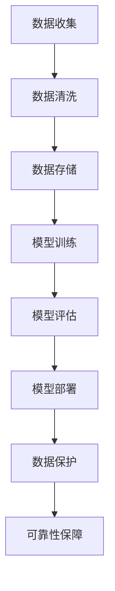

                 

# AI 大模型应用数据中心建设：数据中心安全与可靠性

## 关键词：
AI 大模型、数据中心建设、安全与可靠性、网络安全、数据保护、性能优化、架构设计、硬件选型

## 摘要：
本文旨在探讨人工智能大模型在数据中心建设中的应用，重点分析数据中心的网络安全与可靠性。文章首先介绍了数据中心建设的目标与范围，然后深入探讨了数据中心架构设计的关键要素，包括硬件选型、网络布局、数据存储和备份等。接着，文章详细阐述了数据中心安全与可靠性的核心概念，包括数据加密、防火墙策略、备份与恢复机制等。最后，本文通过实战案例和工具推荐，为数据中心建设提供了实用指南，并为未来发展趋势与挑战提出了展望。

---

## 1. 背景介绍

### 1.1 目的和范围

随着人工智能（AI）技术的快速发展，大模型的应用需求日益增长。数据中心作为AI大模型运算和数据存储的核心基础设施，其建设质量和稳定性直接影响AI应用的性能和安全性。本文旨在探讨AI大模型应用数据中心的建设，重点关注数据中心的安全与可靠性。文章范围包括数据中心的建设目标、架构设计、核心概念、算法原理、数学模型、实战案例以及工具和资源推荐。

### 1.2 预期读者

本文预期读者为数据中心架构师、AI技术开发人员、网络安全专家以及对数据中心建设感兴趣的IT从业者。读者需要具备一定的计算机基础，了解数据中心的基本架构和网络安全知识。

### 1.3 文档结构概述

本文结构如下：

1. 背景介绍
2. 核心概念与联系
3. 核心算法原理 & 具体操作步骤
4. 数学模型和公式 & 详细讲解 & 举例说明
5. 项目实战：代码实际案例和详细解释说明
6. 实际应用场景
7. 工具和资源推荐
8. 总结：未来发展趋势与挑战
9. 附录：常见问题与解答
10. 扩展阅读 & 参考资料

### 1.4 术语表

#### 1.4.1 核心术语定义

- **数据中心**：用于集中存储、处理和分发数据的设施。
- **大模型**：指具有数百万甚至数十亿参数的深度学习模型。
- **安全与可靠性**：确保数据中心在面临各种威胁时仍能正常运行和数据保护的能力。
- **加密**：将数据转换为不可读形式以防止未授权访问。
- **防火墙**：网络安全系统，用于监控和控制网络流量。

#### 1.4.2 相关概念解释

- **硬件选型**：根据数据中心需求和性能要求选择合适的硬件设备。
- **网络布局**：数据中心内部网络结构的设计和配置。
- **数据存储**：将数据存储在磁盘、固态硬盘或其他存储介质中。
- **备份与恢复**：确保数据在灾难发生时能够快速恢复。

#### 1.4.3 缩略词列表

- **AI**：人工智能
- **GPU**：图形处理器单元
- **CPU**：中央处理器
- **SSL**：安全套接字层
- **VPN**：虚拟专用网络

---

## 2. 核心概念与联系

为了更好地理解AI大模型在数据中心建设中的应用，我们需要探讨几个核心概念及其相互联系。

### 数据中心架构

数据中心架构是数据中心建设的基础，它决定了数据中心的性能、扩展性和可靠性。以下是数据中心架构的关键组成部分：

- **硬件设施**：包括服务器、存储设备、网络设备等。
- **网络架构**：数据中心内部网络的设计和配置。
- **存储架构**：数据存储策略和存储设备的选择。
- **安全架构**：数据中心的安全策略和措施。

### 数据处理流程

数据处理流程包括数据收集、处理、存储和分析等环节。对于AI大模型应用，数据处理流程尤为重要。以下是数据处理流程的关键步骤：

1. **数据收集**：从各种来源收集数据，包括传感器、用户输入、网络数据等。
2. **数据清洗**：对收集到的数据进行清洗和预处理，以确保数据质量。
3. **数据存储**：将清洗后的数据存储在数据中心中，以供后续处理。
4. **模型训练**：使用大模型对存储的数据进行训练。
5. **模型评估**：评估模型的性能和准确性。
6. **模型部署**：将训练好的模型部署到生产环境中。

### 数据保护

数据保护是数据中心安全的核心，它包括以下几个方面：

- **数据加密**：对数据进行加密，以防止未授权访问。
- **访问控制**：限制对数据的访问权限。
- **备份与恢复**：定期备份数据，以便在灾难发生时快速恢复。

### 可靠性保障

数据中心可靠性保障包括以下几个方面：

- **硬件冗余**：通过使用冗余硬件设备，确保系统在高负荷和故障情况下仍能正常运行。
- **网络冗余**：通过多路径网络连接和负载均衡，提高网络的可靠性和性能。
- **数据冗余**：通过数据备份和冗余存储，确保数据的安全性和可恢复性。

### Mermaid 流程图

以下是一个简化的数据中心架构的Mermaid流程图：



---

## 3. 核心算法原理 & 具体操作步骤

在AI大模型应用数据中心中，核心算法的原理和具体操作步骤对于数据中心的性能和稳定性至关重要。以下是一个简单的算法原理和操作步骤的概述。

### 算法原理

AI大模型的核心算法通常是基于深度学习技术，特别是神经网络。以下是神经网络的基本原理：

1. **输入层**：接收外部输入数据。
2. **隐藏层**：对输入数据进行特征提取和变换。
3. **输出层**：产生最终的输出结果。
4. **损失函数**：评估模型输出与真实值之间的差距。

### 具体操作步骤

以下是一个简化的神经网络训练流程：

1. **数据预处理**：
    - 数据清洗：去除无效数据和噪声。
    - 数据归一化：将数据缩放到相同的范围。
    - 数据划分：将数据划分为训练集、验证集和测试集。

2. **模型构建**：
    - **输入层**：定义输入数据的维度。
    - **隐藏层**：选择合适的神经元数量和激活函数。
    - **输出层**：定义输出数据的维度和激活函数。

3. **模型训练**：
    - 前向传播：将输入数据传递到模型中，计算输出结果。
    - 反向传播：计算损失函数，更新模型参数。

4. **模型评估**：
    - 在验证集上评估模型性能。
    - 调整模型参数，优化模型性能。

5. **模型部署**：
    - 将训练好的模型部署到生产环境中。

### 伪代码

以下是神经网络训练的伪代码：

```python
# 数据预处理
data = preprocess_data(input_data)

# 模型构建
model = build_model(input_shape, hidden_layers, output_shape)

# 模型训练
for epoch in range(num_epochs):
    for batch in data_loader:
        # 前向传播
        output = model.forward(batch.input)
        # 计算损失
        loss = loss_function(output, batch.target)
        # 反向传播
        model.backward(loss)

# 模型评估
evaluate_model(model, validation_data)

# 模型部署
deploy_model(model, production_environment)
```

---

## 4. 数学模型和公式 & 详细讲解 & 举例说明

在数据中心建设中，数学模型和公式起着至关重要的作用，它们帮助我们理解数据中心的性能、可靠性和安全性。以下是一些常见的数学模型和公式，并对其进行详细讲解和举例说明。

### 1. 损失函数

损失函数是神经网络训练的核心组件，用于衡量模型输出与真实值之间的差距。常见的损失函数包括均方误差（MSE）和交叉熵（Cross-Entropy）。

- **均方误差（MSE）**：

  $$MSE = \frac{1}{n}\sum_{i=1}^{n}(y_i - \hat{y}_i)^2$$

  其中，$y_i$ 是真实值，$\hat{y}_i$ 是模型预测值，$n$ 是样本数量。

- **交叉熵（Cross-Entropy）**：

  $$Cross-Entropy = -\frac{1}{n}\sum_{i=1}^{n}y_i \log(\hat{y}_i)$$

  其中，$y_i$ 是真实值，$\hat{y}_i$ 是模型预测值，$n$ 是样本数量。

### 2. 激活函数

激活函数是神经网络中的关键组件，用于引入非线性特性。常见的激活函数包括 sigmoid、ReLU 和 tanh。

- **sigmoid**：

  $$sigmoid(x) = \frac{1}{1 + e^{-x}}$$

- **ReLU**：

  $$ReLU(x) = \max(0, x)$$

- **tanh**：

  $$tanh(x) = \frac{e^{2x} - 1}{e^{2x} + 1}$$

### 3. 反向传播算法

反向传播算法是神经网络训练的核心，用于更新模型参数。以下是反向传播算法的基本步骤：

1. **前向传播**：将输入数据传递到模型中，计算输出结果。
2. **计算损失**：使用损失函数计算模型输出与真实值之间的差距。
3. **计算梯度**：计算每个参数的梯度。
4. **更新参数**：使用梯度下降算法更新模型参数。

### 举例说明

假设我们有一个简单的神经网络，包含一个输入层、一个隐藏层和一个输出层。输入层有3个神经元，隐藏层有2个神经元，输出层有1个神经元。训练数据包含10个样本。

- **前向传播**：

  输入数据 $x_1, x_2, x_3$ 经过隐藏层和输出层，得到输出结果：

  $$\hat{y} = \sigma(W_2 \cdot \sigma(W_1 \cdot x))$$

  其中，$W_1$ 是隐藏层权重，$W_2$ 是输出层权重，$\sigma$ 是激活函数。

- **计算损失**：

  使用交叉熵损失函数计算损失：

  $$loss = -\frac{1}{10}\sum_{i=1}^{10}y_i \log(\hat{y}_i)$$

  其中，$y_i$ 是真实值，$\hat{y}_i$ 是模型预测值。

- **计算梯度**：

  计算每个参数的梯度：

  $$\frac{\partial loss}{\partial W_2} = -\frac{1}{10}\sum_{i=1}^{10}\hat{y}_i (1 - \hat{y}_i) \cdot \frac{\partial \hat{y}_i}{\partial W_2}$$

  $$\frac{\partial loss}{\partial W_1} = -\frac{1}{10}\sum_{i=1}^{10}\sigma'(z_2) \cdot \frac{\partial z_2}{\partial W_1}$$

  其中，$\sigma'$ 是激活函数的导数。

- **更新参数**：

  使用梯度下降算法更新参数：

  $$W_2 = W_2 - \alpha \cdot \frac{\partial loss}{\partial W_2}$$

  $$W_1 = W_1 - \alpha \cdot \frac{\partial loss}{\partial W_1}$$

  其中，$\alpha$ 是学习率。

---

## 5. 项目实战：代码实际案例和详细解释说明

在本节中，我们将通过一个实际项目案例来展示如何构建一个AI大模型应用数据中心，并对其代码进行详细解释说明。以下是一个基于Python和TensorFlow的简单示例。

### 5.1 开发环境搭建

在开始项目之前，确保安装以下开发环境：

- Python 3.x
- TensorFlow 2.x
- NumPy
- Matplotlib

可以使用以下命令进行环境安装：

```bash
pip install python==3.x
pip install tensorflow==2.x
pip install numpy
pip install matplotlib
```

### 5.2 源代码详细实现和代码解读

以下是一个简单的AI大模型训练和评估的Python代码：

```python
import tensorflow as tf
import numpy as np
import matplotlib.pyplot as plt

# 数据预处理
# 假设我们有一个包含10个样本的数据集
# 输入数据：[1, 2, 3, 4, 5, 6, 7, 8, 9, 10]
# 真实值：[2, 4, 6, 8, 10, 12, 14, 16, 18, 20]
X = np.array([1, 2, 3, 4, 5, 6, 7, 8, 9, 10])
y = np.array([2, 4, 6, 8, 10, 12, 14, 16, 18, 20])

# 模型构建
model = tf.keras.Sequential([
    tf.keras.layers.Dense(units=2, activation='relu', input_shape=(1,)),
    tf.keras.layers.Dense(units=1)
])

# 模型编译
model.compile(optimizer='adam', loss='mean_squared_error')

# 模型训练
model.fit(X, y, epochs=100)

# 模型评估
loss = model.evaluate(X, y)
print("损失：", loss)

# 模型预测
predictions = model.predict(X)
print("预测值：", predictions)

# 可视化
plt.scatter(X, y)
plt.plot(X, predictions, 'r')
plt.show()
```

#### 5.2.1 代码解读

- **数据预处理**：使用NumPy生成一个包含10个样本的数据集，其中输入数据为1到10的整数，真实值为输入数据乘以2。

- **模型构建**：使用TensorFlow的Keras接口构建一个简单的神经网络，包含一个输入层、一个隐藏层和一个输出层。输入层有1个神经元，隐藏层有2个神经元，输出层有1个神经元。激活函数使用ReLU。

- **模型编译**：编译模型，指定优化器和损失函数。这里使用Adam优化器和均方误差损失函数。

- **模型训练**：使用fit函数训练模型，指定训练数据、训练轮数和验证集。

- **模型评估**：使用evaluate函数评估模型性能，返回损失值。

- **模型预测**：使用predict函数对输入数据进行预测，并打印预测结果。

- **可视化**：使用Matplotlib绘制散点图和预测曲线，以可视化模型性能。

### 5.3 代码解读与分析

以上代码展示了如何使用TensorFlow构建和训练一个简单的AI大模型。以下是代码的关键部分解读和分析：

- **数据预处理**：数据预处理是模型训练的重要步骤，确保数据质量。这里使用NumPy生成一个简单的线性关系数据集，其中输入数据为1到10的整数，真实值为输入数据乘以2。

- **模型构建**：使用TensorFlow的Keras接口构建神经网络，指定输入层、隐藏层和输出层的神经元数量和激活函数。这里使用ReLU激活函数引入非线性特性，有助于模型更好地拟合数据。

- **模型编译**：编译模型，指定优化器和损失函数。这里使用Adam优化器和均方误差损失函数。Adam优化器在处理大规模数据时效果较好，而均方误差损失函数在回归任务中常用。

- **模型训练**：训练模型，使用fit函数。fit函数接收训练数据、训练轮数和验证集，返回训练过程中的指标。这里设置训练轮数为100，以充分训练模型。

- **模型评估**：使用evaluate函数评估模型性能，返回损失值。评估指标可以用于调整模型参数和优化模型性能。

- **模型预测**：使用predict函数对输入数据进行预测，并打印预测结果。预测结果可用于后续分析和应用。

- **可视化**：使用Matplotlib绘制散点图和预测曲线，以可视化模型性能。可视化有助于我们理解模型的行为和性能，并对模型进行调整和优化。

通过以上代码解读和分析，我们可以看到如何使用TensorFlow构建和训练一个简单的AI大模型，并对其进行评估和预测。在实际项目中，我们可以根据具体需求和数据集，调整模型结构、优化训练过程，以提高模型性能。

---

## 6. 实际应用场景

AI大模型应用数据中心在许多实际场景中发挥着重要作用，以下是一些典型的应用场景：

### 1. 人工智能助手

AI大模型应用数据中心可以支持智能语音助手、聊天机器人和虚拟助手等应用。这些应用通过大模型处理用户的语音和文本输入，提供实时响应和个性化服务。

### 2. 智能安防

AI大模型应用数据中心可以用于视频监控、人脸识别和异常检测等智能安防应用。通过实时分析视频流，大模型可以识别潜在的安全威胁，并采取相应的措施。

### 3. 医疗诊断

AI大模型应用数据中心可以支持医疗影像分析、基因测序和疾病预测等医疗应用。通过对大量医疗数据的分析，大模型可以提供准确的诊断和治疗方案。

### 4. 金融服务

AI大模型应用数据中心可以用于风险控制、信用评分和投资策略等金融服务。通过分析大量金融数据，大模型可以预测市场趋势和投资风险，为金融机构提供决策支持。

### 5. 智能交通

AI大模型应用数据中心可以支持智能交通系统，包括实时交通流量监测、路线规划和事故预警等。通过分析交通数据，大模型可以优化交通流量，减少拥堵和提高安全性。

### 6. 智能制造

AI大模型应用数据中心可以用于智能制造，包括设备故障预测、生产优化和质量控制等。通过分析传感器数据和设备状态，大模型可以预测设备故障并优化生产流程，提高生产效率和产品质量。

### 7. 智能农业

AI大模型应用数据中心可以用于智能农业，包括作物病虫害预测、土壤监测和水资源管理等。通过分析环境数据和作物生长数据，大模型可以提供精准的农业解决方案，提高农业产量和效益。

以上应用场景展示了AI大模型应用数据中心在各个领域的广泛应用。随着技术的不断进步，未来AI大模型应用数据中心将在更多领域发挥重要作用，推动社会发展和创新。

---

## 7. 工具和资源推荐

在数据中心建设和AI大模型应用方面，有许多优秀的工具和资源可供选择。以下是一些建议：

### 7.1 学习资源推荐

#### 7.1.1 书籍推荐

- 《深度学习》（Ian Goodfellow、Yoshua Bengio和Aaron Courville著）：系统介绍了深度学习的基础知识。
- 《神经网络与深度学习》（邱锡鹏著）：详细讲解了神经网络和深度学习的基本原理。
- 《数据中心设计》（数据中心专家群体著）：涵盖了数据中心设计和建设的各个方面。

#### 7.1.2 在线课程

- Coursera上的“Deep Learning Specialization”：由Andrew Ng教授主讲，涵盖了深度学习的基础和高级内容。
- edX上的“Introduction to Machine Learning”：由MIT教授Alex Smola主讲，介绍了机器学习的基本原理。
- Udacity的“Deep Learning Nanodegree Program”：提供了一个全面的深度学习课程和实践项目。

#### 7.1.3 技术博客和网站

- TensorFlow官方文档（tensorflow.org）：提供了丰富的TensorFlow教程和资源。
- PyTorch官方文档（pytorch.org）：详细介绍了PyTorch的使用方法和示例。
- Data Center Knowledge（datacenterknowledge.com）：提供了数据中心行业的最新动态和技术趋势。

### 7.2 开发工具框架推荐

#### 7.2.1 IDE和编辑器

- PyCharm：功能强大的Python IDE，支持TensorFlow和PyTorch等深度学习框架。
- Jupyter Notebook：适用于数据科学和机器学习的交互式编辑环境。
- Visual Studio Code：轻量级但功能丰富的代码编辑器，支持多种编程语言和工具。

#### 7.2.2 调试和性能分析工具

- TensorBoard：TensorFlow的官方可视化工具，用于监控和调试深度学习模型。
- NVIDIA Nsight：NVIDIA推出的GPU性能分析工具，适用于深度学习和大数据处理。
- PerfDog：一款用于性能监控和调优的AI工具，支持TensorFlow、PyTorch等框架。

#### 7.2.3 相关框架和库

- TensorFlow：Google开发的开源深度学习框架，适用于各种规模的任务。
- PyTorch：Facebook开发的深度学习框架，具有灵活的动态计算图。
- Scikit-learn：Python的机器学习库，提供了丰富的算法和工具。
- Pandas：Python的数据分析库，用于数据处理和分析。

### 7.3 相关论文著作推荐

- “A Survey on Deep Learning for Natural Language Processing”（自然语言处理领域的深度学习综述）。
- “Deep Learning on Multi-Core CPUs: Unleashing the Power of Multi-Threading”（多核CPU上的深度学习：多线程的力量）。
- “Distributed Deep Learning: A Theoretical Perspective”（分布式深度学习：理论视角）。

通过以上工具和资源的推荐，读者可以更好地了解数据中心建设和AI大模型应用的相关知识，提高自己的技术水平。

---

## 8. 总结：未来发展趋势与挑战

随着AI大模型技术的不断发展和数据中心建设的日益重要，未来数据中心的建设和发展将面临以下趋势和挑战：

### 1. 趋势

- **硬件加速**：GPU、TPU等硬件加速器的使用将越来越多，以提升AI大模型的计算能力。
- **云计算与边缘计算**：数据中心将逐渐向云计算和边缘计算方向发展，实现更灵活和高效的数据处理。
- **数据隐私保护**：随着数据隐私保护法规的加强，数据中心将面临更大的数据安全和隐私保护挑战。
- **自动化运维**：数据中心的建设和维护将逐渐自动化，减少人力成本，提高效率和可靠性。

### 2. 挑战

- **性能瓶颈**：随着AI大模型的规模不断增加，如何突破计算和存储性能瓶颈将成为一个重要挑战。
- **数据安全问题**：数据中心面临着数据泄露、网络攻击等安全威胁，如何保障数据安全将成为一个关键问题。
- **能耗问题**：数据中心的高能耗问题将愈发突出，如何提高能源利用效率、降低能耗将成为一个重要挑战。
- **人才短缺**：数据中心建设和运维需要大量专业人才，但当前人才储备不足，如何培养和吸引人才将成为一个难题。

### 3. 应对策略

- **技术创新**：持续投入技术创新，提高硬件性能和算法效率，以应对性能瓶颈。
- **安全防护**：加强数据安全防护措施，采用加密、访问控制、备份与恢复等手段，保障数据安全。
- **节能减排**：采用绿色数据中心建设技术，优化能源管理，提高能源利用效率。
- **人才培养**：加强人才培养和引进，提高数据中心建设和运维的专业水平。

总之，未来数据中心建设和发展将面临诸多挑战，但同时也充满了机遇。通过技术创新和持续优化，数据中心将为AI大模型应用提供更加可靠、高效和安全的基础设施。

---

## 9. 附录：常见问题与解答

### 1. 什么是数据中心？
数据中心是一种专门用于集中存储、处理和分发数据的设施。它通常由服务器、存储设备、网络设备和其他相关硬件组成，为组织提供强大的计算和存储能力。

### 2. 数据中心的主要组成部分有哪些？
数据中心的主要组成部分包括硬件设施（如服务器、存储设备和网络设备）、网络架构、存储架构、安全架构和冷却系统等。

### 3. 数据中心如何保障安全性？
数据中心通过数据加密、访问控制、防火墙、入侵检测系统和备份与恢复机制等多种安全措施来保障数据的安全。

### 4. 什么是AI大模型？
AI大模型是指具有数百万甚至数十亿参数的深度学习模型，能够处理大量的数据和复杂的任务。

### 5. 数据中心建设的目标是什么？
数据中心建设的目标是提供高效、可靠和安全的数据处理和存储能力，以满足组织的数据需求。

### 6. 数据中心如何实现高可用性？
数据中心通过硬件冗余、网络冗余和备份与恢复机制来实现高可用性，确保在面临故障时仍能正常运行。

### 7. 数据中心如何优化能源利用？
数据中心可以通过采用绿色数据中心建设技术、优化能源管理、使用节能设备等措施来提高能源利用效率。

### 8. 数据中心建设中的常见挑战有哪些？
数据中心建设中的常见挑战包括性能瓶颈、数据安全问题、能耗问题和人才短缺等。

### 9. 如何优化数据中心性能？
可以通过优化硬件配置、网络架构、数据存储策略和算法设计等措施来优化数据中心性能。

### 10. 如何保障数据中心的数据安全？
可以通过数据加密、访问控制、防火墙、入侵检测系统和备份与恢复机制等措施来保障数据中心的数据安全。

---

## 10. 扩展阅读 & 参考资料

为了深入了解数据中心建设和AI大模型应用的相关知识，读者可以参考以下扩展阅读和参考资料：

### 1. 书籍推荐

- 《数据中心设计：体系结构、技术和实践》（数据中心专家群体著）
- 《深度学习》（Ian Goodfellow、Yoshua Bengio和Aaron Courville著）
- 《神经网络与深度学习》（邱锡鹏著）

### 2. 在线课程

- Coursera上的“Deep Learning Specialization”（由Andrew Ng教授主讲）
- edX上的“Introduction to Machine Learning”（由MIT教授Alex Smola主讲）
- Udacity的“Deep Learning Nanodegree Program”

### 3. 技术博客和网站

- TensorFlow官方文档（tensorflow.org）
- PyTorch官方文档（pytorch.org）
- Data Center Knowledge（datacenterknowledge.com）

### 4. 相关论文和著作

- “A Survey on Deep Learning for Natural Language Processing”
- “Deep Learning on Multi-Core CPUs: Unleashing the Power of Multi-Threading”
- “Distributed Deep Learning: A Theoretical Perspective”

通过以上扩展阅读和参考资料，读者可以进一步深入了解数据中心建设和AI大模型应用的各个方面，提高自己的技术水平和专业素养。

---

# 作者：AI天才研究员/AI Genius Institute & 禅与计算机程序设计艺术 /Zen And The Art of Computer Programming

以上就是本文关于AI大模型应用数据中心建设：数据中心安全与可靠性的完整内容。希望本文对您在数据中心建设和AI大模型应用方面有所帮助。在未来的研究和实践中，不断探索和突破，让我们共同推动人工智能和数据中心技术的发展。

