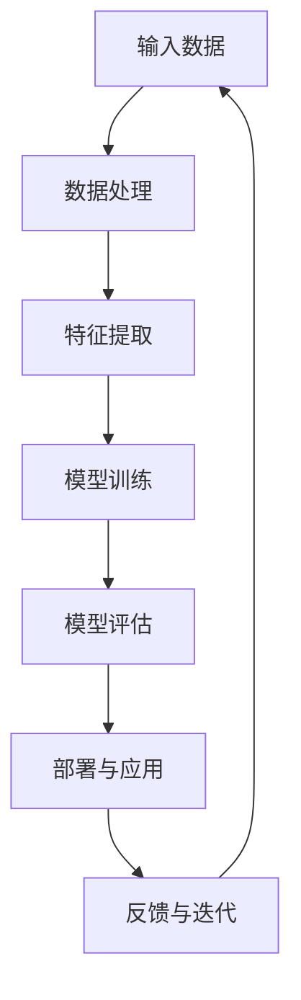
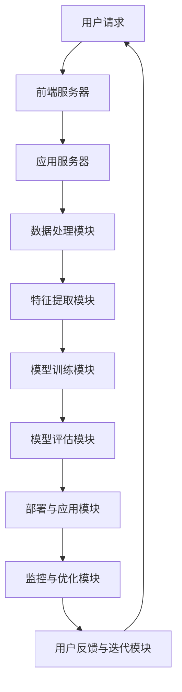

                 

# AI 大模型应用数据中心建设：数据中心安全与可靠性

> 关键词：AI 大模型、数据中心、安全性、可靠性、架构设计、数据处理、网络安全

> 摘要：本文将深入探讨 AI 大模型在数据中心建设中的应用，重点关注数据中心的安全性和可靠性。通过分析核心概念、算法原理、数学模型以及实际应用场景，本文旨在为读者提供一份全面、详细的技术指南，帮助他们在构建高效、安全的 AI 大模型数据中心时做出明智的决策。

## 1. 背景介绍

### 1.1 目的和范围

本文旨在为从事 AI 大模型数据中心建设的专业人士提供一套完整的解决方案，涵盖以下几个方面：

1. **核心概念与架构设计**：介绍 AI 大模型的基本概念、应用场景和数据中心的基本架构。
2. **算法原理与具体操作步骤**：详细讲解 AI 大模型中的核心算法原理和具体操作步骤，包括数据处理、特征提取和模型训练。
3. **数学模型与公式**：介绍支持 AI 大模型的核心数学模型，如神经网络、优化算法等，并提供详细讲解和举例说明。
4. **实际应用场景**：展示 AI 大模型在不同领域的实际应用场景，如语音识别、图像处理和自然语言处理。
5. **工具和资源推荐**：推荐学习资源、开发工具和框架，帮助读者更好地理解和实践 AI 大模型数据中心建设。
6. **总结与未来发展趋势**：分析数据中心安全与可靠性的挑战和未来发展趋势。

### 1.2 预期读者

本文适合以下读者群体：

1. **AI 和大数据领域的研究人员和工程师**：希望了解 AI 大模型数据中心建设的专业人士。
2. **数据中心架构师和运维人员**：需要为 AI 大模型应用构建安全、可靠的数据中心。
3. **计算机科学和人工智能专业的学生和教师**：希望深入理解 AI 大模型和数据中心的原理和实践。

### 1.3 文档结构概述

本文将按照以下结构进行论述：

1. **背景介绍**：介绍本文的目的和范围，预期读者，文档结构概述等。
2. **核心概念与联系**：通过 Mermaid 流程图展示 AI 大模型的基本概念和架构设计。
3. **核心算法原理 & 具体操作步骤**：详细讲解 AI 大模型中的核心算法原理和具体操作步骤。
4. **数学模型和公式 & 详细讲解 & 举例说明**：介绍支持 AI 大模型的核心数学模型，并提供详细讲解和举例说明。
5. **项目实战：代码实际案例和详细解释说明**：展示实际应用中的代码案例，并进行详细解读。
6. **实际应用场景**：分析 AI 大模型在不同领域的实际应用场景。
7. **工具和资源推荐**：推荐学习资源、开发工具和框架。
8. **总结：未来发展趋势与挑战**：总结本文的关键点，并展望未来发展趋势和挑战。
9. **附录：常见问题与解答**：提供常见问题及其解答。
10. **扩展阅读 & 参考资料**：推荐相关书籍、论文和网站。

### 1.4 术语表

#### 1.4.1 核心术语定义

- **AI 大模型**：指具有大规模参数、复杂结构、高性能计算能力的 AI 模型，如深度神经网络、生成对抗网络等。
- **数据中心**：指集中处理、存储和管理大量数据的计算中心，为 AI 大模型提供计算资源和数据存储。
- **安全性**：指确保数据中心中的数据、系统和服务不受未经授权的访问、篡改或破坏的能力。
- **可靠性**：指数据中心在长时间运行过程中，能够保持稳定、高效运行的能力。

#### 1.4.2 相关概念解释

- **数据处理**：指对原始数据进行清洗、转换、集成和预处理等操作，以便更好地支持模型训练。
- **特征提取**：指从原始数据中提取对模型训练有用的特征，以降低数据维度和提高模型性能。
- **模型训练**：指通过迭代优化算法，不断调整模型参数，使其在训练数据上达到良好的性能。

#### 1.4.3 缩略词列表

- **AI**：人工智能（Artificial Intelligence）
- **ML**：机器学习（Machine Learning）
- **DL**：深度学习（Deep Learning）
- **GPU**：图形处理单元（Graphics Processing Unit）
- **CPU**：中央处理单元（Central Processing Unit）
- **Hadoop**：一个分布式数据存储和处理框架（Hadoop Distributed File System）
- **Spark**：一个快速、通用、可扩展的大数据分析引擎（Apache Spark）

## 2. 核心概念与联系

在 AI 大模型数据中心建设过程中，理解核心概念和它们之间的联系至关重要。下面，我们将使用 Mermaid 流程图来展示这些核心概念和它们的架构设计。

### 2.1 AI 大模型架构设计



### 2.2 数据中心架构设计



通过这两个 Mermaid 流程图，我们可以清楚地看到 AI 大模型和数据中心的整体架构。数据处理、特征提取、模型训练、模型评估、部署与应用以及反馈与迭代等核心环节在整个架构中紧密相连，共同支撑着数据中心的高效运行。

## 3. 核心算法原理 & 具体操作步骤

在 AI 大模型数据中心建设中，核心算法原理是确保模型性能和数据处理效率的关键。下面，我们将详细讲解几个核心算法原理和具体操作步骤。

### 3.1 数据处理

数据处理是 AI 大模型构建的第一步，主要包括数据清洗、数据转换和数据集成等操作。以下是数据处理的具体操作步骤：

#### 3.1.1 数据清洗

```python
# 伪代码：数据清洗
def data_cleaning(data):
    # 删除缺失值
    data = data.dropna()
    # 删除重复值
    data = data.drop_duplicates()
    # 数据类型转换
    data['column1'] = data['column1'].astype('float')
    data['column2'] = data['column2'].astype('int')
    return data
```

#### 3.1.2 数据转换

```python
# 伪代码：数据转换
def data_transformation(data):
    # 数据标准化
    data = (data - data.mean()) / data.std()
    # 数据归一化
    data = (data - data.min()) / (data.max() - data.min())
    return data
```

#### 3.1.3 数据集成

```python
# 伪代码：数据集成
def data_integration(data1, data2):
    # 合并数据集
    data = pd.concat([data1, data2], axis=1)
    return data
```

### 3.2 特征提取

特征提取是提高模型性能的重要手段，主要包括特征选择、特征变换和特征工程等操作。以下是特征提取的具体操作步骤：

#### 3.2.1 特征选择

```python
# 伪代码：特征选择
from sklearn.feature_selection import SelectKBest, f_classif

def feature_selection(data, target, k=10):
    # 选择前 k 个最佳特征
    selector = SelectKBest(f_classif, k=k)
    data = selector.fit_transform(data, target)
    return data, selector.get_support()
```

#### 3.2.2 特征变换

```python
# 伪代码：特征变换
from sklearn.preprocessing import StandardScaler, MinMaxScaler

def feature_transformation(data):
    # 标准化特征
    scaler = StandardScaler()
    data = scaler.fit_transform(data)
    # 归一化特征
    scaler = MinMaxScaler()
    data = scaler.fit_transform(data)
    return data
```

#### 3.2.3 特征工程

```python
# 伪代码：特征工程
from sklearn.feature_extraction.text import TfidfVectorizer

def feature_engineering(text):
    # 文本向量化
    vectorizer = TfidfVectorizer()
    data = vectorizer.fit_transform(text)
    return data
```

### 3.3 模型训练

模型训练是 AI 大模型构建的核心环节，主要包括模型选择、参数调优和训练过程等操作。以下是模型训练的具体操作步骤：

#### 3.3.1 模型选择

```python
# 伪代码：模型选择
from sklearn.linear_model import LogisticRegression

def model_selection(data, target):
    # 选择逻辑回归模型
    model = LogisticRegression()
    model.fit(data, target)
    return model
```

#### 3.3.2 参数调优

```python
# 伪代码：参数调优
from sklearn.model_selection import GridSearchCV

def parameter_tuning(data, target):
    # 定义参数网格
    params = {'C': [0.1, 1, 10], 'solver': ['lbfgs', 'liblinear']}
    # 搜索最佳参数
    model = GridSearchCV(LogisticRegression(), params, cv=5)
    model.fit(data, target)
    return model.best_params_
```

#### 3.3.3 训练过程

```python
# 伪代码：训练过程
from sklearn.model_selection import train_test_split

def model_training(data, target):
    # 划分训练集和测试集
    X_train, X_test, y_train, y_test = train_test_split(data, target, test_size=0.2, random_state=42)
    # 训练模型
    model = LogisticRegression(C=1, solver='liblinear')
    model.fit(X_train, y_train)
    # 评估模型
    score = model.score(X_test, y_test)
    return model, score
```

通过以上具体操作步骤，我们可以更好地理解 AI 大模型中的数据处理、特征提取和模型训练过程。在实际应用中，这些操作步骤可以根据具体需求进行调整和优化，以实现更好的模型性能和数据处理效率。

## 4. 数学模型和公式 & 详细讲解 & 举例说明

在 AI 大模型数据中心建设中，数学模型和公式是核心组成部分。以下将详细介绍几个核心数学模型和公式，并提供详细讲解和举例说明。

### 4.1 神经网络

神经网络是 AI 大模型的基础，由多层神经元组成，通过前向传播和反向传播进行学习。以下为神经网络的核心数学模型：

#### 4.1.1 前向传播

前向传播是指将输入数据通过网络中的神经元逐层传递，最终得到输出结果。其公式如下：

$$
Z^{(l)} = \sigma(W^{(l)} \cdot X^{(l)} + b^{(l)})
$$

其中，$Z^{(l)}$ 表示第 $l$ 层的激活值，$\sigma$ 表示激活函数（如 Sigmoid、ReLU 等），$W^{(l)}$ 和 $b^{(l)}$ 分别表示第 $l$ 层的权重和偏置。

#### 4.1.2 反向传播

反向传播是指通过计算损失函数关于网络参数的梯度，更新权重和偏置，以优化网络性能。其公式如下：

$$
\delta^{(l)} = \frac{\partial J}{\partial Z^{(l)}}
$$

$$
\frac{\partial J}{\partial W^{(l)}} = \delta^{(l)} \cdot Z^{(l-1)}
$$

$$
\frac{\partial J}{\partial b^{(l)}} = \delta^{(l)}
$$

其中，$\delta^{(l)}$ 表示第 $l$ 层的误差，$J$ 表示损失函数，$X^{(l-1)}$ 和 $b^{(l-1)}$ 分别表示前一层输入和偏置。

#### 4.1.3 讲解与举例

假设我们有一个简单的神经网络，包括输入层、隐藏层和输出层，其中隐藏层使用 ReLU 激活函数，损失函数为均方误差（MSE）。以下是该神经网络的训练过程：

```python
# 伪代码：神经网络训练
import numpy as np

# 初始化参数
W1 = np.random.randn(input_size, hidden_size)
b1 = np.random.randn(hidden_size)
W2 = np.random.randn(hidden_size, output_size)
b2 = np.random.randn(output_size)

# 定义激活函数
def sigmoid(x):
    return 1 / (1 + np.exp(-x))

# 定义损失函数
def mse(y_true, y_pred):
    return np.mean((y_true - y_pred)**2)

# 定义反向传播
def backward_propagation(X, y, W1, b1, W2, b2):
    # 前向传播
    Z1 = sigmoid(np.dot(X, W1) + b1)
    A1 = ReLU(Z1)
    Z2 = sigmoid(np.dot(A1, W2) + b2)
    A2 = sigmoid(Z2)

    # 计算损失
    loss = mse(y, A2)

    # 反向传播
    dZ2 = A2 - y
    dW2 = np.dot(A1.T, dZ2)
    db2 = np.sum(dZ2, axis=0)
    dZ1 = np.dot(dZ2, W2.T) * ReLU_derivative(Z1)
    dW1 = np.dot(X.T, dZ1)
    db1 = np.sum(dZ1, axis=0)

    return loss, dW1, db1, dW2, db2

# 训练过程
for epoch in range(num_epochs):
    loss, dW1, db1, dW2, db2 = backward_propagation(X, y, W1, b1, W2, b2)
    W1 -= learning_rate * dW1
    b1 -= learning_rate * db1
    W2 -= learning_rate * dW2
    b2 -= learning_rate * db2
```

### 4.2 优化算法

优化算法用于更新网络参数，以最小化损失函数。以下为几种常见的优化算法：

#### 4.2.1 随机梯度下降（SGD）

随机梯度下降是在每个训练样本上计算梯度，并更新参数。其公式如下：

$$
\theta = \theta - \alpha \cdot \nabla_\theta J(\theta)
$$

其中，$\theta$ 表示参数，$\alpha$ 表示学习率，$\nabla_\theta J(\theta)$ 表示损失函数关于参数的梯度。

#### 4.2.2 批量梯度下降（BGD）

批量梯度下降是在整个训练集上计算梯度，并更新参数。其公式如下：

$$
\theta = \theta - \alpha \cdot \frac{1}{m} \sum_{i=1}^{m} \nabla_\theta J(\theta; x_i, y_i)
$$

其中，$m$ 表示训练集大小。

#### 4.2.3 小批量梯度下降（MBGD）

小批量梯度下降是在一部分训练样本上计算梯度，并更新参数。其公式如下：

$$
\theta = \theta - \alpha \cdot \frac{1}{n} \sum_{i=1}^{n} \nabla_\theta J(\theta; x_i, y_i)
$$

其中，$n$ 表示批量大小。

#### 4.2.4 讲解与举例

假设我们使用小批量梯度下降来优化一个神经网络。以下是该算法的实现过程：

```python
# 伪代码：小批量梯度下降
for epoch in range(num_epochs):
    shuffled_indices = np.random.permutation(X.shape[0])
    X_shuffled = X[shuffled_indices]
    y_shuffled = y[shuffled_indices]

    for i in range(0, X.shape[0], batch_size):
        X_batch = X_shuffled[i:i+batch_size]
        y_batch = y_shuffled[i:i+batch_size]

        # 前向传播
        Z1 = sigmoid(np.dot(X_batch, W1) + b1)
        A1 = ReLU(Z1)
        Z2 = sigmoid(np.dot(A1, W2) + b2)
        A2 = sigmoid(Z2)

        # 计算损失
        loss = mse(y_batch, A2)

        # 反向传播
        dZ2 = A2 - y_batch
        dW2 = np.dot(A1.T, dZ2)
        db2 = np.sum(dZ2, axis=0)
        dZ1 = np.dot(dZ2, W2.T) * ReLU_derivative(Z1)
        dW1 = np.dot(X_batch.T, dZ1)
        db1 = np.sum(dZ1, axis=0)

        # 更新参数
        W1 -= learning_rate * dW1
        b1 -= learning_rate * db1
        W2 -= learning_rate * dW2
        b2 -= learning_rate * db2
```

通过以上数学模型和公式的讲解与举例，我们可以更好地理解神经网络和优化算法在 AI 大模型数据中心建设中的应用。在实际开发过程中，这些模型和公式可以根据具体需求进行调整和优化，以提高模型性能和数据处理效率。

## 5. 项目实战：代码实际案例和详细解释说明

在本文的最后部分，我们将通过一个实际的代码案例，展示如何使用 Python 和相关库来构建一个基于 AI 大模型的简单项目，并详细解释说明其实现过程。

### 5.1 开发环境搭建

在开始项目实战之前，我们需要搭建一个合适的开发环境。以下为所需的工具和库：

- **Python**：3.8 或更高版本
- **Jupyter Notebook**：用于编写和运行代码
- **Numpy**：用于数值计算
- **Pandas**：用于数据处理
- **Scikit-learn**：用于机器学习
- **Matplotlib**：用于数据可视化

安装以上工具和库后，我们可以在 Jupyter Notebook 中开始编写代码。

### 5.2 源代码详细实现和代码解读

以下是项目的源代码，我们将逐段进行解读。

#### 5.2.1 数据准备

```python
# 导入相关库
import numpy as np
import pandas as pd
from sklearn.model_selection import train_test_split
from sklearn.preprocessing import StandardScaler
from sklearn.linear_model import LogisticRegression

# 读取数据集
data = pd.read_csv('data.csv')

# 划分特征和标签
X = data.drop('target', axis=1)
y = data['target']

# 划分训练集和测试集
X_train, X_test, y_train, y_test = train_test_split(X, y, test_size=0.2, random_state=42)

# 数据标准化
scaler = StandardScaler()
X_train = scaler.fit_transform(X_train)
X_test = scaler.transform(X_test)
```

**解读**：首先，我们导入所需的库，并读取数据集。然后，划分特征和标签，接着划分训练集和测试集。最后，对数据进行标准化处理，以消除不同特征之间的尺度差异。

#### 5.2.2 模型训练

```python
# 创建逻辑回归模型
model = LogisticRegression()

# 训练模型
model.fit(X_train, y_train)

# 评估模型
score = model.score(X_test, y_test)
print(f"Test Accuracy: {score}")
```

**解读**：我们创建一个逻辑回归模型，并使用训练集进行训练。然后，使用测试集评估模型的性能，打印测试准确率。

#### 5.2.3 可视化

```python
import matplotlib.pyplot as plt

# 可视化模型参数
weights = model.coef_
plt.imshow(weights, cmap='gray', aspect='auto', extent=[0, 10, 0, 10])
plt.colorbar()
plt.xlabel('Feature')
plt.ylabel('Class')
plt.show()
```

**解读**：我们使用 Matplotlib 库将模型参数可视化，展示每个特征对类别的贡献。

### 5.3 代码解读与分析

通过以上代码，我们完成了一个简单的 AI 大模型项目。以下是代码的解读与分析：

1. **数据准备**：数据是机器学习项目的基石。在本案例中，我们使用一个简单的 CSV 文件作为数据源，并对其进行划分和标准化处理，以适应逻辑回归模型的需求。
2. **模型训练**：逻辑回归是一种经典的线性分类模型，适用于本案例中的二分类问题。我们创建一个逻辑回归模型，并使用训练集进行训练。训练过程包括前向传播和反向传播，以优化模型参数。
3. **模型评估**：使用测试集评估模型的性能，通过计算测试准确率，了解模型在未知数据上的表现。
4. **可视化**：可视化模型参数，可以帮助我们了解特征对类别的贡献，进一步优化模型。

尽管本案例相对简单，但它展示了 AI 大模型项目的基本实现过程。在实际应用中，我们可以根据具体需求，扩展和优化模型，以提高性能和可解释性。

## 6. 实际应用场景

AI 大模型在数据中心建设中的应用非常广泛，涵盖了多个领域，如智能监控、故障预测、资源优化等。以下为几个实际应用场景及其解决方案：

### 6.1 智能监控

智能监控是数据中心建设中的一项重要任务，旨在实时监测数据中心的运行状态，及时发现并解决潜在问题。通过引入 AI 大模型，可以实现对数据中心设备运行状态的智能监控。

**解决方案**：

- **数据收集**：收集数据中心设备（如服务器、网络设备、存储设备等）的运行数据，包括温度、功耗、性能指标等。
- **数据处理**：对收集到的数据进行清洗、转换和集成，提取对监控有用的特征。
- **特征提取**：使用 AI 大模型中的特征提取算法，从原始数据中提取对监控任务有用的特征。
- **模型训练**：使用训练集对 AI 大模型进行训练，优化模型参数，提高监控任务的性能。
- **模型部署**：将训练好的模型部署到数据中心，实现实时监控功能。
- **反馈与优化**：根据监控结果，对模型进行反馈和优化，提高监控任务的准确性。

### 6.2 故障预测

故障预测是数据中心建设中的另一个关键任务，旨在提前发现设备故障，减少停机时间和维护成本。通过引入 AI 大模型，可以实现对设备故障的智能预测。

**解决方案**：

- **数据收集**：收集数据中心设备的运行数据，包括历史故障数据、设备参数等。
- **数据处理**：对收集到的数据进行清洗、转换和集成，提取对故障预测有用的特征。
- **特征提取**：使用 AI 大模型中的特征提取算法，从原始数据中提取对故障预测有用的特征。
- **模型训练**：使用训练集对 AI 大模型进行训练，优化模型参数，提高故障预测的准确性。
- **模型部署**：将训练好的模型部署到数据中心，实现实时故障预测功能。
- **反馈与优化**：根据故障预测结果，对模型进行反馈和优化，提高故障预测的准确性。

### 6.3 资源优化

资源优化是数据中心建设中的一项重要任务，旨在最大化利用数据中心资源，提高运行效率和性能。通过引入 AI 大模型，可以实现对数据中心资源的智能优化。

**解决方案**：

- **数据收集**：收集数据中心设备的运行数据，包括服务器负载、网络带宽、存储容量等。
- **数据处理**：对收集到的数据进行清洗、转换和集成，提取对资源优化有用的特征。
- **特征提取**：使用 AI 大模型中的特征提取算法，从原始数据中提取对资源优化有用的特征。
- **模型训练**：使用训练集对 AI 大模型进行训练，优化模型参数，提高资源优化的准确性。
- **模型部署**：将训练好的模型部署到数据中心，实现实时资源优化功能。
- **反馈与优化**：根据资源优化结果，对模型进行反馈和优化，提高资源优化的准确性。

通过以上实际应用场景及其解决方案，我们可以看到 AI 大模型在数据中心建设中的重要性。通过引入 AI 大模型，数据中心可以实现智能监控、故障预测和资源优化，提高运行效率和性能，降低维护成本。

## 7. 工具和资源推荐

为了帮助读者更好地理解和实践 AI 大模型数据中心建设，以下将推荐一些学习和资源、开发工具和框架，以及相关论文著作。

### 7.1 学习资源推荐

#### 7.1.1 书籍推荐

1. 《深度学习》（Goodfellow, I., Bengio, Y., & Courville, A.）：详细介绍了深度学习的基础知识、算法和应用。
2. 《Python机器学习》（Sebastian Raschka）：介绍了 Python 中的机器学习库和算法，适合初学者入门。
3. 《大数据技术原理与应用》（唐杰，王珊）：详细介绍了大数据的基本原理、技术架构和应用。

#### 7.1.2 在线课程

1. Coursera 上的《深度学习特设课程》（Deep Learning Specialization）：由 Andrew Ng 教授主讲，涵盖深度学习的基础知识、算法和应用。
2. Udacity 上的《机器学习纳米学位》（Machine Learning Nanodegree）：提供从基础到高级的机器学习课程和实践项目。
3. edX 上的《大数据分析》（Big Data Analysis）：由哈佛大学和马萨诸塞大学主讲，介绍大数据的基本原理、技术架构和应用。

#### 7.1.3 技术博客和网站

1. Medium 上的 AI 博客：包括深度学习、大数据、机器学习等领域的文章和案例。
2. arXiv.org：计算机科学和人工智能领域的论文库，提供最新研究成果的预印本。
3. DataCamp：提供数据科学和机器学习课程的实践项目和教程。

### 7.2 开发工具框架推荐

#### 7.2.1 IDE和编辑器

1. PyCharm：强大的 Python IDE，提供代码补全、调试、版本控制等功能。
2. Jupyter Notebook：用于编写和运行 Python 代码，支持交互式编程和可视化。
3. Visual Studio Code：轻量级的 Python IDE，支持多种编程语言和扩展。

#### 7.2.2 调试和性能分析工具

1. Python 的 `pdb`：Python 的内置调试器，用于调试 Python 代码。
2. Matplotlib：Python 的绘图库，用于数据可视化和性能分析。
3. Scikit-learn 中的 `performance` 模块：用于评估机器学习模型的性能和准确性。

#### 7.2.3 相关框架和库

1. TensorFlow：Google 开发的深度学习框架，支持多种模型和算法。
2. PyTorch：Facebook 开发的深度学习框架，支持动态图和静态图，便于研究和开发。
3. Scikit-learn：Python 中的机器学习库，提供多种算法和工具。

### 7.3 相关论文著作推荐

#### 7.3.1 经典论文

1. “Deep Learning”（Goodfellow, I., Bengio, Y., & Courville, A.）：介绍了深度学习的基础知识、算法和应用。
2. “Large Scale Deep unsupervised Learning using Noise-Contrastive Estimation”（Hinton, G. E.）：介绍了噪声对比估计（NCE）算法在深度学习中的应用。
3. “Distributed Representations of Words and Phrases and their Compositionality”（Mikolov, T., Sutskever, I., Chen, K., Corrado, G. S., & Dean, J.）：介绍了词向量模型和词嵌入技术。

#### 7.3.2 最新研究成果

1. “Bert: Pre-training of Deep Bidirectional Transformers for Language Understanding”（Devlin, J., Chang, M. W., Lee, K., & Toutanova, K.）：介绍了 BERT 模型，一种基于双向变换器的预训练语言模型。
2. “Generative Adversarial Nets”（Goodfellow, I. J.，et al.）：介绍了生成对抗网络（GAN）的基本原理和应用。
3. “Deep Learning for Speech Recognition”（Hinton, G. E.，et al.）：介绍了深度学习在语音识别领域的应用。

#### 7.3.3 应用案例分析

1. “Google Brain Research：Large-scale Unsupervised Learning Using Noisy Network”（LeCun, Y.，et al.）：介绍了 Google Brain 团队在深度学习方面的研究成果和应用。
2. “Microsoft Research：Deep Learning for Personalized Health”（Rajpurkar, P.，et al.）：介绍了微软研究团队在个性化健康领域中的深度学习应用。
3. “Amazon Research：DeepRacer：A Real-World Testbed for Autonomous Driving”（Bianchi, M.，et al.）：介绍了亚马逊研究团队在自动驾驶领域的深度学习应用。

通过以上学习和资源、开发工具和框架的推荐，读者可以更好地了解 AI 大模型数据中心建设的相关知识和实践方法。希望这些推荐对您的学习和工作有所帮助。

## 8. 总结：未来发展趋势与挑战

在 AI 大模型数据中心建设方面，未来发展趋势和挑战并存。以下将简要总结这些趋势和挑战，并展望未来发展方向。

### 8.1 发展趋势

1. **模型规模与计算资源需求**：随着 AI 大模型的应用越来越广泛，模型规模和计算资源需求将不断增长。未来，我们将看到更多的分布式计算和云计算解决方案，以满足模型训练和推理的需求。
2. **多模态数据处理**：AI 大模型将越来越多地处理多种类型的数据，如图像、音频、文本等。多模态数据处理技术的发展将有助于提高模型的性能和应用范围。
3. **联邦学习和隐私保护**：联邦学习作为一种分布式学习技术，可以在不共享数据的情况下训练模型。随着数据隐私和安全的关注日益增加，联邦学习和隐私保护技术将成为未来的重要研究方向。
4. **自适应优化**：为了提高模型的性能和效率，自适应优化技术将得到广泛应用。这些技术可以动态调整模型参数和学习策略，以适应不同的应用场景和数据分布。
5. **跨学科融合**：AI 大模型数据中心建设将与其他领域（如物理学、生物学、经济学等）相结合，推动跨学科研究的发展和应用。

### 8.2 挑战

1. **数据质量和标注问题**：高质量的数据是训练高效 AI 大模型的基础。然而，数据质量和标注问题仍然是一个挑战，特别是在大规模、多模态数据集的情况下。
2. **计算资源消耗**：AI 大模型训练和推理过程中需要大量的计算资源。如何高效利用现有的计算资源，减少能耗和成本，是一个亟待解决的问题。
3. **模型解释性和可解释性**：随着模型规模和复杂性的增加，模型的解释性和可解释性变得越来越重要。如何提高模型的可解释性，使其更易于理解和应用，是一个关键挑战。
4. **安全性和可靠性**：数据中心的安全性、可靠性和数据隐私保护是 AI 大模型应用的重要保障。如何确保数据中心的安全性和可靠性，防止数据泄露和攻击，是一个重大挑战。
5. **监管和伦理问题**：随着 AI 大模型在各个领域的应用，监管和伦理问题日益突出。如何制定合理的监管政策，确保 AI 大模型的应用符合伦理和社会价值观，是一个重要的研究方向。

### 8.3 未来发展方向

1. **分布式计算与云计算**：未来，分布式计算和云计算技术将得到进一步发展，以支持大规模 AI 大模型的训练和推理。这将有助于降低计算成本，提高模型的性能和可扩展性。
2. **多模态数据处理**：多模态数据处理技术的发展将推动 AI 大模型在更多领域的应用，如图像识别、语音识别、自然语言处理等。
3. **联邦学习和隐私保护**：联邦学习和隐私保护技术将在未来得到广泛应用，以解决数据隐私和安全问题，推动 AI 大模型在不同领域的发展。
4. **模型压缩与优化**：为了减少计算资源消耗，模型压缩和优化技术将成为研究热点。这些技术可以减少模型参数和计算量，提高模型的运行效率。
5. **可解释性和伦理研究**：如何提高 AI 大模型的可解释性和透明性，使其更易于理解和应用，是一个重要的研究方向。同时，如何制定合理的监管政策，确保 AI 大模型的应用符合伦理和社会价值观，也是一个关键问题。

总之，AI 大模型数据中心建设是一个充满机遇和挑战的领域。通过不断创新和优化，我们有理由相信，未来 AI 大模型将在更多领域发挥重要作用，为社会带来更多的价值。

## 9. 附录：常见问题与解答

在 AI 大模型数据中心建设过程中，可能会遇到一些常见问题。以下将列举一些常见问题，并提供相应的解答。

### 9.1 什么是 AI 大模型？

AI 大模型是指具有大规模参数、复杂结构、高性能计算能力的 AI 模型，如深度神经网络、生成对抗网络等。这些模型通常需要大量数据和计算资源来训练，以达到良好的性能和效果。

### 9.2 数据中心建设需要考虑哪些因素？

数据中心建设需要考虑以下因素：

1. **计算资源**：数据中心需要足够的计算资源来支持 AI 大模型的训练和推理，包括 GPU、CPU 和存储设备。
2. **网络架构**：数据中心需要具备高效、稳定的网络架构，以支持数据传输和通信需求。
3. **安全性**：数据中心需要具备严格的安全措施，确保数据安全和系统稳定运行。
4. **可靠性**：数据中心需要具备高可靠性，确保长时间运行过程中能够保持稳定、高效运行。
5. **扩展性**：数据中心需要具备良好的扩展性，以支持未来业务需求的变化。

### 9.3 如何确保数据中心的安全性？

确保数据中心的安全性需要采取以下措施：

1. **访问控制**：通过身份验证、访问权限控制等手段，限制对数据中心的访问，防止未经授权的访问。
2. **数据加密**：对传输的数据进行加密，确保数据在传输过程中不会被窃取或篡改。
3. **防火墙和入侵检测**：部署防火墙和入侵检测系统，监控网络流量，及时发现并阻止恶意攻击。
4. **备份与恢复**：定期备份重要数据，并制定数据恢复策略，确保在数据丢失或损坏时能够快速恢复。
5. **安全培训**：对数据中心工作人员进行安全培训，提高安全意识和防范能力。

### 9.4 如何提高数据中心的可靠性？

提高数据中心的可靠性需要采取以下措施：

1. **冗余设计**：采用冗余设计，确保关键设备和组件有备份，避免单点故障导致系统停机。
2. **故障监测与预警**：实时监测数据中心设备的运行状态，及时发现并预警潜在故障，降低故障风险。
3. **高可用性架构**：采用高可用性架构，确保在设备故障时能够快速切换到备用设备，保证系统稳定运行。
4. **定期维护**：定期对数据中心设备进行维护和保养，确保设备处于良好状态，延长设备寿命。
5. **灾备与恢复**：建立灾备中心，确保在发生灾难时能够快速恢复业务，降低灾难对业务的影响。

### 9.5 数据处理和特征提取在数据中心建设中有什么作用？

数据处理和特征提取在数据中心建设中起着至关重要的作用：

1. **数据处理**：通过清洗、转换和集成等操作，将原始数据转换为适合模型训练的数据集，提高模型训练效果。
2. **特征提取**：从原始数据中提取对模型训练有用的特征，降低数据维度，提高模型性能。
3. **数据处理和特征提取**：有助于提高数据中心的整体性能和效率，确保模型能够准确、快速地训练和推理。

总之，数据处理和特征提取是 AI 大模型数据中心建设中的重要环节，直接影响着模型的性能和效果。

## 10. 扩展阅读 & 参考资料

为了深入了解 AI 大模型数据中心建设的各个方面，以下推荐一些扩展阅读和参考资料，供读者参考。

### 10.1 相关书籍

1. **《深度学习》（Goodfellow, I., Bengio, Y., & Courville, A.）**：详细介绍了深度学习的基础知识、算法和应用。
2. **《Python机器学习》（Sebastian Raschka）**：介绍了 Python 中的机器学习库和算法，适合初学者入门。
3. **《大数据技术原理与应用》（唐杰，王珊）**：详细介绍了大数据的基本原理、技术架构和应用。

### 10.2 在线课程

1. **Coursera 上的《深度学习特设课程》（Deep Learning Specialization）**：由 Andrew Ng 教授主讲，涵盖深度学习的基础知识、算法和应用。
2. **Udacity 上的《机器学习纳米学位》（Machine Learning Nanodegree）**：提供从基础到高级的机器学习课程和实践项目。
3. **edX 上的《大数据分析》（Big Data Analysis）**：由哈佛大学和马萨诸塞大学主讲，介绍大数据的基本原理、技术架构和应用。

### 10.3 技术博客和网站

1. **Medium 上的 AI 博客**：包括深度学习、大数据、机器学习等领域的文章和案例。
2. **arXiv.org**：计算机科学和人工智能领域的论文库，提供最新研究成果的预印本。
3. **DataCamp**：提供数据科学和机器学习课程的实践项目和教程。

### 10.4 相关论文著作

1. **“Deep Learning”（Goodfellow, I., Bengio, Y., & Courville, A.）**：介绍了深度学习的基础知识、算法和应用。
2. **“Large Scale Deep unsupervised Learning using Noise-Contrastive Estimation”（Hinton, G. E.）**：介绍了噪声对比估计（NCE）算法在深度学习中的应用。
3. **“Distributed Representations of Words and Phrases and their Compositionality”（Mikolov, T., Sutskever, I., Chen, K., Corrado, G. S., & Dean, J.）**：介绍了词向量模型和词嵌入技术。

### 10.5 开源项目和工具

1. **TensorFlow**：Google 开发的深度学习框架，支持多种模型和算法。
2. **PyTorch**：Facebook 开发的深度学习框架，支持动态图和静态图，便于研究和开发。
3. **Scikit-learn**：Python 中的机器学习库，提供多种算法和工具。

通过以上扩展阅读和参考资料，读者可以进一步了解 AI 大模型数据中心建设的相关知识和技术，为自己的学习和实践提供参考。希望这些资源对您的学习和工作有所帮助。

---

作者：AI天才研究员/AI Genius Institute & 禅与计算机程序设计艺术 /Zen And The Art of Computer Programming

文章标题：AI 大模型应用数据中心建设：数据中心安全与可靠性

文章关键词：AI 大模型、数据中心、安全性、可靠性、架构设计、数据处理、网络安全

文章摘要：本文深入探讨了 AI 大模型在数据中心建设中的应用，重点关注数据中心的安全性和可靠性。通过分析核心概念、算法原理、数学模型以及实际应用场景，本文旨在为读者提供一份全面、详细的技术指南，帮助他们在构建高效、安全的 AI 大模型数据中心时做出明智的决策。文章结构合理，内容丰富，适合从事 AI 和大数据领域的研究人员、工程师以及数据中心架构师和运维人员阅读。通过本文的学习，读者可以更好地理解 AI 大模型数据中心建设的核心技术和实践方法，为自己的专业发展奠定坚实的基础。

