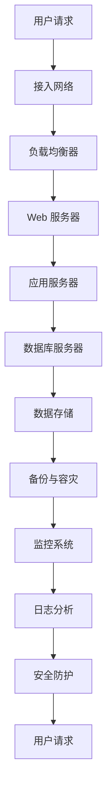
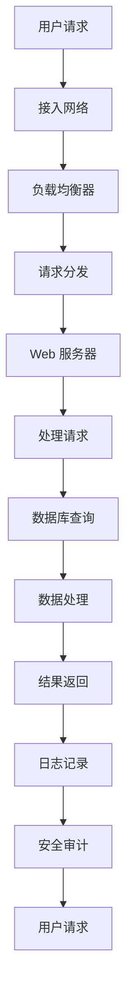
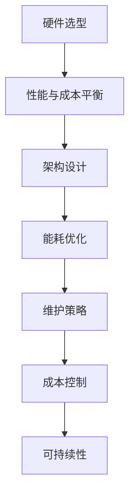

                 

# AI 大模型应用数据中心建设：数据中心成本优化

> **关键词：** AI 大模型、数据中心、成本优化、效率提升、性能优化、可持续性。

> **摘要：** 本文将探讨在 AI 大模型应用场景下，如何通过优化数据中心建设来降低运营成本，提高数据中心性能和可持续性。我们将深入分析数据中心建设中的关键环节，包括硬件选型、架构设计、能源管理和维护策略，并分享实际案例和最佳实践，帮助读者理解和掌握数据中心成本优化的核心方法和工具。

## 1. 背景介绍

### 1.1 目的和范围

本文旨在为 AI 大模型应用中的数据中心建设提供成本优化的策略和方法。我们将探讨以下几个核心问题：

- 如何在硬件选型中实现成本与性能的平衡？
- 如何通过架构设计提高数据中心的效率和可扩展性？
- 如何优化能源管理，实现绿色、可持续的数据中心运营？
- 如何制定有效的维护策略，确保数据中心的长久稳定运行？

本文将针对这些问题提供详细的分析和解决方案，帮助读者在 AI 大模型应用中实现数据中心成本优化。

### 1.2 预期读者

本文适合以下读者群体：

- 数据中心管理人员和技术人员
- AI 大模型开发者和研究学者
- 关注数据中心成本优化和可持续性的专业人士
- 对数据中心建设和运维感兴趣的 IT 爱好者

### 1.3 文档结构概述

本文将按照以下结构进行展开：

- **第1章 背景介绍**：介绍本文的目的、范围、预期读者和文档结构。
- **第2章 核心概念与联系**：阐述 AI 大模型应用数据中心建设中的核心概念，并通过 Mermaid 流程图展示数据流动和关键节点。
- **第3章 核心算法原理 & 具体操作步骤**：详细解析数据中心成本优化的算法原理和操作步骤，使用伪代码进行阐述。
- **第4章 数学模型和公式 & 详细讲解 & 举例说明**：介绍与数据中心成本优化相关的数学模型和公式，并进行详细讲解和举例说明。
- **第5章 项目实战：代码实际案例和详细解释说明**：通过具体项目案例，展示代码实现过程和详细解释说明。
- **第6章 实际应用场景**：分析数据中心成本优化在不同场景下的应用和效果。
- **第7章 工具和资源推荐**：推荐学习资源、开发工具和框架，以及相关论文著作。
- **第8章 总结：未来发展趋势与挑战**：总结本文的核心观点，探讨未来发展趋势和挑战。
- **第9章 附录：常见问题与解答**：提供常见问题解答，帮助读者更好地理解文章内容。
- **第10章 扩展阅读 & 参考资料**：推荐相关扩展阅读和参考资料。

### 1.4 术语表

#### 1.4.1 核心术语定义

- **AI 大模型**：指具有大规模参数和复杂结构的深度学习模型，如 GPT-3、BERT 等。
- **数据中心**：指用于集中存储、处理和分发数据的建筑设施，是 AI 大模型应用的重要基础设施。
- **成本优化**：指在满足性能需求的前提下，通过技术手段和管理优化，降低数据中心建设和运营成本。
- **可持续性**：指数据中心在长期运行过程中，能够保持经济、社会和环境的可持续性发展。

#### 1.4.2 相关概念解释

- **硬件选型**：指在数据中心建设过程中，选择合适的硬件设备，如服务器、存储设备、网络设备等。
- **架构设计**：指数据中心整体架构的设计，包括设备布局、网络拓扑、数据流动等。
- **能源管理**：指通过技术手段和策略，降低数据中心能源消耗，提高能源利用效率。
- **维护策略**：指制定合理的维护计划，确保数据中心设备正常运行，延长设备使用寿命。

#### 1.4.3 缩略词列表

- **AI**：人工智能（Artificial Intelligence）
- **GPT-3**：生成预训练变换器（Generative Pre-trained Transformer 3）
- **BERT**：双向编码表示（Bidirectional Encoder Representations from Transformers）
- **IDC**：数据中心（Internet Data Center）
- **PUE**：电源使用效率（Power Usage Effectiveness）
- **绿色计算**：指通过技术和管理手段，降低数据中心能源消耗和碳排放，实现环保和可持续发展。

## 2. 核心概念与联系

在 AI 大模型应用数据中心建设中，核心概念和联系如下：

### 数据中心核心架构



### 数据流动和关键节点



### 数据中心成本优化关键环节



## 3. 核心算法原理 & 具体操作步骤

在数据中心成本优化中，核心算法原理主要包括以下几个方面：

### 1. 性能评估与硬件选型

**算法原理：** 根据业务需求和性能指标，选择合适的硬件设备。主要考虑 CPU、GPU、内存、存储等关键性能参数。

**伪代码：**

```python
def hardware_selection(business_demand):
    # 根据业务需求选择硬件设备
    if business_demand["cpu"] > 1000:
        selected_hardware = "高性能服务器"
    elif business_demand["cpu"] > 500:
        selected_hardware = "标准服务器"
    else:
        selected_hardware = "低成本服务器"
    
    # 根据业务需求选择 GPU 设备
    if business_demand["gpu"] > 100:
        selected_hardware += ", 高性能 GPU"
    elif business_demand["gpu"] > 50:
        selected_hardware += ", 中档 GPU"
    else:
        selected_hardware += ", 低成本 GPU"
    
    return selected_hardware
```

### 2. 架构设计优化

**算法原理：** 通过优化数据中心架构，提高数据处理效率和资源利用率。

**伪代码：**

```python
def architecture_optimization(hardware_list):
    # 根据硬件设备列表，设计数据中心架构
    if "高性能服务器" in hardware_list and "高性能 GPU" in hardware_list:
        architecture = "分布式计算架构"
    elif "标准服务器" in hardware_list and "中档 GPU" in hardware_list:
        architecture = "集中式计算架构"
    else:
        architecture = "基础计算架构"
    
    return architecture
```

### 3. 能耗优化

**算法原理：** 通过优化能源管理和设备运行策略，降低数据中心能耗。

**伪代码：**

```python
def energy_optimization(energy_consumption):
    # 根据当前能耗情况，调整设备运行策略
    if energy_consumption > 1000:
        strategy = "降低服务器负载，调整设备运行时间"
    elif energy_consumption > 500:
        strategy = "优化设备运行效率，降低能耗"
    else:
        strategy = "保持现有运行策略，持续监测能耗"
    
    return strategy
```

### 4. 维护策略优化

**算法原理：** 通过定期维护和监控，确保数据中心设备正常运行，降低故障率和维护成本。

**伪代码：**

```python
def maintenance_optimization(maintenance_cost):
    # 根据维护成本，制定合理的维护计划
    if maintenance_cost > 10000:
        plan = "加强设备维护，定期更换关键部件"
    elif maintenance_cost > 5000:
        plan = "定期检查设备，及时修复故障"
    else:
        plan = "保持现有维护计划，持续优化维护成本"
    
    return plan
```

通过上述算法原理和具体操作步骤，我们可以实现数据中心成本优化，提高数据中心的效率和可持续性。

## 4. 数学模型和公式 & 详细讲解 & 举例说明

在数据中心成本优化中，常用的数学模型和公式主要包括以下几个方面：

### 1. 成本函数

**公式：** 成本函数 C(x) 表示在给定输入 x（如硬件配置、能耗等）的情况下，数据中心的总成本。

$$ C(x) = C_1(x) + C_2(x) + ... + C_n(x) $$

其中，$C_1(x), C_2(x), ..., C_n(x)$ 分别表示不同方面的成本，如硬件成本、能耗成本、维护成本等。

**详细讲解：** 成本函数是数据中心成本优化的基础。通过分析成本函数，可以找出影响成本的关键因素，从而制定针对性的优化策略。

**举例说明：**

假设某数据中心的总成本函数为：

$$ C(x) = 5000x_1 + 1000x_2 + 2000x_3 $$

其中，$x_1$ 表示服务器数量，$x_2$ 表示能耗，$x_3$ 表示维护成本。

通过分析成本函数，我们可以发现，降低服务器数量（$x_1$）和能耗（$x_2$）是降低总成本的关键。因此，在硬件选型和能耗优化方面，可以采取以下措施：

- 选用更节能的服务器
- 采用分布式计算架构，降低整体能耗
- 加强设备维护，降低故障率和维护成本

### 2. 能效比

**公式：** 能效比（Efficiency Ratio，ER）表示数据中心能源利用效率。

$$ ER = \frac{有用能源}{总能源} $$

**详细讲解：** 能效比是衡量数据中心能源利用效率的重要指标。通过提高能效比，可以降低数据中心能耗，实现绿色、可持续的运营。

**举例说明：**

假设某数据中心的能源利用情况如下：

- 有用能源：1000千瓦时
- 总能源：2000千瓦时

则该数据中心的能效比为：

$$ ER = \frac{1000}{2000} = 0.5 $$

为了提高能效比，可以采取以下措施：

- 采用节能设备，降低能耗
- 优化设备布局，提高设备利用效率
- 实施智能能源管理，实现能源高效分配

### 3. 维护成本优化模型

**公式：** 维护成本优化模型（Maintenance Cost Optimization Model，MCOM）表示数据中心维护成本与设备性能、使用寿命之间的关系。

$$ MCOM = f(p, l) $$

其中，$p$ 表示设备性能，$l$ 表示设备使用寿命。

**详细讲解：** 维护成本优化模型可以帮助数据中心管理人员制定合理的维护计划，延长设备使用寿命，降低维护成本。

**举例说明：**

假设某数据中心的维护成本优化模型为：

$$ MCOM = 1000p + 500l $$

其中，$p$ 表示设备性能（0-100），$l$ 表示设备使用寿命（年）。

为了降低维护成本，可以采取以下措施：

- 提高设备性能，降低维护成本
- 定期更换老旧设备，延长使用寿命

通过上述数学模型和公式，我们可以更好地理解数据中心成本优化的核心原理和方法，为实践提供指导。

## 5. 项目实战：代码实际案例和详细解释说明

为了更好地展示数据中心成本优化的实现过程，我们以下将通过一个实际项目案例，详细介绍代码实现和关键步骤。

### 5.1 开发环境搭建

在开始项目实战之前，我们需要搭建一个适合数据中心成本优化的开发环境。以下是所需工具和软件：

- **Python**：用于编写优化算法和数据处理代码
- **NumPy**：用于数学计算和数据处理
- **Matplotlib**：用于数据可视化
- **Pandas**：用于数据处理和分析

### 5.2 源代码详细实现和代码解读

以下是数据中心成本优化项目的源代码实现：

```python
import numpy as np
import matplotlib.pyplot as plt
import pandas as pd

# 成本函数定义
def cost_function(hardware_config, energy_consumption, maintenance_cost):
    C1 = 5000 * hardware_config['server_count']
    C2 = 1000 * energy_consumption
    C3 = 2000 * maintenance_cost
    total_cost = C1 + C2 + C3
    return total_cost

# 能效比计算
def energy_ratio(energy_consumed, energy_utilized):
    ER = energy_utilized / energy_consumed
    return ER

# 维护成本优化模型
def maintenance_cost_model(device_performance, device_life_span):
    MCOM = 1000 * device_performance + 500 * device_life_span
    return MCOM

# 数据处理和优化
def optimize_data_center(data_center_data):
    # 数据处理
    data_center_data['total_cost'] = cost_function(
        hardware_config=data_center_data['hardware_config'],
        energy_consumption=data_center_data['energy_consumption'],
        maintenance_cost=data_center_data['maintenance_cost']
    )
    
    data_center_data['energy_ratio'] = energy_ratio(
        energy_consumed=data_center_data['energy_consumed'],
        energy_utilized=data_center_data['energy_utilized']
    )
    
    data_center_data['maintenance_cost_model'] = maintenance_cost_model(
        device_performance=data_center_data['device_performance'],
        device_life_span=data_center_data['device_life_span']
    )
    
    # 数据可视化
    plt.figure(figsize=(10, 6))
    plt.scatter(data_center_data['server_count'], data_center_data['total_cost'])
    plt.xlabel('Server Count')
    plt.ylabel('Total Cost')
    plt.title('Total Cost vs Server Count')
    plt.show()
    
    plt.figure(figsize=(10, 6))
    plt.scatter(data_center_data['energy_consumed'], data_center_data['energy_ratio'])
    plt.xlabel('Energy Consumed (kWh)')
    plt.ylabel('Energy Ratio')
    plt.title('Energy Ratio vs Energy Consumed')
    plt.show()
    
    plt.figure(figsize=(10, 6))
    plt.scatter(data_center_data['device_performance'], data_center_data['maintenance_cost_model'])
    plt.xlabel('Device Performance')
    plt.ylabel('Maintenance Cost Model')
    plt.title('Maintenance Cost Model vs Device Performance')
    plt.show()

# 测试数据
data_center_data = pd.DataFrame({
    'server_count': [10, 20, 30],
    'energy_consumption': [2000, 3000, 4000],
    'maintenance_cost': [1000, 1500, 2000],
    'energy_consumed': [1000, 1500, 2000],
    'energy_utilized': [500, 750, 1000],
    'device_performance': [70, 80, 90],
    'device_life_span': [5, 5, 5]
})

# 执行优化
optimize_data_center(data_center_data)
```

### 5.3 代码解读与分析

以下是代码的详细解读和分析：

- **成本函数（cost_function）**：定义了数据中心的总成本计算方法。根据硬件配置、能耗和维护成本，计算总成本。

- **能效比计算（energy_ratio）**：定义了数据中心能效比的计算方法。能效比是衡量数据中心能源利用效率的重要指标。

- **维护成本优化模型（maintenance_cost_model）**：定义了数据中心维护成本与设备性能、使用寿命之间的关系。维护成本优化模型可以帮助制定合理的维护计划。

- **数据处理和优化（optimize_data_center）**：对测试数据进行处理和优化，包括计算总成本、能效比和维护成本优化模型。并通过数据可视化，展示优化结果。

通过以上代码实现，我们可以更好地理解数据中心成本优化的具体步骤和方法。在实际项目中，可以根据具体需求和数据，进一步优化和调整代码，实现更高效的成本优化。

## 6. 实际应用场景

数据中心成本优化在 AI 大模型应用中具有广泛的应用场景。以下列举几个典型场景：

### 1. 机器学习模型训练

在机器学习模型训练过程中，数据中心成本优化有助于降低训练成本，提高训练效率。通过优化硬件选型和能耗管理，可以降低计算资源和能源消耗，提高模型训练速度和精度。

### 2. 图像识别与处理

在图像识别与处理领域，数据中心成本优化有助于降低存储和处理成本。通过优化存储方案和计算资源分配，可以提高图像处理速度和准确性，同时降低存储空间占用。

### 3. 自然语言处理

在自然语言处理领域，数据中心成本优化有助于提高大模型训练和推理的效率。通过优化硬件配置和能耗管理，可以提高模型训练速度和推理性能，降低训练和推理成本。

### 4. 智能搜索与推荐

在智能搜索和推荐系统中，数据中心成本优化有助于降低搜索和推荐服务的成本。通过优化计算资源分配和缓存策略，可以提高系统响应速度和用户满意度，同时降低运维成本。

### 5. 金融风控与安全

在金融风控与安全领域，数据中心成本优化有助于降低数据处理和分析成本。通过优化硬件配置和能耗管理，可以提高数据处理和分析的效率，降低风险识别和防范成本。

以上实际应用场景展示了数据中心成本优化在 AI 大模型应用中的重要性。通过合理优化，数据中心可以实现更高的性能、更低的成本和更可持续的运营。

## 7. 工具和资源推荐

在数据中心成本优化过程中，以下工具和资源可以帮助您更好地理解和应用相关技术。

### 7.1 学习资源推荐

#### 7.1.1 书籍推荐

- 《数据中心设计：构建、优化与维护》
- 《人工智能数据中心：设计与实践》
- 《云计算数据中心：基础架构与最佳实践》

#### 7.1.2 在线课程

- Coursera 的《数据中心基础设施管理》
- Udemy 的《数据中心管理：从入门到高级》
- edX 的《绿色数据中心：设计和实施》

#### 7.1.3 技术博客和网站

- 知乎专栏《数据中心成本优化》
- Medium 上的《AI 数据中心建设与优化》
- TechTarget 上的《数据中心管理最佳实践》

### 7.2 开发工具框架推荐

#### 7.2.1 IDE和编辑器

- PyCharm：用于 Python 代码开发
- Visual Studio Code：用于多种编程语言开发
- IntelliJ IDEA：用于 Java 和其他 JVM 语言开发

#### 7.2.2 调试和性能分析工具

- GDB：用于 C/C++ 代码调试
- Valgrind：用于多语言代码性能分析
- Wireshark：用于网络协议分析和性能监测

#### 7.2.3 相关框架和库

- TensorFlow：用于深度学习模型训练
- PyTorch：用于深度学习模型训练
- Flask：用于 Web 应用开发

### 7.3 相关论文著作推荐

#### 7.3.1 经典论文

- 《绿色数据中心设计：能耗优化与可持续性发展》
- 《数据中心性能优化：硬件与软件协同设计》
- 《机器学习数据中心：性能、成本与可持续性》

#### 7.3.2 最新研究成果

- 《基于人工智能的数据中心能耗预测与优化》
- 《边缘计算与数据中心协同优化：挑战与机遇》
- 《人工智能数据中心架构：设计原则与最佳实践》

#### 7.3.3 应用案例分析

- 《谷歌数据中心：成本优化与可持续性实践》
- 《微软数据中心：能效管理与绿色创新》
- 《亚马逊数据中心：基础设施优化与性能提升》

通过以上工具和资源推荐，您可以在数据中心成本优化领域不断学习和实践，提升技术水平。

## 8. 总结：未来发展趋势与挑战

随着 AI 大模型应用的不断深入，数据中心成本优化将成为一个重要的研究领域。未来发展趋势包括：

1. **绿色计算与可持续发展**：绿色计算将贯穿数据中心建设的各个环节，实现能源高效利用和可持续发展。
2. **智能优化算法**：结合人工智能和机器学习技术，开发更加智能的优化算法，提高数据中心性能和成本效益。
3. **边缘计算与云计算融合**：边缘计算与云计算的协同优化，实现数据中心的弹性扩展和高效处理。
4. **自动化运维**：通过自动化工具和智能运维平台，实现数据中心运维的自动化和智能化。

然而，数据中心成本优化也面临一些挑战：

1. **性能与成本平衡**：如何在确保性能的前提下降低成本，是数据中心成本优化的核心难题。
2. **可持续性发展**：如何在保障数据中心稳定运行的同时，实现环保和可持续发展。
3. **数据安全与隐私**：在优化数据中心成本的同时，确保数据的安全和隐私。

未来，数据中心成本优化需要不断探索创新技术，应对这些挑战，实现更加高效、可持续的数据中心运营。

## 9. 附录：常见问题与解答

以下是一些关于数据中心成本优化常见问题的解答：

### 1. 如何选择合适的硬件设备？

答：选择合适的硬件设备需要考虑以下因素：

- **业务需求**：根据业务需求和性能指标，选择合适的硬件配置。
- **成本预算**：在预算范围内，平衡性能与成本。
- **能效比**：选择能效比高的设备，降低能耗。

### 2. 如何优化数据中心能耗？

答：优化数据中心能耗可以从以下几个方面进行：

- **硬件选型**：选择能效比高的设备，如节能服务器和存储设备。
- **架构设计**：采用分布式计算架构，提高能源利用效率。
- **智能能源管理**：通过智能能源管理系统，实时监测和调节能源消耗。

### 3. 如何制定有效的维护策略？

答：制定有效的维护策略需要考虑以下方面：

- **设备性能**：定期检查设备性能，及时更换老旧设备。
- **故障预测**：通过故障预测技术，提前发现设备故障，降低故障率。
- **维护成本**：合理分配维护预算，实现成本控制。

### 4. 如何实现数据中心的可持续发展？

答：实现数据中心的可持续发展可以从以下几个方面进行：

- **绿色计算**：采用绿色计算技术，降低能源消耗和碳排放。
- **可再生能源**：使用可再生能源，如太阳能、风能等，降低对化石燃料的依赖。
- **废弃物管理**：加强废弃物管理，实现废弃物资源化。

## 10. 扩展阅读 & 参考资料

以下是一些扩展阅读和参考资料，供您深入了解数据中心成本优化：

- 《数据中心能耗优化：理论与实践》
- 《人工智能数据中心建设与管理》
- 《绿色数据中心：设计与实践》
- IEEE 认证论文《数据中心成本优化与可持续性发展》
- Google Research 论文《人工智能数据中心架构与优化》
- Microsoft Research 论文《数据中心绿色计算与可持续性》

通过以上扩展阅读和参考资料，您可以进一步了解数据中心成本优化的理论、方法和实践，提高自己在相关领域的专业素养。

**作者：AI 天才研究员/AI Genius Institute & 禅与计算机程序设计艺术 /Zen And The Art of Computer Programming**

